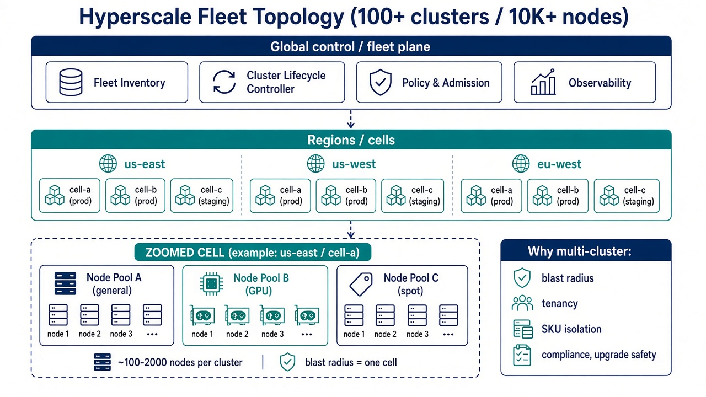
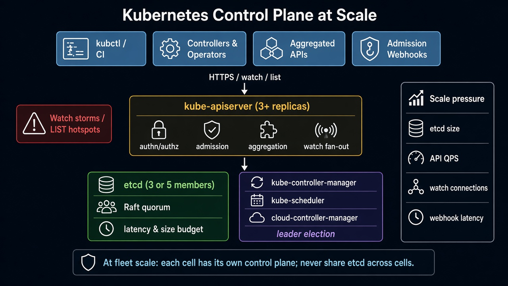

# Hyperscale Prep — Living One-Pager

Job target: **operate large-scale compute at hyperscale (100+ clusters, 10K+ nodes)** — plus K8s internals, cloud/cluster networking, security, Terraform/Atlantis, Temporal/Argo, and design tradeoffs.

This doc accumulates daily lessons. Read newest-first for interviews; skim older lessons for the mental model chain.

---

> **Superseded for reading:** canonical lessons are on the docs site — [Lesson 1](https://caretak3r.github.io/hyperscale-prep/lessons/01-hyperscale-mental-model/), [Lesson 2](https://caretak3r.github.io/hyperscale-prep/lessons/02-k8s-control-plane/). This file is kept as a flat archive.

## Lesson 1 — Hyperscale mental model: 100+ clusters / 10K+ nodes
*2026-09-08 · refreshed 2026-09-10*

### What the requirement actually means (operator view)

Interviewers saying “100+ clusters / 10K+ nodes” are not asking if you can `kubectl get nodes` on a big GKE cluster. They are asking whether you have **run a fleet under partial failure**: many independent control planes, continuous node death, and automation that treats clusters as cattle — not pets you SSH into.

I have woken up to dashboards where **three cells were red, twelve were yellow, and the fleet was still fine** because capacity headroom and cell isolation were designed that way. That is the bar.

| Scale band | Rough size | What breaks first |
|---|---|---|
| Single cluster | 1–200 nodes | App config, quotas |
| Large cluster | 500–5,000 nodes | etcd / API server hotspots, CNI scale, kubelet chatter |
| **Hyperscale fleet** | **100+ clusters, 10K–100K+ nodes** | **Fleet lifecycle, blast radius, multi-region networking, identity, change management** |

At hyperscale, the unit of thinking shifts from **pod** → **cluster (cell)** → **fleet**.

### Core diagram: fleet topology



**Read the diagram top-down:**
1. **Fleet plane** — inventory, lifecycle, policy, observability across *all* clusters. This is where you page, not into a random bastion.
2. **Regions / cells** — many small(ish) clusters instead of one mega-cluster. A cell is a blast-radius boundary.
3. **Inside a cell** — node pools by SKU (general, GPU, spot); noisy neighbors stop at the pool or the cell, not the company.

### Why not one giant cluster? (what I tell architects)

| Pressure | One mega-cluster | Many cells (hyperscale pattern) |
|---|---|---|
| Blast radius | Control-plane outage = everything | Outage contained to one cell |
| Upgrades | Global freeze or risky rolling | Canary a cell, then wave rollout |
| Tenancy / compliance | Hard isolation boundaries | Separate clusters for PCI, prod, sandbox |
| SKU mix | Noisy neighbors (GPU vs general) | Dedicated pools/clusters |
| API scale | etcd & watch storms | Each control plane stays “human-sized” |
| Debugging | One huge haystack | Scope to cell + fleet inventory labels |

**Rule of thumb:** prefer **more clusters that are boring** over fewer clusters that are heroic. Heroic clusters create heroic outages.

### Idiosyncrasies you only learn in production

- **Cell size is a product decision, not a kube default.** I have seen teams aim for ~200–800 nodes/cell so etcd stays under a few GB and upgrade windows fit a night. GPU cells often smaller because driver/NPD noise is higher.
- **Naming is an API.** `use1-prod-cell-07` beats `cluster-blue`. Encode region, env, purpose, generation — your paging, Terraform state, and CI matrices all hang off it.
- **CIDR planning is fleet work.** Overlap pod CIDRs across cells and you cannot do east-west without NAT hell. Reserve supernets per region; allocate per cell from a registry (IPAM as a service).
- **Spot/preemptible pools lie about capacity.** At 10K nodes, “max: 2000 spot” is marketing until you model AZ supply and interruption rate. Keep on-demand floor capacity per critical workload class.
- **Fleet inventory drifts.** Cloud consoles, Cluster API, and homegrown CMDB disagree. The source of truth must be reconciler-driven (desired Cluster CR → actual cloud resources), not a spreadsheet.
- **“Cluster Ready” ≠ “serving traffic.”** Control plane healthy while CNI, DNS, or node-problem-detector is wedged is a classic false green. Gate readiness on a synthetic probe Deployment + SLO, not just `kubectl get --raw='/readyz'`.

### Concrete commands & config (operator muscle memory)

```bash
# --- Fleet inventory sanity (Cluster API example) ---
kubectl get clusters.cluster.x-k8s.io -A -o wide
kubectl get machinedeployments,machines -A \
  -l cluster.x-k8s.io/cluster-name=use1-prod-cell-a

# How many nodes per cell, labeled the way paging expects
kubectl get nodes -L topology.kubernetes.io/zone,node.kubernetes.io/instance-type,node-pool \
  --context use1-prod-cell-a | awk 'NR>1 {z[$3]++; n++} END {print "nodes",n; for (i in z) print i,z[i]}'

# Spot interruption / NotReady burn (last hour) — adjust LogQL/PromQL to your stack
# Prometheus: rate of NotReady
# sum(rate(kube_node_status_condition{condition="Ready",status="false"}[15m])) by (cluster)

# Cap a bad rollout: cordon a canary cell's worker pools without touching control plane
kubectl cordon -l node-pool=general --context use1-prod-cell-canary
kubectl get nodes -l node-pool=general --context use1-prod-cell-canary

# Synthetic readiness: does DNS + a probe Deployment still work?
kubectl -n fleet-probes get deploy/probe --context use1-prod-cell-a
kubectl -n fleet-probes rollout status deploy/probe --timeout=60s --context use1-prod-cell-a
```

```yaml
# Conceptual fleet inventory — what a lifecycle system tracks
apiVersion: fleet.example.com/v1
kind: Cluster
metadata:
  name: use1-prod-cell-a
  labels:
    region: us-east-1
    env: prod
    purpose: general-compute
    cell: "a"
spec:
  region: us-east-1
  environment: prod
  purpose: general-compute   # vs gpu | batch | sandbox
  kubernetesVersion: "1.30"
  networking:
    cni: cilium
    # Allocated from regional supernet registry — never ad hoc
    podCidr: 10.40.0.0/16
    serviceCidr: 10.96.0.0/16
  nodePools:
    - name: general
      min: 50
      max: 800
      instanceType: m7i.4xlarge
      capacityType: on-demand
    - name: spot-batch
      min: 0
      max: 2000
      instanceType: m7i.2xlarge
      capacityType: spot
  readiness:
    # Don't trust control-plane Ready alone
    requireSyntheticProbe: true
    maxNotReadyFraction: 0.05
status:
  phase: Ready
  nodeCount: 612
  controlPlaneHealthy: true
  syntheticProbeHealthy: true
  lastUpgrade: "2026-09-01T04:00:00Z"
  lastUpgradeCellWave: "2026-09-01-wave-2"
```

Map this in interviews to **Cluster API**, GKE Fleet / Anthos, EKS + custom controllers, or an internal Borg/Omega-style allocator. The CR shape matters less than: **desired state, reconciliation, readiness beyond apiserver**.

### Failure is the steady state

At 10K+ nodes you should assume:

- Nodes die every day (hardware, preemption, kernel panics).
- A region or AZ degrades while others are fine.
- A bad rollout hits **some** cells first (if your pipeline is correct).
- Humans cannot SSH-and-fix; **controllers + runbooks + SLOs** are the product.

Design for **partial failure**: retries with jitter, zone-aware scheduling, multi-cell capacity headroom, and clear ownership of “who pages when cell-17’s API server is wedged.”

### Failures & fixes

| Symptom | Likely root cause | Fix / mitigation |
|---|---|---|
| Pager: 15% nodes NotReady in one cell; fleet SLO still green | AZ brownout or bad node image rolled to one MachineDeployment | Confirm zone skew (`kubectl get nodes -L topology.kubernetes.io/zone`); pause MD rollout; cordon/drain bad wave; roll back AMI/image; keep other cells serving |
| “Cluster Ready” in inventory but apps 5xx | Synthetic probe / CoreDNS / CNI broken while apiserver healthy | Gate fleet Ready on probe Deploy + DNS; check `cilium status` / `kubectl -n kube-system get pods`; do not auto-promote cell into serving pool |
| Upgrade wave stalls globally after cell-03 | Canary lacked production traffic shape; wave automation had no halt-on-error-budget | Progressive delivery: canary → 10% → 50% → rest; auto-halt on SLO burn; never “all cells Friday night” |
| Pod CIDR conflict after merging two regions’ clusters into a mesh | Ad-hoc CIDR allocation; no IPAM registry | Freeze new clusters; renumber offenders behind maintenance; enforce allocation API in Cluster CR validation webhook |
| Spot pool empty during market spike; batch backlog | Over-reliance on spot max without on-demand floor | Set min on-demand for latency-critical classes; fallback MachineDeployment; alert on pending pods by priority class |
| Two sources of truth: Terraform says 102 clusters, CAPI says 97 | Drift: manual cloud deletes, failed reconciles, orphaned state | Make reconciler authoritative; periodic audit job; block human console deletes in prod orgs |
| Identity outage: all cells reject deploy SA tokens | Central OIDC/IdP dependency without per-cell break-glass | Cache/JWKS strategy; emergency local cert admin kubeconfig in offline safe; document break-glass (Lesson 2 admission angle) |

### Interview soundbites (steal these)

1. **“Cluster = blast-radius boundary.”** I size cells so a control-plane or CNI incident doesn’t take the company down.
2. **“Fleet plane ≠ workload plane.”** Provisioning, policy, and observability are cross-cutting products; apps stay in cells.
3. **“Change is a pipeline, not a ticket.”** Progressive delivery across cells (canary → 10% → 50% → rest) with automatic halt on SLO burn.
4. **“Scale problems move up a layer.”** At 10K nodes the hard problems are identity, networking topology, and lifecycle automation — not “how do I schedule a pod.”
5. **“Ready means serving, not apiserver 200.”** I gate cell membership on synthetic probes and error budgets, not vanity health endpoints.

### How this maps to the rest of your JD

| JD theme | Where it sits on the diagram |
|---|---|
| K8s internals / provisioning | Inside each cell + lifecycle controller |
| Borg/Mesos-like | Fleet scheduling & multi-tenant isolation philosophy |
| Cloud networking | Between regions/cells (VPC, TGW, Interconnect, BGP) |
| Cilium / eBPF / mesh | Inside the zoomed cell (CNI + east-west) |
| Security / RBAC / PSS | Policy & admission on the fleet plane + per-cell |
| Terraform / Atlantis / Temporal / Argo | How the fleet plane *changes* safely |

### References

- [Large-scale cluster management at Google with Borg](https://research.google/pubs/pub43438/) — the classic “why cells / why Borg”
- [Omega: flexible, scalable schedulers](https://research.google/pubs/pub41684/) — shared-state vs monolithic schedulers
- [Kubernetes scalability thresholds](https://kubernetes.io/docs/setup/best-practices/cluster-large/) — official large-cluster guidance
- [Cluster API book](https://cluster-api.sigs.k8s.io/) — declarative cluster lifecycle (industry pattern for fleets)
- [Google SRE Book — Embracing Risk](https://sre.google/sre-book/embracing-risk/) — error budgets as the language of hyperscale change
- [GKE Fleet management](https://cloud.google.com/kubernetes-engine/docs/fleets-overview) — multi-cluster fleet plane in the wild

### Quick self-check

If someone asks: *“Would you run 10K nodes in one cluster or fifty clusters of ~200?”* — answer with **blast radius, upgrade safety, API server/etcd load, tenancy, CIDR/IPAM, and how you’d measure before deciding** (watch count, etcd DB size, NotReady burn rate, error budget). Then say you’d still keep a **fleet plane** either way.

---

## Lesson 2 — Kubernetes control plane internals at scale
*2026-09-09 · refreshed 2026-09-10*

### What interviewers are really probing

At hyperscale they do not want a textbook list of `kube-apiserver` / `etcd` / `scheduler`. They want to know whether you understand **where latency and failure concentrate**, how **watches and LISTs** become denial-of-service, why **admission webhooks tax every write**, and why **each cell owns its own control plane**.

I have chased “mysterious” scheduler backlog that was actually **etcd fsync latency from a noisy neighbor on the control-plane disks**, and “RBAC outage” that was a **stuck validating webhook** with fail-closed. Those stories are what separate operators from cert-memorizers.

| Component | Job | What breaks at scale |
|---|---|---|
| **kube-apiserver** | Front door: authn/authz, admission, aggregation, watch fan-out | Watch storms, webhook timeouts, LIST of huge collections, APF saturation |
| **etcd** | Strongly consistent store (Raft) | Size growth, slow fsync, quorum loss, compaction debt, NOSPACE |
| **kube-controller-manager** | Reconciliation loops (Deployments, Endpoints, …) | Stampeding requeues, leader election flaps, deep workqueues |
| **kube-scheduler** | Bind pods → nodes | Queue depth, plugin latency, unschedulable backlog, preemption storms |
| **cloud-controller-manager** | Cloud LB/routes/nodes | Cloud API rate limits, stale node objects, partial route programming |

### Core diagram: control plane under pressure



**Read it top-down:** clients and operators hammer the API server; HA apiservers share one etcd quorum; controllers/scheduler leader-elect. The right rail is your **scale budget** — etcd size, API QPS, watch count, webhook p99.

### The request path (know this cold)

```
Client (kubectl / controller / webhook caller)
  → TLS + authn (certs, OIDC, webhook tokens)
  → authz (RBAC / Node / ABAC)
  → mutating admission → validating admission (incl. webhooks)
  → etcd write OR served from watch cache
  → watch notifications fan out to subscribers
```

**Interview trap:** people say “everything goes to etcd.” Reads at steady state are mostly served from the **apiserver watch cache**. etcd is the source of truth and the write bottleneck; watch fan-out is the read-scale amplifier. A `LIST` without `resourceVersion` (or with `resourceVersion=0` semantics that force etcd) is how you DDoS yourself.

### etcd: the hard ceiling

| Budget | Typical target (per cell) | Why it matters |
|---|---|---|
| DB size | Keep well under ~8 GB practical; alarm earlier (e.g. 2–4 GB) | Compaction + defrag cost; restore time = RTO |
| Latency | p99 apply / commit in low ms | Scheduler & controllers stall when etcd slows |
| Members | 3 (common) or 5 (stricter quorum) | Never even count; never share across cells |
| Objects | Prefer many small objects carefully; avoid giant Secrets/ConfigMaps | One huge object = expensive revisions & bandwidth |
| Snapshots | Automated, tested restore, off-box | Untested backup is fiction |

```bash
# Operator muscle memory — etcd health & size (self-hosted; managed K8s: vendor metrics)
export ETCDCTL_API=3
etcdctl --endpoints="$ENDPOINTS" endpoint health --cluster
etcdctl --endpoints="$ENDPOINTS" endpoint status -w table
etcdctl --endpoints="$ENDPOINTS" alarm list
etcdctl --endpoints="$ENDPOINTS" check perf   # only on idle/staging — can be invasive

# Compaction / defrag (understand before running in prod — follow your runbook)
# etcdctl compact <rev>
# etcdctl defrag --cluster

# Apiserver / flow control signals
kubectl get --raw='/readyz?verbose'
kubectl get --raw='/livez?verbose'
kubectl get flowschemas,prioritylevelconfigurations
kubectl get --raw='/metrics' | grep -E 'apiserver_request|etcd_request|apiserver_flowcontrol'

# Who is watching / listing hard? (metrics + audit)
# Look at: apiserver_current_watchers, apiserver_request_duration_seconds{verb="LIST|WATCH"}
kubectl top pods -n kube-system   # crude; prefer Prometheus on apiserver/etcd
```

**Fleet rule from Lesson 1, restated in control-plane terms:** one etcd quorum per cell. Sharing etcd across “clusters” couples blast radius and upgrade freezes.

### Watches, LISTs, and how you DDoS yourself

```yaml
# Bad: every custom controller does a full LIST + resync every 30s on a huge CRD
# Good: shared informers, long-lived watches, bounded workqueues, client-side rate limits
apiVersion: apps/v1
kind: Deployment
metadata:
  name: fleet-operator
spec:
  template:
    spec:
      containers:
      - name: manager
        args:
        - --kube-api-qps=20
        - --kube-api-burst=40
        # Prefer informers over raw LIST loops; tune resyncPeriod high (hours, not seconds)
        # Enable client-go prioritization / APF-aware behavior where available
```

```yaml
# Admission webhook: treat p99 like apiserver SLO
apiVersion: admissionregistration.k8s.io/v1
kind: ValidatingWebhookConfiguration
metadata:
  name: policy-guard
webhooks:
  - name: guard.example.com
    failurePolicy: Fail   # or Ignore — explicit product decision, document it
    timeoutSeconds: 3     # never leave default 10s hanging over every write
    sideEffects: None
    admissionReviewVersions: ["v1"]
    clientConfig:
      service:
        name: policy-guard
        namespace: admission
        path: /validate
    rules:
      - apiGroups: [""]
        apiVersions: ["v1"]
        operations: ["CREATE", "UPDATE"]
        resources: ["pods"]
        scope: Namespaced
```

**Hotspots I’ve hit:**
1. **Watch storms** — thousands of clients reconnect after an apiserver bounce → thundering herd; mitigate with APF, staggered reconnects, enough apiserver replicas.
2. **LIST without cache-friendly resourceVersion** — bypasses watch cache; hits etcd hard.
3. **Admission webhooks** — sync path on every create/update; a slow webhook = global latency tax; fail-closed wedges deploys; fail-open can wedge security.
4. **Aggregated APIs** — extra hop; misbehaving extension API can wedge perceived control-plane health.
5. **Leader election flaps** — overloaded control-plane nodes or etcd latency → controllers thrash; looks like “Deployments not rolling.”
6. **Huge Endpoints / uncapped watches on Secrets** — classic etcd size and bandwidth killers; prefer EndpointSlices; don’t mount giant config blobs.

### HA shape you should draw on a whiteboard

```
        LB / kube-vip / cloud ILB
               │
     ┌─────────┼─────────┐
  apiserver  apiserver  apiserver     ← stateless-ish; scales horizontally
     └─────────┬─────────┘
               │
         etcd (3|5)                   ← stateful; scales carefully, not freely
               │
   controller-manager + scheduler     ← active/standby via leader election
   (+ cloud-controller-manager)
```

Horizontal scale: **more apiservers**. Vertical / careful scale: **etcd**. Controllers: usually **one active leader**, not “run 50 active managers.” Put etcd on dedicated disks (low latency SSD/NVMe); never share noisy disks with app workloads.

### Idiosyncrasies at scale

- **APF (API Priority and Fairness)** is not optional once you have many operators/controllers. Without it, a debug `kubectl get pods -A` from a CI job can starve controllers.
- **`--max-requests-inflight` / `--max-mutating-requests-inflight`** are blunt instruments; prefer APF queues with named PriorityLevels for system vs workload vs admin.
- **Watch cache can serve slightly stale reads.** Controllers that need linearizable reads must ask for them explicitly — know when “eventual” is wrong (e.g. some security decisions).
- **Managed control planes hide etcd, not the symptoms.** On GKE/EKS/AKS you still watch apiserver latency, webhook errors, and object counts — you just open a vendor ticket instead of SSH to etcd.
- **CRDs are forever until you migrate.** Conversion webhooks + large CustomResources amplify apiserver CPU; version and prune aggressively.
- **Scheduler plugins add latency.** Custom plugins that call external APIs on every pod = death. Keep filter/score pure and fast.

### Failures & fixes

| Symptom | Likely root cause | Fix / mitigation |
|---|---|---|
| Apiserver p99 spike after onboarding ~40 operators / new controllers | Watch count explosion; LIST storms; APF default queue saturated | Inspect watch metrics & audit verb=LIST; enforce client QPS; shared informers; tune FlowSchemas; add apiserver replicas |
| Deploys hang; `kubectl apply` times out; pods not created | Validating/mutating webhook down or slow; `failurePolicy: Fail` | Check webhook Endpoints/pods; raise timeout carefully or break-glass Ignore with audit; page webhook owners; never leave timeout at 10s casually |
| Scheduler backlog; pending pods climb; CPU fine on workers | etcd commit latency / control-plane disk; or scheduler plugin latency | etcd `endpoint status`, disk iowait; move etcd to dedicated volumes; profile scheduler plugins; check unschedulable reasons |
| Controllers “randomly” stop reconciling for minutes | Leader election loss from apiserver/etcd blips | Stabilize etcd; tune lease durations carefully; ensure only one active CCM/KCM; alert on leader changes |
| etcd `NOSPACE` / DB > alarm threshold | Compaction not running; giant objects; event spam | Compact + defrag per runbook; find large keys; fix Event floods; restore from snapshot if corrupted; raise alarms earlier next time |
| API Priority queues show `rejected` climbing for `workload-low` | CI / scrapers competing with system | Separate PriorityLevels; protect `kube-system` & leaders; rate-limit CI kubeconfigs; educate teams off `-A` LISTs |
| Post-upgrade: watch reconnect stampede, brief outage | Rolling apiserver without enough capacity for reconnect | Surge apiserver replicas before bounce; staggered shutdown; verify APF; soak canary cell first (Lesson 1 wave) |
| Cloud Node objects stale; routes missing | cloud-controller-manager rate-limited or wrong credentials | CCM logs; cloud API quotas; verify instance tags/VPC; don’t run two CCMs active |

### Interview soundbites (steal these)

1. **“Apiserver is horizontally scalable; etcd is the consistency bottleneck.”** I size cells so etcd stays boring.
2. **“Most reads are watch-cache hits; LIST-to-etcd is a smell.”** Operators must use informers and rate limits.
3. **“Admission webhooks sit on the synchronous path.”** I treat webhook p99 like apiserver SLO — fail-open vs fail-closed is a product decision with a break-glass runbook.
4. **“Control-plane outage is a blast-radius event.”** That’s why we run many cells instead of one heroic cluster (Lesson 1).
5. **“APF is the seatbelt.”** At fleet scale, unprotected apiservers get taken down by friendly fire from CI and custom controllers.

### How this maps to the JD

| JD theme | Control-plane angle |
|---|---|
| 100+ clusters / 10K+ nodes | Many independent control planes; fleet ops outside etcd |
| Cluster provisioning | Bootstrapping HA apiserver+etcd+CCM correctly |
| Borg/Mesos-like | Borgmaster ≈ control plane; cell ≈ Borg cell |
| Cilium / networking | Relies on watches of Pods/Services/EndpointSlices |
| Security | Authn/authz + admission is *the* policy chokepoint |
| Terraform / Temporal / Argo | Change the control plane via pipelines, not SSH |

### References

- [Kubernetes components](https://kubernetes.io/docs/concepts/overview/components/) — official control-plane map
- [etcd — performance & what to measure](https://etcd.io/docs/latest/op-guide/performance/) — fsync, snapshots, alarms
- [API Priority and Fairness](https://kubernetes.io/docs/concepts/cluster-administration/flow-control/) — protecting the apiserver under load
- [Watch / LIST consistency (SIG API Machinery)](https://github.com/kubernetes/community/blob/master/contributors/devel/sig-api-machinery/api-concepts.md) — LIST/WATCH semantics
- [Kube-apiserver admission webhooks](https://kubernetes.io/docs/reference/access-authn-authz/extensible-admission-controllers/) — sync path & failurePolicy
- [Borg paper](https://research.google/pubs/pub43438/) — cell + master design that inspired this architecture

### Quick self-check

If someone asks: *“Our apiserver p99 spiked after we onboarded 40 operators — what do you look at first?”* — answer **watch counts, LIST patterns, webhook latency, APF queues, etcd commit latency**, then how you’d shed load (rate limits, shared informers, fail/break-glass the worst webhook, surge apiservers, split the cell). Tie it back to Lesson 1: **maybe this cell is too big**.

---

*Next up (Lesson 3): Cluster provisioning & lifecycle systems.*
