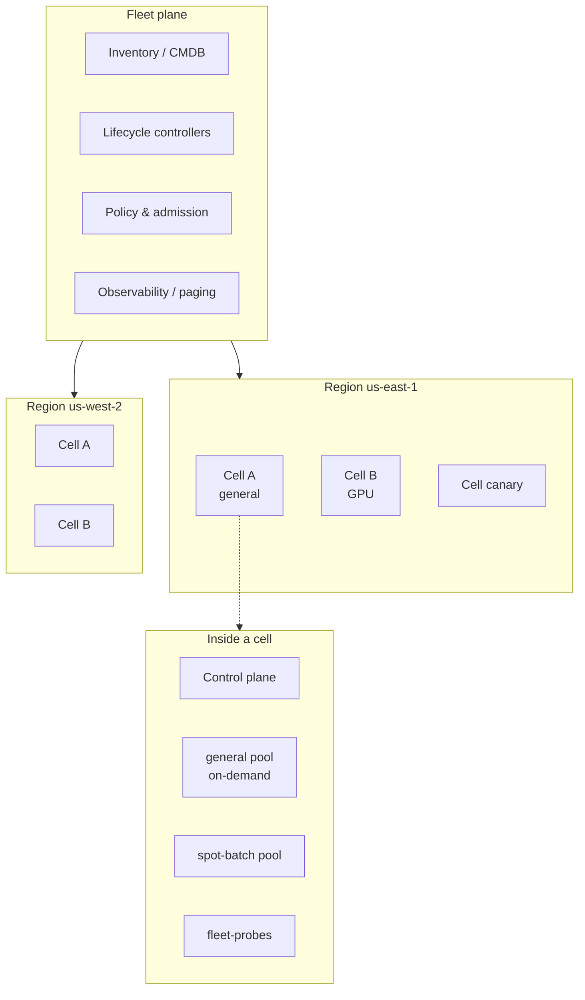

# Lesson 1 — Hyperscale mental model: 100+ clusters / 10K+ nodes

*2026-09-08 · refreshed 2026-09-10*

## What the requirement actually means (operator view)

Interviewers saying “100+ clusters / 10K+ nodes” are not asking if you can `kubectl get nodes` on a big GKE cluster. They are asking whether you have **run a fleet under partial failure**: many independent control planes, continuous node death, and automation that treats clusters as cattle — not pets you SSH into.

I have woken up to dashboards where **three cells were red, twelve were yellow, and the fleet was still fine** because capacity headroom and cell isolation were designed that way. That is the bar.

| Scale band | Rough size | What breaks first |
|---|---|---|
| Single cluster | 1–200 nodes | App config, quotas |
| Large cluster | 500–5,000 nodes | etcd / API server hotspots, CNI scale, kubelet chatter |
| **Hyperscale fleet** | **100+ clusters, 10K–100K+ nodes** | **Fleet lifecycle, blast radius, multi-region networking, identity, change management** |

At hyperscale, the unit of thinking shifts from **pod** → **cluster (cell)** → **fleet**.

## Core diagram: fleet topology




**Read the diagram top-down:**

1. **Fleet plane** — inventory, lifecycle, policy, observability across *all* clusters. This is where you page, not into a random bastion.
2. **Regions / cells** — many small(ish) clusters instead of one mega-cluster. A cell is a blast-radius boundary.
3. **Inside a cell** — node pools by SKU (general, GPU, spot); noisy neighbors stop at the pool or the cell, not the company.

## Why not one giant cluster? (what I tell architects)

| Pressure | One mega-cluster | Many cells (hyperscale pattern) |
|---|---|---|
| Blast radius | Control-plane outage = everything | Outage contained to one cell |
| Upgrades | Global freeze or risky rolling | Canary a cell, then wave rollout |
| Tenancy / compliance | Hard isolation boundaries | Separate clusters for PCI, prod, sandbox |
| SKU mix | Noisy neighbors (GPU vs general) | Dedicated pools/clusters |
| API scale | etcd & watch storms | Each control plane stays “human-sized” |
| Debugging | One huge haystack | Scope to cell + fleet inventory labels |

**Rule of thumb:** prefer **more clusters that are boring** over fewer clusters that are heroic. Heroic clusters create heroic outages.

## Idiosyncrasies you only learn in production

- **Cell size is a product decision, not a kube default.** I have seen teams aim for ~200–800 nodes/cell so etcd stays under a few GB and upgrade windows fit a night. GPU cells often smaller because driver/NPD noise is higher.
- **Naming is an API.** `use1-prod-cell-07` beats `cluster-blue`. Encode region, env, purpose, generation — your paging, Terraform state, and CI matrices all hang off it.
- **CIDR planning is fleet work.** Overlap pod CIDRs across cells and you cannot do east-west without NAT hell. Reserve supernets per region; allocate per cell from a registry (IPAM as a service).
- **Spot/preemptible pools lie about capacity.** At 10K nodes, “max: 2000 spot” is marketing until you model AZ supply and interruption rate. Keep on-demand floor capacity per critical workload class.
- **Fleet inventory drifts.** Cloud consoles, Cluster API, and homegrown CMDB disagree. The source of truth must be reconciler-driven (desired Cluster CR → actual cloud resources), not a spreadsheet.
- **“Cluster Ready” ≠ “serving traffic.”** Control plane healthy while CNI, DNS, or node-problem-detector is wedged is a classic false green. Gate readiness on a synthetic probe Deployment + SLO, not just `kubectl get --raw='/readyz'`.

## Concrete commands & config (operator muscle memory)

```bash
# --- Fleet inventory sanity (Cluster API example) ---
kubectl get clusters.cluster.x-k8s.io -A -o wide
kubectl get machinedeployments,machines -A \
  -l cluster.x-k8s.io/cluster-name=use1-prod-cell-a

# How many nodes per cell, labeled the way paging expects
kubectl get nodes -L topology.kubernetes.io/zone,node.kubernetes.io/instance-type,node-pool \
  --context use1-prod-cell-a | awk 'NR>1 {z[$3]++; n++} END {print "nodes",n; for (i in z) print i,z[i]}'

# Spot interruption / NotReady burn (last hour) — adjust LogQL/PromQL to your stack
# Prometheus: rate of NotReady
# sum(rate(kube_node_status_condition{condition="Ready",status="false"}[15m])) by (cluster)

# Cap a bad rollout: cordon a canary cell's worker pools without touching control plane
kubectl cordon -l node-pool=general --context use1-prod-cell-canary
kubectl get nodes -l node-pool=general --context use1-prod-cell-canary

# Synthetic readiness: does DNS + a probe Deployment still work?
kubectl -n fleet-probes get deploy/probe --context use1-prod-cell-a
kubectl -n fleet-probes rollout status deploy/probe --timeout=60s --context use1-prod-cell-a
```

```yaml
# Conceptual fleet inventory — what a lifecycle system tracks
apiVersion: fleet.example.com/v1
kind: Cluster
metadata:
  name: use1-prod-cell-a
  labels:
    region: us-east-1
    env: prod
    purpose: general-compute
    cell: "a"
spec:
  region: us-east-1
  environment: prod
  purpose: general-compute   # vs gpu | batch | sandbox
  kubernetesVersion: "1.30"
  networking:
    cni: cilium
    # Allocated from regional supernet registry — never ad hoc
    podCidr: 10.40.0.0/16
    serviceCidr: 10.96.0.0/16
  nodePools:
    - name: general
      min: 50
      max: 800
      instanceType: m7i.4xlarge
      capacityType: on-demand
    - name: spot-batch
      min: 0
      max: 2000
      instanceType: m7i.2xlarge
      capacityType: spot
  readiness:
    # Don't trust control-plane Ready alone
    requireSyntheticProbe: true
    maxNotReadyFraction: 0.05
status:
  phase: Ready
  nodeCount: 612
  controlPlaneHealthy: true
  syntheticProbeHealthy: true
  lastUpgrade: "2026-09-01T04:00:00Z"
  lastUpgradeCellWave: "2026-09-01-wave-2"
```

Map this in interviews to **Cluster API**, GKE Fleet / Anthos, EKS + custom controllers, or an internal Borg/Omega-style allocator. The CR shape matters less than: **desired state, reconciliation, readiness beyond apiserver**.

## Failure is the steady state

At 10K+ nodes you should assume:

- Nodes die every day (hardware, preemption, kernel panics).
- A region or AZ degrades while others are fine.
- A bad rollout hits **some** cells first (if your pipeline is correct).
- Humans cannot SSH-and-fix; **controllers + runbooks + SLOs** are the product.

Design for **partial failure**: retries with jitter, zone-aware scheduling, multi-cell capacity headroom, and clear ownership of “who pages when cell-17’s API server is wedged.”

## Failures & fixes

| Symptom | Likely root cause | Fix / mitigation |
|---|---|---|
| Pager: 15% nodes NotReady in one cell; fleet SLO still green | AZ brownout or bad node image rolled to one MachineDeployment | Confirm zone skew (`kubectl get nodes -L topology.kubernetes.io/zone`); pause MD rollout; cordon/drain bad wave; roll back AMI/image; keep other cells serving |
| “Cluster Ready” in inventory but apps 5xx | Synthetic probe / CoreDNS / CNI broken while apiserver healthy | Gate fleet Ready on probe Deploy + DNS; check `cilium status` / `kubectl -n kube-system get pods`; do not auto-promote cell into serving pool |
| Upgrade wave stalls globally after cell-03 | Canary lacked production traffic shape; wave automation had no halt-on-error-budget | Progressive delivery: canary → 10% → 50% → rest; auto-halt on SLO burn; never “all cells Friday night” |
| Pod CIDR conflict after merging two regions’ clusters into a mesh | Ad-hoc CIDR allocation; no IPAM registry | Freeze new clusters; renumber offenders behind maintenance; enforce allocation API in Cluster CR validation webhook |
| Spot pool empty during market spike; batch backlog | Over-reliance on spot max without on-demand floor | Set min on-demand for latency-critical classes; fallback MachineDeployment; alert on pending pods by priority class |
| Two sources of truth: Terraform says 102 clusters, CAPI says 97 | Drift: manual cloud deletes, failed reconciles, orphaned state | Make reconciler authoritative; periodic audit job; block human console deletes in prod orgs |
| Identity outage: all cells reject deploy SA tokens | Central OIDC/IdP dependency without per-cell break-glass | Cache/JWKS strategy; emergency local cert admin kubeconfig in offline safe; document break-glass (Lesson 2 admission angle) |

## Security & hardening

At fleet scale, **blast-radius isolation is a security control**, not only an availability story. A compromised cell, leaked deploy SA, or poisoned admission webhook should not become a company-wide incident — that is why cells exist.

| Control | Operator practice |
|---|---|
| Cell as blast radius | Separate control planes, CIDRs, and identity trust domains per cell |
| Least privilege across cells | No shared “god” cluster admin; fleet plane SAs scoped per cell / per action |
| Secrets posture | Secrets never live in a shared mgmt “god” cluster as the only copy; break-glass is offline + audited |
| Tenancy split | Prod vs sandbox (and often training vs serving) on separate orgs / projects / TGW route tables |

```bash
# Inventory: which identities can mutate every cell? (smell = one SA everywhere)
kubectl --context fleet-mgmt get clusterrolebindings -o wide
# Prefer per-cell RoleBindings + short-lived OIDC tokens over long-lived shared kubeconfigs
```

**AI/ML fleets:** treat model-weight buckets, checkpoint stores, and GPU node pools as high-value tenancy. Sandbox training cells must not share pull credentials or registry write paths with prod inference cells — isolate weights/checkpoints/images the same way you isolate blast radius.

## Interview soundbites (steal these)

1. **“Cluster = blast-radius boundary.”** I size cells so a control-plane or CNI incident doesn’t take the company down.
2. **“Fleet plane ≠ workload plane.”** Provisioning, policy, and observability are cross-cutting products; apps stay in cells.
3. **“Change is a pipeline, not a ticket.”** Progressive delivery across cells (canary → 10% → 50% → rest) with automatic halt on SLO burn.
4. **“Scale problems move up a layer.”** At 10K nodes the hard problems are identity, networking topology, and lifecycle automation — not “how do I schedule a pod.”
5. **“Ready means serving, not apiserver 200.”** I gate cell membership on synthetic probes and error budgets, not vanity health endpoints.

## How this maps to the rest of your JD

| JD theme | Where it sits on the diagram |
|---|---|
| K8s internals / provisioning | Inside each cell + lifecycle controller |
| Borg/Mesos-like | Fleet scheduling & multi-tenant isolation philosophy |
| Cloud networking | Between regions/cells (VPC, TGW, Interconnect, BGP) |
| Cilium / eBPF / mesh | Inside the zoomed cell (CNI + east-west) |
| Security / RBAC / PSS | Policy & admission on the fleet plane + per-cell |
| Terraform / Atlantis / Temporal / Argo | How the fleet plane *changes* safely |

## Watch (talks & demos)

Real-world talks and demos that map to this lesson — watch after the Failures & fixes table.

### Cluster Management at Google with Borg — John Wilkes (GOTO 2016)

Cells, Borglets, partial failure, and why “more boring clusters” is a product decision — the vocabulary behind Lesson 1.

<iframe width="100%" height="360" src="https://www.youtube.com/embed/0W49z8hVn0k" title="Cluster Management at Google with Borg — John Wilkes (GOTO 2016)" frameBorder="0" allow="accelerometer; autoplay; clipboard-write; encrypted-media; gyroscope; picture-in-picture; web-share" allowFullScreen></iframe>

[Open on YouTube](https://www.youtube.com/watch?v=0W49z8hVn0k)

### Complexities of Capacity Management for Distributed Services — Google SRE Tech Talk

How SREs provision and plan capacity across large distributed services; pairs with fleet headroom and cell sizing.

<iframe width="100%" height="360" src="https://www.youtube.com/embed/pOo0oKNM9I8" title="Complexities of Capacity Management for Distributed Services — Google SRE Tech Talk" frameBorder="0" allow="accelerometer; autoplay; clipboard-write; encrypted-media; gyroscope; picture-in-picture; web-share" allowFullScreen></iframe>

[Open on YouTube](https://www.youtube.com/watch?v=pOo0oKNM9I8)

## References

- [Large-scale cluster management at Google with Borg](https://research.google/pubs/pub43438/) — the classic “why cells / why Borg”
- [Omega: flexible, scalable schedulers](https://research.google/pubs/pub41684/) — shared-state vs monolithic schedulers
- [Kubernetes scalability thresholds](https://kubernetes.io/docs/setup/best-practices/cluster-large/) — official large-cluster guidance
- [Cluster API book](https://cluster-api.sigs.k8s.io/) — declarative cluster lifecycle (industry pattern for fleets)
- [Google SRE Book — Embracing Risk](https://sre.google/sre-book/embracing-risk/) — error budgets as the language of hyperscale change
- [GKE Fleet management](https://cloud.google.com/kubernetes-engine/docs/fleets-overview) — multi-cluster fleet plane in the wild

## Quick self-check

If someone asks: *“Would you run 10K nodes in one cluster or fifty clusters of ~200?”* — answer with **blast radius, upgrade safety, API server/etcd load, tenancy, CIDR/IPAM, and how you’d measure before deciding** (watch count, etcd DB size, NotReady burn rate, error budget). Then say you’d still keep a **fleet plane** either way.

---

**Next:** [Lesson 2 — Kubernetes control plane internals at scale](/lessons/02-k8s-control-plane)
