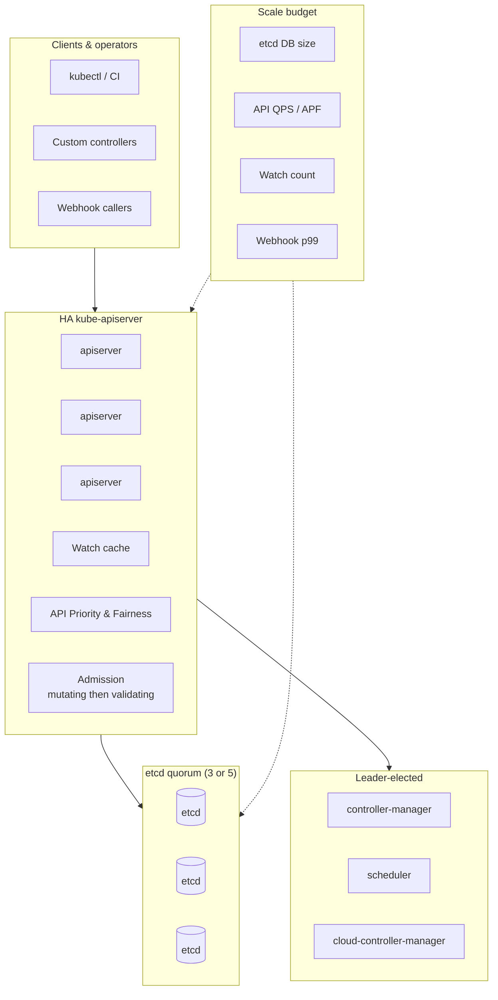
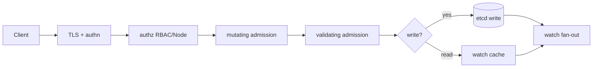
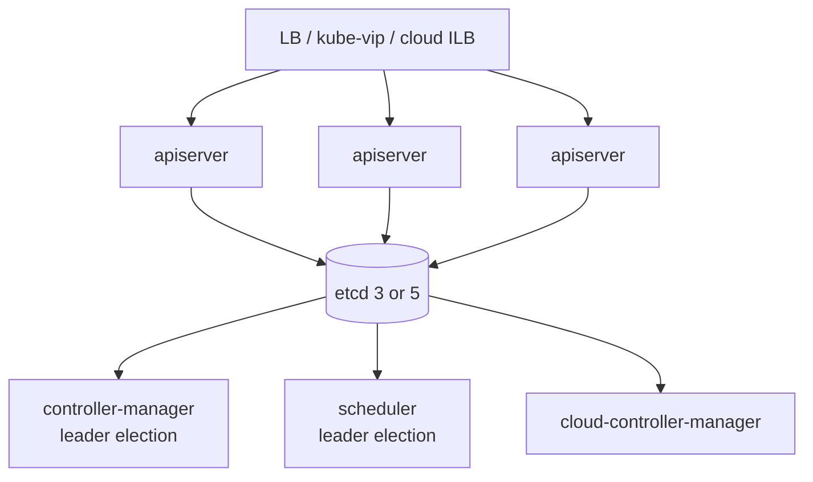

# Lesson 2 — Kubernetes control plane internals at scale

*2026-09-09 · refreshed 2026-09-10*

## What interviewers are really probing

At hyperscale they do not want a textbook list of `kube-apiserver` / `etcd` / `scheduler`. They want to know whether you understand **where latency and failure concentrate**, how **watches and LISTs** become denial-of-service, why **admission webhooks tax every write**, and why **each cell owns its own control plane**.

I have chased “mysterious” scheduler backlog that was actually **etcd fsync latency from a noisy neighbor on the control-plane disks**, and “RBAC outage” that was a **stuck validating webhook** with fail-closed. Those stories are what separate operators from cert-memorizers.

| Component | Job | What breaks at scale |
|---|---|---|
| **kube-apiserver** | Front door: authn/authz, admission, aggregation, watch fan-out | Watch storms, webhook timeouts, LIST of huge collections, APF saturation |
| **etcd** | Strongly consistent store (Raft) | Size growth, slow fsync, quorum loss, compaction debt, NOSPACE |
| **kube-controller-manager** | Reconciliation loops (Deployments, Endpoints, …) | Stampeding requeues, leader election flaps, deep workqueues |
| **kube-scheduler** | Bind pods → nodes | Queue depth, plugin latency, unschedulable backlog, preemption storms |
| **cloud-controller-manager** | Cloud LB/routes/nodes | Cloud API rate limits, stale node objects, partial route programming |

## Core diagram: control plane under pressure




**Read it top-down:** clients and operators hammer the API server; HA apiservers share one etcd quorum; controllers/scheduler leader-elect. The right rail is your **scale budget** — etcd size, API QPS, watch count, webhook p99.

## The request path (know this cold)



**Interview trap:** people say “everything goes to etcd.” Reads at steady state are mostly served from the **apiserver watch cache**. etcd is the source of truth and the write bottleneck; watch fan-out is the read-scale amplifier. A `LIST` without `resourceVersion` (or with `resourceVersion=0` semantics that force etcd) is how you DDoS yourself.

## etcd: the hard ceiling

| Budget | Typical target (per cell) | Why it matters |
|---|---|---|
| DB size | Keep well under ~8 GB practical; alarm earlier (e.g. 2–4 GB) | Compaction + defrag cost; restore time = RTO |
| Latency | p99 apply / commit in low ms | Scheduler & controllers stall when etcd slows |
| Members | 3 (common) or 5 (stricter quorum) | Never even count; never share across cells |
| Objects | Prefer many small objects carefully; avoid giant Secrets/ConfigMaps | One huge object = expensive revisions & bandwidth |
| Snapshots | Automated, tested restore, off-box | Untested backup is fiction |

```bash
# Operator muscle memory — etcd health & size (self-hosted; managed K8s: vendor metrics)
export ETCDCTL_API=3
etcdctl --endpoints="$ENDPOINTS" endpoint health --cluster
etcdctl --endpoints="$ENDPOINTS" endpoint status -w table
etcdctl --endpoints="$ENDPOINTS" alarm list
etcdctl --endpoints="$ENDPOINTS" check perf   # only on idle/staging — can be invasive

# Compaction / defrag (understand before running in prod — follow your runbook)
# etcdctl compact <rev>
# etcdctl defrag --cluster

# Apiserver / flow control signals
kubectl get --raw='/readyz?verbose'
kubectl get --raw='/livez?verbose'
kubectl get flowschemas,prioritylevelconfigurations
kubectl get --raw='/metrics' | grep -E 'apiserver_request|etcd_request|apiserver_flowcontrol'

# Who is watching / listing hard? (metrics + audit)
# Look at: apiserver_current_watchers, apiserver_request_duration_seconds{verb="LIST|WATCH"}
kubectl top pods -n kube-system   # crude; prefer Prometheus on apiserver/etcd
```

**Fleet rule from Lesson 1, restated in control-plane terms:** one etcd quorum per cell. Sharing etcd across “clusters” couples blast radius and upgrade freezes.

## Watches, LISTs, and how you DDoS yourself

```yaml
# Bad: every custom controller does a full LIST + resync every 30s on a huge CRD
# Good: shared informers, long-lived watches, bounded workqueues, client-side rate limits
apiVersion: apps/v1
kind: Deployment
metadata:
  name: fleet-operator
spec:
  template:
    spec:
      containers:
      - name: manager
        args:
        - --kube-api-qps=20
        - --kube-api-burst=40
        # Prefer informers over raw LIST loops; tune resyncPeriod high (hours, not seconds)
        # Enable client-go prioritization / APF-aware behavior where available
```

```yaml
# Admission webhook: treat p99 like apiserver SLO
apiVersion: admissionregistration.k8s.io/v1
kind: ValidatingWebhookConfiguration
metadata:
  name: policy-guard
webhooks:
  - name: guard.example.com
    failurePolicy: Fail   # or Ignore — explicit product decision, document it
    timeoutSeconds: 3     # never leave default 10s hanging over every write
    sideEffects: None
    admissionReviewVersions: ["v1"]
    clientConfig:
      service:
        name: policy-guard
        namespace: admission
        path: /validate
    rules:
      - apiGroups: [""]
        apiVersions: ["v1"]
        operations: ["CREATE", "UPDATE"]
        resources: ["pods"]
        scope: Namespaced
```

**Hotspots I’ve hit:**

1. **Watch storms** — thousands of clients reconnect after an apiserver bounce → thundering herd; mitigate with APF, staggered reconnects, enough apiserver replicas.
2. **LIST without cache-friendly resourceVersion** — bypasses watch cache; hits etcd hard.
3. **Admission webhooks** — sync path on every create/update; a slow webhook = global latency tax; fail-closed wedges deploys; fail-open can wedge security.
4. **Aggregated APIs** — extra hop; misbehaving extension API can wedge perceived control-plane health.
5. **Leader election flaps** — overloaded control-plane nodes or etcd latency → controllers thrash; looks like “Deployments not rolling.”
6. **Huge Endpoints / uncapped watches on Secrets** — classic etcd size and bandwidth killers; prefer EndpointSlices; don’t mount giant config blobs.

## HA shape you should draw on a whiteboard



Horizontal scale: **more apiservers**. Vertical / careful scale: **etcd**. Controllers: usually **one active leader**, not “run 50 active managers.” Put etcd on dedicated disks (low latency SSD/NVMe); never share noisy disks with app workloads.

## Idiosyncrasies at scale

- **APF (API Priority and Fairness)** is not optional once you have many operators/controllers. Without it, a debug `kubectl get pods -A` from a CI job can starve controllers.
- **`--max-requests-inflight` / `--max-mutating-requests-inflight`** are blunt instruments; prefer APF queues with named PriorityLevels for system vs workload vs admin.
- **Watch cache can serve slightly stale reads.** Controllers that need linearizable reads must ask for them explicitly — know when “eventual” is wrong (e.g. some security decisions).
- **Managed control planes hide etcd, not the symptoms.** On GKE/EKS/AKS you still watch apiserver latency, webhook errors, and object counts — you just open a vendor ticket instead of SSH to etcd.
- **CRDs are forever until you migrate.** Conversion webhooks + large CustomResources amplify apiserver CPU; version and prune aggressively.
- **Scheduler plugins add latency.** Custom plugins that call external APIs on every pod = death. Keep filter/score pure and fast.

## Failures & fixes

| Symptom | Likely root cause | Fix / mitigation |
|---|---|---|
| Apiserver p99 spike after onboarding ~40 operators / new controllers | Watch count explosion; LIST storms; APF default queue saturated | Inspect watch metrics & audit verb=LIST; enforce client QPS; shared informers; tune FlowSchemas; add apiserver replicas |
| Deploys hang; `kubectl apply` times out; pods not created | Validating/mutating webhook down or slow; `failurePolicy: Fail` | Check webhook Endpoints/pods; raise timeout carefully or break-glass Ignore with audit; page webhook owners; never leave timeout at 10s casually |
| Scheduler backlog; pending pods climb; CPU fine on workers | etcd commit latency / control-plane disk; or scheduler plugin latency | etcd `endpoint status`, disk iowait; move etcd to dedicated volumes; profile scheduler plugins; check unschedulable reasons |
| Controllers “randomly” stop reconciling for minutes | Leader election loss from apiserver/etcd blips | Stabilize etcd; tune lease durations carefully; ensure only one active CCM/KCM; alert on leader changes |
| etcd `NOSPACE` / DB > alarm threshold | Compaction not running; giant objects; event spam | Compact + defrag per runbook; find large keys; fix Event floods; restore from snapshot if corrupted; raise alarms earlier next time |
| API Priority queues show `rejected` climbing for `workload-low` | CI / scrapers competing with system | Separate PriorityLevels; protect `kube-system` & leaders; rate-limit CI kubeconfigs; educate teams off `-A` LISTs |
| Post-upgrade: watch reconnect stampede, brief outage | Rolling apiserver without enough capacity for reconnect | Surge apiserver replicas before bounce; staggered shutdown; verify APF; soak canary cell first (Lesson 1 wave) |
| Cloud Node objects stale; routes missing | cloud-controller-manager rate-limited or wrong credentials | CCM logs; cloud API quotas; verify instance tags/VPC; don’t run two CCMs active |

## Interview soundbites (steal these)

1. **“Apiserver is horizontally scalable; etcd is the consistency bottleneck.”** I size cells so etcd stays boring.
2. **“Most reads are watch-cache hits; LIST-to-etcd is a smell.”** Operators must use informers and rate limits.
3. **“Admission webhooks sit on the synchronous path.”** I treat webhook p99 like apiserver SLO — fail-open vs fail-closed is a product decision with a break-glass runbook.
4. **“Control-plane outage is a blast-radius event.”** That’s why we run many cells instead of one heroic cluster (Lesson 1).
5. **“APF is the seatbelt.”** At fleet scale, unprotected apiservers get taken down by friendly fire from CI and custom controllers.

## How this maps to the JD

| JD theme | Control-plane angle |
|---|---|
| 100+ clusters / 10K+ nodes | Many independent control planes; fleet ops outside etcd |
| Cluster provisioning | Bootstrapping HA apiserver+etcd+CCM correctly |
| Borg/Mesos-like | Borgmaster ≈ control plane; cell ≈ Borg cell |
| Cilium / networking | Relies on watches of Pods/Services/EndpointSlices |
| Security | Authn/authz + admission is *the* policy chokepoint |
| Terraform / Temporal / Argo | Change the control plane via pipelines, not SSH |

## Watch (talks & demos)

Real-world talks and demos that map to this lesson — watch after the Failures & fixes table.

### Setting up Etcd with Kubernetes for Thousands of Nodes — KubeCon EU 2023

Datadog + Isovalent on etcd architecture, disk/network bottlenecks, LIST storms, and API Priority and Fairness at large node counts.

<iframe width="100%" height="360" src="https://www.youtube.com/embed/_Zhf_iJMqwE" title="Setting up Etcd with Kubernetes for Thousands of Nodes — KubeCon EU 2023" frameBorder="0" allow="accelerometer; autoplay; clipboard-write; encrypted-media; gyroscope; picture-in-picture; web-share" allowFullScreen></iframe>

[Open on YouTube](https://www.youtube.com/watch?v=_Zhf_iJMqwE)

### Secrets of Running Etcd — Marek Siarkowicz, Google (KubeCon NA 2023)

Production etcd reliability: compaction, quotas, performance myths, and what actually breaks at scale.

<iframe width="100%" height="360" src="https://www.youtube.com/embed/aJVMWcVZOPQ" title="Secrets of Running Etcd — Marek Siarkowicz, Google (KubeCon NA 2023)" frameBorder="0" allow="accelerometer; autoplay; clipboard-write; encrypted-media; gyroscope; picture-in-picture; web-share" allowFullScreen></iframe>

[Open on YouTube](https://www.youtube.com/watch?v=aJVMWcVZOPQ)

### Defusing the Kubernetes API Performance Minefield — KubeCon

Watch-cache, LIST without resourceVersion, and how bad controllers DDoS your apiserver.

<iframe width="100%" height="360" src="https://www.youtube.com/embed/SdLLOcNZN5E" title="Defusing the Kubernetes API Performance Minefield — KubeCon" frameBorder="0" allow="accelerometer; autoplay; clipboard-write; encrypted-media; gyroscope; picture-in-picture; web-share" allowFullScreen></iframe>

[Open on YouTube](https://www.youtube.com/watch?v=SdLLOcNZN5E)

## References

- [Kubernetes components](https://kubernetes.io/docs/concepts/overview/components/) — official control-plane map
- [etcd — performance & what to measure](https://etcd.io/docs/latest/op-guide/performance/) — fsync, snapshots, alarms
- [API Priority and Fairness](https://kubernetes.io/docs/concepts/cluster-administration/flow-control/) — protecting the apiserver under load
- [Watch / LIST consistency (SIG API Machinery)](https://github.com/kubernetes/community/blob/master/contributors/devel/sig-api-machinery/api-concepts.md) — LIST/WATCH semantics
- [Kube-apiserver admission webhooks](https://kubernetes.io/docs/reference/access-authn-authz/extensible-admission-controllers/) — sync path & failurePolicy
- [Borg paper](https://research.google/pubs/pub43438/) — cell + master design that inspired this architecture

## Quick self-check

If someone asks: *“Our apiserver p99 spiked after we onboarded 40 operators — what do you look at first?”* — answer **watch counts, LIST patterns, webhook latency, APF queues, etcd commit latency**, then how you’d shed load (rate limits, shared informers, fail/break-glass the worst webhook, surge apiservers, split the cell). Tie it back to Lesson 1: **maybe this cell is too big**.

---

**Previous:** [Lesson 1 — Hyperscale mental model](/lessons/01-hyperscale-mental-model)

**Next:** [Lesson 3 — Cluster provisioning & lifecycle](/lessons/03-cluster-provisioning-lifecycle)
