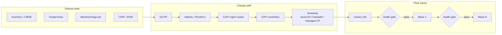
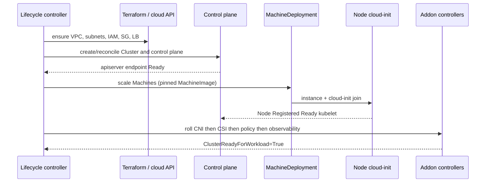
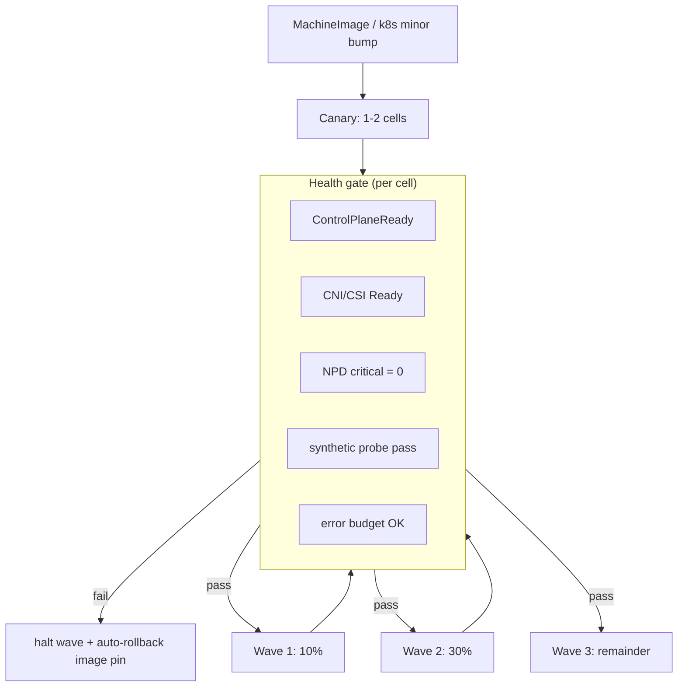

# Lesson 3 — Cluster provisioning & lifecycle systems

*2026-09-11*

## What interviewers are really probing

They are not asking whether you can click “Create cluster” in a cloud console. They want to know if you have **owned the machine that creates machines**: desired-state inventory → infra (VPC/subnets/IAM) → control plane bootstrap → node join → CNI/CSI/addons → **ready-for-workload**, with **canary cells and health-gated waves** so a bad MachineImage does not brick 100 clusters overnight.

I have watched a “simple AMI bump” strand half a region because node bootstrap raced ahead of the CNI DaemonSet and kubelets marked NotReady in a thundering herd. The fix was not more kubectl — it was a **lifecycle controller with gates**, pinned images, and a kill switch on the wave.

| Layer | Owns | Typical tools |
|---|---|---|
| **Desired state** | What a cell *should* be (SKU, CIDR, k8s version, addons) | CMDB / ClusterClaim CR / Terraform modules |
| **Infra plane** | VPC, subnets, IAM, LBs, KMS, disk encryption | Terraform + Atlantis / Crossplane |
| **Cluster plane** | Control plane + Machines | Cluster API (CAPI), managed (EKS/GKE/AKS), or kubeadm |
| **Bootstrap** | cloud-init, kubelet join, runtime | MachineImage + bootstrap provider |
| **Addons / day-2** | CNI, CSI, metrics, policy, ingress | Helm/Argo CD / addon controllers |
| **Fleet waves** | Order, health gates, rollback | Temporal / Argo Workflows / custom Lifecycle controller |

## Core diagram: provisioning pipeline




**Read left → right:** you never “SSH and kubeadm init” at fleet scale. You declare a cell, merge a PR, let Terraform shape the cloud plumbing, let CAPI (or the managed control-plane API) reconcile Machines, then **promote through waves** only when health gates pass.

## Inside one cell: bootstrap sequence



**Interview trap:** “cluster Ready” ≠ “safe for prod traffic.” CAPI `Cluster.Status.ControlPlaneReady` can be true while Cilium is still CrashLooping. Gate on **your** condition: CNI healthy, CSI provisioner up, NodeProblemDetector quiet, smoke probes green.

## Cluster API shape (know the objects)

At hyperscale, even if you use EKS/GKE, the *mental model* is CAPI: a management cluster reconciles many workload clusters.

```yaml
# Sketch — names vary by provider (capa/capg/capz); pattern is the point
apiVersion: cluster.x-k8s.io/v1beta1
kind: Cluster
metadata:
  name: use1-prod-cell-07
  labels:
    fleet.cell: "07"
    fleet.region: us-east-1
    fleet.env: prod
spec:
  clusterNetwork:
    pods:
      cidrBlocks: ["10.7.0.0/16"]   # from IPAM — never hand-pick in prod
    services:
      cidrBlocks: ["10.107.0.0/16"]
  topology:                         # ClusterClass path (preferred at scale)
    class: general-v3
    version: v1.29.4
    controlPlane:
      replicas: 3
    workers:
      machineDeployments:
        - name: general
          class: general-on-demand
          replicas: 120
        - name: spot-batch
          class: spot-batch
          replicas: 40
---
apiVersion: infrastructure.cluster.x-k8s.io/v1beta1
kind: AWSMachineTemplate   # or GCP/Azure equivalent
metadata:
  name: general-v3-2026-09-11
spec:
  template:
    spec:
      instanceType: m6i.2xlarge
      ami:
        id: ami-0abc…               # pinned — never :latest
      iamInstanceProfile: nodes-general
      subnet:
        filters: [{name: "tag:Tier", values: ["private"]}]
```

```bash
# Operator muscle memory — CAPI / lifecycle
kubectl --context mgmt get clusters.cluster.x-k8s.io -A
kubectl --context mgmt get machinedeployments,machines,machinesets -n fleet-use1
kubectl --context mgmt describe cluster use1-prod-cell-07 -n fleet-use1

# Conditions that matter
kubectl --context mgmt get cluster use1-prod-cell-07 -n fleet-use1 \
  -o jsonpath='{range .status.conditions[*]}{.type}={.status} {.reason}{"\n"}{end}'

# Workload side — is it actually usable?
kubectl --context use1-prod-cell-07 get nodes -o wide
kubectl --context use1-prod-cell-07 get ds -n kube-system   # CNI/CSI must be Ready
kubectl --context use1-prod-cell-07 get --raw='/readyz?verbose' | head

# Managed control plane equivalents (same questions, vendor CLIs)
# aws eks describe-cluster --name use1-prod-cell-07
# gcloud container clusters describe use1-prod-cell-07 --region us-east1
```

## Machine images & bootstrap: where outages hide

| Concern | Operator rule |
|---|---|
| **Pin images** | AMI/image family + digest/ID in Git. `:latest` is an incident generator. |
| **Immutable bake** | Packer/image builder: kubelet, containerd, CNI bits, CIS baseline, cloud-init join template. |
| **Join secrets** | Short-lived bootstrap tokens / TPM / cloud identity — never long-lived kubeconfigs on disk. |
| **cloud-init races** | Disk grow, sysctl, containerd start, kubelet join — order them; fail loud; journald to central logs. |
| **Node registration** | `--node-labels` + taints from bootstrap (SKU, lifecycle=spot). Wrong labels = wrong scheduling forever. |
| **Drain / replace** | Prefer replace Machine over mutate-in-place; CAPI MachineDeployment rollingUpdate with surge. |

```bash
# Spot-check bootstrap on a bad node (break-glass)
sudo journalctl -u cloud-final -u kubelet -u containerd --since "30 min ago"
sudo cat /var/lib/cloud/instance/user-data.txt | head -80   # confirm join URL / labels
# kubelet NotReady? classic: CNI not installed, disk full, clock skew, API unreachable
kubectl describe node $NODE | sed -n '/Conditions:/,/Addresses:/p'
```

## Lifecycle at fleet scale: waves, not big-bang



**Product decisions you must own:**

1. **What blocks a wave?** Define SLOs in code (Temporal activity / Argo step), not Slack folklore.
2. **Rollback is a pin revert**, not “fix the nodes.” Revert MachineImage / ClusterClass version; let controllers converge.
3. **Control-plane upgrades ≠ worker upgrades.** Sequence them; never dual-jump skew outside supported skew policy.
4. **CIDR + IAM are slower than kube.** Pre-provision network/IAM in a prior change window; keep cluster waves focused on CP/workers/addons.

## Idiosyncrasies you only learn in production

- **Management cluster blast radius.** One mgmt cluster owning 100 workload clusters is fine *until* its apiserver dies. HA the mgmt plane; consider regional mgmt shards; never put prod apps on the mgmt cluster.
- **ClusterClass beats copy-paste YAML.** One class `general-v3` with versioned templates; cells are topology instances. Drift = incident.
- **IPAM is a service.** Overlapping pod CIDRs across cells kill multi-cluster east-west later. Allocate from a registry before Terraform runs.
- **Addon skew.** Bumping k8s while Cilium/CSI charts lag is a classic canary-killer. Pin addon matrix per k8s minor.
- **Partial create is the common failure mode.** VPC exists, CP up, workers fail join → orphan cost + confused humans. Controllers must be **idempotent and delete-safe** (finalizers that actually clean cloud resources).
- **“Terraform apply then kubectl apply” without a workflow engine** does not scale. Temporal/Argo own retries, compensation, and human-in-the-loop freezes.
- **Managed CP still needs a lifecycle system.** EKS/GKE hide etcd, not node AMI races, addon order, or wave gates.

## Failures & fixes

| Symptom | Likely root cause | Fix / mitigation |
|---|---|---|
| New Machines loop `Provisioning` → `Failed`; no Node object | Bad AMI / cloud-init; IAM/instance profile; SG blocks apiserver; subnet/IP exhaustion | CAPI Machine events; cloud console instance console output; verify join endpoint + SG; check IPAM free IPs; pin last-known-good AMI and halt wave |
| Nodes Ready but pods `NetworkPluginNotReady` | CNI DaemonSet not rolled / wrong arch / not scheduled (taints) | Gate on CNI Ready before declaring cell usable; tolerate bootstrap taints on CNI DS; fix chart vs k8s skew |
| Wave auto-promoted; 20% fleet NotReady after AMI bump | Health gate too shallow (only ControlPlaneReady) | Add CNI/CSI/NPD/probe gates; require soak time on canary; automatic pin revert |
| Cluster delete leaves ENIs/LBs/disks | Finalizers / CCM not cleaning; Terraform state drift | Deletion ordering: drain → delete Machines → delete Cluster → TF destroy; orphan sweeper job; alert on cost anomalies |
| Mgmt cluster API latency → all provisioning stuck | Shared etcd pressure from too many Machine objects / logs | Shard mgmt by region; APF on mgmt; prune failed Machines; don’t run apps on mgmt |
| EKS/`UpdateClusterVersion` stuck; nodegroups old | Worker AMI / launch template not updated in lockstep | Separate CP and worker waves; managed nodegroup release version pin; maxUnavailable budget |
| Spot pool never reaches desired | AZ capacity + interruption; oversubscribed ASG | On-demand floor; multi-AZ; diversify instance families; don’t gate prod readiness on spot alone |
| Join works in canary, fails in Wave 2 | Regional AMI replication lag / different subnet tags / IAM path typo in class | Preflight: image available in all AZs/regions; validate ClusterClass render per region before wave |

## Security & hardening

Provisioning is when you bake **immutable, least-privilege foundations**. A bad AMI, long-lived join cred, or over-powered instance profile becomes every node’s attack surface for the life of the wave.

| Control | Operator practice |
|---|---|
| CIS-baked MachineImages | Golden AMI/OS image with CIS baselines; pin digests; canary before fleet wave |
| Short-lived join creds | Bootstrap tokens / TPM / cloud identity — never permanent join secrets |
| IAM instance profiles | Node role: pull images, describe instances, write logs — not `*` on S3 or IAM |
| No long-lived kubeconfigs on disk | Prefer cloud identity / OIDC; break-glass kubeconfigs offline + rotated |
| Immutable infra | Nodes replaced, not SSH-patched; userdata is declarative and reviewed |

```bash
# Spot-check: node instance profile should not be a god role
aws iam get-instance-profile --instance-profile-name nodes-general
aws iam list-attached-role-policies --role-name nodes-general
# Join tokens should expire (kubeadm-style); alert if bootstrap tokens linger
kubectl -n kube-system get secrets -l kubernetes.io/legacy-token-user=...
```

**AI/ML fleets:** GPU AMIs and device-plugin DaemonSets are part of the supply chain — sign/pin images, private registries only, and give node profiles **least privilege to pull** model/base images (no world-readable weight buckets). Checkpoint and artifact buckets get KMS + bucket IAM separate from general node roles.

## Interview soundbites (steal these)

1. **“Provisioning is a control loop, not a script.”** Desired state in Git; CAPI/managed APIs reconcile; humans merge PRs and watch gates.
2. **“ReadyForWorkload is my condition, not the vendor’s.”** Control plane up is necessary, not sufficient — CNI/CSI/probes gate traffic.
3. **“Pin the MachineImage; promote with waves.”** Canary → health gate → percentage waves → automatic halt/rollback.
4. **“Mgmt cluster is production.”** HA it, shard it, keep it empty of app workloads — it is the plane that births the fleet.
5. **“Terraform shapes the plumbing; CAPI shapes the cell; Temporal/Argo shapes the rollout.”** Mixing those layers in one shell script is how fleets freeze.

## How this maps to the JD

| JD theme | Provisioning angle |
|---|---|
| 100+ clusters / 10K+ nodes | Cells as cattle; wave lifecycle; inventory-driven desired state |
| K8s internals | Bootstrap produces a healthy control plane (Lesson 2) per cell |
| Borg/Mesos-like | Cell allocation + machine lifecycle ≈ Borg cell / Autopilot |
| Cloud networking | VPC/subnet/SG/CIDR allocated *before* join (next lessons deepen this) |
| Cilium / eBPF | Addon order after kubelet Ready — part of the gate |
| Security | IAM instance profiles, short-lived join creds, CIS-baked images |
| Terraform / Atlantis | Infra PRs; no console clicks |
| Temporal / Argo | Wave orchestration, retries, compensation |

## Watch (talks & demos)

Real-world talks and demos that map to this lesson — watch after the Failures & fixes table.

### Don't Start With 500 Clusters: Patterns in Scaling Multi-Cluster Kubernetes — KubeCon

CAPI fleets for 100+ clusters: when multi-cluster is justified, GitOps lifecycle, and cutting “workload-ready” from weeks to a day.

<iframe width="100%" height="360" src="https://www.youtube.com/embed/-0gJNQogilQ" title="Don't Start With 500 Clusters: Patterns in Scaling Multi-Cluster Kubernetes — KubeCon" frameBorder="0" allow="accelerometer; autoplay; clipboard-write; encrypted-media; gyroscope; picture-in-picture; web-share" allowFullScreen></iframe>

[Open on YouTube](https://www.youtube.com/watch?v=-0gJNQogilQ)

### Migrate 700 Kubernetes Clusters to Cluster API with Zero Downtime — Mercedes-Benz (KubeCon)

Real migration of 700 on-prem clusters onto CAPI — waves, worker then control-plane, zero customer impact.

<iframe width="100%" height="360" src="https://www.youtube.com/embed/KzYV-fJ_wH0" title="Migrate 700 Kubernetes Clusters to Cluster API with Zero Downtime — Mercedes-Benz (KubeCon)" frameBorder="0" allow="accelerometer; autoplay; clipboard-write; encrypted-media; gyroscope; picture-in-picture; web-share" allowFullScreen></iframe>

[Open on YouTube](https://www.youtube.com/watch?v=KzYV-fJ_wH0)

## References

- [Cluster API book](https://cluster-api.sigs.k8s.io/) — Cluster / Machine / ClusterClass model
- [ClusterClass & managed topologies](https://cluster-api.sigs.k8s.io/tasks/experimental-features/cluster-class/) — fleet-friendly templates
- [kubeadm cluster lifecycle](https://kubernetes.io/docs/setup/production-environment/tools/kubeadm/create-cluster-kubeadm/) — what managed CPs abstract
- [EKS best practices — cluster upgrades](https://aws.github.io/aws-eks-best-practices/upgrades/) — wave thinking on managed CP
- [GKE cluster upgrades](https://cloud.google.com/kubernetes-engine/docs/concepts/cluster-upgrades) — surge / blue-green patterns
- [Temporal — durable execution](https://docs.temporal.io/workflows) — encoding waves & compensation
- [Argo Workflows](https://argo-workflows.readthedocs.io/) — DAG-style fleet jobs
- [Borg paper](https://research.google/pubs/pub43438/) — cell allocation ancestry

## Quick self-check

If someone asks: *“How do you roll a new node AMI across 100 clusters without a fleet outage?”* — answer **pin the image in ClusterClass/MachineTemplate, canary 1–2 cells, health-gate on ReadyForWorkload (CNI/CSI/NPD/probes), promote in percentage waves with automatic halt + pin revert, keep CP and worker waves sequenced, and preflight image availability + IPAM + IAM per region.** Tie it to Lesson 1 (cells as blast radius) and Lesson 2 (each cell’s control plane must stay healthy through the roll).

---

**Previous:** [Lesson 2 — K8s control plane](/lessons/02-k8s-control-plane)

*Next up (Lesson 4): Borg/Mesos-like orchestration patterns.*
