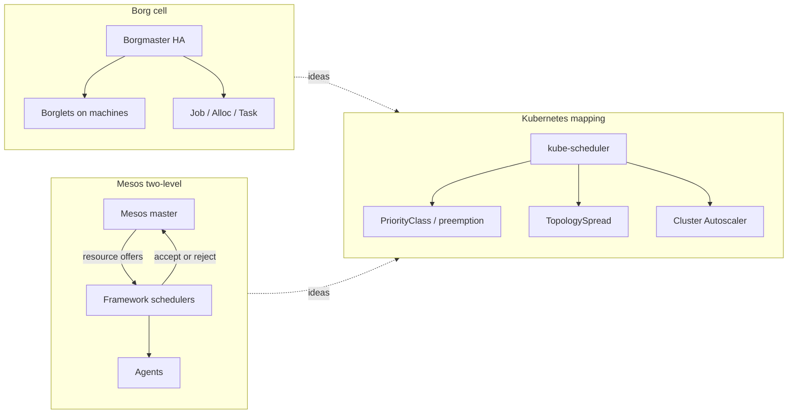
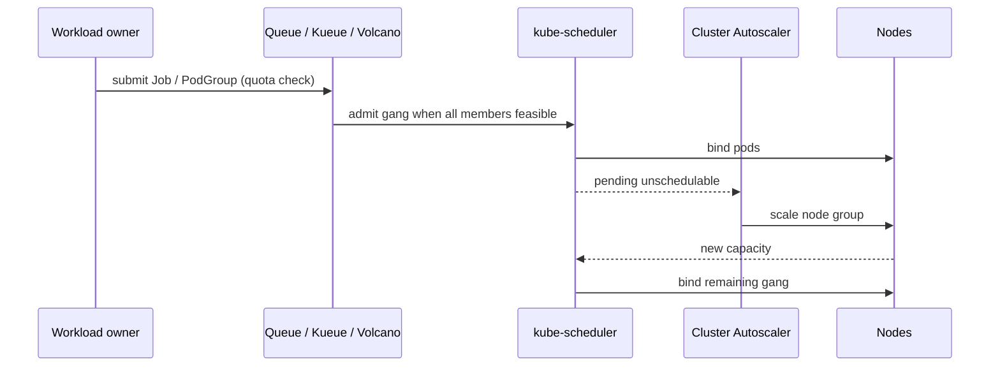

# Lesson 4 — Borg/Mesos-like orchestration patterns

*2026-09-12*

## What interviewers are really probing

They are not asking you to recite the Borg paper. They want to know whether you can **reason about schedulers as product decisions**: who owns placement, how priority and preemption actually work under contention, why gang scheduling exists, and how Kubernetes both inherits and *breaks* with Borg/Mesos ideas when you run **100+ cells**.

I have seen teams treat kube-scheduler like a black box until a batch wave starved online serving — then discover PriorityClass was never wired, TopologySpread conflicted with the Cluster Autoscaler, and nobody owned the “offer vs request” model for spot capacity. The Borg/Mesos vocabulary is how you talk about that without hand-waving.

| System | Scheduling model | Unit of work | Isolation boundary |
|---|---|---|---|
| **Borg** | Centralized Borgmaster + Borglets | Job → Alloc → Task | Cell (shared machines, hard priority) |
| **Mesos** | Two-level: master offers → framework decides | Framework Task / Executor | Framework + role / quota |
| **Kubernetes** | Centralized kube-scheduler (+ plugins) | Pod (sometimes Job/CRD) | Cluster / namespace / PriorityClass / ResourceQuota |

## Core diagram: three schedulers, one problem




**Read left to right:** Borg is a **single opinionated scheduler** for a cell. Mesos **offers** resources and lets frameworks decide. Kubernetes looks Borg-like (one scheduler), but at fleet scale you reintroduce Mesos-style specialization with **custom schedulers, Kueue, Volcano, and per-team queues** — two-level thinking without calling it Mesos.

## The concepts that actually show up in production

### 1. Allocs / resource shapes vs “just request CPU”

Borg **allocs** reserved a resource envelope that tasks shared. In K8s, the closest operators are:

- Pod `requests` / `limits` (and Guaranteed / Burstable / BestEffort QoS)
- **PriorityClass** + preemption
- Node-level oversubscription (kubelet reserved CPU/memory, eviction thresholds)
- Vertical Pod Autoscaler / in-place resize (where enabled)

```yaml
# Serving: Guaranteed QoS — requests == limits
apiVersion: v1
kind: Pod
metadata:
  name: checkout-api
  labels:
    tier: serving
spec:
  priorityClassName: prod-serving-p1
  containers:
    - name: app
      image: registry.example.com/checkout:1.2.3
      resources:
        requests: { cpu: "2", memory: "4Gi" }
        limits:   { cpu: "2", memory: "4Gi" }
---
# Batch: Burstable + lower priority — preemptible under pressure
apiVersion: scheduling.k8s.io/v1
kind: PriorityClass
metadata:
  name: batch-best-effort
value: 1000
preemptionPolicy: PreemptLowerPriority
globalDefault: false
description: "Batch / ML training — yield to serving"
```

**Idiosyncrasy:** if batch pods are `BestEffort` (no requests), they look “cheap” until memory pressure eviction thrashes the node and *serving* pods flap. Prefer explicit low PriorityClass + modest requests over BestEffort for anything that shares nodes with prod.

### 2. Two-level scheduling (Mesos) — why fleets reinvent it

Mesos masters advertise **offers** (CPU/mem/ports on agents). Frameworks accept or reject. That pattern returns when:

- One cluster hosts **serving + Spark/Flink + ML training**
- You need **fair share / queueing** beyond PriorityClass
- You want **gang scheduling** (all-or-nothing for N workers)



**Interview trap:** “Kubernetes has no two-level scheduling” is half-true. Core kube-scheduler is one level; **production ML platforms** add a second level (Kueue, Volcano, Yunikorn, custom) because PriorityClass alone cannot express queues, fair share, and gang constraints.

### 3. Gang scheduling

Training jobs and distributed systems often need **all N pods placed before any start**. Without gangs:

1. 7/8 workers schedule
2. The 8th waits on capacity
3. The 7 idle-hold GPUs for hours
4. Autoscaler oscillates

```yaml
# Volcano / PodGroup sketch — API names vary; pattern is the point
apiVersion: scheduling.volcano.sh/v1beta1
kind: PodGroup
metadata:
  name: train-resnet-pg
spec:
  minMember: 8
  queue: ml-training
  minResources:
    cpu: "64"
    memory: 256Gi
    nvidia.com/gpu: "8"
```

```bash
# Diagnose a stuck gang / Job
kubectl get pods -l job-name=train-resnet -o wide
kubectl describe pods -l job-name=train-resnet | rg -n "FailedScheduling|Insufficient|didn't find"
kubectl get events -n ml --field-selector reason=FailedScheduling --sort-by=.lastTimestamp | tail -30

# Who is hogging the SKU?
kubectl describe nodes -l node.kubernetes.io/instance-type=p4d.24xlarge \
  | rg -n "Allocated resources|nvidia.com/gpu|Name:"
```

### 4. Binpacking vs spread

| Goal | Prefer | Mechanism |
|---|---|---|
| **Cost / density** | Binpack | MostAllocated scoring, consolidation CA, fewer nodes |
| **Blast-radius / HA** | Spread | TopologySpreadConstraints, pod anti-affinity |
| **Mixed** | Tiered | Pack batch; spread serving replicas across zones |

```yaml
apiVersion: apps/v1
kind: Deployment
metadata:
  name: edge-api
spec:
  replicas: 12
  template:
    spec:
      topologySpreadConstraints:
        - maxSkew: 1
          topologyKey: topology.kubernetes.io/zone
          whenUnsatisfiable: DoNotSchedule
          labelSelector:
            matchLabels: { app: edge-api }
        - maxSkew: 1
          topologyKey: kubernetes.io/hostname
          whenUnsatisfiable: ScheduleAnyway
          labelSelector:
            matchLabels: { app: edge-api }
```

**Idiosyncrasy:** aggressive spread + undersized node groups = permanent Pending. Pair spread with **PDBs**, **minAvailable**, and CA expander strategy (`least-waste` vs `priority`) or you will fight yourself in every incident review.

### 5. Priority, preemption, and oversubscription

Borg ran **production + batch on the same machines** with hard priority. K8s can too — if you wire it deliberately:

```bash
# Inventory priority landscape
kubectl get priorityclass
kubectl get pods -A -o custom-columns=\
NAME:.metadata.name,NS:.metadata.namespace,\
PC:.spec.priorityClassName,QOS:.status.qosClass,NODE:.spec.nodeName

# Simulate contention: what would preempt whom?
kubectl get pods -A -o json \
  | jq -r '.items[] | select(.spec.priority!=null)
    | [.spec.priority, .metadata.namespace, .metadata.name] | @tsv' \
  | sort -n
```

```yaml
# kubelet eviction — the quiet sibling of preemption
# (node config / kubelet configmap — illustrative)
evictionHard:
  memory.available: "500Mi"
  nodefs.available: "10%"
evictionSoft:
  memory.available: "1Gi"
evictionSoftGracePeriod:
  memory.available: 1m
```

**Idiosyncrasy:** scheduler preemption and kubelet eviction are **different control loops**. Preemption frees capacity for a higher-priority Pending pod; eviction reacts to node pressure. Blaming “the scheduler” for OOMKills is a classic interview fail.

## Concrete commands & config (operator set)

```bash
# Scheduler decisions (enable SchedulerExpand in audit / use events)
kubectl get events -A --field-selector reason=Scheduled --sort-by=.lastTimestamp | tail -20
kubectl get events -A --field-selector reason=FailedScheduling --sort-by=.lastTimestamp | tail -40

# Plugin / profile awareness (scheduler config — control plane)
# Look for profiles, plugins, extenders, percentageOfNodesToScore
kubectl -n kube-system get cm kube-scheduler-config -o yaml 2>/dev/null || true

# Cluster Autoscaler signals
kubectl -n kube-system logs deploy/cluster-autoscaler --tail=200 \
  | rg -n "ScaleUp|ScaleDown|Unremovable|max cluster|expander"

# Spot / interruptible: label and taint from bootstrap (Lesson 3)
kubectl get nodes -l lifecycle=spot -o wide
kubectl taint nodes -l lifecycle=spot spot=true:NoSchedule --dry-run=client -o yaml | head
```

```yaml
# Example: dedicated batch queue via taints + tolerations (Mesos-role vibe)
apiVersion: v1
kind: Pod
metadata:
  name: spark-executor
spec:
  tolerations:
    - key: spot
      operator: Equal
      value: "true"
      effect: NoSchedule
    - key: workload
      operator: Equal
      value: batch
      effect: NoSchedule
  nodeSelector:
    workload: batch
  priorityClassName: batch-best-effort
  containers:
    - name: executor
      image: spark:3.5
      resources:
        requests: { cpu: "4", memory: "16Gi" }
        limits:   { memory: "16Gi" }   # CPU burstable OK for batch
```

## Failures & fixes

| Symptom | Likely root cause | Fix / mitigation |
|---|---|---|
| Pods Pending forever; events say `Insufficient cpu` | Binpack + no CA headroom; or requests oversized vs node allocatable | Right-size requests; raise CA max; check kube-reserved; split SKUs |
| 7/8 workers Running, 1 Pending for hours | No gang scheduling; partial placement holds GPUs | PodGroup / Kueue / Volcano; or all-or-nothing Job controller |
| Serving latency spike during batch wave | Missing / wrong PriorityClass; BestEffort batch | Pin serving to high PriorityClass + Guaranteed QoS; lower batch |
| CA scales up then immediately scales down | TopologySpread / PDB prevents drain; “unremovable” nodes | Soften `whenUnsatisfiable`; tune PDB; CA ignore annotations carefully |
| Preemption thrash (pods bouncing) | Priority values too close; retry storms | Widen priority bands; backoff; separate node pools for hostile workloads |
| OOMKill on Guaranteed pods | Limits too tight **or** node memory accounting / hugepages / kernel | Raise limits; check cgroup v2; don’t confuse eviction with app leak |
| Custom scheduler pods never bind | Multi-scheduler: `schedulerName` mismatch | Align `spec.schedulerName` with non-default scheduler Deployment |
| Namespace “has quota” but still starves | ResourceQuota vs Priority; fair-share missing | Add queueing layer; per-team ResourceQuota + PriorityClass matrix |

## Interview soundbites

- **“Kubernetes is Borg-inspired, not Borg.”** Shared ideas: cells≈clusters, Borglet≈kubelet, jobs/tasks≈Pods, priority/preemption. Missing Borg allocs and first-class cell oversubscription — you reconstruct them with QoS, PriorityClass, and node pools.
- **“Mesos two-level is still the right mental model for mixed fleets.”** When serving and training share metal, you need an admitter/queue above kube-scheduler — that *is* the framework layer.
- **“Gang scheduling is an efficiency feature, not a nicety.”** Partial placement burns accelerators. Say “all-or-nothing” and name Kueue/Volcano.
- **“Preemption ≠ eviction.”** Scheduler frees space for a higher-priority Pending pod; kubelet reacts to pressure. Own both in the design.
- **“Spread vs pack is a product choice per tier.”** Serving spreads across zones; batch packs for $/GPU. One TopologySpread for everything is a smell.

## How this maps to the JD

Hyperscale compute jobs expect you to **operate the scheduler as infrastructure**: contention between online and batch, accelerator packing, fair share across teams, and failure modes when autoscaling and topology policy fight. Borg/Mesos language is how you show you have thought about **100+ clusters** as many cells with local schedulers — not one magical control plane.

Next in the arc: **cloud networking** (VPC, peering, Shared VPC, Transit Gateway) — the fabric those cells hang on.

## Watch (talks & demos)

Real-world talks and demos that map to this lesson — watch after the Failures & fixes table.

### Cluster Management at Google with Borg — John Wilkes (GOTO 2016)

Priority, packing, and cell-level scheduling — the Borg side of the Lesson 4 comparison.

<iframe width="100%" height="360" src="https://www.youtube.com/embed/0W49z8hVn0k" title="Cluster Management at Google with Borg — John Wilkes (GOTO 2016)" frameBorder="0" allow="accelerometer; autoplay; clipboard-write; encrypted-media; gyroscope; picture-in-picture; web-share" allowFullScreen></iframe>

[Open on YouTube](https://www.youtube.com/watch?v=0W49z8hVn0k)

### Large-scale cluster management at Google with Borg (paper talk)

Utilization, admission control, and isolation themes that map to PriorityClass / QoS / node pools.

<iframe width="100%" height="360" src="https://www.youtube.com/embed/7MwxA4Fj2l4" title="Large-scale cluster management at Google with Borg (paper talk)" frameBorder="0" allow="accelerometer; autoplay; clipboard-write; encrypted-media; gyroscope; picture-in-picture; web-share" allowFullScreen></iframe>

[Open on YouTube](https://www.youtube.com/watch?v=7MwxA4Fj2l4)

## References

- [Large-scale cluster management at Google with Borg (PDF)](https://research.google/pubs/pub43438/)
- [Omega: flexible, scalable schedulers for large compute clusters](https://research.google/pubs/pub41684/)
- [Apache Mesos architecture](https://mesos.apache.org/documentation/latest/architecture/)
- [Kubernetes scheduler](https://kubernetes.io/docs/concepts/scheduling-eviction/kube-scheduler/)
- [Pod priority and preemption](https://kubernetes.io/docs/concepts/scheduling-eviction/pod-priority-preemption/)
- [Pod topology spread constraints](https://kubernetes.io/docs/concepts/scheduling-eviction/topology-spread-constraints/)
- [Cluster Autoscaler](https://github.com/kubernetes/autoscaler/tree/master/cluster-autoscaler)
- [Kueue](https://kueue.sigs.k8s.io/)
- [Volcano](https://volcano.sh/en/docs/)

## Quick self-check

Out loud, in under two minutes:

1. Contrast Borg’s centralized scheduler with Mesos’ offer model — and name where Kubernetes sits.
2. Give one production reason you would add a **queue/gang** layer above kube-scheduler.
3. Walk a failure: batch wave causes serving latency — symptom → root cause → fix involving PriorityClass **and** QoS.
4. Explain why TopologySpread + undersized node groups produces permanent Pending — and what you change first.
