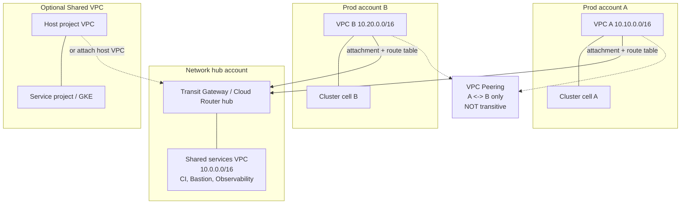
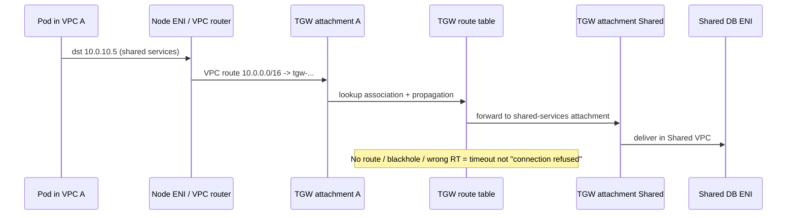
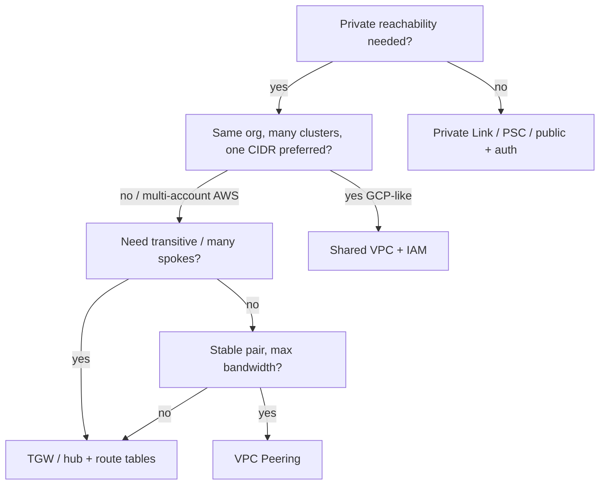

# Lesson 5 — Cloud networking: VPC, peering, Shared VPC, Transit Gateway

*2026-09-13*

## What interviewers are really probing

They are not asking you to define a VPC. They want to know if you have **designed the network that 100+ clusters hang on**: CIDR that will not collide in five years, which attachment model you pick when teams need private reachability, how routes actually propagate (and when they *do not*), and how you diagnose “pods cannot talk to the DB” when the path crosses accounts, TGW, and overlapping RFC1918.

I have watched fleets burn weeks on “just peer everything” until the mesh hit the peering limit, transitive routes never appeared, and two cells both claimed `10.0.0.0/16`. The interview answer is a **hub-and-spoke with explicit route ownership**, not a web of peerings.

| Pattern | Topology | Transitive? | Who owns the network | Hyperscale fit |
|---|---|---|---|---|
| **VPC Peering** | Point-to-point | **No** | Each VPC | Few pairs, same CIDR plan, low churn |
| **Shared VPC / Shared VNet** | Host + service projects | N/A (same VPC) | Host / network team | Many clusters, one CIDR + IAM boundary |
| **Transit Gateway / Cloud Router hub** | Hub-and-spoke | **Yes** (via hub) | Hub account + attachments | Dozens–hundreds of VPCs / accounts |
| **Private Link / PSC / Private Service Connect** | Consumer → endpoint | N/A | Provider + consumer | SaaS / shared data plane without full VPC mesh |

## Core diagram: how cells actually connect




**Read the hub first:** at fleet scale you rarely mesh peer every pair. You attach spoke VPCs to a **Transit Gateway** (AWS) or equivalent hub (GCP hierarchical Firewall + Cloud Router / NCC; Azure Virtual WAN / Hub VNet), put shared services in one spoke, and **control which prefixes each attachment learns**. Peering remains for a few high-bandwidth pairs where you accept non-transitive routes.

## CIDR & IPAM: the decision that ages badly

Before any peering or TGW attachment, own an **IPAM ledger**. Overlap is the silent killer: TGW will not magically NAT colliding prefixes, and peering refuses overlapping CIDRs.

```text
# Fleet IPAM sketch (document in CMDB / Terraform)
10.0.0.0/12     reserved for company private (4096 /24s)
  10.0.0.0/16   shared-services (hub)
  10.10.0.0/16  cell-prod-us-east-1-a
  10.11.0.0/16  cell-prod-us-east-1-b
  10.20.0.0/16  cell-prod-us-west-2-a
  100.64.0.0/16 CGNAT / node pod overlays (if you carve separately)
# NEVER recycle a /16 into a peered or TGW-attached VPC without a drain plan
```

**Idiosyncrasy:** Kubernetes **pod/service CIDRs** are *inside* the cluster’s view. On AWS VPC CNI, pod IPs often come from **VPC subnets** — so your VPC CIDR must leave headroom for node ENIs + pods. On overlay CNIs (Calico VXLAN, Cilium VXLAN), pod CIDR can be independent, but then **egress SNAT and NetworkPolicy** become the path you debug. Pick one model per fleet and write it down.

```bash
# AWS: inventory VPC CIDRs before attaching anything
aws ec2 describe-vpcs --query 'Vpcs[].{Id:VpcId,Cidr:CidrBlock,Secondary:CidrBlockAssociationSet}' --output table

# GCP: list Shared VPC host + service projects
gcloud compute shared-vpc list-associated-resources HOST_PROJECT_ID
gcloud container clusters describe CLUSTER --region=REGION \
  --format='yaml(networkConfig,privateClusterConfig,ipAllocationPolicy)'
```

## Pattern 1 — VPC peering (when it is still right)

Peering is a **private pipe between two VPCs**. Routes are non-transitive: `A↔B` and `B↔C` does **not** give `A→C`. Security groups / firewall rules still reference peer CIDRs (or SG IDs on AWS with peering options).

```bash
# AWS: create + accept (cross-account needs both sides)
aws ec2 create-vpc-peering-connection \
  --vpc-id vpc-aaa --peer-vpc-id vpc-bbb --peer-owner-id 222233334444
aws ec2 accept-vpc-peering-connection --vpc-peering-connection-id pcx-...

# Install routes BOTH ways (forgotten half = classic outage)
aws ec2 create-route --route-table-id rtb-aaa \
  --destination-cidr-block 10.20.0.0/16 --vpc-peering-connection-id pcx-...
aws ec2 create-route --route-table-id rtb-bbb \
  --destination-cidr-block 10.10.0.0/16 --vpc-peering-connection-id pcx-...
```

**Use peering when:** two VPCs need high PPS / low latency, stable pair count, no transitive requirement. **Stop** when you need N² connections or “spoke A reaches shared services *and* spoke B through the same path.”

## Pattern 2 — Shared VPC (GCP) / shared network ownership

Shared VPC puts the **network in a host project**; service projects attach GKE/VMs with IAM. One CIDR, many teams — the network team owns subnets, secondary ranges for pods/services, and firewall; app teams own workloads.

```bash
# GCP: enable host, attach service project, grant networkUser
gcloud compute shared-vpc enable HOST_PROJECT
gcloud compute shared-vpc associated-projects add SERVICE_PROJECT --host-project=HOST_PROJECT
gcloud projects add-iam-policy-binding HOST_PROJECT \
  --member="serviceAccount:SERVICE_PROJECT_NUMBER@cloudservices.gserviceaccount.com" \
  --role="roles/compute.networkUser"
```

```yaml
# GKE in a service project consuming host subnets (illustrative)
# ipAllocationPolicy secondary ranges MUST live on the Shared VPC subnet
ipAllocationPolicy:
  useIpAliases: true
  clusterSecondaryRangeName: pods
  servicesSecondaryRangeName: services
privateClusterConfig:
  enablePrivateNodes: true
  enablePrivateEndpoint: false   # or true + authorized networks / PSC
```

**Idiosyncrasy:** secondary range exhaustion for pods is a **subnet** problem in the host project — app teams cannot fix it with a Helm chart. Fleet ops means watching `IP address space` / allocation metrics before the next cell scales.

## Pattern 3 — Transit Gateway / hub (the hyperscale default)

TGW (AWS) and analogs give **transitive routing** through a hub. Each VPC (or VPN/DX) is an attachment; **TGW route tables** decide which spokes talk. This is how you connect 50 accounts without 1225 peerings.



```bash
# AWS TGW: create, attach VPC, associate + propagate routes
aws ec2 create-transit-gateway --description "fleet-hub"
aws ec2 create-transit-gateway-vpc-attachment \
  --transit-gateway-id tgw-... --vpc-id vpc-aaa \
  --subnet-ids subnet-aaa-a subnet-aaa-b subnet-aaa-c

# Critical: association vs propagation are different knobs
aws ec2 associate-transit-gateway-route-table \
  --transit-gateway-route-table-id tgw-rtb-prod \
  --transit-gateway-attachment-id tgw-attach-aaa
aws ec2 enable-transit-gateway-route-table-propagation \
  --transit-gateway-route-table-id tgw-rtb-prod \
  --transit-gateway-attachment-id tgw-attach-shared

# VPC side still needs a route to the TGW
aws ec2 create-route --route-table-id rtb-aaa \
  --destination-cidr-block 10.0.0.0/16 --transit-gateway-id tgw-...
```

```hcl
# Terraform sketch — one module, many cells
resource "aws_ec2_transit_gateway_vpc_attachment" "cell" {
  subnet_ids         = module.vpc.private_subnets
  transit_gateway_id = var.tgw_id
  vpc_id             = module.vpc.vpc_id
  tags               = { Cell = var.cell_name }
}

resource "aws_route" "to_shared" {
  for_each               = toset(module.vpc.private_route_table_ids)
  route_table_id         = each.value
  destination_cidr_block = var.shared_services_cidr
  transit_gateway_id     = var.tgw_id
}
```

**Segmentation pattern that interviews love:** separate TGW route tables for `prod`, `nonprod`, and `shared` — prod spokes associate to `prod` RT and only propagate/static-route to shared services, **not** to each other, unless you explicitly need east-west.

## Decision tree (say this out loud)



## Concrete commands & config (operator set)

```bash
# Path check from a node (AWS): hop to TGW? to peer?
ip route get 10.0.10.5
traceroute -n 10.0.10.5

# AWS: TGW attachment state + routes
aws ec2 describe-transit-gateway-attachments \
  --filters Name=transit-gateway-id,Values=tgw-... \
  --query 'TransitGatewayAttachments[].{Id:TransitGatewayAttachmentId,State:State,Vpc:ResourceId}'
aws ec2 search-transit-gateway-routes \
  --transit-gateway-route-table-id tgw-rtb-prod \
  --filters Name=type,Values=static,propagated

# Security groups: return path + peer/TGW CIDR must be allowed
aws ec2 describe-security-groups --group-ids sg-app \
  --query 'SecurityGroups[].IpPermissions'

# GCP: routes + firewall for Shared VPC
gcloud compute routes list --project=HOST_PROJECT --filter="network~shared"
gcloud compute firewall-rules list --project=HOST_PROJECT --filter="network~shared"
```

```yaml
# Kubernetes: do not paper over missing routes with hostNetwork
# Prefer correct VPC/TGW routing; if you must debug:
apiVersion: v1
kind: Pod
metadata:
  name: netshoot-tgw
spec:
  nodeSelector:
    topology.kubernetes.io/zone: us-east-1a
  containers:
    - name: netshoot
      image: nicolaka/netshoot
      command: ["sleep", "3600"]
```

## Failures & fixes

| Symptom | Likely root cause | Fix / mitigation |
|---|---|---|
| `curl` to shared DB **times out** (not RST) | Missing VPC route to TGW/peer, or TGW RT association without propagation | Add VPC route; associate attachment; enable propagation / static route; verify SG/firewall allows source CIDR |
| Works from bastion in Shared VPC, fails from pods | Pod CIDR not in TGW/SG allow list; SNAT hides node IP inconsistently | Allow **pod + node** CIDRs; prefer VPC CNI predictability or explicit egress gateway |
| Peering create fails / stuck | Overlapping CIDRs | Renumber one VPC (painful) or use Private Link / proxied path; never “force” overlap |
| A reaches B, B reaches C, A cannot reach C | Peering non-transitive | Move to TGW hub or add A↔C peering deliberately |
| New cell cannot join shared services | Attachment on wrong TGW RT (prod vs nonprod) | Fix association; document RT matrix in Terraform |
| Intermittent cross-AZ timeouts | TGW subnet placement missing an AZ; NACL deny | Attach TGW in ≥2 AZs; open NACLs ephemeral + return |
| GKE Pending / IP exhaustion | Shared VPC secondary ranges too small | Expand secondary ranges in **host** project; plan /14+/15 pod space early |
| Cross-account peering works, DNS does not | Private DNS not linked | Associate Route53 private hosted zones / Cloud DNS peering both sides |
| “Connected” but asymmetric blackhole | Only one direction of routes installed | Always pair routes; test from **both** ends |

## Interview soundbites

- **“Peering is not transitive — that is the whole joke.”** If you need spoke-to-spoke via a hub, say Transit Gateway (or equivalent), not a peering mesh.
- **“CIDR is a product decision.”** Overlap kills peering and TGW; IPAM before the first cell.
- **“Association ≠ propagation.”** TGW attachments must be associated to a route table *and* learn/advertise the prefixes you intend.
- **“Shared VPC separates network ownership from workload ownership.”** Host project owns subnets/firewall; service projects consume — that is the IAM story.
- **“Timeout vs connection refused tells you the layer.”** Timeout → route/SG/NACL/TGW. Refused → something listening said no. Interviewers love that triage.

## How this maps to the JD

Hyperscale compute roles assume you can **place cells on a coherent network fabric**: multi-account connectivity, shared services, and failure domains that do not require N² peerings. Next lessons go deeper on Interconnect/Direct Connect, edge LB/DDoS, then **cluster networking (Cilium/eBPF)** on top of this VPC layer.

Next in the arc: **Cloud Interconnect / Direct Connect, Cloud NAT, BGP & route control**.

## Watch (talks & demos)

Real-world talks and demos that map to this lesson — watch after the Failures & fixes table.

### AWS Transit Gateway reference architectures for many VPCs — re:Invent NET406

Hub-and-spoke, segmentation, DX + TGW, PrivateLink vs peering mesh — the hyperscale VPC pattern.

<iframe width="100%" height="360" src="https://www.youtube.com/embed/9Nikqn_02Oc" title="AWS Transit Gateway reference architectures for many VPCs — re:Invent NET406" frameBorder="0" allow="accelerometer; autoplay; clipboard-write; encrypted-media; gyroscope; picture-in-picture; web-share" allowFullScreen></iframe>

[Open on YouTube](https://www.youtube.com/watch?v=9Nikqn_02Oc)

### Dive into the depths of routing on AWS — re:Invent 2024 NET318

BGP, TGW route tables, DX transit VIFs, and failure handling — shared with Lesson 6.

<iframe width="100%" height="360" src="https://www.youtube.com/embed/2tHMnbTj4pw" title="Dive into the depths of routing on AWS — re:Invent 2024 NET318" frameBorder="0" allow="accelerometer; autoplay; clipboard-write; encrypted-media; gyroscope; picture-in-picture; web-share" allowFullScreen></iframe>

[Open on YouTube](https://www.youtube.com/watch?v=2tHMnbTj4pw)

## References

- [AWS Transit Gateway](https://docs.aws.amazon.com/vpc/latest/tgw/what-is-transit-gateway.html)
- [AWS VPC peering](https://docs.aws.amazon.com/vpc/latest/peering/what-is-vpc-peering.html)
- [GCP Shared VPC](https://cloud.google.com/vpc/docs/shared-vpc)
- [GCP VPC Network Peering](https://cloud.google.com/vpc/docs/vpc-peering)
- [Azure Virtual WAN / hub-spoke](https://learn.microsoft.com/en-us/azure/architecture/networking/architecture/hub-spoke)
- [Amazon VPC CNI](https://docs.aws.amazon.com/eks/latest/userguide/managing-vpc-cni.html)
- [GKE IP allocation / alias IPs](https://cloud.google.com/kubernetes-engine/docs/concepts/alias-ips)
- [AWS PrivateLink](https://docs.aws.amazon.com/vpc/latest/privatelink/what-is-privatelink.html)

## Quick self-check

Out loud, in under two minutes:

1. When do you choose **peering** vs **Shared VPC** vs **TGW** — one sentence each.
2. Explain why `A↔B` and `B↔C` peering does not give `A→C`, and what you build instead.
3. Walk a failure: pods time out to a shared DB — symptom → route/TGW RT/SG triage → fix.
4. Why overlapping `10.0.0.0/16` across two cells is catastrophic once they share a hub.
