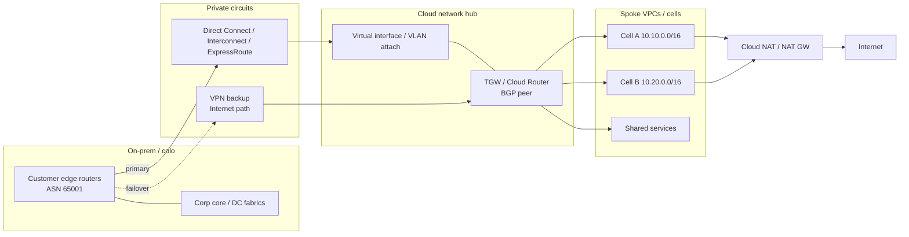
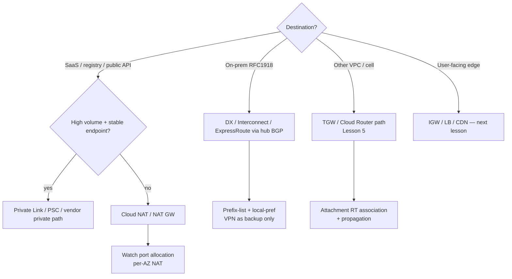

# Lesson 6 — Cloud Interconnect / Direct Connect, Cloud NAT, BGP & route control

*2026-09-14*

## What interviewers are really probing

Lesson [05](/lessons/05-cloud-networking-vpc-tgw) got you a hub-and-spoke **inside** the cloud. This lesson is the other half: **how the fleet talks to on-prem and the public internet without becoming a NAT snowflake**.

They want to hear: dedicated connectivity (Direct Connect / Cloud Interconnect / ExpressRoute) as a **first-class attachment** to your TGW / Cloud Router hub, **BGP** as the control plane for prefix advertisement (not static routes pasted into a wiki), and **Cloud NAT / NAT Gateway** as *egress only* — never a substitute for private path design. Bonus points if you name failure modes: BGP session flaps, asymmetric return paths, NAT port exhaustion, and “we advertised `0.0.0.0/0` into the corporate core.”

| Path | What it is | Control plane | Hyperscale use |
|---|---|---|---|
| **Direct Connect / Interconnect / ExpressRoute** | Private circuit into the provider edge | Usually **BGP** | Steady high-volume on-prem ↔ cloud; predictable latency |
| **Site-to-Site VPN** | Encrypted over Internet | BGP or static | Backup path, burst, greenfield |
| **Cloud NAT / NAT Gateway** | SNAT for private subnets → Internet | None (stateful NAT) | Pull images, call SaaS; **not** on-prem reachability |
| **Internet Gateway + public IP** | Direct public addressing | Route tables | Bastions / edge only — shrink this surface |

## Core diagram: on-prem meets the hub




**Read it left to right:** on-prem CE routers peer BGP into the cloud hub (via DX/Interconnect or VPN). The hub **owns route policy** — which on-prem prefixes each cell may learn, and which cell prefixes go back to the corp core. Cloud NAT hangs off private subnets for **Internet egress only**; it never replaces Direct Connect for private CIDRs.

Cross-link: cell CIDR planning and TGW route-table association/propagation from [Lesson 5](/lessons/05-cloud-networking-vpc-tgw) still apply. Wrong attachment RT here blackholes on-prem the same way it blackholes shared services.

## Direct Connect / Interconnect / ExpressRoute — operator model

Think in **layers**, not product names:

1. **Physical / partner** — port at a colo, or a partner (Equinix, etc.) that hands you a VLAN.
2. **Virtual interface / attachment** — private VIF (AWS), VLAN attach (GCP Interconnect), circuit + peering (Azure ExpressRoute).
3. **Routing domain** — BGP session into TGW / Direct Connect Gateway / Cloud Router / Virtual WAN hub.
4. **Propagation policy** — which prefixes you advertise and accept (prefix-lists, AS-path filters, MED / local-pref).

```bash
# AWS: inventory DX + VIFs + BGP peers (names vary by account)
aws directconnect describe-connections
aws directconnect describe-virtual-interfaces
aws directconnect describe-bgp-peers

# AWS: prefer DXGW + TGW for many VPCs (not one VIF per VPC)
aws ec2 describe-transit-gateway-attachments \
  --filters Name=resource-type,Values=direct-connect-gateway

# GCP: Interconnect + Cloud Router BGP
gcloud compute interconnects list
gcloud compute routers list --regions=REGION
gcloud compute routers get-status ROUTER --region=REGION \
  --format='yaml(result.bgpPeerStatus)'

# Azure: ExpressRoute circuit + connections (az CLI)
az network express-route list -o table
az network vpn-connection list -g RG -o table
```

**Design rule:** one **hub routing domain** (TGW + DXGW, Cloud Router + NCC/hub, Virtual WAN) that all cells attach to. Do **not** hang a dedicated Interconnect off every cell VPC — you will drown in BGP sessions and asymmetric paths.

**Redundancy:** two circuits in different provider POPs / metro diversity, plus a **VPN backup** with worse local-pref so it only wins when DX dies. Test failover on purpose; “we have two circuits” is not the same as “traffic moved in 30s.”

## BGP & route control — the interview meat

BGP is how prefixes **enter and leave** the cloud hub. Static routes do not scale past a whiteboard.

| Knob | What it does | Fleet habit |
|---|---|---|
| **ASN** | Your AS identity on the session | Private ASN (64512–65534) per domain; document it |
| **Advertised prefixes** | What on-prem / cloud learns | Advertise **aggregates** (`10.10.0.0/15`) not every /24 |
| **Accepted prefixes** | What you install from the peer | Prefix-list deny `0.0.0.0/0` from corp unless intentional |
| **Local preference / MED** | Primary vs backup path | Higher local-pref on DX; VPN is cold/warm standby |
| **AS path prepending** | Make a path less preferred | Useful for graceful shift / maintenance |
| **Communities** | Tag routes for policy | Tag `cell-prod` vs `cell-nonprod`; filter at hub |

```text
# Policy sketch (document in Terraform / network-as-code)
ON-PREM advertises:  10.64.0.0/12  (corp RFC1918 aggregate)
CLOUD advertises:    10.10.0.0/15  (prod cells aggregate)
                     10.20.0.0/16  (shared services) — only if needed on-prem
NEVER advertise:     0.0.0.0/0 into corp from cloud (unless default-route design is explicit)
NEVER accept:        overlapping cell CIDRs; bogons; your own ASN loops
```

```bash
# From a cloud router / CE perspective (vendor syntax varies)
# Show learned vs advertised — know BOTH directions
show ip bgp summary
show ip bgp neighbors A.B.C.D advertised-routes
show ip bgp neighbors A.B.C.D routes

# AWS TGW: what did the DX attachment actually install?
aws ec2 search-transit-gateway-routes \
  --transit-gateway-route-table-id tgw-rtb-prod \
  --filters Name=type,Values=propagated
```

**Idiosyncrasy:** AWS Direct Connect Gateway + Transit Gateway is the usual multi-VPC pattern; a **private VIF straight into one VPC** is a smell at cell count > a handful. GCP: Cloud Router is the BGP speaker — Interconnect attachments are useless without router + correct advertised IP ranges. Azure: ExpressRoute connections into a hub VNet / Virtual WAN; spoke peering still follows hub-spoke rules from Lesson 5.

## Cloud NAT / NAT Gateway — egress, not connectivity

Private nodes still need to reach package mirrors, container registries, and SaaS APIs. That is **Cloud NAT (GCP)** or **NAT Gateway (AWS)** / Azure NAT Gateway — SNAT from a private subnet to the Internet.

```bash
# AWS: NAT GW per AZ (HA) + private route 0.0.0.0/0 -> nat-...
aws ec2 describe-nat-gateways \
  --filter Name=state,Values=available \
  --query 'NatGateways[].{Id:NatGatewayId,Subnet:SubnetId,Az:ConnectivityType}'

# GCP: Cloud NAT bound to Cloud Router (regional)
gcloud compute routers nats list --router=ROUTER --region=REGION
gcloud compute routers nats describe NAT_NAME --router=ROUTER --region=REGION

# Spot port exhaustion (classic K8s node symptom)
# Many pods -> few NAT IPs -> ephemeral port reuse failures
# AWS CloudWatch: ErrorPortAllocation on NAT GW
# GCP: nat_allocation_failed / dropped sent packets metrics
```

```yaml
# EKS / GKE habit: private nodes, no public IPs on workers
# Route table (AWS mental model):
#   private subnet: 0.0.0.0/0 -> nat-0abc (per AZ)
#   public subnet:  0.0.0.0/0 -> igw-0xyz  (NAT GW lives here)
# Do NOT point on-prem CIDRs at the NAT GW
```

**Rules of thumb:**

- **One NAT GW per AZ** for the AZ’s private subnets (cross-AZ NAT = extra cost + failure coupling).
- Scale **NAT IPs / ports** for pod density (VPC CNI + high churn = port pressure). Prefer **Private Link / PSC / Artifact Registry VPC connectors** for high-volume pulls so NAT is not on the hot path.
- NAT is **stateful and asymmetric-hostile**. Return traffic must hit the same NAT. Do not mix “hairpin through on-prem” with NAT’d Internet egress without a clear policy.

## Decision tree: how traffic should leave a cell



## Concrete commands & config (operator set)

```bash
# End-to-end: from a node in Cell A, is on-prem via DX or via broken default?
ip route get 10.64.10.20
traceroute -n 10.64.10.20
# Expect: VPC router -> TGW/ENI -> DX path — NOT nat-xxx

# Prove NAT is only for public destinations
ip route get 1.1.1.1
# Expect: default via NAT GW / Cloud NAT next hop

# AWS: DX BGP state (virtualInterfaceState / bgpPeers)
aws directconnect describe-virtual-interfaces \
  --query 'virtualInterfaces[].{Name:virtualInterfaceName,State:virtualInterfaceState,BGP:bgpPeers}'

# GCP: Cloud Router BGP session up?
gcloud compute routers get-status ROUTER --region=REGION \
  --format='value(result.bgpPeerStatus[].ipAddress,result.bgpPeerStatus[].status)'
```

```hcl
# Terraform sketch: advertise aggregates, not every subnet
# (illustrative — wire to your provider resources)
# aws_ec2_transit_gateway_route_table_propagation ...
# aws_dx_gateway_association ...
# google_compute_router_peer + advertised_ip_ranges = ["10.10.0.0/15"]
```

```yaml
# Kubernetes: imagePullBackOff during NAT exhaustion looks like "registry timeout"
# Triage before blaming the registry:
# 1) node can curl registry?  2) NAT ErrorPortAllocation?  3) security group egress?
apiVersion: v1
kind: Pod
metadata:
  name: netshoot-egress
spec:
  containers:
    - name: netshoot
      image: nicolaka/netshoot
      command: ["sleep", "3600"]
```

## Failures & fixes

| Symptom | Likely root cause | Fix / mitigation |
|---|---|---|
| On-prem ping **times out**; Internet works | No DX/TGW route for corp prefix; BGP session down; wrong TGW RT | Check BGP peer status; confirm propagated routes; fix association |
| Works to on-prem from bastion, fails from pods | Pod CIDR not advertised / not allowed on corp firewall | Advertise pod+node aggregates; update corp ACL; prefer VPC CNI predictability |
| Traffic takes VPN while DX is “up” | Local-pref / AS-path makes VPN better; DX VIF partially degraded | Fix preference; monitor DX health; drain VPN with intentional prepend |
| Asymmetric blackhole (SYN works one way) | Return path different firewall / uRPF | Symmetric routing policy; same hub RT both directions; disable strict uRPF where policy requires |
| `ErrorPortAllocation` / random registry timeouts | NAT ephemeral ports exhausted | Add NAT IPs; per-AZ NAT; Private Link for registries; reduce SNAT churn |
| Corp core learns cloud `0.0.0.0/0` | Accidental default advertisement | Prefix-list deny default; alert on unexpected announcements |
| New cell cannot reach on-prem | Cell attached to nonprod TGW RT | Fix RT association; encode matrix in Terraform |
| Failover took 15+ minutes | No BFD / long BGP timers; human ticket | Tune timers carefully; document RTO; rehearse cutover |
| Overlapping `10.10.0.0/16` on-prem and in cloud | IPAM failure across orgs | NAT/proxy boundary or renumber; never dual-advertise overlap |

## Security & hardening

Hybrid routing mistakes are **security incidents waiting for a traceroute**. Prefix-list hygiene and “NAT is not a firewall” belong in every DX design review.

| Control | Operator practice |
|---|---|
| Prefix-list hygiene | Deny `0.0.0.0/0` (and unexpected summaries) into corp; alert on new announcements |
| NAT ≠ security boundary | NAT hides source IPs; it does not authenticate or authorize — use Private Link + IAM |
| Encrypt over DX when required | MACSec / VPN overlay / app TLS when compliance demands encryption in transit |
| Asymmetric path footgun | Different firewalls on forward vs return = blackholes **and** bypassed inspection |

```bash
# BGP: what are we advertising / accepting? (sketch — vendor CLI varies)
# show ip bgp neighbors <peer> advertised-routes
# show ip bgp neighbors <peer> routes
# Prefix-list policy: deny 0.0.0.0/0 from corp peer unless explicitly designed
aws directconnect describe-bgp-peers --virtual-interface-id dxvif-xxx
```

**AI/ML fleets:** corp ↔ cloud paths that can reach weight buckets or training data lakes need the same prefix filters as any PCI path. Prefer Private Link for artifact registries over hairpinning pulls through NAT “because it worked.” Encrypt hybrid hops when checkpoints cross the DX boundary.

## Interview soundbites

- **“DX is an attachment to the hub, not a special snowflake per VPC.”** Cells attach to TGW/Cloud Router; the hub peers BGP to on-prem.
- **“BGP is the control plane; traceroute is the data plane.”** If routes are missing, packets will not invent a path.
- **“Advertise aggregates, filter defaults.”** Summaries keep tables small; `0.0.0.0/0` into corp is a pager waiting to happen.
- **“NAT is for Internet egress — it is not how you reach the mothership.”** On-prem stays on DX/Interconnect/VPN.
- **“Two circuits without tested failover is one circuit and a story.”** Know local-pref and the measured RTO.
- **“Port exhaustion looks like flaky DNS/registry.”** Check NAT metrics before blaming the app.

## How this maps to the JD

Hyperscale platform interviews assume hybrid connectivity: **cells**, **shared services**, and **corp systems** on one coherent routing policy. You are expected to reason about BGP at the hub, NAT at the edge of private subnets, and failure domains that survive a colo or AZ loss. Next up: **edge load balancing and DDoS (Cloud Armor / Shield)** — the front door after this private fabric.

Next in the arc: **Edge load balancing & DDoS (Cloud Armor / AWS Shield)**.

## Watch (talks & demos)

Real-world talks and demos that map to this lesson — watch after the Failures & fixes table.

### Dive into the depths of routing on AWS — re:Invent 2024 NET318

Direct Connect, BGP attributes, Transit Gateway hybrid routing, active/active vs active/passive.

<iframe width="100%" height="360" src="https://www.youtube.com/embed/2tHMnbTj4pw" title="Dive into the depths of routing on AWS — re:Invent 2024 NET318" frameBorder="0" allow="accelerometer; autoplay; clipboard-write; encrypted-media; gyroscope; picture-in-picture; web-share" allowFullScreen></iframe>

[Open on YouTube](https://www.youtube.com/watch?v=2tHMnbTj4pw)

### AWS Transit Gateway reference architectures for many VPCs — re:Invent NET406

How DX and VPN attach to the hub and when PrivateLink beats full mesh.

<iframe width="100%" height="360" src="https://www.youtube.com/embed/9Nikqn_02Oc" title="AWS Transit Gateway reference architectures for many VPCs — re:Invent NET406" frameBorder="0" allow="accelerometer; autoplay; clipboard-write; encrypted-media; gyroscope; picture-in-picture; web-share" allowFullScreen></iframe>

[Open on YouTube](https://www.youtube.com/watch?v=9Nikqn_02Oc)

## References

- [AWS Direct Connect](https://docs.aws.amazon.com/directconnect/latest/UserGuide/Welcome.html)
- [AWS Direct Connect Gateway + Transit Gateway](https://docs.aws.amazon.com/directconnect/latest/UserGuide/direct-connect-transit-gateways.html)
- [AWS NAT Gateway](https://docs.aws.amazon.com/vpc/latest/userguide/vpc-nat-gateway.html)
- [GCP Cloud Interconnect](https://cloud.google.com/network-connectivity/docs/interconnect)
- [GCP Cloud Router / BGP](https://cloud.google.com/network-connectivity/docs/router/concepts/overview)
- [GCP Cloud NAT](https://cloud.google.com/nat/docs/overview)
- [Azure ExpressRoute](https://learn.microsoft.com/en-us/azure/expressroute/expressroute-introduction)
- [Azure NAT Gateway](https://learn.microsoft.com/en-us/azure/nat-gateway/nat-overview)
- [RFC 4271 — BGP-4](https://datatracker.ietf.org/doc/html/rfc4271)
- Prior lesson: [05 — VPC / peering / Shared VPC / TGW](/lessons/05-cloud-networking-vpc-tgw)

## Quick self-check

Out loud, in under two minutes:

1. Why attach Direct Connect / Interconnect to a **hub** (TGW / Cloud Router) instead of one VIF per cell VPC?
2. Name three BGP knobs you use for primary DX vs VPN backup.
3. Walk a failure: pods time out to an on-prem API, but `curl https://example.com` works — where do you look first?
4. What metric tells you NAT is the reason image pulls are flaky, and what do you change?
