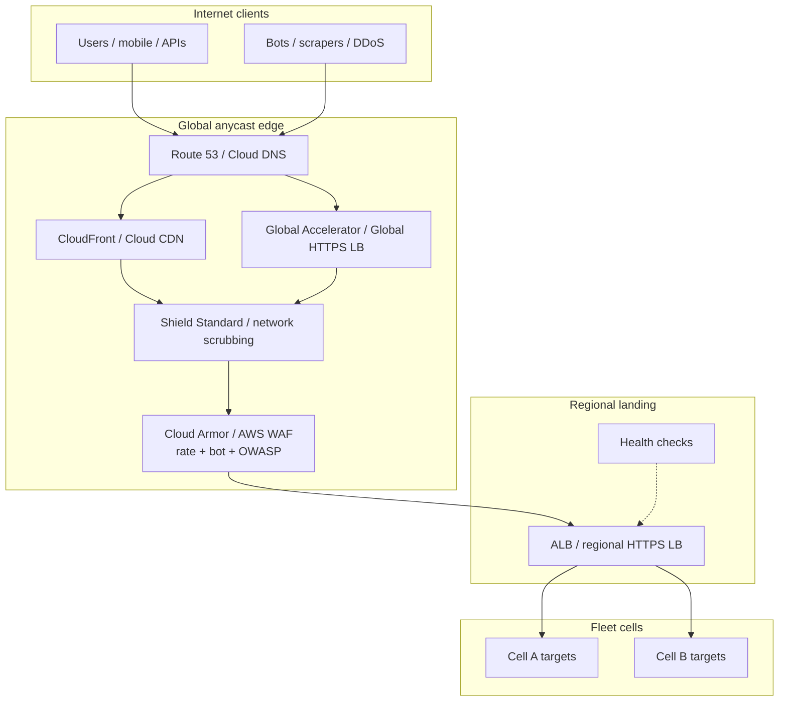
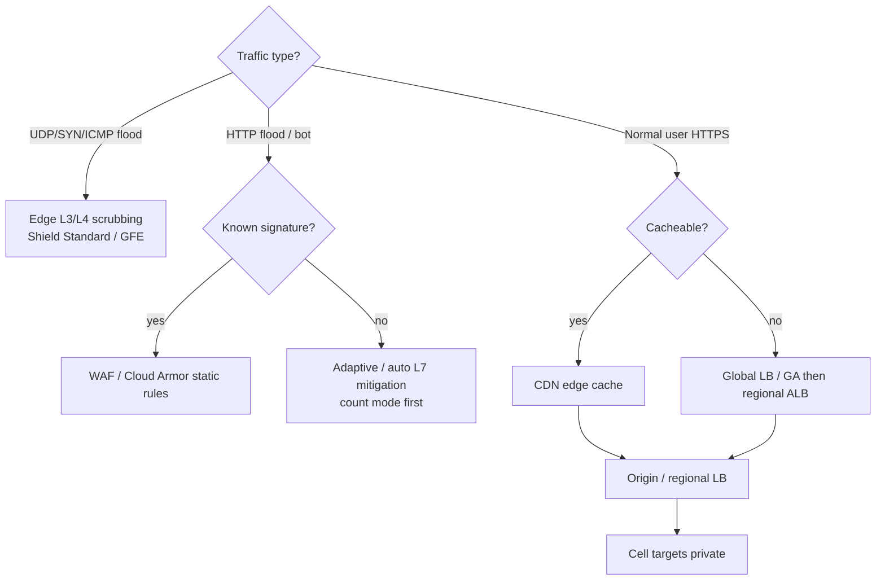

# Lesson 7 — Edge load balancing & DDoS (Cloud Armor / AWS Shield)

*2026-09-15*

## What interviewers are really probing

Lessons [05](/lessons/05-cloud-networking-vpc-tgw) and [06](/lessons/06-cloud-interconnect-nat-bgp) built the **private fabric**: cells, hubs, BGP, NAT for egress. This lesson is the **public front door** — how users (and attackers) reach you.

They want to hear a layered story: **anycast edge** (CDN / Global Accelerator / global HTTPS LB) absorbs and steers traffic, **Shield / provider L3–L4 scrubbing** kills volumetric junk before it burns your regional capacity, and **Cloud Armor / AWS WAF** enforces L7 policy (rate limits, geo, bot, OWASP). Bonus if you separate **CloudFront vs Global Accelerator**, name **health-check–based detection**, and refuse to put a naked public ALB on the internet “because Shield Standard exists.”

| Layer | What it does | Typical product names | Hyperscale habit |
|---|---|---|---|
| **DNS / health** | Steer away from dead regions | Route 53, Cloud DNS | Health checks tied to Shield / LB |
| **Global edge** | Anycast entry + cache / TCP anycast | CloudFront, Cloud CDN, Global Accelerator, Global external HTTPS LB | Prefer edge before regional LB |
| **L3/L4 DDoS** | Absorb SYN/UDP/ICMP floods | Shield Standard (always-on), provider network scrubbing | Default; do not DIY at the VPC border |
| **L7 DDoS + WAF** | HTTP floods, bots, exploits | Shield Advanced + WAF; Cloud Armor (+ Adaptive Protection) | Rate rules + adaptive signatures |
| **Regional LB** | Path/host routing to cells | ALB / regional HTTPS LB / NLB | Private targets; no public node IPs |

## Core diagram: front door before the cells




**Read it top-down:** DNS points at **anycast** edge IPs, not at a single regional ALB EIP. Volumetric junk dies at the provider perimeter (Shield Standard / Google front end). Remaining HTTP hits **WAF / Cloud Armor** before the regional LB fans out to cell targets. Health checks tell both DNS and Shield Advanced whether “traffic spike” equals “app is dying.”

Cross-link: Internet **egress** from cells still follows Lesson 6 (NAT / Private Link). This lesson is **ingress** only — do not conflate Cloud NAT with edge protection.

## Edge load balancing — pick the right front door

Think in **jobs**, not logos:

1. **Cacheable HTTP(S)** → CDN (CloudFront / Cloud CDN / Fastly / Cloudflare). Terminates TLS near users, caches GETs, origin shield optional.
2. **Non-cacheable HTTP(S) APIs** → still often CDN or global HTTPS LB in front of regional ALB for anycast + WAF attachment points.
3. **TCP/UDP / static anycast IPs / multi-region failover without HTTP semantics** → Global Accelerator (AWS) or equivalent L4 anycast; endpoints are ALB/NLB/EIPs across regions.
4. **Regional only** → ALB/NLB alone. Fine for internal or tightly geo-scoped apps; weak as the sole public entry for a global fleet.

```bash
# AWS: inventory the public front door
aws elbv2 describe-load-balancers \
  --query 'LoadBalancers[].{Name:LoadBalancerName,Scheme:Scheme,Type:Type,DNS:DNSName}'
aws cloudfront list-distributions \
  --query 'DistributionList.Items[].{Id:Id,Domain:DomainName,Aliases:Aliases.Items}'
aws globalaccelerator list-accelerators
aws globalaccelerator list-listeners --accelerator-arn ARN

# GCP: global vs regional HTTP(S) LB + backends
gcloud compute forwarding-rules list --global
gcloud compute backend-services list --global
gcloud compute url-maps list
```

**Design rule:** public clients hit **edge**, edge forwards to **regional LB**, regional LB targets are **private** (or tightly SG-scoped). Exposing worker node public IPs “for debugging” is how you skip every scrubbing layer.

```text
# Mental model (AWS)
Users -> Route53 -> CloudFront or Global Accelerator
                 -> (Shield Standard inline at edge)
                 -> AWS WAF web ACL
                 -> ALB (internet-facing or internal via GA)
                 -> target groups / pods in cells

# Mental model (GCP)
Users -> Cloud DNS -> Global external Application Load Balancer
                   -> Cloud Armor security policy on backend service
                   -> NEG / IG backends in cells
```

## AWS Shield vs Google Cloud Armor — operator model

| Concern | AWS | GCP |
|---|---|---|
| Always-on L3/L4 | **Shield Standard** (no cost, automatic on CloudFront, Route 53, GA, ELB, EIPs) | Google Front End / network DDoS for resources behind Google LB |
| Paid / enhanced | **Shield Advanced** — visibility, SRT, cost protection, health-based detection, L7 auto-mitigation via WAF | **Cloud Armor** WAF policies; **Managed Protection Plus** adds Adaptive Protection, bill protection, response support |
| L7 rules | **AWS WAF** (often bundled value with Shield Advanced) | Cloud Armor security policy rules on backend services |
| Adaptive / ML L7 | Shield Advanced automatic application-layer DDoS mitigation (WAF rules in count/block) | Cloud Armor **Adaptive Protection** suggested rules |

```bash
# AWS Shield Advanced — what is protected?
aws shield list-protections
aws shield describe-attack --attack-id ATTACK_ID   # during / after an event
aws shield describe-subscription

# Associate Route 53 health check with Shield protection (health-based detection)
# Console/API: protection + HealthCheckId — alerts when attack coincides with unhealthy

# AWS WAF on CloudFront (scope CLOUDFRONT) or regional (ALB/API GW)
aws wafv2 list-web-acls --scope CLOUDFRONT --region us-east-1
aws wafv2 get-web-acl --scope CLOUDFRONT --id ID --name NAME --region us-east-1

# GCP Cloud Armor
gcloud compute security-policies list
gcloud compute security-policies describe POLICY
gcloud compute backend-services describe BACKEND --global \
  --format='yaml(securityPolicy)'
```

```yaml
# Cloud Armor — illustrative rate-limit + deny rule sketch
# Attach securityPolicy to the backend service, not "the VM"
rules:
  - action: rate_based_ban
    description: "per-IP flood tripwire"
    match:
      versionedExpr: SRC_IPS_V1
      config:
        srcIpRanges: ["*"]
    rateLimitOptions:
      conformAction: allow
      exceedAction: deny(429)
      enforceOnKey: IP
      rateLimitThreshold:
        count: 100
        intervalSec: 60
    priority: 1000
  - action: allow
    priority: 2147483647
    match:
      versionedExpr: SRC_IPS_V1
      config:
        srcIpRanges: ["*"]
```

```json
# AWS WAF — rate-based rule sketch (attach to CloudFront web ACL)
{
  "Name": "per-ip-http-flood",
  "Priority": 10,
  "Action": { "Block": {} },
  "Statement": {
    "RateBasedStatement": {
      "Limit": 2000,
      "AggregateKeyType": "IP"
    }
  },
  "VisibilityConfig": {
    "SampledRequestsEnabled": true,
    "CloudWatchMetricsEnabled": true,
    "MetricName": "PerIpHttpFlood"
  }
}
```

**Interview nuance:** Shield Standard is **not** a substitute for architecture. Putting an ALB in a single AZ with no CDN still concentrates blast radius. Shield Advanced’s **cost protection** matters at hyperscale — DDoS-driven autoscaling and data-transfer spikes can dwarf the subscription if you are unprotected.

## Decision tree: where should this packet die?



## Concrete commands & config (operator set)

```bash
# Prove clients are not hitting cell public IPs
dig +short api.example.com
# Expect: CloudFront / GA / global LB anycast — not ALB regional DNS alone for global apps

# AWS: is this ALB internet-facing? who is allowed?
aws elbv2 describe-load-balancers --names prod-api \
  --query 'LoadBalancers[0].{Scheme:Scheme,Vpc:VpcId,AZs:AvailabilityZones}'
aws ec2 describe-security-groups --group-ids sg-xxx \
  --query 'SecurityGroups[0].IpPermissions'

# CloudFront origin must be reachable only from edge (OAC/OAI or SG/prefix lists)
aws cloudfront get-distribution-config --id E123

# GCP: backend policy attached?
gcloud compute backend-services describe api-backend --global \
  --format='value(securityPolicy,loadBalancingScheme,protocol)'

# During an event: separate "bytes in" from "5xx / latency"
# AWS: Shield Advanced event metrics + WAF sampled requests + ALB 5xx
# GCP: Cloud Armor preview / adaptive protection findings + LB backend metrics
```

```hcl
# Terraform sketch — edge before regional (illustrative)
# aws_cloudfront_distribution + aws_wafv2_web_acl (CLOUDFRONT)
# aws_shield_protection on the CloudFront ARN / GA ARN / ALB ARN
# google_compute_security_policy + google_compute_backend_service.security_policy
```

## Failures & fixes

| Symptom | Likely root cause | Fix / mitigation |
|---|---|---|
| Regional ALB CPU / connection tables melt; CloudFront quiet | DNS/clients bypass edge (direct ALB DNS, old EIP, mobile app hardcode) | Force anycast entry; rotate secrets/endpoints; block direct origin |
| Legitimate users get 403 after “tuning WAF” | Rule too broad; geo/IP block; bot control false positive | Ship rules in **count** first; sampled requests; staged rollouts |
| Shield Advanced silent while app dies | No health check association; detection is volume-only | Attach Route 53 health checks; alert on unhealthy + traffic delta |
| L7 flood passes WAF | No rate-based rules; only static OWASP; no adaptive/auto mitigation | Rate limits per IP/session; enable Shield L7 auto-mitigation / Adaptive Protection |
| Cost spike mid-attack without “breach” | Autoscaling + egress absorbing junk at origin | Keep junk at edge; Shield Advanced cost protection; cache/static where possible |
| Global Accelerator healthy but users in one country fail | Endpoint weight / traffic dial; regional outage; blocked ports | Check GA endpoint groups; dual-region active; health check path realism |
| Cloud Armor policy “attached” but not enforcing | Attached to wrong backend service / not on the live URL map path | Trace URL map → backend service → security policy |
| NLB/EIP under UDP flood | Expectation that Shield Standard = infinite; app protocol amplifies | GA + Shield Advanced; protocol hardening; avoid open amplifiers |

## Security & hardening

Edge is where **hostile traffic dies** and where you refuse to expose model APIs naked. Origin lock-down + WAF discipline is the difference between Shield theater and real defense.

| Control | Operator practice |
|---|---|
| Origin lock-down | ALB/NEG only from edge (OAC/OAI, SG prefix lists, private LB) — no public shortcut |
| WAF count-then-block | New rules in count/observe; then block; rate limits on inference paths |
| TLS everywhere | Edge terminates TLS; re-encrypt to origin when policy requires |
| Authn at edge for models | No anonymous public inference endpoints; API keys / JWT / mTLS before the cell |
| Rate-limit inference APIs | Per-IP / per-token quotas — GPU burn is both cost and abuse vector |

```bash
# Origin must not accept the world
aws ec2 describe-security-groups --group-ids sg-origin   --query 'SecurityGroups[0].IpPermissions'
# Cloud Armor / WAF: rate-based rule on /v1/completions (count first)
gcloud compute security-policies rules list POLICY
```

**AI/ML fleets:** model weights and inference endpoints are high-value targets — do not put a public ALB on a GPU serving Deployment “because Shield Standard exists.” Require authn at the edge, rate-limit tokens, and keep origins private so scrapers cannot exfiltrate models via unauthenticated inference or steal capacity.

## Interview soundbites

- **“Shield Standard is the floor, not the architecture.”** Anycast edge + private origins is the design; Standard rides along.
- **“CloudFront caches; Global Accelerator anycasts TCP/UDP.”** Do not say they are the same product with different stickers.
- **“WAF without rate limits is a signature museum.”** HTTP floods need thresholds and adaptive controls, not only SQLi rules.
- **“Count mode is how you avoid paging yourself.”** New deny rules ship observe-first at fleet scale.
- **“Health checks turn DDoS telemetry into availability telemetry.”** Volume alone is not impact.
- **“Origin must not be a public shortcut.”** If attackers can skip the edge, you paid for theater.

## How this maps to the JD

Hyperscale roles own **availability under hostile traffic**, not just “we have a load balancer.” You are expected to place **scrubbing and policy at the edge**, keep **cells private**, and reason about **L3/L4 vs L7** failure modes the same way you reason about BGP and NAT. Next networking deep-dive: **cluster networking — CNI, Cilium, eBPF** — what happens east-west after the packet is inside the cell.

Next in the arc: **Cluster networking: CNI, Cilium, eBPF fundamentals**.

## Watch (talks & demos)

Real-world talks and demos that map to this lesson — watch after the Failures & fixes table.

### AWS re:Invent 2021 — AWS Shield: Automated layer 7 DDoS mitigation

How Shield Advanced proposes and applies WAF rules for L7 floods — count vs block, and why auto-mitigation sits on top of Standard L3/L4.

<iframe width="100%" height="360" src="https://www.youtube.com/embed/T3kqljTLR50" title="AWS re:Invent 2021 — AWS Shield: Automated layer 7 DDoS mitigation" frameBorder="0" allow="accelerometer; autoplay; clipboard-write; encrypted-media; gyroscope; picture-in-picture; web-share" allowFullScreen></iframe>

[Open on YouTube](https://www.youtube.com/watch?v=T3kqljTLR50)

### Getting started with Cloud Armor Adaptive Protection — Google Cloud Tech

ML-assisted L7 detection on Cloud Armor Managed Protection Plus: findings, suggested rules, and operator workflow.

<iframe width="100%" height="360" src="https://www.youtube.com/embed/Ti-ln36t__I" title="Getting started with Cloud Armor Adaptive Protection" frameBorder="0" allow="accelerometer; autoplay; clipboard-write; encrypted-media; gyroscope; picture-in-picture; web-share" allowFullScreen></iframe>

[Open on YouTube](https://www.youtube.com/watch?v=Ti-ln36t__I)

### AWS re:Invent 2023 — Enhance your app’s security & availability with Elastic Load Balancing (NET318)

ALB/NLB/GWLB scaling and security-relevant patterns — how the regional hop behaves once edge and WAF have done their job.

<iframe width="100%" height="360" src="https://www.youtube.com/embed/6iO6wtDOKGM" title="AWS re:Invent 2023 — Enhance your app security and availability with Elastic Load Balancing NET318" frameBorder="0" allow="accelerometer; autoplay; clipboard-write; encrypted-media; gyroscope; picture-in-picture; web-share" allowFullScreen></iframe>

[Open on YouTube](https://www.youtube.com/watch?v=6iO6wtDOKGM)

## References

- [AWS Shield](https://docs.aws.amazon.com/waf/latest/developerguide/shield-chapter.html)
- [AWS Shield Advanced](https://docs.aws.amazon.com/waf/latest/developerguide/shield-advanced-overview.html)
- [AWS WAF](https://docs.aws.amazon.com/waf/latest/developerguide/waf-chapter.html)
- [Amazon CloudFront](https://docs.aws.amazon.com/AmazonCloudFront/latest/DeveloperGuide/Introduction.html)
- [AWS Global Accelerator](https://docs.aws.amazon.com/global-accelerator/latest/dg/what-is-global-accelerator.html)
- [Elastic Load Balancing](https://docs.aws.amazon.com/elasticloadbalancing/latest/userguide/what-is-load-balancing.html)
- [Google Cloud Armor](https://cloud.google.com/armor/docs/cloud-armor-overview)
- [Cloud Armor Adaptive Protection](https://cloud.google.com/armor/docs/adaptive-protection-overview)
- [GCP External Application Load Balancer](https://cloud.google.com/load-balancing/docs/https)
- Prior lessons: [05 — VPC / TGW](/lessons/05-cloud-networking-vpc-tgw), [06 — Interconnect / NAT / BGP](/lessons/06-cloud-interconnect-nat-bgp)

## Quick self-check

Out loud, in under two minutes:

1. Why put CloudFront or a global HTTPS LB in front of a regional ALB instead of publishing the ALB as the only public DNS name?
2. What does Shield Standard buy you that architecture alone does not — and what does it *not* fix?
3. Walk a failure: CloudFront metrics look fine, ALB is drowning — where do you look first?
4. When do you use Global Accelerator instead of CloudFront, and how does WAF/Armor attachment differ?
