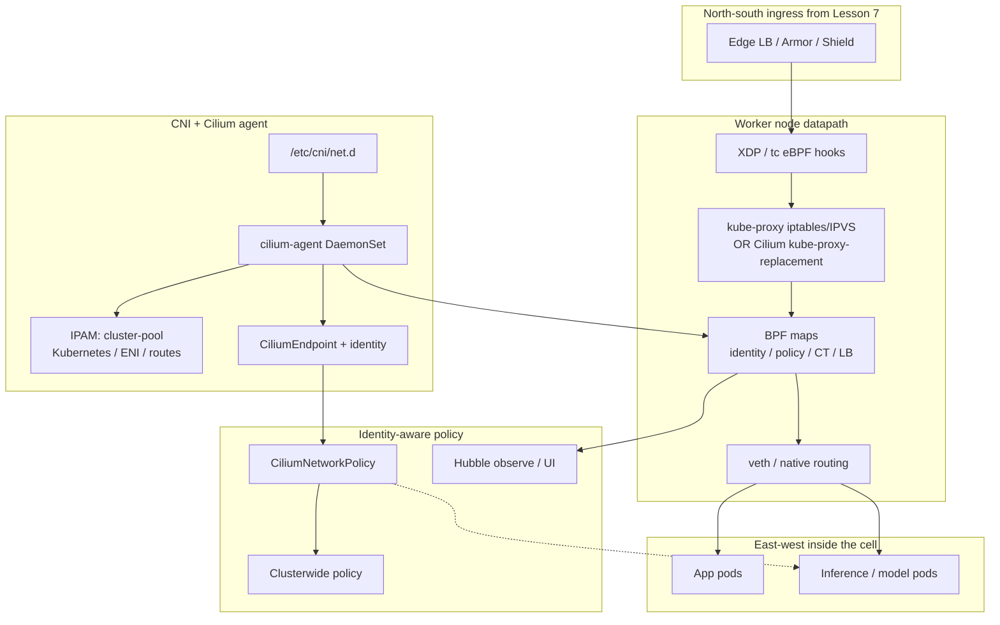

# Lesson 8 — Cluster networking: CNI, Cilium, eBPF fundamentals

*2026-09-16*

## What interviewers are really probing

Lessons [05](/lessons/05-cloud-networking-vpc-tgw) and [06](/lessons/06-cloud-interconnect-nat-bgp) built the **cloud fabric**; [07](/lessons/07-edge-lb-ddos-armor-shield) was the **public front door**. This lesson is **east-west inside the cell** — what happens after the packet is past the edge and lands on a worker.

They want an operator story, not a CNCF buzzword bingo: **CNI ADD/DEL/CHECK** and IPAM modes, why **kube-proxy iptables** melts at Service scale, what **Cilium’s eBPF datapath** replaces (maps, identities, endpoints), and how you **prove** policy with Hubble instead of guessing from `tcpdump`. Bonus if you name **DatapathMode** (veth vs native routing), **MTU/jumbo** traps with overlay, **ENI IP exhaustion**, and refuse “NetworkPolicy exists so we’re secure” without identity-aware defaults.

| Layer | What it does | Typical names | Hyperscale habit |
|---|---|---|---|
| **CNI** | Wire pod netns, IP, routes | Cilium, Calico, AWS VPC CNI, GKE Dataplane V2 | Pick IPAM for density + cloud limits |
| **Service LB** | ClusterIP / NodePort / ExternalIP | kube-proxy iptables/IPVS; Cilium kube-proxy-replacement | Prefer eBPF LB before iptables chains explode |
| **Identity / policy** | Who may talk to whom | labels → security identity; CNP / CCNP; K8s NetworkPolicy | Default-deny east-west; Hubble for drops |
| **Encryption** | Pod-to-pod confidentiality | WireGuard / IPsec (Cilium) | Encrypt when trust boundary ≠ node |
| **Observability** | Flow + drop reason | Hubble, bpftool, metrics | Drop reason before “open the firewall” |

## Core diagram: east-west after the front door




**Read it top-down:** Lesson 7 delivers north-south to the node. On the node, **eBPF** (XDP/tc) and either **kube-proxy** or **Cilium kube-proxy-replacement** steer Service traffic using **BPF maps**. The **CNI plugin** (conf under `/etc/cni/net.d/`) plus **cilium-agent** allocate IPs, create endpoints, and stamp **security identities** from labels. Policy (CNP/CCNP) and **Hubble** sit on that identity plane — east-west between app and inference pods is where you isolate model endpoints after the packet is already inside the cell.

Cross-link: VPC/TGW ([05](/lessons/05-cloud-networking-vpc-tgw)) and Interconnect/NAT ([06](/lessons/06-cloud-interconnect-nat-bgp)) are **between cells and clouds**. Edge LB ([07](/lessons/07-edge-lb-ddos-armor-shield)) is **ingress scrubbing**. This lesson is **pod-to-pod / pod-to-Service inside one cluster**.

## CNI interface & IPAM — what actually runs on ADD

CNI is a contract, not a brand. On pod create, kubelet invokes the configured plugin with **ADD** (create veth/move link, assign IP, write routes/DNS); on delete, **DEL**; readiness/liveness of the setup can use **CHECK**. Misconfigured conf files under `/etc/cni/net.d/` (wrong binary, stale 10-*.conflist, dual plugins fighting) show up as `FailedCreatePodSandBox` long before “Cilium is slow.”

**IPAM modes** (say which one you run in interviews):

| Mode | Idea | When it bites |
|---|---|---|
| **Cluster-pool** (Cilium) | Agent allocates from pre-carved pod CIDRs | Exhaust pool → pending pods; plan masks per node density |
| **Kubernetes** | Control plane / cloud allocator owns PodCIDR | Route programming must match node PodCIDR |
| **AWS ENI** | Secondary IPs / prefixes from ENIs | **ENI + IP exhaustion** per instance type; warm-pool math |
| **GCP routes / VPC-native** | Alias IPs / routes in VPC | Route quota; MTU with nested virt |
| **Azure** | CNI or overlay flavors | Subnet size vs node count; Windows edge cases |

```bash
# Which CNI won on the node?
ls -la /etc/cni/net.d/
cat /etc/cni/net.d/*.conflist 2>/dev/null | head -80

# Cilium agent alive?
kubectl get pods -n kube-system -l k8s-app=cilium -o wide
kubectl -n kube-system exec ds/cilium -- cilium status
```

## kube-proxy vs Cilium kube-proxy-replacement

**kube-proxy** implements Services with **iptables** (default) or **IPVS**. At hyperscale Service/Endpoint counts, iptables rule programming becomes a **control-plane + node CPU** tax: every Endpoint update rewrites chains; conntrack tables swell; NodePort hairpinning surprises you.

**Cilium kube-proxy-replacement** moves ClusterIP / NodePort / ExternalIP (and more) into **eBPF**: socket-level or tc/XDP LB, BPF maps for backends, fewer netfilter crossings. You still need a clear story on **hostPort**, **externalTrafficPolicy: Local**, and health-check NodePorts — replacement is not “delete kube-proxy and forget Services.”

```bash
# Are we still running kube-proxy?
kubectl get ds -n kube-system kube-proxy -o wide 2>/dev/null
kubectl -n kube-system exec ds/cilium -- cilium status --verbose | rg -i 'kube-proxy|masquerade|routing|ipam'

# Node iptables pressure (if not fully replaced)
sudo iptables-save | wc -l
sudo conntrack -C 2>/dev/null || cat /proc/sys/net/netfilter/nf_conntrack_count
```

**Interview nuance:** IPVS helps kube-proxy scale, but Cilium’s pitch is **one datapath** for routing + LB + policy + observability — not “IPVS bad.” Say what you measured (rule count, programming latency, P99) rather than slogan.

## Cilium operator depth — identity, endpoints, maps

Cilium does not primarily policy on **IP:port**. Labels resolve to a numeric **security identity**; endpoints (pods) carry that identity; BPF **policy maps** allow/deny by identity. IPs churn; identities are stable for a label set — that is why identity-aware policy survives rolling deploys better than brittle IP ACL fantasy.

| Object / concept | Operator meaning |
|---|---|
| **CiliumEndpoint** | Per-pod datapath state; identity, IPs, policy status |
| **Security identity** | Hash of relevant labels; shared by similarly labeled pods |
| **BPF maps** | CT, LB, policy, ipcache — live in kernel; size limits matter |
| **CiliumNetworkPolicy** | Namespaced L3/L4 (+ L7 with Envoy/DNS) |
| **CiliumClusterwideNetworkPolicy** | Fleet-wide defaults (kube-dns, world, cluster entities) |
| **Hubble** | Flow events + drop reasons from the datapath |

```bash
kubectl -n kube-system exec ds/cilium -- cilium endpoint list
kubectl -n kube-system exec ds/cilium -- cilium identity list | head
kubectl get cep -A | head
kubectl get cnp,ccnp -A
```

### eBPF fundamentals for operators (not kernel hackers)

| Hook | Rough job | Why you care |
|---|---|---|
| **XDP** | Earliest driver/NIC path | DDoS-ish drop / LB before sk_buff tax |
| **tc (clsact)** | Host/veth qdisc programs | Common Cilium attachment for policy + routing |
| **sockops / socket LB** | Socket-level redirection | kube-proxy-replacement shortcuts |

You do not write C in the interview. You **do** know: `cilium status` red is a stop-ship; `bpftool prog show` / `bpftool map show` prove programs are loaded; map pressure and verifier rejections show up as agent logs, not as “kubectl network flake.”

```bash
# On a node (or via debug pod with privileges)
bpftool prog show | head
bpftool map show | head
ip -d link show | head
# Cilium’s view of the datapath
kubectl -n kube-system exec ds/cilium -- cilium status
```

### Encryption, DatapathMode, hyperscale quirks

- **WireGuard vs IPsec:** WireGuard is often the operationally simpler transparent encryption; IPsec shows up for compliance matrices and older requirements. Encryption costs CPU and can interact with **MTU** — always re-validate MSS/MTU after enabling.
- **DatapathMode:** **veth** (classic) vs **native routing** (pods routable without overlay). Overlay (VXLAN/Geneve) eases IP continuity across L2 domains but burns MTU and buries headers; native routing wants cloud route/ENI alignment ([05](/lessons/05-cloud-networking-vpc-tgw)).
- **MTU / jumbo:** Overlay + jumbo + GPU RDMA multi-NIC fleets is a classic foot-gun — east-west training traffic is not the same as ClusterIP HTTP.
- **Conntrack pressure:** Even with eBPF CT, abuse and short-lived probes fill tables; NodePort to the world amplifies.
- **hostPort / NodePort:** hostPort pins host ports and fights scheduling density; `externalTrafficPolicy: Local` needs real local backends or you blackhole.
- **ENI IP exhaustion:** AWS VPC CNI / Cilium ENI mode — instance type limits secondary IPs; prefix delegation changes the math; pending pods with no obvious CPU pressure → check ENI/IP inventory.
- **ClusterMesh (tease only):** multi-cluster identities + service export; next-level after a single cell is healthy — do not hand-wave it as “just another peering.”

## Concrete commands & config

```bash
# Agent health + feature flags
kubectl get pods -n kube-system -l k8s-app=cilium -o wide
kubectl -n kube-system exec ds/cilium -- cilium status
kubectl -n kube-system exec ds/cilium -- cilium-health status

# Endpoints & identities
kubectl -n kube-system exec ds/cilium -- cilium endpoint list
kubectl -n kube-system exec ds/cilium -- cilium bpf tunnel list 2>/dev/null | head
kubectl -n kube-system exec ds/cilium -- cilium bpf lb list 2>/dev/null | head

# Hubble — see allows/denies with reason
kubectl -n kube-system exec ds/cilium -- hubble observe --since 5m --verdict DROPPED
kubectl -n kube-system exec ds/cilium -- hubble observe --since 5m \
  --from-pod tenant-a/frontend --to-pod tenant-a/backend

# CNI conf + link detail on the node
ls /etc/cni/net.d/
ip -d link show
bpftool prog show | rg -i cilium
```

```yaml
# CiliumNetworkPolicy — identity-aware L3/L4 (illustrative)
apiVersion: cilium.io/v2
kind: CiliumNetworkPolicy
metadata:
  name: allow-frontend-to-backend
  namespace: tenant-a
spec:
  endpointSelector:
    matchLabels:
      app: backend
  ingress:
    - fromEndpoints:
        - matchLabels:
            app: frontend
      toPorts:
        - ports:
            - port: "8080"
              protocol: TCP
---
# Clusterwide default: allow DNS, deny world from sensitive NS (sketch)
apiVersion: cilium.io/v2
kind: CiliumClusterwideNetworkPolicy
metadata:
  name: sensitive-default-deny-egress
spec:
  endpointSelector:
    matchLabels:
      security: sensitive
  egress:
    - toEndpoints:
        - matchLabels:
            k8s:io.kubernetes.pod.namespace: kube-system
            k8s-app: kube-dns
      toPorts:
        - ports:
            - port: "53"
              protocol: UDP
```

```bash
# Apply + confirm endpoint policy status
kubectl apply -f cnp-frontend-backend.yaml
kubectl -n kube-system exec ds/cilium -- cilium endpoint list | rg tenant-a
```

## Failures & fixes

| Symptom | Likely root cause | Fix / mitigation |
|---|---|---|
| Pods `FailedCreatePodSandBox` / CNI timeout | Broken `/etc/cni/net.d/`, agent CrashLoop, disk full on node | Fix conflist; `cilium status`; drain/replace node |
| Pending pods, free CPU/RAM | IPAM exhausted (cluster-pool / ENI IPs / subnet) | Expand pool; larger subnet; ENI prefix delegation; right-size instance |
| Service works on pod IP, fails on ClusterIP | kube-proxy rules stale; partial kube-proxy-replacement; BPF LB map issue | `cilium bpf lb list`; confirm replacement mode; check kube-proxy DS |
| Intermittent east-west timeouts | MTU/overlay mismatch; conntrack full; asymmetric routing | Clamp MTU/MSS; raise CT; prefer native routing where designed |
| NetworkPolicy “applied” but traffic still flows | K8s NP only; no default-deny; wrong selectors; Cilium not enforcing | Use CNP/CCNP; verify identity; Hubble DROPPED vs FORWARDED |
| Hubble quiet / no flows | Hubble not enabled; relay down; wrong namespace filter | Enable Hubble; port-forward relay; observe without over-filters |
| Node CPU pegged in softirq / iptables | Huge Service/Endpoint churn on iptables kube-proxy | IPVS or Cilium kube-proxy-replacement; reduce ClusterIP sprawl |
| hostPort / NodePort blackhole | `externalTrafficPolicy: Local` without local pods; port conflict | Policy Cluster; fix readiness; avoid hostPort for density |
| Policy drops after upgrade | Identity change (label renames); CCNP conflict | Diff identities; staged policy; Hubble drop reason |
| Encrypted flows fail path MTU | WireGuard/IPsec overhead ignored | Lower MTU; Path MTU discovery; validate with large payloads |

## Security & hardening

East-west is where **inference pods and model endpoints** get scraped by anything that already cleared the front door. CNI/eBPF policy is your microsegmentation; privileged agents and CRDs are part of the attack surface — treat them like control-plane.

| Control | Operator practice |
|---|---|
| **Identity-aware policy** | Prefer Cilium identities / CNP over IP lists; default-deny per namespace; explicit DNS egress |
| **Hubble visibility** | Alert on unexpected FORWARDED to model ports; keep DROPPED with reason in incident runbooks |
| **kube-proxy replacement risks** | Staged rollout; validate NodePort/health checks/LoadBalancer integration; do not dual-run conflicting LB modes blindly |
| **Privileged CNI DaemonSets** | cilium-agent needs host net/privileged caps — pin versions, PodSecurity baselines elsewhere, restrict who can exec into agent pods |
| **Admission / RBAC for Cilium CRDs** | Limit `create/update` on `ciliumnetworkpolicies`, `ciliumclusterwidenetworkpolicies`, `ciliumendpoints` (and related CRDs) to platform teams; review CCNP as carefully as ClusterRoles |
| **Encryption** | WireGuard/IPsec when nodes are multi-tenant or cross-trust; still combine with policy (encryption ≠ authorization) |
| **Inference / model endpoints** | East-west deny by default to GPU serving pods; allow only ingress gateway / specific clients; no pod-IP shortcuts from the whole cluster |

```bash
# Who can edit fleet-wide policy?
kubectl auth can-i create ciliumclusterwidenetworkpolicies --as=system:serviceaccount:ci:deployer
kubectl get ccnp -A

# Prove model NS is not world-open east-west
kubectl -n kube-system exec ds/cilium -- hubble observe --since 15m \
  --to-namespace model-serving --verdict FORWARDED
```

**AI/ML fleets:** after Lesson 7’s edge authn, assume a compromised tenant pod will probe `/v1/completions` on neighbor ClusterIPs. Identity-aware default-deny + Hubble on the model namespace is how you keep weights and GPU capacity from becoming an in-cluster free API.

## Interview soundbites

- **“CNI is ADD/DEL/CHECK plus IPAM — brands are implementations.”** Start from the contract and the failure modes.
- **“kube-proxy iptables is a rule compiler; eBPF LB is a map lookup.”** Scale story beats product loyalty.
- **“Cilium policies identities, not forever-IPs.”** Labels → security identity → BPF policy maps.
- **“Hubble drop reason before opening the firewall.”** Observability is part of the datapath sale.
- **“Native routing vs overlay is an MTU and cloud-route decision.”** Not a religion.
- **“Privileged CNI agents are trusted computing base.”** RBAC the CRDs; pin versions; watch exec.
- **“Encryption without policy is confidentiality without authorization.”** WireGuard ≠ allowlist.

## How this maps to the JD

Hyperscale compute roles own **cell networking under churn**: IPAM that does not strand capacity, Service LB that survives Endpoint storms, and **east-west isolation** that still lets platform traffic (DNS, metrics) work. You should sound fluent moving from VPC/TGW ([05](/lessons/05-cloud-networking-vpc-tgw)) and edge ([07](/lessons/07-edge-lb-ddos-armor-shield)) down into **CNI/eBPF**, then forward into NetworkPolicy depth.

Next in the arc: **NetworkPolicy, multi-NIC, sFlow**.

## Watch (talks & demos)

Real-world talks and demos that map to this lesson — watch after the Failures & fixes table.

### Liberating Kubernetes From Kube-proxy and Iptables — Martynas Pumputis, Cilium (CNCF)

Why iptables/netfilter struggle as the Service datapath and how eBPF + Cilium replace kube-proxy — foundational for the “maps not chains” interview answer.

<iframe width="100%" height="360" src="https://www.youtube.com/embed/bIRwSIwNHC0" title="Liberating Kubernetes From Kube-proxy and Iptables - Martynas Pumputis, Cilium" frameBorder="0" allow="accelerometer; autoplay; clipboard-write; encrypted-media; gyroscope; picture-in-picture; web-share" allowFullScreen></iframe>

[Open on YouTube](https://www.youtube.com/watch?v=bIRwSIwNHC0)

### Cilium: Connecting, Observing, and Securing Kubernetes and Beyond with eBPF — B. Mulligan & N. Bisht (CNCF)

Hyperscale-shaped story (large node/pod counts, east-west QPS) on adopting Cilium for connectivity, Hubble-style observability, and security — how the mental model holds past a demo cluster.

<iframe width="100%" height="360" src="https://www.youtube.com/embed/0ZnxpVkBxpo" title="Cilium: Connecting, Observing, and Securing Kubernetes and Beyond with eBPF" frameBorder="0" allow="accelerometer; autoplay; clipboard-write; encrypted-media; gyroscope; picture-in-picture; web-share" allowFullScreen></iframe>

[Open on YouTube](https://www.youtube.com/watch?v=0ZnxpVkBxpo)

### Kubernetes Network Observability with Cilium and Hubble — Tomasz Tarczyński

Day-2 operator view: flows L2–L7, metrics that matter, using observability to implement microsegmentation, and watching the CNI dataplane itself — pairs with the Hubble commands above.

<iframe width="100%" height="360" src="https://www.youtube.com/embed/kN5fGJ2zG1I" title="Kubernetes Network Observability with Cilium and Hubble - Tomasz Tarczyński" frameBorder="0" allow="accelerometer; autoplay; clipboard-write; encrypted-media; gyroscope; picture-in-picture; web-share" allowFullScreen></iframe>

[Open on YouTube](https://www.youtube.com/watch?v=kN5fGJ2zG1I)

## References

- [CNI specification](https://www.cni.dev/docs/spec/)
- [Cilium documentation](https://docs.cilium.io/)
- [Cilium kube-proxy replacement](https://docs.cilium.io/en/stable/network/kubernetes/kubeproxy-free/)
- [CiliumNetworkPolicy](https://docs.cilium.io/en/stable/security/policy/)
- [Hubble observability](https://docs.cilium.io/en/stable/observability/hubble/)
- [eBPF docs](https://ebpf.io/what-is-ebpf/)
- [bpftool](https://manpages.ubuntu.com/manpages/jammy/man8/bpftool.8.html)
- [Kubernetes Network Policies](https://kubernetes.io/docs/concepts/services-networking/network-policies/)
- Prior lessons: [05 — VPC / TGW](/lessons/05-cloud-networking-vpc-tgw), [06 — Interconnect / NAT / BGP](/lessons/06-cloud-interconnect-nat-bgp), [07 — Edge LB / DDoS](/lessons/07-edge-lb-ddos-armor-shield)

## Quick self-check

Out loud, in under two minutes:

1. Walk CNI ADD on a new pod — where does the IP come from in cluster-pool vs ENI mode, and what breaks when that pool is empty?
2. Why does kube-proxy iptables hurt at high Service/Endpoint churn, and what does Cilium put in BPF maps instead?
3. How does a Cilium security identity differ from “allow this pod IP,” and how would Hubble show a policy drop?
4. Name two hyperscale foot-guns: MTU with overlay vs native routing, and NodePort/`externalTrafficPolicy: Local` — what do you check first?
