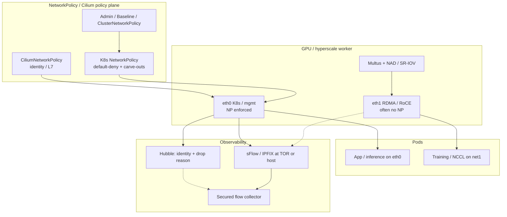

# Lesson 9 — NetworkPolicy, multi-NIC, sFlow

*2026-09-17*

## What interviewers are really probing

Lesson [08](/lessons/08-cni-cilium-ebpf) gave you the **datapath** (CNI, Cilium, eBPF, Hubble). This lesson is the **control story operators get wrong under pressure**: how **NetworkPolicy** actually composes, why **GPU/RDMA multi-NIC** nodes punch holes in that story, and when **sFlow/sampling** on the fabric is the right forensic tool vs identity-aware Hubble.

They are not asking you to recite the NetworkPolicy CRD fields. They want:

- **Default-allow vs default-deny** with a live DNS failure mode on the tip of your tongue
- Why **empty `podSelector`** and **AND across policies** surprise teams
- Why **secondary interfaces (Multus / SR-IOV / RoCE)** often **bypass** the policy you just demoed on `eth0`
- A crisp compare: **sFlow / NetFlow / IPFIX** (sampled IP tuples at TOR) vs **Hubble/eBPF** (identity + drop reason)

Cross-link the fabric: VPC/TGW ([05](/lessons/05-cloud-networking-vpc-tgw)), Interconnect/NAT/BGP ([06](/lessons/06-cloud-interconnect-nat-bgp)), edge scrubbing ([07](/lessons/07-edge-lb-ddos-armor-shield)), then east-west CNI ([08](/lessons/08-cni-cilium-ebpf)). This lesson sits **inside the cell**, on the policy + multi-plane NIC + sampling axis.

## Core diagram: policy plane, dual-NIC, fabric samples




**Read it top-down:** Policy (vanilla NP, Cilium CNP, and admin/baseline cluster policy) binds to the **primary CNI path** (`eth0`). Multus/SR-IOV hang a **secondary plane** (`eth1` / `net1`) for RDMA/NCCL that frequently **never sees** those NetworkPolicies. Hubble explains drops with **pod identity** on the K8s plane; **sFlow** samples IP/port at TOR or host for capacity and DDoS forensics — complementary, not interchangeable. The orange footgun in the PNG is deliberate: assume policy on `net1` and you will fail the interview *and* the incident.

## NetworkPolicy idiosyncrasies (operator depth)

### Default-allow is the silent default

Kubernetes NetworkPolicy is **additive allow** on selected pods. If **no** NetworkPolicy selects a pod, that pod is **unrestricted** (CNI-dependent, but this is the API contract you must say out loud). “We have NetworkPolicies somewhere in the cluster” is not a security posture.

**Default-deny pattern** (per namespace, both directions when you mean it):

1. A policy that selects all pods (`podSelector: {}`) with **empty** `ingress` / `egress` arrays — or explicit deny-all plus separate allow policies
2. Set `policyTypes: [Ingress, Egress]` so egress is not accidentally left open
3. Explicit **DNS** (and often metrics/API) egress carve-outs **before** you apply deny-all egress

| Selector / field | Gotcha |
|---|---|
| `podSelector: {}` | Selects **all pods in the namespace** — not “no pods” |
| Missing `policyTypes` with only `ingress` | Egress stays unrestricted for selected pods |
| `namespaceSelector: {}` | Means **all namespaces** — wider than most people intend |
| `ipBlock` + `except` | Easy to fat-finger; does not replace identity-aware policy |
| Multiple policies selecting same pod | Rules **combine with OR within a policy direction’s allows**, but selection is “any policy that selects you applies” — treat as **union of allows** once selected; still need default-deny base |

**Interview line:** “Empty podSelector equals the whole namespace. Empty namespaceSelector equals the whole cluster. I always pair deny-all with an explicit CoreDNS allow.”

### The DNS footgun (every fleet hits this once)

Apply egress default-deny **without** allowing UDP/TCP 53 to `kube-dns` / CoreDNS and you break:

- Service discovery by name
- Many readiness probes that resolve names
- Operators that “randomly” fail only after policy rollout

```yaml
# Minimal DNS egress carve-out (illustrative — label your DNS pods correctly)
apiVersion: networking.k8s.io/v1
kind: NetworkPolicy
metadata:
  name: allow-dns-egress
  namespace: tenant-a
spec:
  podSelector: {}
  policyTypes: ["Egress"]
  egress:
    - to:
        - namespaceSelector:
            matchLabels:
              kubernetes.io/metadata.name: kube-system
          podSelector:
            matchLabels:
              k8s-app: kube-dns
      ports:
        - protocol: UDP
          port: 53
        - protocol: TCP
          port: 53
```

### hostNetwork, kubelet, control-plane carve-outs

- **`hostNetwork: true` pods** typically **bypass** NetworkPolicy (they are on the host netns). DaemonSets for CNI, CSI, node agents — treat as **trusted computing base**, not “covered by NP.”
- **Kubelet health / node probes** and some cloud LB health checks talk to the **host** or NodePort path — policy on pod netns will not save a broken NodePort story ([08](/lessons/08-cni-cilium-ebpf)).
- **Control-plane / system namespaces**: do not casually default-deny `kube-system` without a written allow matrix (API server → webhook, metrics, DNS, CNI agents).

### CiliumNetworkPolicy vs vanilla NP (pointer, not a rehash of 08)

Vanilla NetworkPolicy is **L3/L4 + selectors**. CiliumNetworkPolicy adds **security identities**, optional **L7/DNS/FQDN**, and clusterwide defaults (CCNP). In interviews: “I use K8s NP for portable baseline; Cilium CNP when I need identity stability across IP churn and Hubble drop reasons” — then stop repeating Lesson 8’s maps lecture.

### AdminNetworkPolicy / Baseline / ClusterNetworkPolicy

Cluster admins needed **guardrails tenants cannot override**. Direction of travel:

- **AdminNetworkPolicy (ANP)** + **BaselineAdminNetworkPolicy (BANP)** (`policy.networking.k8s.io/v1alpha1`) — admin tier first (Allow/Deny/Pass), then namespaced NetworkPolicy, then baseline default
- **ClusterNetworkPolicy** (`v1alpha2`) consolidates admin/baseline into one API with a **`tier`** field (Admin vs Baseline)

Say in the interview: “Namespaced NetworkPolicy is the app contract; Admin/Baseline (or ClusterNetworkPolicy tiers) are the platform guardrails — Pass is how we delegate back to tenant policy.”

## Multi-NIC idiosyncrasies (GPU / RDMA hyperscale)

### Why the node has more than one NIC

Hyperscale and GPU nodes routinely split planes:

| Plane | Typical NIC | Traffic | Policy expectation |
|---|---|---|---|
| **Management / K8s primary** | eth0 (cloud ENI / bond) | kubelet, ClusterIP, DNS, control | NetworkPolicy / Cilium CNP |
| **RDMA / RoCE / InfiniBand** | eth1 / ib0 / SR-IOV VFs | NCCL, GPUDirect, storage RDMA | Often **fabric ACL / VF isolation only** |
| Optional | storage / backup NIC | snapshots, checkpoint pulls | Separate subnet + IAM |

Upcoming AI/ML topology lessons go deep on NVLink/NCCL; here you only need the **operator networking** punchline: **east-west training traffic may never touch the CNI you policy.**

### Multus / whereabouts / SR-IOV patterns

- **Multus**: meta-plugin; primary CNI stays default; secondary nets via **NetworkAttachmentDefinition (NAD)** + pod annotation `k8s.v1.cni.cncf.io/networks`
- **whereabouts** (or host-local / DHCP / cloud IPAM): IPAM for secondary interfaces without colliding across nodes
- **SR-IOV CNI + device plugin**: allocate VFs; pods get near-line-rate NICs; pairs with RDMA device plugins on GPU fleets

```yaml
apiVersion: v1
kind: Pod
metadata:
  name: gpu-train
  annotations:
    k8s.v1.cni.cncf.io/networks: rdma-net@eth1
spec:
  containers:
    - name: trainer
      image: registry.example/train:1
      resources:
        limits:
          nvidia.com/gpu: 8
          # plus sriov / rdma resource names as your device plugin exposes
```

### Routing asymmetry, default route, MTU

- Pod may have **two default routes** if the secondary CNI is sloppy — management traffic blackholes or hairpins via the RDMA fabric
- **Pin default route on eth0**; use explicit routes/on-link for the RDMA subnet only
- **MTU**: K8s plane often 1500 (or cloud overlay less); RDMA/RoCE often **9000** — do not “unify MTU” blindly across NICs
- Source-based routing / policy routing shows up when both NICs can reach overlapping CIDRs

### Policy enforcement gap (the huge security footgun)

Most NetworkPolicy implementations attach to the **primary CNI datapath**. Secondary interfaces from Multus/SR-IOV frequently **do not enforce** the same NetworkPolicy. Attack story: compromised tenant pod cannot hit model ClusterIP on eth0 (policy works) but can still speak **raw RDMA/TCP on net1** to a neighbor GPU pod if fabric ACLs are loose.

**Interview must-say:** “NetworkPolicy on the K8s NIC is not isolation for the RDMA NIC. I design the RDMA plane as a separate trust boundary — VLAN/VRF, VF ACLs, no secrets/metadata listeners bound there.”

## sFlow & related observability

| Mechanism | What you get | Strength | Weakness |
|---|---|---|---|
| **sFlow** | Packet **samples** + counters from switch/host | Cheap at TOR scale; capacity & DDoS trends | Not every flow; IP-centric; no K8s identity |
| **NetFlow / IPFIX** | Flow records (often sampled/aggregated) | Familiar NetOps tooling | Export volume; still identity-blind |
| **eBPF / Hubble** | Per-flow events with **pod/NS identity**, verdict, drop reason | Ties to NetworkPolicy/CNP | Node/agent scope; not a replace-all for fabric sampling |

**When operators enable sFlow:** TOR/spine capacity planning, elephant-flow detection, DDoS forensics correlating edge ([07](/lessons/07-edge-lb-ddos-armor-shield)) with east-west blowups, proving “was this hit at the fabric?” when Hubble is quiet (e.g. traffic never entered the pod netns).

**Hubble replaces vs complements:** Hubble **replaces** “guess which NetworkPolicy dropped me.” Fabric **sFlow complements** when you need **underlay** visibility, multi-tenant TOR contention, or traffic that **bypassed** the CNI (RDMA plane, hostNetwork, mis-routed secondary NIC). Best incident rooms use **both**: sample says which TOR pair lit up; Hubble says which identity was denied on eth0.

**Privacy / security of exports:** flow records leak **who talks to whom**, service topology, sometimes payload-derived ports that fingerprint apps. Treat collectors as **sensitive**: mTLS, ACLs, retention limits, no world-readable S3, RBAC on who can query. Same discipline as audit logs.

## Concrete commands & config

```bash
# What policies exist? Who do they select?
kubectl get networkpolicy -A
kubectl describe networkpolicy -n tenant-a
kubectl get cnp,ccnp -A 2>/dev/null
kubectl get anp,banp -A 2>/dev/null
kubectl get clusternetworkpolicy -A 2>/dev/null

# Prove enforcement (Cilium)
kubectl -n kube-system exec ds/cilium -- hubble observe --since 10m \
  --verdict DROPPED --namespace tenant-a
kubectl -n kube-system exec ds/cilium -- cilium endpoint list | rg tenant-a

# Multi-NIC / Multus on a node or debug pod
kubectl get net-attach-def -A
ip -d link show
ip route show table all | head
cat /etc/cni/net.d/*.conflist 2>/dev/null | head -100

# Inside a dual-homed pod
kubectl exec -it gpu-train -- ip addr
kubectl exec -it gpu-train -- ip route
kubectl exec -it gpu-train -- cat /etc/cni/net.d/ 2>/dev/null
```

```yaml
# Default-deny + allow frontend→backend on 8080 (vanilla NP)
apiVersion: networking.k8s.io/v1
kind: NetworkPolicy
metadata:
  name: default-deny-all
  namespace: tenant-a
spec:
  podSelector: {}
  policyTypes: ["Ingress", "Egress"]
---
apiVersion: networking.k8s.io/v1
kind: NetworkPolicy
metadata:
  name: allow-frontend-to-backend
  namespace: tenant-a
spec:
  podSelector:
    matchLabels:
      app: backend
  policyTypes: ["Ingress"]
  ingress:
    - from:
        - podSelector:
            matchLabels:
              app: frontend
      ports:
        - protocol: TCP
          port: 8080
```

```yaml
# Multus NetworkAttachmentDefinition sketch (secondary RDMA net)
apiVersion: k8s.cni.cncf.io/v1
kind: NetworkAttachmentDefinition
metadata:
  name: rdma-net
  namespace: gpu-jobs
spec:
  config: |
    {
      "cniVersion": "0.3.1",
      "type": "sriov",
      "ipam": {
        "type": "whereabouts",
        "range": "192.168.100.0/24"
      }
    }
```

```bash
# sFlow / sampling — switch side is vendor CLI; host-side agents vary.
# Operator checklist (illustrative):
# 1) sampling rate set on TOR (e.g. 1:1000) toward collector VIP
# 2) collector only accepts from TOR mgmt VRF
# 3) correlate timestamps with Hubble / metrics during incident
```

## Failures & fixes

| Symptom | Likely root cause | Fix / mitigation |
|---|---|---|
| After NP rollout, all DNS / Service names fail | Egress deny without DNS carve-out | Allow kube-dns:53 UDP/TCP; retest `nslookup` |
| Policy YAML applied; traffic still flows | No default-deny; wrong namespace; pod not selected; CNI not enforcing NP | `kubectl describe np`; confirm CNI supports NP; add deny-all; Hubble FORWARDED |
| “Empty selector” locked the wrong NS | `podSelector: {}` or `namespaceSelector: {}` broader than intended | Tighten labels; use ANP Pass carefully |
| GPU job hangs on NCCL, K8s HTTP fine | Secondary NIC down / wrong VF / MTU / IPAM collision | Check Multus annotation, NAD, `ip addr` in pod, whereabouts allocations |
| App reaches peer on RDMA IP despite NP deny on ClusterIP | Policy only on primary CNI | Fabric ACL / separate VRF; do not bind sensitive listeners on RDMA plane |
| Asymmetric timeouts / return path fails | Dual default routes; wrong source IP | Policy routing; pin default via eth0 |
| sFlow collector flooded / missing | Sampling rate too hot/cold; ACL blocks exporters | Tune sample rate; VRF-limit exporters; watch collector CPU |
| Hubble quiet during TOR meltdown | Traffic never hit pod netns (underlay / secondary NIC) | Use fabric sFlow/IPFIX; check Multus path |
| hostNetwork DaemonSet ignores NP | Expected bypass | Isolate via node firewall / PSS; limit privileged DS |
| Tenant overrides platform deny | Only namespaced NP; no Admin/Baseline tier | Introduce ANP/BANP or ClusterNetworkPolicy Admin tier |

## Security & hardening

This lesson’s security story is **segmentation that survives multi-NIC and observability that does not become a leak**.

| Control | Operator practice |
|---|---|
| **NetworkPolicy default-deny** | Per sensitive NS: deny ingress+egress, explicit allows, DNS carve-out, prove with Hubble DROPPED |
| **Multi-NIC isolation** | Treat RDMA/RoCE as **separate trust zone**: VF ACLs, VLAN/VRF, no cluster credentials or IMDS listeners on that plane |
| **Inference / model pod isolation** | Default-deny east-west to model NS on **eth0**; allow only ingress gateway / ranked clients; **also** block casual access to RDMA endpoints between tenants |
| **Admission / RBAC for policy CRDs** | Restrict `create/update/delete` on `networkpolicies`, `ciliumnetworkpolicies`, `ciliumclusterwidenetworkpolicies`, `adminnetworkpolicies`, `baselineadminnetworkpolicies`, `clusternetworkpolicies` to platform break-glass roles |
| **sFlow / sampling data sensitivity** | Collectors behind mTLS + network ACL; short retention; no public buckets; treat flow logs like audit (topology + PII risk) |
| **Secrets not on RDMA plane** | No Secret mounts needed solely for NCCL; no sidecar that scrapes API on `net1`; metadata/IMDS only via mgmt NIC if at all |
| **hostNetwork / privileged CNI** | Already TCB from [08](/lessons/08-cni-cilium-ebpf) — NP will not save you; PSS + RBAC + pinned versions |

```bash
# Who can edit policy objects?
kubectl auth can-i create networkpolicies -n tenant-a --as=system:serviceaccount:ci:deployer
kubectl auth can-i create adminnetworkpolicies --as=system:serviceaccount:ci:deployer

# Model NS: unexpected FORWARDED is a finding
kubectl -n kube-system exec ds/cilium -- hubble observe --since 30m \
  --to-namespace model-serving --verdict FORWARDED
```

**AI/ML angle:** a stolen training pod with Multus `net1` is an **east-west GPU backplane attacker**. Harden eth0 with NetworkPolicy *and* assume the RDMA fabric needs **non-K8s** controls — or you will “pass” a NetworkPolicy audit while NCCL still cross-talks tenants.

## Interview soundbites

- **“Default-allow until a policy selects you — empty podSelector selects the whole namespace.”**
- **“Egress deny without DNS is a self-inflicted outage, not a security win.”**
- **“Policies that select the same pod union their allows; start from deny-all.”**
- **“hostNetwork bypasses NetworkPolicy — DaemonSets are TCB.”**
- **“Multus secondary NICs often skip NetworkPolicy — RDMA is a separate trust boundary.”**
- **“Pin default route on eth0; jumbo MTU only on the RDMA plane.”**
- **“sFlow samples IPs at the fabric; Hubble explains identity and drop reason — use both.”**
- **“Flow collectors are sensitive systems — ACL and retention like audit logs.”**
- **“Admin/Baseline (or ClusterNetworkPolicy tiers) are platform guardrails tenants should not override.”**

## How this maps to the JD

Hyperscale roles own **cell security under multi-plane networking**: NetworkPolicy that does not strand DNS, GPU nodes with **mgmt vs RDMA** NICs, and observability that spans **fabric samples** and **datapath identity**. You should connect Lessons [05](/lessons/05-cloud-networking-vpc-tgw)–[08](/lessons/08-cni-cilium-ebpf) into one story: cloud fabric → edge → CNI/eBPF → **policy + multi-NIC + sampling**.

Next in the arc: **Service mesh (Istio/Envoy/Linkerd & mTLS)** — where L7 identity meets what NetworkPolicy started at L3/L4.

## Watch (talks & demos)

Real talks that map to this lesson — watch after the Failures & fixes table.

### Adopting Network Policies in Highly Secure Environments — Raymond de Jong, Isovalent (CNCF)

Coarse-to-fine NetworkPolicy / Cilium policy adoption, DNS/FQDN restrictions, and Hubble for proving allows/denies — the operator rollout narrative behind default-deny.

<iframe width="100%" height="360" src="https://www.youtube.com/embed/yikVhGM2ye8" title="Adopting Network Policies in Highly Secure Environments - Raymond de Jong, Isovalent" frameBorder="0" allow="accelerometer; autoplay; clipboard-write; encrypted-media; gyroscope; picture-in-picture; web-share" allowFullScreen></iframe>

[Open on YouTube](https://www.youtube.com/watch?v=yikVhGM2ye8)

### Build Your Own Private 5G Network on Kubernetes — Frank Zdarsky & Raymond Knopp (CNCF)

Multus, SR-IOV CNI, device plugins, and multi-homed pods under real latency/bandwidth pressure — the same multi-NIC patterns GPU/RDMA fleets reuse (even if the workload is 5G CNFs).

<iframe width="100%" height="360" src="https://www.youtube.com/embed/R_JOhWlwsXo" title="Build Your Own Private 5G Network on Kubernetes - Frank Zdarsky, Red Hat and Raymond Knopp, Eurecom" frameBorder="0" allow="accelerometer; autoplay; clipboard-write; encrypted-media; gyroscope; picture-in-picture; web-share" allowFullScreen></iframe>

[Open on YouTube](https://www.youtube.com/watch?v=R_JOhWlwsXo)

### High Performance Networking with KubeVirt — Doug Smith & Abdul Halim (CNCF)

SR-IOV device plugin, VF scheduling, and high-performance secondary interfaces in Kubernetes — grounding for why secondary NICs exist and why they sit outside “one NetworkPolicy to rule them all.”

<iframe width="100%" height="360" src="https://www.youtube.com/embed/dhQ51C4F8WE" title="High Performance Networking with KubeVirt - Doug Smith, Red Hat and Abdul Halim, Intel" frameBorder="0" allow="accelerometer; autoplay; clipboard-write; encrypted-media; gyroscope; picture-in-picture; web-share" allowFullScreen></iframe>

[Open on YouTube](https://www.youtube.com/watch?v=dhQ51C4F8WE)

## References

- [Kubernetes Network Policies](https://kubernetes.io/docs/concepts/services-networking/network-policies/)
- [Network Policy API (Admin / Baseline / ClusterNetworkPolicy)](https://network-policy-api.sigs.k8s.io/)
- [Cilium Network Policy](https://docs.cilium.io/en/stable/security/policy/)
- [Hubble observability](https://docs.cilium.io/en/stable/observability/hubble/)
- [Multus CNI](https://github.com/k8snetworkplumbingwg/multus-cni)
- [SR-IOV CNI](https://github.com/k8snetworkplumbingwg/sriov-cni)
- [whereabouts IPAM](https://github.com/k8snetworkplumbingwg/whereabouts)
- [sFlow.org](https://sflow.org/)
- Prior lessons: [05 — VPC / TGW](/lessons/05-cloud-networking-vpc-tgw), [06 — Interconnect / NAT / BGP](/lessons/06-cloud-interconnect-nat-bgp), [07 — Edge LB / DDoS](/lessons/07-edge-lb-ddos-armor-shield), [08 — CNI / Cilium / eBPF](/lessons/08-cni-cilium-ebpf)

## Quick self-check

Out loud, in under two minutes:

1. What does an empty `podSelector` mean, and what breaks if you default-deny egress without DNS?
2. How do multiple NetworkPolicies that select the same pod compose, and why is default-deny the required base?
3. Why can a GPU pod still talk to a neighbor over RDMA after NetworkPolicy denies ClusterIP on eth0 — and what do you do about it?
4. When do you reach for **sFlow at the TOR** vs **Hubble drop reason** — and why are flow collectors a security boundary?
