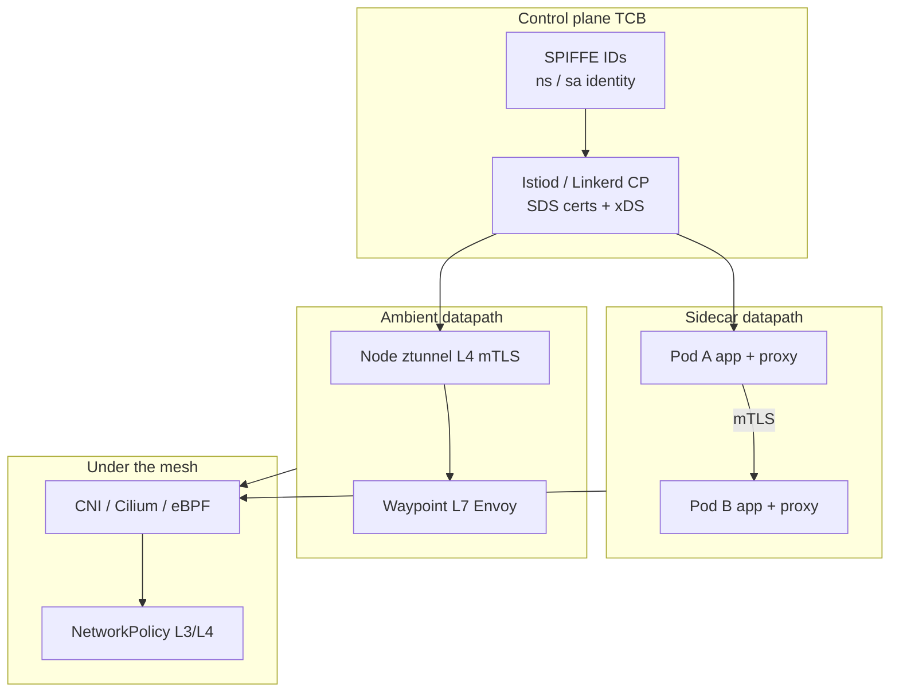

# Lesson 10 — Service mesh: Istio/Envoy/Linkerd & mTLS

*2026-09-18*

## What interviewers are really probing

Lessons [08](/lessons/08-cni-cilium-ebpf) and [09](/lessons/09-networkpolicy-multi-nic-sflow) gave you **CNI datapath** and **L3/L4 NetworkPolicy**. This lesson is what sits **on top**: a **service mesh** that terminates **identity-aware mTLS**, steers L7 traffic, and — if you misconfigure it — becomes the loudest outage and the softest “security theater” in the fleet.

They are not asking you to memorize every `VirtualService` field. They want:

- **Mesh ≠ NetworkPolicy** — NP is packet allow/deny on the CNI path; mTLS is **cryptographic identity** between workloads (SPIFFE). You need both stories.
- **STRICT vs PERMISSIVE** with a live migration failure mode (plaintext clients, half-injected namespaces, 503 cascades)
- Why **sidecars are TCB**, why **ambient** moves trust to ztunnel/waypoint, and what that does to blast radius
- Concrete operator tooling: `istioctl`, `linkerd`, Envoy admin, `PeerAuthentication` / `AuthorizationPolicy`, DestinationRule TLS modes

Cross-link: CNI/eBPF ([08](/lessons/08-cni-cilium-ebpf)) → NetworkPolicy / multi-NIC ([09](/lessons/09-networkpolicy-multi-nic-sflow)) → **this lesson**. Mesh does not fix RDMA planes that bypass CNI; it also does not replace default-deny NetworkPolicy.

## Core diagram: control plane, sidecar vs ambient, policy stack




**Read it top-down:** Control plane issues short-lived workload certs (SPIFFE) and pushes xDS. Classic path = **per-pod proxy** (Envoy in Istio, Linkerd-proxy in Linkerd) terminating mTLS beside the app. Ambient path = **shared ztunnel** for L4 mTLS (+ optional waypoint for L7). Underneath, [08](/lessons/08-cni-cilium-ebpf) still owns pod networking and [09](/lessons/09-networkpolicy-multi-nic-sflow) still owns L3/L4 allow/deny. Encrypted free-for-all without AuthorizationPolicy is not zero-trust.

## Idiosyncrasies / operator depth

### Mesh sits on CNI — composition rules

| Layer | What it answers | What it does *not* do |
|---|---|---|
| **CNI / eBPF** ([08](/lessons/08-cni-cilium-ebpf)) | How packets get to pods; Hubble drop reason | App identity crypto |
| **NetworkPolicy / CNP** ([09](/lessons/09-networkpolicy-multi-nic-sflow)) | Who may speak L3/L4 to whom | Encrypt or prove identity |
| **PeerAuthentication** | Accept plaintext, mTLS, or mTLS-only | Authorization / “who may call” |
| **AuthorizationPolicy** | Identity-based allow/deny (and L7 when configured) | Replace default-deny NP on the wire |
| **DestinationRule / VirtualService** | TLS mode to upstream, splits, retries, timeouts | Fix a missing STRICT PeerAuthentication |

**Interview line:** “NetworkPolicy is the packet firewall; mTLS is the passport check; AuthorizationPolicy is the guest list. I never claim mesh ‘replaces’ NetworkPolicy.”

### STRICT vs PERMISSIVE (the migration footgun)

Istio `PeerAuthentication` modes (mesh / namespace / workload):

| Mode | Server accepts | When you use it |
|---|---|---|
| **PERMISSIVE** | Plaintext **or** mTLS | Migration; mixed injected/non-injected clients |
| **STRICT** | **mTLS only** | Steady-state zero-trust baseline |
| **DISABLE** | Plaintext only | Break-glass / legacy islands (treat as debt) |

Linkerd’s default posture is closer to **mTLS on for meshed↔meshed** with less YAML ceremony — but you still own **opaque ports**, **skip ports**, and **Server / ServerAuthorization** (or newer policy CRDs) for who may connect.

**PERMISSIVE forever in prod** = you encrypted the compliant clients and left a plaintext hole for everything else. Attackers (and confused apps) take the hole.

### Sidecar as TCB vs ambient trust shift

**Sidecar model**

- Init/redirect (iptables or equivalent) + proxy container share the pod network namespace
- App compromise ≠ automatic cert theft *if* keys stay in proxy memory — but **proxy CVE / malicious config** is still TCB
- Cost: inject churn, CPU/RAM tax, `istio-proxy` restart storms, init-container races with CNI

**Ambient (Istio)**

- **ztunnel** (per-node, typically Rust) does L4 HBONE/mTLS
- **waypoint** (Envoy) optional for L7 policies per namespace/service
- Trust moves to **node agent + shared waypoint**: fewer sidecars, different blast radius (node ztunnel down = many pods hurt)

Say out loud: “Ambient reduces sidecar tax; it does not delete the need for STRICT + AuthZ + locked-down control plane.”

### SPIFFE / SPIRE

- Default Istio identity: `spiffe://<trust-domain>/ns/<namespace>/sa/<serviceaccount>`
- **SPIRE** when you need stronger **attestation**, multi-cluster federation, or non-K8s workloads joining the same trust domain
- Certs via **SDS** (Unix domain socket into the proxy) — private keys should not land as mounted Secret files in the app container

### VirtualService / DestinationRule gotchas

- **DestinationRule `trafficPolicy.tls.mode`**: `ISTIO_MUTUAL` vs `SIMPLE` vs `DISABLE` — wrong mode = 503s that look like “mesh is broken”
- **VirtualService** without matching **Gateway** / host / subset labels = silent no-match (traffic falls through unexpectedly)
- **Retries on non-idempotent POSTs** = duplicate side effects; mesh retries are not free correctness
- **Outlier detection** ejecting the only healthy pod during a control-plane blip = self-DDoS
- **Headless / raw IP / Multi-NIC**: mesh interception often only on the **primary** path — same class of footgun as Multus in [09](/lessons/09-networkpolicy-multi-nic-sflow)

### Envoy admin & debugging instinct

When “Service A cannot talk to B after mesh”:

1. Is B **injected / in ambient**? (`istioctl proxy-status`, `linkerd viz edges`)
2. PeerAuthentication mode on B’s namespace?
3. AuthorizationPolicy deny?
4. DestinationRule TLS mode?
5. Envoy clusters/listeners: `istioctl proxy-config` or Envoy admin `/:15000`

## Concrete commands & config

```bash
# --- Istio ---
istioctl version
istioctl proxy-status
istioctl analyze -n payments
istioctl pc listeners deploy/frontend -n payments
istioctl pc clusters deploy/frontend -n payments
istioctl pc routes deploy/frontend -n payments
istioctl pc secret deploy/frontend -n payments   # SDS certs present?

# Auth dumps / config
kubectl get peerauthentication,authorizationpolicy,destinationrule,virtualservice -A
kubectl -n istio-system get peerauthentication
istioctl x desc pod frontend-xxx -n payments

# Envoy admin (port-forward carefully — treat as sensitive)
kubectl -n payments port-forward deploy/frontend 15000:15000
# then: curl -s localhost:15000/certs | head
#       curl -s localhost:15000/clusters | rg payments

# --- Linkerd ---
linkerd check
linkerd viz edges -n payments
linkerd identity -n payments deploy/frontend
linkerd viz tap deploy/frontend -n payments --to deploy/backend
```

```yaml
# Lock a namespace to mTLS-only (Istio)
apiVersion: security.istio.io/v1
kind: PeerAuthentication
metadata:
  name: default
  namespace: payments
spec:
  mtls:
    mode: STRICT
---
# Identity allowlist: frontend SA may call backend on 8080
apiVersion: security.istio.io/v1
kind: AuthorizationPolicy
metadata:
  name: backend-allow-frontend
  namespace: payments
spec:
  selector:
    matchLabels:
      app: backend
  action: ALLOW
  rules:
    - from:
        - source:
            principals:
              - "cluster.local/ns/payments/sa/frontend"
      to:
        - operation:
            methods: ["GET", "POST"]
            ports: ["8080"]
---
# Explicit ISTIO_MUTUAL to a subset (DestinationRule)
apiVersion: networking.istio.io/v1
kind: DestinationRule
metadata:
  name: backend
  namespace: payments
spec:
  host: backend.payments.svc.cluster.local
  trafficPolicy:
    tls:
      mode: ISTIO_MUTUAL
  subsets:
    - name: v2
      labels:
        version: v2
```

```yaml
# Mesh-wide STRICT (put in istio root NS — high blast radius; stage carefully)
apiVersion: security.istio.io/v1
kind: PeerAuthentication
metadata:
  name: default
  namespace: istio-system
spec:
  mtls:
    mode: STRICT
```

```bash
# Prove STRICT: plaintext from a non-mesh pod should fail
kubectl -n payments exec deploy/legacy-curl -c curl -- \
  curl -sS -o /dev/null -w "%{http_code}\n" http://backend.payments:8080/
# Expect failure / connection reset once STRICT + no plaintext path

# Prove AuthZ: wrong SA should get RBAC deny (HTTP 403 via Envoy)
```

## Failures & fixes

| Symptom | Likely root cause | Fix / mitigation |
|---|---|---|
| Mass 503 after enabling mesh | Missing sidecar / ambient join; DR TLS mismatch; dest not ready | `istioctl proxy-status`; check inject labels; align `ISTIO_MUTUAL` |
| Works in PERMISSIVE, dies in STRICT | Plaintext or non-mesh clients still calling | Finish injection/ambient; temporary PERMISSIVE only for known stragglers; AuthZ on plaintext paths |
| Intermittent mTLS failures | Cert rotation race; SDS socket issue; clock skew | Check `istioctl pc secret`; node time sync; proxy logs for SDS |
| “mTLS on” but any SA can call | PeerAuthentication without AuthorizationPolicy | Add AuthZ allowlists; default-deny AuthZ pattern |
| DNS / init hang on inject | CNI + iptables race; exclude ports wrong | Align CNI with mesh docs; hold app until proxy ready; fix `traffic.sidecar.istio.io/excludeOutboundPorts` |
| Linkerd tap shows no mTLS | Opaque/skip ports; unmeshed peer | `linkerd identity`; check Server annotations / opaque ports |
| Ambient: L7 AuthZ ignored | Policy needs **waypoint**; only ztunnel in path | Deploy waypoint for that NS/service; attach correctly |
| Control plane / webhook outage | istiod / injector down; certificate for webhook expired | HA istiod; monitor webhook; break-glass disable inject carefully |
| GPU/RDMA peer still plaintext | Secondary NIC bypasses mesh intercept ([09](/lessons/09-networkpolicy-multi-nic-sflow)) | Do not bind sensitive listeners on RDMA; fabric ACL; mesh only the API plane |
| Envoy admin / debug ports exposed | 15000/15006 reachable cluster-wide | NetworkPolicy + AuthZ; never NodePort admin; audit who can `port-forward` |

## Security & hardening

This lesson’s security story is **identity that is enforced**, not “TLS somewhere in the YAML.”

| Control | Operator practice |
|---|---|
| **STRICT mTLS baseline** | Stage PERMISSIVE → STRICT per namespace; mesh-wide STRICT only after `istioctl analyze` + traffic proof |
| **AuthorizationPolicy** | Default-deny AuthZ in sensitive NS; allow by SPIFFE/`principals` / SA — not by source IP alone |
| **Sidecars / ztunnel as TCB** | Pin proxy versions; gate upgrades; treat proxy CVEs like node agent CVEs; limit who can edit mesh CRDs |
| **Control-plane exposure** | No public istiod; private discovery; webhook TLS healthy; RBAC on `peerauthentications`, `authorizationpolicies`, gateways |
| **Cert rotation** | Short-lived workload certs via SDS; alert on SDS failures; protect root/intermediate CA (and SPIRE server) like production KMS |
| **Ambient vs sidecar trust** | Document blast radius: ztunnel/node compromise vs per-pod proxy; waypoints are shared L7 PEPs — harden them |
| **Namespace isolation** | Injection labels only on intended NS; deny cross-NS principals unless explicitly allowed; pair with [09](/lessons/09-networkpolicy-multi-nic-sflow) default-deny |
| **Compose with CNI NP** | Mesh AuthZ **and** NetworkPolicy — defense in depth when proxy is bypassed or mis-injected |
| **AI/ML inference east-west** | Put **inference API pods** in mesh (sidecar or ambient) with STRICT + AuthZ from ranked clients / ingress gateway only |
| **Weights / registries / checkpoints** | **Outside** the mesh trust story: private registry, image signing/provenance (cosign/SLSA mindset), bucket IAM + encryption for checkpoints — mesh mTLS does not protect an unsigned `latest` pull |
| **Training RDMA plane** | Assume Multus/RDMA **bypasses** mesh ([09](/lessons/09-networkpolicy-multi-nic-sflow)); isolate fabric; never put model-store credentials on that NIC |

```bash
# Who can mutate mesh security objects?
kubectl auth can-i create peerauthentications -A \
  --as=system:serviceaccount:ci:deployer
kubectl auth can-i create authorizationpolicies -n model-serving \
  --as=system:serviceaccount:ci:deployer

# Model NS: unexpected plaintext or broad allow is a finding
kubectl get peerauthentication,authorizationpolicy -n model-serving -o yaml | rg -n "PERMISSIVE|DISABLE|{}|principals"
```

**AI/ML punchline:** meshing the inference Service stops casual east-west scrapes of the HTTP API; it does **nothing** for a world-readable weight bucket or an unsigned image. Split the trust domains on purpose.

## Interview soundbites

- **“Mesh sits on CNI — NetworkPolicy is L3/L4; mTLS is identity. I run both.”**
- **“PERMISSIVE is a migration mode, not a production posture.”**
- **“STRICT without AuthorizationPolicy is encrypted any-to-any.”**
- **“Sidecar proxy is TCB; ambient moves trust to ztunnel and waypoints — different blast radius, same need for AuthZ.”**
- **“SPIFFE `ns/sa` identity beats IP allowlists when pods churn.”**
- **“503 after mesh is usually inject, PeerAuthentication, DestinationRule TLS mode, or AuthZ — in that debug order.”**
- **“VirtualService retries are not free correctness.”**
- **“Envoy admin ports are sensitive — NetworkPolicy them like etcd.”**
- **“Inference APIs in mesh; model weights and registries hardened outside the mesh.”**
- **“RDMA/Multus often bypasses mesh intercept — same footgun as NetworkPolicy on eth1.”**

## How this maps to the JD

Hyperscale platform roles own **east-west zero-trust without melting the fleet**: mTLS that survives migration, AuthZ that matches SPIFFE identities, control planes that are not public, and an honest story about **what the mesh cannot see** (RDMA, weight registries). You should connect [08](/lessons/08-cni-cilium-ebpf)–[09](/lessons/09-networkpolicy-multi-nic-sflow)–**10** into one sentence: datapath → packet policy → identity policy.

Next in the arc: **Cluster security (PSS, admission, RBAC, IAM least privilege & audit)** — hardening the control surface the mesh depends on.

## Watch (talks & demos)

Real talks that map to this lesson — watch after the Failures & fixes table.

### Is Istio Ambient Mesh Secure? — Christian Posta & John Howard (Istio Day / CNCF)

Threat model for sidecarless ambient: how ztunnel/waypoint preserve (or shift) mTLS and workload identity boundaries vs classic sidecars — the interview-grade ambient security narrative.

<iframe width="100%" height="360" src="https://www.youtube.com/embed/QnfrbbY_Hy4" title="Is Istio Ambient Mesh Secure? - Christian Posta, Solo.io and John Howard, Google" frameBorder="0" allow="accelerometer; autoplay; clipboard-write; encrypted-media; gyroscope; picture-in-picture; web-share" allowFullScreen></iframe>

[Open on YouTube](https://www.youtube.com/watch?v=QnfrbbY_Hy4)

### Life of a Request in Istio Ambient Mesh — Gregory Hanson, Solo.io

Request path through ztunnel and waypoints (vs sidecar-to-sidecar) — how to debug ambient the way operators already debug Envoy 503s.

<iframe width="100%" height="360" src="https://www.youtube.com/embed/IVADUaLqJbE" title="Life of a Request in Istio Ambient Mesh - Gregory Hanson, Solo.io" frameBorder="0" allow="accelerometer; autoplay; clipboard-write; encrypted-media; gyroscope; picture-in-picture; web-share" allowFullScreen></iframe>

[Open on YouTube](https://www.youtube.com/watch?v=IVADUaLqJbE)

### Next-Level Security: Implementing mTLS in Istio Multi-Cluster Environments Using SPIRE — Eduardo Bonilla Rodriguez & Samuel Veloso (KubeCon EU 2024)

SPIFFE/SPIRE attestation + Istio SDS for multi-cluster mTLS — when default cluster trust domain is not enough.

<iframe width="100%" height="360" src="https://www.youtube.com/embed/fz3UJ35J9d8" title="Next-Level Security: Implementing mTLS in Istio Multi-Cluster Environments Using SPIRE" frameBorder="0" allow="accelerometer; autoplay; clipboard-write; encrypted-media; gyroscope; picture-in-picture; web-share" allowFullScreen></iframe>

[Open on YouTube](https://www.youtube.com/watch?v=fz3UJ35J9d8)

## References

- [Istio Security overview](https://istio.io/latest/docs/concepts/security/)
- [Istio Mutual TLS migration (PERMISSIVE → STRICT)](https://istio.io/latest/docs/tasks/security/authentication/mtls-migration/)
- [Istio PeerAuthentication](https://istio.io/latest/docs/reference/config/security/peer_authentication/)
- [Istio AuthorizationPolicy](https://istio.io/latest/docs/reference/config/security/authorization-policy/)
- [Istio Ambient mesh](https://istio.io/latest/docs/ambient/)
- [SPIFFE / SPIRE](https://spiffe.io/)
- [Linkerd automatic mTLS](https://linkerd.io/2/features/automatic-mtls/)
- [Linkerd policy](https://linkerd.io/2/features/policy/)
- [Envoy admin interface](https://www.envoyproxy.io/docs/envoy/latest/operations/admin)
- Prior lessons: [08 — CNI / Cilium / eBPF](/lessons/08-cni-cilium-ebpf), [09 — NetworkPolicy / multi-NIC / sFlow](/lessons/09-networkpolicy-multi-nic-sflow)

## Quick self-check

Out loud, in under two minutes:

1. How do NetworkPolicy and mesh mTLS compose — and why is “we have a mesh” not a segmentation answer?
2. What breaks when you flip PeerAuthentication to STRICT while some clients are still plaintext / unmeshed?
3. Sidecar vs ambient: where does the TCB live, and what is the blast radius of a ztunnel failure?
4. Why do inference API pods belong in the mesh while model weight buckets and image registries need a *different* hardening story?
