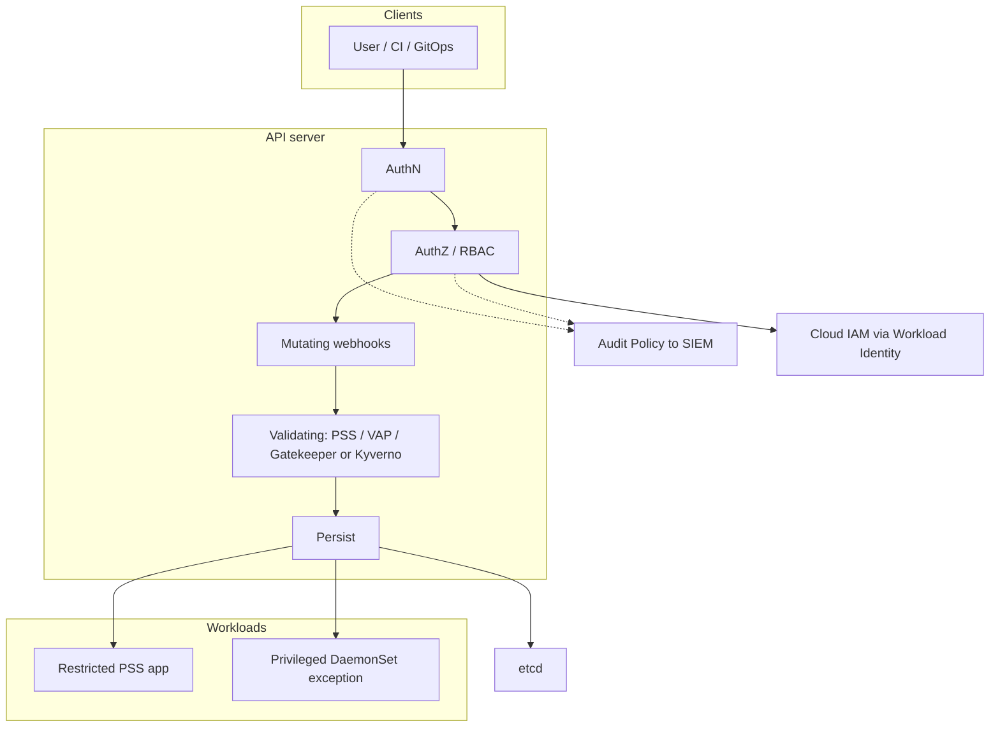

# Lesson 11 — Cluster security: PSS, admission, RBAC, IAM least privilege & audit

*2026-09-19*

## What interviewers are really probing

Lessons [08](/lessons/08-cni-cilium-ebpf)–[09](/lessons/09-networkpolicy-multi-nic-sflow)–[10](/lessons/10-service-mesh-istio-linkerd-mtls) secured the **datapath**, the **packet firewall**, and **workload identity**. This lesson is the **control-plane / identity / admission** layer those depend on: who can create a privileged pod, who can bind `cluster-admin`, which cloud principal a ServiceAccount becomes, and whether your audit trail will catch the escalation.

They are not asking you to recite every PSS field. They want:

- **Pod Security Standards** (Privileged / Baseline / Restricted) as **namespace labels** with `enforce` / `audit` / `warn` — and how that replaced deprecated **PodSecurityPolicy**
- **Admission** as a chain (mutating → validating) plus **webhook availability as fleet risk** (`failurePolicy: Fail` vs `Ignore`)
- **RBAC** least privilege: dangerous verbs (`escalate`, `bind`, `impersonate`, `*`), aggregation, `kubectl auth can-i`, BoundServiceAccountTokenVolume
- **Cloud IAM** mapped to K8s SAs (IRSA / Workload Identity) — why node instance roles are too broad
- **Audit** that detects secret reads and privilege escalation, not just “logging is on”

**Interview sentence:** “NetworkPolicy + mesh AuthZ + PSS/admission/RBAC is defense in depth. Any one alone is theater.”

## Core diagram: API server chain, PSS, RBAC, IAM, audit




**Read it top-down:** Every write hits **AuthN → AuthZ (RBAC) → mutating admission → validating admission (PSS built-in + optional VAP/Gatekeeper/Kyverno) → etcd**. Audit observes the chain. Cloud IAM is a **separate trust domain** reached when a pod’s SA is federated (IRSA / GKE WI / Azure WI) — not “the node role can do everything.” Restricted app namespaces and privileged node-agent exceptions must be **explicit**, labeled, and audited.

## Idiosyncrasies / operator depth

### Pod Security Standards (PSS) & Pod Security Admission (PSA)

| Profile | Intent | Typical use |
|---|---|---|
| **Privileged** | Unrestricted (known escalations allowed) | `kube-system` node agents, CNI, CSI — **exceptions**, not defaults |
| **Baseline** | Block known escalations; allow “normal” pods | Mid-trust app NS during migration |
| **Restricted** | Hardened defaults (non-root, drop caps, seccomp, …) | Steady-state app / inference / tenant NS |

Apply via **namespace labels** (not a cluster CRD like old PSP):

| Label key | Modes |
|---|---|
| `pod-security.kubernetes.io/enforce` | Reject violating pods |
| `pod-security.kubernetes.io/audit` | Allow + annotate audit events |
| `pod-security.kubernetes.io/warn` | Allow + warn the client |

**PSP → PSA:** PodSecurityPolicy was removed in 1.25. PSA is built-in and simpler — but **not mutating**. If old PSPs defaulted `runAsUser` / `fsGroup`, workloads can break the day you drop PSP unless those fields live in the PodSpec. Stage with `warn` + `audit` before `enforce`.

**Gotcha:** Anyone who can **edit namespace labels** can lower `enforce` from `restricted` → `privileged`. Guard label mutation with RBAC / admission; prefer cluster-wide defaults + per-NS raise, not free-for-all edits.

### Admission: VAP, webhooks, Gatekeeper, Kyverno

Order matters:

1. **MutatingAdmissionWebhook** (inject sidecars, defaults)
2. Built-in validating (incl. **Pod Security Admission**)
3. **ValidatingAdmissionPolicy** (CEL in-API-server, no extra hop)
4. **ValidatingAdmissionWebhook** (Gatekeeper / Kyverno / custom)

| Mechanism | Strength | Hyperscale footgun |
|---|---|---|
| **PSS / PSA** | Cheap, built-in, standard profiles | Not customizable; NS-label control plane |
| **ValidatingAdmissionPolicy** | CEL, no webhook latency | Version skew; still no “deny reads” story alone |
| **Gatekeeper / Kyverno** | Rich policies, generate/mutate, image verify | **Webhook downtime** with `failurePolicy: Fail` = **fleet deploy freeze** |

**`failurePolicy: Fail` vs `Ignore`:** Fail = unavailable webhook blocks matching requests (safe for security, catastrophic for availability). Ignore = fail-open (availability first, attackers love blips). Hyperscale answer: HA replicas, PDBs, probe the webhook SLI, canary policy changes, and keep **PSS enforce** as a fail-closed backstop when the custom engine flaps.

### RBAC: roles, bindings, dangerous verbs

- **Role** / **ClusterRole** = rules; **RoleBinding** / **ClusterRoleBinding** = who gets them
- **Aggregation** (`aggregationRule`) lets controllers compose ClusterRoles — audit the aggregators, not just the tip Role
- `kubectl auth can-i` / SubjectAccessReview = your interview demo tool

**Dangerous permissions** (treat as break-glass):

| Verb / resource | Why it hurts |
|---|---|
| `*` on `*` | Instant cluster-admin energy |
| `escalate` | Create Roles stronger than your own |
| `bind` | Bind existing privileged ClusterRoles to yourself |
| `impersonate` | Act as another user / SA / group |
| `create` on `pods/exec`, `secrets`, `validatingwebhookconfigurations` | Classic pivot paths |

**ServiceAccount tokens:** Prefer **BoundServiceAccountTokenVolume** (projected, short-lived, audience-bound). Long-lived Secret-based SA tokens are legacy debt — disable automount where unused (`automountServiceAccountToken: false`).

### Cloud IAM least privilege (IRSA / Workload Identity)

| Pattern | Mapping | Anti-pattern |
|---|---|---|
| **IRSA** (EKS) | SA annotation → IAM role via OIDC | Node instance role with S3:* for all pods |
| **GKE Workload Identity** | K8s SA ↔ GCP SA | Default compute SA on nodes |
| **Azure WI** | Federated identity on SA | Over-broad managed identity on the VMSS |

**Say it:** “The pod’s cloud power should come from **its ServiceAccount**, not from whatever the kubelet’s instance profile can do.”

### Audit: what “on” actually means

| Level | What you get | Cost |
|---|---|---|
| **Metadata** | Who/what/when without object body | Cheap; good default fleet-wide |
| **RequestResponse** | Bodies (secrets!) | Expensive + sensitive — scope tightly |

Sink to SIEM; alert on: `secrets` get/list by unexpected SA, `escalate`/`bind`/`impersonate`, edits to webhook configs / ClusterRoles, PSA violations in audit mode, break-glass RoleBindings.

### Hyperscale angles

- **Multi-cluster policy drift:** cell A `restricted`, cell B unlabeled = one breach path for the same app
- **Admission webhook outage:** Fail-closed deploys stop across **all** clusters sharing a broken engine upgrade
- **Break-glass ClusterRoles:** time-bound, ticketed, audited; never standing `cluster-admin` for humans
- **Per-cell vs fleet-wide ClusterRoles:** prefer namespaced Roles + narrow ClusterRoles; fleet-wide admin bindings are blast radius

### Composition with L08–L10

| Layer | Lesson | Question it answers |
|---|---|---|
| CNI / eBPF | [08](/lessons/08-cni-cilium-ebpf) | How packets move |
| NetworkPolicy | [09](/lessons/09-networkpolicy-multi-nic-sflow) | Who may speak L3/L4 |
| Mesh AuthZ | [10](/lessons/10-service-mesh-istio-linkerd-mtls) | Cryptographic identity guest list |
| **PSS / admission / RBAC / IAM / audit** | **This** | Who may create / escalate / call cloud APIs |

## Concrete commands & config

```bash
# --- PSS / PSA on a namespace ---
kubectl label ns payments \
  pod-security.kubernetes.io/enforce=restricted \
  pod-security.kubernetes.io/warn=restricted \
  pod-security.kubernetes.io/audit=restricted --overwrite

# Dry-run: would current pods survive Restricted?
kubectl label ns payments pod-security.kubernetes.io/enforce=restricted --dry-run=server -o yaml

# Who can weaken PSS labels?
kubectl auth can-i update namespaces --as=system:serviceaccount:ci:deployer

# --- RBAC introspection ---
kubectl auth can-i create pods -n payments --as=system:serviceaccount:payments:app
kubectl auth can-i '*' '*' --list --as=system:serviceaccount:ci:deployer
kubectl get clusterrolebinding -o wide | rg -i 'cluster-admin|edit|admin'
kubectl get rolebinding,clusterrolebinding -A -o yaml | rg -n 'escalate|impersonate|bind:|"*"'

# --- Admission webhooks ---
kubectl get validatingwebhookconfigurations,mutatingwebhookconfigurations
kubectl get validatingadmissionpolicies,validatingadmissionpolicybindings 2>/dev/null
# failurePolicy and timeoutSeconds are the availability knobs
kubectl get validatingwebhookconfiguration -o jsonpath='{range .items[*]}{.metadata.name}{"\t"}{.webhooks[*].failurePolicy}{"\t"}{.webhooks[*].timeoutSeconds}{"\n"}{end}'

# --- Audit (apiserver flags / managed equivalent) ---
# Confirm audit policy is loaded; in managed K8s use console / logging config
kubectl get --raw /metrics | rg apiserver_audit || true
```

```yaml
# Namespace: Restricted PSS for apps
apiVersion: v1
kind: Namespace
metadata:
  name: payments
  labels:
    pod-security.kubernetes.io/enforce: restricted
    pod-security.kubernetes.io/enforce-version: latest
    pod-security.kubernetes.io/warn: restricted
    pod-security.kubernetes.io/audit: restricted
---
# Privileged exception for a node agent (explicit, not default)
apiVersion: v1
kind: Namespace
metadata:
  name: node-agents
  labels:
    pod-security.kubernetes.io/enforce: privileged
```

```yaml
# Least-privilege Role + Binding (no wildcards)
apiVersion: rbac.authorization.k8s.io/v1
kind: Role
metadata:
  name: payments-deployer
  namespace: payments
rules:
  - apiGroups: ["apps"]
    resources: ["deployments"]
    verbs: ["get", "list", "watch", "create", "update", "patch"]
  - apiGroups: [""]
    resources: ["services", "configmaps"]
    verbs: ["get", "list", "watch", "create", "update", "patch"]
  # NOT secrets/*, NOT pods/exec, NOT escalate/bind
---
apiVersion: rbac.authorization.k8s.io/v1
kind: RoleBinding
metadata:
  name: payments-deployer
  namespace: payments
roleRef:
  apiGroup: rbac.authorization.k8s.io
  kind: Role
  name: payments-deployer
subjects:
  - kind: ServiceAccount
    name: deployer
    namespace: ci
```

```yaml
# IRSA-style SA annotation (EKS); analogous annotations exist for GKE/Azure WI
apiVersion: v1
kind: ServiceAccount
metadata:
  name: model-loader
  namespace: model-serving
  annotations:
    eks.amazonaws.com/role-arn: arn:aws:iam::123456789012:role/model-loader-readonly
automountServiceAccountToken: true
---
# Projected bound token (audience + expiry) — prefer over legacy Secret tokens
# (often automatic on modern clusters for SA-mounted tokens)
```

```yaml
# Sketch: Audit Policy — Metadata default, RequestResponse for sensitive APIs
apiVersion: audit.k8s.io/v1
kind: Policy
rules:
  - level: RequestResponse
    resources:
      - group: ""
        resources: ["secrets", "serviceaccounts", "serviceaccounts/token"]
      - group: "rbac.authorization.k8s.io"
        resources: ["roles", "rolebindings", "clusterroles", "clusterrolebindings"]
      - group: "admissionregistration.k8s.io"
        resources: ["validatingwebhookconfigurations", "mutatingwebhookconfigurations"]
  - level: Metadata
    omitStages: ["RequestReceived"]
```

## Failures & fixes

| Symptom | Likely root cause | Fix / mitigation |
|---|---|---|
| Pods rejected: “violates PodSecurity …” | NS `enforce=restricted` vs privileged/hostPath/root | Fix PodSpec; or temporary `baseline` + track debt; never silently set `privileged` |
| Worked under PSP, breaks after 1.25 | Mutating PSP defaults gone | Bake `runAsUser` / `fsGroup` / seccomp into manifests; migrate with warn/audit first |
| All deploys fail cluster-wide | Validating webhook down + `failurePolicy: Fail` | HA policy engine; rollback webhook; keep PSS as independent backstop |
| Policy “enforced” but pods sneak through | Webhook `Ignore` during outage; wrong NS labels; dry-run only | Alert on webhook errors; enforce labels via GitOps; periodic PSA dry-run |
| CI SA can create ClusterRoleBindings | Over-broad ClusterRole / `bind` / `escalate` | Narrow Role; remove dangerous verbs; `can-i` in CI gates |
| Pod reads every S3 bucket | Node instance role shared by all pods | IRSA/WI per SA; deny node-role lateral use |
| Secret exfil with no alert | Audit Metadata-only or no SIEM rules | RequestResponse for secrets/RBAC; SIEM detections |
| Namespace user disables Restricted | Edit access on Namespace objects | RBAC deny label patches; Kyverno/Gatekeeper protect PSS labels |
| Multi-cluster drift | Cells labeled differently for same app | Fleet policy controller / GitOps desired labels; drift dashboards |

## Security & hardening

This lesson **is** the control-plane security story — treat it as the spine, then extend it to AI/ML platforms.

| Control | Operator practice |
|---|---|
| **PSS Restricted default** | App / tenant / inference NS: `enforce=restricted` (+ warn/audit). Privileged only for named system NS with owners |
| **Admission HA** | Policy engines multi-replica; monitor webhook latency/errors; prefer VAP for hot-path simple checks |
| **RBAC least privilege** | No `*` wildcards in human/CI roles; ban standing `escalate`/`bind`/`impersonate`; time-box break-glass |
| **SA token hygiene** | Bound tokens; disable automount on pods that need no API; rotate and revoke on incident |
| **Cloud IAM** | Per-workload IRSA/WI; separate roles for train vs serve vs checkpoint-read; deny node-role fallthrough |
| **Audit → SIEM** | RequestResponse for secrets/RBAC/webhooks; detect privilege escalation and unexpected secret gets |
| **Compose L09+L10** | Default-deny NetworkPolicy + mesh AuthZ + Restricted PSS — assume any one layer can fail |
| **Protect the protectors** | RBAC + admission on webhook configs, ClusterRoles, PSS labels, etcd/API exposure |

### AI/ML angle (weights, registries, training/inference NS)

| Surface | Hardening |
|---|---|
| **Model weights / checkpoints** | Private buckets; CMEK/SSE; IAM only on `model-loader` SA via WI/IRSA — **not** node roles; versioned object locks where possible |
| **Image registries** | Private registry; **cosign/Notary** signatures; Kyverno/Gatekeeper **verifyImages** / provenance (SLSA-minded) before admit |
| **Admission for model NS** | Restricted PSS + deny `:latest`; require digest pins; block privileged GPU debug sidecars in prod serve NS |
| **RBAC for training/inference** | Separate SAs: `trainer` (job create in train NS), `inferencer` (serve deploy only), `weight-reader` (cloud IAM get-object) — no shared `ml-admin` |
| **Secrets** | External secrets / CSI provider; never bake HF tokens into images; audit secret gets in model NS |
| **Network isolation** | [09](/lessons/09-networkpolicy-multi-nic-sflow) default-deny; [10](/lessons/10-service-mesh-istio-linkerd-mtls) STRICT + AuthZ on inference API; RDMA plane ≠ credential plane |
| **Supply chain preview** | Signing/SBOM/provenance deepen in **Lesson 12** — this lesson owns **who may deploy unsigned** via admission/RBAC |

```bash
# Model NS posture checks
kubectl get ns model-serving -o yaml | rg pod-security
kubectl auth can-i get secrets -n model-serving --as=system:serviceaccount:model-serving:inferencer
kubectl auth can-i create pods --as=system:serviceaccount:model-serving:inferencer -n model-serving
# Expect: deploy path yes; raw secret list no; privileged profile no
```

**AI/ML punchline:** Restricted PSS + narrow SA + WI/IRSA on the weight bucket beats “the GPU node role can read prod checkpoints.” Mesh mTLS does not replace unsigned image admission.

## Interview soundbites

- **“PSS is namespace labels: Privileged / Baseline / Restricted with enforce, audit, warn — PSP is gone.”**
- **“PSA does not mutate; bake securityContext into the PodSpec.”**
- **“Webhook `failurePolicy: Fail` is a fleet availability risk — HA the engine and keep PSS as backstop.”**
- **“`escalate`, `bind`, and `impersonate` are privilege-escalation verbs — treat like root.”**
- **“`kubectl auth can-i` is how I prove least privilege in an interview.”**
- **“Cloud power comes from Workload Identity on the ServiceAccount, not the node instance role.”**
- **“Audit Metadata everywhere; RequestResponse on secrets, RBAC, and webhook configs.”**
- **“NetworkPolicy + mesh AuthZ + PSS/admission/RBAC is defense in depth — say all three.”**
- **“Privileged DaemonSets are explicit exceptions with owners and audit — not the cluster default.”**
- **“Inference NS: Restricted + signed images + WI-scoped weight reads; training RDMA never carries cloud keys.”**

## How this maps to the JD

Hyperscale roles own **safe change on the API surface across 100+ clusters**: PSS baselines that do not drift, admission that fails closed without freezing the fleet forever, RBAC without standing gods, cloud IAM tied to workload identity, and audit that catches escalation. Connect [08](/lessons/08-cni-cilium-ebpf)–[10](/lessons/10-service-mesh-istio-linkerd-mtls)–**11** in one breath: datapath → packets → identity → **control-plane authorization & admission**.

Next in the arc: **Lesson 12 — Node/container hardening & supply-chain provenance (images, SBOM, signing)** — the node and artifact side of what admission enforces.

## Watch (talks & demos)

Real talks that map to this lesson — watch after the Failures & fixes table.

### Migrating From PodSecurityPolicy — Tim Allclair & Sam Stoelinga (KubeCon NA 2022)

PSP removal, PSA profiles/modes, mutating-PSP footguns, and when to layer Gatekeeper/Kyverno/CEL on top of built-in PSS — the migration narrative interviewers still expect.

<iframe width="100%" height="360" src="https://www.youtube.com/embed/OIQrp_LyFDk" title="Migrating From PodSecurityPolicy - Tim Allclair & Sam Stoelinga, Google" frameBorder="0" allow="accelerometer; autoplay; clipboard-write; encrypted-media; gyroscope; picture-in-picture; web-share" allowFullScreen></iframe>

[Open on YouTube](https://www.youtube.com/watch?v=OIQrp_LyFDk)

### Practical Challenges with Pod Security Admission — V Körbes & Christian Schlotter (KubeCon EU 2023)

Real-world Restricted rollouts, privileged exceptions, staging with audit/warn, and least-privilege component splits — operator depth beyond the docs table.

<iframe width="100%" height="360" src="https://www.youtube.com/embed/DO32j_MYbHU" title="Practical Challenges with Pod Security Admission - V Körbes & Christian Schlotter" frameBorder="0" allow="accelerometer; autoplay; clipboard-write; encrypted-media; gyroscope; picture-in-picture; web-share" allowFullScreen></iframe>

[Open on YouTube](https://www.youtube.com/watch?v=DO32j_MYbHU)

### Kyverno Introduction and Deep Dive — Charles-Edouard Brétéché & Jinhong Brejnholt (KubeCon EU 2023)

Policy-as-YAML admission (validate/mutate/generate) plus image signature verification — how a policy engine sits beside PSS without replacing it.

<iframe width="100%" height="360" src="https://www.youtube.com/embed/Es_JgpR0wbg" title="Kyverno Introduction and Deep Dive - Charles-Edouard Brétéché & Jinhong Brejnholt" frameBorder="0" allow="accelerometer; autoplay; clipboard-write; encrypted-media; gyroscope; picture-in-picture; web-share" allowFullScreen></iframe>

[Open on YouTube](https://www.youtube.com/watch?v=Es_JgpR0wbg)

### Tools and Strategies for Making the Most of Kubernetes Access Control — Lucas Käldström & Micah Hausler (KubeCon NA 2025)

RBAC right-sizing, `can-i` / audit-driven least privilege, and the AuthN → AuthZ → admission mental model — pairs with the audit and dangerous-verbs sections above.

<iframe width="100%" height="360" src="https://www.youtube.com/embed/JBM0PRyDaPs" title="Tools and Strategies for Making the Most of Kubernetes Access Control" frameBorder="0" allow="accelerometer; autoplay; clipboard-write; encrypted-media; gyroscope; picture-in-picture; web-share" allowFullScreen></iframe>

[Open on YouTube](https://www.youtube.com/watch?v=JBM0PRyDaPs)

## References

- [Pod Security Standards](https://kubernetes.io/docs/concepts/security/pod-security-standards/)
- [Pod Security Admission](https://kubernetes.io/docs/concepts/security/pod-security-admission/)
- [Enforce Pod Security Standards with Namespace Labels](https://kubernetes.io/docs/tasks/configure-pod-container/enforce-standards-namespace/)
- [Migrate from PodSecurityPolicy](https://kubernetes.io/docs/tasks/configure-pod-container/migrate-from-psp/)
- [ValidatingAdmissionPolicy](https://kubernetes.io/docs/reference/access-authn-authz/validating-admission-policy/)
- [Dynamic Admission Control (webhooks)](https://kubernetes.io/docs/reference/access-authn-authz/extensible-admission-controllers/)
- [RBAC authorization](https://kubernetes.io/docs/reference/access-authn-authz/rbac/)
- [Using RBAC wisely / privilege escalation](https://kubernetes.io/docs/reference/access-authn-authz/rbac/#privilege-escalation-prevention-and-bootstrapping)
- [Auditing](https://kubernetes.io/docs/tasks/debug/debug-cluster/audit/)
- [EKS IRSA](https://docs.aws.amazon.com/eks/latest/userguide/iam-roles-for-service-accounts.html) · [GKE Workload Identity](https://cloud.google.com/kubernetes-engine/docs/how-to/workload-identity)
- [OPA Gatekeeper](https://open-policy-agent.github.io/gatekeeper/) · [Kyverno](https://kyverno.io/)
- Prior lessons: [08 — CNI](/lessons/08-cni-cilium-ebpf), [09 — NetworkPolicy](/lessons/09-networkpolicy-multi-nic-sflow), [10 — Service mesh / mTLS](/lessons/10-service-mesh-istio-linkerd-mtls)

## Quick self-check

Out loud, in under two minutes:

1. How do you label a namespace for Restricted PSS, and why stage with warn/audit before enforce?
2. What breaks when a validating webhook is down and `failurePolicy` is Fail — and what is your backstop?
3. Name three RBAC verbs that enable privilege escalation and how you would detect their use in audit logs.
4. Why is a node instance role the wrong place for model-checkpoint S3 access, and what do you use instead?
5. How do NetworkPolicy, mesh AuthZ, and PSS/admission/RBAC compose into defense in depth?
