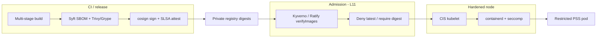

# Lesson 12 — Node/container hardening & supply-chain provenance (images, SBOM, signing)

*2026-09-20*

## What interviewers are really probing

[Lesson 11](/lessons/11-cluster-security-pss-admission-rbac) answered **who may create what** (PSS, admission, RBAC, Workload Identity). This lesson answers **what is allowed to run, and how you prove the artifact is yours**: hardened nodes + runtimes, digest-pinned images, SBOM/scan, cosign/Sigstore signatures, SLSA provenance, and admission that **verifies** before schedule.

They want evidence you have operated the **full chain**, not just `trivy image` once:

- **Node / kubelet CIS posture** — anonymous auth off, cert rotation, unused features disabled, seccomp/AppArmor/SELinux, no casual hostPath
- **Container runtime** — containerd/CRI-O, cgroup v2, RuntimeClass tiers (runc / gVisor / Kata)
- **Supply chain** — digests not tags, distroless/Chainguard bases, private registry, Syft SBOM + Trivy/Grype, cosign sign/verify, Fulcio/Rekor, SLSA attestations
- **Cluster enforcement** — Kyverno/Gatekeeper/Ratify `verifyImages`, deny `:latest`, WI/IRSA for pulls (not long-lived `imagePullSecrets` as the only story)
- **Hyperscale** — per-cell policy drift, mirror registries, airgap signing keys, webhook HA for verify (tie to L11 `failurePolicy`)

**Interview sentence:** “Admission without signed digests is theater; signatures without CIS nodes and Restricted PSS is a signed rootkit delivery path.”

## Core diagram: build → sign → verify → hardened node → restricted pod




**Read it top-down (left-to-right on the PNG):** CI produces a **multi-stage, minimal-base** image → **SBOM + vulnerability scan** gate the promote → **cosign** signs the digest and optionally attaches **SLSA provenance** into the registry → pulls hit a **private / mirrored** registry by digest → **admission** (the L11 webhook/VAP path) **verifies signature + digest** and rejects `:latest` → the pod lands on a **CIS-hardened node** with RuntimeDefault seccomp → under **Restricted PSS**. Privileged DaemonSets exist only as **named, audited exceptions**. Lesson 13 will deepen the same model for **model weights and checkpoints**.

## Idiosyncrasies / operator depth

### Node hardening (CIS kubelet & OS)

Interviewers expect CIS Benchmark fluency, not a checkbox dump. Operator priorities that actually bite:

| Control | Why it matters | Footgun |
|---|---|---|
| **Anonymous kubelet auth off** | Unauth `/pods`, exec/logs pivots historically | Managed pools may reset flags on upgrade |
| **Rotate kubelet / apiserver certs** | Long-lived node identity = long-lived blast | Missed rotation = silent join failures |
| **Disable unused kubelet features** | Shrink attack surface (read-only port legacy, etc.) | Feature gates differ by distro/version |
| **Privileged ports / kernel modules** | Block unexpected binds; load only needed modules | CNI/CSI need documented exceptions |
| **SELinux / AppArmor** | MAC layer beyond namespaces | Profile drift across AMIs/images |
| **Read-only rootfs where possible** | Limits persistence on node agents too | Some agents still need writable scratch |

**Privileged DaemonSets** (CNI, CSI, node-exporters that need hostPath): treat as **break-glass inventory** — owners, ticket links, and audit — never “the cluster default.” Compose with [L11 PSS](/lessons/11-cluster-security-pss-admission-rbac): system NS may be Privileged; app NS stay Restricted.

### Container runtime: containerd, CRI-O, isolation tiers

- **containerd** (most EKS/GKE/AKS paths) vs **CRI-O** (OpenShift-class): same CRI contract, different config knobs (`config.toml` vs CRI-O conf). Know where **RuntimeClass** handlers are registered.
- **cgroup v2** is the modern default — memory/CPU accounting and `cpu.max` behave differently than v1; mixed nodes = mysterious OOM math.
- **User namespaces** (where enabled): map container root ≠ host root — huge for breakout resistance; still incomplete across storage/network plugins — validate before mandating.
- **RuntimeClass tiers** for multi-tenant / untrusted:
  - `runc` — default, shared kernel
  - **gVisor** (`runsc`) — userspace kernel syscall interception
  - **Kata** — lightweight VM per pod
- Pick tiers by **trust class**, not fashion: untrusted CI builders / student notebooks → gVisor/Kata; latency-sensitive inference often stays on runc + Restricted PSS + GPU isolation (later lessons).

### Image supply chain (the artifact half of L11)

| Practice | Operator meaning |
|---|---|
| **Digests, not tags** | `image@sha256:...` is immutable; tags move under you |
| **Multi-stage builds** | Compiler toolchain never ships in the final layer |
| **Distroless / Chainguard / wolfi** | Fewer packages = smaller CVE surface and smaller SBOM |
| **Private registry** | ECR/GAR/ACR/Harbor — public Hub as cache only with policy |
| **Scan** | Trivy / Grype in CI **and** registry continuous scan |
| **SBOM** | Syft → SPDX/CycloneDX; store beside the image; feed policy |
| **Sign** | `cosign sign` on the digest; keyless (Fulcio OIDC) or keys/KMS |
| **Transparency** | Rekor entries make “who signed when” auditable |
| **Provenance** | SLSA attestations: builder identity, source commit, materials |
| **Admit** | Kyverno `verifyImages` / Gatekeeper/Ratify — **fail closed** when healthy |

**Sigstore mental model:** Cosign produces the signature; **Fulcio** issues short-lived certs from OIDC identity; **Rekor** logs the signature. Keyless reduces long-lived key sprawl — airgapped cells often still need **offline keys / private Fulcio**.

### Cluster integration

- **imagePullSecrets** vs **WI/IRSA**: static pull secrets rotate poorly and end up in every NS. Prefer registry auth via **node IAM + WI** patterns your cloud documents; keep pull secrets for break-glass / cross-cloud only.
- **Deny `:latest`** and **require digest** via admission (`mutateDigest` / `verifyDigest` in Kyverno). Signing a floating tag is how you “verify” the wrong bits tomorrow.
- Cross-link L11: `failurePolicy: Fail` on verify webhooks **freezes deploys** when Kyverno/Ratify flaps — HA replicas, PDBs, SLIs, and **PSS Restricted** as the fail-closed backstop when custom verify is degraded.

### Hyperscale idiosyncrasies

- **Per-cell policy drift:** one cell on Kyverno 1.x keyless issuer allow-list, another still on static keys → “works in staging” false confidence. Fleet-manage policy CRs.
- **Mirror registries:** airgap / region mirrors must **mirror signatures and attestations** (referrers / `.sig` tags), not just image layers.
- **Airgap signing keys:** private Fulcio or KMS-backed keys with offline root ceremony; document rotation drills.
- **Webhook HA for verifyImages:** same story as [L11 admission](/lessons/11-cluster-security-pss-admission-rbac) — treat image-verify latency/errors as a **deploy SLO**.


### Seccomp, capabilities, and “exceptions that stick”

- **`seccompProfile.type: RuntimeDefault`** is the modern baseline (PSS Restricted requires it). Custom profiles are for known syscalls (e.g. weird JNI) — version them next to the app, don’t copy-paste from Stack Overflow.
- **`capabilities.drop: ["ALL"]` then add back** only what you need (`NET_BIND_SERVICE` is the classic). “Drop most” without `ALL` first is how `SYS_ADMIN` sneaks back.
- **`allowPrivilegeEscalation: false`** blocks the no_new_privs footgun path — pair with non-root.
- **hostPath / hostPID / hostNetwork / hostIPC:** default deny in app NS via PSS + policy. Node agents that need them live in **system namespaces** with owners.
- **Privileged ports on the node:** CIS and OS hardening often restrict binds below 1024; containers that need them either use `NET_BIND_SERVICE` carefully or move above 1024 behind the Service.

### Registry, mirrors, and referrers

OCI **referrers** / cosign’s signature storage must travel with the image. A Harbor/ECR mirror job that copies only the image index leaves admission green in the primary region and red in the DR cell. Validate with:

```bash
cosign tree registry.example.com/team/api@sha256:DIGEST
# Expect signatures + attestations listed; empty tree = mirror bug
```

For multi-arch indexes: sign the **index digest** you deploy, or sign each platform manifest and ensure the admit path resolves the same digest the node pulls.

## Concrete commands & config

```bash
# --- Node / kubelet quick posture (example hosts) ---
# Anonymous auth should be false; adjust path per distro
sudo grep -E 'anonymous|authorization-mode|read-only-port|feature-gates' \
  /var/lib/kubelet/config.yaml /etc/kubernetes/kubelet.conf 2>/dev/null

# CIS-oriented scan (kube-bench)
kubectl apply -f https://raw.githubusercontent.com/aquasecurity/kube-bench/main/job.yaml
kubectl logs job/kube-bench

# RuntimeClass inventory
kubectl get runtimeclass
kubectl get nodes -o jsonpath='{range .items[*]}{.metadata.name}{"\t"}{.status.nodeInfo.containerRuntimeVersion}{"\n"}{end}'
```

```dockerfile
# Multi-stage + distroless-shaped final (sketch)
FROM golang:1.22 AS build
WORKDIR /src
COPY . .
RUN CGO_ENABLED=0 go build -o /out/app ./cmd/app

FROM gcr.io/distroless/static:nonroot
COPY --from=build /out/app /app
USER nonroot:nonroot
ENTRYPOINT ["/app"]
```

```bash
# Build, SBOM, scan, push by digest
docker build -t registry.example.com/team/api:ci-$GIT_SHA .
DIGEST=$(crane digest registry.example.com/team/api:ci-$GIT_SHA)
IMG="registry.example.com/team/api@$DIGEST"

syft packages "$IMG" -o spdx-json > sbom.spdx.json
trivy image --severity CRITICAL,HIGH --exit-code 1 "$IMG"
# or: grype "$IMG"

# Sign + attest (keyless example; use --key / KMS in airgap)
cosign sign "$IMG"
cosign attest --predicate sbom.spdx.json --type spdx "$IMG"
cosign verify "$IMG"
cosign verify-attestation --type spdx "$IMG"
```

```yaml
# Kyverno verifyImages (sketch) — enforce signatures; tie failurePolicy to L11 HA story
apiVersion: kyverno.io/v1
kind: ClusterPolicy
metadata:
  name: verify-production-images
spec:
  validationFailureAction: Enforce
  webhookTimeoutSeconds: 30
  rules:
    - name: verify-signed-digests
      match:
        any:
          - resources:
              kinds: ["Pod"]
              namespaces: ["prod", "model-serving"]
      verifyImages:
        - imageReferences:
            - "registry.example.com/*"
          mutateDigest: true
          verifyDigest: true
          required: true
          attestors:
            - count: 1
              entries:
                - keys:
                    publicKeys: |-
                      -----BEGIN PUBLIC KEY-----
                      # fleet-managed cosign.pub or kms://...
                      -----END PUBLIC KEY-----
```

```yaml
# Restricted-shaped Pod securityContext (admission still required)
apiVersion: v1
kind: Pod
metadata:
  name: api
  namespace: prod
spec:
  securityContext:
    runAsNonRoot: true
    seccompProfile:
      type: RuntimeDefault
  containers:
    - name: api
      image: registry.example.com/team/api@sha256:REPLACE
      securityContext:
        allowPrivilegeEscalation: false
        readOnlyRootFilesystem: true
        capabilities:
          drop: ["ALL"]
      # Prefer WI/IRSA for registry; imagePullSecrets only if required
```

```bash
# Admission / PSS cross-checks (from L11 habits)
kubectl get ns prod -o yaml | rg pod-security
kubectl get clusterpolicy verify-production-images -o yaml | rg -n 'failurePolicy|verifyImages|verifyDigest'
kubectl auth can-i create pods -n prod --as=system:serviceaccount:prod:deployer
```

## Failures & fixes

| Symptom | Likely root cause | Fix |
|---|---|---|
| Pods rejected: “image signature verification failed” | Wrong key/issuer; tag moved; mirror missing `.sig`/referrers | Align attestor keys/OIDC issuers; pin digest; mirror signatures with images |
| Mass deploy timeouts / “webhook timeout” | Kyverno/Ratify unavailable; `failurePolicy: Fail` | HA policy engine, PDB, raise replicas; page on webhook SLI; keep PSS Restricted as backstop ([L11](/lessons/11-cluster-security-pss-admission-rbac)) |
| “Works with tag, fails with digest” | CI signed tag A; deploy resolved different digest | Sign **after** push; deploy only `@sha256`; enable `mutateDigest`/`verifyDigest` |
| kube-bench WARN on anonymous-auth | AMI/bootstrap reset kubelet flags | Bake CIS into node image/userdata; enforce via DaemonSet config manager; alert on drift |
| Breakout via hostPath / privileged debug | App NS not Restricted; debug PodSpec left privileged | PSS enforce=restricted; admission deny hostPath; time-box debug profiles |
| Trivy clean in CI, critical in prod registry | Base image rebuilt; floating tag; different arch index | Digest pins + continuous registry scan + re-sign on rebuild |
| Airgap verify cannot reach Rekor/Fulcio | Keyless path needs transparency/network | Offline keys or private Sigstore stack; `ignoreTlog` only with compensating controls |
| GPU node “needs privileged” for serving | Habit, not requirement | Prefer device plugin + Restricted; privileged only for audited device-agent DS |
| Pull failures after killing imagePullSecrets | Workloads still depended on static creds | Migrate to WI/IRSA/node pull identity; document break-glass secret |

## Security & hardening

This lesson **is** the node + artifact hardening story — treat signed digests and CIS nodes as first-class controls, then compose with L11 admission/RBAC.

| Control | Operator practice |
|---|---|
| **CIS kubelet / node OS** | Anonymous auth off; cert rotation; disable unused features; SELinux/AppArmor on; kernel module allow-list |
| **Runtime defaults** | seccomp `RuntimeDefault`; drop `ALL` caps; `readOnlyRootFilesystem`; no hostPath in app NS |
| **PSS Restricted** | Enforce on app/inference NS; Privileged only for named system DS ([L11](/lessons/11-cluster-security-pss-admission-rbac)) |
| **Digest + deny latest** | Admission mutate/verify digest; block `:latest` and mutable tags in prod |
| **Sign + attest** | cosign on every promote; SBOM + SLSA provenance attached; store keys in KMS / keyless OIDC |
| **Verify at admit** | Kyverno/Gatekeeper/Ratify; HA webhooks; know Fail vs Ignore blast radius |
| **Registry auth** | Prefer WI/IRSA over sprawling imagePullSecrets; private registry only |
| **RuntimeClass tiers** | gVisor/Kata for untrusted/multi-tenant; document who may schedule which class |
| **Fleet drift** | Same verify policy + trust roots across cells; mirror sigs in region/airgap caches |

### AI/ML angle (weights, registries, signing — preview Lesson 13)

Treat **model container images** and **weight/checkpoint artifacts** as supply-chain objects — same discipline as app images, different storage plane.

| Surface | Hardening now (deepen in L13) |
|---|---|
| **Serving images** | Distroless-ish CUDA/runtime images; scan + SBOM; **cosign sign**; admit only signed digests in `model-serving` |
| **Training base images** | Provenance on trainer images (SLSA); pin framework digests; no `:latest` torch/CUDA tags in prod train |
| **Weight / checkpoint objects** | Private buckets; CMEK; **never world-readable**; IAM only on `weight-reader` SA via WI/IRSA — not node roles |
| **Registry + bucket** | Separate trust: OCI for images, object storage for checkpoints; both need provenance + access audit |
| **Admission** | Restricted PSS + verifyImages on serve NS; deny privileged GPU debug sidecars in prod |
| **Secrets** | HF/API tokens via external secrets/CSI — never baked into layers |
| **Preview L13** | Checkpoint encryption, object-lock, training-job identity split, and inference egress controls go deeper next |

```bash
# Model NS: signed image + no casual secret list
kubectl get ns model-serving -o yaml | rg pod-security
kubectl get clusterpolicy -o yaml | rg -n 'model-serving|verifyImages'
kubectl auth can-i get secrets -n model-serving \
  --as=system:serviceaccount:model-serving:inferencer
# Expect: deploy signed digest yes; list secrets no
```

**AI/ML punchline:** A signed serving image pulling an **unsigned, world-readable checkpoint** is still a supply-chain fail. L12 closes the **image** half; L13 closes the **weight** half.

## Interview soundbites

- **“Tags move; digests don’t — I deploy `@sha256` and admit-time verifyDigest.”**
- **“Cosign signs; Fulcio binds OIDC identity; Rekor is the transparency log.”**
- **“SBOM without a gate is paperwork; Syft + Trivy/Grype in CI and registry continuous scan.”**
- **“Admission verifyImages is where supply chain meets L11 — HA the webhook or you freeze the fleet.”**
- **“Restricted PSS + drop ALL + RuntimeDefault seccomp is the pod baseline; privileged DS are audited exceptions.”**
- **“CIS kubelet: anonymous auth off, rotate certs, disable unused features — bake into the node image.”**
- **“RuntimeClass: runc by default; gVisor/Kata for untrusted tenants — not for every GPU inference pod.”**
- **“imagePullSecrets sprawl; prefer WI/IRSA for registry pull identity.”**
- **“Airgap: mirror layers **and** signatures; private Fulcio or KMS keys.”**
- **“Model serving: signed images now; checkpoint bucket IAM and encryption deepen in Lesson 13.”**

## How this maps to the JD

Hyperscale platform roles own **safe artifacts on hardened nodes across 100+ clusters**: CIS-aligned pools, digest-pinned and signed images, SBOM/scan evidence, and admission that verifies provenance without becoming a single point of deploy failure. Connect [L11](/lessons/11-cluster-security-pss-admission-rbac) → **12**: control-plane authorization → **node + supply-chain enforcement**. Next: **Lesson 13 — AI/ML security: model weights & checkpoint hardening**.

## Watch (talks & demos)

Real talks that map to this lesson — watch after the Failures & fixes table.

### Sigstore: Using Transparent Digital Signatures to Help Secure the Software Supply Chain — Bob Callaway (OpenSSF)

Cosign, Fulcio, Rekor, and keyless signing — the mental model behind “we verify signatures at admit time.”

<iframe width="100%" height="360" src="https://www.youtube.com/embed/_HL_I5k_oP4" title="Sigstore: Using Transparent Digital Signatures - Bob Callaway" frameBorder="0" allow="accelerometer; autoplay; clipboard-write; encrypted-media; gyroscope; picture-in-picture; web-share" allowFullScreen></iframe>

[Open on YouTube](https://www.youtube.com/watch?v=_HL_I5k_oP4)

### Secure Your Project with the SIG Release Supply Chain Kit — Adolfo García Veytia & Carlos Panato (KubeCon EU 2023)

SBOM generation, signed SLSA provenance, and cosign-signed containers using the same toolkit patterns big CNCF projects ship with — CI → attest → verify narrative.

<iframe width="100%" height="360" src="https://www.youtube.com/embed/AwzrMnxQ6c4" title="Secure Your Project with the SIG Release Supply Chain Kit" frameBorder="0" allow="accelerometer; autoplay; clipboard-write; encrypted-media; gyroscope; picture-in-picture; web-share" allowFullScreen></iframe>

[Open on YouTube](https://www.youtube.com/watch?v=AwzrMnxQ6c4)

### Signing and Verifying Container Images With Sigstore Cosign and Kyverno — DevOps Toolkit

Hands-on cosign sign/verify plus Kyverno `verifyImages` enforcement — the exact admission bridge this lesson ties to [Lesson 11](/lessons/11-cluster-security-pss-admission-rbac).

<iframe width="100%" height="360" src="https://www.youtube.com/embed/HLb1Q086u6M" title="Signing and Verifying Container Images With Sigstore Cosign and Kyverno" frameBorder="0" allow="accelerometer; autoplay; clipboard-write; encrypted-media; gyroscope; picture-in-picture; web-share" allowFullScreen></iframe>

[Open on YouTube](https://www.youtube.com/watch?v=HLb1Q086u6M)

### Hacking and Hardening Kubernetes Clusters by Example — Brad Geesaman (KubeCon)

Attack-path intuition for why kubelet defaults, privileged pods, and weak admission fail — pairs with the CIS/node and Restricted PSS sections above.

<iframe width="100%" height="360" src="https://www.youtube.com/embed/vTgQLzeBfRU" title="Hacking and Hardening Kubernetes Clusters by Example - Brad Geesaman" frameBorder="0" allow="accelerometer; autoplay; clipboard-write; encrypted-media; gyroscope; picture-in-picture; web-share" allowFullScreen></iframe>

[Open on YouTube](https://www.youtube.com/watch?v=vTgQLzeBfRU)

## References

- [CIS Kubernetes Benchmark](https://www.cisecurity.org/benchmark/kubernetes) · [kube-bench](https://github.com/aquasecurity/kube-bench)
- [Pod Security Standards](https://kubernetes.io/docs/concepts/security/pod-security-standards/) · [RuntimeClass](https://kubernetes.io/docs/concepts/containers/runtime-class/)
- [seccomp](https://kubernetes.io/docs/tutorials/security/seccomp/) · [AppArmor](https://kubernetes.io/docs/tutorials/security/apparmor/)
- [Sigstore](https://www.sigstore.dev/) · [cosign](https://docs.sigstore.dev/cosign/signing/overview/) · [Rekor](https://docs.sigstore.dev/logging/overview/)
- [SLSA](https://slsa.dev/) · [in-toto attestations](https://github.com/in-toto/attestation)
- [Syft](https://github.com/anchore/syft) · [Trivy](https://aquasecurity.github.io/trivy/) · [Grype](https://github.com/anchore/grype)
- [Kyverno verifyImages](https://kyverno.io/docs/policy-types/cluster-policy/verify-images/) · [Ratify](https://ratify.dev/) · [Gatekeeper](https://open-policy-agent.github.io/gatekeeper/)
- [gVisor](https://gvisor.dev/) · [Kata Containers](https://katacontainers.io/)
- Distroless / minimal bases: [GoogleContainerTools/distroless](https://github.com/GoogleContainerTools/distroless) · [Chainguard Images](https://edu.chainguard.dev/chainguard/chainguard-images/)
- Prior lesson: [11 — Cluster security / PSS / admission / RBAC](/lessons/11-cluster-security-pss-admission-rbac)

## Quick self-check

Out loud, in under two minutes:

1. Why deploy by digest, and where do you enforce “no `:latest`”?
2. What do cosign, Fulcio, and Rekor each contribute — and what changes in an airgap?
3. How does Kyverno `verifyImages` interact with L11 `failurePolicy: Fail` at hyperscale?
4. Name five node/pod controls you expect on a Restricted workload (seccomp, caps, rootfs, hostPath, PSS).
5. How do model **serving images** and **checkpoint objects** both fit a supply-chain story (preview L13)?
