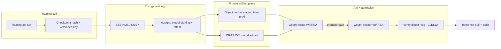

# Lesson 13 — AI/ML security: model weights & checkpoint hardening (registry, signing, bucket IAM, encryption)

*2026-09-21*

## What interviewers are really probing

[Lesson 12](/lessons/12-node-container-hardening-supply-chain) closed the **image** half of the supply chain (digest, SBOM, cosign, admit-time verify). This lesson closes the **weight / checkpoint** half: the multi-gigabyte blobs that training jobs write and inference pods pull — often from object buckets or OCI artifact registries, and often with weaker controls than the container that loads them.

They want evidence you treat weights as **first-class artifacts**, not “files on S3”:

- **Lifecycle** — train → checkpoint → promote → serve, with a **human/CI gate** between staging and prod prefixes
- **Immutability** — content hashes, versioned keys / Object Lock; never a mutable `latest.safetensors`
- **Encryption** — SSE-KMS / CMEK (customer-managed keys); optional client-side for crown-jewel IP
- **Bucket IAM least privilege** — separate `weight-writer` (training SA) vs `weight-reader` (inference SA) via Workload Identity / IRSA — **never** broad GetObject on the node instance role
- **Signing & provenance** — cosign / OpenSSF model-signing on OCI model packages; in-toto/SLSA-style attestations tying checkpoint hash → training job identity → git commit → dataset digest
- **Compose** — signed serving image + **unsigned** weight = still broken ([L12](/lessons/12-node-container-hardening-supply-chain) punchline made operational here)
- **Hyperscale** — multi-cell mirrors of weight buckets + signature sidecars; CMEK rotation without breaking readers; audit logs for GetObject on model prefixes

**Interview sentence:** “I harden the serving image *and* the checkpoint plane — private store, CMEK, writer/reader SA split, signed digest, admit and audit the pull.”

## Core diagram: train → checkpoint → encrypt/sign → private store → IAM gate → inference




**Read it top-down (left-to-right on the PNG):** the **training job SA** may write **only** to a staging prefix (or staging bucket) → checkpoints land under **content-addressed / versioned** keys with **SSE-KMS/CMEK** → a **promote pipeline** (CI + optional human gate) copies into prod, **signs** (cosign on ORAS/OCI packages, or model-signing / checksum manifests for directory-shaped models), and attaches **provenance** → inference uses a **separate weight-reader** identity → admission / runtime verify matches the digest you signed → **CloudTrail / Data Access logs** record GetObject on model prefixes. Preview **Lesson 14**: securing the inference/training *deployments* that consume these artifacts.

## Idiosyncrasies / operator depth

### Weight lifecycle (parallel to image promote)

| Stage | Operator meaning | Footgun |
|---|---|---|
| **Train** | Job writes checkpoints to `s3://models-staging/...` only | Training SA also has prod PutObject |
| **Checkpoint** | Periodic / best / final; hash recorded in job metadata | Overwriting the same key each epoch |
| **Promote** | Copy + sign + attest into prod prefix/registry | “Just symlink latest” without gate |
| **Serve** | Inference SA GetObject / ORAS pull by digest | Node role can list the whole bucket |

Treat promote like an image release: **immutable artifact ID**, signature, provenance, and a record of who approved.

### Storage planes: bucket vs OCI vs model hub

| Plane | When you use it | Hardening knobs |
|---|---|---|
| **Object buckets** (S3 / GCS / Azure Blob) | Large safetensors/gguf trees; training checkpoints | CMEK, BPA, Object Lock, prefix IAM, VPC endpoints |
| **OCI registries** (GAR/ECR/ACR/Harbor) via **ORAS** | Model packages as artifacts; same referrers/signing story as images | Private registry, cosign, admit-time verify |
| **HF Hub / private hubs** | Collaboration / base models | Private repos, org SSO, no world-readable; pin revision SHA; egress allow-list |

Many fleets are **hybrid**: base models from a controlled hub mirror into **your** bucket/registry; fine-tunes never leave your CMEK boundary.

### Digest-like immutability for blobs

- Prefer keys like `models/llama-ft/sha256-<hex>/model.safetensors` or object versioning + **Object Lock** (WORM) on prod prefixes.
- Record the **content hash** in the promote ticket / SLSA predicate — same role digest plays for images.
- Ban mutable aliases (`latest.safetensors`, `prod/current`) in **prod**. Staging may use soft tags; promote resolves to hash.
- For multi-file directories: hash the **manifest** (or use OpenSSF **model-signing**, which is built for directory-shaped models).

### Encryption: SSE-KMS / CMEK / client-side

| Mode | Operator note |
|---|---|
| **SSE-S3 / Google-managed** | Better than nothing; weak separation of duties vs bucket IAM |
| **SSE-KMS / CMEK** | Customer-managed key; IAM **and** key policy must allow writer/reader; rotation drills matter |
| **S3 Bucket Keys / similar** | Cuts KMS request cost on huge GetObject fan-out — validate encryption-context policies first |
| **Client-side** | High-sensitivity IP; app holds DEK; ops complexity and key recovery risk go up |

**Rotation without breaking readers:** dual-encrypt window, grant both old and new key ARNs on the reader role, re-encrypt or rewrite objects on a schedule, then drop the old key grant. Hyperscale cells must share the **same rotation playbook** or DR pulls fail closed on KMS `AccessDenied`.

### Bucket IAM: writer vs reader (the interview money question)

```text
Training job SA  →  s3:PutObject on staging/*   (+ kms:GenerateDataKey)
Promote CI SA    →  staging Get + prod Put      (+ sign)
Inference SA     →  s3:GetObject on prod/*      (+ kms:Decrypt)
Nobody           →  s3:ListBucket on entire bucket from notebooks without need
Node instance role → NEVER broad models GetObject
```

- **Workload Identity / IRSA / GKE WI / AKS WI** bind the K8s SA to the cloud IAM role — compose with [L11](/lessons/11-cluster-security-pss-admission-rbac).
- **Block Public Access** account + bucket; disable ACLs; bucket policy deny `Principal: *`.
- Prefer **VPC endpoints / Private Google Access** so training/inference nodes never need public S3/GCS IPs for weight pulls.
- Prefix-level conditions (`s3:prefix`) beat “one role for all models.”

### Signing & provenance for weights

| Pattern | Use when |
|---|---|
| **ORAS push + cosign sign** | Model packaged as OCI artifact; reuse L12 admit `verifyImages` / Ratify |
| **OpenSSF model-signing** | Directory of weight files; Sigstore or key-based; hub-friendly |
| **cosign sign-blob + checksum manifest** | Raw bucket objects; store `.sig` / Rekor entry beside the blob |
| **in-toto / SLSA attestation** | Bind checkpoint hash ↔ trainer identity ↔ git SHA ↔ dataset digest |

**Compose with L12:** admission that only checks the **serving image** will happily schedule a signed image that loads a **poisoned** weight from an over-permissioned bucket. Verify **both** planes — or mount only from a verified OCI artifact volume / init-container that checks the signature before the main process starts.

### Training identity split & exfiltration paths

Classic leaks operators actually see:

- Notebook namespace SA with `s3:ListBucket` + `GetObject` on `models/*`
- Debug sidecar / ephemeral pod using the **node** instance profile
- Unlogged egress to public HF / anonymous Git LFS
- Shared “ml-platform” role reused by train, promote, and serve
- Staging bucket with public ACL “just for the demos”

Mitigate with NetworkPolicy / egress proxies ([L9](/lessons/09-networkpolicy-multi-nic-sflow) / mesh from [L10](/lessons/10-service-mesh-istio-linkerd-mtls)), separate SAs, and **Data Access audit** alerts on unusual GetObject volume or principals.

### Hyperscale idiosyncrasies

- **Multi-cell mirrors:** replicate **objects and signatures** (sidecar manifests, OCI referrers). A cell that has weights but not sigs fails verify; a cell with sigs but stale weights serves the wrong model.
- **CMEK per region / per cell:** document which key encrypts which prefix; avoid a single global key becoming a fleet SPOF without a rotation drill.
- **Audit:** enable object-level logging; alert on `GetObject` from non-inference principals on prod prefixes; retain for IR.
- **Admission drift:** same trust roots for model OCI artifacts across cells — fleet-manage Kyverno/Ratify CRs like L12 image policy.

## Concrete commands & config

```bash
# --- AWS: bucket posture (illustrative) ---
aws s3api get-public-access-block --bucket models-prod
aws s3api get-bucket-encryption --bucket models-prod
aws s3api get-object-lock-configuration --bucket models-prod 2>/dev/null || true

# Put a content-addressed checkpoint (SSE-KMS)
HASH=$(sha256sum model.safetensors | awk '{print $1}')
KEY="models/llama-ft/sha256-${HASH}/model.safetensors"
aws s3api put-object \
  --bucket models-staging \
  --key "$KEY" \
  --body model.safetensors \
  --server-side-encryption aws:kms \
  --ssekms-key-id "$KMS_KEY_ARN"

# Promote: copy staging → prod (CI role), then sign
aws s3 cp "s3://models-staging/$KEY" "s3://models-prod/$KEY"
sha256sum model.safetensors | tee "model.safetensors.sha256"
cosign sign-blob --bundle model.sigbundle model.safetensors
# store bundle next to object or in sig sidecar prefix
```

```bash
# --- GCP-flavored sketch ---
gcloud storage buckets describe gs://models-prod --format='yaml(iamConfiguration,encryption)'
# CMEK on bucket / object; Uniform bucket-level access ON
gsutil hash -h model.safetensors
gcloud storage cp model.safetensors \
  "gs://models-staging/models/llama-ft/sha256-${HASH}/model.safetensors" \
  --encryption-key=projects/P/locations/L/keyRings/R/cryptoKeys/K
```

```bash
# --- ORAS: package weights as OCI artifact + cosign (ties to L12) ---
oras push registry.example.com/models/llama-ft:sha256-${HASH} \
  ./model.safetensors:application/vnd.example.safetensors \
  --artifact-type application/vnd.example.model

DIGEST=$(crane digest registry.example.com/models/llama-ft:sha256-${HASH})
REF="registry.example.com/models/llama-ft@$DIGEST"
cosign sign "$REF"
cosign verify "$REF"
cosign tree "$REF"   # signatures must mirror with the artifact
```

```yaml
# IRSA / WI sketch: inference SA may GetObject prod prefix only
apiVersion: v1
kind: ServiceAccount
metadata:
  name: weight-reader
  namespace: model-serving
  annotations:
    # EKS example — swap for GKE/AKS WI annotation in your cloud
    eks.amazonaws.com/role-arn: arn:aws:iam::123456789012:role/weight-reader
---
# Training SA — staging write only (separate role)
apiVersion: v1
kind: ServiceAccount
metadata:
  name: weight-writer
  namespace: model-training
  annotations:
    eks.amazonaws.com/role-arn: arn:aws:iam::123456789012:role/weight-writer
```

```json
# IAM policy fragment — weight-reader (illustrative)
{
  "Effect": "Allow",
  "Action": ["s3:GetObject"],
  "Resource": "arn:aws:s3:::models-prod/models/*"
},
{
  "Effect": "Allow",
  "Action": ["kms:Decrypt", "kms:DescribeKey"],
  "Resource": "arn:aws:kms:REGION:ACCT:key/KEY-ID",
  "Condition": {
    "StringEquals": {
      "kms:ViaService": "s3.REGION.amazonaws.com"
    }
  }
}
```

```yaml
# Kyverno: model-serving NS — require signed OCI model refs (compose L12)
apiVersion: kyverno.io/v1
kind: ClusterPolicy
metadata:
  name: verify-model-oci-artifacts
spec:
  validationFailureAction: Enforce
  rules:
    - name: verify-signed-model-artifacts
      match:
        any:
          - resources:
              kinds: ["Pod"]
              namespaces: ["model-serving"]
      verifyImages:
        - imageReferences:
            - "registry.example.com/models/*"
          mutateDigest: true
          verifyDigest: true
          required: true
          attestors:
            - count: 1
              entries:
                - keys:
                    publicKeys: |-
                      -----BEGIN PUBLIC KEY-----
                      # fleet-managed model-signing / cosign.pub
                      -----END PUBLIC KEY-----
```

```bash
# Authz / audit habits (L11 compose)
kubectl auth can-i get pods -n model-serving \
  --as=system:serviceaccount:model-serving:weight-reader
# Expect: pull weights yes; list secrets no; create privileged no
kubectl get ns model-serving -o yaml | rg pod-security
# CloudTrail / GCP Data Access: alert GetObject on models-prod from non-reader roles
```

## Failures & fixes

| Symptom | Likely root cause | Fix |
|---|---|---|
| Inference `AccessDenied` on GetObject / KMS Decrypt | Reader role missing `kms:Decrypt` or wrong key ARN after rotation | Grant Decrypt on active CMEK(s); dual-key window during rotation |
| “Works in staging, fails in cell B” | Mirror copied objects but not sigs / referrers | Mirror signatures with artifacts; `cosign tree` in DR cell |
| Notebook lists every production model | Shared SA / node role with `s3:ListBucket` on `models/*` | Split writer/reader; prefix IAM; deny List on prod from notebook NS |
| Signed image, poisoned weights | Only L12 image verify; bucket world-readable or broad GetObject | CMEK + BPA + reader-only IAM; sign/verify weights; audit GetObject |
| Promote overwrote `latest.safetensors` | Mutable prod key | Content-addressed keys + Object Lock; ban latest in prod policy |
| Training job wrote straight to prod | Writer role includes prod PutObject | Staging-only Put; promote CI separate; SCP / org policy guardrail |
| Mass KMS throttling on serve fan-out | Per-object GenerateDataKey without bucket keys | Enable S3 Bucket Keys / equivalent; cache; watch KMS quotas |
| Admit rejects model OCI pull | Sig not mirrored; wrong attestor; tag moved | Pin digest; fleet-sync trust roots; mirror referrers ([L12](/lessons/12-node-container-hardening-supply-chain)) |
| Exfil to public HF from train NS | No egress policy; HF token in env | NetworkPolicy / egress proxy; external secrets; private mirror |

## Security & hardening

This lesson **is** the weight/checkpoint hardening story. Treat the tables below as the control checklist you walk in an interview — then compose with [L11](/lessons/11-cluster-security-pss-admission-rbac) (who may create what) and [L12](/lessons/12-node-container-hardening-supply-chain) (signed images).

### Artifact & storage controls

| Control | Operator practice |
|---|---|
| **Private stores only** | No public buckets/repos for checkpoints; Block Public Access; Uniform bucket-level access |
| **CMEK / SSE-KMS** | Customer-managed keys; key policy least privilege; documented rotation |
| **Immutability** | Content-hash keys, versioning, Object Lock on prod; deny mutable `latest` aliases |
| **Writer / reader split** | Training SA → staging Put; inference SA → prod Get; promote SA bridges with gate |
| **No node-role GetObject** | WI/IRSA on workload SAs; scrub instance profiles of model prefixes |
| **VPC / private path** | Gateway/interface endpoints; Private Google Access; no need for public object IPs |
| **Checksum + sign** | sha256 manifests; cosign sign-blob or ORAS+cosign; OpenSSF model-signing for dirs |
| **Provenance** | Attest trainer identity, git commit, dataset digest, framework image digest |
| **Registry for packages** | Private GAR/ECR/ACR/Harbor; ORAS push; admit-time verify like images |
| **Audit** | Object-level Data Access logs; alert anomalous GetObject / cross-principal reads |

### Cluster & identity controls (compose L11 / L12)

| Control | Operator practice |
|---|---|
| **PSS Restricted** on `model-serving` / `model-training` | No privileged debug sidecars in prod |
| **RBAC** | Inference SA cannot `get/list` Secrets broadly; cannot create Pods in other NS |
| **Admission** | verifyImages / verify OCI model artifacts; deny `:latest` for model refs |
| **Network isolation** | Egress allow-list; block public HF from prod train/serve unless mirrored |
| **Secrets** | HF/API tokens via external-secrets / CSI — never next to weights in the bucket |
| **GPU pool isolation** | Separate node pools / taints for train vs serve (deepen in L14) |
| **Fleet policy** | Same CMEK/trust-root playbook per cell; mirror weights **and** signatures |

### AI/ML threat surfaces (operator view)

| Surface | Hardening |
|---|---|
| **Model weights / checkpoints** | CMEK, private prefix, signed hash, reader-only IAM, Object Lock |
| **Registries** | Private; ORAS+cosign; referrers mirrored; admit verify |
| **Signing / provenance** | Sigstore / KMS keys; SLSA-style bind to train job + dataset |
| **Bucket IAM** | Prefix conditions; separate roles; no public ACL |
| **Encryption** | SSE-KMS/CMEK default; client-side for crown jewels |
| **Secrets** | Short-lived WI; no long-lived keys in notebooks |
| **Network** | Private endpoints; deny unexpected egress |
| **Admission / RBAC** | L11 Restricted + L12 verify; deny break-glass sprawl |

```bash
# Punchline checks before calling a model “prod-ready”
# 1) Image signed? (L12)  2) Weight hash signed + CMEK? (L13)
# 3) Reader SA only?      4) Audit on?
cosign verify "$SERVING_IMAGE"
cosign verify "$MODEL_OCI_REF"   # or verify-blob / model-signing verify
aws s3api get-bucket-encryption --bucket models-prod
kubectl get sa weight-reader -n model-serving -o yaml | rg role-arn
```

**Punchline:** A signed serving image pulling an **unsigned, over-permissioned checkpoint** is still a supply-chain fail. L12 closed images; L13 closes weights. **Lesson 14** hardens the inference/training *deployments* that consume both.

## Interview soundbites

- **“Weights are artifacts: content hash, CMEK, sign, promote — same discipline as images, different storage plane.”**
- **“Training SA writes staging only; promote CI signs into prod; inference SA is GetObject + kms:Decrypt — never the node role.”**
- **“Mutable `latest.safetensors` in prod is the tag-moving problem for ML.”**
- **“Signed image + unsigned weight = still broken — verify both planes.”**
- **“ORAS + cosign lets model packages reuse the L12 admit path; raw buckets need sign-blob or model-signing + checksum sidecars.”**
- **“Block Public Access and CMEK are table stakes; the interview differentiator is writer/reader split and audit.”**
- **“Mirror cells must copy signatures with objects — `cosign tree` in DR.”**
- **“CMEK rotation: dual-grant window, then drop the old key — or serve dies on Decrypt.”**
- **“Notebooks that can ListBucket prod models are an exfil path — prefix IAM and NetworkPolicy.”**
- **“L11 who / L12 image / L13 weight / L14 deployment — full AI/ML hardening stack.”**

## How this maps to the JD

Hyperscale + AI/ML platform roles own **safe model artifacts across 100+ clusters**: encrypted private stores, least-privilege WI/IRSA for train vs serve, signed/provenanced checkpoints, and admit-time verification that composes with image supply chain. Connect [L11](/lessons/11-cluster-security-pss-admission-rbac) → [L12](/lessons/12-node-container-hardening-supply-chain) → **13**: authorization → image provenance → **weight provenance**. Fuel for GPU-fleet context: [wafer-ai/gpu-perf-engineering-resources](https://github.com/wafer-ai/gpu-perf-engineering-resources) (operator framing). Next: **Lesson 14 — AI/ML security: securing inference/training deployments**.

## Watch (talks & demos)

Real talks that map to this lesson — watch after the Failures & fixes table.

### Inside the OpenSSF Model Signing Project: Securing the ML Supply Chain

Sigstore-based signing for **directory-shaped models** (not only container images) — the exact “weights are huge trees” problem this lesson centers.

<iframe width="100%" height="360" src="https://www.youtube.com/embed/P1AE23uZQ50" title="Inside the OpenSSF Model Signing Project" frameBorder="0" allow="accelerometer; autoplay; clipboard-write; encrypted-media; gyroscope; picture-in-picture; web-share" allowFullScreen></iframe>

[Open on YouTube](https://www.youtube.com/watch?v=P1AE23uZQ50)

### Manage and Run AI/ML Models as OCI Artifacts with ORAS

Package models as OCI artifacts, push to a registry, attach signatures via referrers — the ORAS path that reuses L12 cosign/admit patterns for weights.

<iframe width="100%" height="360" src="https://www.youtube.com/embed/4hyA3yEB8Lo" title="Manage and Run AI/ML Models as OCI Artifacts with ORAS" frameBorder="0" allow="accelerometer; autoplay; clipboard-write; encrypted-media; gyroscope; picture-in-picture; web-share" allowFullScreen></iframe>

[Open on YouTube](https://www.youtube.com/watch?v=4hyA3yEB8Lo)

### AWS re:Invent 2023 — Amazon S3 security and access control best practices (STG315)

Block Public Access, encryption defaults, IAM vs bucket policies, Access Analyzer — the bucket-IAM half of weight hardening at cloud scale.

<iframe width="100%" height="360" src="https://www.youtube.com/embed/WZGG8RkvApY" title="Amazon S3 security and access control best practices - re:Invent 2023" frameBorder="0" allow="accelerometer; autoplay; clipboard-write; encrypted-media; gyroscope; picture-in-picture; web-share" allowFullScreen></iframe>

[Open on YouTube](https://www.youtube.com/watch?v=WZGG8RkvApY)

## References

- [OpenSSF Model Signing](https://openssf.org/projects/model-signing/) · [sigstore/model-transparency](https://github.com/sigstore/model-transparency) · [model-signing on PyPI](https://pypi.org/project/model-signing/)
- [Sigstore](https://www.sigstore.dev/) · [cosign other types / OCI artifacts](https://docs.sigstore.dev/cosign/signing/other_types/) · [SLSA](https://slsa.dev/) · [in-toto](https://github.com/in-toto/attestation)
- [ORAS](https://oras.land/) · [OCI artifacts](https://github.com/opencontainers/image-spec)
- [AWS SSE-KMS](https://docs.aws.amazon.com/AmazonS3/latest/userguide/UsingKMSEncryption.html) · [S3 Block Public Access](https://docs.aws.amazon.com/AmazonS3/latest/userguide/access-control-block-public-access.html) · [S3 Object Lock](https://docs.aws.amazon.com/AmazonS3/latest/userguide/object-lock.html)
- [GCS CMEK](https://cloud.google.com/storage/docs/encryption/customer-managed-keys) · [Uniform bucket-level access](https://cloud.google.com/storage/docs/uniform-bucket-level-access)
- [EKS IRSA](https://docs.aws.amazon.com/eks/latest/userguide/iam-roles-for-service-accounts.html) · [GKE Workload Identity](https://cloud.google.com/kubernetes-engine/docs/how-to/workload-identity)
- [Kyverno verifyImages](https://kyverno.io/docs/policy-types/cluster-policy/verify-images/) · [Ratify](https://ratify.dev/)
- GPU/platform fuel: [wafer-ai/gpu-perf-engineering-resources](https://github.com/wafer-ai/gpu-perf-engineering-resources)
- Prior: [12 — Node/container hardening & supply chain](/lessons/12-node-container-hardening-supply-chain) · [11 — Cluster security / PSS / RBAC](/lessons/11-cluster-security-pss-admission-rbac)

## Quick self-check

Out loud, in under two minutes:

1. Why is a signed serving image still unsafe if the checkpoint bucket is world-readable or readable by the node role?
2. Draw the writer / promote / reader IAM split — who may Put vs Get, and on which prefixes?
3. How do content-hash keys + Object Lock beat a mutable `latest.safetensors`?
4. When do you pick ORAS+cosign vs OpenSSF model-signing vs cosign sign-blob?
5. What must multi-cell mirrors copy besides the weight bytes — and how do you verify?
6. Name three exfiltration paths from training/notebook namespaces and one control each.
