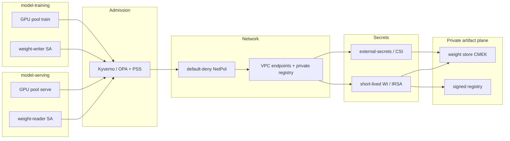

# Lesson 14 — AI/ML security: securing inference/training deployments (admission, network policy, secrets, GPU isolation)

*2026-09-22*

## What interviewers are really probing

[Lesson 13](/lessons/13-ml-weights-checkpoint-hardening) closed the **weight / checkpoint** plane (CMEK, writer/reader SA, signed digests). This lesson hardens the **deployments that consume** those artifacts — the training Jobs and inference Deployments that land on GPU nodes with cloud identity, network egress, and secrets.

They want evidence you treat train and serve as **hostile neighbors** that share a fleet but not trust:

- **Namespace + identity split** — `model-training` vs `model-serving`; **no shared ServiceAccount**; separate WI/IRSA roles
- **Admission as the last gate** — signed images ([L12](/lessons/12-node-container-hardening-supply-chain)), signed/digest-pinned model refs ([L13](/lessons/13-ml-weights-checkpoint-hardening)), deny privileged / hostPath / hostNetwork / `:latest`, require non-root + GPU RuntimeClass, PSS Restricted
- **NetworkPolicy default-deny** — weight-store VPC endpoints + private registry only; block public HF/internet from prod; **train cannot talk to serve** (and vice versa except intentional metrics)
- **Secrets hygiene** — External Secrets / CSI; short-lived WI/IRSA; **never** bake HF tokens or API keys into images or weight buckets; no long-lived tokens in env
- **GPU pool isolation** — dedicated node pools; taints + pool labels train vs serve; MIG when multi-tenant; **no time-slicing across trust boundaries**
- **Front door** — private LB / mesh mTLS ([L10](/lessons/10-service-mesh-istio-linkerd-mtls)); no naked public LoadBalancer without Armor/WAF ([L7](/lessons/07-edge-lb-ddos-armor-shield))
- **Compose** — signed image + signed weight + **hardened deploy** = the full AI/ML stack (L11 → L12 → L13 → **L14**)

**Interview sentence:** “I separate train and serve namespaces and SAs, admit only signed images and digest-pinned weights, default-deny egress to private stores, keep secrets out of env and buckets, and isolate GPU pools with taints — so a compromised trainer cannot exfil or pivot into serving.”

## Core diagram: train/serve NS → admission → NetPol → secrets → private stores




**Read it top-down (left-to-right on the PNG):** **Training** and **Inference** namespaces each own a **GPU pool** and a **distinct SA** (writer vs reader) → every Pod create hits an **admission gate** (Kyverno/OPA + PSS Restricted: signed image, signed/digest model ref, no privileged/hostPath, RuntimeClass for GPU) → **NetworkPolicy** default-deny allows only weight-store VPC endpoints and the private registry; train and serve cannot talk to each other → **secrets** arrive via External Secrets / CSI bound to short-lived WI/IRSA — never HF tokens in env or beside weights → pulls land on the **private weight store + signed registry** from [L13](/lessons/13-ml-weights-checkpoint-hardening) / [L12](/lessons/12-node-container-hardening-supply-chain). Compose strip on the PNG: L11 who → L12 image → L13 weight → **L14 deploy**.

## Idiosyncrasies / operator depth

### Namespace and SA split (the cheap control that interviews skip)

| Boundary | Operator practice | Footgun |
|---|---|---|
| **Namespaces** | `model-training` and `model-serving` (plus staging/canary if needed) | One `ml` namespace for notebooks, train, and serve |
| **ServiceAccounts** | `weight-writer` (train) vs `weight-reader` (serve); **never** shared | ClusterRoleBinding that lets either SA create Pods cluster-wide |
| **Cloud identity** | Separate WI/IRSA roles; staging Put vs prod Get ([L13](/lessons/13-ml-weights-checkpoint-hardening)) | Node instance role still has `s3:*` on models |
| **RBAC** | Inference SA cannot `get/list` Secrets broadly; cannot create in train NS | `edit` on both NS for the same CI bot |

Namespace alone is not isolation — pair with NetPol, RBAC, and admission or you only renamed folders.

### Admission: what must fail closed before a GPU ever wakes

Compose [L11](/lessons/11-cluster-security-pss-admission-rbac) + [L12](/lessons/12-node-container-hardening-supply-chain) + [L13](/lessons/13-ml-weights-checkpoint-hardening) into **one admit path** for `model-*` namespaces:

| Rule | Why |
|---|---|
| **verifyImages** (cosign / Ratify) | Unsigned serving/training image = supply-chain fail |
| **Digest-pin model refs** | Tag-moving weights are the ML version of `:latest` |
| **Deny privileged / CAP_SYS_ADMIN** | GPU debug habits become escape hatches |
| **Deny hostPath / hostNetwork / hostPID** | Weight theft and node pivots |
| **Require `runAsNonRoot` + drop ALL** | PSS Restricted baseline |
| **Require RuntimeClass** for GPU pods | Stops accidental default runtime without device plugin/isolation |
| **Deny `:latest`** on images **and** model OCI tags | Force immutable refs |
| **Require pool labels / tolerations** | Train Job cannot land on serve pool (and reverse) |

OPA Gatekeeper ConstraintTemplates or Kyverno ClusterPolicies — pick one fleet-wide; do not run conflicting enforce modes on the same resource.

### NetworkPolicy: default-deny is the product, allow-list is the exception

From [L9](/lessons/09-networkpolicy-multi-nic-sflow):

- **Ingress:** only mesh sidecar / front-door / Prometheus scrape (labeled). No pod-to-pod from other NS.
- **Egress:** VPC endpoint CIDRs (or FQDN policies via Cilium) for S3/GCS/ECR/GAR; DNS; maybe control-plane. **Deny** `0.0.0.0/0` and public HF from prod.
- **Cross-NS:** train ↛ serve and serve ↛ train. Metrics may flow to a central monitoring NS only.
- **NCCL / RDMA (train):** if multi-NIC training needs wide east-west, scope it **inside** train NS + RDMA VLAN — never open that to serve. Wafer-style SKU/topology isolation belongs in the upcoming GPU platform arc; here the security point is **trust-boundary**, not CUDA.

### Secrets: HF tokens are crown jewels, not env vars

| Bad | Better |
|---|---|
| `HF_TOKEN` in Deployment env / ConfigMap | ExternalSecret → CSI mount, or short-lived WI to private mirror |
| Token baked into image layers | Rebuild from private base; scan history |
| Token object next to weights in the bucket | Separate secrets plane; bucket has **weights only** |
| Long-lived static IAM keys in notebooks | WI/IRSA; disable key creation via SCP where possible |

Inference that needs a vendor API key uses **CSI / ESO** with rotation; training that needs hub access should prefer a **private mirror** already promoted under L13 controls.

### GPU isolation: pools, taints, MIG vs time-slicing

Platform fuel ([wafer-ai/gpu-perf-engineering-resources](https://github.com/wafer-ai/gpu-perf-engineering-resources)) talks SKU pools — security borrows the same cut:

| Control | Operator meaning |
|---|---|
| **Dedicated node pools** | `pool=train` vs `pool=serve` labels; different ASGs / MIGs / machine families if needed |
| **Taints** | `nvidia.com/gpu=true:NoSchedule` plus `workload=train:NoSchedule` / `workload=serve:NoSchedule` |
| **Tolerations + nodeAffinity** | Workloads must **opt in**; accidental CPU Deployments do not steal GPU nodes |
| **MIG** | Hardware memory/fault isolation for multi-tenant **same trust tier** |
| **Time-slicing** | **Not** a security boundary — no memory isolation; never across train/serve or hostile tenants |
| **Device plugin + RuntimeClass** | Admission requires the RuntimeClass your GPU Operator ships; blocks “just privileged” GPU hacks |

### Inference front door

- Prefer **ClusterIP + mesh gateway** with mTLS ([L10](/lessons/10-service-mesh-istio-linkerd-mtls)) over `type: LoadBalancer` public IPs.
- If public: Cloud Armor / Shield / WAF ([L7](/lessons/07-edge-lb-ddos-armor-shield)), authn at the edge, rate limits — model endpoints are scraping and prompt-abuse magnets.
- Admin/debug ports (tokenizer dump, `/metrics` with internals) stay private.

### Audit that catches the real incidents

- kube-apiserver audit: **create/update Pod** in `model-*` (who admitted what image/digest).
- Cloud audit / Data Access: **GetObject** on prod weight prefixes (compose L13).
- Alert: new principal, surge GetObject, Pod with privileged or hostPath that somehow bypassed (policy drift).

### Hyperscale idiosyncrasies

- **Per-cell policy packs:** same Kyverno/Gatekeeper CRs + NetPol templates fleet-managed; drift = one cell becomes the soft underbelly.
- **Break-glass:** time-boxed break-glass SA with dual-control; never standing `cluster-admin` for ML platform oncall.
- **Canary serve NS:** promote weights (L13) **and** Deployment digests together; NetPol identical to prod so canary is not an egress loophole.

## Concrete commands & config

```bash
# --- Namespaces + PSS Restricted labels (L11 compose) ---
kubectl create ns model-training
kubectl create ns model-serving
for ns in model-training model-serving; do
  kubectl label ns "$ns" \
    pod-security.kubernetes.io/enforce=restricted \
    pod-security.kubernetes.io/audit=restricted \
    pod-security.kubernetes.io/warn=restricted \
    --overwrite
done
```

```yaml
# ServiceAccounts — separate WI/IRSA (EKS-flavored; swap annotation for GKE/AKS WI)
apiVersion: v1
kind: ServiceAccount
metadata:
  name: weight-writer
  namespace: model-training
  annotations:
    eks.amazonaws.com/role-arn: arn:aws:iam::123456789012:role/weight-writer
---
apiVersion: v1
kind: ServiceAccount
metadata:
  name: weight-reader
  namespace: model-serving
  annotations:
    eks.amazonaws.com/role-arn: arn:aws:iam::123456789012:role/weight-reader
```

```yaml
# Kyverno ClusterPolicy — model-* admit gates (illustrative Enforce pack)
apiVersion: kyverno.io/v1
kind: ClusterPolicy
metadata:
  name: harden-model-workloads
spec:
  validationFailureAction: Enforce
  background: true
  rules:
    - name: deny-latest-tag
      match:
        any:
          - resources:
              kinds: ["Pod"]
              namespaces: ["model-training", "model-serving"]
      validate:
        message: "mutable :latest tags are forbidden for model workloads"
        pattern:
          spec:
            containers:
              - image: "!*:latest"
    - name: require-nonroot-drop-caps
      match:
        any:
          - resources:
              kinds: ["Pod"]
              namespaces: ["model-training", "model-serving"]
      validate:
        message: "PSS Restricted: runAsNonRoot + drop ALL"
        pattern:
          spec:
            securityContext:
              runAsNonRoot: true
            containers:
              - securityContext:
                  allowPrivilegeEscalation: false
                  capabilities:
                    drop: ["ALL"]
                  readOnlyRootFilesystem: true
    - name: deny-host-namespaces-and-path
      match:
        any:
          - resources:
              kinds: ["Pod"]
              namespaces: ["model-training", "model-serving"]
      validate:
        message: "hostPath / hostNetwork / privileged forbidden"
        deny:
          conditions:
            any:
              - key: "{{ request.object.spec.hostNetwork || false }}"
                operator: Equals
                value: true
              - key: "{{ request.object.spec.volumes[].hostPath || '' }}"
                operator: NotEquals
                value: ""
    - name: require-gpu-runtimeclass
      match:
        any:
          - resources:
              kinds: ["Pod"]
              namespaces: ["model-training", "model-serving"]
              selector:
                matchLabels:
                  gpu: "true"
      validate:
        message: "GPU pods must set runtimeClassName"
        pattern:
          spec:
            runtimeClassName: "nvidia"
    - name: verify-signed-serving-images
      match:
        any:
          - resources:
              kinds: ["Pod"]
              namespaces: ["model-serving"]
      verifyImages:
        - imageReferences:
            - "registry.example.com/serving/*"
          mutateDigest: true
          verifyDigest: true
          required: true
          attestors:
            - count: 1
              entries:
                - keys:
                    publicKeys: |-
                      -----BEGIN PUBLIC KEY-----
                      # fleet cosign.pub (L12)
                      -----END PUBLIC KEY-----
```

```yaml
# NetworkPolicy — model-serving default-deny + private egress allow-list
apiVersion: networking.k8s.io/v1
kind: NetworkPolicy
metadata:
  name: serving-default-deny
  namespace: model-serving
spec:
  podSelector: {}
  policyTypes: ["Ingress", "Egress"]
---
apiVersion: networking.k8s.io/v1
kind: NetworkPolicy
metadata:
  name: serving-allow-private-stores
  namespace: model-serving
spec:
  podSelector:
    matchLabels:
      app: inference
  policyTypes: ["Egress", "Ingress"]
  ingress:
    - from:
        - namespaceSelector:
            matchLabels:
              name: istio-gateways   # or linkerd / ingress NS
        - namespaceSelector:
            matchLabels:
              name: monitoring
      ports:
        - protocol: TCP
          port: 8080
        - protocol: TCP
          port: 15090
  egress:
    # DNS
    - to:
        - namespaceSelector: {}
      ports:
        - protocol: UDP
          port: 53
    # VPC endpoint / prefix lists for weight store + private registry (CIDRs illustrative)
    - to:
        - ipBlock:
            cidr: 10.10.0.0/24   # S3/GCS VPC interface endpoints
        - ipBlock:
            cidr: 10.20.0.0/24   # private registry
      ports:
        - protocol: TCP
          port: 443
# Intentionally NO egress to model-training and NO 0.0.0.0/0
```

```yaml
# GPU pool isolation — taints on nodes; affinity+tolerations on workloads
# Node (train pool): kubectl taint nodes $N nvidia.com/gpu=true:NoSchedule workload=train:NoSchedule
#                    kubectl label nodes $N pool=train gpu=true
apiVersion: apps/v1
kind: Deployment
metadata:
  name: inference
  namespace: model-serving
spec:
  selector:
    matchLabels:
      app: inference
  template:
    metadata:
      labels:
        app: inference
        gpu: "true"
    spec:
      serviceAccountName: weight-reader
      runtimeClassName: nvidia
      securityContext:
        runAsNonRoot: true
        seccompProfile:
          type: RuntimeDefault
      tolerations:
        - key: nvidia.com/gpu
          operator: Equal
          value: "true"
          effect: NoSchedule
        - key: workload
          operator: Equal
          value: serve
          effect: NoSchedule
      affinity:
        nodeAffinity:
          requiredDuringSchedulingIgnoredDuringExecution:
            nodeSelectorTerms:
              - matchExpressions:
                  - key: pool
                    operator: In
                    values: ["serve"]
      containers:
        - name: server
          image: registry.example.com/serving/llama@sha256:beef...
          securityContext:
            allowPrivilegeEscalation: false
            readOnlyRootFilesystem: true
            capabilities:
              drop: ["ALL"]
          resources:
            limits:
              nvidia.com/gpu: "1"
          volumeMounts:
            - name: api-creds
              mountPath: /var/run/secrets/api
              readOnly: true
      volumes:
        - name: api-creds
          csi:
            driver: secrets-store.csi.k8s.io
            readOnly: true
            volumeAttributes:
              secretProviderClass: inference-api-creds
```

```yaml
# External Secrets — no HF token in Pod env
apiVersion: external-secrets.io/v1beta1
kind: ExternalSecret
metadata:
  name: inference-api-creds
  namespace: model-serving
spec:
  refreshInterval: 1h
  secretStoreRef:
    name: cluster-secret-store
    kind: ClusterSecretStore
  target:
    name: inference-api-creds
    creationPolicy: Owner
  data:
    - secretKey: token
      remoteRef:
        key: prod/inference/api-token
```

```bash
# Authz / audit habits
kubectl auth can-i create pods -n model-serving \
  --as=system:serviceaccount:model-training:weight-writer
# Expect: no

kubectl auth can-i get secrets -n model-serving \
  --as=system:serviceaccount:model-serving:weight-reader
# Expect: no (CSI/ESO controller holds that power, not the workload SA)

kubectl get netpol -n model-serving
kubectl get clusterpolicy harden-model-workloads -o yaml | rg -n "validationFailureAction|verifyImages"

# Dry-run a bad Pod (privileged + :latest) — should deny
kubectl apply --dry-run=server -f bad-pod.yaml
```

## Failures & fixes

| Symptom | Likely root cause | Fix |
|---|---|---|
| Train Job schedules on serve GPU nodes | Missing pool taint/affinity; shared pool label | Separate pools; `workload=serve:NoSchedule` + required affinity |
| Inference pulls public HF at runtime | No egress NetPol; HF token in env; no private mirror | Default-deny + VPC endpoints; ESO/CSI; L13 promote to private store |
| Kyverno Allow but PSS warns Restricted | Namespace labels only `warn`/`audit`, not `enforce` | `enforce=restricted` on `model-*`; admit pack aligned |
| `AccessDenied` GetObject from serve | Wrong SA / IRSA annotation; role missing prod Get | Fix WI binding; never fall back to node role |
| Signed image, unsigned model ref admitted | verifyImages only on serving image, not model OCI / digest pin | Extend policy for model refs ([L13](/lessons/13-ml-weights-checkpoint-hardening)); init-container verify |
| Cross-NS pivot train → serve | Missing NetPol; shared CNI allow-all | Default-deny both NS; deny cross-NS selectors |
| GPU OOM / data leak across tenants | Time-slicing across trust tiers | MIG or dedicated GPU; ban time-slice for hostile multi-tenant |
| Public LB scraped / abused | `type: LoadBalancer` without Armor/auth | Mesh gateway + mTLS; Armor/WAF ([L7](/lessons/07-edge-lb-ddos-armor-shield)/[L10](/lessons/10-service-mesh-istio-linkerd-mtls)) |
| HF token in image history / bucket | Built into Dockerfile or uploaded with weights | Rotate; rebuild; separate secrets plane; bucket policy deny non-weight suffixes |
| Admit bypass via CronJob/Job template | Policy matches Pod only, not higher controllers inconsistently | Match Pod controllers + validate pod template; tests in CI (`kyverno apply`) |
| NCCL hang after NetPol | Train east-west blocked too hard | Allow **within** train NS / RDMA fabric only — do not open to serve |

## Security & hardening

This lesson **is** the deployment hardening story. Walk this checklist in an interview after L12/L13 — the punchline is **compose**, not a new silo.

### Admission gates (must-enforce on `model-*`)

| Control | Operator practice |
|---|---|
| **Signed images** | Kyverno/Ratify verifyImages; fleet cosign trust root ([L12](/lessons/12-node-container-hardening-supply-chain)) |
| **Signed / digest-pinned weights** | Model OCI verify or init-container checksum; ban mutable tags ([L13](/lessons/13-ml-weights-checkpoint-hardening)) |
| **Deny privileged / hostPath / hostNetwork** | Enforce + PSS Restricted labels |
| **Non-root, drop ALL, readOnlyRootFilesystem** | Where writable scratch needed, emptyDir only |
| **RuntimeClass for GPU** | Required label/selector; blocks unmanaged GPU paths |
| **Deny `:latest`** | Images and model artifact tags |
| **Pool placement** | Require tolerations + affinity matching train/serve |

### NetworkPolicy / egress

| Control | Operator practice |
|---|---|
| **Default-deny** | Ingress + egress on both NS |
| **Private path only** | Weight-store VPC endpoints; private registry; no public HF from prod |
| **NS isolation** | Train ↛ serve; serve ↛ train; metrics exception labeled |
| **Front door** | Mesh mTLS / private LB; Armor if public ([L7](/lessons/07-edge-lb-ddos-armor-shield), [L10](/lessons/10-service-mesh-istio-linkerd-mtls)) |
| **Exfil resistance** | No `0.0.0.0/0`; alert on NetPol edits in `model-*` |

### Secrets hygiene

| Control | Operator practice |
|---|---|
| **External Secrets / CSI** | Mount files; prefer not `env` for long-lived tokens |
| **Short-lived WI/IRSA** | Workload SA → cloud role; no static keys |
| **No HF tokens in images or weight buckets** | Separate secrets plane; rotate on leak |
| **RBAC** | Workload SA cannot list Secrets; ESO controller least-priv |

### GPU pool isolation

| Control | Operator practice |
|---|---|
| **Separate train vs serve pools** | Labels + taints + affinity |
| **`nvidia.com/gpu=true:NoSchedule`** | Plus workload-specific taints |
| **MIG for same-trust multi-tenant** | Hardware isolation |
| **No time-slicing across trust boundaries** | Time-slice ≠ security |
| **Device plugin + RuntimeClass** | Admit-time required |

### Compose with L11 / L12 / L13

```text
L11  who may create what     →  PSS Restricted, RBAC, WI binding, audit
L12  what image runs         →  digest, SBOM, cosign, admit verify
L13  what weight is loaded   →  CMEK, writer/reader SA, signed hash, private store
L14  how the deploy is shaped →  NS split, NetPol, secrets, GPU pools, front door
```

**Weight pull path still gated:** reader SA only; VPC endpoint; admit verifies digest/sig; cloud audit on GetObject. **Registry/signing reminder:** serving image and (when OCI) model package both signed. **Bucket IAM:** inference = GetObject (+ KMS Decrypt) on prod prefix only — never node role.

```bash
# Punchline checks — "prod-ready" inference
cosign verify "$SERVING_IMAGE"                 # L12
cosign verify "$MODEL_OCI_REF"                 # L13 (or verify-blob / model-signing)
kubectl get ns model-serving -o yaml | rg enforce=restricted
kubectl get netpol -n model-serving
kubectl get sa weight-reader -n model-serving -o yaml | rg role-arn
kubectl auth can-i create pods -n model-serving \
  --as=system:serviceaccount:model-training:weight-writer  # expect no
```

**Punchline:** Signed image + signed weight still fail open if the Deployment is privileged, shares an SA with training, can egress to the public internet, or runs on a time-sliced GPU next to a hostile tenant. **L14 closes the deploy plane.**

## Interview soundbites

- **“Train and serve are different namespaces, different SAs, different GPU pools — sharing any one of those is how exfil happens.”**
- **“Admission is the last gate: signed image, digest-pinned weight, non-root, no hostPath, RuntimeClass for GPU.”**
- **“NetworkPolicy default-deny; allow VPC endpoints and private registry only — prod does not speak HTTP to public HF.”**
- **“HF tokens never live in env, images, or weight buckets — External Secrets / CSI + short-lived WI.”**
- **“Time-slicing is a density trick, not a trust boundary; MIG or dedicated GPUs between trust tiers.”**
- **“Taints without affinity are theater — require pool labels on the Pod template.”**
- **“Public LoadBalancer on an LLM endpoint without Armor/mTLS is an abuse magnet.”**
- **“L11 who / L12 image / L13 weight / L14 deploy — say the compose stack out loud.”**
- **“If training can create Pods in serving, your RBAC is the vulnerability, not the model.”**
- **“Audit Pod creates in model-* and GetObject on prod prefixes — those two streams catch most ML incidents.”**

## How this maps to the JD

Hyperscale + AI/ML platform roles own **safe GPU serving and training across many cells**: least-privilege identities, admit-time supply-chain checks, egress that cannot exfil weights, secrets that are not ambient, and GPU pools that respect trust tiers. This is the operator half of [wafer-ai/gpu-perf-engineering-resources](https://github.com/wafer-ai/gpu-perf-engineering-resources) (SKU/pool isolation) joined to [L11](/lessons/11-cluster-security-pss-admission-rbac)–[L13](/lessons/13-ml-weights-checkpoint-hardening). Next curriculum items shift toward **IaC (Terraform + Atlantis)** and the deeper GPU platform arc (topology, gang/Kueue, inference SLOs).

## Watch (talks & demos)

Real talks that map to this lesson — watch after the Failures & fixes table.

### Kyverno Introduction and Deep Dive

Policy-as-code for Kubernetes: validation, mutation, and **verifyImages** with cosign — the admit-time half of L12/L14 for model namespaces.

<iframe width="100%" height="360" src="https://www.youtube.com/embed/Es_JgpR0wbg" title="Kyverno Introduction and Deep Dive" frameBorder="0" allow="accelerometer; autoplay; clipboard-write; encrypted-media; gyroscope; picture-in-picture; web-share" allowFullScreen></iframe>

[Open on YouTube](https://www.youtube.com/watch?v=Es_JgpR0wbg)

### Confidential Containers for GPU Compute (KubeCon EU 2024)

NVIDIA / Kata path for stronger GPU workload isolation — useful contrast when MIG and namespace NetPol are not enough for hostile multi-tenant AI.

<iframe width="100%" height="360" src="https://www.youtube.com/embed/a3HzBmPuw5g" title="Confidential Containers for GPU Compute" frameBorder="0" allow="accelerometer; autoplay; clipboard-write; encrypted-media; gyroscope; picture-in-picture; web-share" allowFullScreen></iframe>

[Open on YouTube](https://www.youtube.com/watch?v=a3HzBmPuw5g)

### Introduction to External Secrets

External Secrets Operator syncing vault/cloud secrets into Kubernetes — the secrets-hygiene pattern (no HF tokens in env) this lesson requires.

<iframe width="100%" height="360" src="https://www.youtube.com/embed/2FOB49oXts8" title="Introduction to External Secrets" frameBorder="0" allow="accelerometer; autoplay; clipboard-write; encrypted-media; gyroscope; picture-in-picture; web-share" allowFullScreen></iframe>

[Open on YouTube](https://www.youtube.com/watch?v=2FOB49oXts8)

## References

- [Kyverno verifyImages](https://kyverno.io/docs/policy-types/cluster-policy/verify-images/) · [Kyverno policies](https://kyverno.io/policies/) · [OPA Gatekeeper](https://open-policy-agent.github.io/gatekeeper/) · [Ratify](https://ratify.dev/)
- [Pod Security Standards](https://kubernetes.io/docs/concepts/security/pod-security-standards/) · [NetworkPolicy](https://kubernetes.io/docs/concepts/services-networking/network-policies/) · [RuntimeClass](https://kubernetes.io/docs/concepts/containers/runtime-class/)
- [External Secrets Operator](https://external-secrets.io/) · [Secrets Store CSI Driver](https://secrets-store-csi-driver.sigs.k8s.io/)
- [EKS IRSA](https://docs.aws.amazon.com/eks/latest/userguide/iam-roles-for-service-accounts.html) · [GKE Workload Identity](https://cloud.google.com/kubernetes-engine/docs/how-to/workload-identity)
- [NVIDIA GPU Operator — MIG](https://docs.nvidia.com/datacenter/cloud-native/gpu-operator/latest/gpu-operator-mig.html) · [Time-slicing (not a security boundary)](https://docs.nvidia.com/datacenter/cloud-native/gpu-operator/latest/gpu-sharing.html)
- [Cilium FQDN / egress policies](https://docs.cilium.io/en/stable/security/policy/language/) (when CIDR-only NetPol is too blunt)
- GPU/platform fuel: [wafer-ai/gpu-perf-engineering-resources](https://github.com/wafer-ai/gpu-perf-engineering-resources)
- Prior: [13 — ML weights / checkpoint hardening](/lessons/13-ml-weights-checkpoint-hardening) · [12 — Node/container hardening / supply chain](/lessons/12-node-container-hardening-supply-chain) · [11 — Cluster security / PSS / RBAC](/lessons/11-cluster-security-pss-admission-rbac) · [10 — Service mesh / mTLS](/lessons/10-service-mesh-istio-linkerd-mtls) · [09 — NetworkPolicy / multi-NIC / sFlow](/lessons/09-networkpolicy-multi-nic-sflow) · [07 — Edge LB / DDoS / Armor](/lessons/07-edge-lb-ddos-armor-shield)

## Quick self-check

Out loud, in under two minutes:

1. Why is a shared `ml` ServiceAccount across train and serve an exfil path even with signed images?
2. List five admit-time rules you enforce on `model-serving` before a GPU Pod starts.
3. What egress is allowed from prod inference — and what is explicitly denied?
4. Where do HF / API tokens live, and where must they **never** live?
5. When is MIG appropriate vs when is time-slicing a security smell?
6. Say the compose stack: L11 / L12 / L13 / L14 — one sentence each.
