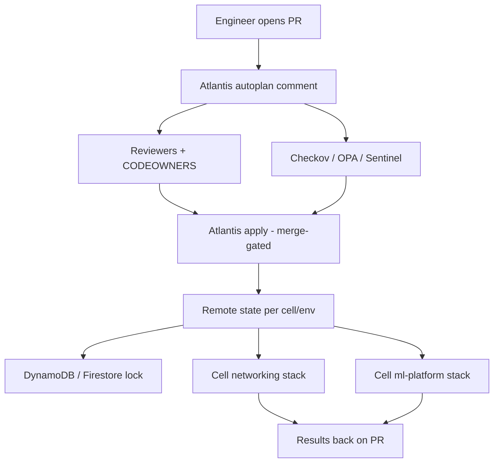

# Lesson 15 — IaC: Terraform + Atlantis at fleet scale

*2026-09-23*

## What interviewers are really probing

[Lesson 3](/lessons/03-cluster-provisioning-lifecycle) covered **how cells get born**. This lesson is about **who may change them after birth** — and how you keep that change system from nuking 100+ clusters (or an ML weight bucket) with one bad apply.

They are **not** asking “can you run `terraform apply`.” They want evidence you run **PR-gated infrastructure change** at fleet scale:

- **PR-gated plan/apply** — Atlantis (or equivalent) posts plans on the PR; apply is comment-driven and often merge-gated
- **State backends that survive** — remote state (S3/GCS) + lock table (DynamoDB/Firestore); encryption; IAM that is **not** world-readable
- **Workspace / cell blast radius** — one state per cell/env, never one mega-state for the fleet
- **Plan-only vs apply permissions** — different IAM identities; reviewers can see plans without holding destroy rights
- **Drift** — scheduled detection vs continuous plan spam that burns provider quotas
- **Lock contention** across many projects / parallel PRs on shared modules
- **Module versioning** — pin git tags/refs; floating `main` is how Friday outages start
- **Policy-as-code** — OPA/Conftest, Sentinel, Checkov **before** apply (and ideally on plan)
- **Break-glass** — dual-control, time-boxed, audited — not a standing `terraform` admin on a laptop

Cross-links that interviewers expect you to compose: [L11](/lessons/11-cluster-security-pss-admission-rbac) IAM least privilege, [L12](/lessons/12-node-container-hardening-supply-chain) signing posture for anything IaC ships into clusters, [L13](/lessons/13-ml-weights-checkpoint-hardening) / [L14](/lessons/14-ml-inference-training-deploy-hardening) for **ML infra** (weight buckets, CMEK, GPU pools) that Atlantis must gate harder than a staging App Deployment.

**Interview sentence:** “I never apply from a laptop against prod cells — Atlantis plans on the PR, policy and CODEOWNERS gate apply, each cell has its own remote state and lock, the runner authenticates with short-lived OIDC, and high-blast stacks (networking, IAM, ML weight buckets, GPU pools) have stricter `apply_requirements`.”

## Core diagram: PR → Atlantis → state → cells




**Read it top-down:** An engineer opens a **PR** against the IaC monorepo (or a scoped multi-repo) → **Atlantis** receives the webhook, runs **plan** for `when-modified` projects, and posts the plan as a PR comment → **human reviewers** (CODEOWNERS on high-blast paths) plus **policy checks** (Checkov/OPA/Sentinel) must pass → authorized `atlantis apply` (often with `apply_requirements: [approved, mergeable]`) runs with **short-lived OIDC** credentials → Terraform writes **remote state** (S3/GCS, encrypted) with a **lock** (DynamoDB/Firestore) — **one state object per cell/env**, not a fleet mega-state → providers mutate only that cell’s networking or ml-platform resources → apply output returns as a **PR comment** (the change ticket). The PNG compose strip ties L3 → L11 → L12 → L13 → L14 → **L15 gates the IaC plane**.

## Idiosyncrasies / operator depth

### Monorepo vs multi-repo; stacks per cell

| Shape | When it wins | Footgun |
|---|---|---|
| **Monorepo** (`infra/`) | Shared modules, one Atlantis, consistent policy pack | Giant blast if `when-modified` is too broad; noisy plans |
| **Multi-repo** (net / ml / platform) | Team ownership boundaries; smaller CODEOWNERS | Drift in Atlantis version, module pins, policy packs |
| **Directory-per-cell** `cells/us-east-1-a/networking` | Clear blast radius; matches fleet mental model ([L1](/lessons/01-hyperscale-mental-model)/[L3](/lessons/03-cluster-provisioning-lifecycle)) | Copy-paste drift; need module version discipline |
| **One stack / many cells via `for_each`** | Looks DRY | One state = one lock = one bad apply touches **all** cells |

At 100+ clusters, prefer **stacks per cell (or per cell×env)** with shared **version-pinned modules**. DRY belongs in modules, not in a single state file.

### `atlantis.yaml`: projects, when-modified, autoplan, apply_requirements

| Knob | Operator meaning |
|---|---|
| **`projects[].dir`** | One Atlantis project ≈ one Terraform root ≈ one state |
| **`when_modified`** | Glob of paths that trigger this project’s plan (include module paths carefully) |
| **`autoplan.enabled`** | Plan on open/update without a comment — great for visibility, costly if over-broad |
| **`apply_requirements`** | e.g. `approved`, `mergeable`, `undiverged` — raise the bar for networking / IAM / ML |
| **`workflow`** | Custom plan/apply steps: `terraform fmt`, `tflint`, `checkov`, Conftest |

High-blast directories (`networking/`, `iam/`, `ml-platform/weights/`) get **stricter** `apply_requirements` and CODEOWNERS — same instinct as admit-time gates in [L14](/lessons/14-ml-inference-training-deploy-hardening).

### State: one per cell/env — not one mega-state

- **Partial apply risk:** mega-state + targeted `-target` is how you leave dangling references and “helpfully” destroy siblings.
- **Lock granularity:** one lock per state. Shared mega-state serializes the entire fleet’s applies.
- **Recovery:** smaller states are restore-able; mega-state corruption is an incident class of its own.

### Workspace vs directory-per-env at fleet scale

| Approach | Verdict at hyperscale |
|---|---|
| **Terraform workspaces** (`default` / `prod`) in one dir | Fine for tiny apps; at fleet scale, easy to `apply` the wrong workspace; weak CODEOWNERS story |
| **Directory-per-env** (`envs/prod/`, `envs/staging/`) | Clearer blast radius; separate backends; Atlantis project per dir |
| **Directory-per-cell×env** | What most 100-cluster shops converge on |

Interview answer: “Workspaces are a feature; **directories + separate backends** are an operational boundary.”

### Module version pins

- Pin `source = "git::https://...//modules/vpc?ref=v1.4.2"` (tag or commit SHA).
- Floating `ref=main` means yesterday’s CI green is today’s silent module change.
- Renovate/Dependabot PRs bump module versions **through Atlantis** — the bump PR is the review surface.

### Provider auth: OIDC from Atlantis SA, not keys on the box

- Atlantis pod/VM assumes cloud roles via **OIDC / Workload Identity** ([L11](/lessons/11-cluster-security-pss-admission-rbac)).
- **No** long-lived access keys in the Atlantis Secret.
- Prefer **separate plan vs apply roles** (plan: read + state read; apply: mutate scoped resources).

### Parallel plans, locking, “plan file expired”

- Atlantis locks the project/dir while a PR holds a plan; competing PRs queue or unlock explicitly (`atlantis unlock` — **privileged**).
- Plan artifacts expire / diverge when `main` moves — `undiverged` requirement forces re-plan.
- Parallel autoplans across 50 projects can trip **provider API rate limits** — tune concurrency and `when_modified`.

### Drift detection vs continuous plan spam

- Nightly / hourly **drift plans** on prod cells (read-only identity) → ticket on non-empty plan.
- Do **not** autoplan every commit on every cell for “drift” — you will DDoS yourself and the cloud APIs.
- Out-of-band console clicks are drift; the fix is culture + detection, not disabling Atlantis.

## Concrete commands & config

### Example `atlantis.yaml` (networking cell + ml-platform cell)

```yaml
# atlantis.yaml — repo root
version: 3
parallel_plan: true
parallel_apply: false   # serialize applies; safer across shared lock tables
projects:
  - name: cell-a-networking
    dir: cells/cell-a/networking
    workspace: default
    autoplan:
      enabled: true
      when_modified:
        - "*.tf"
        - "*.tfvars"
        - "../../modules/vpc/**/*.tf"
    apply_requirements: [approved, mergeable, undiverged]
    workflow: fleet-strict

  - name: cell-a-ml-platform
    dir: cells/cell-a/ml-platform
    workspace: default
    autoplan:
      enabled: true
      when_modified:
        - "*.tf"
        - "*.tfvars"
        - "../../modules/gpu-pool/**/*.tf"
        - "../../modules/weight-bucket/**/*.tf"
    # Stricter: ML weight buckets / GPU pools / CMEK
    apply_requirements: [approved, mergeable, undiverged]
    workflow: ml-strict

workflows:
  fleet-strict:
    plan:
      steps:
        - init
        - run: terraform fmt -check -recursive
        - run: tflint --chdir=$DIR
        - run: checkov -d . --quiet --compact
        - plan
    apply:
      steps:
        - apply
  ml-strict:
    plan:
      steps:
        - init
        - run: terraform fmt -check -recursive
        - run: tflint --chdir=$DIR
        - run: checkov -d . --quiet --compact --framework terraform
        - run: conftest test plan.json -p policy/ml/   # deny public GetObject, broad IRSA
        - plan:
            extra_args: ["-out", "$PLANFILE"]
    apply:
      steps:
        - apply
```

### Backend HCL (S3 + DynamoDB, encrypted)

```hcl
# cells/cell-a/ml-platform/backend.tf
terraform {
  required_version = ">= 1.6.0"
  backend "s3" {
    bucket         = "acme-tfstate-prod"
    key            = "cells/cell-a/ml-platform/terraform.tfstate"
    region         = "us-east-1"
    encrypt        = true
    dynamodb_table = "acme-tfstate-locks"
    # Optional: KMS CMK instead of AES256
    # kms_key_id   = "arn:aws:kms:us-east-1:123:key/..."
  }
}
```

GCS variant sketch:

```hcl
terraform {
  backend "gcs" {
    bucket = "acme-tfstate-prod"
    prefix = "cells/cell-a/ml-platform"
  }
}
# Pair with a Firestore/GCS lock strategy your org standardizes;
# encrypt with CMEK; bucket IAM deny allUsers / allAuthenticatedUsers.
```

### Plan habits + Atlantis PR comments

```bash
# Local dry-run habits (still never apply prod from laptop)
terraform init -input=false
terraform validate
terraform plan -out=tfplan -input=false
terraform show -no-color tfplan | less
terraform show -json tfplan > plan.json
checkov -f plan.json --framework terraform_plan

# On the PR (Atlantis)
# atlantis plan
# atlantis plan -p cell-a-ml-platform
# atlantis apply -p cell-a-ml-platform
# atlantis unlock   # only after confirming no in-flight apply
```

### CI before Atlantis apply (defense in depth)

```yaml
# .github/workflows/tf-lint.yml — runs on PR; Atlantis still owns apply
- run: terraform fmt -check -recursive
- run: tflint --recursive
- run: checkov -d cells/ --framework terraform --quiet
- run: terraform validate  # after init -backend=false per root
```

Policy gates belong in **both** CI (fast fail) and Atlantis workflow (cannot skip by commenting apply only).

### State list / move / import — caution footnotes

```bash
terraform state list
# terraform state mv 'module.old.aws_s3_bucket.weights' 'module.new.aws_s3_bucket.weights'
# ^^^ state mv without a reviewed plan is how you orphan CMEK policies

# Import: prefer a PR that adds the resource + import block (TF 1.5+)
# or a carefully reviewed `terraform import` runbook — never silent console create + later import surprise destroy
```

**Rule:** state surgery is a **change**, not a fix-up. It goes through a PR with plan output showing **no unexpected destroys**.

## Failures & fixes

| Symptom | Likely root cause | Fix |
|---|---|---|
| `Error acquiring the state lock` stuck for hours | Crashed apply; forgotten lock; dead PR | Confirm no apply running; `atlantis unlock` or DynamoDB lock item delete **with dual-control**; re-plan |
| State looks corrupt after `state mv` | Partial move; wrong address; concurrent apply | Restore state from versioned bucket object; replay move in a reviewed PR; enable state versioning + MFA delete |
| Applied to wrong workspace / cell | Workspace habit; ambiguous `-p`; copied backend key | Directory-per-cell; require project name in apply; backend key includes cell id; CODEOWNERS |
| Soft-deleted cloud resources (GCP) / retention | Apply destroy + recreate race; API eventual consistency | Wait retention window or undelete API; plan for create-before-destroy where supported |
| Provider rate limits across 100 clusters | Parallel autoplan storm; shared account quotas | Cap Atlantis concurrency; stagger drift jobs; per-cell credentials / quotas |
| Atlantis ignores webhooks / 401 | Webhook secret mismatch; allowlist typo | Rotate `ATLANTIS_GH_WEBHOOK_SECRET`; fix `--repo-allowlist`; verify `/events` URL |
| Plan identity ≠ apply identity drift | Different roles; plan missed IAM denial that apply hits (or reverse) | Same trust root; document plan≤apply privileges carefully; integration-test both roles |
| **Destroyed GPU node pool / weight bucket** from wrong target | Mega-state; `-target` misuse; wrong project apply | Separate ml-platform state; ban casual `-target` in Atlantis; stricter `apply_requirements` + CODEOWNERS on `ml-platform/` |
| `Plan file was too old` / undiverged fail | `main` moved after plan | Re-run `atlantis plan`; require `undiverged` so stale plans cannot apply |
| Checkov green, apply opens public bucket | Policy only on HCL, not on plan JSON; exception wildcard | Conftest/OPA on **plan JSON**; deny `public-read` / `allUsers` bindings; alert on bucket policy diffs |

## Security & hardening

This is the **change-control plane** for everything prior lessons hardened. A signed image and CMEK bucket still lose if IaC quietly attaches `s3:*` or flips a bucket to public.

### Atlantis least privilege

| Control | Operator practice |
|---|---|
| **Separate plan vs apply IAM** | Plan role: state read, Describe/List; Apply role: scoped Create/Update/Delete on allow-listed services |
| **No admin on the runner** | Atlantis SA is not `OrganizationAdministrator` / `AdministratorAccess` |
| **Repo allowlist + webhook secret** | Mandatory; see [Atlantis security](https://www.runatlantis.io/docs/security.html) |
| **Egress deny to random providers** | Pin provider versions; prefer baked providers; treat `external` data sources as hostile |
| **PR branch `atlantis.yaml` risk** | Server-side repo config can constrain workflows; do not let a PR invent arbitrary `run:` steps that exfil credentials |

### PR approval + CODEOWNERS

```text
# .github/CODEOWNERS
/cells/*/networking/          @platform-networking-oncall
/cells/*/iam/                 @security-iam-approvers
/cells/*/ml-platform/         @ml-platform-oncall @security-iam-approvers
/modules/weight-bucket/       @ml-platform-oncall @security-iam-approvers
/modules/gpu-pool/            @ml-platform-oncall
```

Pair with Atlantis `apply_requirements: [approved, mergeable, undiverged]` on those projects. High-blast = **more humans**, not fewer clicks.

### Secrets & state

| Bad | Better |
|---|---|
| Plaintext DB passwords in `.tf` / `tfvars` committed | Secret Manager / Vault; TF only holds **references** |
| Secrets in state with world-readable bucket | State encryption (SSE-KMS/CMEK); bucket IAM deny public; private to Atlantis + break-glass auditors |
| `sensitive = true` as “encryption” | Redaction only — state still stores values |
| Long-lived keys in Atlantis K8s Secret | OIDC/WI; rotate if ever used |

### OIDC / Workload Identity for cloud auth

- GitHub OIDC → AWS IAM role / GCP WIF for **Atlantis** (and for CI lint jobs separately).
- Condition on `sub` / `attribute.repository` / audience so a random fork PR cannot assume prod apply roles.
- Compose with [L11](/lessons/11-cluster-security-pss-admission-rbac): same least-privilege story, different caller.

### Policy gates (deny the classics)

Deny in Checkov/OPA/Sentinel/Conftest:

- Unrestricted IAM (`*.*`, `iam:*`, `AdministratorAccess` attachments)
- Public buckets / `allUsers` objectViewer
- Open security groups `0.0.0.0/0` to SSH/RDP / node ports
- Unsigned / `:latest` image refs in `kubernetes_manifest` / Helm releases Atlantis applies ([L12](/lessons/12-node-container-hardening-supply-chain))
- IRSA/WI policies with `s3:*` on weight prefixes ([L13](/lessons/13-ml-weights-checkpoint-hardening))

### Audit trail

- **PR = change ticket** — plan + apply comments are the narrative; link from incident docs.
- State bucket **access logs** / CloudTrail data events on state objects.
- Alert: apply without approval; unlock events; policy bypass labels.

### AI/ML angle (required)

Terraform that provisions **model-weight buckets**, **CMEK keys**, **GPU node pools**, and **private registries** is **high-blast ML infra**. It must go through Atlantis with **stricter** `apply_requirements` and dual CODEOWNERS (ML platform + security).

Tie-through:

| Lesson | What IaC must not undo |
|---|---|
| [L12](/lessons/12-node-container-hardening-supply-chain) | Do not let TF apply unsigned image refs into cluster manifests |
| [L13](/lessons/13-ml-weights-checkpoint-hardening) | Do not open public `GetObject`; keep writer/reader SA split; CMEK required |
| [L14](/lessons/14-ml-inference-training-deploy-hardening) | Do not attach overly broad IRSA/WI to train/serve node pools or workload roles |

```hcl
# Sketch: weight bucket — policy tests must FAIL if public ACL / broad policy creeps in
resource "aws_s3_bucket_public_access_block" "weights" {
  bucket                  = aws_s3_bucket.weights.id
  block_public_acls       = true
  block_public_policy     = true
  ignore_public_acls      = true
  restrict_public_buckets = true
}

# IRSA for inference: GetObject + KMS Decrypt on prod prefix ONLY — never s3:*
```

**Punchline:** Admission and NetPol harden what **runs**. Atlantis hardens who may **change the substrate** those controls sit on. Skip L15 and a friendly PR can re-open the hole L13 closed.

## Interview soundbites

- **“I don’t apply prod from a laptop — Atlantis plans on the PR, humans and policy gate apply.”**
- **“One Terraform state per cell/env; a mega-state is a blast-radius bug with extra steps.”**
- **“Plan IAM and apply IAM are different roles; the runner is never org admin.”**
- **“Module sources are pinned to tags/SHAs — floating main is an unreviewed change.”**
- **“Workspaces are convenience; directories plus separate backends are the operational boundary.”**
- **“CODEOWNERS on networking, IAM, and ml-platform weight buckets — apply_requirements match the blast radius.”**
- **“State is secret-adjacent: encrypt it, lock it, log access, never make the bucket public.”**
- **“OIDC/WI for Atlantis — static cloud keys on the box are an incident waiting for a webhook.”**
- **“Checkov on HCL and Conftest on plan JSON — HCL-only policy misses computed public access.”**
- **“Drift detection is scheduled and read-only; continuous autoplan across 100 cells is self-DoS.”**
- **“Terraform that touches GPU pools or weight buckets inherits L12/L13/L14 — IaC must not quietly attach s3:* or public GetObject.”**
- **“PR comments are the audit trail; unlock and state mv are privileged actions with dual-control.”**

## How this maps to the JD

Hyperscale platform roles own **safe change** across 100+ clusters: provisioning ([L3](/lessons/03-cluster-provisioning-lifecycle)) is useless without a gated IaC path that respects cell blast radius, IAM least privilege ([L11](/lessons/11-cluster-security-pss-admission-rbac)), and ML substrate controls ([L13](/lessons/13-ml-weights-checkpoint-hardening)/[L14](/lessons/14-ml-inference-training-deploy-hardening)). Terraform + Atlantis (or Terraform Cloud/Enterprise/Spacelift with the same PR semantics) is how you prove you can evolve networking, IAM, GPU pools, and weight stores without heroics. Next up in the curriculum: **Temporal & Argo** for workflow orchestration after the change lands.

## Watch (talks & demos)

Real talks that map to this lesson — watch after the Failures & fixes table.

### Infrastructure automation via GitHub PR for Terraform with Atlantis

End-to-end Atlantis: webhook → plan comment → apply comment against AWS — the operator loop this lesson centers on.

<iframe width="100%" height="360" src="https://www.youtube.com/embed/sV9IBczE3IA" title="Infrastructure automation via GitHub pull request for Terraform with Atlantis" frameBorder="0" allow="accelerometer; autoplay; clipboard-write; encrypted-media; gyroscope; picture-in-picture; web-share" allowFullScreen></iframe>

[Open on YouTube](https://www.youtube.com/watch?v=sV9IBczE3IA)

### Terraform Practices to Enable Infrastructure Scaling (Hila Fish)

Module boundaries, scaling practices, and the organizational habits that keep Terraform usable past a handful of stacks — pairs with per-cell state and pinned modules.

<iframe width="100%" height="360" src="https://www.youtube.com/embed/oWDVgTI0eXA" title="Terraform Practices to Enable Infrastructure Scaling - Hila Fish" frameBorder="0" allow="accelerometer; autoplay; clipboard-write; encrypted-media; gyroscope; picture-in-picture; web-share" allowFullScreen></iframe>

[Open on YouTube](https://www.youtube.com/watch?v=oWDVgTI0eXA)

### How to Manage Terraform Secrets Safely

Why `sensitive = true` is not encryption, why state is secret-adjacent, and how to keep credentials out of tfvars/CI logs — required mindset for Atlantis runners and state buckets.

<iframe width="100%" height="360" src="https://www.youtube.com/embed/NvOiXD6JFHc" title="How to Manage Terraform Secrets Safely" frameBorder="0" allow="accelerometer; autoplay; clipboard-write; encrypted-media; gyroscope; picture-in-picture; web-share" allowFullScreen></iframe>

[Open on YouTube](https://www.youtube.com/watch?v=NvOiXD6JFHc)

## References

- [Atlantis docs](https://www.runatlantis.io/docs/) · [Atlantis security](https://www.runatlantis.io/docs/security.html) · [Server configuration](https://www.runatlantis.io/docs/server-configuration.html) · [Repo config / atlantis.yaml](https://www.runatlantis.io/docs/repo-config.html)
- [Terraform backends (remote state)](https://developer.hashicorp.com/terraform/language/settings/backends/configuration) · [S3 backend](https://developer.hashicorp.com/terraform/language/settings/backends/s3) · [GCS backend](https://developer.hashicorp.com/terraform/language/settings/backends/gcs)
- [AWS OIDC with GitHub Actions](https://docs.aws.amazon.com/IAM/latest/UserGuide/id_roles_providers_create_oidc.html) · [GCP Workload Identity Federation](https://cloud.google.com/iam/docs/workload-identity-federation)
- [Checkov](https://www.checkov.io/) · [OPA / Conftest](https://www.conftest.dev/) · [TFLint](https://github.com/terraform-linters/tflint) · [Sentinel (TFC/TFE)](https://developer.hashicorp.com/sentinel)
- Prior: [14 — ML inference/training deploy hardening](/lessons/14-ml-inference-training-deploy-hardening) · [13 — ML weights / checkpoint hardening](/lessons/13-ml-weights-checkpoint-hardening) · [12 — Node/container hardening / supply chain](/lessons/12-node-container-hardening-supply-chain) · [11 — Cluster security / PSS / RBAC](/lessons/11-cluster-security-pss-admission-rbac) · [03 — Cluster provisioning](/lessons/03-cluster-provisioning-lifecycle)

## Quick self-check

Out loud, in under two minutes:

1. Why is one Terraform state for 100 clusters a blast-radius and locking problem?
2. What does Atlantis `apply_requirements: [approved, mergeable, undiverged]` buy you operationally?
3. How should Atlantis authenticate to AWS/GCP — and what must never live on the runner?
4. Name three policy denials you enforce before apply on an `ml-platform` stack (weights / GPU / IAM).
5. When is `terraform state mv` acceptable, and what must the plan show afterward?
6. How does L15 protect the guarantees you built in L12–L14?
