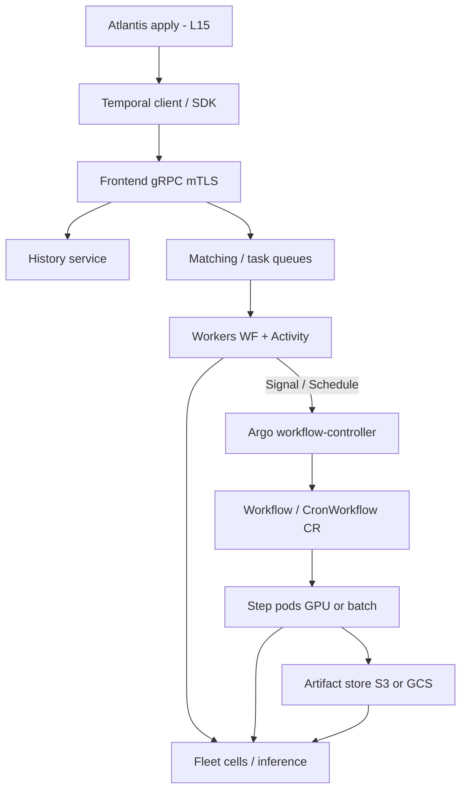

# Lesson 16 — Workflow orchestration: Temporal & Argo Workflows

*2026-09-24*

## What interviewers are really probing

[Lesson 15](/lessons/15-terraform-atlantis-fleet-scale) gated **who may change the substrate**. This lesson is about **what runs after the change** — multi-hour cell upgrades, drain waves, ML checkpoint → validate → promote, inference canaries that wait on humans or metrics. Interviewers are **not** asking “can you write a CronJob.” They want evidence you pick the **right orchestration plane** and keep it from becoming a blast-radius machine:

- **Temporal vs Argo** — when durable *code* workflows win vs when *K8s-native DAG pods* win (and how they compose)
- **Determinism & history** — Temporal workflow code that survives replay; Continue-As-New before history melts
- **Task queues / workers** — multi-cluster workers, sticky execution, starvation vs retry storms
- **Argo CR surface** — Workflow / CronWorkflow / WorkflowTemplate, DAG vs steps, artifacts, pod GC
- **Fleet ops** — upgrade orchestration, drain waves, canary across cells (echoes [L3](/lessons/03-cluster-provisioning-lifecycle) / [L4](/lessons/04-borg-mesos-orchestration))
- **ML pipelines** — GPU train jobs as Argo steps; Temporal signals for promote/rollback; weights & signed images ([L12](/lessons/12-node-container-hardening-supply-chain)–[L14](/lessons/14-ml-inference-training-deploy-hardening))
- **Security** — Temporal mTLS + payload encryption; Argo SA least privilege; private artifact buckets; no world-readable checkpoints

**Interview sentence:** “Atlantis applies the cell change; Temporal owns the durable multi-step saga (drain waves, canary signals, rollback); Argo runs the K8s-native GPU/batch DAGs with signed images and scoped weight IAM — workers and workflow SAs are never cluster-admin, and artifacts are never world-readable.”

## Core diagram: Temporal + Argo composing for fleet / ML




**Read it top-down:** An **Atlantis** apply ([L15](/lessons/15-terraform-atlantis-fleet-scale)) lands a cell or ML-platform change → a **Temporal client** starts (or signals) a durable workflow through the **Frontend** (mTLS) → **History** persists every event; **Matching** dispatches work on **task queues** to **workers** that may live in many clusters → for K8s-native GPU/batch steps the Temporal activity (or a Schedule) submits an **Argo Workflow** CR → the **workflow-controller** spawns **step pods** that pull **signed images**, write **artifacts** to a private bucket, and optionally pull **weights** with scoped IAM ([L13](/lessons/13-ml-weights-checkpoint-hardening)) → Temporal **signals** gate canary promote/rollback across **fleet cells**. The PNG compose strip is the interview story: IaC → durable saga → DAG pods → artifacts → canary.

## Idiosyncrasies / operator depth

### When Temporal wins vs when Argo wins

| Plane | Wins when | Footgun if forced |
|---|---|---|
| **Temporal** | Long-running durable *business/infra* logic: retries, timers (hours–days), signals, saga/compensation, multi-cluster workers, human-in-the-loop | Modeling every YAML DAG as Temporal activities that just `kubectl apply` — you reinvent Argo poorly |
| **Argo Workflows** | K8s-native DAGs, CI-like pipelines, GPU training/batch as pods, artifact plumbing (S3/GCS), CronWorkflow fan-out | Encoding multi-day business saga with signals/compensation purely as Workflow CRs — history of CRs and stuck Pending become the product |
| **Compose** | Temporal orchestrates *when/whether*; Argo executes *pod DAGs* | Two uncoordinated control planes racing the same Deployment |

At hyperscale: **Temporal = durable control brain**; **Argo = K8s execution muscle**. Same instinct as [L4](/lessons/04-borg-mesos-orchestration) (scheduler vs executor separation).

### Temporal: workflow vs activity determinism

- **Workflow code must be deterministic** — given the same history, replay produces the same commands. No random, no local clock (`workflow.Now`), no direct I/O, no unordered map iteration surprises in some languages.
- **Activities** do the real world: HTTP, cloud APIs, `kubectl`, GPU job submit, bucket GetObject. Retries, timeouts, heartbeats live here.
- **Nondeterminism error** after a deploy = you changed workflow code without versioning (`GetVersion` / worker versioning) while open executions still replay old history.
- **Sticky execution** caches the workflow worker to avoid full replay every task — great until the sticky worker dies and everyone pays replay cost at once.

### Task queues, workers, namespaces

| Knob | Operator meaning |
|---|---|
| **Task queue** | Routing key: `fleet-ops`, `ml-train-gpu`, `cell-us-east-1-a` — workers poll what they can run |
| **Worker identity** | Horizontal scale by adding pollers; starvation = not enough workers *or* activities stuck without heartbeat |
| **Namespace** | Blast-radius + tenancy boundary (team/env); separate retention, search attributes, auth |
| **Visibility / search attributes** | `cell_id`, `pipeline`, `change_ticket` — how oncall finds “all drains for cell-a” |
| **Schedule** | Cron-like durable schedules (prefer over homemade CronJobs that fire `StartWorkflow` without visibility) |

### History size, Continue-As-New, versioning

- Event history is the source of truth. **Unbounded loops** (poll forever, append forever) → history bloat → latency and `Workflow history size exceeds limit`.
- **Continue-As-New** checkpoints into a fresh run with carry-over state — mandatory for long-lived fleet controllers and chatty ML promotion loops.
- **Worker versioning / GetVersion** — ship new workflow logic without breaking open executions. Treat workflow code like a schema.

### Argo: Workflow / CronWorkflow / WorkflowTemplate

| Kind | Use |
|---|---|
| **Workflow** | One-shot DAG or steps run |
| **CronWorkflow** | Scheduled (drains, nightly eval, drift-adjacent batch) — still a Workflow under the hood |
| **WorkflowTemplate / ClusterWorkflowTemplate** | Reuse; pin versions like modules in [L15](/lessons/15-terraform-atlantis-fleet-scale) |

**DAG vs steps:** DAG expresses dependencies explicitly (`depends`); steps are sequential lists with fan-out via `withItems`. For ML “train → validate → promote”, DAG with explicit fail paths + **exit handlers** beats a fragile linear steps list.

### Parallelism, retries, deadlines, artifacts

- **`parallelism`**, **semaphore/mutex** — cap concurrent GPU pods or external API calls; without them CronWorkflow + `retryStrategy` = retry storm.
- **`retryStrategy`** + **`activeDeadlineSeconds`** — retries without a deadline are how zombie GPU jobs burn quota overnight.
- **Artifacts** (S3/GCS) — outputs between steps; misconfigured IAM → Pending forever or world-readable checkpoints (security incident, not a “storage glitch”).
- **`archiveLogs` / pod GC** — keep enough for forensics; TTL aggressively or etcd/API and disks drown.
- **Resource templates / executor plugins** — call K8s resources or plugins; still subject to admission ([L11](/lessons/11-cluster-security-pss-admission-rbac) / [L14](/lessons/14-ml-inference-training-deploy-hardening)).

### Fleet ops patterns (the JD meat)

| Pattern | Temporal role | Argo role |
|---|---|---|
| **Cluster upgrade waves** | Saga: cordon → drain → wait healthy → next cell; signal pause on SLO burn | Optional per-node DaemonSet/job steps |
| **Node drain waves** | Durable progress across hours; compensation if drain stuck | Pod-disruption-aware jobs; PDB-respecting batch |
| **Canary across cells** | Signal `canary_ok` / `rollback` from metrics or human | Rollout jobs / eval Workflows per cell |
| **ML train → validate → promote** | Outer workflow: gate promote on metrics + signed digest | Inner DAG: GPU train, eval pod, artifact publish |
| **Post-Atlantis hook** | Start workflow from apply comment / webhook with change ticket search attr | Materialize Jobs that Atlantis should **not** run inline |

## Concrete commands & config

### Temporal CLI — namespaces, workflows, visibility

```bash
# namespaces (blast radius)
temporal operator namespace list
temporal operator namespace describe --namespace fleet-ops

# start a durable cell-upgrade workflow
temporal workflow start \
  --namespace fleet-ops \
  --task-queue fleet-ops \
  --type CellUpgradeWorkflow \
  --workflow-id "upgrade-cell-a-2026-09-24" \
  --input '{"cell":"us-east-1-a","wave_size":5,"change_ticket":"ATL-1842"}'

# signal canary gate (inference promote)
temporal workflow signal \
  --namespace fleet-ops \
  --workflow-id "upgrade-cell-a-2026-09-24" \
  --name CanaryDecision \
  --input '{"promote":true,"digest":"sha256:abc…"}'

# describe + show history size pressure
temporal workflow describe --namespace fleet-ops --workflow-id "upgrade-cell-a-2026-09-24"
temporal workflow show --namespace fleet-ops --workflow-id "upgrade-cell-a-2026-09-24"

# visibility: find drains for a cell
temporal workflow list --namespace fleet-ops \
  --query "cell_id = 'us-east-1-a' AND ExecutionStatus = 'Running'"
```

### Temporal worker sketch (determinism boundary)

```go
// Workflow: deterministic orchestration only
func CellUpgradeWorkflow(ctx workflow.Context, in CellUpgradeInput) error {
    ao := workflow.ActivityOptions{
        StartToCloseTimeout: 30 * time.Minute,
        HeartbeatTimeout:    2 * time.Minute,
        RetryPolicy:         &temporal.RetryPolicy{MaximumAttempts: 5},
    }
    ctx = workflow.WithActivityOptions(ctx, ao)

    var drained int
    for wave := 0; wave*in.WaveSize < in.NodeCount; wave++ {
        if err := workflow.ExecuteActivity(ctx, DrainWaveActivity, in, wave).Get(ctx, &drained); err != nil {
            return err // or run compensation activity
        }
        // wait for human/metrics signal before next wave
        var decision CanaryDecision
        sigCtx, _ := workflow.WithCancel(ctx)
        workflow.GetSignalChannel(sigCtx, "CanaryDecision").Receive(sigCtx, &decision)
        if !decision.Promote {
            return workflow.ExecuteActivity(ctx, RollbackWaveActivity, in, wave).Get(ctx, nil)
        }
        // long-running controller: Continue-As-New periodically
        if workflow.GetInfo(ctx).GetContinueAsNewSuggested() {
            return workflow.NewContinueAsNewError(ctx, CellUpgradeWorkflow, in.AfterWave(wave))
        }
    }
    return nil
}

// Activity: real I/O, heartbeats, retries — NOT in workflow code
func DrainWaveActivity(ctx context.Context, in CellUpgradeInput, wave int) (int, error) {
    // kubectl / cloud API / internal fleet API — heartbeat while waiting
    return drainWave(ctx, in, wave)
}
```

### Temporal mTLS / client config (sketch)

```yaml
# workers and clients share the trust domain — no plaintext frontend in prod
temporal:
  hostPort: temporal-frontend.temporal.svc:7233
  namespace: fleet-ops
  tls:
    clientCertPath: /var/run/certs/client.pem
    clientKeyPath: /var/run/certs/client.key
    caPath: /var/run/certs/ca.pem
    serverName: temporal-frontend.temporal.svc
  # payload codec / encryption keys via env from Secret (not plaintext in ConfigMap)
```

### Argo Workflow — ML checkpoint → validate → promote

```yaml
apiVersion: argoproj.io/v1alpha1
kind: Workflow
metadata:
  generateName: ml-promote-
  namespace: ml-pipelines
  labels:
    pipeline: weights-promote
    cell: us-east-1-a
spec:
  serviceAccountName: argo-ml-pipeline   # least privilege — not default
  entrypoint: train-validate-promote
  activeDeadlineSeconds: 14400          # hard cap — no infinite GPU burn
  parallelism: 4
  podGC:
    strategy: OnWorkflowSuccess
    deleteDelayDuration: 1h
  artifactRepositoryRef:
    configMap: artifact-repositories
    key: default
  templates:
    - name: train-validate-promote
      dag:
        tasks:
          - name: train
            template: gpu-train
          - name: validate
            depends: train.Succeeded
            template: eval-metrics
          - name: promote
            depends: validate.Succeeded
            template: promote-serving
      # on any failure: notify Temporal / page — do not leave half-promoted weights
      onExit: exit-handler

    - name: gpu-train
      retryStrategy:
        limit: "2"
        retryPolicy: Always
        backoff:
          duration: "2m"
          factor: 2
      nodeSelector:
        nvidia.com/gpu.product: NVIDIA-H100
      container:
        image: registry.example.com/ml/train@sha256:…   # digest-pinned, signed (L12)
        imagePullSecrets: [{name: regcred}]
        resources:
          limits:
            nvidia.com/gpu: 8
        envFrom:
          - secretRef: {name: weights-reader}           # scoped GetObject only (L13)
        command: ["python", "-m", "train"]
      outputs:
        artifacts:
          - name: checkpoint
            path: /out/checkpoint
            s3:
              key: "checkpoints/{{workflow.name}}/ckpt"

    - name: eval-metrics
      container:
        image: registry.example.com/ml/eval@sha256:…
        command: ["python", "-m", "eval", "--fail-under", "0.92"]
      inputs:
        artifacts:
          - name: checkpoint
            path: /in/checkpoint

    - name: promote-serving
      resource:
        action: apply
        manifest: |
          apiVersion: apps/v1
          kind: Deployment
          metadata:
            name: inference-canary
          spec:
            template:
              spec:
                containers:
                  - name: serve
                    image: registry.example.com/ml/serve@sha256:…
      # Prefer signaling Temporal to flip serving weight vs mutating prod directly from Argo

    - name: exit-handler
      steps:
        - - name: notify
            template: notify-temporal
            when: "{{workflow.status}} != Succeeded"
```

### Argo CronWorkflow + RBAC scraps

```yaml
apiVersion: argoproj.io/v1alpha1
kind: CronWorkflow
metadata:
  name: nightly-cell-drain-canary
  namespace: fleet-ops
spec:
  schedule: "0 3 * * *"
  concurrencyPolicy: Forbid          # never overlap drain waves
  successfulJobsHistoryLimit: 3
  failedJobsHistoryLimit: 3
  workflowSpec:
    serviceAccountName: argo-drain
    activeDeadlineSeconds: 7200
    entrypoint: drain-canary
    templates:
      - name: drain-canary
        steps:
          - - name: drain
              templateRef:
                name: drain-wave-template
                template: drain
# --- RBAC: Workflow SA may create pods in its NS; may NOT patch cluster-scoped RBAC ---
apiVersion: v1
kind: ServiceAccount
metadata:
  name: argo-ml-pipeline
  namespace: ml-pipelines
---
apiVersion: rbac.authorization.k8s.io/v1
kind: Role
metadata:
  name: argo-ml-pipeline
  namespace: ml-pipelines
rules:
  - apiGroups: [""]
    resources: [pods, pods/log, configmaps, secrets]
    verbs: [get, list, watch, create, patch, delete]
  - apiGroups: ["argoproj.io"]
    resources: [workflows, workflowtaskresults]
    verbs: [get, list, watch, patch]
# Bind Role — never ClusterRole/cluster-admin for pipeline SAs
```

### Submit / debug Argo

```bash
argo submit -n ml-pipelines --watch ml-promote.yaml
argo list -n ml-pipelines
argo get -n ml-pipelines ml-promote-xxxxx
argo logs -n ml-pipelines ml-promote-xxxxx
argo stop  -n ml-pipelines ml-promote-xxxxx    # graceful
argo terminate -n ml-pipelines ml-promote-xxxxx

# Pending forever? classic causes
kubectl -n ml-pipelines describe pod | grep -A20 "Events:"
kubectl -n ml-pipelines get resourcequota,limitrange
kubectl describe nodes | grep -A5 "nvidia.com/gpu"
```

## Failures & fixes

| Symptom | Likely root cause | Fix |
|---|---|---|
| Temporal `Nondeterminism` after deploy | Workflow code changed; replay diverges | `GetVersion` / worker versioning; never silently edit branching of open WFs; pin worker builds |
| Workflow latency spikes / history limit | Unbounded loop; chatty activities; missing Continue-As-New | Continue-As-New on suggest; shrink payloads; move bulk data to object store + pass refs |
| Activities timing out / worker “idle” but backlog grows | Not enough pollers; wrong task queue; sticky thrash; no heartbeat on long activity | Scale workers; fix queue names; heartbeat; raise `HeartbeatTimeout` appropriately |
| Schedule fires twice / missed | Multiple Schedule writers; clock skew assumptions; namespace confusion | Single owner per Schedule ID; use Temporal Schedule not homemade Cron+Start |
| Argo Workflow stuck **Pending** | PVC unbound; ResourceQuota; GPU shortage; imagePullBackoff; affinity | Describe pod/events; fix storage class; request GPU nodes; digest-pinned pulls with pull secret |
| Artifact step fails with AccessDenied | Bucket IAM / wrong key prefix / missing KMS decrypt | Scoped IAM for WF SA / IRSA; CMEK grant; never make bucket public to “unblock” |
| Retry storm burns GPU quota | `retryStrategy` without `activeDeadlineSeconds` / Forbid concurrency | Hard deadlines; `concurrencyPolicy: Forbid`; semaphore on GPU templates |
| Zombie Workflow Running forever | Missing deadline; exit handler never fires; controller overload | `activeDeadlineSeconds`; controller HA + rate limits; terminate + alert on age |
| Half-promoted model in serving | Promote step ran after failed validate; no outer gate | DAG `depends: validate.Succeeded`; Temporal signal gate; atomic serving pointer update |
| Secret in Temporal payload plaintext | Activity args logged/visibility | Payload encryption/codec; pass secret refs/handles not values; scrub visibility |

## Security & hardening

This is the **execution plane** sitting on everything L11–L15 hardened. A perfect PSS profile still loses if an Argo SA is `cluster-admin`, Temporal payloads carry weight URLs with standing keys, or artifact buckets are world-readable.

### Temporal controls

| Control | Operator practice |
|---|---|
| **mTLS everywhere** | Clients, workers, frontend — private CA; rotate; no plaintext `7233` on a shared VPC “because internal” |
| **Authn / authz per namespace** | JIT access for break-glass; operators ≠ application writers |
| **Encrypt payloads** | Codec / encryption so history store & visibility do not become a secret lake |
| **Least-priv activity IAM** | Activity workers assume scoped cloud roles (cell drain API, weight **reader**, never `s3:*`) |
| **NetworkPolicy** | Workers egress only to frontend + required APIs; frontend not world-reachable |
| **Audit** | Workflow ID = change ticket; search attributes carry `change_ticket`, `actor` |

### Argo controls

| Control | Operator practice |
|---|---|
| **Workflow SA least privilege** | Role in namespace only; no `cluster-admin`; separate SA for ML vs fleet drain |
| **Deny privileged / hostPath** | PSS restricted + admission ([L11](/lessons/11-cluster-security-pss-admission-rbac) / [L14](/lessons/14-ml-inference-training-deploy-hardening)); workflows invent pods — treat them as untrusted compute |
| **Signed, digest-pinned images** | Cosign verify / admission; no `:latest` in templates ([L12](/lessons/12-node-container-hardening-supply-chain)) |
| **Private registries** | `imagePullSecrets` or node identity; block Docker Hub surprise pulls in prod NS |
| **Artifact bucket IAM** | Private bucket; CMEK; deny public ACLs; prefix-scoped read/write per pipeline |
| **Secrets** | K8s Secrets / external secrets → env; never bake long-lived cloud keys into templates; prefer WI/IRSA |
| **NetworkPolicy** | Pipeline pods talk to registry, artifact bucket endpoint, model store — not the flat cluster network |
| **Controller hardening** | Argo server SSO/RBAC; disable `--auth-mode=server` anonymous; audit who can `argo submit` |

### AI/ML angle (required)

Workflows that **pull model weights/checkpoints**, **train**, or **promote serving** inherit L12–L14:

| Risk | Hardening |
|---|---|
| Weight exfil via artifact repo | Private bucket; no `allUsers`; separate writer (train) vs reader (serve); CMEK ([L13](/lessons/13-ml-weights-checkpoint-hardening)) |
| Unsigned train/serve image | Digest pin + cosign verify in admission before Workflow pods schedule ([L12](/lessons/12-node-container-hardening-supply-chain)) |
| Standing weight credentials in WF spec | Short-lived WI/IRSA on the step SA; Secret store refs; Temporal passes **handles**, not keys |
| GPU pod escape / lateral move | PSS restricted; no privileged; NetPol; GPU pool isolation ([L14](/lessons/14-ml-inference-training-deploy-hardening)) |
| Provenance gap | Record image digest + checkpoint hash + Workflow UID in Temporal search attrs / artifact metadata (SLSA mindset) |
| World-readable eval artifacts | Same bucket controls as weights; TTL delete; no anonymous HTTPS listing |

```yaml
# Sketch NetworkPolicy for ml-pipelines Workflow pods
apiVersion: networking.k8s.io/v1
kind: NetworkPolicy
metadata:
  name: ml-pipeline-egress
  namespace: ml-pipelines
spec:
  podSelector:
    matchLabels:
      workflows.argoproj.io/workflow: ""  # tighten with your labels
  policyTypes: [Egress]
  egress:
    - to:
        - namespaceSelector:
            matchLabels: {kubernetes.io/metadata.name: kube-system}
      # DNS — prefer explicit CoreDNS selectors in real clusters
    - to:
        - podSelector: {}  # replace with registry / artifact gateway selectors
      ports:
        - {protocol: TCP, port: 443}
```

**Punchline:** Temporal durability without mTLS/encrypted payloads is a **durable secret leak**. Argo convenience without SA/image/bucket discipline is a **GPU-powered exfil path**. L15 decides who may change the substrate; L16 decides who may **run code that touches weights and cells**.

## Interview soundbites

- **“Temporal for durable multi-day fleet sagas with signals; Argo for K8s-native GPU/batch DAGs — compose, don’t collapse.”**
- **“Workflow code is deterministic; activities do I/O — nondeterminism after deploy is a versioning bug, not bad luck.”**
- **“History bloat means you needed Continue-As-New yesterday.”**
- **“Task queues are blast-radius and capacity boundaries — starve or storm starts with queue design.”**
- **“CronWorkflow without Forbid concurrency and activeDeadlineSeconds is how you DDoS your own GPU pool.”**
- **“Artifacts are data planes: private buckets, scoped IAM, CMEK — never world-readable checkpoints.”**
- **“Workflow SAs are least privilege; PSS restricted; digest-pinned signed images only.”**
- **“Promote is a Temporal signal gated on validate — not an Argo step that always runs.”**
- **“Atlantis applies; Temporal orchestrates; Argo executes pods — three planes, one change ticket.”**
- **“mTLS to Temporal frontend; payload encryption; NetPol on workers — durable ≠ trusted.”**
- **“Search attributes carry cell_id and change_ticket — oncall finds the wave without SSH folklore.”**
- **“Zombie Running workflows get deadlines, GC, and alerts — hope is not an SRE strategy.”**

## How this maps to the JD

Hyperscale platforms do not “SSH and drain.” They run **durable orchestration** across 100+ clusters: upgrades, drains, canaries, and ML promote paths that survive process death and human sleep. Temporal maps to the Borg-like *control* instincts from [L4](/lessons/04-borg-mesos-orchestration) with modern durable execution; Argo maps to *K8s-native batch/DAG* execution on the cells [L3](/lessons/03-cluster-provisioning-lifecycle) provisioned and [L15](/lessons/15-terraform-atlantis-fleet-scale) changed safely. Security posture composes [L11](/lessons/11-cluster-security-pss-admission-rbac)–[L14](/lessons/14-ml-inference-training-deploy-hardening): RBAC, signed images, weight IAM, admission — now applied to **workflow runners** themselves. Next curriculum beat: **systems design tradeoffs** for rapidly evolving platforms, then the deeper AI/ML GPU track.

## Watch (talks & demos)

Real talks that map to this lesson — watch after the Failures & fixes table.

### Declarative and Imperative Kubernetes Operations with Temporal and M3 (KubeCon NA 2021)

Chronosphere + Temporal: why operators detect drift declaratively while Temporal runs **imperative mitigation** (upgrades, quorum-safe rolls) — the exact compose model for fleet ops.

<iframe width="100%" height="360" src="https://www.youtube.com/embed/8OCDPDGA_C0" title="Declarative and Imperative Kubernetes Operations with Temporal and M3 - KubeCon NA 2021" frameBorder="0" allow="accelerometer; autoplay; clipboard-write; encrypted-media; gyroscope; picture-in-picture; web-share" allowFullScreen></iframe>

[Open on YouTube](https://www.youtube.com/watch?v=8OCDPDGA_C0)

### Large Scale Batch Processing with Argo Workflows and Events (Intuit / KubeCon)

~40k pipelines, multi-cluster Argo, HA controller, PDBs, rate limits, semaphores — operator depth for Argo at fleet/batch scale (including ML-adjacent data pipelines).

<iframe width="100%" height="360" src="https://www.youtube.com/embed/J5XDDxcgP8E" title="Large Scale Batch Processing with Argo Workflows and Events - Intuit" frameBorder="0" allow="accelerometer; autoplay; clipboard-write; encrypted-media; gyroscope; picture-in-picture; web-share" allowFullScreen></iframe>

[Open on YouTube](https://www.youtube.com/watch?v=J5XDDxcgP8E)

### Getting to know Temporal (Maxim Fateev)

Founder-level walkthrough of durable execution, workflow vs activity, retries, and why this replaces homemade saga/queue folklore — grounding for the Temporal half of the lesson.

<iframe width="100%" height="360" src="https://www.youtube.com/embed/wIpz4ioK0gI" title="Getting to know Temporal - Maxim Fateev" frameBorder="0" allow="accelerometer; autoplay; clipboard-write; encrypted-media; gyroscope; picture-in-picture; web-share" allowFullScreen></iframe>

[Open on YouTube](https://www.youtube.com/watch?v=wIpz4ioK0gI)

## References

- [Temporal docs](https://docs.temporal.io/) · [Workflows](https://docs.temporal.io/workflows) · [Activities](https://docs.temporal.io/activities) · [Task Queues](https://docs.temporal.io/task-queue) · [Continue-As-New](https://docs.temporal.io/workflows#continue-as-new) · [Versioning](https://docs.temporal.io/worker-versioning) · [Security](https://docs.temporal.io/security)
- [Argo Workflows docs](https://argo-workflows.readthedocs.io/) · [Workflow concept](https://argo-workflows.readthedocs.io/en/latest/workflow-concepts/) · [DAG](https://argo-workflows.readthedocs.io/en/latest/walk-through/dag/) · [Artifacts](https://argo-workflows.readthedocs.io/en/latest/walk-through/artifacts/) · [CronWorkflow](https://argo-workflows.readthedocs.io/en/latest/cron-workflows/) · [Security / RBAC](https://argo-workflows.readthedocs.io/en/latest/security/)
- [CNCF Argo](https://www.cncf.io/projects/argo/) · [Temporal (open source)](https://github.com/temporalio/temporal)
- Prior: [15 — Terraform / Atlantis](/lessons/15-terraform-atlantis-fleet-scale) · [14 — ML inference/training deploy hardening](/lessons/14-ml-inference-training-deploy-hardening) · [13 — ML weights / checkpoint hardening](/lessons/13-ml-weights-checkpoint-hardening) · [12 — Node/container hardening / supply chain](/lessons/12-node-container-hardening-supply-chain) · [11 — Cluster security / PSS / RBAC](/lessons/11-cluster-security-pss-admission-rbac) · [04 — Borg/Mesos orchestration](/lessons/04-borg-mesos-orchestration) · [03 — Cluster provisioning](/lessons/03-cluster-provisioning-lifecycle)

## Quick self-check

Out loud, in under two minutes:

1. When do you choose Temporal over Argo Workflows — and when do you compose both?
2. Why must Temporal workflow code be deterministic, and what breaks if you change it under open executions?
3. What does Continue-As-New buy you operationally at fleet scale?
4. Name three reasons an Argo Workflow stays Pending and how you diagnose each.
5. How do you harden an ML promote pipeline (images, weight IAM, SA, artifacts, promote gate)?
6. How does L16 sit on top of L15 (Atlantis) and L12–L14 (signing / weights / deploy hardening)?
