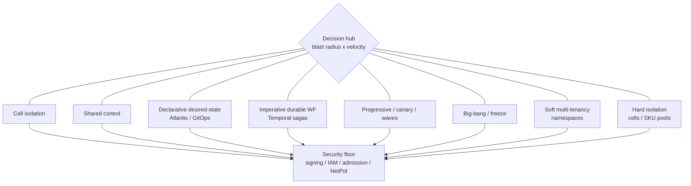

# Lesson 17 — Systems design tradeoffs for rapidly evolving platforms

*2026-09-25*

## What interviewers are really probing

[Lesson 15](/lessons/15-terraform-atlantis-fleet-scale) gated **who may change the substrate**. [Lesson 16](/lessons/16-temporal-argo-workflows) owned **what runs after the change**. This lesson is the **synthesis**: under change velocity, can you **pick a side, defend it, and name the footgun** without collapsing into CAP textbook fluff?

Interviewers at hyperscale (100+ clusters / 10K+ nodes) are not asking “CAP theorem, go.” They want evidence you have **operated under partial failure and product pressure**:

- **Blast radius vs leverage** — cells vs shared control planes ([L1](/lessons/01-hyperscale-mental-model) / [L3](/lessons/03-cluster-provisioning-lifecycle))
- **Consistency vs availability of the control plane** — etcd quorum, regional failover, when stale reads are acceptable
- **Homogeneous golden image vs heterogeneous SKUs** — fleet simplicity vs GPU/ML hardware reality ([L4](/lessons/04-borg-mesos-orchestration), preview of the AI/ML track)
- **Declarative desired-state vs imperative durable workflows** — Atlantis/GitOps vs Temporal sagas ([L15](/lessons/15-terraform-atlantis-fleet-scale) / [L16](/lessons/16-temporal-argo-workflows))
- **Central platform vs per-cell forks** — pave-the-road vs snowflake velocity
- **Progressive delivery vs big-bang** — canaries, flags, wave deploys vs freeze windows
- **Strong contracts vs flexible extension** — CRD/admission versioning as a product
- **Multi-tenancy isolation levels** — soft namespaces vs hard cells vs dedicated clusters; GPU pool sharing vs SKU isolation
- **Build vs buy / managed vs DIY** — control vs ops load at fleet scale
- **Cost vs latency/reliability** — overprovision, reserved capacity, inference KV-cache as a design choice (light preview)

**Interview sentence:** “I pick tradeoffs by blast radius and change velocity: cells when failure must not correlate; shared control when leverage beats the isolation tax; Atlantis for desired-state substrate, Temporal for durable sagas; progressive waves with metric gates — and I never trade away signing, weight IAM, admission, or GPU pool isolation for speed.”

## Core diagram: velocity vs safety decision map




**Read it top-down:** Every platform decision radiates from a **decision hub** that balances **blast radius × change velocity**. The six major axes (cell vs shared, declarative vs imperative, progressive vs big-bang, soft vs hard tenancy, golden image vs SKUs, central vs forks) are **not** right/wrong — each side wins in a context. Under them sit consistency/availability of control planes, API contracts, build-vs-buy, and cost/SLO choices. The **security floor** is the non-negotiable strip: signing/provenance, admission/RBAC, weight/bucket IAM + CMEK, NetworkPolicy/GPU pool isolation, short-lived secrets. Velocity that punches through that floor is not “moving fast” — it is an incident waiting for a change ticket.

## Idiosyncrasies / operator depth

### 1. Cell isolation vs shared control

| Side | Wins when | Footgun |
|---|---|---|
| **Cell isolation** | Failure domains must not correlate (region/AZ/product blast walls); independent etcd / apiserver / addons ([L1](/lessons/01-hyperscale-mental-model), [L3](/lessons/03-cluster-provisioning-lifecycle)) | Ops tax: N control planes, N upgrade waves, N credential surfaces |
| **Shared control** | Fleet-wide leverage (one scheduler view, one policy plane, one Atlantis org) beats isolation tax | One bad webhook / CRD / IAM role = fleet-wide outage; “pane of glass” becomes pane of blast |

Borg-like cells ([L4](/lessons/04-borg-mesos-orchestration)) exist because **correlated failure is the enemy of SLOs**. Shared control exists because **humans do not scale linearly with clusters**. The interview move is naming *which* plane is shared (policy, observability, identity) vs *which* must stay cell-local (etcd, CNI, device plugins).

**Interview sentence:** “I share policy and identity; I isolate data planes and control-plane quorum — shared leverage above the floor, cell blast walls below it.”

### 2. Consistency vs availability of control planes

| Side | Wins when | Footgun |
|---|---|---|
| **Strong consistency (etcd quorum)** | Config and API truth must not fork — admissions, leases, leader election | Quorum loss = write unavailability; “fix the minority” without playbooks = split-brain risk |
| **Stale-read / AP acceptance** | Schedulers, dashboards, and read-heavy fleet agents can tolerate slightly stale lists during partition | Treating staleEndpoints as truth for destructive drains; promoting from a lagging cache |

At scale: **kube-apiserver HA is not the same as etcd HA**. Regional failover of a *management* plane is an availability choice; **accepting stale reads for a fleet scheduler** is a different axis — document which verbs are quorum-required (`create`/`update`/`delete`) vs which can be eventually consistent (`list`/`watch` with RV lag alerts).

**Interview sentence:** “Writes stay quorum-consistent; destructive automation never acts on a known-stale cache without an explicit freshness gate.”

### 3. Homogeneous golden image vs heterogeneous SKUs

| Side | Wins when | Footgun |
|---|---|---|
| **Homogeneous golden image** | Lifecycle simplicity: one AMI/image pipeline, one CIS baseline, one node-upgrade wave | Pretending GPU/ML hardware is “just another node” — topology, drivers, MIG, RDMA ignored |
| **Heterogeneous SKUs** | Hardware reality: A100 vs H100 vs CPU, NVLink domains, multi-NIC RDMA pools (preview [wafer-ai GPU resources](https://github.com/wafer-ai/gpu-perf-engineering-resources)) | SKU sprawl without labels/taints/device-plugin contracts = scheduler chaos and silent packing failures |

Operator truth: **golden image for the OS/security baseline**; **SKU labels + taints + RuntimeClass/device plugins for hardware**. Do not fork the entire node image per SKU unless driver/ABI forces it — fork the *pool contract*.

**Interview sentence:** “One hardened golden baseline; many labeled SKU pools — heterogeneity lives in topology and scheduling, not in snowflake AMIs.”

### 4. Declarative desired-state vs imperative durable workflows

This is the L15/L16 compose axis:

| Plane | Wins when | Footgun |
|---|---|---|
| **Declarative (Terraform/Atlantis/GitOps)** | Substrate converges: VPC, node pools, IAM, addons — drift is a signal | Encoding multi-hour drain/canary sagas as `local-exec` / apply hooks |
| **Imperative durable (Temporal)** | Timers, signals, compensation, human gates across hours–days | Reimplementing desired-state reconciles as Temporal activities that fight the GitOps controller |

**Compose rule:** Atlantis applies the *desired substrate*; Temporal owns the *durable saga* (drain waves, canary promote, rollback); Argo runs *K8s-native DAG pods* when the step is a pod graph ([L16](/lessons/16-temporal-argo-workflows)).

**Interview sentence:** “Desired-state for what should exist; durable workflows for what must happen over time — never one plane pretending to be the other.”

### 5. Centralized platform service vs per-cell forks

| Side | Wins when | Footgun |
|---|---|---|
| **Pave-the-road platform** | Guardrails, scorecards, golden paths, one CRD API — velocity *through* the platform | Platform becomes a ticket bottleneck; tenants fork silently |
| **Per-cell forks** | Product needs a one-off for a hard deadline; escape hatch with expiry | Snowflake inventory; security debt; “temporary” lasts three years |

Healthy platforms ship **versioned escape hatches** (annotated exceptions, time-boxed PolicyExceptions, scorecard waivers) — not infinite forks and not infinite “no.”

**Interview sentence:** “Default is the paved road; forks are time-boxed exceptions with an owner and an expiry — scorecards catch permanent snowflakes.”

### 6. Progressive delivery vs big-bang

| Side | Wins when | Footgun |
|---|---|---|
| **Progressive (canary / flags / waves)** | Rollback is cheap; metric gates exist; mesh/ingress can shift traffic ([L10](/lessons/10-service-mesh-istio-linkerd-mtls)) | Canary without SLOs = theater; flags without cleanup = permanent config debt |
| **Big-bang / freeze** | Schema cutovers, certificate mass-rotate, coordinated data-plane swaps where dual-run is impossible | Freeze windows that train the org to ship unsafe bundles on Monday |

At fleet scale prefer **wave deploys across cells** (1% → 10% → 50% → rest) with **automatic halt on burn**. Big-bang is a last resort with a rehearsed rollback and an incident commander.

**Interview sentence:** “Waves by default; big-bang only when dual-running is impossible — and then the rollback drill is the real deliverable.”

### 7. Strong contracts (API/schema) vs flexible extension

| Side | Wins when | Footgun |
|---|---|---|
| **Strong contracts** | CRDs, admission policies, Terraform module interfaces are products — tenants build on them | Breaking v1beta1 under tenants; “just tweak the schema” mid-flight |
| **Flexible extension** | Rapid experimentation, webhooks, unstructured extensions for new SKUs / serving modes | Unversioned mutation webhooks; CRDs without conversion / storage versions |

Treat **API/schema like a public cloud product**: additive changes preferred, conversion webhooks tested, admission version pins, deprecation windows published.

**Interview sentence:** “Platform APIs are products — additive by default, versioned when breaking, admission pins so velocity cannot skip the contract.”

### 8. Multi-tenancy isolation levels (incl. GPU preview)

| Level | Wins when | Footgun |
|---|---|---|
| **Soft (namespaces + quotas + NetPol)** | Density, shared clusters, early platform | Noisy neighbor; GPU time-slice contention; weak secret/identity boundaries |
| **Hard cells / dedicated node pools** | Stronger blast walls; SKU isolation; regulated tenants | Cost and ops tax; underutilized accelerators |
| **Dedicated clusters** | Strongest isolation / compliance | Fleet sprawl if overused |

**GPU/ML preview (not the GPU lesson):** shared GPU pools win for interactive/dev density; **SKU-isolated pools** win when NVLink topology, MIG partitions, or fair-share queues matter for training/inference SLOs (TTFT/TPOT, KV-cache capacity). Soft tenancy until contention or security boundary forces hard isolation ([L14](/lessons/14-ml-inference-training-deploy-hardening)).

**Interview sentence:** “Namespaces until noisy-neighbor or SKU topology forces pool or cell isolation — GPU sharing is a tenancy decision, not just a scheduler flag.”

### 9. Build vs buy / managed vs DIY

| Side | Wins when | Footgun |
|---|---|---|
| **Managed / buy** | Undifferentiated heavy lifting (managed etcd/K8s, observability SaaS) at 100+ clusters | Opaque upgrade trains; weak provenance; exit cost; “vendor did it” in a SEV |
| **DIY / build** | Differentiating control (custom schedulers, cell topology, ML serving fabric) | You own the pager forever; security/patch debt |

Rule: **buy the commodity, build the differentiation**, but only with an **exit + provenance story** (SBOM, signed images, data egress, IaC that could recreate).

**Interview sentence:** “Managed for commodity control planes; DIY where topology and serving fabric differentiate — every buy needs an exit and a provenance path.”

### 10. Cost vs latency / reliability (light inference preview)

| Side | Wins when | Footgun |
|---|---|---|
| **Cost-optimized** | Batch/train with flexible start; spot/preemptible where checkpointing is solid | Pretending inference SLOs can ride spot without shed/degrade paths |
| **Latency/reliability-optimized** | Reserved/committed capacity; overprovision for peaks; KV-cache sized as capacity not afterthought | Infinite overprovision without utilization accountability |

Inference goodput (TTFT/TPOT) is often a **capacity design** — KV-cache memory, replica count, and prefill/decode topology — not just “add HPA.” Flag it in interviews; deep dive lands in the upcoming AI/ML track.

**Interview sentence:** “Cost wins where work is deferrable and checkpointed; reserved capacity wins where SLO burn is the outage — KV-cache is capacity, not a free cache.”

## Concrete commands & config

### Architecture Decision Record (ADR) skeleton

```markdown
# ADR-017: Cell-local etcd, shared policy plane
Status: Accepted
Context: 120 clusters; one shared OPA/Gatekeeper misconfig took 40% offline in staging rehearsal.
Decision: etcd + apiserver + CNI per cell; policy bundles + identity issuer shared with staged rollout.
Consequences: Upgrade waves via Temporal; policy changes progressive with scorecard gate.
Security: No standing cluster-admin on shared plane; short-lived tokens; signed policy bundles.
```

### Platform scorecard (illustrative)

```yaml
# platform-scorecard.yaml — CI / policy-as-code input
apiVersion: scorecard.platform/v1alpha1
kind: CellScore
metadata:
  name: cell-us-east-1-a
spec:
  required:
    - id: signed-images-only
      gate: admission.cosign.verify == true
    - id: pss-restricted
      gate: namespace.enforce == "restricted"
    - id: weight-bucket-private
      gate: ml.artifacts.publicAccess == false
    - id: gpu-pool-labeled
      gate: nodePools.gpu.taintsContain == "sku"
  progressiveDelivery:
    maxWavePercent: 10
    haltOn:
      - slo:burn_rate_1h > 2
      - error_ratio > 0.5%
```

### Canary metric gate (Flagger-style sketch)

```yaml
apiVersion: flagger.app/v1beta1
kind: Canary
metadata:
  name: inference-frontend
  namespace: ml-serving
spec:
  targetRef:
    apiVersion: apps/v1
    kind: Deployment
    name: inference-frontend
  progressDeadlineSeconds: 600
  service:
    port: 8080
  analysis:
    interval: 1m
    threshold: 5
    maxWeight: 50
    stepWeight: 10
    metrics:
      - name: request-success-rate
        thresholdRange:
          min: 99
        interval: 1m
      - name: latency-p99
        thresholdRange:
          max: 500
        interval: 1m
    webhooks:
      - name: cosign-verify
        type: pre-rollout
        url: http://admission-hooks.platform/verify
```

### Admission version pin + signed images

```yaml
apiVersion: admissionregistration.k8s.io/v1
kind: ValidatingAdmissionPolicy
metadata:
  name: require-signed-digest
spec:
  failurePolicy: Fail
  matchConstraints:
    resourceRules:
      - apiGroups: ["apps"]
        apiVersions: ["v1"]
        operations: ["CREATE", "UPDATE"]
        resources: ["deployments"]
  validations:
    - expression: "object.spec.template.spec.containers.all(c, c.image.contains('@sha256:'))"
      message: "images must be digest-pinned"
---
# Pair with cluster image policy / cosign verify (L12) — progressive delivery must not skip this
```

### Terraform module interface (strong contract)

```hcl
# modules/cell/variables.tf — additive, versioned module
variable "cell_id" {
  type = string
}
variable "sku_pools" {
  type = map(object({
    machine_type = string
    min_count    = number
    max_count    = number
    taints       = list(object({ key = string, value = string, effect = string }))
    gpu          = optional(bool, false)
  }))
  description = "Heterogeneous pools under one golden baseline image"
}
variable "isolation_level" {
  type    = string
  default = "namespace" # namespace | node_pool | dedicated_cluster
  validation {
    condition     = contains(["namespace", "node_pool", "dedicated_cluster"], var.isolation_level)
    error_message = "isolation_level must be a known enum"
  }
}
```

### Temporal wave deploy (imperative saga over declarative substrate)

```python
# Illustrative — durable wave across cells after Atlantis apply
@workflow.defn
class CellAddonWave:
    @workflow.run
    async def run(self, change_ticket: str, cells: list[str]) -> str:
        for wave in chunk(cells, size=max(1, len(cells) // 10)):
            await workflow.execute_activity(
                cordon_and_drain, wave, start_to_close_timeout=timedelta(hours=2)
            )
            ok = await workflow.execute_activity(
                check_slo_gates, wave, start_to_close_timeout=timedelta(minutes=15)
            )
            if not ok:
                await workflow.execute_activity(rollback_wave, wave)
                return f"halted:{change_ticket}"
            await workflow.wait_condition(lambda: signal_received("wave_continue") or auto_advance())
        return f"done:{change_ticket}"
```

### kubectl / policy quick checks

```bash
# Freshness / quorum mindset
kubectl get --raw /healthz/etcd | jq .
kubectl get ep -n kube-system kube-dns -o yaml  # never drain from a stale local cache alone

# Scorecard-ish inventory
kubectl get nodes -L sku,accelerator -l node.kubernetes.io/instance-type
kubectl get validatingadmissionpolicies.admissionregistration.k8s.io
kubectl get ns -o json | jq '.items[] | {n:.metadata.name, enforce:.metadata.labels["pod-security.kubernetes.io/enforce"]}'

# Progressive delivery objects
kubectl get canaries.flagger.app -A
kubectl get rollouts -A 2>/dev/null

# Multi-tenancy / GPU pool boundaries
kubectl get netpol -A
kubectl get resourcequota -A
kubectl describe node -l sku=gpu-h100 | head
```

## Failures & fixes

| Symptom | Likely cause | Fix / mitigation |
|---|---|---|
| Fleet-wide addon outage after “one” policy change | Shared control plane without wave gates | Progressive policy rollout; cell canaries; automatic halt on SLO burn |
| Scheduler packs GPU jobs onto wrong topology | Homogeneous assumptions on heterogeneous SKUs | SKU taints/labels; topology-aware scheduling; separate pools |
| Atlantis apply “succeeded” but drains half-done | Declarative plane used as a saga | Hand off to Temporal; apply only substrate; signal promote/rollback |
| Canary “passed” while p99 burned | Metrics gate missing or wrong window | Gate on success rate + latency + burn; pre-rollout cosign webhook |
| CRD upgrade broke tenants | Unversioned / non-additive schema change | Conversion webhooks; storage version migration; deprecation window |
| Noisy neighbor starves inference | Soft multi-tenancy on shared GPU pool | Move to SKU-isolated pools / quotas; fair-share queues (upcoming lesson) |
| Managed CP upgrade broke admission | Buy without upgrade rehearsal | Pin versions; staging wave; exit plan; signed policy bundles tested pre-upgrade |
| Cost spike with still-bad TTFT | Under-provisioned KV-cache / replicas treated as “cache” | Treat KV-cache as capacity; reserve for SLO tiers; load-shed |
| Stale list used for mass cordon | AP acceptance without freshness gate | Require resourceVersion freshness; block destructive automation on lagging informers |
| Snowflake cell diverged for “a week” | Fork without expiry / scorecard | Time-boxed PolicyException; scorecard fail; platform reconcile |

## Security & hardening

**Every major tradeoff changes security posture.** Velocity that skips the floor is how you get a signed-off outage with an unsigned image.

| Tradeoff | Security implication | Hardening |
|---|---|---|
| **Cell vs shared** | Shared planes amplify blast radius of IAM/webhook mistakes | Least privilege on shared plane; staged policy; per-cell break-glass; audit |
| **CP consistency** | Partition + split-brain risk; stale destructive ops | Quorum discipline; short-lived creds; no long-lived kubeconfigs on laptops |
| **Golden vs SKU** | Extra drivers/device plugins expand attack surface | Signed node images; measured boot where available; device plugin RBAC |
| **Declarative vs Temporal** | Workflow workers become privileged automators | Worker mTLS; payload encryption; SA least privilege; no cluster-admin activities ([L16](/lessons/16-temporal-argo-workflows)) |
| **Central vs forks** | Forks bypass admission / scoring | Scorecards; admission still enforced on escape hatches; expiry |
| **Progressive vs big-bang** | Canaries still run *code in prod* | Same signing + PSS + NetPol on canary as on stable; flags gated by RBAC |
| **API contracts** | Mutation webhooks are root-equivalent | Pin webhook versions; mTLS; deny-by-default failurePolicy for critical resources ([L11](/lessons/11-cluster-security-pss-admission-rbac)) |
| **Multi-tenancy** | Soft isolation leaks; GPU shared memory risks | NetPol; PSS restricted; GPU pool isolation; no privileged ([L14](/lessons/14-ml-inference-training-deploy-hardening)) |
| **Build vs buy** | Opaque vendor supply chain | SBOM; cosign verify; CVE SLAs; contractual exit; recreate via IaC ([L12](/lessons/12-node-container-hardening-supply-chain)) |
| **Cost vs SLO** | Cheap paths often disable scanning / private registries | Never trade private registry / CMEK / signing for spot savings |

### AI/ML angle (required)

Evolving platforms that host **training/inference** must not trade away:

| Control | Why it stays on the floor |
|---|---|
| **Weight / checkpoint signing & private registries** | Shared model registries vs per-cell caches still need provenance ([L13](/lessons/13-ml-weights-checkpoint-hardening)) |
| **Bucket IAM + CMEK** | Soft multi-tenancy without object IAM = cross-tenant weight read |
| **Admission on serve/train Deployments** | Progressive delivery of a model is still a deployment — digest pins + cosign |
| **NetworkPolicy + GPU pool isolation** | Multi-tenancy choice sets the isolation level; shared pools need harder NetPol / quotas |
| **Short-lived secrets / WI-IRSA** | Central platforms holding long-lived cloud keys are standing incident fuel |
| **Supply-chain on buy** | Managed inference endpoints and vendor base images still need SBOM / exit |

```yaml
# Sketch: even canary Serving must pass the floor
apiVersion: policy.platform/v1
kind: ServingGate
metadata:
  name: ml-canary-floor
spec:
  match:
    namespaces: ["ml-serving"]
    progressive: true
  require:
    imageDigestPin: true
    cosignVerify: true
    weightBucketPublicAccess: false
    cmek: true
    podSecurity: restricted
    gpuPoolLabel: "sku"
    networkPolicy: deny-by-default
```

**Punchline:** Shared platforms amplify mistakes; progressive delivery still ships code; soft multi-tenancy still shares a kernel and often a GPU. **Signing, IAM, admission, NetPol, and short-lived secrets are not “phase 2.”**

## Interview soundbites

- **“Blast radius first, leverage second — share policy, isolate quorum.”**
- **“Desired-state for substrate; durable workflows for time — compose L15 and L16.”**
- **“Waves by default; big-bang only when dual-run is impossible.”**
- **“Golden baseline, heterogeneous SKU pools — do not AMI-fork the universe.”**
- **“Platform APIs are products: additive, versioned, admission-pinned.”**
- **“Namespaces until noisy-neighbor or SKU topology forces hard pools.”**
- **“Buy commodity, build differentiation — every buy needs exit + provenance.”**
- **“Canaries without metric gates are change theater.”**
- **“Stale reads are fine for dashboards; never for mass cordon.”**
- **“KV-cache and reserved capacity are SLO design, not finance afterthoughts.”**
- **“Security floor: signing, weight IAM, admission, NetPol — velocity does not punch through.”**
- **“Forks expire; scorecards catch snowflakes; escape hatches still pass admission.”**

## How this maps to the JD

Hyperscale JDs that mention **100+ clusters / 10K+ nodes** are probing whether you can **design under change**: cells, control-plane HA, IaC, orchestration, and security as one system — not as siloed buzzwords. This lesson stitches [L1](/lessons/01-hyperscale-mental-model)–[L4](/lessons/04-borg-mesos-orchestration) (fleet/cells/Borg instincts), [L11](/lessons/11-cluster-security-pss-admission-rbac)–[L14](/lessons/14-ml-inference-training-deploy-hardening) (security floor including ML), and [L15](/lessons/15-terraform-atlantis-fleet-scale)–[L16](/lessons/16-temporal-argo-workflows) (change + saga planes) into **defendable tradeoffs**. The next curriculum arc goes deep on **AI/ML platform engineering** (GPU pools, topology/NCCL, gang/queues, inference SLOs, disaggregation, DCGM) fueled by [wafer-ai/gpu-perf-engineering-resources](https://github.com/wafer-ai/gpu-perf-engineering-resources) — this lesson only previewed the tenancy/SKU/SLO axes so those lessons land on prepared ground.

## Watch (talks & demos)

Real talks that map to this lesson — watch after the Failures & fixes table.

### Cluster Management at Google with Borg (John Wilkes, GOTO 2016)

Cells, packing, isolation, and why large-scale cluster management is a **tradeoff machine** — grounding for cell isolation vs shared leverage and Borg instincts from [L4](/lessons/04-borg-mesos-orchestration).

<iframe width="100%" height="360" src="https://www.youtube.com/embed/0W49z8hVn0k" title="Cluster Management at Google with Borg - John Wilkes - GOTO 2016" frameBorder="0" allow="accelerometer; autoplay; clipboard-write; encrypted-media; gyroscope; picture-in-picture; web-share" allowFullScreen></iframe>

[Open on YouTube](https://www.youtube.com/watch?v=0W49z8hVn0k)

### Progressive Delivery with Flagger (Stefan Prodan, Weaveworks / CNCF)

Canaries, metrics gates, and GitOps-friendly progressive delivery — the operator depth behind progressive vs big-bang and why canaries without SLOs are theater.

<iframe width="100%" height="360" src="https://www.youtube.com/embed/Fqso_bl9WPg" title="Progressive Delivery with Flagger - Stefan Prodan, Weaveworks" frameBorder="0" allow="accelerometer; autoplay; clipboard-write; encrypted-media; gyroscope; picture-in-picture; web-share" allowFullScreen></iframe>

[Open on YouTube](https://www.youtube.com/watch?v=Fqso_bl9WPg)

### Control Plane, Service, or Both? Argo CD Multi-Cluster Architectures (Nicholas Morey, Akuity / CNCF)

Centralized management plane vs per-cluster instances — security, DX, and scale tradeoffs that mirror **central platform vs per-cell forks** and shared control blast radius.

<iframe width="100%" height="360" src="https://www.youtube.com/embed/vyaZv4yM3_o" title="Control Plane, Service, or Both? Argo CD Multi-Cluster Architectures - Nicholas Morey" frameBorder="0" allow="accelerometer; autoplay; clipboard-write; encrypted-media; gyroscope; picture-in-picture; web-share" allowFullScreen></iframe>

[Open on YouTube](https://www.youtube.com/watch?v=vyaZv4yM3_o)

## References

- [Borg paper (Google)](https://research.google/pubs/pub43438/) · [Site Reliability Engineering book](https://sre.google/sre-book/table-of-contents/)
- [Flagger docs](https://docs.flagger.app/) · [Argo Rollouts](https://argo-rollouts.readthedocs.io/) · [Progressive delivery overview (CNCF)](https://tag-app-delivery.cncf.io/whitepapers/cncf-app-delivery-wg-progressive-delivery/)
- [Kubernetes ValidatingAdmissionPolicy](https://kubernetes.io/docs/reference/access-authn-authz/validating-admission-policy/) · [Pod Security Standards](https://kubernetes.io/docs/concepts/security/pod-security-standards/)
- [SIG Multicluster](https://github.com/kubernetes/community/tree/master/sig-multicluster) · [Argo CD architectures](https://argo-cd.readthedocs.io/en/stable/operator-manual/architecture/)
- [wafer-ai/gpu-perf-engineering-resources](https://github.com/wafer-ai/gpu-perf-engineering-resources) — GPU fleets / topology / serving SLO fuel for upcoming lessons
- Prior: [16 — Temporal / Argo](/lessons/16-temporal-argo-workflows) · [15 — Terraform / Atlantis](/lessons/15-terraform-atlantis-fleet-scale) · [14 — ML inference/training deploy hardening](/lessons/14-ml-inference-training-deploy-hardening) · [13 — ML weights / checkpoint hardening](/lessons/13-ml-weights-checkpoint-hardening) · [12 — Node/container hardening](/lessons/12-node-container-hardening-supply-chain) · [11 — Cluster security](/lessons/11-cluster-security-pss-admission-rbac) · [04 — Borg/Mesos](/lessons/04-borg-mesos-orchestration) · [03 — Cluster provisioning](/lessons/03-cluster-provisioning-lifecycle) · [01 — Hyperscale mental model](/lessons/01-hyperscale-mental-model)

## Quick self-check

Out loud, in under two minutes:

1. When do you choose cell isolation over shared control — and what do you still share?
2. How do declarative Atlantis/GitOps and Temporal sagas compose without fighting?
3. Name two metric gates you require before a canary advances a wave.
4. How does soft vs hard multi-tenancy change GPU pool and NetworkPolicy design?
5. What never leaves the security floor when the business asks for more velocity?
6. Give one build-vs-buy decision at 100+ clusters and its exit/provenance story.
