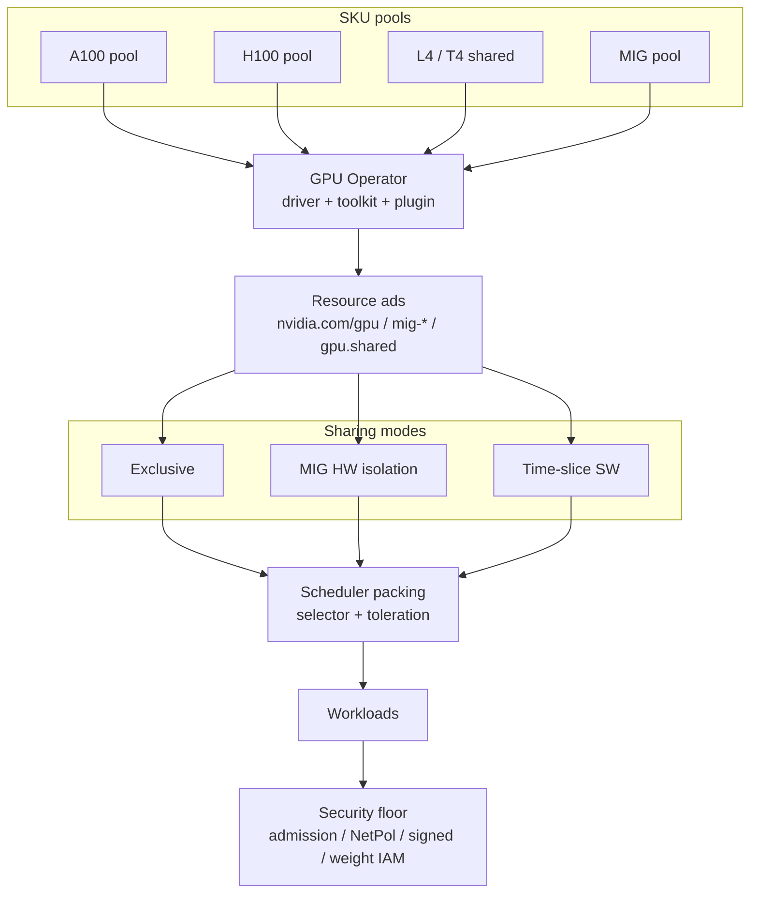

# Lesson 18 — AI/ML platform: GPU node pools, device plugins, MIG/time-slicing, SKU isolation

*2026-09-26*

## What interviewers are really probing

[Lesson 17](/lessons/17-systems-design-tradeoffs) previewed **heterogeneous SKUs and GPU tenancy** as tradeoff axes. This lesson is the **first deep AI/ML platform cut**: can you operate GPU capacity as **labeled, tainted, device-plugin-backed pools** — not “nodes that happen to have accelerators”?

Interviewers at hyperscale (and AI platforms fueled by [wafer-ai/gpu-perf-engineering-resources](https://github.com/wafer-ai/gpu-perf-engineering-resources)) want evidence you have **run GPU fleets under packing pressure and trust boundaries**:

- **SKU isolation as a pool contract** — A100 vs H100 vs L4 are different products; labels + taints + separate autoscaler min/max ([L3](/lessons/03-cluster-provisioning-lifecycle), [L4](/lessons/04-borg-mesos-orchestration), [L17](/lessons/17-systems-design-tradeoffs))
- **Device plugin vs GPU Operator** — who installs drivers, who advertises `nvidia.com/gpu` / `mig-*`, what breaks when the DaemonSet is unhealthy
- **MIG vs time-slicing vs exclusive** — hardware memory/fault isolation vs SW oversubscribe with **no** mem/fault isolation vs 1:1 ownership
- **RuntimeClass + container toolkit** — the `nvidia` runtime path; wrong RuntimeClass = silent CPU fallback or CrashLoop
- **Scheduler packing reality** — requests, tolerations, nodeSelectors; Pending forever is a pool-contract bug until proven otherwise
- **Autoscaling gotchas** — CA/NAP scales on pending GPU resources; MIG profile flips are drains; time-slice replicas fake headroom
- **Security floor on shared GPUs** — admission, NetPol, signed driver/workload images, weight IAM so a notebook on a shared L4 cannot read another tenant’s checkpoints ([L11](/lessons/11-cluster-security-pss-admission-rbac)–[L14](/lessons/14-ml-inference-training-deploy-hardening))

**Interview sentence:** “I treat GPUs as SKU pools with taints and labels, let the GPU Operator own the device stack, choose exclusive / MIG / time-slice by isolation need — never time-slice across trust boundaries — and keep admission, NetPol, signed images, and per-pool weight IAM on the floor.”

## Core diagram: SKU pools → plugin → resources → sharing modes → security floor




**Read it top-down:** **SKU pools** (labeled + tainted) feed the **NVIDIA GPU Operator** stack (driver, container toolkit, device plugin, GFD, DCGM). The plugin **advertises** `nvidia.com/gpu`, `nvidia.com/mig-*`, or `nvidia.com/gpu.shared`. You pick a **sharing mode** — exclusive (full GPU), MIG (HW memory/fault isolation), or time-slicing (SW replicas, no mem/fault isolation) — then the **scheduler** packs via nodeSelector/affinity + tolerations + RuntimeClass. Everything sits on a **security floor**: admission requiring SKU contracts, device-plugin RBAC, signed driver/workload images, NetworkPolicy on GPU namespaces, and WI/IRSA so weights never leak across tenants on shared nodes. Topology (NVLink/RDMA/NCCL) is Lesson 19 (upcoming) — preview only here.

## Idiosyncrasies / operator depth

### 1. GPU node pools are products, not instance types

| Contract piece | Operator practice | Footgun |
|---|---|---|
| **Labels** | `sku=h100`, `accelerator=nvidia-h100-80gb`, `pool=train-exclusive` | Relying only on `node.kubernetes.io/instance-type` (opaque to app teams) |
| **Taints** | `nvidia.com/gpu=true:NoSchedule` or `sku=h100:NoSchedule` | Untainted GPU nodes become free CPU capacity for junk Deployments |
| **Tolerations** | Required on every GPU Pod template (Helm values, Kyverno mutate) | One chart without toleration → Pending; “GPUs are broken” tickets |
| **Separate CA/NAP** | Per-pool min/max/spot policy | One mixed pool: H100 jobs land on L4 or block behind notebooks |
| **Golden image + SKU overlay** | One CIS baseline AMI; driver/ABI differences via Operator, not 12 AMIs ([L17](/lessons/17-systems-design-tradeoffs)) | Snowflake AMIs per SKU forever |

**Interview sentence:** “SKU isolation lives in labels, taints, and autoscaler pools — not in hoping the scheduler invents topology.”

### 2. NVIDIA device plugin vs GPU Operator

| Piece | Role | Gotcha |
|---|---|---|
| **k8s-device-plugin** | Ads `nvidia.com/gpu` (and MIG resources); allocates devices to pods | Alone does **not** install drivers or configure toolkit |
| **GPU Operator** | ClusterPolicy CRD → DaemonSets: driver, toolkit, device-plugin, GFD, DCGM, MIG manager | Privileged / hostPath by design on driver DS — gate who can edit ClusterPolicy |
| **GFD** | Labels product, memory, MIG capability, count | Stale labels after MIG flip until plugin/GFD restart |
| **Container toolkit** | Injects GPU devices into containers via RuntimeClass | Missing toolkit → pods schedule then fail to see `/dev/nvidia*` |
| **DCGM exporter** | Health + metrics for capacity/SEV | Metrics without alert on XID / ROW remap = flying blind |

Prefer **Operator-managed** stacks at fleet scale ([L3](/lessons/03-cluster-provisioning-lifecycle) lifecycle). Pin Operator/chart versions; treat driver upgrades as **drain waves** (Temporal saga territory from [L16](/lessons/16-temporal-argo-workflows)).

### 3. Exclusive vs MIG vs time-slicing

| Mode | Isolation | When it wins | When it loses |
|---|---|---|---|
| **Exclusive** | Full GPU to one pod | Training, SLO inference, unknown memory footprint | Density; idle H100s eating budget |
| **MIG** | HW partition: dedicated SM + memory + fault isolation | Multi-tenant inference on A100/H100; regulated tenants sharing a node | Profile rigidity; resize = drain; not all SKUs support MIG |
| **Time-slicing** | SW replicas; **no** memory or fault isolation | Dev notebooks, batch within **one trust domain** | Cross-tenant; production SLO; any OOM kills neighbors’ luck |

Operator truth from NVIDIA docs: time-slicing **trades** MIG’s memory/fault isolation for higher share counts. **Never** put hostile tenants on the same time-sliced GPU. GKE can combine MIG partitions with time-sharing **inside** a partition — still same-trust only ([L14](/lessons/14-ml-inference-training-deploy-hardening)).

**Interview sentence:** “Exclusive for train/SLO; MIG when multi-tenant needs HW walls; time-slice only inside one trust boundary — never as a security control.”

### 4. Resource names and what the scheduler actually sees

| Advertisement | Meaning |
|---|---|
| `nvidia.com/gpu` | Whole GPU (or time-sliced replica if config renames/overrides) |
| `nvidia.com/mig-1g.5gb`, `mig-2g.10gb`, … | MIG profiles (strategy `single` vs `mixed`) |
| `nvidia.com/gpu.shared` | Time-slice when `renameByDefault: true` |
| Allocatable vs capacity | Plugin may advertise replicas ≫ physical GPUs — **fake headroom** if apps ignore GPU memory |

Pods must **request** the exact resource name the pool ads. Requesting `nvidia.com/gpu` on a MIG-only node with strategy that hides whole GPUs → Pending.

### 5. RuntimeClass lockdown

```yaml
# Workloads must opt into nvidia runtime — do not make it cluster default for all pods
apiVersion: node.k8s.io/v1
kind: RuntimeClass
metadata:
  name: nvidia
handler: nvidia
```

Admission should **require** `runtimeClassName: nvidia` (or your org’s name) for any pod requesting GPU resources, and **forbid** privileged + hostPID combos except the Operator’s own DaemonSets ([L11](/lessons/11-cluster-security-pss-admission-rbac)).

### 6. Autoscaling gotchas (the pager at 2am)

| Symptom | Reality |
|---|---|
| Pending GPU pods, CA idle | Pod missing toleration / selector; CA never sees schedulable pending |
| CA scales wrong SKU | Node templates not labeled; NAP defaults to cheapest GPU |
| MIG config change “hangs” | Nodes need cordon/drain; in-place MIG reconfig is a lifecycle event |
| Time-slice “plenty of GPUs” then OOM | Replicas ≠ memory; enforce app-level GPU memory limits |
| Spot GPU reclaim mid-train | Checkpoint discipline + exclusive reserved pools for critical train ([L13](/lessons/13-ml-weights-checkpoint-hardening)) |

### 7. Compose with prior security lessons

GPU pools are where [L12](/lessons/12-node-container-hardening-supply-chain)–[L14](/lessons/14-ml-inference-training-deploy-hardening) become physical: signed images land on nodes that can read weight buckets. **Shared pools need stricter IAM and NetPol**, not looser — density is not an excuse to widen blast radius ([L1](/lessons/01-hyperscale-mental-model)).

## Concrete commands & config

### GKE-style GPU node pool (SKU + taint)

```bash
# Illustrative — separate pools per SKU
gcloud container node-pools create gpu-h100-exclusive \
  --cluster=cell-a --region=us-east1 \
  --machine-type=a3-highgpu-8g \
  --accelerator=type=nvidia-h100-80gb,count=8 \
  --num-nodes=0 --enable-autoscaling --min-nodes=0 --max-nodes=16 \
  --node-taints=sku=h100:NoSchedule,nvidia.com/gpu=true:NoSchedule \
  --node-labels=sku=h100,pool=train-exclusive,accelerator=nvidia-h100-80gb \
  --spot  # only if checkpointed; prefer on-demand for SLO train

gcloud container node-pools create gpu-l4-shared \
  --cluster=cell-a --region=us-east1 \
  --machine-type=g2-standard-8 \
  --accelerator=type=nvidia-l4,count=1,gpu-sharing-strategy=time-sharing,max-shared-clients-per-gpu=4 \
  --num-nodes=0 --enable-autoscaling --min-nodes=0 --max-nodes=32 \
  --node-taints=sku=l4-shared:NoSchedule \
  --node-labels=sku=l4,pool=interactive-shared,cloud.google.com/gke-gpu-sharing-strategy=time-sharing
```

### Helm: NVIDIA GPU Operator (sketch)

```bash
helm repo add nvidia https://helm.ngc.nvidia.com/nvidia && helm repo update
helm upgrade --install gpu-operator nvidia/gpu-operator \
  -n gpu-operator --create-namespace \
  --set driver.enabled=true \
  --set mig.strategy=mixed \
  --set devicePlugin.config.name=time-slicing-config \
  --set operator.defaultRuntime=containerd
```

### Device plugin time-slicing ConfigMap

```yaml
apiVersion: v1
kind: ConfigMap
metadata:
  name: time-slicing-config
  namespace: gpu-operator
data:
  any: |-
    version: v1
    sharing:
      timeSlicing:
        renameByDefault: true
        failRequestsGreaterThanOne: true
        resources:
          - name: nvidia.com/gpu
            replicas: 4
```

Label nodes that should apply it: `nvidia.com/device-plugin.config=any`. Keep **MIG pools on different nodes** with `nvidia.com/mig.config=all-balanced` (or your profile) — do not time-slice and MIG-chaos the same unlabeled pool.

### Workload: exclusive H100 train

```yaml
apiVersion: batch/v1
kind: Job
metadata:
  name: train-llama-cell-a
  namespace: model-training
spec:
  template:
    spec:
      runtimeClassName: nvidia
      serviceAccountName: weight-writer
      restartPolicy: OnFailure
      nodeSelector:
        sku: h100
        pool: train-exclusive
      tolerations:
        - key: sku
          value: h100
          effect: NoSchedule
        - key: nvidia.com/gpu
          value: "true"
          effect: NoSchedule
      containers:
        - name: trainer
          image: registry.example.com/ml/trainer@sha256:REPLACE
          resources:
            limits:
              nvidia.com/gpu: "8"
```

### Workload: MIG inference slice

```yaml
apiVersion: apps/v1
kind: Deployment
metadata:
  name: infer-small
  namespace: model-serving
spec:
  template:
    spec:
      runtimeClassName: nvidia
      serviceAccountName: weight-reader
      nodeSelector:
        sku: a100-mig
      tolerations:
        - key: sku
          value: a100-mig
          effect: NoSchedule
      containers:
        - name: server
          image: registry.example.com/ml/infer@sha256:REPLACE
          resources:
            limits:
              nvidia.com/mig-1g.5gb: "1"
```

### kubectl inventory (operator morning checks)

```bash
# Pool contract
kubectl get nodes -L sku,pool,accelerator,nvidia.com/gpu.product,nvidia.com/mig.capable

# What the plugin ads
kubectl describe node -l sku=h100 | sed -n '/Allocatable:/,/System Info:/p'
kubectl get cm -n gpu-operator time-slicing-config -o yaml

# Operator health
kubectl get pods -n gpu-operator -o wide
kubectl get clusterpolicies.nvidia.com
kubectl get runtimeclass

# Pending GPU truth
kubectl get pods -A -o custom-columns=NS:.metadata.namespace,N:.metadata.name,ST:.status.phase \
  | grep Pending
kubectl describe pod -n model-training TRAIN_POD | sed -n '/Events/,$p'

# DCGM / GPU feature labels
kubectl get nodes -l nvidia.com/gpu.count -o json \
  | jq '.items[] | {name:.metadata.name, labels:.metadata.labels | with_entries(select(.key|startswith("nvidia.com/")))}'
```

### Admission sketch: require SKU + RuntimeClass for GPU requests

```yaml
apiVersion: admissionregistration.k8s.io/v1
kind: ValidatingAdmissionPolicy
metadata:
  name: gpu-pool-contract
spec:
  failurePolicy: Fail
  matchConstraints:
    resourceRules:
      - apiGroups: [""]
        apiVersions: ["v1"]
        operations: ["CREATE", "UPDATE"]
        resources: ["pods"]
  validations:
    - expression: >
        !has(object.spec.containers) ||
        !object.spec.containers.exists(c,
          has(c.resources) && has(c.resources.limits) &&
          (c.resources.limits.exists(k, k.startsWith("nvidia.com/")))) ||
        (has(object.spec.runtimeClassName) && object.spec.runtimeClassName == "nvidia" &&
         has(object.spec.nodeSelector) && has(object.spec.nodeSelector.sku))
      message: "GPU pods require runtimeClassName=nvidia and nodeSelector.sku"
```

## Failures & fixes

| Symptom | Likely cause | Fix / mitigation |
|---|---|---|
| Pod Pending: `0/N nodes are available: insufficient nvidia.com/gpu` | Wrong resource name (gpu vs mig-* vs gpu.shared); pool at max; missing CA template | Match ads; scale pool; fix NAP SKU labels |
| Pod Pending: untolerated taint | Chart omitted tolerations | Kyverno mutate tolerations by namespace; golden Helm defaults |
| Scheduled but no `/dev/nvidia*` | Toolkit/RuntimeClass missing; wrong handler | Fix RuntimeClass; check toolkit DS; admission require `nvidia` |
| CrashLoop: driver mismatch | Node kernel vs driver container ABI | Pin Operator/driver; precompiled drivers; drain-wave upgrades |
| MIG resources missing after config | GFD/plugin not restarted; wrong `mig.strategy` | Verify `nvidia.com/mig.config`; restart plugin; use MIG manager |
| Time-slice OOM / XID storms | No mem isolation; hostile or unbounded apps | Split trust domains; prefer MIG; set app GPU memory limits |
| CA scales L4 for H100 Job | Shared autoscaler / unlabeled templates | Separate node pools + labels; NAP constraints per SKU |
| Notebook reads other tenant weights | Node SA / WI too broad on shared pool | Per-workload WI/IRSA; bucket IAM; never node-wide `s3:*` ([L13](/lessons/13-ml-weights-checkpoint-hardening)) |
| Privileged escape via GPU DS pattern | Tenants copy Operator securityContext | PSS restricted on tenant NS; only Operator NS allowed privileged |
| “GPU utilization low” with Pending train | Interactive shared pool starved exclusive capacity | Quotas + separate pools; fair-share queues (upcoming L20) |
| Drain stuck on GPU node | Long train without eviction budget | PDB + checkpoint; Temporal drain saga ([L16](/lessons/16-temporal-argo-workflows)) |

## Security & hardening

**GPU nodes are high-value targets:** they hold model weights in memory/disk cache, run privileged device stacks, and often share physical accelerators across teams. Soft density without a floor is how you get cross-tenant weight theft and driver-level escapes.

| Control | Why | Practice |
|---|---|---|
| **SKU pool isolation** | Blast walls between train / serve / interactive ([L14](/lessons/14-ml-inference-training-deploy-hardening)) | Separate pools + taints; no default-scheduler freeloading on GPU nodes |
| **Admission requires sku + RuntimeClass** | Stops accidental or malicious GPU scheduling | ValidatingAdmissionPolicy / Kyverno; deny `:latest`; digest pins ([L12](/lessons/12-node-container-hardening-supply-chain)) |
| **Device plugin / Operator RBAC** | ClusterPolicy edit ≈ fleet GPU root | Least privilege; break-glass only; audit ClusterPolicy changes |
| **Privileged / device access** | Driver DS needs privilege; **tenants must not** | PSS `restricted` on `model-*` NS; allow privileged only in `gpu-operator` |
| **Signed driver + toolkit + workload images** | Compromised GPU stack = host compromise | Cosign verify; private registry; SBOM for Operator charts ([L12](/lessons/12-node-container-hardening-supply-chain)) |
| **RuntimeClass lockdown** | Prevents silent non-GPU runtimes and host escape paths | Named `nvidia` RuntimeClass; admission-enforced for GPU resource requests |
| **No cross-tenant weight access on shared GPUs** | Time-slice/MIG density ≠ shared IAM | Per-pod WI/IRSA; bucket IAM + CMEK; separate reader/writer SAs ([L13](/lessons/13-ml-weights-checkpoint-hardening)) |
| **NetworkPolicy on GPU namespaces** | Exfil of weights / pivot to train | Default-deny; allow private registry + weight VPC endpoints only ([L9](/lessons/09-networkpolicy-multi-nic-sflow), [L14](/lessons/14-ml-inference-training-deploy-hardening)) |
| **Secrets / WI-IRSA for pulls onto GPU nodes** | Long-lived keys on GPU nodes are standing incidents | External Secrets / CSI; short-lived tokens; never HF tokens in images |
| **PSS + no hostPath for tenants** | hostPath + GPU ≈ host | Deny hostPath/hostNetwork/privileged for tenant GPU pods |
| **Time-slicing trust rule** | No mem/fault isolation | **Same trust boundary only**; regulated / prod → MIG or exclusive |
| **Shared vs dedicated pools** | Shared interactive pools still pull private weights | Dedicated train/serve pools for prod weights; shared pools use scrubbed/public fixtures or tightly scoped IAM |

### AI/ML weight & registry hardening on GPU pools (required)

| Scenario | Weight / registry controls |
|---|---|
| **Dedicated exclusive train pool** | Writer SA + CMEK bucket; signed checkpoints; node pulls via WI only; no public HF |
| **MIG multi-tenant serve** | Per-tenant reader SA; digest-pinned model refs; NetPol per NS; no shared emptyDir for weights across pods |
| **Time-sliced interactive** | Prefer non-prod weights; if prod-like, **per-user IAM** + short TTL; never node instance role with broad `s3:GetObject` |
| **All pools** | Private registry for runtime + model images; cosign; admission blocks unsigned; provenance attestations on promote ([L12](/lessons/12-node-container-hardening-supply-chain)/[L13](/lessons/13-ml-weights-checkpoint-hardening)) |

```yaml
# Sketch: shared GPU NS still gets the floor
apiVersion: policy.platform/v1
kind: GpuPoolGate
metadata:
  name: gpu-floor
spec:
  match:
    nodeSelectorKeys: ["sku"]
  require:
    runtimeClass: nvidia
    imageDigestPin: true
    cosignVerify: true
    podSecurity: restricted
    networkPolicy: deny-by-default
    weightBucketPublicAccess: false
    cmek: true
    workloadIdentity: true
    timeSliceSameTrustOnly: true
    forbidNodeWideObjectIAM: true
```

**Punchline:** MIG gives hardware walls; time-slicing does not. **IAM, admission, NetPol, and signing** are what stop a shared L4 notebook from becoming a weight exfil path — SKU taints alone are not enough.

## Interview soundbites

- **“GPUs are SKU pools with taints — not unlabeled capacity.”**
- **“Operator owns the device stack; the plugin only ads what the Operator configured.”**
- **“Exclusive for train/SLO; MIG for HW multi-tenant; time-slice only inside one trust domain.”**
- **“Time-slicing is density, not isolation — no mem, no fault walls.”**
- **“Pending GPU pods are a pool-contract bug until proven otherwise.”**
- **“MIG profile changes are drains, not ConfigMap daydreams.”**
- **“Replicas inflate allocatable; GPU memory is still finite.”**
- **“RuntimeClass nvidia is required, not decorative.”**
- **“Tenant NS stays PSS restricted — only gpu-operator may be privileged.”**
- **“Per-pod WI/IRSA for weights; never a node-wide models:* role on shared pools.”**
- **“Golden OS baseline; heterogeneity in labels and device plugins.”**
- **“Next: topology — NVLink, RDMA, NCCL — packing without fabric is half a design.”**

## How this maps to the JD

Hyperscale + AI/ML platform JDs that mention **GPU fleets, inference/training, and 10K+ nodes** are asking whether you can **productize accelerators**: pools, device plugins, sharing modes, and security. This lesson connects [L1](/lessons/01-hyperscale-mental-model)/[L3](/lessons/03-cluster-provisioning-lifecycle)/[L4](/lessons/04-borg-mesos-orchestration) (cells, lifecycle, Borg packing instincts), [L11](/lessons/11-cluster-security-pss-admission-rbac)–[L14](/lessons/14-ml-inference-training-deploy-hardening) (admission, supply chain, weights, deploy isolation), [L15](/lessons/15-terraform-atlantis-fleet-scale) (pool IaC), and [L17](/lessons/17-systems-design-tradeoffs) (SKU vs golden image) into an **operator-ready GPU pool story**. Fuel: [wafer-ai/gpu-perf-engineering-resources](https://github.com/wafer-ai/gpu-perf-engineering-resources). **Next up — Lesson 19:** GPU topology (NVLink/NVSwitch, multi-NIC RDMA, GPUDirect, NCCL) so packing respects the fabric, not just the resource name.

## Watch (talks & demos)

Real talks — watch after Failures & fixes.

### Mastering GPU Management in Kubernetes Using the Operator Pattern (Shiva Krishna Merla & Kevin Klues, NVIDIA / KubeCon)

End-to-end GPU Operator lifecycle: drivers, toolkit, device plugin, MIG/MPS profiles, monitoring — the operator depth behind ClusterPolicy and fleet GPU stacks.

<iframe width="100%" height="360" src="https://www.youtube.com/embed/jbpIFCkEEng" title="Mastering GPU Management in Kubernetes Using the Operator Pattern - NVIDIA" frameBorder="0" allow="accelerometer; autoplay; clipboard-write; encrypted-media; gyroscope; picture-in-picture; web-share" allowFullScreen></iframe>

[Open on YouTube](https://www.youtube.com/watch?v=jbpIFCkEEng)

### A Deep Dive on Supporting Multi-Instance GPUs in Containers and Kubernetes (Kevin Klues, NVIDIA)

How MIG is exposed to containers and Kubernetes, resource naming, and lifecycle of MIG devices on a node — essential before you promise “multi-tenant A100” in an interview.

<iframe width="100%" height="360" src="https://www.youtube.com/embed/xNY9cbaLuGk" title="Deep Dive on Supporting Multi-Instance GPUs in Containers and Kubernetes - Kevin Klues" frameBorder="0" allow="accelerometer; autoplay; clipboard-write; encrypted-media; gyroscope; picture-in-picture; web-share" allowFullScreen></iframe>

[Open on YouTube](https://www.youtube.com/watch?v=xNY9cbaLuGk)

### Scaling GPU Clusters Without Melting Down (Alay Patel & Ryan Hallisey, NVIDIA / KubeCon EU 2025)

Control-plane cost of large GPU fleets, scheduler/apiserver pressure, KWOK simulation, and DRA direction — why GPU scale is a **platform** problem, not only a device-plugin problem.

<iframe width="100%" height="360" src="https://www.youtube.com/embed/dUfp3j1j-mg" title="Scaling GPU Clusters Without Melting Down - NVIDIA KubeCon EU 2025" frameBorder="0" allow="accelerometer; autoplay; clipboard-write; encrypted-media; gyroscope; picture-in-picture; web-share" allowFullScreen></iframe>

[Open on YouTube](https://www.youtube.com/watch?v=dUfp3j1j-mg)

## References

- [NVIDIA GPU Operator docs](https://docs.nvidia.com/datacenter/cloud-native/gpu-operator/latest/index.html) · [Time-slicing GPUs](https://docs.nvidia.com/datacenter/cloud-native/gpu-operator/latest/gpu-sharing.html) · [MIG with Kubernetes](https://docs.nvidia.com/datacenter/cloud-native/gpu-operator/latest/gpu-operator-mig.html)
- [NVIDIA k8s-device-plugin](https://github.com/NVIDIA/k8s-device-plugin) · [GPU Feature Discovery](https://github.com/NVIDIA/gpu-feature-discovery)
- [GKE GPU time-sharing](https://cloud.google.com/kubernetes-engine/docs/how-to/timesharing-gpus) · [GKE GPU sharing concepts](https://cloud.google.com/kubernetes-engine/docs/concepts/timesharing-gpus) · [GKE MIG](https://cloud.google.com/kubernetes-engine/docs/how-to/gpus#mig)
- [Kubernetes Device Plugins](https://kubernetes.io/docs/concepts/extend-kubernetes/compute-storage-net/device-plugins/) · [RuntimeClass](https://kubernetes.io/docs/concepts/containers/runtime-class/)
- [wafer-ai/gpu-perf-engineering-resources](https://github.com/wafer-ai/gpu-perf-engineering-resources) — GPU fleets / topology / serving fuel
- Prior: [17 — Systems design tradeoffs](/lessons/17-systems-design-tradeoffs) · [15 — Terraform / Atlantis](/lessons/15-terraform-atlantis-fleet-scale) · [14 — ML deploy hardening](/lessons/14-ml-inference-training-deploy-hardening) · [13 — ML weights](/lessons/13-ml-weights-checkpoint-hardening) · [12 — Node/container hardening](/lessons/12-node-container-hardening-supply-chain) · [11 — Cluster security](/lessons/11-cluster-security-pss-admission-rbac) · [04 — Borg/Mesos](/lessons/04-borg-mesos-orchestration) · [03 — Cluster provisioning](/lessons/03-cluster-provisioning-lifecycle) · [01 — Hyperscale mental model](/lessons/01-hyperscale-mental-model)
- Next: **Lesson 19 — GPU topology (NVLink/NVSwitch, multi-NIC RDMA, GPUDirect, NCCL)**

## Quick self-check

Out loud, in under two minutes:

1. What labels and taints define a GPU SKU pool — and what happens if you skip the taint?
2. What does the GPU Operator manage that the device plugin alone does not?
3. Compare exclusive vs MIG vs time-slicing on memory isolation, fault isolation, and trust.
4. Why can time-slice “allocatable GPUs” look healthy while training OOMs?
5. Name three admission / IAM controls that must hold on a **shared** GPU pool when pods pull model weights.
6. What breaks if a GPU pod omits `runtimeClassName: nvidia` or the matching SKU toleration?
