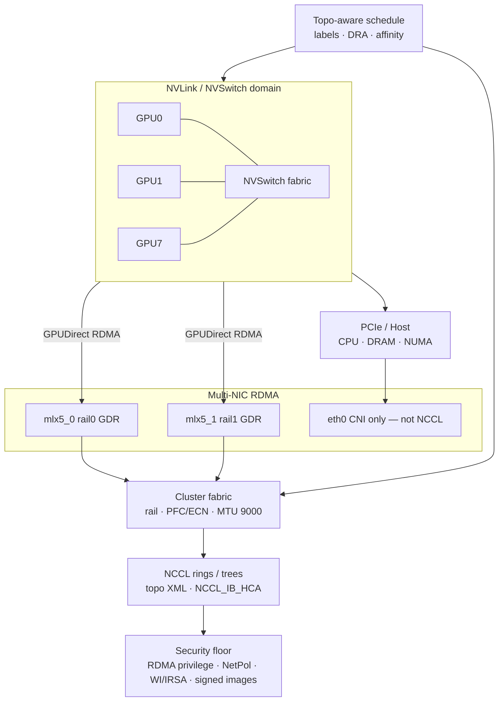

# Lesson 19 — AI/ML platform: GPU topology — NVLink/NVSwitch, multi-NIC RDMA, GPUDirect, NCCL

*2026-09-27*

## What interviewers are really probing

[Lesson 18](/lessons/18-gpu-node-pools-mig-timeslicing) productized GPUs as **SKU pools**. This lesson asks the next operator question: can you **pack those GPUs without fabric awareness** — or do you treat **NVLink domains, RDMA rails, and NCCL topology** as first-class capacity?

Interviewers at hyperscale AI platforms (fuel: [wafer-ai/gpu-perf-engineering-resources](https://github.com/wafer-ai/gpu-perf-engineering-resources)) want evidence you have **debugged silent 10× slowdowns**, not only “8× `nvidia.com/gpu` Pending”:

- **Packing without fabric awareness** — scheduler sees GPUs; NCCL sees NVLink vs PCIe hops and which RDMA NIC is actually wired ([L1](/lessons/01-hyperscale-mental-model), [L4](/lessons/04-borg-mesos-orchestration))
- **NVLink vs PCIe** — intra-node peer bandwidth; commodity PCIe boxes ≠ HGX/DGX NVSwitch domains
- **NVSwitch domains** — all-to-all GPU fabric inside a node (or multi-node NVLink / ComputeDomain on NVL racks)
- **Multi-NIC RDMA (RoCE / InfiniBand)** — rail-aligned NICs; why **eth0-only CNI kills training** ([L9](/lessons/09-networkpolicy-multi-nic-sflow), [L8](/lessons/08-cni-cilium-ebpf))
- **GPUDirect RDMA / Storage** — NIC DMA into GPU HBM (GDR) and storage paths (GDS); host bounce buffers as the silent tax
- **NCCL topology discovery** — rings vs trees vs NVLS; `NCCL_DEBUG`, topology XML, `NCCL_IB_HCA`
- **Topology-aware scheduling** — labels, affinity, DRA / ComputeDomain; anti-affinity that **destroys** bandwidth; gang/queues preview → Lesson 20 upcoming
- **Security floor on fast paths** — RDMA privilege, fabric isolation, weight IAM on topology nodes ([L11](/lessons/11-cluster-security-pss-admission-rbac)–[L14](/lessons/14-ml-inference-training-deploy-hardening))

**Interview sentence:** “I treat NVLink domains and RDMA rails as capacity — labels and affinity pack ranks into the fabric, NCCL env pins the right HCAs, GPUDirect avoids host bounce, and I never open node-wide weight IAM or hostNetwork just because the train fabric is fast.”

## Core diagram: GPUs ↔ NVLink → host/PCIe → RDMA NICs → fabric → NCCL → security floor




**Read it top-down:** An **NVLink/NVSwitch domain** (HGX/DGX/NVL) gives GPUs a fast all-to-all path. Traffic that leaves the domain hits **PCIe/host** (NUMA hops) unless **GPUDirect RDMA** lets the NIC DMA GPU HBM directly. **Multi-NIC RDMA** (RoCE/IB rails) carries inter-node collectives; **eth0** is for the pod CNI — not NCCL. The **cluster fabric** (rail alignment, PFC/ECN, jumbo MTU) either keeps rings local or silently stripes them across racks/AZs. **NCCL** discovers topology, builds rings/trees, and is pinned with env vars. **Topology-aware scheduling** (labels, affinity, DRA) decides whether packing respects the fabric. Everything sits on a **security floor**: RDMA device privilege lockdown, separate train vs inference fabrics, WI/IRSA + CMEK for weights on topology nodes, signed NCCL/CUDA/driver images, admission on privileged RDMA pods.

## Idiosyncrasies / operator depth

### 1. NVLink / NVSwitch vs PCIe hops

| Path | What you get | Operator truth |
|---|---|---|
| **NVLink + NVSwitch** (HGX/DGX) | Full-mesh / high-BW GPU↔GPU inside the domain | `nvidia-smi topo -m` shows NV# / NVSwitch; NCCL prefers P2P here |
| **NVLink bridge pairs** (some commodity) | Fast pairs, slow cross-pair | “8 GPU node” ≠ one domain — rings may bounce PCIe |
| **PCIe only** | Host root-complex hops | Fine for inference fan-out; painful for large all-reduce |
| **Multi-node NVLink (MNNVL)** | Rack-scale domains (e.g. NVL72) | Needs IMEX / ComputeDomain / DRA — not just device plugin ads ([NVIDIA DRA GPU docs](https://docs.nvidia.com/datacenter/cloud-native/gpu-operator/latest/dra-cds.html)) |

**Interview sentence:** “I read `nvidia-smi topo` before I believe an 8-GPU SKU is one NVLink domain — PCIe hops inside a ‘GPU node’ are a packing bug waiting to page.”

### 2. Multi-NIC RDMA / GPUDirect — why eth0-only CNI kills training

| Piece | Role | Footgun |
|---|---|---|
| **RoCE / IB HCAs** | RDMA verbs for NCCL inter-node | Using the wrong NIC → TCP fallback or wrong rail |
| **GPUDirect RDMA (GDR)** | NIC DMA ↔ GPU HBM; skip host bounce | Needs `nvidia-peermem` / DMA-BUF; NUMA distance + `NCCL_NET_GDR_LEVEL` |
| **GPUDirect Storage (GDS)** | Storage↔GPU paths for checkpoints / datasets | Different stack than GDR; still needs least-privilege device access ([L13](/lessons/13-ml-weights-checkpoint-hardening)) |
| **Secondary network (NAD / Multus)** | Attach RDMA netdev to train pods ([L9](/lessons/09-networkpolicy-multi-nic-sflow)) | eth0-only CNI: NCCL never sees mlx5_* → hang or abysmal BW |
| **Rail alignment** | Rank *i* prefers NIC *i* | Misaligned rails = incast / congestion even with “enough” BW |

Cloud fabric lessons ([L5](/lessons/05-cloud-networking-vpc-tgw)/[L6](/lessons/06-cloud-interconnect-nat-bgp)) still apply: VPC MTU, sticky routes, and interconnect choice show up as NCCL timeouts if ignored.

**Interview sentence:** “Training pods get a dedicated RDMA interface via Multus/NAD; eth0 stays for kubelet/CNI — if NCCL lands on eth0, the job is already broken.”

### 3. NCCL env, topology XML, rings vs trees

| Knob | Why operators care |
|---|---|
| `NCCL_DEBUG=INFO` / `TRACE` | First page of every hang ticket — shows chosen graph, NIC, GDR |
| `NCCL_TOPO_DUMP_FILE` / XML | Capture discovered topology; compare across nodes in a Job |
| `NCCL_IB_HCA` / `NCCL_SOCKET_IFNAME` | Pin HCAs / exclude eth0 |
| `NCCL_NET_GDR_LEVEL` | How far GDR is allowed across PCIe/NUMA |
| `NCCL_P2P_LEVEL` / `NCCL_ALGO` | P2P depth; Ring vs Tree selection (size-dependent) |
| `NCCL_IB_DISABLE=1` | Emergency TCP — proves fabric vs app, never leave on in prod |
| Rings vs trees | Rings BW-friendly for large messages; trees often win latency / larger scales; NVLS when NVLink Switch features apply |

**Interview sentence:** “I debug NCCL with DEBUG=INFO and a topo dump before I blame PyTorch — most ‘framework hangs’ are wrong NIC, GDR off, or ranks striped across racks.”

### 4. Topology labels, DRA, scheduler hints (preview L20)

| Mechanism | Use |
|---|---|
| **Node labels** | `sku`, `rack`, `block`, `nvlink-domain`, `rdma-rail-count` via GFD + your own inventory |
| **Pod affinity** | Pack multi-GPU / multi-pod jobs into same rack/block |
| **Anti-affinity** | Great for HA inference; **toxic** for train ranks that need NVLink/RDMA locality |
| **DRA / ComputeDomain** | Claim topology-aware GPU (+ MNNVL) resources instead of opaque `nvidia.com/gpu` counts |
| **Volcano / Kueue gang** | All-or-nothing admission so you don’t half-schedule a job across bad topology — **Lesson 20** |

**Interview sentence:** “Topology labels make the fabric schedulable; gang scheduling makes it atomic — affinity without gang still leaves you with half a ring on a slow rack.”

### 5. Stripe across racks / AZs = silent 10× slowdown

| Mistake | Symptom | Reality |
|---|---|---|
| Default-scheduler spreads pods | Job “runs” but step time explodes | Cross-rack BW ≪ NVLink / local RDMA |
| AZ-aware anti-affinity on train | “HA training” | Collectives become WAN-ish; checkpoints become the reliability story instead |
| Mixed SKU domains in one Job | NCCL graph weirdness / fallback | Isolate SKUs ([L18](/lessons/18-gpu-node-pools-mig-timeslicing)); don’t invent a hybrid ring |
| Ignoring PFC/ECN/MTU | Flaky RoCE, PFC storms | Fabric ops is part of GPU ops — not “someone else’s network” ([L8](/lessons/08-cni-cilium-ebpf)) |

**Interview sentence:** “If step time regresses after a reschedule with the same GPU count, I assume topology first — racks and rails, not CUDA kernels.”

## Concrete commands & config

### Inventory: topology on the node

```bash
# Intra-node GPU / NIC topology matrix
nvidia-smi topo -m
nvidia-smi nvlink -s
nvidia-smi nvlink -e   # error counters — non-zero is a page

# RDMA devices & link
ibstatus 2>/dev/null || rdma link show
ibdev2netdev
ethtool -i eth1
ethtool -l eth1   # combined queues; often pinned per NUMA

# Is peermem available for GDR?
lsmod | grep -E 'nvidia_peermem|ib_core'
dmesg | grep -i -E 'peermem|gdr' | tail
```

### kubectl: labels, RDMA plugin, NAD

```bash
# Topology labels you should see / enforce
kubectl get nodes -l sku=h100 \
  -L sku,rack,block,nvlink-domain,rdma-rail-count,nvidia.com/gpu.product

# RDMA device plugin / SR-IOV resources (illustrative names)
kubectl describe node GPU_NODE | sed -n '/Allocatable:/,/System Info:/p' | grep -iE 'rdma|mlx|pci'

# Multus NetworkAttachmentDefinition for train fabric
kubectl get net-attach-def -A
kubectl get pods -n model-training -o jsonpath='{range .items[*]}{.metadata.name}{"\t"}{.metadata.annotations.k8s\.v1\.cni\.cncf\.io/networks}{"\n"}{end}'
```

```yaml
# Sketch: secondary RDMA network for train pods (Multus)
apiVersion: k8s.cni.cncf.io/v1
kind: NetworkAttachmentDefinition
metadata:
  name: rdma-train-rail
  namespace: model-training
spec:
  config: '{
    "cniVersion": "0.3.1",
    "type": "host-device",
    "device": "eth1",
    "ipam": { "type": "whereabouts", "range": "192.168.100.0/24" }
  }'
---
# RDMA shared-device plugin resource (pattern — pin to your plugin)
# Ads something like rdma/rdma_shared_device_a on nodes with mlx5_*
```

### Job with topology constraints + NCCL env

```yaml
apiVersion: v1
kind: ConfigMap
metadata:
  name: nccl-train-env
  namespace: model-training
data:
  NCCL_DEBUG: "INFO"
  NCCL_IB_HCA: "=mlx5_0,mlx5_1,mlx5_2,mlx5_3"
  NCCL_SOCKET_IFNAME: "eth1"
  NCCL_NET_GDR_LEVEL: "5"
  NCCL_P2P_LEVEL: "SYS"
  NCCL_IB_DISABLE: "0"
  NCCL_TOPO_DUMP_FILE: "/tmp/nccl_topo.xml"
---
apiVersion: batch/v1
kind: Job
metadata:
  name: train-topo-aware
  namespace: model-training
spec:
  parallelism: 4
  completions: 4
  template:
    metadata:
      annotations:
        k8s.v1.cni.cncf.io/networks: rdma-train-rail
      labels:
        app: train-topo
        trust-domain: train-prod
    spec:
      runtimeClassName: nvidia
      serviceAccountName: weight-writer
      restartPolicy: OnFailure
      nodeSelector:
        sku: h100
        pool: train-exclusive
        # Pack into one fabric island
        block: cell-a-block-3
      affinity:
        podAffinity:
          requiredDuringSchedulingIgnoredDuringExecution:
            - labelSelector:
                matchLabels:
                  app: train-topo
              topologyKey: topology.kubernetes.io/zone  # tighten to rack label in prod
        # Do NOT spread train ranks with podAntiAffinity on rack
      tolerations:
        - key: sku
          value: h100
          effect: NoSchedule
        - key: nvidia.com/gpu
          value: "true"
          effect: NoSchedule
      containers:
        - name: trainer
          image: registry.example.com/ml/trainer@sha256:REPLACE
          envFrom:
            - configMapRef:
                name: nccl-train-env
          securityContext:
            allowPrivilegeEscalation: false
            capabilities:
              add: ["IPC_LOCK"]   # often required for RDMA reg; still not privileged
              drop: ["ALL"]
          resources:
            limits:
              nvidia.com/gpu: "8"
              # rdma/rdma_shared_device_a: "1"   # if using RDMA device plugin
          volumeMounts:
            - name: dshm
              mountPath: /dev/shm
      volumes:
        - name: dshm
          emptyDir:
            medium: Memory
            sizeLimit: 16Gi
```

### nccl-tests smoke (operator acceptance)

```bash
# Inside a topology-correct Job / debug pod with RDMA + GPUs
export NCCL_DEBUG=INFO NCCL_IB_HCA==mlx5_0,mlx5_1
./build/all_reduce_perf -b 8 -e 2G -f 2 -g 8
# Compare busbw to node SKU expectations; cliff = wrong NIC / no GDR / cross-rack

# Capture topo for the postmortem bundle
ls -l /tmp/nccl_topo.xml
```

### Admission sketch: RDMA pods are not free privilege

```yaml
apiVersion: admissionregistration.k8s.io/v1
kind: ValidatingAdmissionPolicy
metadata:
  name: rdma-train-floor
spec:
  failurePolicy: Fail
  matchConstraints:
    resourceRules:
      - apiGroups: [""]
        apiVersions: ["v1"]
        operations: ["CREATE", "UPDATE"]
        resources: ["pods"]
  validations:
    - expression: >
        !has(object.metadata.annotations) ||
        !has(object.metadata.annotations["k8s.v1.cni.cncf.io/networks"]) ||
        object.metadata.annotations["k8s.v1.cni.cncf.io/networks"] != "rdma-train-rail" ||
        (has(object.spec.serviceAccountName) &&
         object.spec.serviceAccountName != "default" &&
         has(object.spec.runtimeClassName) &&
         object.spec.runtimeClassName == "nvidia" &&
         !(has(object.spec.hostNetwork) && object.spec.hostNetwork) &&
         has(object.spec.nodeSelector) &&
         has(object.spec.nodeSelector.sku))
      message: "RDMA train pods require nvidia RuntimeClass, non-default SA, sku selector; hostNetwork forbidden"
```

## Failures & fixes

| Symptom | Likely cause | Fix / mitigation |
|---|---|---|
| NCCL hang at init / watchdog abort | Wrong NIC; eth0 only; IB verbs blocked; MTU mismatch | Pin `NCCL_IB_HCA` + Multus RDMA; verify `ibstatus`; align MTU 9000 end-to-end |
| Busbw ~TCP / host NIC speeds | GDR off; peermem missing; `NCCL_NET_GDR_LEVEL` too low | Load `nvidia-peermem`; raise GDR level; confirm GPU↔NIC topo |
| Job “healthy” but 5–10× slower after reschedule | Ranks striped across racks/AZs | Required affinity on `rack`/`block`; forbid train anti-affinity on zone |
| `nvidia-smi topo` shows SYS between GPUs you expected NV# | Not an NVSwitch domain; PCIe fallback | Don’t sell as HGX-equivalent; adjust rings / SKU pool |
| RoCE flaps / PFC storm | Lossless config drift; ECN mis-set; noisy neighbor | Fabric runbook ([L8](/lessons/08-cni-cilium-ebpf)); isolate train VRF/VLAN |
| Mixed A100+H100 in one process group | Scheduler ignored SKU | Pool taints ([L18](/lessons/18-gpu-node-pools-mig-timeslicing)); admission require `sku` |
| Pending: RDMA resource missing | Device plugin / SR-IOV VF exhaustion | Cap concurrent train Jobs; separate inference from train VFs |
| Checkpoint I/O tanks step time | No GDS / saturated eth0 path for weights | Separate data path; GDS where supported; WI to CMEK bucket ([L13](/lessons/13-ml-weights-checkpoint-hardening)) |
| Security finding: hostNetwork train pods | Shortcut to “see” RDMA | NAD + device plugin; deny hostNetwork in admission |
| Tenant inference pod on train rail | Shared CNI / open NetPol | Separate NAD/VRF; default-deny; allowlist train NS only ([L9](/lessons/09-networkpolicy-multi-nic-sflow), [L14](/lessons/14-ml-inference-training-deploy-hardening)) |
| Weight exfil from topo node | Node instance role broad because “GDR nodes need storage” | Per-pod WI/IRSA; never node-wide `s3:*` / `gs://*` |

## Security & hardening

**Fast fabrics amplify blast radius.** GPUDirect and RDMA put device memory and NIC DMA on paths that traditionally needed privilege. Topology nodes also **pull model weights** — do not trade IAM for bandwidth.

| Control | Why | Practice |
|---|---|---|
| **RDMA / GPUDirect privilege** | Memory registration wants `CAP_IPC_LOCK`; VFIO / device plugins expose `/dev/infiniband/*` | Add **only** needed caps; **forbid** `privileged` + `hostNetwork` for tenants; Operator/device-plugin NS is the exception ([L11](/lessons/11-cluster-security-pss-admission-rbac)) |
| **Device access lockdown** | Shared RDMA devices ≈ shared DMA | RDMA device plugin with resource quota; no raw hostPath to ib devices for notebooks |
| **Isolate train vs inference fabrics** | Inference tenants must not snoop / DoS train rails | Separate CNI/NAD/VRF/VLAN; NetworkPolicy default-deny across trust domains ([L9](/lessons/09-networkpolicy-multi-nic-sflow), [L14](/lessons/14-ml-inference-training-deploy-hardening)) |
| **NetPol on GPU namespaces** | Weights and gradients on the wire | Allow DNS + private registry + weight VPC endpoints + RDMA fabric; deny east-west to interactive NS |
| **Weights on topology-aware nodes** | Train nodes still download checkpoints | **WI/IRSA per workload**; CMEK buckets; signed digests; private registries — **never** widen node-wide IAM “because train nodes need GDR” ([L13](/lessons/13-ml-weights-checkpoint-hardening)) |
| **Signing / provenance for NCCL·CUDA·driver images** | Compromised collective stack = host/GPU compromise | Cosign verify; pin digests; SBOM on GPU Operator + train images ([L12](/lessons/12-node-container-hardening-supply-chain)) |
| **Admission on privileged RDMA pods** | Copy-paste from GPU Operator is the classic escape | ValidatingAdmissionPolicy / Kyverno; PSS restricted on `model-*`; break-glass only in `gpu-operator` / `rdma-system` |
| **Secrets for registry / HF** | Long-lived tokens on GPU nodes | External Secrets / CSI; short-lived OIDC; **no HF tokens in images** |
| **IMEX / MNNVL domains** | Multi-node NVLink memory export is a trust boundary | Scoped ComputeDomains per Job; tear down with the gang; don’t leave rack-wide open import |

### AI/ML weight & registry hardening on topology nodes (required)

| Scenario | Weight / registry controls |
|---|---|
| **Exclusive NVLink train pool** | Writer SA + CMEK; digest-pinned trainer image; WI only — GDR does **not** imply node object-store admin |
| **Multi-rail RDMA Job** | Same IAM as single-rail; fabric speed ≠ storage IAM; checkpoint path via GDS/WI still least privilege |
| **Shared interactive near train racks** | Different NAD; no train-rail attachment; scrubbed weights or per-user short TTL IAM |
| **All topology nodes** | Private registry for CUDA/NCCL/runtime; cosign; admission blocks unsigned; provenance on promote ([L12](/lessons/12-node-container-hardening-supply-chain)/[L13](/lessons/13-ml-weights-checkpoint-hardening)) |

```yaml
# Sketch: topology floor — fast path, narrow trust
apiVersion: policy.platform/v1
kind: GpuTopologyGate
metadata:
  name: topo-floor
spec:
  match:
    nodeSelectorKeys: ["nvlink-domain", "rdma-rail-count"]
  require:
    runtimeClass: nvidia
    imageDigestPin: true
    cosignVerify: true
    podSecurity: restricted
    hostNetwork: false
    rdmaViaNADOrDevicePlugin: true
    capabilitiesAllowed: ["IPC_LOCK"]
    networkPolicy: deny-by-default
    trainFabricNetPolIsolation: true
    weightBucketPublicAccess: false
    cmek: true
    workloadIdentity: true
    forbidNodeWideObjectIAM: true
    hfTokensInImages: false
```

**Punchline:** GPUDirect and NVLink are **performance** features. **IAM, admission, NetPol, and signed images** are what stop a topology node from becoming a weight exfil or DMA trampoline — fabric labels alone are not a security boundary.

## Interview soundbites

- **“GPUs without topology are half a capacity plan.”**
- **“Read `nvidia-smi topo` — NVSwitch domains aren’t marketing.”**
- **“eth0 is for the CNI; NCCL rides RDMA rails via Multus/NAD.”**
- **“GPUDirect skips the host bounce; peermem + GDR level make or break busbw.”**
- **“NCCL_DEBUG=INFO before you blame PyTorch.”**
- **“Anti-affinity that spreads train ranks across AZs is a self-inflicted 10×.”**
- **“Pack NVLink domains; gang-schedule so you don’t half-place a ring.”**
- **“RoCE needs PFC/ECN/MTU discipline — GPU ops owns the fabric story with netops.”**
- **“CAP_IPC_LOCK ≠ privileged ≠ hostNetwork.”**
- **“Never widen node IAM because the node has GDR.”**
- **“Train fabric and inference fabric are different trust zones.”**
- **“Next: gang, Kueue/Volcano, fair-share — topology-aware admission at queue time.”**

## How this maps to the JD

Hyperscale + AI/ML platform JDs that mention **GPU fleets, distributed training, and high-speed interconnects** are asking whether you can **operate the fabric under the GPUs**: NVLink/NVSwitch, multi-NIC RDMA, GPUDirect, NCCL, and topology-aware placement — with the same security bar as any other cell. This lesson extends [L18](/lessons/18-gpu-node-pools-mig-timeslicing) (pools) with [L8](/lessons/08-cni-cilium-ebpf)/[L9](/lessons/09-networkpolicy-multi-nic-sflow) (CNI, multi-NIC, NetPol), [L5](/lessons/05-cloud-networking-vpc-tgw)/[L6](/lessons/06-cloud-interconnect-nat-bgp) (cloud fabric), [L11](/lessons/11-cluster-security-pss-admission-rbac)–[L14](/lessons/14-ml-inference-training-deploy-hardening) (admission, supply chain, weights, deploy isolation), and [L1](/lessons/01-hyperscale-mental-model)/[L4](/lessons/04-borg-mesos-orchestration) (fleet packing instincts). Fuel: [wafer-ai/gpu-perf-engineering-resources](https://github.com/wafer-ai/gpu-perf-engineering-resources). **Next up — Lesson 20:** training/inference scheduling — gang, Kueue/Volcano, fair-share queues — so topology constraints become **queueable contracts**, not hope.

## Watch (talks & demos)

Real talks — watch after Failures & fixes.

### Lightning Talk: Mind the Topology — Smarter Scheduling for AI Workloads on Kubernetes (Roman Baron)

Why default scheduling that only sees GPU counts places distributed jobs across racks/blocks with unequal bandwidth — and how topology-aware placement keeps collectives on the fast path. Direct interview fuel for “silent 10× after reschedule.”

<iframe width="100%" height="360" src="https://www.youtube.com/embed/o5i7pTWZjfo" title="Mind the Topology: Smarter Scheduling for AI Workloads on Kubernetes - Roman Baron" frameBorder="0" allow="accelerometer; autoplay; clipboard-write; encrypted-media; gyroscope; picture-in-picture; web-share" allowFullScreen></iframe>

[Open on YouTube](https://www.youtube.com/watch?v=o5i7pTWZjfo)

### NCCL Explained: How NVIDIA's GPU Communication Library Powers Distributed Deep Learning

Intra-node P2P over NVLink vs inter-node RDMA / GPUDirect, rings vs trees, and protocol choices — the mental model behind `NCCL_DEBUG` graphs and busbw cliffs.

<iframe width="100%" height="360" src="https://www.youtube.com/embed/Jz9E1_pNBS8" title="NCCL Explained - NVIDIA GPU Communication Library" frameBorder="0" allow="accelerometer; autoplay; clipboard-write; encrypted-media; gyroscope; picture-in-picture; web-share" allowFullScreen></iframe>

[Open on YouTube](https://www.youtube.com/watch?v=Jz9E1_pNBS8)

### Keynote: Community-Driven Evolution of the Kubernetes Network Driver Model / DRA for AI Networking (Lionel Jouin & Antonio Ojea)

DRA as the common language for GPUs **and** secondary/high-speed networks — why Multus-era attachments are evolving toward topology-aware resource claims for AI fabrics.

<iframe width="100%" height="360" src="https://www.youtube.com/embed/1iFYEWx2zC8" title="Kubernetes Network Driver Model and DRA - Lionel Jouin & Antonio Ojea" frameBorder="0" allow="accelerometer; autoplay; clipboard-write; encrypted-media; gyroscope; picture-in-picture; web-share" allowFullScreen></iframe>

[Open on YouTube](https://www.youtube.com/watch?v=1iFYEWx2zC8)

## References

- [NCCL: NVIDIA Collective Communications Library](https://docs.nvidia.com/deeplearning/nccl/user-guide/docs/index.html) · [NCCL env variables](https://docs.nvidia.com/deeplearning/nccl/user-guide/docs/env.html) · [NCCL tests](https://github.com/NVIDIA/nccl-tests)
- [NCCL Deep Dive: Cross-DC & topology awareness (NVIDIA blog)](https://developer.nvidia.com/blog/nccl-deep-dive-cross-data-center-communication-and-network-topology-awareness/)
- [GPUDirect RDMA](https://docs.nvidia.com/cuda/gpudirect-rdma/) · [nvidia-peermem](https://docs.nvidia.com/cuda/gpudirect-rdma/index.html#nvidia-peermem) · [GPUDirect Storage](https://docs.nvidia.com/gpudirect-storage/)
- [NVIDIA NVLink / NVSwitch](https://www.nvidia.com/en-us/data-center/nvlink/) · [IMEX for multi-node NVLink](https://docs.nvidia.com/multi-node-nvlink-systems/imex-guide/overview.html)
- [NVIDIA DRA Driver for GPUs / ComputeDomain](https://docs.nvidia.com/datacenter/cloud-native/gpu-operator/latest/dra-cds.html) · [GPU Operator](https://docs.nvidia.com/datacenter/cloud-native/gpu-operator/latest/index.html)
- [Kubernetes Device Plugins](https://kubernetes.io/docs/concepts/extend-kubernetes/compute-storage-net/device-plugins/) · [Dynamic Resource Allocation](https://kubernetes.io/docs/concepts/scheduling-eviction/dynamic-resource-allocation/) · [Multus CNI](https://github.com/k8snetworkplumbingwg/multus-cni)
- [wafer-ai/gpu-perf-engineering-resources](https://github.com/wafer-ai/gpu-perf-engineering-resources) — GPU fleets / topology / NCCL / serving fuel
- Prior: [18 — GPU node pools / MIG / time-slicing](/lessons/18-gpu-node-pools-mig-timeslicing) · [14 — ML deploy hardening](/lessons/14-ml-inference-training-deploy-hardening) · [13 — ML weights](/lessons/13-ml-weights-checkpoint-hardening) · [12 — Node/container hardening](/lessons/12-node-container-hardening-supply-chain) · [11 — Cluster security](/lessons/11-cluster-security-pss-admission-rbac) · [09 — NetworkPolicy / multi-NIC](/lessons/09-networkpolicy-multi-nic-sflow) · [08 — CNI / Cilium / eBPF](/lessons/08-cni-cilium-ebpf) · [06 — Interconnect / NAT / BGP](/lessons/06-cloud-interconnect-nat-bgp) · [05 — Cloud networking](/lessons/05-cloud-networking-vpc-tgw) · [04 — Borg/Mesos](/lessons/04-borg-mesos-orchestration) · [01 — Hyperscale mental model](/lessons/01-hyperscale-mental-model)
- Next: **Lesson 20 — training/inference scheduling (gang, Kueue/Volcano, fair-share queues)**

## Quick self-check

Out loud, in under two minutes:

1. How do you tell from the node whether eight GPUs are one NVSwitch domain or PCIe-bridged pairs?
2. Why does an eth0-only CNI attachment break multi-node NCCL — and what do you attach instead?
3. What does GPUDirect RDMA change in the data path versus a host bounce buffer?
4. Name three NCCL env vars you set before declaring a hang “framework bug.”
5. How can pod anti-affinity produce a silent multi-× slowdown for training?
6. List four security controls that must still hold on topology/RDMA nodes when jobs pull model weights.
