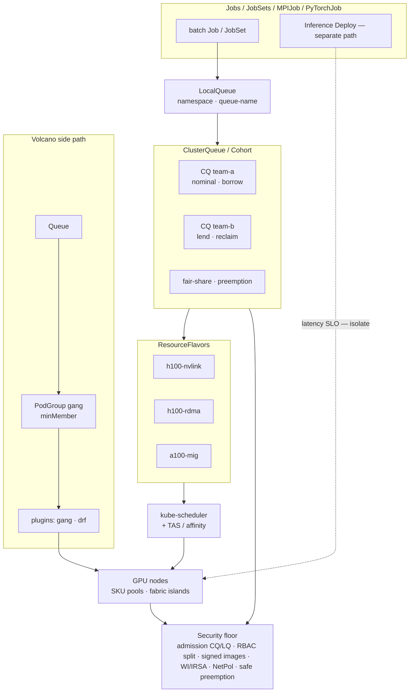

# Lesson 20 — AI/ML platform: training/inference scheduling — gang, Kueue/Volcano, fair-share queues

*2026-09-28*

## What interviewers are really probing

[Lesson 18](/lessons/18-gpu-node-pools-mig-timeslicing) gave you **SKU pools**. [Lesson 19](/lessons/19-gpu-topology-nvlink-rdma-nccl) made **NVLink domains and RDMA rails** schedulable. This lesson asks the operator question that kills GPU utilization in interviews and in production: **can you admit multi-pod training without half-placing a gang** — and share the fleet fairly without starving inference SLOs?

Interviewers at hyperscale AI platforms (fuel: [wafer-ai/gpu-perf-engineering-resources](https://github.com/wafer-ai/gpu-perf-engineering-resources)) want evidence you have **run batch queues under contention**, not only “we use the default scheduler”:

- **Vanilla kube-scheduler + Job parallelism fails for training** — partial place → idle GPUs holding ranks → NCCL hang / watchdog abort ([L1](/lessons/01-hyperscale-mental-model), [L4](/lessons/04-borg-mesos-orchestration))
- **Gang scheduling semantics** — all-or-nothing / `minAvailable`; topology from [L19](/lessons/19-gpu-topology-nvlink-rdma-nccl) is a **packing constraint**, not a hope
- **Kueue** — ClusterQueue, LocalQueue, ResourceFlavor, Cohort, borrowing/lending, fair-sharing, preemption, Workload CR; Job / JobSet / Kubeflow MPIJob / PyTorchJob admission
- **Volcano** — Queue, PodGroup, gang plugins, queue priority — when it shows up vs Kueue in interviews
- **Fair-share / hierarchical queues** — team quotas vs capacity planning; reclaim loaned capacity
- **Training vs inference** — exclusive gang train ≠ latency-SLO inference; don’t share without isolation ([L14](/lessons/14-ml-inference-training-deploy-hardening))
- **Topology-aware + queue** — flavors for NVLink/RDMA SKUs; don’t admit a gang that can’t pack into one fabric island
- **Orchestration vs batch queue** — Temporal/Argo ([L16](/lessons/16-temporal-argo-workflows)) own **workflow DAG / retries**; Kueue/Volcano own **when GPU capacity is reserved**
- **Security floor on queues** — queue admins ≠ weight writers; admission on CQ/LQ; signed controller images; preemption must not leave weight-writable sidecars ([L11](/lessons/11-cluster-security-pss-admission-rbac)–[L14](/lessons/14-ml-inference-training-deploy-hardening))

**Interview sentence:** “I admit training as a gang through Kueue (or Volcano PodGroup) against topology-aware flavors, fair-share cohorts reclaim loaned GPUs, train and inference never share without isolation, and queue RBAC never implies weight-bucket IAM.”

## Core diagram: Jobs → LocalQueue → ClusterQueue/Cohort → Flavors → schedule → nodes (+ Volcano path, security floor)




**Read it left-to-right:** A training **Job / JobSet / MPIJob / PyTorchJob** lands on a namespace **LocalQueue** (label `kueue.x-k8s.io/queue-name`). That queue points at a cluster-scoped **ClusterQueue** inside a **Cohort** that fair-shares and can **borrow/lend** with preemption on reclaim. Admission picks a **ResourceFlavor** (SKU + topology labels). Only then does **kube-scheduler** (optionally with Kueue TAS) place pods — ideally into one **fabric island** from [L19](/lessons/19-gpu-topology-nvlink-rdma-nccl). **Volcano** is the alternate path: its **Queue + PodGroup** gang-binds via plugins and *replaces* default scheduling for those pods. **Inference** is a different product: latency SLOs, not exclusive gangs — isolate pools/queues. Everything sits on a **security floor**: who can mutate queues, who can write weights, signed controller + train images, WI/IRSA, NetPol, and preemption that tears down the whole gang cleanly.

## Idiosyncrasies / operator depth

### 1. Why vanilla kube-scheduler + Job parallelism fails for multi-pod training

| What you did | What happens | Why it hurts |
|---|---|---|
| `Job.spec.parallelism: 8` | Scheduler places pods **independently** | 5 pods Running, 3 Pending forever → 5×8 GPUs idle in NCCL wait |
| “Enough” free GPUs cluster-wide | Fragmented across racks/blocks | Partial place + bad topology ([L19](/lessons/19-gpu-topology-nvlink-rdma-nccl)) |
| Rely on `completions` / restart | Hang looks like framework bug | Watchdog / NCCL timeout; ticket says “PyTorch” — root cause is admission |
| No timeout on partial place | Head-of-line waste | Other gangs blocked behind stuck partials |

**Interview sentence:** “Job parallelism is not gang scheduling — without all-or-nothing admission you donate GPUs to a hang.”

### 2. Gang scheduling semantics (all-or-nothing / minAvailable)

| Concept | Operator meaning |
|---|---|
| **All-or-nothing** | Either the gang’s minimum members bind (or are ready), or **none** keep capacity |
| **`minAvailable` / `minMember`** | Threshold for “enough ranks to start” (often = world size; sometimes loosely for elastic) |
| **Admission vs bind** | Kueue: reserve quota (+ TAS domains) then schedule; `waitForPodsReady` requeues on timeout. Volcano: PodGroup gang plugin holds until `minMember` can schedule together |
| **Topology interaction** | Gang that cannot pack into one NVLink/RDMA island should **not admit** — don’t hope affinity fixes it later ([L19](/lessons/19-gpu-topology-nvlink-rdma-nccl)) |
| **Preemption** | Evict **whole** lower-priority gangs (or reclaim borrowers); never leave orphan ranks |

**Interview sentence:** “Gang is a capacity contract: admit only when the full ring fits — including topology, not just GPU count.”

### 3. Kueue building blocks

| Object | Scope | Role |
|---|---|---|
| **LocalQueue** | Namespace | User-facing queue; Job label `kueue.x-k8s.io/queue-name` |
| **ClusterQueue** | Cluster | Quota, flavors, preemption policy, cohort membership |
| **ResourceFlavor** | Cluster | Node labels / taints mapping (SKU, spot vs on-demand, topology) |
| **Cohort** | Logical group of CQs | Borrowing / lending unused nominal quota |
| **Fair-sharing** | Cohort | Weights + share values decide who gets burst; reclaim via preemption |
| **Workload** | Created by kueue | Internal CR tracking admission / eviction for a Job/JobSet/… |
| **Admission** | Controllers | Suspend Job until Admitted; inject flavor node selectors |

**Integrations interviewers name-drop:** plain `batch/v1 Job`, **JobSet**, Kubeflow **MPIJob** / **PyTorchJob**, RayJob, LeaderWorkerSet — kueue admits them as Workloads when the framework controller is wired.

**Interview sentence:** “LocalQueue is the team UX; ClusterQueue is the quota contract; ResourceFlavor is how SKU and topology become admit-time constraints.”

### 4. Volcano vs Kueue — when each shows up

| Axis | **Kueue** | **Volcano** |
|---|---|---|
| Model | Admission + queueing **in front of** kube-scheduler | **Replacement** scheduler (`schedulerName: volcano`) |
| Gang | All-or-nothing via TAS + `waitForPodsReady` (timeout requeue) | PodGroup `minMember` / gang plugin — classic interview “gang” word |
| Fair-share | Cohort + fair sharing / borrowing | Queue weight, DRF / proportion plugins |
| API surface | ClusterQueue, LocalQueue, ResourceFlavor, Workload | Queue, PodGroup, volcano Job, plugins |
| Interview tell | Multi-tenant ML platform on stock kube-scheduler + autoscaler | Batch/HPC lineage, “we run Volcano for gang” |

**Interview sentence:** “Kueue is quota admission that keeps kube-scheduler; Volcano is a batch scheduler with PodGroup gang — I pick based on whether we own scheduling or only admission.”

### 5. Fair-share, hierarchical queues, team quotas vs capacity planning

| Practice | Operator truth |
|---|---|
| **Nominal quota** | Guaranteed GPUs per team CQ — capacity plan # |
| **Borrow / lend** | Burst into unused cohort capacity; **must reclaim** when owner needs it |
| **Fair-share weights** | Burst allocation by share value, not first-come forever |
| **Hard limits only** | Leaves idle GPUs on the table; constant quota thrash |
| **Hierarchical org queues** | Platform → org → team CQs; don’t flatten politics into one FIFO |
| **Capacity planning** | Nominal sums ≤ real SKU pools ([L18](/lessons/18-gpu-node-pools-mig-timeslicing)); oversubscribe deliberately with preemption policy |

**Interview sentence:** “Quotas without reclaim are lies; fair-share without preemption is a suggestion.”

### 6. Training vs inference scheduling (don’t share blindly)

| Workload | Scheduling shape | Isolation |
|---|---|---|
| **Distributed train** | Exclusive gang; long-lived; topology-sensitive | Train CQ + train flavors + train NetPol/NAD |
| **Batch fine-tune** | Gang or single-node; preemptible often OK | Same train cohort with lower priority |
| **Online inference** | Deployment / LWS; **latency SLO** (TTFT/TPOT → Lesson 21) | Separate CQ/pool; never borrow train NVLink islands for “just one more replica” without policy |
| **Offline batch infer** | Job-like; can share train cohort carefully | PriorityClass + flavor that excludes train-only rails |

**Interview sentence:** “Training buys atomic GPU sets; inference buys tail latency — one ClusterQueue for both is how you get both angry.”

### 7. Topology-aware flavors — admit only what packs

| Flavor pattern | Labels / constraints | Footgun |
|---|---|---|
| `h100-nvlink` | `sku=h100`, `nvlink-domain`, block/rack | Admitting 16-GPU gang across two blocks |
| `h100-rdma` | `rdma-rail-count≥4`, train pool taint | Flavor matches A100 MIG nodes “with a GPU” |
| TAS (Kueue) | Topology domains at admit time | Quota free but domains fragmented → should stay Pending at **queue**, not half-run |
| Spot flavor | `lifecycle=spot` | Train checkpoints + spot without reclaim story ([L13](/lessons/13-ml-weights-checkpoint-hardening)) |

**Interview sentence:** “ResourceFlavor is where L18 SKUs and L19 topology become admission predicates — if the island can’t fit the gang, don’t Admit.”

### 8. Orchestration vs batch queue ([L16](/lessons/16-temporal-argo-workflows))

| Layer | Owns | Does **not** own |
|---|---|---|
| **Temporal / Argo** | DAG, retries, artifacts, human steps | GPU quota fairness across teams |
| **Kueue / Volcano** | When capacity is reserved / preempted | Business workflow semantics |
| **Together** | Argo step submits Job labeled for LocalQueue; Temporal activity waits on Workload Admitted | Don’t invent a second GPU scheduler inside the workflow engine |

**Interview sentence:** “Argo starts the Job; Kueue decides if the fleet can afford the gang today.”

## Concrete commands & config

### Inspect Kueue objects & Workload state

```bash
# Queues & flavors
kubectl get clusterqueues.kueue.x-k8s.io -o wide
kubectl get localqueues.kueue.x-k8s.io -A
kubectl get resourceflavors.kueue.x-k8s.io
kubectl describe clusterqueue team-a-cq

# Workloads: Admitted / Evicted / Finished
kubectl get workloads.kueue.x-k8s.io -A \
  -o custom-columns=NS:.metadata.namespace,NAME:.metadata.name,CQ:.status.admission.clusterQueue,STATE:.status.conditions[-1:].type

kubectl describe workload -n model-training JOB_NAME
kubectl get events -n model-training --field-selector reason=Admitted,reason=Evicted,reason=QuotaReserved

# Optional CLI (if installed)
kueuectl list workload -n model-training
kueuectl list clusterqueue
```

### Volcano inspect

```bash
kubectl get queues.scheduling.volcano.sh
kubectl get podgroups.scheduling.volcano.sh -A
kubectl describe podgroup -n model-training train-gang
# volcano-cli where available:
# vcctl queue list && vcctl job list -n model-training
kubectl get pods -n model-training -o wide --field-selector=status.phase=Pending
kubectl describe pods -n model-training -l volcano.sh/job-name=train-gang | sed -n '/Events:/,$p'
```

### YAML: ResourceFlavor + ClusterQueue + LocalQueue + Job

```yaml
apiVersion: kueue.x-k8s.io/v1beta1
kind: ResourceFlavor
metadata:
  name: h100-nvlink
spec:
  nodeLabels:
    sku: h100
    pool: train-exclusive
    # Topology island — tighten to your inventory ([L19])
    block: cell-a-block-3
  # optional: nodeTaints + tolerations to match train taints
---
apiVersion: kueue.x-k8s.io/v1beta1
kind: ClusterQueue
metadata:
  name: team-a-cq
spec:
  cohort: ml-platform
  queueingStrategy: BestEffortFIFO   # or StrictFIFO — know HOL blocking
  namespaceSelector: {}               # restrict in prod
  resourceGroups:
    - coveredResources: ["nvidia.com/gpu", "cpu", "memory"]
      flavors:
        - name: h100-nvlink
          resources:
            - name: nvidia.com/gpu
              nominalQuota: 64
              borrowingLimit: 32
            - name: cpu
              nominalQuota: "512"
            - name: memory
              nominalQuota: 4Ti
  preemption:
    withinClusterQueue: LowerPriority
    reclaimWithinCohort: Any
  # fairSharing:
  #   weight: 25
---
apiVersion: kueue.x-k8s.io/v1beta1
kind: LocalQueue
metadata:
  name: team-a-train
  namespace: model-training
spec:
  clusterQueue: team-a-cq
---
apiVersion: batch/v1
kind: Job
metadata:
  name: train-gang-demo
  namespace: model-training
  labels:
    kueue.x-k8s.io/queue-name: team-a-train
  annotations:
    # Framework-specific: JobSet / MPIJob similarly labeled
spec:
  parallelism: 4
  completions: 4
  # kueue suspends until Admitted when managed
  template:
    metadata:
      labels:
        app: train-gang
        trust-domain: train-prod
      annotations:
        k8s.v1.cni.cncf.io/networks: rdma-train-rail
    spec:
      runtimeClassName: nvidia
      serviceAccountName: weight-writer
      restartPolicy: OnFailure
      # Flavor injects selectors; still pin topology intent
      nodeSelector:
        sku: h100
        pool: train-exclusive
      containers:
        - name: trainer
          image: registry.example.com/ml/trainer@sha256:REPLACE
          resources:
            limits:
              nvidia.com/gpu: "8"
          securityContext:
            allowPrivilegeEscalation: false
            capabilities:
              add: ["IPC_LOCK"]
              drop: ["ALL"]
```

### YAML: Volcano PodGroup sketch

```yaml
apiVersion: scheduling.volcano.sh/v1beta1
kind: Queue
metadata:
  name: ml-training
spec:
  weight: 1
  reclaimable: true
  capability:
    nvidia.com/gpu: 128
---
apiVersion: scheduling.volcano.sh/v1beta1
kind: PodGroup
metadata:
  name: train-gang
  namespace: model-training
spec:
  minMember: 4
  minResources:
    nvidia.com/gpu: "32"
  queue: ml-training
  priorityClassName: train-high
---
# Pods / volcano Job set schedulerName: volcano and
# annotation scheduling.k8s.io/group-name: train-gang (pattern varies by version)
```

### Admission sketch: queue mutation ≠ weight IAM

```yaml
apiVersion: rbac.authorization.k8s.io/v1
kind: ClusterRole
metadata:
  name: kueue-queue-admin
rules:
  - apiGroups: ["kueue.x-k8s.io"]
    resources: ["clusterqueues", "resourceflavors", "localqueues"]
    verbs: ["get", "list", "watch", "create", "update", "patch"]
  # Explicitly NOT: secrets, IAM bindings, bucket policies
---
apiVersion: admissionregistration.k8s.io/v1
kind: ValidatingAdmissionPolicy
metadata:
  name: kueue-job-floor
spec:
  failurePolicy: Fail
  matchConstraints:
    resourceRules:
      - apiGroups: ["batch"]
        apiVersions: ["v1"]
        operations: ["CREATE", "UPDATE"]
        resources: ["jobs"]
  validations:
    - expression: >
        !has(object.metadata.labels) ||
        !has(object.metadata.labels["kueue.x-k8s.io/queue-name"]) ||
        (has(object.spec.template.spec.serviceAccountName) &&
         object.spec.template.spec.serviceAccountName != "default" &&
         has(object.spec.template.spec.runtimeClassName) &&
         object.spec.template.spec.runtimeClassName == "nvidia")
      message: "Kueue train Jobs require non-default SA + nvidia RuntimeClass"
```

## Failures & fixes

| Symptom | Likely cause | Fix / mitigation |
|---|---|---|
| 5/8 train pods Running, rest Pending; NCCL hang | No gang / no `waitForPodsReady`; vanilla Job parallelism | Kueue all-or-nothing + TAS; or Volcano PodGroup `minMember`; don’t start ranks until Admitted |
| Workload Pending forever; GPUs “free” | Flavor mismatch (A100 job → H100-only CQ); wrong LocalQueue | Align ResourceFlavor labels; `kubectl describe workload` / CQ status |
| Team B idle while Team A stuck | Head-of-line StrictFIFO; huge gang ahead | BestEffortFIFO / priority; split interactive vs train queues |
| Borrowed GPUs never return | No `reclaimWithinCohort` / preemption disabled | Enable reclaim; PriorityClass; alert on CQ borrowing age |
| Preemption storm | Aggressive reclaim + short jobs thrashing | Dampen; borrowingLimit; separate inference CQ |
| Inference p99 explodes during train burst | Shared CQ/pool; train borrowed inference GPUs | Separate flavors/pools; NetPol + taints ([L14](/lessons/14-ml-inference-training-deploy-hardening), [L18](/lessons/18-gpu-node-pools-mig-timeslicing)) |
| Admitted then Evicted on timeout | Nodes slow / image pull / RDMA device plugin | `waitForPodsReady` backoff; mirror registry; pin digests ([L12](/lessons/12-node-container-hardening-supply-chain)) |
| Gang packs but 10× slow | Topology ignored at admit | Flavors + TAS for block/rack; required affinity ([L19](/lessons/19-gpu-topology-nvlink-rdma-nccl)) |
| Loaned capacity “returned” but ranks linger | Partial preemption left sidecars | Preempt whole Workload/PodGroup; forbid weight-writable sidecars on preemptible templates |
| Security finding: queue admin can `s3:*` | Conflated platform Role | Split RBAC; WI only on weight-writer SA ([L13](/lessons/13-ml-weights-checkpoint-hardening)) |
| Unsigned kueue controller image | Supply-chain gap on admit path | Cosign verify controllers + webhooks ([L12](/lessons/12-node-container-hardening-supply-chain)) |

## Security & hardening

**Queues and gangs concentrate power.** Whoever admits a 64-GPU Workload can also become a **weight exfil path** if SA, images, and NetPol are sloppy. Preemption without a clean gang teardown leaves **orphans that still mount checkpoints**.

| Control | Why | Practice |
|---|---|---|
| **Admission on ClusterQueue / LocalQueue** | Creating a CQ is creating money + blast radius | Restrict CQ/Flavor mutate to platform; teams only create LocalQueue in *their* NS ([L11](/lessons/11-cluster-security-pss-admission-rbac)) |
| **Queue admins ≠ weight writers** | Queue RBAC must not imply object-store admin | Separate ClusterRoles; weight-writer SA via WI/IRSA only on Jobs that need checkpoints ([L13](/lessons/13-ml-weights-checkpoint-hardening)) |
| **Bucket IAM / CMEK** | Admitted gangs pull/push checkpoints hard | Per-Workload WI; CMEK; no public buckets; no node-wide `s3:*` / `gs://*` because “train nodes need storage” |
| **Registries + signing / provenance** | Compromised train image × gang = fleet-wide | Private registry; cosign verify; digest-pin Job images; **also sign kueue/volcano controller + webhook images** ([L12](/lessons/12-node-container-hardening-supply-chain)) |
| **Secrets** | HF tokens / registry creds in preempted pods | External Secrets / CSI; short-lived OIDC; never bake tokens into images |
| **Network isolation** | Train gangs on RDMA + weight endpoints | Default-deny NetPol; allow DNS, private registry, weight VPC endpoints, train NAD; isolate inference NS ([L9](/lessons/09-networkpolicy-multi-nic-sflow), [L14](/lessons/14-ml-inference-training-deploy-hardening)) |
| **Namespace isolation for teams** | LocalQueue is per-NS for a reason | One team NS ↔ one (or few) LocalQueues; no cross-NS Job create |
| **Preemption safety** | Eviction mid-checkpoint | Evict whole Workload/PodGroup; drain sidecars; **forbid** privileged / hostPath / weight-writable sidecars on preemptible templates; checkpoint to CMEK with fsync story ([L13](/lessons/13-ml-weights-checkpoint-hardening)) |
| **Admission on Workloads / Jobs** | Label alone is not a security boundary | VAP/Kyverno: require non-default SA, RuntimeClass, digest, queue-name allowlist |
| **Controller least privilege** | kueue/volcano SAs are high value | Narrow ClusterRoles; PSS on system NS; audit webhook configs |

### AI/ML weight & registry hardening on queued gangs (required)

| Scenario | Weight / registry controls |
|---|---|
| **Admitted train gang** | Digested trainer image; WI to CMEK checkpoint prefix; no shared “train-node” IAM |
| **Preempted / Evicted Workload** | Tear down all ranks; revoke short-lived creds; don’t leave PVC with world-readable weights |
| **Borrowed cohort capacity** | Same IAM as nominal — borrowing GPUs ≠ borrowing another team’s bucket |
| **Queue admin break-glass** | Still cannot push to prod weight registry without separate provenance gate |
| **Inference vs train** | Inference SA read-only weights; train SA write checkpoints; never one SA for both ([L14](/lessons/14-ml-inference-training-deploy-hardening)) |

```yaml
# Sketch: queue + weight floor (policy-as-code shape)
apiVersion: policy.platform/v1
kind: MlQueueGate
metadata:
  name: kueue-weight-floor
spec:
  match:
    labels:
      kueue.x-k8s.io/queue-name: "*"
  require:
    imageDigestPin: true
    cosignVerify: true
    runtimeClass: nvidia
    serviceAccountNotDefault: true
    workloadIdentity: true
    weightBucketPublicAccess: false
    cmek: true
    forbidNodeWideObjectIAM: true
    networkPolicy: deny-by-default
    preemptibleSidecarWeightWrite: false
    kueueControllerImageSigned: true
    volcanoControllerImageSigned: true
    queueAdminImpliesWeightIAM: false
```

**Punchline:** Fair-share and gang admission are **capacity** features. **RBAC splits, signed images (including controllers), WI/IRSA, NetPol, and whole-gang preemption** are what stop a Cohort from becoming a multi-tenant weight breach.

## Interview soundbites

- **“Job parallelism is not a gang — partial place is how you waste a rack.”**
- **“Kueue admits quota; kube-scheduler places; Volcano does both for its pods.”**
- **“LocalQueue is UX; ClusterQueue is the contract; ResourceFlavor is SKU + topology.”**
- **“Borrow without reclaim is theft with good intentions.”**
- **“Fair-share needs preemption or it’s a story you tell finance.”**
- **“Don’t admit a gang that can’t pack into one fabric island.”**
- **“Train gangs and inference SLOs don’t share a ClusterQueue without isolation.”**
- **“Argo orchestrates steps; Kueue orchestrates GPU scarcity.”**
- **“Queue admin ≠ weight writer ≠ registry pusher.”**
- **“Preempt the whole Workload — orphan ranks still hold checkpoints.”**
- **“Sign kueue controllers like you sign trainers.”**
- **“Next: inference SLOs — TTFT/TPOT, goodput, KV-cache as capacity.”**

## How this maps to the JD

Hyperscale + AI/ML platform JDs that mention **GPU fleets, multi-tenant training, and fair capacity** are asking whether you can **operate admission under contention**: gang semantics, Kueue/Volcano, fair-share cohorts, topology-aware flavors, and the train vs inference split — with the same security bar as any other cell. This lesson extends [L18](/lessons/18-gpu-node-pools-mig-timeslicing)/[L19](/lessons/19-gpu-topology-nvlink-rdma-nccl) (pools + topology) with [L4](/lessons/04-borg-mesos-orchestration)/[L1](/lessons/01-hyperscale-mental-model) (fleet packing / Borg instincts), [L16](/lessons/16-temporal-argo-workflows) (orchestration ≠ batch queue), and [L11](/lessons/11-cluster-security-pss-admission-rbac)–[L14](/lessons/14-ml-inference-training-deploy-hardening) (admission, supply chain, weights, deploy isolation). Fuel: [wafer-ai/gpu-perf-engineering-resources](https://github.com/wafer-ai/gpu-perf-engineering-resources). **Next up — Lesson 21:** inference serving SLOs — TTFT/TPOT/goodput, continuous batching, KV-cache as capacity.

## Watch (talks & demos)

Real talks — watch after Failures & fixes.

### Multitenancy and Fairness at Scale with Kueue: A Case Study (Aldo Culquicondor & Rajat Phull)

Cohorts, borrowing, fair-share weights, and reclaim-via-preemption in production ML platforms — the interview core for “how do teams share GPUs without lying about quotas.”

<iframe width="100%" height="360" src="https://www.youtube.com/embed/GYiuTQCvTx8" title="Multitenancy and Fairness at Scale with Kueue - Aldo Culquicondor & Rajat Phull" frameBorder="0" allow="accelerometer; autoplay; clipboard-write; encrypted-media; gyroscope; picture-in-picture; web-share" allowFullScreen></iframe>

[Open on YouTube](https://www.youtube.com/watch?v=GYiuTQCvTx8)

### Building a Batch System for the Cloud with Kueue (Aldo Culquicondor & Kante Yin)

ClusterQueue / LocalQueue / ResourceFlavor, flavor injection, and preemption when reclaiming loaned capacity — how kueue sits in front of kube-scheduler without replacing it.

<iframe width="100%" height="360" src="https://www.youtube.com/embed/5qasif08vnM" title="Building a Batch System for the Cloud with Kueue - Aldo Culquicondor & Kante Yin" frameBorder="0" allow="accelerometer; autoplay; clipboard-write; encrypted-media; gyroscope; picture-in-picture; web-share" allowFullScreen></iframe>

[Open on YouTube](https://www.youtube.com/watch?v=5qasif08vnM)

### Lightning Talk: Optimizing AI Workload Scheduling at Scale with Kueue (P. Matam)

Practical cluster-queue / local-queue / flavor / cohort vocabulary for AI training admission — tight interview flashcard after the two deeper talks.

<iframe width="100%" height="360" src="https://www.youtube.com/embed/BSi8AMSkxX4" title="Optimizing AI Workload Scheduling at Scale with Kueue - P. Matam" frameBorder="0" allow="accelerometer; autoplay; clipboard-write; encrypted-media; gyroscope; picture-in-picture; web-share" allowFullScreen></iframe>

[Open on YouTube](https://www.youtube.com/watch?v=BSi8AMSkxX4)

### Volcano — Advanced Batch Scheduling for Kubernetes (CNCF Incubation series)

Gang scheduling, multi-queue fair-share, and topology-aware batch placement — the Volcano side of “Kueue vs Volcano” interview contrasts.

<iframe width="100%" height="360" src="https://www.youtube.com/embed/h7aZQjL4i_A" title="Volcano - Advanced Batch Scheduling for Kubernetes" frameBorder="0" allow="accelerometer; autoplay; clipboard-write; encrypted-media; gyroscope; picture-in-picture; web-share" allowFullScreen></iframe>

[Open on YouTube](https://www.youtube.com/watch?v=h7aZQjL4i_A)

## References

- [Kueue](https://kueue.sigs.k8s.io/) · [All-or-nothing scheduling](https://kueue.sigs.k8s.io/docs/concepts/all_or_nothing/) · [Concepts: ClusterQueue / LocalQueue / ResourceFlavor](https://kueue.sigs.k8s.io/docs/concepts/)
- [JobSet](https://github.com/kubernetes-sigs/jobset) · [Kubeflow Trainer](https://www.kubeflow.org/docs/components/trainer/)
- [Volcano](https://volcano.sh/) · [PodGroup / gang](https://volcano.sh/en/docs/) · [CNCF Volcano](https://www.cncf.io/projects/volcano/)
- [Kubernetes scheduling / DRA](https://kubernetes.io/docs/concepts/scheduling-eviction/dynamic-resource-allocation/) · [PriorityClass / preemption](https://kubernetes.io/docs/concepts/scheduling-eviction/pod-priority-preemption/)
- [wafer-ai/gpu-perf-engineering-resources](https://github.com/wafer-ai/gpu-perf-engineering-resources) — GPU fleets / schedulers / serving fuel
- Prior: [19 — GPU topology](/lessons/19-gpu-topology-nvlink-rdma-nccl) · [18 — GPU node pools](/lessons/18-gpu-node-pools-mig-timeslicing) · [16 — Temporal / Argo](/lessons/16-temporal-argo-workflows) · [14 — ML deploy hardening](/lessons/14-ml-inference-training-deploy-hardening) · [13 — ML weights](/lessons/13-ml-weights-checkpoint-hardening) · [12 — Node/container hardening](/lessons/12-node-container-hardening-supply-chain) · [11 — Cluster security](/lessons/11-cluster-security-pss-admission-rbac) · [09 — NetworkPolicy / multi-NIC](/lessons/09-networkpolicy-multi-nic-sflow) · [04 — Borg/Mesos](/lessons/04-borg-mesos-orchestration) · [01 — Hyperscale mental model](/lessons/01-hyperscale-mental-model)
- Next: **Lesson 21 — inference serving SLOs (TTFT/TPOT/goodput, continuous batching, KV-cache as capacity)**

## Quick self-check

Out loud, in under two minutes:

1. Why does `Job` parallelism without gang semantics waste GPUs on multi-pod training?
2. Name Kueue’s LocalQueue, ClusterQueue, ResourceFlavor, Cohort — and what each decides.
3. How does Volcano’s PodGroup `minMember` differ from Kueue’s admit + `waitForPodsReady`?
4. What breaks if a team borrows cohort GPUs forever with no reclaim/preemption?
5. Why must train gangs and latency inference not share a ClusterQueue without isolation?
6. List four security controls that must hold when an admitted gang pulls model weights — including why queue admins must not be weight writers.
