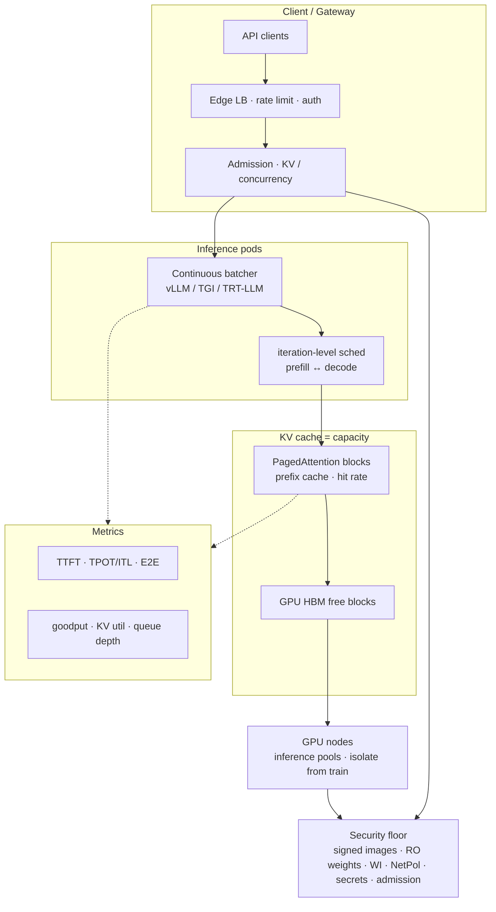

# Lesson 21 — AI/ML platform: inference serving SLOs — TTFT/TPOT/goodput, continuous batching, KV cache as capacity

*2026-09-29*

## What interviewers are really probing

[Lesson 18](/lessons/18-gpu-node-pools-mig-timeslicing) gave you **SKU pools**. [Lesson 19](/lessons/19-gpu-topology-nvlink-rdma-nccl) made **NVLink / RDMA** schedulable. [Lesson 20](/lessons/20-training-inference-scheduling-kueue-volcano) admitted **training gangs** without half-placing them — and told you **not** to share those gangs with latency inference. This lesson is the inference half of that contract: **can you operate serving capacity as KV-cache / HBM, not as “GPU %” or raw tok/s — and defend TTFT/TPOT SLOs under load?**

Interviewers at hyperscale AI platforms (fuel: [wafer-ai/gpu-perf-engineering-resources](https://github.com/wafer-ai/gpu-perf-engineering-resources)) want evidence you have **run LLM serving under contention**, not only “we deploy vLLM”:

- **TTFT / TPOT / E2E / goodput** — first-token vs inter-token vs end-to-end; **goodput** = tokens (or requests) delivered *under SLO*, not vanity throughput
- **Continuous batching** — iteration-level admit/evict vs static batching that leaves GPU slots idle
- **KV cache as the real capacity constraint** — GPU HBM; PagedAttention; prefix cache hit rate; free blocks = seats
- **Admission control on KV / concurrency**, not just QPS at the edge ([L7](/lessons/07-edge-lb-ddos-armor-shield) still rate-limits abuse)
- **Autoscaling on queue depth / KV util / TTFT burn** — naive CPU or even “GPU util” lies during decode-bound serving
- **Multi-LoRA / model multiplexing** — capacity tradeoffs when many adapters share one engine
- **Isolation from training gangs** ([L20](/lessons/20-training-inference-scheduling-kueue-volcano)) — inference SLO pools, flavors, NetPol
- **Observability** — histograms for TTFT/TPOT, goodput, preemptions, KV fragmentation / cache hit rate
- **Security floor on the serving path** — signed serving images; read-only weight mounts / WI; no weight *write* from inference SA; private registry + provenance; bucket IAM for pulls; secrets; NetPol; admission/RBAC ([L11](/lessons/11-cluster-security-pss-admission-rbac)–[L14](/lessons/14-ml-inference-training-deploy-hardening))

**Interview sentence:** “I size and admit inference on free KV blocks in HBM, schedule with continuous batching, SLO on TTFT/TPOT histograms and goodput — not tok/s vanity — autoscale on queue depth and KV util, keep train gangs off the inference pool, and the serve SA can only pull signed weights read-only.”

## Core diagram: Client/Gateway → continuous batcher → KV/HBM → GPU nodes (+ metrics, security floor)




**Read it left-to-right:** Clients hit an **edge gateway** (auth, abuse rate limits from [L7](/lessons/07-edge-lb-ddos-armor-shield)). An **admission gate** decides whether a new request may consume **KV seats** — not merely whether QPS &lt; N. Admitted work lands on **inference pods** running a **continuous batcher** (vLLM / TGI / TensorRT-LLM style): between every decode step the scheduler can **evict finished sequences and admit waiting ones**. The scarce resource is **KV cache in HBM** (PagedAttention blocks, optional prefix cache). Placement stays on **inference SKU pools** isolated from train gangs ([L20](/lessons/20-training-inference-scheduling-kueue-volcano)). **Metrics** (TTFT/TPOT histograms, goodput, KV util, queue depth) drive autoscaling and burn alerts. Everything sits on a **security floor**: signed serving images, read-only weight path via WI/IRSA, no write IAM on the inference SA, NetPol, secrets, admission.

## Idiosyncrasies / operator depth

### 1. TTFT, TPOT/ITL, E2E, goodput vs throughput

| Metric | What it measures | Operator use |
|---|---|---|
| **TTFT** (time to first token) | Queue wait + prefill (+ any cold start) until first streamed token | Interactive UX; chat “typing started”; sensitive to long prompts and head-of-line prefill |
| **TPOT / ITL** (time per output token / inter-token latency) | Gap between successive output tokens during decode | Streaming smoothness; decode-bound; batch size / KV pressure driven |
| **E2E latency** | TTFT + Σ (output tokens × TPOT) (+ network) | User deadline / timeout; cancel stories |
| **Throughput** | Tokens or req/s the engine emits | Capacity planning input — **not** the SLO by itself |
| **Goodput** | Tokens / requests **delivered under** TTFT/TPOT (or E2E) SLOs | What finance and product actually bought; rejects / timeouts / SLO misses don’t count |

**Interview sentence:** “Throughput without an SLO is a vanity metric; goodput is tokens that still met TTFT and TPOT.”

### 2. Continuous batching / iteration-level scheduling vs static batching

| Mode | Behavior | Failure mode |
|---|---|---|
| **Static batching** | Form a batch, run until *all* sequences finish | Short requests hostage to long ones; empty slots; huge queue wait |
| **Continuous / iteration-level** | Each decode step: drop finished, admit waiting if KV allows, run one forward | Prefill of a new admit can spike TTFT for everyone if unbounded |
| **Chunked prefill** | Slice long prompts; interleave with decode | Caps TTFT damage from one fat prompt (`max_num_batched_tokens` class dials) |

**Interview sentence:** “Continuous batching keeps the GPU full between tokens; chunked prefill stops one long prompt from freezing every decode stream.”

### 3. KV cache as the real capacity constraint

| Concept | Operator meaning |
|---|---|
| **Weights vs KV** | Weights are mostly fixed once loaded; **KV grows with concurrent sequences × context** |
| **HBM is the wallet** | Free KV blocks ≈ how many concurrent seats you can sell |
| **PagedAttention** | Block table + non-contiguous KV pages → low fragmentation vs contiguous pre-alloc |
| **Prefix / automatic prefix cache** | Shared prompt prefixes reuse blocks → **cache hit rate** is a first-class capacity lever |
| **Admission** | Deny or queue when free blocks &lt; estimate — don’t OOM mid-decode |
| **Multi-LoRA** | Adapters add weight/activation pressure; still often **KV-bound** on long contexts |

**Interview sentence:** “I don’t ask ‘how many GPUs?’ for serving — I ask ‘how many free KV blocks at p99 context?’”

### 4. Admission control & concurrency limits tied to KV

| Anti-pattern | What to do instead |
|---|---|
| Edge QPS limit only | Edge still rate-limits abuse ([L7](/lessons/07-edge-lb-ddos-armor-shield)); **serving** admits on KV/concurrency |
| `max_num_seqs` cargo-cult | Derive from HBM, model, max context, head config; load-test |
| Unlimited waiting queue | Bound queue + timeout; shed load → protect goodput for in-flight |
| “GPU util 90% so we’re fine” | Decode can look busy while TTFT burns in the waiting queue |

**Interview sentence:** “QPS caps abuse; KV admission protects the SLO.”

### 5. Autoscaling: queue depth / KV util / TTFT burn — not naive CPU

| Signal | Why |
|---|---|
| **Waiting queue depth** | Direct pressure before TTFT blows |
| **KV utilization %** | Capacity fullness; scale out before admit denials cascade |
| **TTFT SLO burn rate** | Error-budget style; catch regressions CPU won’t show |
| **CPU / GPU util alone** | Decode is memory-bandwidth heavy; util can look “healthy” while p99 TTFT is on fire |

Wire **KEDA / custom-metrics HPA** (or fleet autoscaler) to those signals; scale the **inference pool**, not the train cohort ([L20](/lessons/20-training-inference-scheduling-kueue-volcano)).

**Interview sentence:** “I autoscale inference on queue depth and KV util — CPU HPA is how you scale the wrong thing.”

### 6. Multi-LoRA / model multiplexing (high level)

| Tradeoff | Operator note |
|---|---|
| **One engine, many LoRAs** | Better GPU packing; adapter swap / memory overhead; noisy-neighbor on popular adapters |
| **One model per Deployment** | Cleaner isolation & blast radius; lower density |
| **Cold LoRA** | First-hit latency ≈ TTFT regression; pin hot adapters |
| **Capacity accounting** | Still primarily **KV seats per base model**; LoRA adds weight footprint and scheduler complexity |

**Interview sentence:** “Multi-LoRA densifies GPUs; it doesn’t repeal KV physics or noisy-neighbor SLOs.”

### 7. Isolation from training gangs — inference SLO pools ([L20](/lessons/20-training-inference-scheduling-kueue-volcano))

| Workload | Pool / queue | Why |
|---|---|---|
| **Online inference** | Inference CQ / flavors / taints; latency PriorityClass | TTFT/TPOT SLOs |
| **Offline batch infer** | Lower priority or train-adjacent carefully | Can tolerate queueing |
| **Distributed train** | Exclusive gang + topology flavors | Must not borrow inference HBM islands “for one more replica” |

**Interview sentence:** “Train buys atomic GPU sets; inference buys tail latency — separate pools, separate NetPol, separate SAs.”

### 8. Observability that interviewers expect

| Signal | Shape |
|---|---|
| **TTFT / TPOT** | Histograms (p50/p90/p99), not only averages |
| **Goodput** | Counter of tokens/reqs under SLO; paired with reject/timeout counts |
| **Preemptions / evictions** | Engine-level sequence preemption + kube preemption |
| **KV** | Free blocks, utilization, fragmentation proxies, **prefix cache hit rate** |
| **Queue** | Waiting requests, time-in-queue histogram |
| **Per-tenant** | Avoid one tenant burning shared goodput (edge + admission labels) |

**Interview sentence:** “If you only graph tok/s, you will green-dashboard your way into a TTFT incident.”

## Concrete commands & config

### Inspect inference Deployments / pods / GPU placement

```bash
# Inference pool nodes
kubectl get nodes -l pool=inference-serving -o wide
kubectl get pods -n model-inference -o wide \
  -l app=vllm-serve

# Resource + RuntimeClass sanity
kubectl get deploy -n model-inference vllm-serve -o yaml | sed -n '/resources:/,/runtimeClassName/p'
kubectl describe pod -n model-inference -l app=vllm-serve | sed -n '/Limits:/,/Events:/p'

# Waiting / Pending under pressure
kubectl get pods -n model-inference --field-selector=status.phase=Pending
kubectl top pods -n model-inference
```

### vLLM-style engine flags (capacity & batching)

```bash
# Example container args — tune from load tests, not blog defaults
python -m vllm.entrypoints.openai.api_server \
  --model /models/llama-3-70b-instruct \
  --served-model-name llama-3-70b \
  --host 0.0.0.0 --port 8000 \
  --tensor-parallel-size 4 \
  --gpu-memory-utilization 0.90 \
  --max-model-len 8192 \
  --max-num-seqs 128 \
  --max-num-batched-tokens 4096 \
  --enable-prefix-caching \
  --disable-log-requests \
  --kv-cache-dtype auto
# Related knobs operators discuss in interviews:
#   --enable-chunked-prefill  (when available for your version)
#   --block-size 16
#   --limit-mm-per-prompt ...
```

### TGI / TensorRT-LLM style knobs (interview vocabulary)

```bash
# Hugging Face TGI (shape — flag names drift by version)
text-generation-launcher \
  --model-id /models/llama-3-70b-instruct \
  --num-shard 4 \
  --max-concurrent-requests 128 \
  --max-input-length 4096 \
  --max-total-tokens 8192 \
  --waiting-served-ratio 1.2 \
  --cuda-memory-fraction 0.90

# TensorRT-LLM / triton-style talking points: max_batch_size,
# max_num_tokens, kv_cache_free_gpu_mem_fraction, enable_chunked_context
```

### Deployment sketch: inference pool + RO weights + WI

```yaml
apiVersion: apps/v1
kind: Deployment
metadata:
  name: vllm-serve
  namespace: model-inference
  labels:
    app: vllm-serve
    trust-domain: inference-prod
spec:
  replicas: 4
  selector:
    matchLabels:
      app: vllm-serve
  template:
    metadata:
      labels:
        app: vllm-serve
        trust-domain: inference-prod
      annotations:
        # Optional: custom metrics scrape for TTFT/TPOT exporters
        prometheus.io/scrape: "true"
        prometheus.io/port: "8000"
    spec:
      serviceAccountName: inference-readonly
      runtimeClassName: nvidia
      nodeSelector:
        sku: h100
        pool: inference-serving
      tolerations:
        - key: pool
          value: inference-serving
          effect: NoSchedule
      containers:
        - name: vllm
          image: registry.example.com/ml/vllm-openai@sha256:REPLACE
          args:
            - "--model=/models/llama-3-70b-instruct"
            - "--tensor-parallel-size=4"
            - "--gpu-memory-utilization=0.90"
            - "--max-num-seqs=128"
            - "--max-num-batched-tokens=4096"
            - "--enable-prefix-caching"
          ports:
            - containerPort: 8000
              name: http
          resources:
            limits:
              nvidia.com/gpu: "4"
              memory: 256Gi
            requests:
              nvidia.com/gpu: "4"
              cpu: "16"
              memory: 256Gi
          volumeMounts:
            - name: weights
              mountPath: /models
              readOnly: true
          securityContext:
            allowPrivilegeEscalation: false
            readOnlyRootFilesystem: true
            capabilities:
              drop: ["ALL"]
          livenessProbe:
            httpGet:
              path: /health
              port: http
            initialDelaySeconds: 120
            periodSeconds: 20
          readinessProbe:
            httpGet:
              path: /health
              port: http
            periodSeconds: 10
      volumes:
        - name: weights
          # CSI / PVC populated by a *separate* pull Job with write IAM —
          # inference SA must not have PutObject ([L13])
          persistentVolumeClaim:
            claimName: llama-3-70b-weights-ro
```

### HPA / KEDA sketch on queue depth or custom TTFT metric

```yaml
apiVersion: autoscaling/v2
kind: HorizontalPodAutoscaler
metadata:
  name: vllm-serve
  namespace: model-inference
spec:
  scaleTargetRef:
    apiVersion: apps/v1
    kind: Deployment
    name: vllm-serve
  minReplicas: 4
  maxReplicas: 32
  metrics:
    - type: Pods
      pods:
        metric:
          name: inference_waiting_requests
        target:
          type: AverageValue
          averageValue: "8"
    - type: Pods
      pods:
        metric:
          name: kv_cache_usage_ratio
        target:
          type: AverageValue
          averageValue: "750m"   # ~0.75
  # Prefer KEDA ScaledObject with Prometheus trigger on
  # histogram_quantile(0.99, ttft_seconds) burn when available
```

### NetworkPolicy sketch: edge → serve → registry / weight endpoint

```yaml
apiVersion: networking.k8s.io/v1
kind: NetworkPolicy
metadata:
  name: inference-default-deny
  namespace: model-inference
spec:
  podSelector: {}
  policyTypes: ["Ingress", "Egress"]
---
apiVersion: networking.k8s.io/v1
kind: NetworkPolicy
metadata:
  name: inference-serve-allow
  namespace: model-inference
spec:
  podSelector:
    matchLabels:
      app: vllm-serve
  policyTypes: ["Ingress", "Egress"]
  ingress:
    - from:
        - namespaceSelector:
            matchLabels:
              role: edge-gateway
      ports:
        - protocol: TCP
          port: 8000
  egress:
    - to:
        - namespaceSelector:
            matchLabels:
              role: dns
    - to:
        # Private registry + weight VPC endpoint CIDRs — pin in real clusters
        - ipBlock:
            cidr: 10.10.0.0/16
      ports:
        - protocol: TCP
          port: 443
```

### Admission floor sketch: digest + RO SA + inference pool

```yaml
apiVersion: admissionregistration.k8s.io/v1
kind: ValidatingAdmissionPolicy
metadata:
  name: inference-serve-floor
spec:
  failurePolicy: Fail
  matchConstraints:
    resourceRules:
      - apiGroups: ["apps"]
        apiVersions: ["v1"]
        operations: ["CREATE", "UPDATE"]
        resources: ["deployments"]
  validations:
    - expression: >
        !has(object.metadata.labels) ||
        object.metadata.labels["trust-domain"] != "inference-prod" ||
        (has(object.spec.template.spec.serviceAccountName) &&
         object.spec.template.spec.serviceAccountName == "inference-readonly" &&
         has(object.spec.template.spec.runtimeClassName) &&
         object.spec.template.spec.runtimeClassName == "nvidia")
      message: "inference-prod requires inference-readonly SA + nvidia RuntimeClass"
```

## Failures & fixes

| Symptom | Likely cause | Fix / mitigation |
|---|---|---|
| p99 TTFT explodes; tok/s still “fine” | Waiting queue / long prefill HOL; static-ish batching | Continuous batching + chunked prefill; bound queue; admit on KV; histogram alerts |
| TPOT spikes as concurrency rises | KV pressure / batch too wide; HBM bandwidth | Lower `max_num_seqs`; raise replicas; check KV util; don’t chase tok/s |
| OOM / engine crash under burst | Over-admit vs free KV blocks | Tighten `--gpu-memory-utilization` / max seqs; admission control before the engine |
| Goodput collapses while throughput high | Counting timed-out / cancelled tokens | Define goodput under SLO; shed load; expose reject counters |
| Autoscale never fires during incident | HPA on CPU | Custom metrics: queue depth, KV %, TTFT burn |
| Train job lands on inference nodes | Shared pool / missing taints | Inference taints + flavors; separate CQ ([L20](/lessons/20-training-inference-scheduling-kueue-volcano), [L18](/lessons/18-gpu-node-pools-mig-timeslicing)) |
| Prefix cache “on” but TTFT flat | Low shared prefix rate; cache thrash | Measure hit rate; pin system prompts; size cache; don’t assume magic |
| Multi-LoRA p99 chaos | Hot adapter noisy-neighbor; cold swap | Pin hot LoRAs; isolate tenants; cap concurrent adapters |
| Weight pull fails intermittently | Public registry / flaky IAM | Private registry; WI; mirror; digest-pin ([L12](/lessons/12-node-container-hardening-supply-chain), [L13](/lessons/13-ml-weights-checkpoint-hardening)) |
| Security finding: inference SA can `s3:PutObject` | Copied train IAM | Split SAs; RO get-object only on serve ([L13](/lessons/13-ml-weights-checkpoint-hardening), [L14](/lessons/14-ml-inference-training-deploy-hardening)) |
| Unsigned vLLM image in prod | Supply-chain gap on serve path | Cosign verify; admission digest pin ([L12](/lessons/12-node-container-hardening-supply-chain)) |
| Edge open, cluster burning | No rate limit / auth at gateway | Armor/WAF + per-tenant QPS ([L7](/lessons/07-edge-lb-ddos-armor-shield)) before KV admission |

## Security & hardening

**Serving concentrates customer traffic and model IP on the same path.** A compromised inference pod with **write** IAM to the weight bucket is a supply-chain and exfil story. Unsigned serving images turn every scale-out into a fleet-wide trust failure. Edge without rate limits turns abuse into **SLO burn for every tenant**.

| Control | Why | Practice |
|---|---|---|
| **Signed serving images** | Engine + CUDA stack is high value | Private registry; cosign verify; digest-pin Deployments; SBOM ([L12](/lessons/12-node-container-hardening-supply-chain)) |
| **Read-only weight load path** | Inference must not mutate prod weights | PVC/CSI RO mounts; WI/IRSA **GetObject** only; CMEK buckets; separate pull Job for hydration ([L13](/lessons/13-ml-weights-checkpoint-hardening)) |
| **Inference SA ≠ train SA** | Train writes checkpoints; serve must not | Distinct SAs/Roles; never attach checkpoint-write IAM to `inference-readonly` ([L14](/lessons/14-ml-inference-training-deploy-hardening), [L20](/lessons/20-training-inference-scheduling-kueue-volcano)) |
| **Bucket IAM for weight pulls** | Pull path is the steady-state dependency | Per-SA WI; no node-wide `s3:*` / `gs://*`; deny public ACLs; audit GetObject |
| **Registries + provenance** | Weights *and* serving images | Signed artifacts; provenance attestations; block `:latest` |
| **Secrets / API keys** | HF tokens, tenant API keys, tool creds | External Secrets / CSI; short-lived OIDC; never bake tokens into images; rotate |
| **Network isolation** | Lateral move from serve → train / weight write APIs | Default-deny NetPol; allow edge gateway, DNS, private registry, weight VPC endpoint only ([L9](/lessons/09-networkpolicy-multi-nic-sflow), [L14](/lessons/14-ml-inference-training-deploy-hardening)) |
| **Admission / RBAC / PSS** | Label ≠ security boundary | PSS restricted; VAP/Kyverno for SA, RuntimeClass, digest, pool nodeSelector; narrow serve SA Role ([L11](/lessons/11-cluster-security-pss-admission-rbac)) |
| **Edge rate limits & auth** | Protect goodput from abuse | Cloud Armor / WAF / API gateway per-tenant QPS + authn ([L7](/lessons/07-edge-lb-ddos-armor-shield)); still do KV admission in-cluster |
| **GPU isolation** | MIG / time-slice / exclusive | Match SKU pool policy from [L18](/lessons/18-gpu-node-pools-mig-timeslicing); don’t silently share with train |

### AI/ML weight & registry hardening on the serving path (required)

| Scenario | Weight / registry controls |
|---|---|
| **Cold start / scale-out** | Pull **digested** serving image + **signed** weights into RO volume; WI short-lived; no write |
| **Steady-state decode** | No weight network egress required if hydrated; still deny PutObject |
| **Model swap / canary** | New digest + provenance gate; traffic split at gateway; rollback = prior digest |
| **Multi-LoRA adapter load** | Adapters from private registry/bucket with same RO IAM; pin hot set |
| **Incident: suspected exfil** | Revoke WI; NetPol already default-deny; rotate API keys; audit weight GetObject |

```yaml
# Sketch: serving-path weight & image floor (policy-as-code shape)
apiVersion: policy.platform/v1
kind: MlServeGate
metadata:
  name: inference-weight-floor
spec:
  match:
    labels:
      trust-domain: inference-prod
  require:
    imageDigestPin: true
    cosignVerify: true
    runtimeClass: nvidia
    serviceAccount: inference-readonly
    workloadIdentity: true
    weightMountReadOnly: true
    weightBucketPublicAccess: false
    cmek: true
    inferenceSaPutObject: false
    trainSaOnServePods: false
    networkPolicy: deny-by-default
    edgeRateLimit: true
    apiKeyInImage: false
```

**Punchline:** Continuous batching and KV admission are **capacity** features. **Signed serving images, read-only WI to CMEK weights, split SAs, NetPol, edge rate limits, and digest-pinned admission** are what stop an inference scale-out from becoming a multi-tenant weight breach.

## Interview soundbites

- **“Throughput is vanity; goodput is tokens under TTFT/TPOT.”**
- **“KV free blocks are the seats — QPS is just the bouncer at the door.”**
- **“Continuous batching fills slots every decode step; static batching hosts a hostage situation.”**
- **“Chunked prefill stops one fat prompt from freezing every stream.”**
- **“Autoscale on queue depth and KV util — CPU HPA lies during decode.”**
- **“Prefix cache hit rate is a capacity lever, not a checkbox.”**
- **“Multi-LoRA densifies GPUs; it doesn’t repeal noisy-neighbor SLOs.”**
- **“Train gangs and inference SLOs don’t share a pool without isolation.”**
- **“Inference SA gets GetObject; never PutObject.”**
- **“Sign the vLLM image like you sign the weights.”**
- **“Edge rate limits abuse; KV admission protects the SLO.”**
- **“Next: prefill/decode disaggregation and MoE serving topology.”**

## How this maps to the JD

Hyperscale + AI/ML platform JDs that mention **inference serving, GPU fleets, and latency SLOs** are asking whether you can **operate capacity under contention**: TTFT/TPOT/goodput, continuous batching, KV-cache admission, sensible autoscaling, isolation from train gangs, and a security floor on the weight/image path. This lesson extends [L20](/lessons/20-training-inference-scheduling-kueue-volcano) (don’t share train gangs with latency inference) with [L18](/lessons/18-gpu-node-pools-mig-timeslicing)/[L19](/lessons/19-gpu-topology-nvlink-rdma-nccl) (pools + topology), [L7](/lessons/07-edge-lb-ddos-armor-shield) (edge rate limits), and [L11](/lessons/11-cluster-security-pss-admission-rbac)–[L14](/lessons/14-ml-inference-training-deploy-hardening) (admission, supply chain, weights, deploy isolation). Fuel: [wafer-ai/gpu-perf-engineering-resources](https://github.com/wafer-ai/gpu-perf-engineering-resources). **Next up — Lesson 22:** prefill/decode disaggregation & MoE serving topology on the fleet.

## Watch (talks & demos)

Real talks — watch after Failures & fixes.

### Continuous Batching — How LLM Servers Keep the GPU Full

Iteration-level scheduling vs static batching: why short requests stop being hostages, and why “keep the batch full every decode step” is the operator mental model behind vLLM/TGI-class engines.

<iframe width="100%" height="360" src="https://www.youtube.com/embed/X8CwAqYxH1E" title="Continuous Batching - How LLM Servers Keep the GPU Full" frameBorder="0" allow="accelerometer; autoplay; clipboard-write; encrypted-media; gyroscope; picture-in-picture; web-share" allowFullScreen></iframe>

[Open on YouTube](https://www.youtube.com/watch?v=X8CwAqYxH1E)

### Optimize LLM inference with vLLM (Michael Goin)

PagedAttention, continuous batching, and prefix caching as the three levers that show up in every serving interview — framed for production deployers, not CUDA kernel authors.

<iframe width="100%" height="360" src="https://www.youtube.com/embed/lxjWiVuK5cA" title="Optimize LLM inference with vLLM - Michael Goin" frameBorder="0" allow="accelerometer; autoplay; clipboard-write; encrypted-media; gyroscope; picture-in-picture; web-share" allowFullScreen></iframe>

[Open on YouTube](https://www.youtube.com/watch?v=lxjWiVuK5cA)

### Why Your vLLM p99 Latency Falls Apart in Production (and How to Fix It)

Chunked prefill, `max_num_batched_tokens`, and why PagedAttention alone does not fix tail latency — the TTFT/p99 incident story interviewers love.

<iframe width="100%" height="360" src="https://www.youtube.com/embed/kV2xZ0ceMfg" title="Why Your vLLM p99 Latency Falls Apart in Production" frameBorder="0" allow="accelerometer; autoplay; clipboard-write; encrypted-media; gyroscope; picture-in-picture; web-share" allowFullScreen></iframe>

[Open on YouTube](https://www.youtube.com/watch?v=kV2xZ0ceMfg)

## References

- [vLLM](https://docs.vllm.ai/) · [PagedAttention blog](https://blog.vllm.ai/2023/06/20/vllm.html) · [Kwon et al., SOSP ’23 (arXiv:2309.06180)](https://arxiv.org/abs/2309.06180)
- [Hugging Face TGI](https://huggingface.co/docs/text-generation-inference) · [NVIDIA TensorRT-LLM](https://nvidia.github.io/TensorRT-LLM/)
- [KEDA](https://keda.sh/) · [Kubernetes HPA custom metrics](https://kubernetes.io/docs/tasks/run-application/horizontal-pod-autoscale/)
- [wafer-ai/gpu-perf-engineering-resources](https://github.com/wafer-ai/gpu-perf-engineering-resources) — GPU fleets / serving / SLO fuel
- Prior: [20 — Training/inference scheduling](/lessons/20-training-inference-scheduling-kueue-volcano) · [19 — GPU topology](/lessons/19-gpu-topology-nvlink-rdma-nccl) · [18 — GPU node pools](/lessons/18-gpu-node-pools-mig-timeslicing) · [14 — ML deploy hardening](/lessons/14-ml-inference-training-deploy-hardening) · [13 — ML weights](/lessons/13-ml-weights-checkpoint-hardening) · [12 — Node/container hardening](/lessons/12-node-container-hardening-supply-chain) · [11 — Cluster security](/lessons/11-cluster-security-pss-admission-rbac) · [09 — NetworkPolicy](/lessons/09-networkpolicy-multi-nic-sflow) · [07 — Edge LB / DDoS](/lessons/07-edge-lb-ddos-armor-shield)
- Next: **Lesson 22 — prefill/decode disaggregation & MoE serving topology on the fleet**

## Quick self-check

Out loud, in under two minutes:

1. Define TTFT, TPOT/ITL, E2E, and goodput — and why tok/s alone misleads.
2. How does continuous (iteration-level) batching differ from static batching?
3. Why is KV cache in HBM the real serving capacity constraint — and what does PagedAttention buy you?
4. Which signals should drive inference autoscaling, and why not CPU?
5. How do you isolate inference SLO pools from training gangs ([L20](/lessons/20-training-inference-scheduling-kueue-volcano))?
6. List four security controls on the serving path for model weights/images — including why the inference SA must not write checkpoints.
