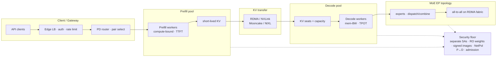

# Lesson 22 — AI/ML platform: prefill/decode disaggregation & MoE serving topology on the fleet

*2026-09-30*

## What interviewers are really probing

[Lesson 18](/lessons/18-gpu-node-pools-mig-timeslicing) gave you **SKU pools**. [Lesson 19](/lessons/19-gpu-topology-nvlink-rdma-nccl) made **NVLink / RDMA** schedulable. [Lesson 20](/lessons/20-training-inference-scheduling-kueue-volcano) admitted **train gangs** without half-placing them — and told you **not** to share those gangs with latency inference. [Lesson 21](/lessons/21-inference-serving-slos-ttft-tpot-kvcache) made **KV cache the capacity wallet** and taught TTFT / TPOT / goodput under continuous batching. This lesson is the **architecture** half of that serving contract: **when co-located prefill+decode fights for HBM and SMs, how do you disaggregate the pools, hand off KV over RDMA, and place MoE experts without melting the fabric — while keeping a security floor on every path?**

Interviewers at hyperscale AI platforms (fuel: [wafer-ai/gpu-perf-engineering-resources](https://github.com/wafer-ai/gpu-perf-engineering-resources)) want evidence you have **run PD-disaggregated and MoE serving under contention**, not only “we deploy vLLM”:

- **Why co-location hurts** — prefill is **compute-bound**; decode is **memory-bandwidth-bound**; they fight for HBM/SM; TTFT vs TPOT tension from [L21](/lessons/21-inference-serving-slos-ttft-tpot-kvcache)
- **Prefill/decode disaggregation** — separate pools/pods; KV transfer (RDMA / NVLink / offload); routing gateway; **independent capacity sizing**
- **KV handoff / locality** — Mooncake / DistServe-class patterns: transfer latency, replication, pin vs recompute
- **MoE serving topology** — expert parallelism (EP), expert placement across nodes/NICs, dispatch/combine all-to-all; capacity = active experts × (KV + weights); EP + DP + TP with [L19](/lessons/19-gpu-topology-nvlink-rdma-nccl) topology
- **Scheduling isolation** — prefill pools vs decode pools vs train gangs ([L20](/lessons/20-training-inference-scheduling-kueue-volcano)); flavors/taints; don’t mix bursty prefill with latency decode on the same HBM
- **Observability** — prefill queue / TTFT, decode TPOT, KV transfer latency, expert imbalance, RDMA errors
- **Security floor on every role** — separate SAs for prefill vs decode vs experts; RO weight mounts; signed images; NetPol on KV/EP fabric; admission/RBAC ([L11](/lessons/11-cluster-security-pss-admission-rbac)–[L14](/lessons/14-ml-inference-training-deploy-hardening), [L9](/lessons/09-networkpolicy-multi-nic-sflow), [L7](/lessons/07-edge-lb-ddos-armor-shield))

**Interview sentence:** “I split prefill and decode into independent pools so TTFT and TPOT stop fighting for the same HBM, hand off KV over RDMA with locality-aware placement, size MoE EP capacity as active experts × seats, isolate those pools from train gangs, and every serve SA is read-only on signed weights with NetPol locking the KV and expert fabric.”

## Core diagram: Client/Gateway → Prefill → KV (RDMA) → Decode (+ MoE EP, security floor)




**Read it left-to-right:** Clients hit an **edge gateway** (auth, abuse rate limits from [L7](/lessons/07-edge-lb-ddos-armor-shield)). A **PD router** picks a prefill↔decode pair (or MoE expert set) and admits work. **Prefill workers** burn SM cycles on long prompts and emit KV. That KV crosses a **dedicated transfer path** (RDMA / NVLink / Mooncake-class engine — not random East-West HTTP). **Decode workers** own the long-lived KV seats and stream tokens under TPOT. A **MoE side panel** adds expert parallelism: tokens dispatch/combine across experts on the RDMA fabric with topology constraints from [L19](/lessons/19-gpu-topology-nvlink-rdma-nccl). Everything sits on a **security floor**: separate read-only SAs, signed digests, NetPol locking P↔D and expert fabrics, admission on pool labels.

## Idiosyncrasies / operator depth

### 1. Why co-located prefill + decode fights for HBM / SM

| Phase | Bound | What it wants | How it hurts the other |
|---|---|---|---|
| **Prefill** | Compute (SM) | Fat batch of prompt tokens; high FLOPs | Steals SM/HBM bandwidth → **TPOT spikes** for in-flight decode |
| **Decode** | Memory bandwidth | Many concurrent sequences × KV seats | Keeps HBM full → **prefill TTFT** queues / truncates |
| **Co-located engine** | Coupled | One `max_num_seqs` / one HBM wallet | You **trade TTFT vs TPOT** every time traffic mix shifts ([L21](/lessons/21-inference-serving-slos-ttft-tpot-kvcache)) |


### 2. Prefill/decode disaggregation — operator shape

| Piece | Operator meaning |
|---|---|
| **Prefill pool** | Nodes/pods optimized for TTFT; may use different TP/DP/EP than decode |
| **Decode pool** | Nodes/pods optimized for TPOT + KV seats; long-lived streams |
| **KV transfer** | RDMA / NVLink / GPUDirect path; transfer latency is now part of **TTFT** |
| **Router / gateway** | Selects PD pair; retries; sticky decode for streaming; health on both sides |
| **Independent sizing** | Scale prefill on queue/TTFT; scale decode on KV util/TPOT — **different HPAs** |
| **Placement** | Bandwidth-aware: prefer same rail / NVLink domain for P↔D pairs ([L19](/lessons/19-gpu-topology-nvlink-rdma-nccl)) |


### 3. KV cache handoff / replication / locality (Mooncake / DistServe-class)

| Pattern | Operator use | Gotcha |
|---|---|---|
| **Direct P→D RDMA** | Lowest latency handoff after prefill | Needs healthy NICs, pinned memory, topology affinity |
| **Disaggregated KV store** | Mooncake-style DRAM/SSD pool; reuse prefixes across requests | Another failure domain; still RO from serve SAs |
| **Replicate / pin hot KV** | Decode locality; crash recovery of streams | Memory tax; eviction policy becomes SLO |
| **Recompute vs transfer** | Sometimes cheaper to re-prefill than cross a congested fabric | Measure transfer p99 vs recompute cost |
| **Chunked / pipelined transfer** | Overlap remaining prefill with early decode | Complexity in router + engine versions |


### 4. MoE serving topology — EP, placement, capacity

| Concept | Operator meaning |
|---|---|
| **Expert parallelism (EP)** | Experts sharded across ranks/nodes; tokens **dispatch** then **combine** |
| **All-to-all fabric** | Dispatch/combine rides RDMA (DeepEP / Mooncake-EP class) — congestion = TPOT |
| **Active experts × KV** | Capacity ≠ “GPU count”; it’s **routed experts in play** × seats + expert weight footprint |
| **EP + DP + TP** | Prefill often narrower EP; decode often **wider EP** for GroupGEMM density ([L19](/lessons/19-gpu-topology-nvlink-rdma-nccl)) |
| **Expert imbalance** | Hot experts starve TPOT; need EPLB / rebalance / admission |
| **Isolation** | Don’t run bursty prefill EP and latency decode EP on the same HBM island |


### 5. Scheduling: isolate prefill vs decode vs train ([L20](/lessons/20-training-inference-scheduling-kueue-volcano))

| Workload | Pool / queue | Why |
|---|---|---|
| **Prefill** | `pool=prefill` taints + Kueue flavor; TTFT PriorityClass | Bursty SM; must not steal decode HBM |
| **Decode** | `pool=decode` taints + flavor; latency PriorityClass | TPOT SLOs; long-lived KV |
| **MoE experts** | Same role pools **or** dedicated EP fabric nodes | Fabric congestion isolation |
| **Train gangs** | Exclusive gang CQ | Must not borrow inference HBM “for one more replica” |


### 6. Observability that interviewers expect

| Signal | Shape |
|---|---|
| **Prefill queue / TTFT** | Histograms + waiting depth on **prefill** pool |
| **Decode TPOT / KV util** | Histograms + free blocks on **decode** pool ([L21](/lessons/21-inference-serving-slos-ttft-tpot-kvcache)) |
| **KV transfer latency** | p50/p99 handoff; timeout / retry counters |
| **RDMA errors** | Link flaps, QP errors, GPUDirect failures |
| **Expert imbalance** | Tokens/expert skew; hot-expert queue |
| **All-to-all congestion** | NIC util, PFC/pause, NCCL/EP collective time |
| **Per-pool goodput** | Tokens under **both** TTFT and TPOT after disagg |


### 7. When *not* to disaggregate

| Situation | Prefer |
|---|---|
| Tiny models / short contexts / soft SLOs | Co-located continuous batching ([L21](/lessons/21-inference-serving-slos-ttft-tpot-kvcache)) |
| No RDMA / unreliable multi-NIC | Fix topology first ([L19](/lessons/19-gpu-topology-nvlink-rdma-nccl)) |
| Transfer p99 &gt; TTFT budget | Co-locate or same-rail placement; or recompute |
| Ops maturity missing (no dual HPA, no NetPol) | Don’t add failure domains you can’t page |


## Concrete commands & config

### Inspect prefill / decode / expert pools

```bash
# Pool nodes
kubectl get nodes -l pool=prefill -o wide
kubectl get nodes -l pool=decode -o wide
kubectl get nodes -l pool=moe-ep -o wide

# Workloads
kubectl get deploy,pods -n model-inference \
  -l 'role in (prefill,decode,moe-expert)' -o wide

# Pending under pressure (wrong taints / flavors)
kubectl get pods -n model-inference --field-selector=status.phase=Pending
kubectl describe pod -n model-inference -l role=prefill | sed -n '/Node-Selectors:/,/Events:/p'
```

### SGLang / vLLM-class PD disaggregation flags (shape)

```bash
# Prefill instance (shape — flag names drift by engine/version)
python -m sglang.launch_server \
  --model-path /models/deepseek-v3 \
  --disaggregation-mode prefill \
  --host 0.0.0.0 --port 30000 \
  --tp-size 8 \
  --trust-remote-code \
  --disaggregation-ib-device mlx5_bond_0 \
  --mem-fraction-static 0.85

# Decode instance
python -m sglang.launch_server \
  --model-path /models/deepseek-v3 \
  --disaggregation-mode decode \
  --host 0.0.0.0 --port 30000 \
  --tp-size 8 \
  --trust-remote-code \
  --disaggregation-ib-device mlx5_bond_0 \
  --mem-fraction-static 0.90

# MoE + EP (decode often wider EP) — interview vocabulary
#   --enable-dp-attention
#   --dp-size 8
#   --ep-size 64
#   --moe-a2a-backend deepep   # or mooncake-class backend
# Transfer backend talking points: Mooncake Transfer Engine, NIXL, NVLink path
```

### Deployment sketches: prefill + decode (RO weights, separate SAs)

```yaml
apiVersion: apps/v1
kind: Deployment
metadata:
  name: sglang-prefill
  namespace: model-inference
  labels:
    role: prefill
    trust-domain: inference-prod
spec:
  replicas: 4
  selector:
    matchLabels:
      role: prefill
  template:
    metadata:
      labels:
        role: prefill
        trust-domain: inference-prod
        pool: prefill
    spec:
      serviceAccountName: prefill-readonly
      runtimeClassName: nvidia
      nodeSelector:
        sku: h100
        pool: prefill
      tolerations:
        - key: pool
          value: prefill
          effect: NoSchedule
      containers:
        - name: sglang
          image: registry.example.com/ml/sglang@sha256:REPLACE_PREFILL
          args:
            - "--model-path=/models/deepseek-v3"
            - "--disaggregation-mode=prefill"
            - "--tp-size=8"
            - "--disaggregation-ib-device=mlx5_bond_0"
          resources:
            limits:
              nvidia.com/gpu: "8"
              memory: 512Gi
            requests:
              nvidia.com/gpu: "8"
              cpu: "32"
              memory: 512Gi
          volumeMounts:
            - name: weights
              mountPath: /models
              readOnly: true
          securityContext:
            allowPrivilegeEscalation: false
            readOnlyRootFilesystem: true
            capabilities:
              drop: ["ALL"]
      volumes:
        - name: weights
          persistentVolumeClaim:
            claimName: deepseek-v3-weights-ro
---
apiVersion: apps/v1
kind: Deployment
metadata:
  name: sglang-decode
  namespace: model-inference
  labels:
    role: decode
    trust-domain: inference-prod
spec:
  replicas: 8
  selector:
    matchLabels:
      role: decode
  template:
    metadata:
      labels:
        role: decode
        trust-domain: inference-prod
        pool: decode
    spec:
      serviceAccountName: decode-readonly
      runtimeClassName: nvidia
      nodeSelector:
        sku: h100
        pool: decode
      tolerations:
        - key: pool
          value: decode
          effect: NoSchedule
      containers:
        - name: sglang
          image: registry.example.com/ml/sglang@sha256:REPLACE_DECODE
          args:
            - "--model-path=/models/deepseek-v3"
            - "--disaggregation-mode=decode"
            - "--tp-size=8"
            - "--disaggregation-ib-device=mlx5_bond_0"
          resources:
            limits:
              nvidia.com/gpu: "8"
              memory: 512Gi
            requests:
              nvidia.com/gpu: "8"
              cpu: "32"
              memory: 512Gi
          volumeMounts:
            - name: weights
              mountPath: /models
              readOnly: true
          securityContext:
            allowPrivilegeEscalation: false
            readOnlyRootFilesystem: true
            capabilities:
              drop: ["ALL"]
      volumes:
        - name: weights
          persistentVolumeClaim:
            claimName: deepseek-v3-weights-ro
```

### Kueue flavors: prefill vs decode (isolation from train)

```yaml
apiVersion: kueue.x-k8s.io/v1beta1
kind: ResourceFlavor
metadata:
  name: gpu-prefill-h100
spec:
  nodeLabels:
    pool: prefill
    sku: h100
---
apiVersion: kueue.x-k8s.io/v1beta1
kind: ResourceFlavor
metadata:
  name: gpu-decode-h100
spec:
  nodeLabels:
    pool: decode
    sku: h100
---
# ClusterQueues (sketch): prefill-cq and decode-cq each bind their flavor.
# Train gang CQ must NOT borrow these flavors ([L20]).
```

### NetworkPolicy: prefill ↔ decode KV path only

```yaml
apiVersion: networking.k8s.io/v1
kind: NetworkPolicy
metadata:
  name: pd-default-deny
  namespace: model-inference
spec:
  podSelector: {}
  policyTypes: ["Ingress", "Egress"]
---
apiVersion: networking.k8s.io/v1
kind: NetworkPolicy
metadata:
  name: prefill-to-decode-kv
  namespace: model-inference
spec:
  podSelector:
    matchLabels:
      role: prefill
  policyTypes: ["Egress"]
  egress:
    - to:
        - podSelector:
            matchLabels:
              role: decode
      # App control plane + transfer ports — pin real ports in-cluster
      ports:
        - protocol: TCP
          port: 30000
    - to:
        # RDMA / RoCE data plane CIDR for KV transfer only ([L9])
        - ipBlock:
            cidr: 10.50.0.0/16
    - to:
        - namespaceSelector:
            matchLabels:
              role: dns
---
apiVersion: networking.k8s.io/v1
kind: NetworkPolicy
metadata:
  name: decode-from-prefill-kv
  namespace: model-inference
spec:
  podSelector:
    matchLabels:
      role: decode
  policyTypes: ["Ingress", "Egress"]
  ingress:
    - from:
        - podSelector:
            matchLabels:
              role: prefill
        - namespaceSelector:
            matchLabels:
              role: edge-gateway
  egress:
    - to:
        - podSelector:
            matchLabels:
              role: moe-expert
      ports:
        - protocol: TCP
          port: 30000
    - to:
        - ipBlock:
            cidr: 10.50.0.0/16   # RDMA fabric
    - to:
        - namespaceSelector:
            matchLabels:
              role: dns
# Explicitly NO path to train namespaces or weight-write Jobs
```

### Dual HPA: prefill on TTFT queue; decode on KV util

```yaml
apiVersion: autoscaling/v2
kind: HorizontalPodAutoscaler
metadata:
  name: sglang-prefill
  namespace: model-inference
spec:
  scaleTargetRef:
    apiVersion: apps/v1
    kind: Deployment
    name: sglang-prefill
  minReplicas: 4
  maxReplicas: 24
  metrics:
    - type: Pods
      pods:
        metric:
          name: prefill_waiting_requests
        target:
          type: AverageValue
          averageValue: "4"
    - type: Pods
      pods:
        metric:
          name: ttft_slo_burn_ratio
        target:
          type: AverageValue
          averageValue: "800m"
---
apiVersion: autoscaling/v2
kind: HorizontalPodAutoscaler
metadata:
  name: sglang-decode
  namespace: model-inference
spec:
  scaleTargetRef:
    apiVersion: apps/v1
    kind: Deployment
    name: sglang-decode
  minReplicas: 8
  maxReplicas: 48
  metrics:
    - type: Pods
      pods:
        metric:
          name: kv_cache_usage_ratio
        target:
          type: AverageValue
          averageValue: "750m"
    - type: Pods
      pods:
        metric:
          name: tpot_slo_burn_ratio
        target:
          type: AverageValue
          averageValue: "800m"
```

### Admission floor: role SA + pool + digest

```yaml
apiVersion: admissionregistration.k8s.io/v1
kind: ValidatingAdmissionPolicy
metadata:
  name: pd-serve-floor
spec:
  failurePolicy: Fail
  matchConstraints:
    resourceRules:
      - apiGroups: ["apps"]
        apiVersions: ["v1"]
        operations: ["CREATE", "UPDATE"]
        resources: ["deployments"]
  validations:
    - expression: >
        !has(object.metadata.labels) ||
        object.metadata.labels["trust-domain"] != "inference-prod" ||
        (
          object.metadata.labels["role"] == "prefill" &&
          object.spec.template.spec.serviceAccountName == "prefill-readonly"
        ) ||
        (
          object.metadata.labels["role"] == "decode" &&
          object.spec.template.spec.serviceAccountName == "decode-readonly"
        ) ||
        (
          object.metadata.labels["role"] == "moe-expert" &&
          object.spec.template.spec.serviceAccountName == "expert-readonly"
        )
      message: "inference-prod PD/MoE roles require matching *-readonly SA"
```

## Failures & fixes

| Symptom | Likely cause | Fix / mitigation |
|---|---|---|
| TTFT fine co-located; TPOT dies under load | Prefill steals SM/HBM from decode | Disaggregate; isolate pools; dual HPA |
| Decode starved / empty batches after split | Prefill under-provisioned or router imbalance | Scale prefill on queue/TTFT; sticky PD pairs |
| KV transfer stalls; streams hang | RDMA flap / wrong NIC / no GPUDirect | Pin IB device; topology affinity ([L19](/lessons/19-gpu-topology-nvlink-rdma-nccl)); timeout→recompute/failover |
| TTFT regresses after disagg | Transfer p99 ate the budget | Same-rail placement; Mooncake locality; measure handoff histogram |
| Expert hotspot; TPOT skew | Imbalanced routing / cold experts | EPLB; admit on hot-expert queue; wider EP carefully |
| MoE all-to-all congestion | EP fabric shared with train / wrong NIC | Dedicated RDMA CIDR; NetPol; isolate train gangs ([L20](/lessons/20-training-inference-scheduling-kueue-volcano)) |
| Prefill+decode co-scheduled on same node | Missing taints / shared flavor | Separate ResourceFlavors + taints; admit checks |
| Wrong SA on prefill pull path | Copied train or shared inference SA | `prefill-readonly` / `decode-readonly`; no PutObject ([L13](/lessons/13-ml-weights-checkpoint-hardening)) |
| Weight pull fails on one role only | Role SA missing GetObject / wrong WI | Per-role WI; audit; pull Job hydrates RO PVC |
| Unsigned decode image scaled out | Supply-chain gap on one role | Cosign both roles; digest pin; admission ([L12](/lessons/12-node-container-hardening-supply-chain)) |
| Lateral move prefill → train | NetPol too open | Default-deny; allow only P↔D RDMA CIDR + edge ([L9](/lessons/09-networkpolicy-multi-nic-sflow), [L14](/lessons/14-ml-inference-training-deploy-hardening)) |
| Edge open, both pools burning | No gateway rate limit | Armor/WAF per-tenant QPS ([L7](/lessons/07-edge-lb-ddos-armor-shield)) before PD admit |

## Security & hardening

**Disaggregation multiplies trust boundaries.** Prefill, decode, and MoE expert pods each hydrate weights, speak on an RDMA fabric, and sit next to customer traffic. A single shared `inference` SA with `s3:PutObject`, an unsigned decode image, or a world-routable expert fabric turns “better TTFT” into a **multi-tenant weight and lateral-move story**.

| Control | Why | Practice |
|---|---|---|
| **Separate SAs per role** | Prefill / decode / experts may hydrate differently; blast radius | `prefill-readonly`, `decode-readonly`, `expert-readonly`; never train SA on serve pods ([L14](/lessons/14-ml-inference-training-deploy-hardening)) |
| **RO weight mounts** | Serve must not mutate prod weights | PVC/CSI `readOnly: true`; WI **GetObject** only; **no PutObject** on any serve SA ([L13](/lessons/13-ml-weights-checkpoint-hardening)) |
| **Signed images + digest pin** | Both roles + experts are high-value | Private registry; cosign verify; `@sha256:` in Deployments; SBOM ([L12](/lessons/12-node-container-hardening-supply-chain)) |
| **Bucket IAM for pulls** | Steady-state dependency | Per-SA WI/IRSA; CMEK; deny public ACLs; separate pull Job for hydration |
| **Registries + provenance** | Weights *and* engine images for every role | Provenance attestations; block `:latest`; same floor for MoE expert images |
| **NetPol on KV path** | P↔D transfer is a privileged fabric | Allow prefill↔decode only on RDMA NIC/CIDR; deny train / weight-write ([L9](/lessons/09-networkpolicy-multi-nic-sflow)) |
| **MoE expert fabric** | All-to-all must not be world-open | Expert↔expert + decode only on fabric CIDR; same weight/registry floor |
| **Admission / RBAC / PSS** | Labels ≠ security | PSS restricted; VAP/Kyverno for role SA, RuntimeClass, digest, pool nodeSelector ([L11](/lessons/11-cluster-security-pss-admission-rbac)) |
| **Secrets** | HF tokens, router keys, tool creds | External Secrets / CSI; short-lived OIDC; never bake into images |
| **Edge rate limits** | Protect both pools’ goodput | Gateway auth + per-tenant QPS ([L7](/lessons/07-edge-lb-ddos-armor-shield)) before PD admission |
| **GPU / pool isolation** | MIG / exclusive / taints | Match [L18](/lessons/18-gpu-node-pools-mig-timeslicing) / [L20](/lessons/20-training-inference-scheduling-kueue-volcano); don’t silently share with train |

### AI/ML weight & registry hardening on PD / MoE paths (required)

| Scenario | Weight / registry controls |
|---|---|
| **Prefill cold start** | Digested prefill image + signed weights → RO volume via `prefill-readonly` WI |
| **Decode scale-out** | Digested decode image; same RO weights; **no** write IAM even if KV store attaches |
| **MoE expert add** | Expert image signed; same registry/bucket floor; EP NetPol before traffic |
| **KV store / Mooncake DRAM** | Treat as **another serve dependency** — RO from serve SAs; encrypt at rest; no public bind |
| **Model swap / canary** | New digests on **both** roles; router traffic split; rollback = prior digests |
| **Incident: suspected exfil** | Revoke role WI; fabric NetPol already default-deny; rotate API keys; audit GetObject |

```yaml
# Sketch: PD / MoE serving-path weight & image floor
apiVersion: policy.platform/v1
kind: MlServeGate
metadata:
  name: pd-moe-weight-floor
spec:
  match:
    labels:
      trust-domain: inference-prod
  require:
    imageDigestPin: true
    cosignVerify: true
    runtimeClass: nvidia
    roleServiceAccounts:
      prefill: prefill-readonly
      decode: decode-readonly
      moe-expert: expert-readonly
    workloadIdentity: true
    weightMountReadOnly: true
    weightBucketPublicAccess: false
    cmek: true
    serveSaPutObject: false
    trainSaOnServePods: false
    networkPolicy:
      defaultDeny: true
      allowKvPathCidr: "10.50.0.0/16"
      denyTrainNamespace: true
    edgeRateLimit: true
    apiKeyInImage: false
```

**Punchline:** Prefill/decode disaggregation and MoE EP are **capacity and topology** features. **Separate read-only SAs, signed digests on every role, CMEK GetObject-only WI, NetPol locking KV and expert fabrics, and admission on pool labels** are what stop a PD scale-out from becoming a fleet-wide weight breach.

## Interview soundbites

- **“Co-located prefill and decode share one HBM wallet — TTFT and TPOT will fight.”**
- **“Disagg = two pools + a KV transfer budget; size each on its own signal.”**
- **“KV handoff latency is part of TTFT — RDMA flaps are SLO pages.”**
- **“MoE capacity is active experts × seats, not GPU count vanity.”**
- **“Prefill EP and decode EP are different shapes — don’t mix them on one island.”**
- **“Train gangs, prefill, decode: three flavors, three NetPol stories.”**
- **“Separate SAs for prefill and decode; neither gets PutObject.”**
- **“Sign both role images; digest-pin the expert pods too.”**
- **“NetPol the RDMA CIDR — expert all-to-all is not the public internet.”**
- **“If the fabric can’t carry KV, don’t disaggregate for the résumé.”**
- **“Next: DCGM / NCCL observability and roofline capacity planning.”**

## How this maps to the JD

Hyperscale + AI/ML platform JDs that mention **inference serving, GPU fleets, MoE, and latency SLOs** are asking whether you can **operate disaggregated serving under fabric and capacity contention**: prefill vs decode pools, KV handoff over RDMA, MoE EP topology, isolation from train gangs, dual autoscaling, and a security floor on every role’s weight/image path. This lesson extends [L21](/lessons/21-inference-serving-slos-ttft-tpot-kvcache) (TTFT/TPOT/KV capacity) with [L19](/lessons/19-gpu-topology-nvlink-rdma-nccl) (RDMA/NVLink placement), [L20](/lessons/20-training-inference-scheduling-kueue-volcano) (pool isolation), [L9](/lessons/09-networkpolicy-multi-nic-sflow) / [L7](/lessons/07-edge-lb-ddos-armor-shield) (fabric + edge), and [L11](/lessons/11-cluster-security-pss-admission-rbac)–[L14](/lessons/14-ml-inference-training-deploy-hardening) (admission, supply chain, weights, deploy isolation). Fuel: [wafer-ai/gpu-perf-engineering-resources](https://github.com/wafer-ai/gpu-perf-engineering-resources). **Next up — Lesson 23:** GPU observability — DCGM, NCCL tests, roofline capacity planning.

## Watch (talks & demos)

Real talks — watch after Failures & fixes.

### DistServe — Disaggregating Prefill and Decoding (OSDI ’24)

The canonical academic/systems talk for PD disaggregation: why co-located prefill/decode interfere, how separate instances unlock independent TTFT vs TPOT optimization, and why KV-transfer bandwidth and placement become first-class. Operator takeaway: two pools + transfer budget, not one coupled Deployment.

<iframe width="100%" height="360" src="https://www.youtube.com/embed/WwJvecXOeUA" title="OSDI 24 DistServe Disaggregating Prefill and Decoding" frameBorder="0" allow="accelerometer; autoplay; clipboard-write; encrypted-media; gyroscope; picture-in-picture; web-share" allowFullScreen></iframe>

[Open on YouTube](https://www.youtube.com/watch?v=WwJvecXOeUA)

### Mooncake — KVCache-centric disaggregated architecture (FAST ’25)

Production-scale KV-centric disagg (Kimi / Moonshot): prefill/decode clusters plus a distributed KVCache pool over RDMA/DRAM/SSD. Operator takeaway: locality, transfer engine, and “trade storage for compute” when long-context TTFT burns.

<iframe width="100%" height="360" src="https://www.youtube.com/embed/-Lpx9QuCEsw" title="FAST 25 Mooncake KVCache-centric Architecture for LLM Serving" frameBorder="0" allow="accelerometer; autoplay; clipboard-write; encrypted-media; gyroscope; picture-in-picture; web-share" allowFullScreen></iframe>

[Open on YouTube](https://www.youtube.com/watch?v=-Lpx9QuCEsw)

### SGLang — PD disaggregation & large-scale expert parallelism

Liangsheng Yin (PyTorch): PD disaggregation, DeepSeek-class large-scale EP, DP attention, and transfer backends (Mooncake / NIXL) as shipped in an open serving stack. Operator takeaway: `--disaggregation-mode`, EP/DP/TP interplay, and why prefill vs decode use different dispatch shapes.

<iframe width="100%" height="360" src="https://www.youtube.com/embed/h8YDst5j5SA" title="SGLang Large-Scale LLM Serving - PD disaggregation and expert parallelism" frameBorder="0" allow="accelerometer; autoplay; clipboard-write; encrypted-media; gyroscope; picture-in-picture; web-share" allowFullScreen></iframe>

[Open on YouTube](https://www.youtube.com/watch?v=h8YDst5j5SA)

## References

- [DistServe (OSDI ’24) · arXiv:2401.09670](https://arxiv.org/abs/2401.09670) · [USENIX talk](https://www.usenix.org/conference/osdi24/presentation/zhong-yinmin) · [LLMServe/DistServe](https://github.com/LLMServe/DistServe)
- [Mooncake (FAST ’25)](https://www.usenix.org/conference/fast25/presentation/qin) · [kvcache-ai/Mooncake](https://github.com/kvcache-ai/Mooncake) · [Mooncake docs](https://kvcache-ai.github.io/Mooncake/)
- [SGLang PD disaggregation](https://docs.sglang.ai/) · [LMSYS: DeepSeek PD + large-scale EP on 96×H100](https://www.lmsys.org/blog/2025-05-05-large-scale-ep/)
- [vLLM](https://docs.vllm.ai/) · [Splitwise (related PD work)](https://arxiv.org/abs/2311.18677)
- [wafer-ai/gpu-perf-engineering-resources](https://github.com/wafer-ai/gpu-perf-engineering-resources) — GPU fleets / serving / topology fuel
- Prior: [21 — Inference serving SLOs](/lessons/21-inference-serving-slos-ttft-tpot-kvcache) · [20 — Training/inference scheduling](/lessons/20-training-inference-scheduling-kueue-volcano) · [19 — GPU topology](/lessons/19-gpu-topology-nvlink-rdma-nccl) · [18 — GPU node pools](/lessons/18-gpu-node-pools-mig-timeslicing) · [14 — ML deploy hardening](/lessons/14-ml-inference-training-deploy-hardening) · [13 — ML weights](/lessons/13-ml-weights-checkpoint-hardening) · [12 — Node/container hardening](/lessons/12-node-container-hardening-supply-chain) · [11 — Cluster security](/lessons/11-cluster-security-pss-admission-rbac) · [09 — NetworkPolicy](/lessons/09-networkpolicy-multi-nic-sflow) · [07 — Edge LB / DDoS](/lessons/07-edge-lb-ddos-armor-shield)
- Next: **Lesson 23 — GPU observability — DCGM, NCCL tests, roofline capacity planning**

## Quick self-check

Out loud, in under two minutes:

1. Why do co-located prefill and decode fight — and how does that create TTFT vs TPOT tension?
2. What are the moving parts of PD disaggregation (pools, KV transfer, router) and how do you size each?
3. Name three KV handoff patterns and when you’d recompute instead of transfer.
4. How do you express MoE capacity (active experts × seats) and EP + DP + TP interplay with topology?
5. How do you isolate prefill vs decode vs train in Kueue/taints — and which dual HPA signals?
6. List four security controls specific to PD/MoE paths — including separate SAs, NetPol on RDMA CIDR, and why serve SAs never PutObject.
