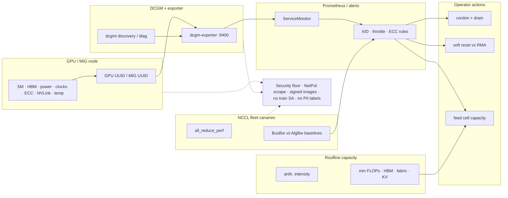

# Lesson 23 — AI/ML platform: GPU observability — DCGM, NCCL tests, roofline capacity planning

*2026-10-01*

## What interviewers are really probing

[Lesson 18](/lessons/18-gpu-node-pools-mig-timeslicing) gave you **SKU pools**. [Lesson 19](/lessons/19-gpu-topology-nvlink-rdma-nccl) made **NVLink / RDMA / NCCL** schedulable. [Lesson 20](/lessons/20-training-inference-scheduling-kueue-volcano) admitted **gangs** without half-placing them. [Lesson 21](/lessons/21-inference-serving-slos-ttft-tpot-kvcache) made **KV cache the capacity wallet** and taught TTFT / TPOT / goodput. [Lesson 22](/lessons/22-prefill-decode-disagg-moe-serving) split **prefill vs decode** and placed **MoE EP** on the fabric. This lesson is the **eyes and measuring stick**: **how do you know a GPU is sick, a rail is lying, or a cell is off the roof — and how do you turn that into cordon/drain, canaries, and capacity plans without opening a security hole on every scrape path?**

Interviewers at hyperscale AI platforms (fuel: [wafer-ai/gpu-perf-engineering-resources](https://github.com/wafer-ai/gpu-perf-engineering-resources)) want evidence you have **operated GPU observability under fleet failure**, not only “we installed dcgm-exporter”:

- **DCGM / dcgm-exporter** — field groups, XID / NVML, SM / HBM / power / clocks / ECC / NVLink / temp / throttle; DaemonSet + Prometheus; join to node / GPU UUID / MIG UUID
- **Health / remediation loops** — XID 79/48/etc → cordon + drain; soft reset vs RMA; MIG partition health
- **NCCL tests as fleet canaries** — `all_reduce_perf`; BusBw vs AlgBw; when to run (join, NIC flap, nightly); topology baselines from [L19](/lessons/19-gpu-topology-nvlink-rdma-nccl)
- **Roofline / capacity planning** — arithmetic intensity; HBM BW vs FLOPs roofs (H100/H200-class); map prefill (compute) vs decode (mem-BW) from [L21](/lessons/21-inference-serving-slos-ttft-tpot-kvcache)/[L22](/lessons/22-prefill-decode-disagg-moe-serving); cell capacity = min(FLOPs, HBM BW, NVLink/RDMA, KV seats)
- **Stitched stack** — DCGM (silicon) + NCCL canaries (fabric) + app SLOs (TTFT/TPOT) + PD/MoE transfer metrics
- **Security floor** — who scrapes metrics; no PII / model IDs in labels; NCCL test privilege; signed images; NetPol / RBAC; no train SA on obs pods; RO weights still apply beside serve

**Interview sentence:** “I run dcgm-exporter on every GPU node with UUID joins into Prometheus, page on XID and throttle into cordon/drain with soft-reset vs RMA policy, keep NCCL all_reduce_perf canaries as fabric baselines per topology, place prefill and decode on the roofline with DCGM + load tests, and size each cell as min(FLOPs, HBM BW, fabric, KV seats) — with NetPol, signed DCGM images, and zero train SA on obs or canary pods.”

## Core diagram: GPU → DCGM → Prometheus → ops (+ NCCL canary, roofline, security floor)




**Read it left-to-right, then the parallel paths:** Every GPU node exposes silicon state through **DCGM** (embedded or host-engine) and **dcgm-exporter** on `:9400`. Prometheus scrapes with **GPU UUID / MIG UUID / node** joins. Alerts drive **cordon + drain**, **soft reset vs RMA**, and **capacity** updates. In parallel, **NCCL canaries** (`all_reduce_perf`) validate fabric BusBw against [L19](/lessons/19-gpu-topology-nvlink-rdma-nccl) baselines. A **roofline panel** places prefill vs decode and caps cell admit as **min(FLOPs, HBM BW, NVLink/RDMA, KV seats)**. Everything sits on a **security floor**: NetPol on scrape, signed nvidia/dcgm images, privilege floor on diagnostic Jobs, no train SA, no tenant PII in metric labels.

## Idiosyncrasies / operator depth

### 1. DCGM vs nvidia-smi vs NVML — what each is for

| Tool | Operator use | Gotcha |
|---|---|---|
| **nvidia-smi** | Human snapshot; quick “is it on fire?” | Not a scrape API; don’t SSH-loop it as monitoring |
| **NVML** | Library under smi / many agents | Process-local; not fleet health by itself |
| **DCGM** | Cluster GPU manager: groups, health, diagnostics, policies | Needs consistent driver / DCGM version story |
| **dcgm-exporter** | Prometheus exposition of DCGM fields | Field groups matter; profiling metrics cost cycles on older arches |

### 2. Field groups that interviewers expect you to name

| Domain | Example fields / signals | Why you page |
|---|---|---|
| **Utilization** | SM util, memory util, tensor/FP activity (profiling) | Idle GPUs with pending work = scheduler/placement bug |
| **Memory** | HBM used/free, ECC SEBE/DBE | Decode capacity + silent data corruption risk |
| **Clocks / power** | SM/mem clocks, power draw, power limit | Unexpected throttle → TPOT / train step-time |
| **Thermals** | GPU temp, slowdown / thermal throttle flags | Cooling / rack issue masquerading as “model regressed” |
| **Interconnect** | NVLink / NVSwitch throughput & errors | MoE EP and TP collectives ([L19](/lessons/19-gpu-topology-nvlink-rdma-nccl), [L22](/lessons/22-prefill-decode-disagg-moe-serving)) |
| **Health** | XID counters, NVML events, retired pages | Hardware / driver faults → drain before customer SLOs die |
| **Identity** | GPU UUID, MIG UUID, device index | Join key for multi-tenant cells; never confuse indices across reboots |

### 3. Joining metrics — the fleet hygiene most people skip

| Join key | Use |
|---|---|
| `Hostname` / K8s `node` | Map exporter → node; cordon target |
| `UUID` (GPU) | Stable across container restarts; preferred over index |
| `GPU_I_ID` / MIG UUID | MIG partition health ([L18](/lessons/18-gpu-node-pools-mig-timeslicing)) |
| `pod` / `namespace` (exporter Kubernetes mode) | Attribute util to workload — carefully (cardinality!) |
| `pool=prefill\|decode\|train` | Capacity and SLO burn by pool ([L20](/lessons/20-training-inference-scheduling-kueue-volcano)–[L22](/lessons/22-prefill-decode-disagg-moe-serving)) |

**Gotcha:** High-cardinality labels (request IDs, user IDs, raw model names per tenant) will melt Prometheus and leak identity. Keep **pool + digest short-hash + UUID**; put tenant detail in logs/traces with access control — not in DCGM labels.

### 4. XID / health remediation — operator playbook

| Signal | Typical meaning | First response |
|---|---|---|
| **XID 79** (GPU fallen off bus / ECC storm class — confirm against current NVIDIA XID table) | Serious HW / ECC path | Cordon → drain → quarantine; open RMA path |
| **XID 48** / DBE class | Double-bit ECC | Drain; do not keep serving on that GPU |
| **XID 13 / 31 / 43** (illegal / MMU / etc — confirm live docs) | Often app/driver; sometimes HW | Correlate with workload + driver version; isolate MIG if partitioned |
| **NVML health fails** | Device plugin / GPU Operator marks unhealthy | Trust the unhealthy taint; don’t force-schedule |
| **Thermal / power throttle** | Cooling or power-cap | Fix rack/power policy before blaming the model |
| **MIG instance unhealthy** | One partition, not whole GPU | Quarantine MIG UUID; keep sibling instances only if policy allows |

**Soft reset vs RMA:** Soft reset / node recycle is for **transient** driver/app faults after root-cause. Recurring XID on the same UUID after reset → **RMA / host replace**, not “reboot until green.” Interviewers listen for that distinction.

### 5. NCCL tests as fleet canaries (not a one-off bench)

| Practice | Operator meaning |
|---|---|
| **When** | Node join / reclaim; after NIC flap or driver upgrade; nightly fabric sweep; before admitting a new topology SKU |
| **What** | `all_reduce_perf` (plus all_gather / reduce_scatter when EP-heavy) |
| **BusBw vs AlgBw** | **BusBw** ≈ hardware-comparable (corrected); **AlgBw** = app-visible; compare BusBw to NVLink/IB peak × efficiency |
| **Single-node** | Validates NVLink / P2P island |
| **Multi-node** | Validates RDMA path + `NCCL_IB_HCA` selection ([L19](/lessons/19-gpu-topology-nvlink-rdma-nccl)) |
| **Baseline** | Per SKU × topology class; alert on **regression %**, not absolute magic numbers |
| **Privilege** | Canary Job needs GPUs + often IB devices — **privilege floor** (below), never train WI |

### 6. Roofline for platform engineers (not CUDA kernel authors)

| Idea | Platform translation |
|---|---|
| **Arithmetic intensity** | FLOPs / bytes moved from HBM (approx.) |
| **Memory roof** | Performance ≤ HBM bandwidth × intensity |
| **Compute roof** | Performance ≤ peak FLOPs (dtype / Tensor Core dependent) |
| **Ridge point** | peak FLOPs / peak HBM BW — left = mem-bound, right = compute-bound |
| **Prefill ([L21](/lessons/21-inference-serving-slos-ttft-tpot-kvcache)/[L22](/lessons/22-prefill-decode-disagg-moe-serving))** | Often **compute-bound** (fat prompt GEMMs) → watch SM util + power |
| **Decode** | Often **HBM / KV-bound** → watch mem BW util + KV seats, not SM vanity |
| **Cell capacity** | **min(FLOPs headroom, HBM BW headroom, NVLink/RDMA headroom, KV seats)** |

**H100/H200-class talking numbers (order-of-magnitude for interviews — always cite your SKU datasheet):** HBM roofs land in the **~3 TB/s** class; dense Tensor FLOPs are far higher → ridge sits at **high intensity**. Decode traffic lives left of the ridge; big prefill batches push right. Use DCGM SM vs memory util **plus** load-test points to see where the job sits — then size pools accordingly.

### 7. Stitching the observability stack

| Layer | Signal | Action |
|---|---|---|
| **Silicon (DCGM)** | XID, ECC, throttle, NVLink errors | Cordon / RMA / cooling |
| **Fabric (NCCL canaries)** | BusBw regress, init hangs | Quarantine NIC/rail; fix `NCCL_IB_HCA` |
| **App SLOs ([L21](/lessons/21-inference-serving-slos-ttft-tpot-kvcache))** | TTFT / TPOT / goodput burn | Scale pool; shed load |
| **PD / MoE ([L22](/lessons/22-prefill-decode-disagg-moe-serving))** | KV transfer latency, expert imbalance | Placement / EP rebalance |
| **Capacity** | Roofline + KV seats + fabric | Admit / cell plan / HPA ceilings |

### 8. Profiling metrics cost & MIG exporter idiosyncrasies

| Gotcha | Operator note |
|---|---|
| **Profiling fields** (SM occupancy, Tensor util, NVLink bandwidth histograms) | On Ampere-and-earlier, some need proprietary DCGM packages / higher collection cost — sample slower in huge fleets |
| **Collection interval** | 1s looks great in demos; 10–30s is often the fleet default; page latency ≠ scrape latency |
| **Embedded vs remote host-engine** | DGX-class images may already run `nv-hostengine` — point exporter at it to avoid dual engines fighting |
| **MIG metrics** | Exporter publishes **full GPU + MIG instances**; alerts must key on MIG UUID or you cordon the wrong blast radius |
| **Device plugin unhealthy** | GPU Operator / device plugin may taint before your Prometheus rule fires — trust both; don’t race uncordon |
| **Clock throttle reasons** | Bitfield: thermal vs power vs app clocks — misreading it sends the wrong on-call (facilities vs platform) |

### 9. Capacity planning loop (weekly cell review)

1. **Pull** p95 SM util, HBM util, power, NVLink/IB BW, KV seat util, TTFT/TPOT burn by pool.
2. **Place** representative prefill and decode load tests on the roofline (intensity × achieved FLOPs/BW).
3. **Compute** headroom: FLOPs, HBM, fabric, KV seats — take the **min**.
4. **Decide**: scale pool, move PD ratio ([L22](/lessons/22-prefill-decode-disagg-moe-serving)), rebalance MoE EP, or open a new cell (fleet vocabulary from [L1](/lessons/01-hyperscale-mental-model) — full multi-cluster routing in Lesson 24).
5. **Gate**: no cell expansion without green NCCL canary baseline for that SKU×topology.

### 10. Interview trap — “utilization” vanity

An idle-looking decode GPU at 15% SM with **95% HBM** is often **healthy and full**. A prefill GPU at **95% SM** with rising TTFT queue may still need **more prefill replicas**, not “optimize the kernel.” Platform interviews punish SM-only dashboards; reward **bound-aware** reading of DCGM + SLOs together.

## Concrete commands & config

### Host / node: nvidia-smi + dcgmi

```bash
# Snapshot (human)
nvidia-smi -q -d UTILIZATION,MEMORY,POWER,CLOCK,TEMPERATURE,ECC,PAGE_RETIREMENT
nvidia-smi -L   # UUID list — prefer UUID over index in runbooks

# DCGM discovery / health (on node with dcgmi)
dcgmi discovery -l
dcgmi health --set max
dcgmi health --check
dcgmi diag -r 1          # short diagnostic rung; escalate rungs carefully in prod
dcgmi groups --list

# Watch XIDs in kernel log (correlate with DCGM_FI_DEV_XID_ERRORS)
dmesg -T | rg -i 'xid|nvrm|nvidia'
journalctl -k -g 'Xid' --since '1 hour ago'
```

### dcgm-exporter quick check

```bash
# GPU Operator / Helm usually runs this as a DaemonSet
kubectl -n gpu-operator get pods -l app=nvidia-dcgm-exporter -o wide
kubectl -n gpu-operator port-forward ds/nvidia-dcgm-exporter 9400:9400
curl -s localhost:9400/metrics | rg 'DCGM_FI_DEV_(GPU_UTIL|FB_USED|POWER_USAGE|XID|NVLINK)'

# Confirm Kubernetes pod mapping labels if enabled
curl -s localhost:9400/metrics | rg 'pod=|namespace=|UUID='
```

### Helm / values sketch (dcgm-exporter)

```yaml
# Shape only — pin digests in real values; prefer GPU Operator when it already owns the stack
dcgmExporter:
  enabled: true
  repository: nvcr.io/nvidia/k8s/dcgm-exporter
  version: "4.1.1-4.4.1-ubuntu22.04"   # example pin — replace with current signed digest
  service:
    enable: true
    port: 9400
  env:
    - name: DCGM_EXPORTER_KUBERNETES
      value: "true"
    - name: DCGM_EXPORTER_INTERVAL
      value: "10000"   # ms; balance freshness vs cost
  # Prefer RuntimeClass + PSS; avoid blanket privileged when GPU Operator patterns allow
  securityContext:
    allowPrivilegeEscalation: false
    readOnlyRootFilesystem: true
    capabilities:
      drop: ["ALL"]
      # SYS_ADMIN historically required for some DCGM paths — gate via RuntimeClass + admission
  resources:
    requests:
      cpu: 100m
      memory: 128Mi
```

### ServiceMonitor + PrometheusRule sketches

```yaml
apiVersion: monitoring.coreos.com/v1
kind: ServiceMonitor
metadata:
  name: dcgm-exporter
  namespace: gpu-operator
  labels:
    release: kube-prometheus
spec:
  selector:
    matchLabels:
      app: nvidia-dcgm-exporter
  namespaceSelector:
    matchNames: ["gpu-operator"]
  endpoints:
    - port: metrics
      interval: 15s
      honorLabels: true
      relabelings:
        # Keep joins lean — drop high-cardinality pod labels if cardinality burns
        - action: labeldrop
          regex: "(container|endpoint|service)"
---
apiVersion: monitoring.coreos.com/v1
kind: PrometheusRule
metadata:
  name: gpu-dcgm-health
  namespace: gpu-operator
spec:
  groups:
    - name: dcgm-health
      rules:
        - alert: GpuXidErrors
          expr: increase(DCGM_FI_DEV_XID_ERRORS[5m]) > 0
          for: 0m
          labels:
            severity: page
          annotations:
            summary: "GPU XID on {{ $labels.Hostname }} UUID={{ $labels.UUID }}"
            runbook: "cordon node → drain → quarantine UUID → soft-reset vs RMA"
        - alert: GpuThermalThrottle
          expr: DCGM_FI_DEV_CLOCK_THROTTLE_REASONS_HW_THERMAL > 0
          for: 5m
          labels:
            severity: ticket
          annotations:
            summary: "Thermal throttle {{ $labels.Hostname }} {{ $labels.UUID }}"
        - alert: GpuEccDbe
          expr: increase(DCGM_FI_DEV_ECC_DBE_VOL_TOTAL[15m]) > 0
          for: 0m
          labels:
            severity: page
          annotations:
            summary: "DBE ECC {{ $labels.UUID }} — drain / RMA path"
```

### Remediation loop (cordon / drain)

```bash
NODE=gpu-node-17
UUID=GPU-xxxxxxxx-xxxx-xxxx-xxxx-xxxxxxxxxxxx

# 1) Cordon immediately on page
kubectl cordon "$NODE"

# 2) Drain inference carefully (respect PD / MoE disruption budgets from L22)
kubectl drain "$NODE" --ignore-daemonsets --delete-emptydir-data \
  --grace-period=120 --timeout=15m

# 3) Quarantine label for scheduler / device plugin policy
kubectl label node "$NODE" gpu.quarantine/uuid="$UUID" gpu.quarantine/reason=xid --overwrite

# 4) Ticket: soft reset once if policy allows; else host RMA
# 5) After return-to-service: NCCL canary MUST pass before uncordon for train/serve
```

### NCCL canary — all_reduce_perf

```bash
# Single-node NVLink island (8 GPUs)
mpirun -np 8 ./build/all_reduce_perf -b 8 -e 8G -f 2 -g 1

# Multi-node RDMA (example: 4 nodes × 8 GPUs)
mpirun -np 32 -N 8 \
  -x NCCL_DEBUG=INFO \
  -x NCCL_DEBUG_SUBSYS=INIT,NET,GRAPH \
  -x NCCL_IB_HCA=mlx5_bond_0 \
  -x NCCL_NET_GDR_LEVEL=PHB \
  ./build/all_reduce_perf -b 8 -e 8G -f 2 -g 1

# Interpreting output (see NVIDIA/nccl-tests PERFORMANCE.md):
#   out-of-place/in-place time(us)  algbw(GB/s)  busbw(GB/s)
# Compare **busbw** to topology baseline (NVLink vs IB peak × efficiency).
# AlgBw is what the collective “looks like”; BusBw is hardware-comparable.
```

```yaml
# Canary Job sketch — privilege floor, no weights, no train SA
apiVersion: batch/v1
kind: Job
metadata:
  name: nccl-canary-rail-a
  namespace: gpu-observability
  labels:
    role: nccl-canary
    trust-domain: obs-prod
spec:
  backoffLimit: 0
  template:
    metadata:
      labels:
        role: nccl-canary
        trust-domain: obs-prod
    spec:
      serviceAccountName: nccl-canary   # NOT train-sa / NOT inference WI with PutObject
      runtimeClassName: nvidia
      restartPolicy: Never
      nodeSelector:
        pool: fabric-canary
      tolerations:
        - key: nvidia.com/gpu
          operator: Exists
          effect: NoSchedule
      containers:
        - name: all-reduce
          image: registry.example.com/nccl-tests@sha256:REPLACE
          command: ["/bin/bash", "-lc"]
          args:
            - |
              set -euo pipefail
              export NCCL_DEBUG=WARN
              export NCCL_IB_HCA=mlx5_bond_0
              ./build/all_reduce_perf -b 8 -e 4G -f 2 -g 1 | tee /reports/out.txt
          resources:
            limits:
              nvidia.com/gpu: 8
          securityContext:
            allowPrivilegeEscalation: false
            readOnlyRootFilesystem: true
            capabilities:
              drop: ["ALL"]
          volumeMounts:
            - name: reports
              mountPath: /reports
            # Explicitly NO /models weight mounts
      volumes:
        - name: reports
          emptyDir: {}
```

### NetPol + Kyverno/VAP sketches for obs privilege floor

```yaml
apiVersion: networking.k8s.io/v1
kind: NetworkPolicy
metadata:
  name: dcgm-scrape-allow
  namespace: gpu-operator
spec:
  podSelector:
    matchLabels:
      app: nvidia-dcgm-exporter
  policyTypes: ["Ingress", "Egress"]
  ingress:
    - from:
        - namespaceSelector:
            matchLabels:
              role: metrics
          podSelector:
            matchLabels:
              app: prometheus
      ports:
        - protocol: TCP
          port: 9400
  egress:
    - to:
        - namespaceSelector:
            matchLabels:
              role: dns
# No path to model-inference weight buckets or train namespaces
---
apiVersion: admissionregistration.k8s.io/v1
kind: ValidatingAdmissionPolicy
metadata:
  name: obs-privilege-floor
spec:
  failurePolicy: Fail
  matchConstraints:
    resourceRules:
      - apiGroups: ["apps", "batch"]
        apiVersions: ["v1"]
        operations: ["CREATE", "UPDATE"]
        resources: ["daemonsets", "jobs", "deployments"]
  validations:
    - expression: >
        !has(object.metadata.labels) ||
        object.metadata.labels["trust-domain"] != "obs-prod" ||
        (
          object.spec.template.spec.serviceAccountName in
            ["dcgm-exporter", "nccl-canary", "gpu-metrics-reader"] &&
          !object.spec.template.spec.serviceAccountName.startsWith("train")
        )
      message: "obs-prod workloads must use obs SAs — never train SA"
```

### Roofline / capacity quick math (runbook scratch)

```bash
# Order-of-magnitude cell headroom (replace with SKU datasheet numbers)
# peak_flops_tf = 989      # example H100 SXM BF16 dense-ish talking point — verify your SKU
# hbm_tib_s     = 3.35
# ridge         = peak_flops_tf / hbm_tib_s   # FLOPs/byte scale after unit normalize
#
# From DCGM during load test:
#   sm_util, mem_util, power, nvlink_bw, nic_bw
# Prefill pool: expect high SM + high power; if SM low + TTFT bad → placement / batching
# Decode pool: expect high mem util; if SM high + TPOT bad → contention / wrong co-location (L22)
#
# Cell admit ceiling:
#   capacity = min(flops_headroom, hbm_headroom, fabric_headroom, kv_seats_free)
```

## Failures & fixes

| Symptom | Likely cause | Fix / mitigation |
|---|---|---|
| Silent TPOT regression; GPUs “look fine” in smi once/day | No continuous DCGM scrape / wrong field group | Deploy dcgm-exporter; alert on throttle + mem util; join UUID |
| Pages on random nodes nightly | XID / ECC without remediation loop | Cordon+drain automation; quarantine UUID; RMA policy |
| Same UUID flaps after reboot | HW fault treated as soft | Stop soft-reset loops; RMA / host replace |
| MIG workload dies; sibling MIGs OK | Partition-level fault | Quarantine MIG UUID; don’t drain whole node blindly ([L18](/lessons/18-gpu-node-pools-mig-timeslicing)) |
| NCCL init hang after NIC maintenance | Wrong `NCCL_IB_HCA` / GDR path | Canary on reclaim; pin HCA; topology check ([L19](/lessons/19-gpu-topology-nvlink-rdma-nccl)) |
| BusBw 40% of baseline; AlgBw “ok-ish” | Fabric congestion / PFC / miswired rail | Compare BusBw; quarantine rail; don’t trust AlgBw alone |
| Prefill pool “underutilized” SM but TTFT burns | Waiting on KV transfer / router ([L22](/lessons/22-prefill-decode-disagg-moe-serving)) | Stitch PD metrics; don’t only scale on SM util |
| Decode SM low, TPOT burns | Expected mem-BW bound — or KV exhaustion | Check HBM/KV seats ([L21](/lessons/21-inference-serving-slos-ttft-tpot-kvcache)); roofline placement |
| Prometheus OOM / huge bills | High-cardinality pod/tenant labels on DCGM | Labeldrop; hash digests; no user IDs in metrics |
| Metrics open to whole cluster | Missing NetPol on `:9400` | Scrape-path NetPol; optional mTLS mesh ([L9](/lessons/09-networkpolicy-multi-nic-sflow), [L10](/lessons/10-service-mesh-istio-linkerd-mtls)) |
| Canary Job mounts prod weights | Copied serve pod template | No weight mounts; canary SA only; admission floor |
| Obs DaemonSet uses `train-sa` | Convenience anti-pattern | Separate `dcgm-exporter` / `nccl-canary` SAs; VAP deny train SA |
| Unsigned dcgm-exporter `:latest` | Supply-chain gap | Digest pin + cosign ([L12](/lessons/12-node-container-hardening-supply-chain)) |
| Long-term metrics in public bucket | “Debug dump” without IAM | CMEK + private bucket + GetObject least privilege ([L13](/lessons/13-ml-weights-checkpoint-hardening)) |

## Security & hardening

**Observability agents sit beside the most valuable workloads you have.** A world-readable `:9400`, a privileged NCCL “just for tonight” DaemonSet, or a train SA on an exporter turns telemetry into a **tenant map, model-inventory leak, and privilege trampoline**. Treat DCGM and canaries as production trust domains — same spirit as [L11](/lessons/11-cluster-security-pss-admission-rbac)–[L14](/lessons/14-ml-inference-training-deploy-hardening).

| Control | Why | Practice |
|---|---|---|
| **Who scrapes DCGM** | Metrics reveal util, SKU, sometimes pod/model labels | NetPol: only Prometheus / metrics ns → `:9400`; deny train & app namespaces |
| **Label hygiene (PII / model IDs)** | Cardinality + privacy + competitive intel | No user IDs, prompt hashes, or raw model names; use pool + short digest + UUID |
| **Tenant labels** | Multi-tenant cells leak occupancy patterns | Aggregate; gate detailed joins behind ACLed systems, not public Grafana |
| **NCCL test privilege** | Needs GPUs / IB — easy to over-privilege | Dedicated SA; drop caps; no hostPath weights; time-bounded Jobs; RuntimeClass |
| **RuntimeClass + admission** | Diagnostic DaemonSets love `privileged: true` | PSS restricted baseline; VAP/Kyverno privilege floor for `trust-domain=obs-prod` |
| **Signed nvidia/dcgm images** | Exporter is on every GPU node | Private mirror; cosign verify; digest pin; SBOM ([L12](/lessons/12-node-container-hardening-supply-chain)) |
| **RBAC for exporters** | K8s mode may need pod list/watch | Minimal Role; no secrets get; no exec into serve pods |
| **No train SA on obs pods** | Train WI often has PutObject / broad storage | `dcgm-exporter`, `nccl-canary`, `gpu-metrics-reader` only |
| **RO weights still apply** | Obs sidecars next to serve must not widen write path | If any agent shares a node with serve: still **no** writable weight mounts; serve SAs stay GetObject-only ([L13](/lessons/13-ml-weights-checkpoint-hardening)) |
| **Bucket IAM for metric archives** | Long-term Prom remote-write / debug dumps | Private bucket; CMEK; least-privilege writers; no public ACLs |
| **NetPol on scrape + canary** | Lateral movement via “monitoring” | Default-deny in `gpu-operator` / `gpu-observability`; allow DNS + scrape + canary fabric CIDR only ([L9](/lessons/09-networkpolicy-multi-nic-sflow)) |
| **Secrets** | Grafana admin, remote-write tokens | External Secrets / CSI; rotate; never bake into exporter images |

### AI/ML weight, model & deployment hardening beside observability (required)

Observability does **not** relax the weight/deploy floor from [L13](/lessons/13-ml-weights-checkpoint-hardening)/[L14](/lessons/14-ml-inference-training-deploy-hardening). Prefill/decode/MoE pods still hydrate **signed weights** on **RO mounts** with **GetObject-only** WI. Exporters and NCCL canaries must **not** gain train PutObject, must **not** mount `/models` “for debugging,” and must **not** share serve SAs. If you scrape pod labels, prefer **image digest short-hash** over marketing model names. Deployment admission still requires RuntimeClass, digest pins, and pool nodeSelectors — including for diagnostic DaemonSets that “only read metrics.”

| Scenario | Weight / model / deploy controls |
|---|---|
| **dcgm-exporter roll** | Signed digest; no volume mounts to weight PVCs; obs SA only |
| **NCCL canary on serve rails** | No weight mounts; fabric CIDR only; results to private report bucket |
| **Grafana dashboard share** | Strip tenant / model labels; ACLed folders; no public anonymous org |
| **Incident: suspected metric exfil** | Revoke scrape NetPol; rotate remote-write creds; audit label configs |
| **Obs agent on same node as serve** | PSS + RuntimeClass unchanged; RO weights on serve; obs cannot write checkpoints |
| **Model swap canary** | App SLO + DCGM + NCCL baselines before declaring the cell healthy |

```yaml
# Sketch: observability-path security floor (platform CR shape)
apiVersion: policy.platform/v1
kind: GpuObsGate
metadata:
  name: dcgm-nccl-floor
spec:
  match:
    labels:
      trust-domain: obs-prod
  require:
    imageDigestPin: true
    cosignVerify: true
    runtimeClass: nvidia
    allowedServiceAccounts: ["dcgm-exporter", "nccl-canary", "gpu-metrics-reader"]
    trainSaOnObsPods: false
    weightMountAllowed: false
    metricLabelAllowlist: ["Hostname", "UUID", "device", "pool", "model_digest_short"]
    metricLabelDenylist: ["user_id", "tenant_email", "prompt_hash", "raw_model_name"]
    networkPolicy:
      defaultDeny: true
      allowScrapeFrom: ["namespace:metrics"]
      allowCanaryFabricCidr: "10.50.0.0/16"
    metricsArchive:
      publicAccess: false
      cmek: true
      putObjectSa: "metrics-archiver"   # not train-sa
```

**Punchline:** DCGM and NCCL canaries are **production control-plane adjacent**. **Scrape NetPol, label allowlists, signed digests, obs-only SAs, no weight mounts on diagnostics, and CMEK private metric archives** are what stop “better GPU graphs” from becoming a fleet-wide inventory and privilege leak.

## Interview soundbites

- **“nvidia-smi is a flashlight; DCGM + Prometheus is the smoke detector.”**
- **“Join on GPU UUID / MIG UUID — indices lie across reboots.”**
- **“XID page → cordon → drain → quarantine UUID; soft reset ≠ RMA.”**
- **“NCCL BusBw is the hardware story; AlgBw is the app story — baseline both per topology.”**
- **“Canaries on join, after NIC flap, and nightly — not once at cluster birth.”**
- **“Prefill sits toward the compute roof; decode toward the HBM roof — don’t size both on SM util.”**
- **“Cell capacity = min(FLOPs, HBM BW, fabric, KV seats) — the minimum wins.”**
- **“Stitch silicon + fabric + TTFT/TPOT + PD transfer — one burn-rate narrative.”**
- **“:9400 is sensitive; NetPol the scrape path and ban PII labels.”**
- **“No train SA on obs or canary pods; no weight mounts on diagnostics.”**
- **“Next: multi-cluster inference routing and capacity planning across cells.”**

## How this maps to the JD

Hyperscale + AI/ML platform JDs that mention **GPU fleets, inference SLOs, and NCCL/RDMA** are asking whether you can **operate observability that drives remediation and capacity**, not dashboards for their own sake: DCGM field literacy, XID playbooks, NCCL canaries tied to topology, roofline-informed pool sizing, and a security floor on scrape/diagnostic paths. This lesson closes the AI/ML arc from [L18](/lessons/18-gpu-node-pools-mig-timeslicing)–[L22](/lessons/22-prefill-decode-disagg-moe-serving) with [L9](/lessons/09-networkpolicy-multi-nic-sflow)/[L11](/lessons/11-cluster-security-pss-admission-rbac)–[L14](/lessons/14-ml-inference-training-deploy-hardening) controls. Fuel: [wafer-ai/gpu-perf-engineering-resources](https://github.com/wafer-ai/gpu-perf-engineering-resources). **Next up — Lesson 24:** multi-cluster inference routing & capacity planning across cells.

## Watch (talks & demos)

Real talks — watch after Failures & fixes.

### Install NVIDIA DCGM with Prometheus and Grafana in Kubernetes

Hands-on path from GPU Operator / Helm dcgm-exporter to Prometheus scrape on `:9400` and Grafana. Operator takeaway: exporter is a DaemonSet trust domain; wire ServiceMonitor early; treat metrics as production dependencies next to Triton/vLLM-class serve.

<iframe width="100%" height="360" src="https://www.youtube.com/embed/GPYE6se_EyE" title="How-To Install NVIDIA DCGM with Prometheus and Grafana in Kubernetes" frameBorder="0" allow="accelerometer; autoplay; clipboard-write; encrypted-media; gyroscope; picture-in-picture; web-share" allowFullScreen></iframe>

[Open on YouTube](https://www.youtube.com/watch?v=GPYE6se_EyE)

### GPU MODE Lecture 17 — NCCL

Collectives mental model that makes `all_reduce_perf` canaries make sense: what all-reduce is doing on the wire, why multi-GPU / multi-node paths differ, and how that ties to topology. Operator takeaway: canaries validate the fabric story from [L19](/lessons/19-gpu-topology-nvlink-rdma-nccl), not just “NCCL works on my laptop.”

<iframe width="100%" height="360" src="https://www.youtube.com/embed/T22e3fgit-A" title="GPU MODE Lecture 17 NCCL" frameBorder="0" allow="accelerometer; autoplay; clipboard-write; encrypted-media; gyroscope; picture-in-picture; web-share" allowFullScreen></iframe>

[Open on YouTube](https://www.youtube.com/watch?v=T22e3fgit-A)

### GPU MODE Lecture 8 — CUDA Performance Checklist (roofline)

Arithmetic intensity, memory vs compute bound, and the checklist mindset behind roofline capacity planning. Operator takeaway: you are not writing kernels here — you are placing **prefill vs decode** on the roof and refusing to size decode pools by SM vanity metrics.

<iframe width="100%" height="360" src="https://www.youtube.com/embed/SGhfUhlowB4" title="GPU MODE Lecture 8 CUDA Performance Checklist" frameBorder="0" allow="accelerometer; autoplay; clipboard-write; encrypted-media; gyroscope; picture-in-picture; web-share" allowFullScreen></iframe>

[Open on YouTube](https://www.youtube.com/watch?v=SGhfUhlowB4)

## References

- [NVIDIA DCGM docs](https://docs.nvidia.com/datacenter/dcgm/latest/) · [Feature overview (health / diag)](https://docs.nvidia.com/datacenter/dcgm/latest/user-guide/feature-overview.html)
- [dcgm-exporter](https://github.com/NVIDIA/dcgm-exporter) · [GPU telemetry guide](https://docs.nvidia.com/datacenter/cloud-native/gpu-telemetry/latest/dcgm-exporter.html) · [Monitoring GPUs in Kubernetes with DCGM](https://developer.nvidia.com/blog/monitoring-gpus-in-kubernetes-with-dcgm/)
- [NVIDIA/nccl-tests](https://github.com/NVIDIA/nccl-tests) · [PERFORMANCE.md (BusBw vs AlgBw)](https://github.com/NVIDIA/nccl-tests/blob/master/doc/PERFORMANCE.md) · [NCCL tuning blog](https://developer.nvidia.com/blog/understanding-nccl-tuning-to-accelerate-gpu-to-gpu-communication/)
- [Roofline model (Williams et al.)](https://people.eecs.berkeley.edu/~kubitron/cs252/handouts/papers/Roofline.pdf) · [Nsight Compute roofline demo](https://www.youtube.com/watch?v=VtkxhygfNsY) · [GPU MODE lectures](https://github.com/gpu-mode/lectures)
- [wafer-ai/gpu-perf-engineering-resources](https://github.com/wafer-ai/gpu-perf-engineering-resources) — start-here roofline + inference arithmetic fuel
- Prior: [22 — Prefill/decode disagg / MoE](/lessons/22-prefill-decode-disagg-moe-serving) · [21 — Inference serving SLOs](/lessons/21-inference-serving-slos-ttft-tpot-kvcache) · [20 — Scheduling](/lessons/20-training-inference-scheduling-kueue-volcano) · [19 — GPU topology](/lessons/19-gpu-topology-nvlink-rdma-nccl) · [18 — GPU node pools](/lessons/18-gpu-node-pools-mig-timeslicing) · [14 — ML deploy hardening](/lessons/14-ml-inference-training-deploy-hardening) · [13 — ML weights](/lessons/13-ml-weights-checkpoint-hardening) · [12 — Supply chain](/lessons/12-node-container-hardening-supply-chain) · [11 — Cluster security](/lessons/11-cluster-security-pss-admission-rbac) · [09 — NetworkPolicy](/lessons/09-networkpolicy-multi-nic-sflow)
- Next: **Lesson 24 — multi-cluster inference routing & capacity planning across cells**

## Quick self-check

Out loud, in under two minutes:

1. What does dcgm-exporter give you that nvidia-smi does not — and which join keys matter?
2. Walk an XID page from alert → cordon → drain → soft reset vs RMA.
3. When do you run NCCL canaries, and how do you interpret BusBw vs AlgBw against an L19 baseline?
4. Place prefill vs decode on a roofline and define cell capacity as a minimum of four resources.
5. How do you stitch DCGM + NCCL + TTFT/TPOT + PD/MoE metrics into one operator narrative?
6. List four security controls for obs paths — scrape NetPol, label hygiene, no train SA, signed digests / no weight mounts on canaries.
