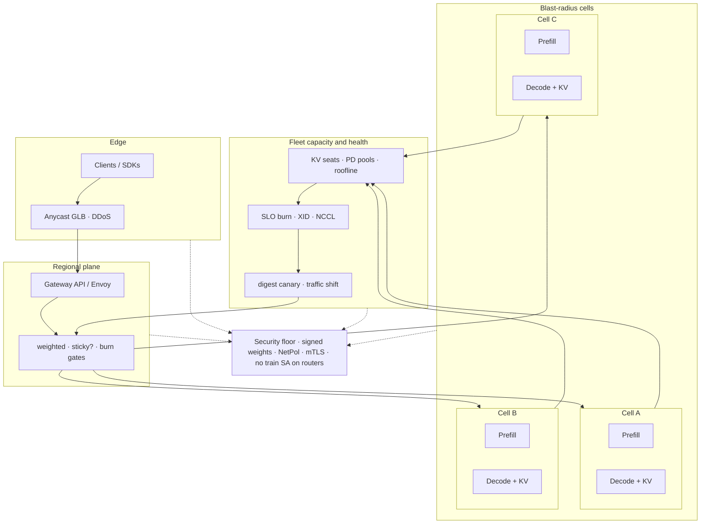

# Lesson 24 — AI/ML platform: multi-cluster inference routing & capacity planning across cells

*2026-10-02*

## What interviewers are really probing

[Lesson 18](/lessons/18-gpu-node-pools-mig-timeslicing) gave you **SKU pools**. [Lesson 19](/lessons/19-gpu-topology-nvlink-rdma-nccl) made **NVLink / RDMA / NCCL** schedulable. [Lesson 20](/lessons/20-training-inference-scheduling-kueue-volcano) admitted **gangs**. [Lesson 21](/lessons/21-inference-serving-slos-ttft-tpot-kvcache) made **KV cache the capacity wallet** and taught TTFT / TPOT / goodput. [Lesson 22](/lessons/22-prefill-decode-disagg-moe-serving) split **prefill vs decode**. [Lesson 23](/lessons/23-gpu-observability-dcgm-nccl-roofline) gave you **eyes** — DCGM, NCCL canaries, roofline. This lesson is the **fleet layer**: **how do you route inference traffic and plan capacity across many independent clusters/cells without turning “multi-cluster mesh” into a single blast-radius fantasy — and without shipping unsigned weights or a train SA onto the routers?**

Interviewers at hyperscale AI platforms (fuel: [wafer-ai/gpu-perf-engineering-resources](https://github.com/wafer-ai/gpu-perf-engineering-resources)) want evidence you have **operated multi-cell inference under partial failure**, not only “we put Envoy in front of one cluster”:

- **Cell / region / AZ topology** — independent control planes; blast-radius cells; why “one mesh for 100 clusters” is usually wrong ([L1](/lessons/01-hyperscale-mental-model))
- **Edge → cell routing** — Anycast / GLB ([L7](/lessons/07-edge-lb-ddos-armor-shield)); Gateway API / Envoy / optional Istio multi-cluster ([L10](/lessons/10-service-mesh-istio-linkerd-mtls)); sticky vs free routing for KV affinity vs PD disagg ([L21](/lessons/21-inference-serving-slos-ttft-tpot-kvcache)/[L22](/lessons/22-prefill-decode-disagg-moe-serving))
- **Capacity across cells** — KV seats, prefill vs decode pools, roofline inputs ([L23](/lessons/23-gpu-observability-dcgm-nccl-roofline)); headroom & admission ceilings
- **Health-aware routing** — TTFT/TPOT SLO burn; DCGM/XID cell quarantine; NCCL fabric health gates
- **Model rollout / canary** — digest-pinned weights across cells; weighted traffic shift; never “latest” tags
- **Failover** — cell drain, brownout, retry budgets; why you usually **don’t** ship decode KV cross-cell
- **Discovery / east-west** — MCS / Gateway composite backends / DNS / mesh optional — pick deliberately
- **Observability** — per-cell goodput, route-decision metrics, capacity dashboards
- **Security floor** — signed weights, private registries, RO mounts, GetObject-only WI, digests, NetPol across cell boundaries, admission/RBAC, no train SA on routers, mTLS between cells

**Interview sentence:** “I treat each inference cell as an independent blast-radius control plane; edge GLB + regional Gateway API/Envoy routes by capacity and SLO burn (KV seats, prefill/decode headroom, DCGM/NCCL health), keep decode affinity **inside** a cell and avoid cross-cell KV by default, canary digest-pinned weights with weighted traffic shift, and never put train SAs or writable weight mounts on the routing control plane.”

## Core diagram: Edge → Gateway → Cells (PD + KV) → capacity/health CP (+ security floor)




**Read it top-down, then the feedback loop:** Clients hit an **edge GLB** (Anycast / geo / DDoS — [L7](/lessons/07-edge-lb-ddos-armor-shield)). A **regional Gateway** (Gateway API / Envoy; mesh optional — [L10](/lessons/10-service-mesh-istio-linkerd-mtls)) picks a **cell** using weights plus **capacity and health** signals. Each cell owns **prefill**, **decode**, and a **local KV wallet** ([L21](/lessons/21-inference-serving-slos-ttft-tpot-kvcache)/[L22](/lessons/22-prefill-decode-disagg-moe-serving)). A fleet **capacity & health control plane** aggregates KV seats, roofline headroom ([L23](/lessons/23-gpu-observability-dcgm-nccl-roofline)), SLO burn, DCGM/XID quarantine, and NCCL fabric health — then feeds **route decisions** and **canary traffic shifts**. Everything sits on a **security floor**: signed digest-pinned weights, NetPol across cell boundaries, mTLS east-west, no train SA on routers.

## Idiosyncrasies / operator depth

### 1. Cell vs region vs AZ — blast radius first

| Unit | What it owns | Operator rule |
|---|---|---|
| **Cell** | Independent K8s control plane + inference stacks | Fail / upgrade / drain **one cell** without taking the product offline |
| **Region** | Shared edge GLB, compliance boundary, latency budget | Route preference + failover peer; not a single etcd |
| **AZ / zone** | Power / network fault domain **inside** a cell or across sibling cells | Prefer cells that already span AZs *or* multiple mono-AZ cells — don’t pretend AZ = cell |
| **Pool** (prefill / decode / train) | Schedulable GPU inventory inside a cell ([L18](/lessons/18-gpu-node-pools-mig-timeslicing)) | Capacity math is **per pool per cell**, then rolled up |

**Gotcha:** “Multi-cluster service mesh with one trust root and automatic failover everywhere” sounds elegant in a diagram and becomes a **correlated outage** when a control-plane bug or CA mishap hits. Hyperscale mental model ([L1](/lessons/01-hyperscale-mental-model)): **many small control planes**, deliberate cross-cell contracts.

### 2. Edge → cell routing patterns (pick deliberately)

| Pattern | Where it lives | When it fits |
|---|---|---|
| **Anycast / GLB + DNS** | Edge ([L7](/lessons/07-edge-lb-ddos-armor-shield)) | Geo + DDoS + coarse health; not KV-aware |
| **Gateway API HTTPRoute / GRPCRoute** | Regional / cell ingress | Portable L7 weights, headers, canaries; Inference Extension for endpoint picking |
| **Envoy (standalone or gateway)** | Same | Custom filters: SLO burn, capacity headers, retry budgets |
| **Istio / Linkerd multi-cluster** | Optional east-west + mTLS ([L10](/lessons/10-service-mesh-istio-linkerd-mtls)) | When you **need** identity + policy across cells — not mandatory for routing |
| **MCS / ServiceImport** | Cluster networking | L4-ish export; often **insufficient alone** for KV-aware inference |
| **Composite / multi-cluster backends** | Emerging Gateway API | Aggregate backends across clusters without pretending one ClusterIP |

**Interview trap:** Equating “we have Istio” with “we have multi-cell inference routing.” Mesh gives **identity and policy**; **capacity-aware routing** still needs a decision plane fed by KV seats, SLO burn, and silicon health.

### 3. Sticky vs free routing — KV, sessions, PD disagg

| Traffic class | Affinity need | Cross-cell? |
|---|---|---|
| **Stateless classify / embeddings** | Free / least-loaded | Yes — easy failover |
| **Prefill (disagg)** | Often free across prefill pool **inside** cell; sticky rarely required | Prefer same cell as target decode; cross-cell prefill→decode KV transfer is expensive and security-sensitive |
| **Decode with warm KV** | **Sticky** to replica / shard that holds the KV ([L21](/lessons/21-inference-serving-slos-ttft-tpot-kvcache)) | **Usually NO** — rematerializing KV elsewhere burns TTFT and couples cells |
| **MoE EP collectives** | Topology-local ([L19](/lessons/19-gpu-topology-nvlink-rdma-nccl)/[L22](/lessons/22-prefill-decode-disagg-moe-serving)) | Never cross-cell for the collective fabric |
| **Canary model digest** | Sticky to canary pool for measurement | Yes for **fractional** traffic — but canary cell or canary pool, not “random sticky forever” |

**Default posture:** **Free at the edge for cell selection** (capacity + health), **sticky inside the cell for decode**. If you *must* move a live decode session, treat it as **brownout / drain with reconnect**, not silent KV teleport.

### 4. Capacity planning across cells (the wallet that interviews care about)

| Input | Source | Roll-up |
|---|---|---|
| **KV seats free** | Serve metrics ([L21](/lessons/21-inference-serving-slos-ttft-tpot-kvcache)) | Per cell → admit ceiling |
| **Prefill FLOPs headroom** | Roofline + DCGM SM/power ([L23](/lessons/23-gpu-observability-dcgm-nccl-roofline)) | Prefill pool size × util |
| **Decode HBM / mem-BW headroom** | Roofline + HBM util | Decode pool size × util |
| **Fabric health** | NCCL canary BusBw vs baseline ([L19](/lessons/19-gpu-topology-nvlink-rdma-nccl)/[L23](/lessons/23-gpu-observability-dcgm-nccl-roofline)) | Gate cell from receiving new traffic if red |
| **SLO burn** | TTFT / TPOT / goodput error budget | Weight → 0 before hard fail |
| **Headroom policy** | Platform SLO (e.g. keep 20–30% KV + 15% FLOPs) | Don’t route into “full but not yet paging” cells |

**Cell capacity (operator formula):**

`cell_admit = min(kv_seats_free, prefill_flops_headroom, decode_hbm_headroom, fabric_ok, slo_budget_ok)`

Fleet planner routes proportional to `cell_admit` (or ranked tiers: green / yellow / red), never pure RPS round-robin.

### 5. Health-aware routing — what actually moves weight to zero

| Signal | Action on cell weight |
|---|---|
| **TTFT burn** (error budget) | Shed new sessions; prefer other cells; optionally brownout long prompts |
| **TPOT / goodput burn** | Stop admitting decode-heavy traffic; scale decode pool or drain |
| **DCGM XID / ECC / throttle storm** | Quarantine node → if pool degraded past threshold, **cell yellow/red** ([L23](/lessons/23-gpu-observability-dcgm-nccl-roofline)) |
| **NCCL canary fail / BusBw regress** | Block MoE / multi-node admits; may still serve single-node decode depending on SKU |
| **Control-plane / etcd pressure** | Cell is sick even if GPUs are green — weight → 0 |
| **Weight hydrate / digest mismatch** | Canary or rollback; never dual-digest chaos on same sticky key |

### 6. Model rollout / canary across cells

| Step | Practice |
|---|---|
| **Pin digest** | Image + weight artifact digests; cosign verify ([L12](/lessons/12-node-container-hardening-supply-chain)/[L13](/lessons/13-ml-weights-checkpoint-hardening)) |
| **Hydrate offline** | Pull to cell local cache / RO volume **before** traffic |
| **Canary cell or canary pool** | 1–5% sticky traffic; compare TTFT/TPOT/goodput + DCGM |
| **Weighted shift** | 5 → 25 → 50 → 100% via Gateway weights; pause on burn |
| **Rollback** | Weight → previous digest; don’t “hotfix latest” |
| **Mixed digests** | Allowed **across** cells during shift; dangerous **inside** one sticky decode pool |

### 7. Failover, drain, brownout, retries

| Mode | Meaning | Gotcha |
|---|---|---|
| **Cell drain** | Weight → 0; finish in-flight; reject new sticky | Decode sticky clients need reconnect UX |
| **Brownout** | Shed expensive prefill / long context first | Better than hard 503 for everyone |
| **Retry budget** | Edge retries **idempotent** classify; careful with non-idempotent tool calls | Unlimited retries amplify a dying cell |
| **Cross-cell KV** | Copy or remote-read KV for decode | Latency + consistency + **data exfil surface** — default **don’t** |
| **Cold restart elsewhere** | Re-prefill on healthy cell | TTFT spike accepted; product must tolerate |

### 8. Multi-cluster discovery without one mandatory mesh

| Approach | Pros | Cons |
|---|---|---|
| **DNS / GLB only** | Simple blast radius | Coarse; no KV awareness |
| **Per-cell Gateway + regional controller** | Clear contracts; portable HTTPRoute | Need a capacity signal bus |
| **MCS + Gateway** | Standard export | L4 sameness ≠ inference picker |
| **Istio multi-primary / primary-remote** | mTLS + AuthZ | Operational blast radius; still need capacity inputs |
| **Inference Gateway / endpoint picker** | Designed for model backends | Young APIs — pin versions; don’t bet the fleet on one alpha CRD without a fallback |

**Operator stance:** **mTLS and NetPol are mandatory between cells that speak**; **full mesh is optional**. Many fleets run **Gateway + SPIFFE/mTLS ferrymen** only on the cross-cell paths that exist.

### 9. Observability — route decisions you can defend in an incident

| Metric / view | Why |
|---|---|
| **Per-cell goodput / TTFT / TPOT** | Product truth ([L21](/lessons/21-inference-serving-slos-ttft-tpot-kvcache)) |
| **`route_cell_weight` / selected cell** | Did the planner do what you think? |
| **`cell_admit_*` components** | Which min() term is binding? |
| **Canary digest × SLO** | Rollout health |
| **Cross-cell retry / failovers /s** | Amplification detector |
| **DCGM + NCCL cell health rollup** | Silicon/fabric gates ([L23](/lessons/23-gpu-observability-dcgm-nccl-roofline)) |
| **Security: deny NetPol hits on cell boundary** | Lateral movement attempts |

**Gotcha:** Logging full prompts or tenant IDs into route-decision metrics recreates the [L23](/lessons/23-gpu-observability-dcgm-nccl-roofline) cardinality / privacy footgun. Keep **cell + pool + digest_short + reason_code**.

### 10. Interview trap — “just fail over the KV”

If decode affinity dies with a cell, **re-prefill or reconnect**. Shipping KV across cells “for availability” couples failure domains, adds a high-bandwidth trust boundary, and often **loses** the TTFT you were trying to save under load. Say that out loud.

## Concrete commands & config

### Fleet inventory — cells, pools, weights

```bash
# Cell registry (platform CRD / ConfigMap — shape only)
kubectl --context fleet-admin get inferencecells -A \
  -o custom-columns=NAME:.metadata.name,REGION:.spec.region,WEIGHT:.status.routeWeight,ADMIT:.status.admitCeiling,HEALTH:.status.health

# Per-cell pool snapshot
for CTX in cell-a cell-b cell-c; do
  echo "=== $CTX ==="
  kubectl --context "$CTX" -n inference get deploy,svc -l app.kubernetes.io/component in prefill,decode
  kubectl --context "$CTX" -n inference get cm cell-capacity -o yaml
done
```

### Capacity snapshot → admit ceiling (runbook sketch)

```bash
# Pull binding constraints (replace with your Prom / API)
# kv_free, prefill_flops_headroom, decode_hbm_headroom, fabric_ok (0/1), slo_ok (0/1)
python3 - <<'PY'
kv, flops, hbm, fabric, slo = 1200, 0.35, 0.22, 1, 1
# headroom floors: keep 20% KV, 15% compute/mem as policy
admit = min(kv * 0.8, flops, hbm) * fabric * slo
print(f"cell_admit_score={admit:.3f}")
PY
```

### Gateway API — weighted cell backends + canary digest header

```yaml
apiVersion: gateway.networking.k8s.io/v1
kind: HTTPRoute
metadata:
  name: llm-inference
  namespace: edge-gw
spec:
  parentRefs:
    - name: regional-gw
  hostnames: ["infer.example.com"]
  rules:
    - matches:
        - path:
            type: PathPrefix
            value: /v1/
      backendRefs:
        - name: cell-a-infer
          port: 443
          weight: 40
        - name: cell-b-infer
          port: 443
          weight: 45
        - name: cell-c-infer
          port: 443
          weight: 15   # canary cell / digest
      filters:
        - type: RequestHeaderModifier
          requestHeaderModifier:
            add:
              - name: x-model-digest
                value: "sha256:REPLACE_CANARY_OR_PROD"
              - name: x-routing-policy
                value: "capacity-v1"
---
# Optional: sticky for decode resume paths (cookie / header hash) — cell-local preference
apiVersion: gateway.networking.k8s.io/v1
kind: HTTPRoute
metadata:
  name: llm-decode-sticky
  namespace: edge-gw
spec:
  parentRefs:
    - name: regional-gw
  hostnames: ["infer.example.com"]
  rules:
    - matches:
        - path:
            type: PathPrefix
            value: /v1/sessions/
      backendRefs:
        - name: cell-a-infer
          port: 443
          weight: 1
      # Real sticky often lives in Envoy consistent-hash or Inference Extension picker;
      # document which layer owns affinity — don’t double-stick edge + mesh.
```

### Envoy cluster sketch — outlier detection + retry budget

```yaml
# Fragment — wire via Gateway / Helm values; pin Envoy image digest
clusters:
  - name: cell_a
    connect_timeout: 1s
    type: STRICT_DNS
    lb_policy: LEAST_REQUEST
    load_assignment:
      cluster_name: cell_a
      endpoints:
        - lb_endpoints:
            - endpoint:
                address:
                  socket_address: { address: cell-a.infer.svc, port_value: 443 }
    outlier_detection:
      consecutive_5xx: 5
      interval: 10s
      base_ejection_time: 30s
      max_ejection_percent: 100
    # Circuit breakers / retry budgets belong at edge — prevent retry storms into a red cell
```

### Helm values — regional router (shape)

```yaml
# Shape only — digests, not tags, in prod
regionalRouter:
  image: registry.example.com/infer-router@sha256:REPLACE
  serviceAccount: infer-router   # NOT train-sa
  env:
    CAPACITY_API: https://capacity.fleet.example.com
    DEFAULT_POLICY: min_kv_flops_hbm_fabric_slo
    CROSS_CELL_KV: "false"
  resources:
    requests: { cpu: "2", memory: 4Gi }
  affinity:
    podAntiAffinity:
      requiredDuringSchedulingIgnoredDuringExecution:
        - labelSelector:
            matchLabels: { app: infer-router }
          topologyKey: topology.kubernetes.io/zone
```

### Cell drain / brownout / weight shift

```bash
CELL=cell-b

# 1) Mark yellow in capacity API / CR
kubectl --context fleet-admin patch inferencecell "$CELL" --type merge \
  -p '{"status":{"health":"yellow","routeWeight":5}}'

# 2) Stop new sticky admits; allow in-flight drain window
kubectl --context "$CELL" -n inference annotate deploy/decode \
  drain.platform/mode=brownout-prefill-first --overwrite

# 3) Hard drain when in-flight < threshold
kubectl --context fleet-admin patch inferencecell "$CELL" --type merge \
  -p '{"status":{"health":"red","routeWeight":0}}'

# 4) After fix: NCCL canary + DCGM green + digest verify before weight restore ([L23])
```

### Per-cell goodput / route metrics (PromQL sketches)

```promql
# Goodput by cell
sum by (cell) (rate(inference_goodput_requests_total[5m]))

# Binding admit term (custom exporter)
min by (cell) (
  cell_admit_kv_seats_ratio,
  cell_admit_prefill_flops_ratio,
  cell_admit_decode_hbm_ratio,
  cell_admit_fabric_ok,
  cell_admit_slo_budget_ratio
)

# Edge selected cell vs planned weight
sum by (cell) (rate(router_selected_cell_total[5m]))
  /
sum by (cell) (router_desired_weight)
```

### Kyverno / VAP — no train SA on routers (sketch)

```yaml
apiVersion: admissionregistration.k8s.io/v1
kind: ValidatingAdmissionPolicy
metadata:
  name: router-privilege-floor
spec:
  failurePolicy: Fail
  matchConstraints:
    resourceRules:
      - apiGroups: ["apps"]
        apiVersions: ["v1"]
        operations: ["CREATE", "UPDATE"]
        resources: ["deployments"]
  validations:
    - expression: >
        !has(object.metadata.labels) ||
        object.metadata.labels["trust-domain"] != "infer-router" ||
        (
          object.spec.template.spec.serviceAccountName in
            ["infer-router", "edge-gw", "capacity-reader"] &&
          !object.spec.template.spec.serviceAccountName.startsWith("train")
        )
      message: "infer-router trust-domain must use router SAs — never train SA"
```

## Failures & fixes

| Symptom | Likely cause | Fix / mitigation |
|---|---|---|
| One cell dies; **all** regions 5xx | Edge retries with no budget / no other healthy weights | Outlier eject + retry budget; keep ≥2 green cells in weights |
| TTFT fine at edge, TPOT burns after failover | Sticky decode lost; re-prefill storm | Accept reconnect; brownout; **don’t** invent cross-cell KV under fire |
| “Balanced” RPS but one cell SLO-red | Round-robin ignoring KV seats / roofline | Route on `cell_admit = min(...)`; expose binding term |
| Canary looks green; prod digests diverge mid-shift | Mixed digests inside one sticky pool | Canary **cell or pool**; pin `x-model-digest`; block mixed sticky keys |
| Mesh mTLS outage takes every cell | Shared root / control plane coupled | Separate trust domains per cell; ferry only needed paths ([L10](/lessons/10-service-mesh-istio-linkerd-mtls)) |
| Cross-AZ “cell” flaps on single switch | Cell ≠ fault domain | Revisit topology; sibling cells per AZ ([L1](/lessons/01-hyperscale-mental-model)/[L5](/lessons/05-cloud-networking-vpc-tgw)) |
| Weight hydrate races traffic | Traffic before RO mount ready | Offline hydrate + readiness on digest; Gateway weight 0 until ready |
| DCGM XID on 20% of decode; router still full weight | Health not wired to capacity CP | Roll up XID/throttle into cell health ([L23](/lessons/23-gpu-observability-dcgm-nccl-roofline)) |
| NCCL red; MoE still admitted | Fabric gate missing | `fabric_ok` in min(); block EP admits |
| Router SA can `PutObject` on weight buckets | Train WI reused | GetObject-only / no weight creds on router ([L13](/lessons/13-ml-weights-checkpoint-hardening)) |
| East-west open between cells | Missing NetPol / overly broad mesh | Default-deny; allow only gateway ferry CIDRs ([L9](/lessons/09-networkpolicy-multi-nic-sflow)) |
| Retry storm doubles load on dying cell | Unlimited 502 retries | Budget + hedged cancel; eject first |
| Capacity dashboard shows SM util only | Vanity metrics | Show KV seats + HBM + FLOPs + fabric + burn ([L23](/lessons/23-gpu-observability-dcgm-nccl-roofline)) |
| GLB health = TCP:443 green while serve is brownout | Shallow health check | Health on SLO/capacity endpoint, not just TLS accept ([L7](/lessons/07-edge-lb-ddos-armor-shield)) |

## Security & hardening

**The routing plane sits in front of every model you serve.** A router with train credentials, a flat NetPol across cells, or unsigned “latest” weights turns multi-cluster routing into a **fleet-wide exfil and supply-chain fan-out**. Same spirit as [L11](/lessons/11-cluster-security-pss-admission-rbac)–[L14](/lessons/14-ml-inference-training-deploy-hardening), applied to **edge + regional + cell ingress**.

| Control | Why | Practice |
|---|---|---|
| **Signed weights + digest pins** | Every cell must serve the **same verified** artifact | Cosign verify; pin image + weight digests; no `:latest` ([L12](/lessons/12-node-container-hardening-supply-chain)/[L13](/lessons/13-ml-weights-checkpoint-hardening)) |
| **Private registries** | Public pulls = inventory + tamper surface | Private mirror; admission deny external registries for serve/router |
| **RO mounts** | Writable `/models` on serve or router is a backdoor | readOnly mounts; emptyDir for scratch only |
| **GetObject-only WI** | Routers and serve hydrate paths must not write checkpoints | Workload Identity / IRSA with `s3:GetObject` (or GCS equivalent) only; **no** PutObject on weight buckets |
| **No train SA on routers** | Train WI is a privilege trampoline | `infer-router` / `edge-gw` / `capacity-reader` only; VAP deny `train*` |
| **NetPol across cell boundaries** | Lateral movement via “just routing” | Default-deny; allow only ferry / gateway ports; no pod-pod mesh flatness ([L9](/lessons/09-networkpolicy-multi-nic-sflow)) |
| **mTLS between cells** | Spoofed cell backends | SPIFFE / mesh / gateway mTLS on cross-cell hops ([L10](/lessons/10-service-mesh-istio-linkerd-mtls)) |
| **Admission / RBAC** | Anyone who can edit HTTPRoute weights can shift prod | Break-glass + audit; least-priv route editors; separate canary editors |
| **Least-priv routing control plane** | Capacity API is a load-shedding oracle | Read metrics; write weights via narrowly scoped SA; no exec into serve |
| **No cross-cell KV by default** | KV is tenant conversation state | Explicit threat model + encryption + ACL if ever enabled |
| **Route metric label hygiene** | PII / prompts in router logs | cell + pool + digest_short + reason_code only ([L23](/lessons/23-gpu-observability-dcgm-nccl-roofline)) |
| **Canary gates** | Bad digest → all cells | Per-cell verify; weighted shift with auto-pause on burn |

### AI/ML weight, model & deployment hardening on the multi-cell path (required)

Multi-cell routing does **not** relax [L13](/lessons/13-ml-weights-checkpoint-hardening)/[L14](/lessons/14-ml-inference-training-deploy-hardening). Each cell hydrates **signed, digest-pinned** weights onto **RO** volumes with **GetObject-only** identity. Regional routers **never** mount `/models`, **never** reuse train SAs, and **never** hold PutObject on checkpoint buckets. Cross-cell NetPol + mTLS protect the ferry. Deployment admission still requires RuntimeClass, digest pins, and pool nodeSelectors on **every** cell — including the “temporary” canary cell.

| Scenario | Weight / model / deploy controls |
|---|---|
| **New cell join** | Cosign + digest hydrate **before** weight > 0; NCCL/DCGM green ([L23](/lessons/23-gpu-observability-dcgm-nccl-roofline)) |
| **Canary digest shift** | Header/`InferencePool` pin; RO mounts; compare SLO; auto-pause |
| **Router deploy** | Signed router image; no weight PVC; router SA only |
| **East-west ferry** | mTLS; NetPol allowlist; no raw weight sync protocol on that path |
| **Incident: suspected weight tamper** | Freeze weights → 0; revoke registry pulls; re-verify digests cell-by-cell |
| **Train job in same org** | Hard SA / WI / NetPol separation from router and serve ([L14](/lessons/14-ml-inference-training-deploy-hardening)) |

```yaml
# Sketch: multi-cell inference routing security floor (platform CR shape)
apiVersion: policy.platform/v1
kind: MultiCellInferGate
metadata:
  name: infer-routing-floor
spec:
  match:
    labels:
      trust-domain: infer-router
  require:
    imageDigestPin: true
    weightDigestPin: true
    cosignVerify: true
    privateRegistryOnly: true
    weightMountOnRouter: false
    weightMountOnServe: "readOnly"
    serveWorkloadIdentity:
      objectGetOnly: true
      putObject: false
    allowedServiceAccounts: ["infer-router", "edge-gw", "capacity-reader"]
    trainSaOnRouters: false
    crossCellKv: false
    networkPolicy:
      defaultDeny: true
      allowEastWest:
        - from: "namespace:edge-gw"
          to: "cell-ingress:443"
          mtls: required
    admission:
      runtimeClass: nvidia
      auditRouteWeightChanges: true
    canary:
      autoPauseOnSloBurn: true
      maxMixedDigestInStickyPool: 0
```

**Punchline:** Multi-cell routing is a **security-critical control plane**. **Digest-pinned signed weights, GetObject-only hydrate, no train SA on routers, NetPol + mTLS across cell boundaries, and no casual cross-cell KV** are what keep “smart capacity routing” from becoming a fleet-wide compromise path.

## Interview soundbites

- **“Cells are blast-radius units — independent control planes, deliberate cross-cell contracts.”**
- **“Edge GLB for geo/DDoS; Gateway/Envoy for weighted capacity routes — mesh is optional identity, not magic routing.”**
- **“Free at the edge for cell pick; sticky inside the cell for decode KV.”**
- **“cell_admit = min(KV seats, prefill FLOPs, decode HBM, fabric, SLO budget) — the minimum wins.”**
- **“XID / NCCL / TTFT burn all move weight — GPUs green ≠ cell green.”**
- **“Canary digest-pinned weights with weighted shift; never :latest across cells.”**
- **“Don’t teleport decode KV cross-cell by default — reconnect/re-prefill beats coupled failure domains.”**
- **“Retry budgets + outlier ejection, or one red cell becomes a retry amplifier.”**
- **“No train SA on routers; RO weights; GetObject-only; NetPol + mTLS between cells.”**
- **“Next: multi-tenant GPU isolation and quota economics across cells.”**

## How this maps to the JD

Hyperscale + AI/ML platform JDs that mention **100+ clusters, inference serving, and GPU fleets** are asking whether you can **route and plan capacity across cells under partial failure** — not run a single-cluster Envoy demo. This lesson lifts [L18](/lessons/18-gpu-node-pools-mig-timeslicing)–[L23](/lessons/23-gpu-observability-dcgm-nccl-roofline) into the fleet layer with [L1](/lessons/01-hyperscale-mental-model)/[L5](/lessons/05-cloud-networking-vpc-tgw)–[L7](/lessons/07-edge-lb-ddos-armor-shield)/[L9](/lessons/09-networkpolicy-multi-nic-sflow)/[L10](/lessons/10-service-mesh-istio-linkerd-mtls)/[L13](/lessons/13-ml-weights-checkpoint-hardening)–[L14](/lessons/14-ml-inference-training-deploy-hardening) controls. Fuel: [wafer-ai/gpu-perf-engineering-resources](https://github.com/wafer-ai/gpu-perf-engineering-resources). **Next up — Lesson 25:** multi-tenant GPU isolation & quota economics across cells.

## Watch (talks & demos)

Real talks — watch after Failures & fixes.

### Building the Next Generation of Multi-Cluster with Gateway API

KubeCon talk (Mike Morris & Alan Grosskurth) on ClusterIP Gateways, endpoint selectors, and composite backends for aggregating backends across clusters. Operator takeaway: multi-cluster inference needs an explicit **backend aggregation** story in Gateway API terms — not “one Service DNS name forever.” Pair with capacity signals from this lesson; APIs alone don’t know your KV seats.

<iframe width="100%" height="360" src="https://www.youtube.com/embed/oRbdcHgHPbo" title="Building the Next Generation of Multi-Cluster with Gateway API" frameBorder="0" allow="accelerometer; autoplay; clipboard-write; encrypted-media; gyroscope; picture-in-picture; web-share" allowFullScreen></iframe>

[Open on YouTube](https://www.youtube.com/watch?v=oRbdcHgHPbo)

### NVIDIA Dynamo — LLM Inference in Multi-Node Distributed Environments

Hands-on / overview of Dynamo’s distributed serving stack (multi-node inference, routing adjacent to PD pools). Operator takeaway: treat KV-aware / disagg routers as **cell-local** brains feeding a **fleet** weight plane — don’t confuse engine-level KV routing with cross-cell GLB decisions ([L21](/lessons/21-inference-serving-slos-ttft-tpot-kvcache)/[L22](/lessons/22-prefill-decode-disagg-moe-serving)).

<iframe width="100%" height="360" src="https://www.youtube.com/embed/QULkZbHcOhA" title="NVIDIA Dynamo LLM Inference in Multi-Node Distributed Environments" frameBorder="0" allow="accelerometer; autoplay; clipboard-write; encrypted-media; gyroscope; picture-in-picture; web-share" allowFullScreen></iframe>

[Open on YouTube](https://www.youtube.com/watch?v=QULkZbHcOhA)

### Tutorial: Configuring Your Service Mesh with Gateway API

Gateway API + mesh (Linkerd/Istio) workshop for routing, resilience, and progressive delivery. Operator takeaway: use Gateway for **portable canary weights**; use mesh selectively for **mTLS/identity** between cells — don’t merge them into one mandatory monolith ([L10](/lessons/10-service-mesh-istio-linkerd-mtls)).

<iframe width="100%" height="360" src="https://www.youtube.com/embed/UMGRp0fGk3o" title="Tutorial Configuring Your Service Mesh with Gateway API" frameBorder="0" allow="accelerometer; autoplay; clipboard-write; encrypted-media; gyroscope; picture-in-picture; web-share" allowFullScreen></iframe>

[Open on YouTube](https://www.youtube.com/watch?v=UMGRp0fGk3o)

## References

- [Gateway API](https://gateway-api.sigs.k8s.io/) · [Gateway API Inference Extension](https://gateway-api-inference-extension.sigs.k8s.io/) · [kubernetes-sigs/gateway-api-inference-extension](https://github.com/kubernetes-sigs/gateway-api-inference-extension)
- [Multi-Cluster Services (MCS)](https://multicluster.sigs.k8s.io/concepts/multicluster-services-api/) · [Istio multi-cluster](https://istio.io/latest/docs/setup/install/multicluster/) · [Envoy outlier detection](https://www.envoyproxy.io/docs/envoy/latest/intro/arch_overview/upstream/outlier)
- [NVIDIA Dynamo docs — KV routing](https://docs.nvidia.com/dynamo/latest/user-guides/kv-cache-aware-routing) · [Routing concepts](https://docs.nvidia.com/dynamo/components/router/routing-concepts)
- [wafer-ai/gpu-perf-engineering-resources](https://github.com/wafer-ai/gpu-perf-engineering-resources) — fleet / inference arithmetic fuel
- Prior: [23 — GPU observability](/lessons/23-gpu-observability-dcgm-nccl-roofline) · [22 — Prefill/decode disagg / MoE](/lessons/22-prefill-decode-disagg-moe-serving) · [21 — Inference serving SLOs](/lessons/21-inference-serving-slos-ttft-tpot-kvcache) · [18 — GPU node pools](/lessons/18-gpu-node-pools-mig-timeslicing) · [14 — ML deploy hardening](/lessons/14-ml-inference-training-deploy-hardening) · [13 — ML weights](/lessons/13-ml-weights-checkpoint-hardening) · [10 — Service mesh](/lessons/10-service-mesh-istio-linkerd-mtls) · [09 — NetworkPolicy](/lessons/09-networkpolicy-multi-nic-sflow) · [07 — Edge LB / DDoS](/lessons/07-edge-lb-ddos-armor-shield) · [05 — Cloud networking](/lessons/05-cloud-networking-vpc-tgw) · [01 — Hyperscale mental model](/lessons/01-hyperscale-mental-model)
- Next: **Lesson 25 — AI/ML platform: multi-tenant GPU isolation & quota economics across cells**

## Quick self-check

Out loud, in under two minutes:

1. Define a cell vs a region vs a pool — and why independent control planes matter for blast radius.
2. Explain free-at-edge vs sticky-in-cell for decode KV, and why cross-cell KV is usually a bad default.
3. Write `cell_admit = min(...)` with five inputs and say which signal moves weight to zero first in an XID storm.
4. Walk a digest-pinned canary: hydrate → weight shift → auto-pause on SLO burn → rollback.
5. Drain a yellow cell without retry-amplifying it (outlier eject, retry budget, brownout).
6. List five security controls on the routing path — signed digests, GetObject-only, no train SA on routers, NetPol + mTLS across cells, no casual cross-cell KV.
