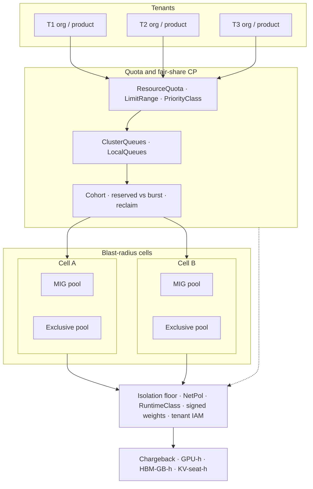

# Lesson 25 — AI/ML platform: multi-tenant GPU isolation & quota economics across cells

*2026-10-03*

## What interviewers are really probing

[Lesson 18](/lessons/18-gpu-node-pools-mig-timeslicing) gave you **SKU pools** and when MIG / time-slice / exclusive fit. [Lesson 19](/lessons/19-gpu-topology-nvlink-rdma-nccl) made **NVLink / RDMA / NCCL** schedulable — and fragile if you shatter domains for “fairness.” [Lesson 20](/lessons/20-training-inference-scheduling-kueue-volcano) admitted **gangs** with Kueue / Volcano fair-share. [Lesson 21](/lessons/21-inference-serving-slos-ttft-tpot-kvcache) made **KV cache the capacity wallet**. [Lesson 22](/lessons/22-prefill-decode-disagg-moe-serving) split **prefill vs decode**. [Lesson 23](/lessons/23-gpu-observability-dcgm-nccl-roofline) gave you **eyes**. [Lesson 24](/lessons/24-multi-cluster-inference-routing-capacity) routed **across cells**. This lesson is the **tenant layer**: **how do you isolate orgs/teams on a shared GPU fleet, encode reserved vs burst economics, and charge back without silent sharing, cross-tenant weight leaks, or breaking topology — and without a train SA that can lateral-move into every tenant’s model bucket?**

Interviewers at hyperscale AI platforms (fuel: [wafer-ai/gpu-perf-engineering-resources](https://github.com/wafer-ai/gpu-perf-engineering-resources)) want evidence you have **operated multi-tenant GPU quotas under contention**, not only “we gave each team a namespace”:

- **Soft vs hard multi-tenancy** — when MIG / exclusive / time-slice / MPS fit ([L18](/lessons/18-gpu-node-pools-mig-timeslicing)); what “isolation” actually means on silicon
- **Tenant = org/team/product** — ResourceQuota + LimitRange + PriorityClass + Kueue ClusterQueue / LocalQueue + cohort fair-share ([L20](/lessons/20-training-inference-scheduling-kueue-volcano))
- **Isolation stack** — namespaces, NetworkPolicy, RuntimeClass, device plugin / DRA, node taints/labels; SPOG vs per-cell quotas
- **Cross-cell quota economics** — reserved vs burst, oversubscribe, reclaim, chargeback/showback (GPU-hours, HBM-GB-hours, KV-seat-hours); idle waste vs fragmentation
- **Capacity markets across cells** — per-tenant admit ceilings; starved tenant vs wasted cell ([L24](/lessons/24-multi-cluster-inference-routing-capacity))
- **Topology constraints** — don’t break NVLink / NCCL domains for fairness ([L19](/lessons/19-gpu-topology-nvlink-rdma-nccl))
- **Inference multi-tenant** — model-per-tenant vs shared model + request auth / rate limits; KV / cache isolation risks ([L21](/lessons/21-inference-serving-slos-ttft-tpot-kvcache))
- **Training** — gang + fair-share + preemption economics ([L20](/lessons/20-training-inference-scheduling-kueue-volcano))
- **Gotchas** — silent GPU sharing; quota that ignores MIG slices; ResourceQuota vs extended resources; cross-tenant weight bucket ACL leaks; train SA lateral movement
- **Security floor** — per-tenant signed weight digests, private registries, RO mounts, GetObject-only WI scoped per tenant prefix, no shared writable model cache, admission deny cross-tenant PVC/Secret, VAP for RuntimeClass + digests, NetPol default-deny, no flat RDMA trust, audit chargeback labels without PII/prompts ([L13](/lessons/13-ml-weights-checkpoint-hardening)/[L14](/lessons/14-ml-inference-training-deploy-hardening))

**Interview sentence:** “I model each tenant as an org with ResourceQuota + Kueue ClusterQueue nominal quota and cohort fair-share; pick MIG / exclusive / time-slice by trust and SLO class; enforce NetPol + RuntimeClass + per-tenant signed digests and GetObject-only WI on weight prefixes; roll admit ceilings across cells without shattering NVLink domains; and charge back GPU-hours / HBM-GB-hours / KV-seat-hours with reserved-vs-borrowed split — never a flat shared writable model cache or a train SA that can reach every tenant’s bucket.”

## Core diagram: Tenants → Quota CP → Cells (MIG / exclusive) → Isolation floor → Chargeback




**Read it top-down, then the meters:** Each **tenant** (org / team / product) hits a fleet **quota & fair-share control plane** — ResourceQuota / LimitRange / PriorityClass plus Kueue ClusterQueue / LocalQueue in a **cohort** that encodes reserved vs burst and reclaim ([L20](/lessons/20-training-inference-scheduling-kueue-volcano)). That plane issues **per-cell admit ceilings** into independent **cells**, each with **MIG** and **exclusive** pools ([L18](/lessons/18-gpu-node-pools-mig-timeslicing)) that must respect topology ([L19](/lessons/19-gpu-topology-nvlink-rdma-nccl)). Everything sits on an **isolation & security floor** (NetPol, RuntimeClass, signed per-tenant weights, scoped IAM). **Chargeback meters** close the loop so finance and capacity planning see GPU-hours, HBM-GB-hours, and KV-seat-hours — not vanity SM util alone ([L23](/lessons/23-gpu-observability-dcgm-nccl-roofline)/[L24](/lessons/24-multi-cluster-inference-routing-capacity)).

## Idiosyncrasies / operator depth

### 1. Soft vs hard multi-tenancy on GPUs (pick by trust + SLO)

| Mode | Isolation strength | Fits | Breaks when |
|---|---|---|---|
| **Exclusive GPU** | Hard on device (one tenant / pod class) | Train gangs, MoE EP, strict SLO decode | Over-fragmentation; idle full GPUs |
| **MIG** | Hard HW partitions (HBM + SM slice) | Multi-tenant inference / notebooks on same SKU ([L18](/lessons/18-gpu-node-pools-mig-timeslicing)) | Profile mismatch; quota counted as parent GPU |
| **Time-slicing** | Soft (time multiplex) | Best-effort interactive; demos | Noisy neighbor; chargeback confidence low |
| **MPS** | Soft-ish (context space) | Same-trust batch inference | Not a trust boundary; still shared address space class |
| **vGPU / passthrough VM** | Stronger tenant VM boundary | Regulated / untrusted tenants | Ops cost; NCCL / RDMA path complexity |

**Gotcha:** Time-slicing and MPS are **utilization tools**, not **trust tools**. Interviewers ding you if you say “we multi-tenant with MPS” when the threat model is cross-org weight theft.

### 2. Tenant = org/team/product — the control objects that matter

| Object | Role | Operator rule |
|---|---|---|
| **Namespace** | Trust + NetPol + RBAC boundary | One tenant primary ns (plus system sidecars); never flat shared ns for train+serve across orgs |
| **ResourceQuota / LimitRange** | Hard caps on cpu/mem/pods + **extended resources** | Must list `nvidia.com/gpu` **and** `nvidia.com/mig-*` profiles you advertise |
| **PriorityClass** | Preemption order inside / across queues | Separate train-prod / train-dev / infer-prod |
| **Kueue ClusterQueue** | Nominal quota + borrow/lend in cohort ([L20](/lessons/20-training-inference-scheduling-kueue-volcano)) | Nominal = reserved; borrowing = burst with reclaim |
| **LocalQueue** | Tenant-facing submit target | Users never edit ClusterQueue; platform owns CQ |
| **Cohort** | Fair-share + reclaimWithinCohort | Model org hierarchy; don’t invent a second quota system beside Kueue |

**Interview trap:** Equating “ResourceQuota of 8 GPUs” with “we have multi-tenant fairness.” Without cohort fair-share + preemption, the loudest submitter owns burst forever.

### 3. Isolation stack — layers you actually enforce

| Layer | What it blocks | Failure if missing |
|---|---|---|
| **Namespace + RBAC** | Cross-tenant API reads / exec | Train SA lists every Secret |
| **NetworkPolicy default-deny** | Pod ↔ pod lateral ([L9](/lessons/09-networkpolicy-multi-nic-sflow)) | Flat east-west exfil |
| **RuntimeClass (nvidia / kata)** | Wrong runtime / shared host path | Accidental privileged GPU path ([L14](/lessons/14-ml-inference-training-deploy-hardening)) |
| **Device plugin / DRA** | Wrong SKU / MIG profile | Silent full-GPU assign under “mig” label |
| **Node taints / labels** | Pool bleed (train on infer MIG pool) | Topology and SLO chaos ([L18](/lessons/18-gpu-node-pools-mig-timeslicing)) |
| **SPOG vs per-cell quotas** | Global oversubscribe fantasy | SPOG admits 200% of every cell; per-cell alone starves global fairness |

**Operator stance:** **Per-cell hard ceilings** + **fleet fair-share policy** that *proposes* ceilings. One global ResourceQuota across 100 cells without cell binding is a spreadsheet, not a control plane.

### 4. Cross-cell quota economics — reserved, burst, reclaim, waste

| Concept | Meaning | Meter |
|---|---|---|
| **Reserved (nominal)** | Guaranteed GPU (or MIG profile) count per tenant per flavor | Bill as reserved even if idle (capacity reservation) |
| **Burst (borrow)** | Use unused nominal of peers in cohort | Bill borrowed at burst rate; preemptible |
| **Oversubscribe policy** | How much burst vs reserved ratio allowed | Cap per CQ `lendingLimit` / fair-share weight |
| **Reclaim** | Owner returns; preempt borrowers | Gang-aware reclaim ([L20](/lessons/20-training-inference-scheduling-kueue-volcano)) |
| **Idle waste** | Reserved but unused | Showback to tenant; reclaim campaign |
| **Fragmentation** | Free MIG slices wrong shape / free GPUs wrong topology | Not the same as idle — fix profiles / binpack |
| **KV-seat-hours** | Inference capacity wallet hours ([L21](/lessons/21-inference-serving-slos-ttft-tpot-kvcache)) | Often better product meter than raw SM% |

**Formula interviewers like:**  
`tenant_effective = min(cq_nominal + borrow_allowed, sum_over_cells(cell_admit_tenant), topology_fit)`  
If `topology_fit` is zero because you scattered a gang across NVLink domains for “fairness,” you manufactured waste ([L19](/lessons/19-gpu-topology-nvlink-rdma-nccl)).

### 5. Capacity markets across cells (tie L24)

| Signal | Platform action |
|---|---|
| **Starved tenant, wasted cell** | Raise that tenant’s admit ceiling on the green cell; don’t only page the tenant |
| **Tenant over reserve on cell A, idle on B** | Rebalance nominal **or** route inference ([L24](/lessons/24-multi-cluster-inference-routing-capacity)) — train gangs usually stay cell-sticky |
| **Borrow storm on one cell** | Fair-share preemption + cell yellow weight for new burst admits |
| **MIG fragmentation high** | Defrag window / profile rebalance; charge fragmentation separately from idle |

**Default posture:** **Inference** can follow capacity across cells (with digest pins). **Multi-node train** stays topology-local; quota must encode **flavors** (zone / rail / NVLink island), not raw GPU integers.

### 6. Topology — fairness that breaks NCCL is not fairness

| Anti-pattern | Symptom | Fix |
|---|---|---|
| Spread gang “evenly” across tenants’ free GPUs on different rails | BusBw collapse; train hangs | Topology-aware flavors in Kueue / scheduler ([L19](/lessons/19-gpu-topology-nvlink-rdma-nccl)/[L20](/lessons/20-training-inference-scheduling-kueue-volcano)) |
| MIG-slice a GPU mid NVLink domain for “more tenants” | Collective jobs can’t place | Separate **MIG inference pools** from **exclusive train islands** |
| Flat RDMA trust across tenant namespaces | Cross-tenant RDMA read fantasy | NetPol + VF / namespace ownership; no shared GID pools ([L9](/lessons/09-networkpolicy-multi-nic-sflow)) |

### 7. Inference multi-tenant — model-per-tenant vs shared model

| Pattern | Isolation | Quota / rate | Risk |
|---|---|---|---|
| **Model-per-tenant deploy** | Strong (separate pods / optionally MIG) | GPU or MIG seats per tenant | Cost; weight hydrate fan-out |
| **Shared model multi-tenant** | Request auth + per-tenant rate / KV budgets | KV-seat-hours + RPS tokens | Prompt/KV cross-talk if cache keys leak; harder blast radius |
| **LoRA / adapter per tenant on shared base** | Medium — base shared, adapters isolated | Adapter memory + base GPU | Base weight compromise hits all; pin base digest hard ([L13](/lessons/13-ml-weights-checkpoint-hardening)) |

**KV / cache isolation:** Never key KV only by `session_id` without **tenant_id**. Shared prefix caches across trust domains are a data-exfil footgun. Prefer **per-tenant cache partitions** or separate replicas for high-trust tenants ([L21](/lessons/21-inference-serving-slos-ttft-tpot-kvcache)).

### 8. Training — gang + fair-share + preemption economics

| Policy | When | Cost |
|---|---|---|
| **WithinCQ LowerPriority** | Dev jobs yield to prod inside tenant | Checkpoint-friendly workloads only |
| **reclaimWithinCohort** | Owner returns from borrowers | Burst tenants must tolerate preempt |
| **Fair-share weights** | Equalize borrow under contention | Prevents one tenant owning all burst ([L20](/lessons/20-training-inference-scheduling-kueue-volcano)) |
| **No partial gang preempt** | Avoid stranded ranks | Preempt whole Workload |

**Gotcha:** Preempting without checkpoint discipline “improves utilization” on slides and burns GPU-hours on restarts — chargeback should show **useful** GPU-hours vs **restart waste**.

### 9. Classic gotchas (say these out loud)

| Gotcha | Why it bites |
|---|---|
| **Silent GPU sharing** | Device plugin time-slice replicas look like N GPUs; tenants think they have hard isolation |
| **Quota ignores MIG slices** | ResourceQuota on `nvidia.com/gpu: 2` while pods request `nvidia.com/mig-1g.10gb` → unbounded MIG consume |
| **ResourceQuota vs extended resources** | Forgetting to include extended resources; or counting parent GPU and MIG double |
| **Cross-tenant weight bucket ACL** | Shared `s3://models/` with team-level IAM; GetObject across prefixes |
| **Train SA lateral movement** | One `train-sa` bound in every tenant ns with broad WI |
| **Chargeback on SM% only** | Idle reserved and fragmented capacity invisible ([L23](/lessons/23-gpu-observability-dcgm-nccl-roofline)) |

## Concrete commands & config

### Inventory — tenants, queues, GPU / MIG allocatable

```bash
# Tenant namespaces + quotas
kubectl get ns -l tenant.platform/org --show-labels
kubectl get resourcequota -A -l tenant.platform/org

# Extended resources on GPU nodes (parent + MIG)
kubectl get nodes -l nvidia.com/gpu.present=true \
  -o custom-columns=NAME:.metadata.name,GPU:.status.allocatable.nvidia\.com/gpu,MIG1G:.status.allocatable.nvidia\.com/mig-1g\.10gb,MIG2G:.status.allocatable.nvidia\.com/mig-2g\.20gb

# Kueue queues
kubectl get clusterqueue,localqueue,resourceflavor -A
kubectl get clusterqueue -o custom-columns=NAME:.metadata.name,COHORT:.spec.cohort,PEND:.status.pendingWorkloads,ADM:.status.admittedWorkloads
```

### ResourceQuota + LimitRange that include MIG

```yaml
apiVersion: v1
kind: ResourceQuota
metadata:
  name: t1-gpu-quota
  namespace: tenant-t1
spec:
  hard:
    requests.nvidia.com/gpu: "8"
    requests.nvidia.com/mig-1g.10gb: "16"
    requests.nvidia.com/mig-2g.20gb: "8"
    requests.cpu: "200"
    requests.memory: 2Ti
    pods: "400"
---
apiVersion: v1
kind: LimitRange
metadata:
  name: t1-gpu-limits
  namespace: tenant-t1
spec:
  limits:
    - type: Container
      max:
        nvidia.com/gpu: "8"
        nvidia.com/mig-1g.10gb: "4"
      defaultRequest:
        cpu: "1"
        memory: 4Gi
```

### Kueue ClusterQueues in a cohort (reserved + burst)

```yaml
apiVersion: kueue.x-k8s.io/v1beta1
kind: ResourceFlavor
metadata:
  name: h100-exclusive-rail-a
spec:
  nodeLabels:
    pool: train-exclusive
    topology.platform/rail: "a"
---
apiVersion: kueue.x-k8s.io/v1beta1
kind: ClusterQueue
metadata:
  name: t1-cq
spec:
  cohort: ml-org
  resourceGroups:
    - coveredResources: ["nvidia.com/gpu", "cpu", "memory"]
      flavors:
        - name: h100-exclusive-rail-a
          resources:
            - name: nvidia.com/gpu
              nominalQuota: 64
              borrowingLimit: 64   # burst cap from cohort
            - name: cpu
              nominalQuota: 2048
            - name: memory
              nominalQuota: 16Ti
  preemption:
    withinClusterQueue: LowerPriority
    reclaimWithinCohort: Any
  fairSharing:
    weight: 1
---
apiVersion: kueue.x-k8s.io/v1beta1
kind: LocalQueue
metadata:
  name: t1-train
  namespace: tenant-t1
spec:
  clusterQueue: t1-cq
```

### MIG pool vs exclusive — node labels / taints (shape)

```bash
# Exclusive train island
kubectl taint nodes -l pool=train-exclusive train-exclusive=true:NoSchedule
kubectl label nodes -l pool=train-exclusive \
  nvidia.com/gpu.product=H100 \
  topology.platform/rail=a \
  tenant.platform/trust=hard

# MIG inference pool (profiles via GPU Operator / MIG manager — [L18])
kubectl label nodes -l pool=infer-mig \
  nvidia.com/mig.config=all-1g.10gb \
  tenant.platform/trust=mig
```

### Per-tenant admit ceiling across cells (sketch)

```bash
# Fleet CR / ConfigMap shape — ceilings feed L24 routers + Kueue flavors
kubectl --context fleet-admin get tenantquota t1 -o yaml
# status.cells:
#   cell-a: { reservedGpu: 32, burstGpu: 16, mig1g: 64, admit: green }
#   cell-b: { reservedGpu: 16, burstGpu: 8,  mig1g: 32, admit: yellow }

python3 - <<'PY'
# Binding admit for tenant on a cell
reserved, burst_used, cell_free, topology_ok = 32, 10, 40, 1
tenant_ceil = min(reserved + max(0, 16 - burst_used), cell_free) * topology_ok
print(f"tenant_cell_admit={tenant_ceil}")
PY
```

### Chargeback / showback PromQL sketches

```promql
# Allocated GPU-hours by tenant (allocation truth — prefer over SM%)
sum by (tenant) (
  kube_pod_resource_request{resource="nvidia_com_gpu"}
  * on(namespace) group_left(tenant)
    kube_namespace_labels{label_tenant_platform_org!=""}
)

# Kueue queue join (allowlist kueue labels on kube-state-metrics)
sum by (label_kueue_x_k8s_io_cluster_queue_name) (
  rate(container_cpu_usage_seconds_total{container!=""}[5m])
  * on(namespace,pod) group_left(label_kueue_x_k8s_io_cluster_queue_name)
    kube_pod_labels{label_kueue_x_k8s_io_cluster_queue_name!=""}
)

# MIG profile-hours (exporter label mig_profile)
sum by (tenant, mig_profile) (rate(gpu_allocated_seconds_total[1h]))

# KV-seat-hours by tenant (inference)
sum by (tenant) (inference_kv_seats_inuse) * 1  # integrate over time in recording rule
```

### NetPol default-deny between tenant namespaces

```yaml
apiVersion: networking.k8s.io/v1
kind: NetworkPolicy
metadata:
  name: default-deny-ingress
  namespace: tenant-t1
spec:
  podSelector: {}
  policyTypes: ["Ingress", "Egress"]
---
# Allow only tenant-local + approved platform scrape / weight hydrate
apiVersion: networking.k8s.io/v1
kind: NetworkPolicy
metadata:
  name: allow-platform-and-same-tenant
  namespace: tenant-t1
spec:
  podSelector: {}
  ingress:
    - from:
        - namespaceSelector:
            matchLabels: { tenant.platform/org: t1 }
        - namespaceSelector:
            matchLabels: { role: platform-metrics }
  egress:
    - to:
        - namespaceSelector:
            matchLabels: { tenant.platform/org: t1 }
    - to:
        - namespaceSelector:
            matchLabels: { role: weight-hydrate }
      ports:
        - protocol: TCP
          port: 443
```

### VAP — RuntimeClass + digest pins + no cross-tenant mounts (sketch)

```yaml
apiVersion: admissionregistration.k8s.io/v1
kind: ValidatingAdmissionPolicy
metadata:
  name: tenant-gpu-floor
spec:
  failurePolicy: Fail
  matchConstraints:
    resourceRules:
      - apiGroups: ["apps"]
        apiVersions: ["v1"]
        operations: ["CREATE", "UPDATE"]
        resources: ["deployments", "jobs"]
  validations:
    - expression: >
        object.spec.template.spec.runtimeClassName in ["nvidia", "nvidia-mig", "kata-nvidia"]
      message: "GPU workloads require approved RuntimeClass"
    - expression: >
        !has(object.spec.template.metadata.annotations) ||
        object.spec.template.metadata.annotations["platform.weight/digest"].startsWith("sha256:")
      message: "weight digest pin required (sha256:...)"
```

## Failures & fixes

| Symptom | Likely cause | Fix / mitigation |
|---|---|---|
| Tenant “quota full” but nodes show free GPUs | Quota on wrong resource name / wrong cell | Align ResourceQuota + CQ flavors with advertised extended resources; check per-cell ceilings |
| MIG pods schedule unbounded | Quota only on `nvidia.com/gpu` | Add hard limits for each `nvidia.com/mig-*` profile |
| Two tenants on same GPU; SLO chaos | Time-slice / MPS mistaken for isolation | Move untrusted tenants to MIG or exclusive ([L18](/lessons/18-gpu-node-pools-mig-timeslicing)) |
| Train BusBw collapses after “fair” placement | Gang packed across rails for balance | Topology flavors; refuse cross-rail gangs ([L19](/lessons/19-gpu-topology-nvlink-rdma-nccl)) |
| One tenant owns all burst for days | No fair-share / no reclaim | Cohort fairSharing weights + reclaimWithinCohort ([L20](/lessons/20-training-inference-scheduling-kueue-volcano)) |
| Owner can’t reclaim reserved | Preemption disabled / non-preemptible PriorityClass | Fix preemption policy; make burst workloads preemptible |
| Chargeback shows high util; finance angry at idle bill | Billing SM% not allocation; reserved idle invisible | Bill allocation + reserved; show idle waste separately |
| Fragmentation high; free capacity unusable | Wrong MIG profile mix | Defrag window; separate profile pools; track fragmentation metric |
| Starved tenant; green cell empty | SPOG quota not mapped to cell admit | Per-cell ceilings + L24 capacity routing for inference |
| Cross-tenant weight read | Shared bucket ACL / prefix | Per-tenant prefix + GetObject-only WI ([L13](/lessons/13-ml-weights-checkpoint-hardening)) |
| Train SA mounts other tenant PVC | Admission gap | VAP deny cross-tenant PVC/Secret; ns-scoped RBAC |
| Shared writable `/models` cache poisoned | One cache for all tenants | RO per-tenant caches; no shared writable ([L14](/lessons/14-ml-inference-training-deploy-hardening)) |
| KV leak across tenants on shared model | Cache key missing tenant_id | Partition KV; authZ on request path ([L21](/lessons/21-inference-serving-slos-ttft-tpot-kvcache)) |
| RDMA noisy / cross-ns | Flat GID / missing NetPol | Default-deny; own VFs per trust domain ([L9](/lessons/09-networkpolicy-multi-nic-sflow)) |
| Silent time-slice “8 GPUs” on 1 GPU | Device plugin replicas | Label pool trust=soft; don’t sell as hard multi-tenant |
| Restart waste after preempt storm | No checkpoint discipline | Require checkpoint for burst queue; meter restart GPU-hours |

## Security & hardening

**Multi-tenant GPU fleets concentrate every tenant’s weights, prompts, and train credentials on shared silicon.** Soft sharing without a security floor turns “fair-share utilization” into **cross-tenant exfil**. Same spirit as [L11](/lessons/11-cluster-security-pss-admission-rbac)–[L14](/lessons/14-ml-inference-training-deploy-hardening), applied to **tenant quotas + cell pools**.

| Control | Why | Practice |
|---|---|---|
| **Per-tenant signed weight digests** | Prevent mix-and-match / tamper across orgs | Cosign verify; pin image + weight digests per tenant deploy ([L12](/lessons/12-node-container-hardening-supply-chain)/[L13](/lessons/13-ml-weights-checkpoint-hardening)) |
| **Private registries** | Public pulls = inventory + supply-chain | Private mirror; admission deny external regs for train/serve |
| **RO mounts** | Writable model dirs are backdoors | `readOnly: true` on `/models`; scratch emptyDir only |
| **GetObject-only WI per tenant prefix** | Stop PutObject / cross-prefix Get | Workload Identity / IRSA scoped to `s3://models/t1/*` (or GCS equiv.); **no** shared wildcard |
| **No shared writable model cache** | Poison / exfil across trust domains | Per-tenant cache volume or content-addressed RO blob store |
| **Admission deny cross-tenant PVC/Secret** | Lateral data access | VAP / Kyverno; ns ownership labels |
| **VAP: RuntimeClass + digest pins** | Enforce GPU path + supply-chain | Approved RuntimeClass list; `platform.weight/digest` required |
| **NetPol default-deny** | Block east-west between tenant ns | Allow only same-tenant + platform scrape / hydrate ([L9](/lessons/09-networkpolicy-multi-nic-sflow)) |
| **No flat RDMA trust** | RDMA bypasses NetPol fantasies | Per-tenant VF / GID ownership; don’t share HCAs casually |
| **RBAC / SA hygiene** | Train SA trampoline | Per-tenant SA; never bind one WI into all tenant ns ([L14](/lessons/14-ml-inference-training-deploy-hardening)) |
| **Audit chargeback labels** | Privacy + cardinality | `tenant` + `queue` + `sku` + `cell` — **no** prompts / user PII ([L23](/lessons/23-gpu-observability-dcgm-nccl-roofline)) |
| **Separate train vs infer trust** | Infer front-door ≠ train checkpoint writer | Different SAs, NetPol, bucket prefixes even inside one org |

### AI/ML weight, model & deployment hardening for multi-tenant GPUs (required)

Multi-tenant quotas do **not** relax [L13](/lessons/13-ml-weights-checkpoint-hardening)/[L14](/lessons/14-ml-inference-training-deploy-hardening). Each tenant hydrates **signed, digest-pinned** weights onto **RO** volumes with **GetObject-only** identity scoped to **that tenant’s prefix**. No shared writable cache across trust domains. Admission blocks cross-tenant PVC/Secret mounts and requires RuntimeClass + digests. NetPol default-deny between tenant namespaces; RDMA is not a free-for-all. Chargeback metrics carry tenant/queue/SKU — never prompts.

| Scenario | Weight / model / deploy controls |
|---|---|
| **New tenant onboard** | Ns + RQ + CQ + NetPol + WI prefix + registry pull SA — GitOps template |
| **Tenant train job** | Signed base image; RO weights; checkpoint PutObject only to **tenant** prefix |
| **Shared-model inference** | Request authZ; per-tenant rate + KV partition; base digest pin |
| **MIG co-residency** | Still separate ns/NetPol; MIG ≠ “skip RBAC” |
| **Incident: cross-tenant read** | Freeze WI; revoke prefix policy; audit GetObject; rotate digests if tamper suspected |
| **Cell join for tenant** | Hydrate digests **before** admit ceiling > 0 on that cell ([L24](/lessons/24-multi-cluster-inference-routing-capacity)) |

```yaml
# Sketch: multi-tenant GPU security floor (platform CR shape)
apiVersion: policy.platform/v1
kind: MultiTenantGpuGate
metadata:
  name: gpu-tenant-floor
spec:
  match:
    labels:
      trust-domain: gpu-tenant
  require:
    imageDigestPin: true
    weightDigestPin: true
    cosignVerify: true
    privateRegistryOnly: true
    weightMount: "readOnly"
    sharedWritableModelCache: false
    workloadIdentity:
      objectGetOnly: true
      putObjectPrefixes: ["checkpoints/${tenant}/*"]
      getObjectPrefixes: ["models/${tenant}/*", "models/shared-base/*"]
      crossTenantPrefixAccess: false
    networkPolicy:
      defaultDeny: true
      allowSameTenantOnly: true
      flatRdmaTrust: false
    admission:
      runtimeClasses: ["nvidia", "nvidia-mig", "kata-nvidia"]
      denyCrossTenantPvc: true
      denyCrossTenantSecret: true
    quota:
      mustIncludeMigResources: true
      chargebackLabels: ["tenant", "queue", "sku", "cell"]
      forbidLabelKeys: ["prompt", "user_email", "session_raw"]
    queues:
      requireLocalQueue: true
      trainSaInInferNs: false
```

**Punchline:** Multi-tenant GPU platforms are **security-critical capacity markets**. **Per-tenant digests, prefix-scoped GetObject-only WI, no shared writable caches, NetPol + VAP, topology-aware quotas, and chargeback without PII** are what keep “fair-share utilization” from becoming cross-org compromise.

## Interview soundbites

- **“Soft sharing (time-slice/MPS) is utilization; MIG/exclusive/NetPol/RBAC is tenancy.”**
- **“Tenant = ns + ResourceQuota + PriorityClass + Kueue CQ/LQ in a cohort — not a spreadsheet.”**
- **“Nominal is reserved; borrow is burst with reclaim — fair-share weights stop burst monopolies.”**
- **“Quota that ignores MIG profiles is a fake ceiling.”**
- **“Don’t shatter NVLink/NCCL domains to look fair — topology-fit is part of admit.”**
- **“Per-cell hard ceilings + fleet fair-share proposals; SPOG alone oversubscribes reality.”**
- **“Bill GPU-hours / HBM-GB-hours / KV-seat-hours; show idle vs fragmentation separately.”**
- **“Shared-model inference needs tenant_id in auth, rate limits, and KV keys.”**
- **“Per-tenant signed digests, RO mounts, GetObject-only prefix WI, no shared writable model cache.”**
- **“Next: GPU cost attribution, reclaim & spot/preemptible economics on the fleet.”**

## How this maps to the JD

Hyperscale + AI/ML platform JDs that mention **shared GPU fleets, multi-tenant platforms, and chargeback** are asking whether you can **isolate tenants and run quota economics under contention** — not create three namespaces and hope. This lesson lifts [L18](/lessons/18-gpu-node-pools-mig-timeslicing)–[L24](/lessons/24-multi-cluster-inference-routing-capacity) into the **tenant/market** layer with [L9](/lessons/09-networkpolicy-multi-nic-sflow)/[L11](/lessons/11-cluster-security-pss-admission-rbac)–[L14](/lessons/14-ml-inference-training-deploy-hardening) controls. Fuel: [wafer-ai/gpu-perf-engineering-resources](https://github.com/wafer-ai/gpu-perf-engineering-resources). **Next up — Lesson 26:** GPU cost attribution, reclaim & spot/preemptible economics on the fleet.

## Watch (talks & demos)

Real talks — watch after Failures & fixes.

### Multitenancy and Fairness at Scale with Kueue: A Case Study

KubeCon / AI Day talk (Aldo Culquicondor & Rajat Phull) on Kueue nominal quotas, cohort borrowing, fair-share weights, reclaim preemption, and hierarchical cohorts for multi-team ML platforms. Operator takeaway: **encode reserved vs burst in ClusterQueues**, not in a side spreadsheet — and make reclaim/preemption explicit so burst tenants stay preemptible.

<iframe width="100%" height="360" src="https://www.youtube.com/embed/GYiuTQCvTx8" title="Multitenancy and Fairness at Scale with Kueue: A Case Study" frameBorder="0" allow="accelerometer; autoplay; clipboard-write; encrypted-media; gyroscope; picture-in-picture; web-share" allowFullScreen></iframe>

[Open on YouTube](https://www.youtube.com/watch?v=GYiuTQCvTx8)

### Lessons learned orchestrating multi-tenant GPUs on OpenShift AI with NVIDIA KAI

Production-flavored walkthrough (Luca Berton) of bare-metal multi-tenant GPUs: GitOps tenant templates, NetPol/quotas, MIG vs time-slice vs full GPU by workload, DCGM visibility, and chargeback-oriented persona views. Operator takeaway: **safety / fairness / efficiency** are three different knobs — a working GPU cluster ≠ a shareable GPU platform.

<iframe width="100%" height="360" src="https://www.youtube.com/embed/NLsK3RiEU1Q" title="Lessons learned orchestrating multi-tenant GPUs on OpenShift AI with NVIDIA KAI" frameBorder="0" allow="accelerometer; autoplay; clipboard-write; encrypted-media; gyroscope; picture-in-picture; web-share" allowFullScreen></iframe>

[Open on YouTube](https://www.youtube.com/watch?v=NLsK3RiEU1Q)

### Mastering GPU Management in Kubernetes Using the Operator Pattern

NVIDIA talk (Shiva Krishna Merla & Kevin Klues) on GPU Operator lifecycle, MIG single vs mixed mode, time-slicing, and MPS configuration. Operator takeaway: **admins choose sharing mode a priori** today — map those modes to **trust classes** in your tenant model ([L18](/lessons/18-gpu-node-pools-mig-timeslicing)); don’t sell soft replicas as hard isolation.

<iframe width="100%" height="360" src="https://www.youtube.com/embed/jbpIFCkEEng" title="Mastering GPU Management in Kubernetes Using the Operator Pattern" frameBorder="0" allow="accelerometer; autoplay; clipboard-write; encrypted-media; gyroscope; picture-in-picture; web-share" allowFullScreen></iframe>

[Open on YouTube](https://www.youtube.com/watch?v=jbpIFCkEEng)

## References

- [Kueue ClusterQueue](https://kueue.sigs.k8s.io/docs/concepts/cluster_queue/) · [Kueue Preemption / Fair Sharing](https://kueue.sigs.k8s.io/docs/concepts/preemption/) · [Monitor resource usage by queue](https://kueue.sigs.k8s.io/docs/tasks/manage/observability/monitor_resource_usage/)
- [NVIDIA MIG User Guide](https://docs.nvidia.com/datacenter/tesla/mig-user-guide/) · [GPU Operator](https://docs.nvidia.com/datacenter/cloud-native/gpu-operator/latest/index.html) · [DRA](https://kubernetes.io/docs/concepts/scheduling-eviction/dynamic-resource-allocation/)
- [Kubernetes ResourceQuota](https://kubernetes.io/docs/concepts/policy/resource-quotas/) · [NetworkPolicy](https://kubernetes.io/docs/concepts/services-networking/network-policies/) · [ValidatingAdmissionPolicy](https://kubernetes.io/docs/reference/access-authn-authz/validating-admission-policy/)
- [wafer-ai/gpu-perf-engineering-resources](https://github.com/wafer-ai/gpu-perf-engineering-resources) — fleet / inference arithmetic fuel
- Prior: [24 — Multi-cluster inference routing / capacity](/lessons/24-multi-cluster-inference-routing-capacity) · [23 — GPU observability](/lessons/23-gpu-observability-dcgm-nccl-roofline) · [21 — Inference serving SLOs](/lessons/21-inference-serving-slos-ttft-tpot-kvcache) · [20 — Training/inference scheduling](/lessons/20-training-inference-scheduling-kueue-volcano) · [19 — GPU topology](/lessons/19-gpu-topology-nvlink-rdma-nccl) · [18 — GPU node pools / MIG](/lessons/18-gpu-node-pools-mig-timeslicing) · [14 — ML deploy hardening](/lessons/14-ml-inference-training-deploy-hardening) · [13 — ML weights](/lessons/13-ml-weights-checkpoint-hardening) · [11 — Cluster security](/lessons/11-cluster-security-pss-admission-rbac) · [09 — NetworkPolicy](/lessons/09-networkpolicy-multi-nic-sflow)
- Next: **Lesson 26 — AI/ML platform: GPU cost attribution, reclaim & spot/preemptible economics on the fleet**

## Quick self-check

Out loud, in under two minutes:

1. Soft vs hard multi-tenancy on GPUs — when MIG, exclusive, time-slice, and MPS each fit (and what they do **not** guarantee).
2. Name the tenant control objects: ResourceQuota, LimitRange, PriorityClass, ClusterQueue, LocalQueue, cohort — and what “nominal vs borrow” means.
3. Explain why a ResourceQuota that only lists `nvidia.com/gpu` fails on a MIG pool — and how chargeback should meter MIG profile-hours.
4. Walk reserved vs burst reclaim when a starved owner returns; what fair-share weights change under contention.
5. List five security controls for multi-tenant weights/deploys — per-tenant digests, private registry, RO mounts, GetObject-only prefix WI, no shared writable cache, NetPol/VAP, no flat RDMA, chargeback labels without PII.
