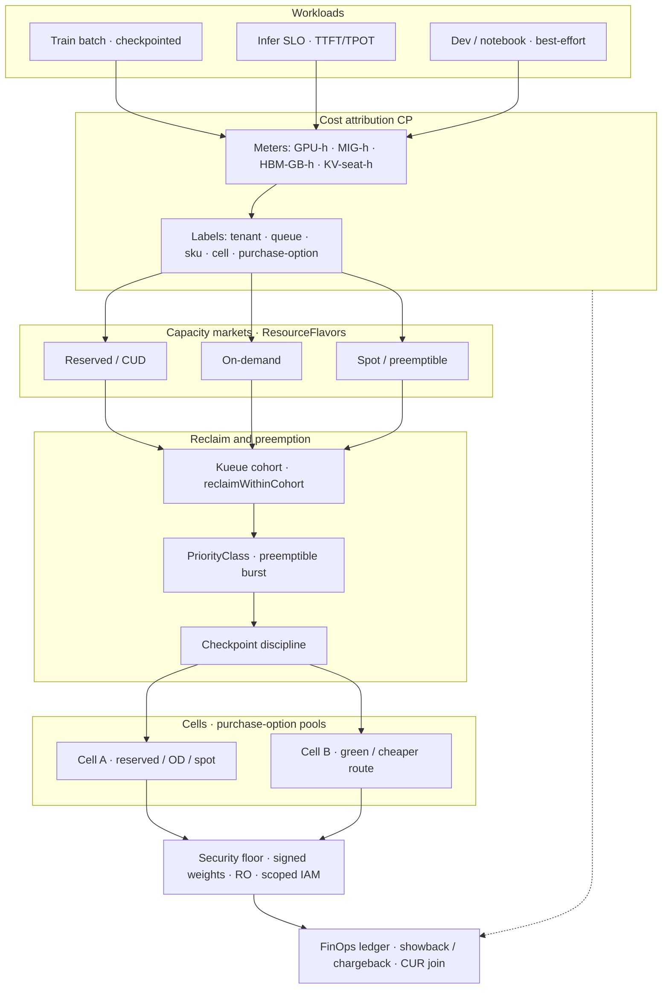

# Lesson 26 — AI/ML platform: GPU cost attribution, reclaim & spot/preemptible economics on the fleet

*2026-10-04*

## What interviewers are really probing

[Lesson 18](/lessons/18-gpu-node-pools-mig-timeslicing) gave you **SKU pools**. [Lesson 19](/lessons/19-gpu-topology-nvlink-rdma-nccl) made **topology** schedulable. [Lesson 20](/lessons/20-training-inference-scheduling-kueue-volcano) admitted **gangs** with Kueue fair-share and **reclaim**. [Lesson 21](/lessons/21-inference-serving-slos-ttft-tpot-kvcache) made **KV cache the capacity wallet**. [Lesson 23](/lessons/23-gpu-observability-dcgm-nccl-roofline) gave you **eyes**. [Lesson 24](/lessons/24-multi-cluster-inference-routing-capacity) routed **across cells**. [Lesson 25](/lessons/25-multi-tenant-gpu-isolation-quota) encoded **tenant quotas** and reserved-vs-burst. This lesson is the **FinOps layer**: **how do you attribute GPU cost truthfully, reclaim idle/borrowed capacity without burning restart waste, and run spot/preemptible vs on-demand/reserved economics — without breaking SLOs or relaxing weight/deploy hardening for “cheap” capacity?**

Interviewers at hyperscale AI platforms (fuel: [wafer-ai/gpu-perf-engineering-resources](https://github.com/wafer-ai/gpu-perf-engineering-resources)) want evidence you have **operated GPU fleet economics under interruption and contention**, not only “we turned on Kubecost”:

- **Cost attribution meters** — GPU-hours, MIG-profile-hours, HBM-GB-hours, KV-seat-hours ([L21](/lessons/21-inference-serving-slos-ttft-tpot-kvcache)); allocation vs utilization vs reserved-idle vs fragmentation waste ([L25](/lessons/25-multi-tenant-gpu-isolation-quota))
- **Showback vs chargeback** — labels for tenant / queue / sku / cell / purchase-option; OpenCost / Kubecost / cloud CUR join patterns
- **Reclaim economics** — Kueue `reclaimWithinCohort` / fair-share preemption; owner returns → preempt borrowers; checkpoint discipline; PriorityClass & preemptible burst queues ([L20](/lessons/20-training-inference-scheduling-kueue-volcano))
- **Spot / preemptible economics** — ResourceFlavors for on-demand vs spot; flavor fungibility; Karpenter / CA interruption handling (2-min spot notice, cordon/drain); diversification; when **not** to put inference or non-checkpointed multi-node train on spot
- **Committed use / reservations / savings plans** vs spot mix; idle reserved = still bill reserved rate
- **Cross-cell cost** — route inference to cheaper green capacity when digest-pinned ([L24](/lessons/24-multi-cluster-inference-routing-capacity)) vs sticky train topology ([L19](/lessons/19-gpu-topology-nvlink-rdma-nccl))
- **Gotchas** — billing SM% only; double-counting parent GPU + MIG; spot interrupt mid-gang without gang-aware reclaim; cost labels with PII/prompts; hydrating weights onto ephemeral spot without RO digest pins; shared writable model cache on spot fleets; train SA that can PutObject anywhere after interrupt retry storms
- **Security floor** — signed digests, private registries, RO mounts, GetObject-only WI, no shared writable caches, admission/RBAC, NetPol — **cheap capacity never relaxes** [L13](/lessons/13-ml-weights-checkpoint-hardening)/[L14](/lessons/14-ml-inference-training-deploy-hardening)

**Interview sentence:** “I attribute GPU-hours, HBM-GB-hours, and KV-seat-hours by tenant + queue + sku + cell + purchase-option; encode reserved vs burst reclaim in Kueue; prefer spot ResourceFlavors for checkpointed batch with on-demand fallback for SLO-critical inference; join OpenCost/CUR without leaking prompts; and never relax signed digests, RO mounts, or scoped IAM just because capacity is cheap.”

## Core diagram: Workloads → Attribution CP → Capacity markets → Reclaim → Cells → Security floor → FinOps ledger




**Read it left-to-right, then the ledger:** Workloads hit a **cost attribution control plane** that meters allocation truth (GPU / MIG / HBM / KV-seat hours) with labels that survive a CUR join. Those labels steer **ResourceFlavors** — reserved/CUD, on-demand, spot — into **reclaim & preemption** (cohort fair-share, PriorityClass, checkpoint discipline). Capacity lands in **cells** with purchase-option pools; inference may follow cheaper green cells when digests are pinned ([L24](/lessons/24-multi-cluster-inference-routing-capacity)), while train gangs stay topology-sticky ([L19](/lessons/19-gpu-topology-nvlink-rdma-nccl)). Everything sits on a **security floor** that does not bend for spot savings. The **FinOps ledger** closes showback/chargeback without PII in labels.

## Idiosyncrasies / operator depth

### 1. Meters that matter (stop billing vanity SM%)

| Meter | What it measures | Use when | Trap |
|---|---|---|---|
| **GPU-hours** | Allocated (or reserved) full-GPU time × SKU | Exclusive train / decode seats | SM% can look “busy” while allocation is idle reserved |
| **MIG-profile-hours** | `1g.10gb` / `2g.20gb` / … × time | Multi-tenant inference pools ([L18](/lessons/18-gpu-node-pools-mig-timeslicing)) | Counting parent GPU **and** MIG = double bill |
| **HBM-GB-hours** | Allocated HBM × time | Memory-bound inference / MoE expert shards ([L22](/lessons/22-prefill-decode-disagg-moe-serving)) | Ignoring HBM hides why “same GPU-h” costs differ |
| **KV-seat-hours** | Inference capacity wallet ([L21](/lessons/21-inference-serving-slos-ttft-tpot-kvcache)) | Product chargeback for shared models | Better product meter than raw SM% for decode |
| **Allocation** | Requested / reserved capacity | Finance truth for reserved seats | Not the same as utilization |
| **Utilization** | Actual SM / HBM / NVLink busy | Efficiency campaigns ([L23](/lessons/23-gpu-observability-dcgm-nccl-roofline)) | Never the only billable meter |
| **Reserved-idle** | Nominal reserved but unused | Showback to tenants; reclaim campaigns ([L25](/lessons/25-multi-tenant-gpu-isolation-quota)) | Still bills at reserved/CUD rate |
| **Fragmentation waste** | Free capacity wrong shape / topology | Profile rebalance; not “idle” | Fix binpack / MIG mix separately |

**Interview rule:** Bill **allocation + purchase-option**; report **utilization** and **restart waste** as efficiency, not as the invoice.

### 2. Showback vs chargeback — and the label contract

| Mode | Meaning | Operator rule |
|---|---|---|
| **Showback** | Visibility without hard invoice | Start here; build trust in meters |
| **Chargeback** | Actual internal invoice / cloud backcharge | Requires stable labels + CUR join |
| **Label contract** | `tenant`, `queue`, `sku`, `cell`, `purchase-option` | Allowlist on kube-state-metrics / OpenCost; **forbid** `prompt`, `user_email`, `session_raw` |
| **OpenCost / Kubecost** | Allocation from K8s requests + optional custom metrics | Export GPU/MIG extended resources; join external CUR |
| **Cloud CUR / BigQuery billing export** | SKU × purchase-option × account | Join on node/instance ID + time; never on prompt text |

**Gotcha:** High-cardinality labels from request IDs or prompt hashes blow cost pipelines and leak sensitive content. Chargeback cardinality belongs to **tenant/queue/sku/cell/purchase-option** — full stop.

### 3. Reclaim economics — Kueue as the market maker

| Mechanism | What happens | Cost implication |
|---|---|---|
| **`reclaimWithinCohort`** | Owner returns; preempt borrowers ([L20](/lessons/20-training-inference-scheduling-kueue-volcano)/[L25](/lessons/25-multi-tenant-gpu-isolation-quota)) | Burst tenants must tolerate preempt; bill borrowed separately |
| **Fair-share weights** | Equalize borrow under contention | Stops one tenant owning all burst forever |
| **PriorityClass** | Preemption order: reserved > OD > spot-burst | Encode economics in PriorityClass, not ad-hoc scripts |
| **Checkpoint discipline** | Workloads on burst/spot must checkpoint | Reclaim without ckpt = restart waste GPU-hours |
| **Gang-aware reclaim** | Preempt whole Workload | Mid-gang interrupt without gang reclaim = stranded ranks + wasted bill |

**Formula interviewers like:**  
`effective_cost = reserved_rate × (nominal) + od_rate × (od_used) + spot_rate × (spot_used) + restart_waste_rate × (preempt_restarts)`  
If you optimize only `spot_used` and ignore `restart_waste`, you can “save” yourself into a more expensive week.

### 4. Spot / preemptible vs on-demand — flavor fungibility

| Workload class | Prefer | Fallback | Never |
|---|---|---|---|
| **Checkpointed batch / single-node train** | Spot flavor | On-demand | Untested interrupt path |
| **Multi-node train with frequent ckpt + gang reclaim** | Spot *if* interrupt handler proven | On-demand / reserved | Spot without gang-aware reclaim |
| **Non-checkpointed multi-node train** | Reserved / on-demand | — | Spot (interrupt mid-collective = expensive restart) |
| **SLO-critical inference (TTFT/TPOT)** | Reserved / on-demand | Cross-cell green reserved ([L24](/lessons/24-multi-cluster-inference-routing-capacity)) | Spot as primary (2-min notice ≠ SLO budget) |
| **Best-effort notebook / sweep** | Spot | On-demand | Consuming reserved train island |

**Flavor fungibility:** Prefer spot → on-demand → reserved for **batch**; prefer reserved → on-demand (never spot) for **SLO infer**. Encode as Kueue ResourceFlavors + admission, not tribal knowledge.

### 5. Interruption handling — Karpenter / Cluster Autoscaler

| Event | Handler | Operator check |
|---|---|---|
| **Spot 2-minute notice** | Node condition / Event; cordon; drain with grace | Drain timeout < notice; pods must exit clean |
| **Karpenter interruption queue** | Consolidates / replaces; respects NodePool requirements | Separate NodePools for GPU spot vs OD vs reserved |
| **Cluster Autoscaler** | Expands OD when spot pending too long | Pending threshold must not starve queues forever |
| **Diversification** | Multi-AZ, multi-family, capacity-optimized allocation | Single family = correlated reclaim storms |
| **Inference on spot?** | Only if replica N+2 and drain is graceful **and** SLO budget allows | Most fleets: **no** for primary decode |

### 6. Committed use / reservations / savings plans

| Instrument | Behavior | Gotcha |
|---|---|---|
| **CUD / Reserved / Savings Plan** | Discount for committed capacity | **Idle reserved still bills reserved rate** — show reserved-idle separately ([L25](/lessons/25-multi-tenant-gpu-isolation-quota)) |
| **On-demand** | Flexibility premium | Use as bridge when spot dry or for SLO seats |
| **Spot / preemptible** | Deep discount + interrupt | Savings vanish if restart waste dominates |
| **Mix policy** | CUDs cover baseline infer + sticky train; spot covers elastic batch | Don’t CUD 100% and also run everything on spot “for savings” without reclaim math |

### 7. Cross-cell cost arbitration (tie L24)

| Signal | Action |
|---|---|
| **Cell B green + cheaper KV-seat-hours** | Route **digest-pinned** inference to B ([L24](/lessons/24-multi-cluster-inference-routing-capacity)) |
| **Train gang on Cell A reserved** | Stay sticky — topology + NCCL ([L19](/lessons/19-gpu-topology-nvlink-rdma-nccl)) |
| **Spot dry on A, green spot on B** | Move **checkpointed batch** only if hydrate + security floor ready |
| **Reserved idle on A, starved infer on B** | Rebalance nominal **or** route infer — don’t only page finance |

### 8. Classic gotchas (say these out loud)

| Gotcha | Why it bites |
|---|---|
| **Billing SM% only** | Reserved-idle and fragmentation invisible; finance blindsided |
| **Double-count parent GPU + MIG** | Invoice inflated; tenants revolt |
| **Spot interrupt mid-gang** | Stranded ranks; restart waste > spot savings |
| **Cost labels with PII / prompts** | Privacy incident + cardinality explosion |
| **Hydrate weights onto ephemeral spot without RO digests** | Supply-chain hole sold as “FinOps” ([L13](/lessons/13-ml-weights-checkpoint-hardening)) |
| **Shared writable model cache on spot fleets** | Poison / exfil across trust + lost on interrupt ([L14](/lessons/14-ml-inference-training-deploy-hardening)) |
| **Train SA PutObject anywhere after retry storms** | Interrupt retries amplify lateral write risk |
| **SLO infer on spot “to save”** | TTFT burn during reclaim; customer-visible |

## Concrete commands & config

### Inventory — purchase-option labels, flavors, spot nodes

```bash
# Nodes by purchase-option / lifecycle
kubectl get nodes -L node.kubernetes.io/instance-type,karpenter.sh/capacity-type,purchase-option,nvidia.com/gpu.product

# Spot / preemptible candidates
kubectl get nodes -l karpenter.sh/capacity-type=spot -o wide
kubectl get nodes -l cloud.google.com/gke-preemptible=true -o wide   # GKE preemptible shape

# Kueue flavors + queues (reserved vs spot)
kubectl get resourceflavor,clusterqueue,localqueue -A
kubectl get clusterqueue -o yaml | rg -n "nominalQuota|borrowingLimit|flavors|preemption|reclaim"
```

### ResourceFlavors — reserved, on-demand, spot

```yaml
apiVersion: kueue.x-k8s.io/v1beta1
kind: ResourceFlavor
metadata:
  name: h100-reserved-rail-a
spec:
  nodeLabels:
    pool: train-reserved
    purchase-option: reserved
    topology.platform/rail: "a"
---
apiVersion: kueue.x-k8s.io/v1beta1
kind: ResourceFlavor
metadata:
  name: h100-ondemand
spec:
  nodeLabels:
    pool: gpu-ondemand
    purchase-option: on-demand
    karpenter.sh/capacity-type: on-demand
---
apiVersion: kueue.x-k8s.io/v1beta1
kind: ResourceFlavor
metadata:
  name: h100-spot
spec:
  nodeLabels:
    pool: gpu-spot
    purchase-option: spot
    karpenter.sh/capacity-type: spot
  # Prefer spot; workloads must tolerate preempt + checkpoint
```

### ClusterQueue — prefer spot for batch, reclaim reserved for owners

```yaml
apiVersion: kueue.x-k8s.io/v1beta1
kind: ClusterQueue
metadata:
  name: t1-batch-cq
spec:
  cohort: ml-org
  resourceGroups:
    - coveredResources: ["nvidia.com/gpu", "cpu", "memory"]
      flavors:
        - name: h100-spot
          resources:
            - name: nvidia.com/gpu
              nominalQuota: 32
              borrowingLimit: 64
        - name: h100-ondemand   # fungible fallback when spot dry
          resources:
            - name: nvidia.com/gpu
              nominalQuota: 8
              borrowingLimit: 16
        - name: h100-reserved-rail-a  # last resort for this batch CQ
          resources:
            - name: nvidia.com/gpu
              nominalQuota: 0
              borrowingLimit: 8
  preemption:
    withinClusterQueue: LowerPriority
    reclaimWithinCohort: Any
  fairSharing:
    weight: 1
---
apiVersion: kueue.x-k8s.io/v1beta1
kind: ClusterQueue
metadata:
  name: t1-infer-slo-cq
spec:
  cohort: ml-org
  resourceGroups:
    - coveredResources: ["nvidia.com/gpu", "cpu", "memory"]
      flavors:
        - name: h100-reserved-rail-a
          resources:
            - name: nvidia.com/gpu
              nominalQuota: 48
        - name: h100-ondemand
          resources:
            - name: nvidia.com/gpu
              nominalQuota: 16
              borrowingLimit: 16
        # intentionally NO spot flavor for SLO infer
  preemption:
    withinClusterQueue: LowerPriority
    reclaimWithinCohort: Any
```

### PriorityClass + preemptible burst queue

```yaml
apiVersion: scheduling.k8s.io/v1
kind: PriorityClass
metadata:
  name: gpu-reserved
value: 100000
globalDefault: false
description: Reserved / CUD seats — reclaim winners
---
apiVersion: scheduling.k8s.io/v1
kind: PriorityClass
metadata:
  name: gpu-ondemand
value: 50000
description: On-demand overflow
---
apiVersion: scheduling.k8s.io/v1
kind: PriorityClass
metadata:
  name: gpu-spot-burst
value: 10000
preemptionPolicy: PreemptLowerPriority
description: Spot / borrowed burst — must be checkpointed
```

### Karpenter NodePools — spot diversification + OD fallback (sketch)

```yaml
apiVersion: karpenter.sh/v1
kind: NodePool
metadata:
  name: gpu-spot-batch
spec:
  template:
    metadata:
      labels:
        pool: gpu-spot
        purchase-option: spot
    spec:
      requirements:
        - key: karpenter.sh/capacity-type
          operator: In
          values: ["spot"]
        - key: node.kubernetes.io/instance-type
          operator: In
          values: ["p5.48xlarge", "p5e.48xlarge", "p4d.24xlarge"]  # diversify
        - key: topology.kubernetes.io/zone
          operator: In
          values: ["us-east-1a", "us-east-1b", "us-east-1c"]
      taints:
        - key: nvidia.com/gpu
          value: "true"
          effect: NoSchedule
      nodeClassRef:
        group: karpenter.k8s.aws
        kind: EC2NodeClass
        name: gpu-spot
  disruption:
    consolidateAfter: 15m
    # Interruption handling: Karpenter drains on spot notice
---
apiVersion: karpenter.sh/v1
kind: NodePool
metadata:
  name: gpu-ondemand-fallback
spec:
  template:
    metadata:
      labels:
        pool: gpu-ondemand
        purchase-option: on-demand
    spec:
      requirements:
        - key: karpenter.sh/capacity-type
          operator: In
          values: ["on-demand"]
      taints:
        - key: nvidia.com/gpu
          value: "true"
          effect: NoSchedule
      nodeClassRef:
        group: karpenter.k8s.aws
        kind: EC2NodeClass
        name: gpu-od
```

### Spot notice → cordon/drain (operator loop)

```bash
# Watch interruption / Karpenter events
kubectl get events -A --field-selector reason=Interrupted -w
kubectl get nodeclaims -l karpenter.sh/capacity-type=spot -o wide

# Manual drain drill (chaos / game day)
NODE=$(kubectl get nodes -l karpenter.sh/capacity-type=spot -o jsonpath='{.items[0].metadata.name}')
kubectl cordon "$NODE"
kubectl drain "$NODE" --ignore-daemonsets --delete-emptydir-data --grace-period=90 --timeout=110s
# Assert: checkpointed jobs resume; SLO infer replicas never lived here
```

### Cost attribution — OpenCost + PromQL sketches

```bash
# OpenCost / Kubecost allocation API shape (cluster-local)
curl -s "http://opencost.opencost:9003/allocation/compute?window=24h&aggregate=label:tenant,label:purchase-option,label:sku"

# Ensure cost labels present on workloads
kubectl get pods -A -L tenant,queue,sku,cell,purchase-option | head
```

```promql
# Allocated GPU-hours by tenant + purchase-option (allocation truth)
sum by (tenant, purchase_option, sku) (
  kube_pod_resource_request{resource="nvidia_com_gpu"}
  * on(namespace,pod) group_left(tenant, purchase_option, sku)
    kube_pod_labels
)

# MIG profile-hours (avoid double-count with parent GPU)
sum by (tenant, mig_profile) (
  rate(gpu_mig_allocated_seconds_total[1h])
)

# KV-seat-hours by tenant (inference product meter)
sum by (tenant, cell) (inference_kv_seats_inuse)

# Reserved-idle: nominal reserved - allocated on reserved flavors
# (recording rule sketch — join CQ nominal vs allocated)

# Restart waste after preempt (jobs restarted due to interruption)
sum by (tenant, queue) (
  increase(training_job_restarts_total{reason="preempt_or_spot"}[1d])
) * on(tenant, queue) group_left avg(job_gpu_request)
```

### CUR join pattern (sketch — no PII)

```sql
-- BigQuery / Athena shape: join K8s allocation export to CUR
SELECT
  a.tenant,
  a.queue,
  a.sku,
  a.cell,
  a.purchase_option,
  SUM(a.gpu_hours) AS alloc_gpu_hours,
  SUM(c.unblended_cost) AS cloud_cost,
  SUM(a.restart_waste_gpu_hours) AS restart_waste
FROM k8s_gpu_allocation a
JOIN cloud_cur c
  ON a.instance_id = c.line_item_resource_id
 AND a.hour = c.usage_hour
WHERE a.tenant IS NOT NULL
  -- never select prompt / user_email columns
GROUP BY 1,2,3,4,5;
```

### Checkpoint + weight hydrate on spot (security-preserving)

```yaml
# Job must: PriorityClass spot-burst, RO digest-pinned weights, scoped WI
apiVersion: batch/v1
kind: Job
metadata:
  name: t1-spot-train
  namespace: tenant-t1
  labels:
    tenant: t1
    queue: t1-batch
    sku: h100
    cell: cell-a
    purchase-option: spot
spec:
  template:
    metadata:
      annotations:
        platform.weight/digest: "sha256:REPLACE_ME"
      labels:
        tenant: t1
        purchase-option: spot
    spec:
      priorityClassName: gpu-spot-burst
      runtimeClassName: nvidia
      serviceAccountName: t1-train-sa
      nodeSelector:
        purchase-option: spot
      containers:
        - name: train
          image: registry.internal/train@sha256:REPLACE_ME
          resources:
            limits:
              nvidia.com/gpu: "8"
          volumeMounts:
            - name: weights
              mountPath: /models
              readOnly: true
            - name: scratch
              mountPath: /scratch
          env:
            - name: CHECKPOINT_URI
              value: s3://checkpoints/t1/jobs/t1-spot-train/
      volumes:
        - name: weights
          persistentVolumeClaim:
            claimName: t1-weights-ro
        - name: scratch
          emptyDir: {}
      restartPolicy: OnFailure
```

## Failures & fixes

| Symptom | Likely cause | Fix / mitigation |
|---|---|---|
| Finance bill ≠ OpenCost | Missing purchase-option / SKU labels; CUR join on wrong key | Enforce label contract; join on instance ID + hour |
| High util, still huge bill | Billing reserved-idle as “used”; SM%-only dashboards | Show reserved-idle separately; bill allocation |
| Double GPU invoice | Parent `nvidia.com/gpu` + MIG both in allocation | Meter MIG-profile-hours **or** parent — never both |
| Spot “savings” negative | Restart waste > discount; mid-gang interrupts | Checkpoint + gang-aware reclaim; diversify pools |
| Infer TTFT spikes on reclaim | SLO infer scheduled on spot | Remove spot flavor from infer CQ; reserved/OD only |
| Owner can’t reclaim reserved | Preemption off / burst PriorityClass too high | `reclaimWithinCohort`; PriorityClass ladder |
| Pending forever when spot dry | No OD fungible flavor | Add on-demand fallback flavor with borrowingLimit |
| Correlated reclaim storm | Single AZ / single family spot | Multi-AZ + multi-family capacity-optimized |
| Drain exceeds 2-min notice | Grace too long / non-preemptible pods | Shorter grace; only checkpointed workloads on spot |
| Weight miss on spot restart | Ephemeral cache / unsigned hydrate | RO digest pins + GetObject-only WI ([L13](/lessons/13-ml-weights-checkpoint-hardening)) |
| Shared `/models` poisoned on spot node | Writable shared cache | Per-tenant RO blobs; no shared writable ([L14](/lessons/14-ml-inference-training-deploy-hardening)) |
| Train SA writes foreign prefix after retries | Broad PutObject; retry storm | Prefix-scoped WI; deny cross-tenant Put |
| Cost labels contain prompts | Debug label copied to prod | Admission forbid list; OpenCost allowlist |
| Cross-cell route to “cheap” without digests | Cost arb before security floor | Digest-pinned hydrate **before** admit ([L24](/lessons/24-multi-cluster-inference-routing-capacity)) |
| Fragmentation looks like idle | Wrong MIG mix billed as reserved-idle | Separate fragmentation metric; defrag window ([L25](/lessons/25-multi-tenant-gpu-isolation-quota)) |
| CUD coverage low while spot high | Mix policy inverted | CUDs for baseline SLO + sticky train; spot for elastic batch |

## Security & hardening

**Cheap capacity is not a license to weaken the model supply chain.** Spot nodes, preemptible VMs, and aggressive reclaim amplify **hydrate storms, retry amplification, and ephemeral-disk confusion** — exactly when teams are tempted to “just cache weights writable on the node.” Same spirit as [L11](/lessons/11-cluster-security-pss-admission-rbac)–[L14](/lessons/14-ml-inference-training-deploy-hardening), applied to **FinOps + purchase-option pools**.

| Control | Why | Practice |
|---|---|---|
| **Signed weight + image digests** | Spot churn multiplies pull paths | Cosign verify; pin `@sha256:` on image **and** weight ([L12](/lessons/12-node-container-hardening-supply-chain)/[L13](/lessons/13-ml-weights-checkpoint-hardening)) |
| **Private registries** | Public pulls during interrupt retries = inventory + supply-chain | Admission deny external regs for train/serve |
| **RO mounts** | Writable model dirs on ephemeral spot = backdoors + lost state | `readOnly: true` on `/models`; scratch `emptyDir` only |
| **GetObject-only WI per tenant prefix** | Retry storms after interrupt amplify PutObject mistakes | IRSA / WI scoped to `s3://models/t1/*`; checkpoints Put only to `s3://checkpoints/t1/*` |
| **No shared writable model cache** | Spot node shared by burst tenants | Per-tenant content-addressed RO blobs; never `/models` hostPath RW |
| **Admission: RuntimeClass + digests + label contract** | Enforce GPU path + FinOps labels + no PII | VAP/Kyverno; forbid `prompt` / `user_email` labels |
| **NetPol default-deny** | Spot churn ≠ flat trust | Same-tenant + platform hydrate/scrape only ([L9](/lessons/09-networkpolicy-multi-nic-sflow)) |
| **RBAC / SA hygiene** | Interrupt retries + broad SA = lateral write | Per-tenant SA; never one train WI in all ns ([L14](/lessons/14-ml-inference-training-deploy-hardening)) |
| **Spot ≠ skip PSS** | “Ephemeral” is not “unprivileged optional” | Same PSS / seccomp / no privilege as reserved pools |
| **Audit cost + security events together** | FinOps incidents are often security incidents | Correlate preempt storms with GetObject/PutObject spikes |

### AI/ML weight, model & deployment hardening for cost-optimized capacity (required)

Running spot / preemptible pools does **not** relax [L13](/lessons/13-ml-weights-checkpoint-hardening)/[L14](/lessons/14-ml-inference-training-deploy-hardening). Every hydrate — especially after interrupt — must pull **signed, digest-pinned** weights onto **RO** volumes with **GetObject-only** identity. No shared writable cache “because spot disks die anyway.” Admission still requires RuntimeClass + digests; NetPol still default-denies; train SAs still cannot PutObject outside tenant checkpoint prefixes. Cross-cell cost routing only after digests are warm ([L24](/lessons/24-multi-cluster-inference-routing-capacity)).

| Scenario | Weight / model / deploy controls |
|---|---|
| **New spot NodePool** | Same image/weight policy as reserved; PSS identical; labels `purchase-option=spot` |
| **Spot train job** | Signed base; RO weights; checkpoint Put to **tenant** prefix only; PriorityClass `gpu-spot-burst` |
| **Interrupt + retry** | Re-verify digests on hydrate; no “use local dirty cache”; rate-limit PutObject |
| **Promote job spot → OD** | Keep same digests; only flavor/PriorityClass change |
| **Route infer to cheaper cell** | Digest pin + RO hydrate **before** traffic ([L24](/lessons/24-multi-cluster-inference-routing-capacity)) |
| **Incident: unsigned hydrate “to save egress”** | Freeze pool; revoke WI; rotate digests if tamper suspected |

```yaml
# Sketch: FinOps GPU security floor (platform CR shape)
apiVersion: policy.platform/v1
kind: GpuFinOpsGate
metadata:
  name: gpu-cost-floor
spec:
  match:
    labels:
      trust-domain: gpu-tenant
  require:
    imageDigestPin: true
    weightDigestPin: true
    cosignVerify: true
    privateRegistryOnly: true
    weightMount: "readOnly"
    sharedWritableModelCache: false
    workloadIdentity:
      objectGetOnly: true
      putObjectPrefixes: ["checkpoints/${tenant}/*"]
      getObjectPrefixes: ["models/${tenant}/*", "models/shared-base/*"]
      crossTenantPrefixAccess: false
      # interrupt retries must not widen PutObject
      maxPutObjectQpsPerSa: 20
    networkPolicy:
      defaultDeny: true
      allowSameTenantOnly: true
    admission:
      runtimeClasses: ["nvidia", "nvidia-mig", "kata-nvidia"]
      requireCostLabels: ["tenant", "queue", "sku", "cell", "purchase-option"]
      forbidLabelKeys: ["prompt", "user_email", "session_raw"]
    flavors:
      sloInferAllowSpot: false
      batchPreferSpot: true
      requireCheckpointAnnotationForSpot: true
    reclaim:
      gangAware: true
      meterRestartWaste: true
```

**Punchline:** GPU FinOps is a **security-critical capacity market**. Attribute with honest meters and labels; reclaim with Kueue + checkpoints; prefer spot for checkpointed batch and on-demand/reserved for SLO inference; join CUR cleanly — and **never** trade signed digests, RO mounts, or scoped IAM for a lower line item.

## Interview soundbites

- **“Bill allocation + purchase-option; report util and restart waste as efficiency — not the invoice.”**
- **“Meters: GPU-hours, MIG-profile-hours, HBM-GB-hours, KV-seat-hours — never SM% alone.”**
- **“Labels: tenant + queue + sku + cell + purchase-option; never prompts or PII.”**
- **“Nominal is reserved; borrow is burst with reclaim — checkpoint or don’t burst.”**
- **“Spot for checkpointed batch; on-demand/reserved for SLO infer — encode in ResourceFlavors.”**
- **“Idle reserved still bills reserved rate — show reserved-idle separately.”**
- **“2-minute spot notice is not an SLO budget.”**
- **“Gang-aware reclaim or you donate GPU-hours to stranded ranks.”**
- **“Route infer to cheaper green cells only when digests are pinned — cost after security.”**
- **“Never hydrate unsigned weights onto spot to save money.”**
- **“Next: GPU supply chain — weight registries, checkpoint lifecycle & cold-start hydrate economics.”**

## How this maps to the JD

Hyperscale + AI/ML platform JDs that mention **GPU FinOps, spot/preemptible fleets, chargeback, and utilization** are asking whether you can **run a capacity market under interruption** — not paste a Kubecost screenshot. This lesson lifts [L18](/lessons/18-gpu-node-pools-mig-timeslicing)–[L25](/lessons/25-multi-tenant-gpu-isolation-quota) into **attribution + reclaim + purchase-option economics** with [L13](/lessons/13-ml-weights-checkpoint-hardening)/[L14](/lessons/14-ml-inference-training-deploy-hardening) as a hard floor. Fuel: [wafer-ai/gpu-perf-engineering-resources](https://github.com/wafer-ai/gpu-perf-engineering-resources). **Next up — Lesson 27:** GPU supply chain — weight registries, checkpoint lifecycle & cold-start hydrate economics.

## Watch (talks & demos)

Real talks — watch after Failures & fixes.

### Divide and Conquer: Master GPU Partitioning and Visualize Savings with OpenCost

Kaysie Yu on GPU partitioning visibility via DCGM + OpenCost — how MIG / partitioning choices show up as **real savings**, not slideware. Operator takeaway: **cost attribution needs GPU-aware meters** (allocation by profile/SKU), not vanity SM% — wire OpenCost (or Kubecost) to the same labels you use for tenant/queue/purchase-option.

<iframe width="100%" height="360" src="https://www.youtube.com/embed/sH699gmFC0o" title="Divide and Conquer: Master GPU Partitioning and Visualize Savings with OpenCost" frameBorder="0" allow="accelerometer; autoplay; clipboard-write; encrypted-media; gyroscope; picture-in-picture; web-share" allowFullScreen></iframe>

[Open on YouTube](https://www.youtube.com/watch?v=sH699gmFC0o)

### Multitenancy and Fairness at Scale with Kueue

Aldo Culquicondor & Rajat Phull on nominal quotas, cohort borrowing, fair-share weights, and **reclaim preemption**. Operator takeaway: **encode reserved vs burst reclaim in ClusterQueues** — this is the control plane behind “owner returns → preempt borrowers,” and it is the right place to hang spot-burst PriorityClasses.

<iframe width="100%" height="360" src="https://www.youtube.com/embed/GYiuTQCvTx8" title="Multitenancy and Fairness at Scale with Kueue" frameBorder="0" allow="accelerometer; autoplay; clipboard-write; encrypted-media; gyroscope; picture-in-picture; web-share" allowFullScreen></iframe>

[Open on YouTube](https://www.youtube.com/watch?v=GYiuTQCvTx8)

### Run workloads efficiently on EKS with Karpenter and EC2 Spot Instances

AWS re:Invent talk on Spot + Karpenter: interruption handling, diversification across pools, and when Spot fits. Operator takeaway: adapt the same pattern to **GPU NodePools** — capacity-type requirements, multi-family diversification, cordon/drain within the notice window — and keep SLO inference off Spot.

<iframe width="100%" height="360" src="https://www.youtube.com/embed/yj55R8BvGzw" title="Run workloads efficiently on EKS with Karpenter and EC2 Spot Instances" frameBorder="0" allow="accelerometer; autoplay; clipboard-write; encrypted-media; gyroscope; picture-in-picture; web-share" allowFullScreen></iframe>

[Open on YouTube](https://www.youtube.com/watch?v=yj55R8BvGzw)

## References

- [OpenCost](https://www.opencost.io/) · [Kubecost](https://www.kubecost.com/) · [AWS CUR](https://docs.aws.amazon.com/cur/latest/userguide/what-is-cur.html) · [GCP BigQuery billing export](https://cloud.google.com/billing/docs/how-to/export-data-bigquery)
- [Kueue ClusterQueue](https://kueue.sigs.k8s.io/docs/concepts/cluster_queue/) · [Kueue Preemption / Fair Sharing](https://kueue.sigs.k8s.io/docs/concepts/preemption/) · [Kueue ResourceFlavor](https://kueue.sigs.k8s.io/docs/concepts/resource_flavor/)
- [Karpenter concepts](https://karpenter.sh/docs/concepts/) · [AWS EC2 Spot interruptions](https://docs.aws.amazon.com/AWSEC2/latest/UserGuide/spot-interruptions.html) · [GKE Spot VMs](https://cloud.google.com/kubernetes-engine/docs/concepts/spot-vms)
- [NVIDIA MIG User Guide](https://docs.nvidia.com/datacenter/tesla/mig-user-guide/) · [DCGM](https://docs.nvidia.com/datacenter/dcgm/latest/user-guide/index.html)
- [wafer-ai/gpu-perf-engineering-resources](https://github.com/wafer-ai/gpu-perf-engineering-resources) — fleet / inference arithmetic fuel
- Prior: [25 — Multi-tenant GPU isolation / quota](/lessons/25-multi-tenant-gpu-isolation-quota) · [24 — Multi-cluster inference routing / capacity](/lessons/24-multi-cluster-inference-routing-capacity) · [23 — GPU observability](/lessons/23-gpu-observability-dcgm-nccl-roofline) · [21 — Inference serving SLOs](/lessons/21-inference-serving-slos-ttft-tpot-kvcache) · [20 — Training/inference scheduling](/lessons/20-training-inference-scheduling-kueue-volcano) · [19 — GPU topology](/lessons/19-gpu-topology-nvlink-rdma-nccl) · [18 — GPU node pools / MIG](/lessons/18-gpu-node-pools-mig-timeslicing) · [14 — ML deploy hardening](/lessons/14-ml-inference-training-deploy-hardening) · [13 — ML weights](/lessons/13-ml-weights-checkpoint-hardening) · [11 — Cluster security](/lessons/11-cluster-security-pss-admission-rbac)
- Next: **Lesson 27 — AI/ML platform: GPU supply chain — weight registries, checkpoint lifecycle & cold-start hydrate economics**

## Quick self-check

Out loud, in under two minutes:

1. Name four cost meters beyond SM% (GPU-hours, MIG-profile-hours, HBM-GB-hours, KV-seat-hours) and why allocation ≠ utilization ≠ reserved-idle ≠ fragmentation.
2. Explain showback vs chargeback and the five label keys you allow on cost series — plus two keys you forbid.
3. Walk reclaimWithinCohort when a reserved owner returns; why checkpoint discipline and gang-aware reclaim matter to the bill.
4. Prefer spot vs on-demand vs reserved for: checkpointed batch, SLO inference, non-checkpointed multi-node train — and how ResourceFlavors encode that.
5. List five security controls that still bind on spot capacity — signed digests, private registry, RO mounts, GetObject-only prefix WI, no shared writable cache, admission label contract, NetPol/RBAC.
