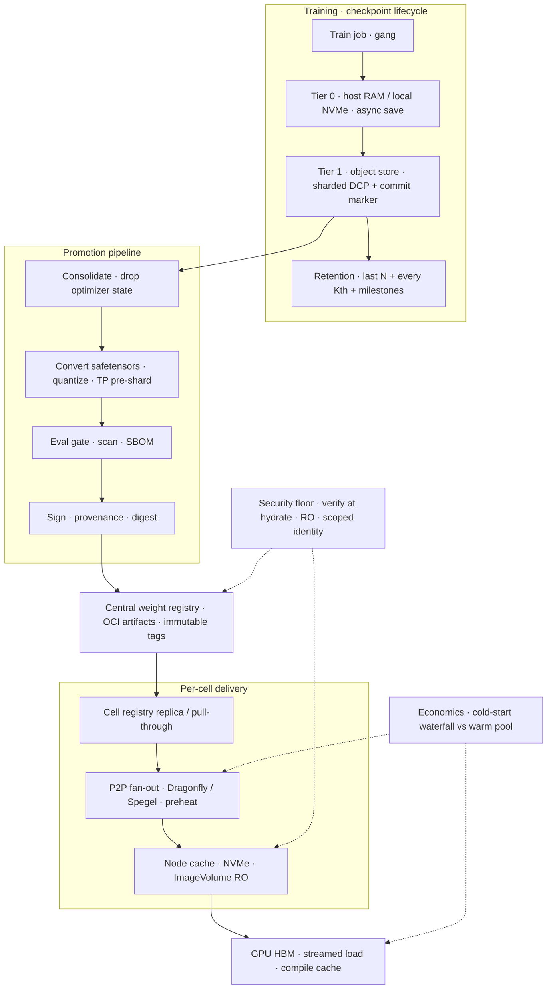

# Lesson 27 — AI/ML platform: GPU supply chain — weight registries, checkpoint lifecycle & cold-start hydrate economics

*2026-10-05*

## What interviewers are really probing

[Lesson 13](/lessons/13-ml-weights-checkpoint-hardening) made weights **trustworthy** (signing, bucket IAM, encryption). [Lesson 21](/lessons/21-inference-serving-slos-ttft-tpot-kvcache) made KV cache the **capacity wallet**. [Lesson 24](/lessons/24-multi-cluster-inference-routing-capacity) routed traffic **across cells** only where digests were warm. [Lesson 26](/lessons/26-gpu-cost-attribution-reclaim-spot) priced **restart waste** on spot. This lesson is the **logistics layer** underneath all of them: **how does a 140 GB–1 TB artifact get from a training run to 2,000 GPUs — fast, cheaply, and without a single unsigned byte landing in HBM?**

Interviewers at AI platform shops (fuel: [wafer-ai/gpu-perf-engineering-resources](https://github.com/wafer-ai/gpu-perf-engineering-resources)) want evidence you've actually lived through a **scale-up storm** — not that you know `docker pull` exists:

- **Weight registries** — OCI artifacts (ORAS / modctl / CNCF ModelPack) vs bucket prefixes vs Hugging Face mirrors; Harbor/ECR/Artifact Registry with immutable tags, retention, replication to cells
- **Delivery planes** — Kubernetes **ImageVolume** (KEP-4639: beta 1.33, on by default 1.35), KServe **Modelcars** / `LocalModelCache`, CSI (Mountpoint for S3, GCS FUSE, Hyperdisk ML ROX, FSx/Lustre), local NVMe caches
- **Fan-out** — P2P (Dragonfly, Spegel, Kraken), preheat-before-scale, lazy loading (SOCI, eStargz, Nydus, GKE image streaming) and *why lazy loading doesn't help inference weights much*
- **Load path into HBM** — safetensors mmap vs Run:ai Model Streamer (`--load-format runai_streamer`), TP-pre-sharded weights, `torch.compile`/CUDA-graph caches; the cold-start waterfall
- **Checkpoint lifecycle** — sharded/async checkpoints (PyTorch DCP), commit markers, tiering NVMe → object store, retention ladders, promotion: train ckpt → consolidated serving weights → quantize → eval → sign → registry
- **Economics** — cold-start seconds × GPU $/s × scale events vs warm-pool idle cost; registry egress; double disk footprint; checkpoint storage that grows forever
- **Security floor** — digest pins, signatures verified **at hydrate time**, kubelet cached-image credential gap, P2P peers that verify digests, `weights_only` deserialization, prefix-scoped write identity, Object Lock on released weights

**Interview sentence:** “I treat weights like images with a different physics: package them as signed OCI artifacts, replicate them to every cell's registry, preheat them P2P onto the node pool before the autoscaler needs them, mount them read-only via ImageVolume or a model cache, and stream them into HBM with a parallel loader — and I measure cold start as a waterfall so I know whether to buy bandwidth, warm pools, or nothing.”

## Core diagram: Train → Checkpoint tiers → Promote → Registry → Cell replicas → Fan-out → Node cache → HBM




**Read it top-down, then the dotted lines:** a training gang writes **async, sharded checkpoints** to a fast tier and drains them to object storage with a **commit marker**; a **retention ladder** keeps cost bounded. A promotion pipeline turns *one* checkpoint into a **serving artifact** — optimizer state dropped, safetensors, maybe quantized and TP-pre-sharded — gated by eval and scanning, then **signed** and pushed as an immutable OCI artifact. The central registry replicates to each **cell** ([L24](/lessons/24-multi-cluster-inference-routing-capacity)); P2P **preheats** node caches before the autoscaler fires; pods mount weights **read-only** and stream into HBM. Security is enforced **at hydrate time**, not just at push time; economics decides how much of this pipeline you keep warm.

## Idiosyncrasies / operator depth

### 1. Weights are not images (the physics are different)

| Property | Container image | Model weights |
|---|---|---|
| Size | 2–15 GB (CUDA base layers dominate) | 15 GB (8B FP16) → 140 GB (70B FP16) → 700 GB+ (400B+/MoE) |
| Access pattern | Lazy: a few % of files touched at start | **All bytes, once, sequentially** into HBM before first token |
| Change rate | Every deploy | Every model release / fine-tune (rarer, bigger) |
| Dedup | Shared base layers | Little cross-model dedup; LoRA adapters are the exception |
| Lazy loading wins? | Yes (SOCI / eStargz / Nydus / image streaming) | **Mostly no** for inference — you need 100% before serving; helps training data and adapter catalogs |

**Interview rule:** Lazy loading shortens *time-to-container-start*, not *time-to-first-token*. For inference weights you win with **bandwidth (parallel streams), locality (preheat), and fan-out (P2P)**.

### 2. Registry choices — where the canonical bytes live

| Plane | Strengths | Traps |
|---|---|---|
| **OCI registry** (Harbor, ECR, Artifact Registry, ACR) via ORAS / modctl / ModelPack | Digests, immutable tags, RBAC, replication, retention, cosign/notation, P2P ecosystem, **ImageVolume** native | Per-layer size limits on some registries; push of 500 GB needs chunked uploads; GC is a stop-the-world chore on some backends |
| **Object store prefix** (S3 / GCS) | Cheapest at rest, highest aggregate throughput, Run:ai streamer/Mountpoint native | No digest semantics unless you add a manifest; "latest/" prefixes get overwritten; IAM sprawl |
| **Hugging Face Hub / mirror** | Ecosystem, model cards | Public egress, rate limits, mutable `main` revision — **pin commit SHA**; tokens become crown jewels ([L14](/lessons/14-ml-inference-training-deploy-hardening)) |
| **Model registry metadata** (MLflow, W&B, Vertex Model Registry) | Lineage, stages, eval results | It's a *catalog*, not a CDN — never the hot path for 2,000 pods |

Common hyperscale pattern: **object store is the warehouse, OCI registry is the shipping manifest, model registry is the ledger.** Pin by digest everywhere; tags are for humans.

### 3. Delivery into the pod — five patterns

| Pattern | How | Good for | Gotcha |
|---|---|---|---|
| **Baked into image** | `COPY model/` in Dockerfile | Tiny models, air-gapped edge | Every engine CVE patch re-ships 140 GB; double disk |
| **Init container download** | `aws s3 cp` / `huggingface-cli download` to `emptyDir` | Simple, universal | Serial, per-pod, no sharing across pods on the node; burns ephemeral storage |
| **ImageVolume / Modelcar** | `volumes[].image.reference` (K8s ≥1.33 beta; on by default 1.35) or KServe `oci://` sidecar | Model and engine versioned separately; shared per node; registry tooling | Runtime support (CRI-O ≥1.31, containerd 2.1+); kubelet image GC can evict it; `IfNotPresent` credential gap (see Security) |
| **CSI mount of object store / parallel FS** | Mountpoint for S3, GCS FUSE (file cache + parallel download), Hyperdisk ML (ROX, many attachers), FSx/Lustre | Huge models, many replicas, no per-node copy | Default stripe count 1 on Lustre = one OST bottleneck; FUSE page-cache thrash; mmap random reads over network |
| **Node-local model cache** | KServe `LocalModelCache`, DaemonSet preloader, Dragonfly preheat to NVMe | Predictable cold start, scale-to-one | Cache coherence = digest naming; disk sizing; who evicts? |

### 4. The cold-start waterfall (measure it, or you'll buy the wrong fix)

| Stage | Typical range (order-of-magnitude) | Fix lever |
|---|---|---|
| Node provision (cloud VM + boot) | 2–10 min for GPU SKUs | Warm/standby nodes, capacity reservations ([L26](/lessons/26-gpu-cost-attribution-reclaim-spot)) |
| Driver / device plugin / DCGM ready | 30–120 s | Pre-baked node images with driver; GPU Operator readiness gates ([L18](/lessons/18-gpu-node-pools-mig-timeslicing)) |
| Engine image pull (8–15 GB) | 30 s – several min | SOCI parallel pull, image streaming, Spegel, pre-pulled on AMI |
| Weight fetch to node | bytes ÷ effective bandwidth | P2P, preheat, cell-local replica, CSI parallel reads |
| Load into HBM | seconds → minutes | Run:ai streamer concurrency, TP-pre-sharded files, safetensors (not pickle) |
| Compile / CUDA graphs / warmup | 10–60 s+ | Persist `torch.compile`/Inductor + Triton caches; warmup requests before Ready |

**Bandwidth arithmetic interviewers love** (plain math, not a benchmark):

- 70B FP16 ≈ 140 GB. At 25 Gb/s effective per node ≈ 3.1 GB/s → **~45 s best case** for one node.
- 100 nodes scale at once against one registry/bucket front with 100 Gb/s egress (12.5 GB/s): 14 TB ÷ 12.5 GB/s ≈ **~19 minutes** — the origin is the bottleneck.
- With P2P, origin serves ≈ one copy per cell; nodes serve each other over the 200–400 Gb/s fabric → back toward the single-node number.

### 5. Cold-start economics — warm pool vs pay-per-start

`cold_start_cost ≈ scale_events × cold_start_seconds × GPUs_per_replica × gpu_$_per_second + SLO_penalty(queue during cold start)`

`warm_pool_cost ≈ warm_replicas × GPUs_per_replica × idle_hours × gpu_$_per_hour`

*Illustrative example only (made-up round numbers):* at a notional $4/GPU-h, an 8-GPU replica with a 10-minute cold start burns ≈ $5.33 per scale-up in GPUs that are allocated but not serving. Ten scale-ups a day ≈ $53/day — cheaper than one idle warm replica (8 × 24 × $4 ≈ $768/day). **But** if those 10 minutes blow your TTFT SLO for a paying tenant ([L21](/lessons/21-inference-serving-slos-ttft-tpot-kvcache)), the penalty term dominates and one warm replica (or a hot node cache + standby node) wins. The point: **shrink the cold start first** (cheap: preheat, P2P, streamer), *then* decide the warm-pool size.

### 6. Checkpoint lifecycle — the forgotten storage bill

| Fact | Why it matters |
|---|---|
| Full training state ≈ **14–16 bytes/param** with mixed-precision Adam (bf16 weights + fp32 master + 2 moments) | 70B → ~1 TB per checkpoint; checkpoint every 30 min × weeks = petabytes |
| Serving weights ≈ **2 bytes/param** (bf16), 1 or less quantized | Promotion should *drop* optimizer state — 7–8× smaller artifact |
| **Sync save stalls the gang** | Every GPU idles during write → use async save (PyTorch DCP `async_save`) staged to host RAM/NVMe |
| **Sharded** (one file per rank) | Parallel write, but restore to a *different* world size needs resharding (DCP handles; hand-rolled formats don't) |
| **Commit marker** | Readers must only trust checkpoints with a completed metadata/`COMMITTED` object — partial checkpoints after preemption are the #1 corrupt-restore cause |
| **Retention ladder** | Keep last N (restart), every Kth (rollback), milestones (Object Lock); lifecycle the rest to cold storage or delete |

### 7. Cell replication & preheat (ties L24)

- Replicate **released** artifacts to every serving cell's registry (Harbor replication / ECR cross-region replication / Artifact Registry remote repos). Never cross-region pull on the hot path.
- **Preheat on promotion, not on scale-up**: when a new digest is promoted, push it to the target node pool's caches (Dragonfly preheat, DaemonSet pre-puller, `LocalModelCache`). Then flip traffic.
- Router admits a cell for model X only when cache-hit ratio for digest X ≥ threshold ([L24](/lessons/24-multi-cluster-inference-routing-capacity)).

### 8. Classic gotchas (say these out loud)

- `latest` / HF `main` as a reference → half the fleet on one weight set, half on another, mismatched tokenizer.
- containerd stores compressed **and** unpacked layers; a 140 GB model image can cost ~280 GB of disk → `DiskPressure` evictions.
- Kubelet image GC (`imageGCHighThresholdPercent`) silently evicts the model image on a busy node → next pod pays full cold start.
- Lustre default stripe count 1 → a 500 GB load serialized through one storage target.
- `torch.compile` cache in `/tmp` of the pod → paid again on every restart.
- Preemption mid-save → no commit marker → restore from the *previous* good checkpoint, not the partial one.
- P2P daemon enabled but peers can't reach each other (NetworkPolicy / security groups) → every node falls back to origin, silently.

## Concrete commands & config

### Package & push weights as a signed OCI artifact

```bash
# ORAS: weights as an OCI artifact (no runnable config)
oras push registry.internal/models/llama-70b-instruct:2026-10-05 \
  --artifact-type application/vnd.cncf.model.manifest.v1+json \
  model-00001-of-00030.safetensors model-00002-of-00030.safetensors \
  config.json tokenizer.json

# modctl (CNCF ModelPack tooling) — Modelfile like a Dockerfile (sketch)
modctl modelfile generate .
modctl build -t registry.internal/models/llama-70b-instruct:2026-10-05 -f Modelfile .
modctl push registry.internal/models/llama-70b-instruct:2026-10-05

# Resolve the digest and sign the DIGEST, never the tag
DIGEST=$(oras resolve registry.internal/models/llama-70b-instruct:2026-10-05)
cosign sign --key kms://projects/p/locations/l/keyRings/r/cryptoKeys/model-signer \
  registry.internal/models/llama-70b-instruct@${DIGEST}
cosign verify --key kms://... registry.internal/models/llama-70b-instruct@${DIGEST}
```

### ImageVolume — engine image and weights as separate artifacts

```yaml
apiVersion: v1
kind: Pod
metadata:
  name: vllm-llama70b
  labels: { tenant: t1, model: llama-70b, purchase-option: reserved }
spec:
  runtimeClassName: nvidia
  containers:
  - name: vllm
    image: registry.internal/engines/vllm@sha256:ENGINE_DIGEST
    args: ["--model", "/models", "--tensor-parallel-size", "8"]
    volumeMounts:
    - name: weights
      mountPath: /models
      readOnly: true
    resources:
      limits: { nvidia.com/gpu: 8 }
  volumes:
  - name: weights
    image:
      reference: registry.internal/models/llama-70b-instruct@sha256:WEIGHT_DIGEST
      pullPolicy: IfNotPresent   # see Security: pair with credential verification
```

### KServe — Modelcar (`oci://`) and node-local cache

```yaml
apiVersion: serving.kserve.io/v1beta1
kind: InferenceService
metadata:
  name: llama-70b
spec:
  predictor:
    model:
      modelFormat: { name: huggingface }
      storageUri: oci://registry.internal/models/llama-70b-instruct@sha256:WEIGHT_DIGEST
---
apiVersion: serving.kserve.io/v1alpha1
kind: LocalModelCache          # preload onto node-group NVMe before scale-up
metadata:
  name: llama-70b-cache
spec:
  sourceModelUri: s3://models-released/llama-70b-instruct/WEIGHT_DIGEST/
  modelSize: 150Gi
  nodeGroups: ["h100-serving-cell-a"]
```

### Streamed load into HBM (vLLM + Run:ai Model Streamer)

```bash
vllm serve s3://models-released/llama-70b-instruct/WEIGHT_DIGEST/ \
  --load-format runai_streamer \
  --tensor-parallel-size 8
# env tuning — raise until storage saturates, back off on host-RAM pressure
export RUNAI_STREAMER_CONCURRENCY=16
# persist compile caches on a node-local volume so restarts skip recompile
export TORCHINDUCTOR_CACHE_DIR=/var/cache/inductor
export TRITON_CACHE_DIR=/var/cache/triton
```

### Fan-out — Spegel (local OCI mirror) and Dragonfly preheat

```bash
# Spegel: every node serves its containerd content store to peers
helm upgrade --install spegel oci://ghcr.io/spegel-org/helm-charts/spegel \
  -n spegel --create-namespace

# Dragonfly preheat on promotion (sketch — via manager API or Harbor P2P provider)
curl -s -X POST https://dragonfly-manager.internal/api/v1/jobs \
  -H 'Content-Type: application/json' \
  -d '{"type":"preheat","args":{"type":"image","url":"https://registry.internal/v2/models/llama-70b-instruct/manifests/sha256:WEIGHT_DIGEST","scope":"all_peers"}}'
```

### Parallel filesystem layout (Lustre) — born wide

```bash
lfs setstripe -c -1 -S 4M /lustre/models/llama-70b-instruct   # before download
lfs getstripe /lustre/models/llama-70b-instruct/model-00001-of-00030.safetensors
lfs migrate -c -1 -S 4M /lustre/models/old-model/*.safetensors  # restripe in place
```

### Kubelet — keep model images from being GC'd mid-day

```yaml
# KubeletConfiguration (node pool for serving)
imageGCHighThresholdPercent: 90
imageGCLowThresholdPercent: 80
imageMinimumGCAge: 24h
# size NVMe for: engine image x2 (compressed + unpacked) + hottest N model digests x2 + headroom
```

### Async, sharded checkpoints with a commit marker (PyTorch DCP)

```python
import torch.distributed.checkpoint as dcp

state = {"model": model.state_dict(), "optim": optimizer.state_dict(), "step": step}
ckpt_dir = f"s3://ckpt-t1/run-{run_id}/step-{step:08d}"   # tenant-scoped prefix
fut = dcp.async_save(state, checkpoint_id=ckpt_dir)       # stage to host, write in background
# ... training continues ...
fut.result()                                             # before the next save / before exit
if rank == 0:
    write_marker(f"{ckpt_dir}/COMMITTED")                # restore logic trusts ONLY committed dirs
```

### Retention ladder as lifecycle policy (S3 sketch)

```json
{
  "Rules": [
    { "ID": "expire-intermediate-ckpts", "Status": "Enabled",
      "Filter": { "Tag": { "Key": "ckpt-class", "Value": "intermediate" } },
      "Expiration": { "Days": 7 } },
    { "ID": "rollback-ckpts-to-cold", "Status": "Enabled",
      "Filter": { "Tag": { "Key": "ckpt-class", "Value": "rollback" } },
      "Transitions": [ { "Days": 14, "StorageClass": "GLACIER_IR" } ] },
    { "ID": "abort-partial-uploads", "Status": "Enabled",
      "Filter": {}, "AbortIncompleteMultipartUpload": { "DaysAfterInitiation": 2 } }
  ]
}
```

### Measure the waterfall

```bash
# where did the time go for one pod?
kubectl get events -n serve --field-selector involvedObject.name=vllm-llama70b-abc12 \
  --sort-by=.lastTimestamp
kubectl describe node gpu-a-017 | grep -A5 -i 'conditions\|diskpressure'
crictl images | grep models/       # is the weight artifact already on this node?
crictl imagefsinfo                 # disk headroom
```

```promql
# Pod created -> Ready, per model, p95 — custom recording rule built from pod status timestamps
# (kube-state-metrics kube_pod_created + kube_pod_status_ready_time), exported as a histogram
histogram_quantile(0.95, sum by (le, model) (rate(serve:pod_cold_start_seconds_bucket{namespace="serve"}[1h])))
# Weight cache hit ratio per cell (custom exporter from preloader / Dragonfly)
sum by (cell) (rate(model_cache_hits_total[15m])) / sum by (cell) (rate(model_cache_requests_total[15m]))
# Origin egress during scale-up (registry / bucket front)
sum(rate(registry_http_response_size_bytes_sum{repo=~"models/.*"}[5m]))
```

## Failures & fixes

| Symptom | Likely cause | Fix / mitigation |
|---|---|---|
| Scale-up takes 20+ min, registry returns 429/503 | Thundering herd on origin; no P2P | P2P fan-out (Dragonfly/Spegel); cell-local replica; preheat on promotion; rate-limit concurrent pulls |
| Node `DiskPressure` → evictions after new model rollout | Compressed + unpacked double-store; old digests never GC'd | Size NVMe for 2× hot set; registry + node retention; dedicated imagefs |
| Random pods cold-start slowly on "warm" nodes | Kubelet image GC evicted the model artifact | Tune GC thresholds; pin via preloader; cache-hit metric per node |
| Weight load 10× slower than storage spec | Single-stream loader; Lustre stripe count 1; FUSE without parallel download | `runai_streamer` + concurrency; `lfs setstripe -c -1`; GCS FUSE parallel download / file cache |
| Every restart pays +50 s before Ready | `torch.compile` / Triton cache in pod `/tmp` | Persist caches on node-local volume keyed by engine+model digest |
| Half the fleet answers differently | Mutable tag / HF `main` revision | Digest pin in manifests; admission rejects tag-only references |
| P2P installed, origin egress unchanged | Peers blocked by NetworkPolicy / SGs; daemon not in mirror config | Allow peer ports node-to-node; verify containerd `hosts.toml`; alert on P2P hit ratio |
| Restore crashes / NaNs after preemption | Partial checkpoint with no commit marker | Restore only `COMMITTED` dirs; async save + wait before exit; preStop hook to flush |
| Training throughput drops 15–30% around saves | Synchronous checkpointing stalls gang | `dcp.async_save`; stage to host RAM/NVMe; stagger ranks |
| Host OOM during async save | Staging full state to RAM on a node already tight | Stage to NVMe; reduce save frequency; pin memory budget |
| Checkpoint bucket bill doubles monthly | No retention ladder; incomplete multipart uploads | Lifecycle rules by `ckpt-class`; abort incomplete MPU; promote-then-delete |
| Can't restore on a different GPU count | Hand-rolled per-rank format | DCP resharding; or consolidate on promotion |
| ImageVolume pod stuck `ContainerCreating` | Feature gate off / runtime too old / artifact media type unsupported | K8s ≥1.33 with gate (default on 1.35); CRI-O ≥1.31 or containerd 2.1+; check runtime logs |
| New cell routed traffic but TTFT terrible for 10 min | Router admitted cell before weights were warm | Gate cell admission on digest cache-hit ratio ([L24](/lessons/24-multi-cluster-inference-routing-capacity)) |

## Security & hardening

**The supply chain is the attack surface.** Every hop in the diagram — checkpoint bucket, promotion pipeline, registry, replica, P2P peer, node cache, loader — is a place where someone can swap bytes, read bytes they shouldn't, or skip a check "just this once" to beat a cold-start SLO. [L12](/lessons/12-node-container-hardening-supply-chain) and [L13](/lessons/13-ml-weights-checkpoint-hardening) defined the controls; this lesson enforces them **at every hop, especially at hydrate time**.

| Control | Why | Practice |
|---|---|---|
| **Digest-pinned references only** | Tags and HF `main` are mutable | Admission (VAP/Kyverno) rejects `image.reference` / `storageUri` without `@sha256:`; HF pulls pinned to commit SHA |
| **Verify signatures at hydrate, not just at push** | Replicas, caches, and P2P peers are new trust boundaries | Cosign/notation verify in admission (policy-controller / Kyverno `verifyImages` covers ImageVolume refs too); preloader re-verifies digest before marking cache ready |
| **Kubelet cached-image credential gap** | With `IfNotPresent`, a pod *without* pull credentials can use a private weight artifact another tenant's pod already pulled to that node | Dedicated node pools per trust domain ([L25](/lessons/25-multi-tenant-gpu-isolation-quota)); `AlwaysPullImages` admission for shared pools; kubelet `KubeletEnsureSecretPulledImages` (KEP-2535) where available |
| **P2P peers verify content** | A compromised node could serve poisoned pieces | Content-addressed transfer with digest check on assembly; mTLS between Dragonfly peers; P2P only inside a trust domain; NetPol limits peer ports to the node CIDR |
| **Read-only mounts, no shared writable cache** | Writable `/models` = persistence + tamper | `readOnly: true`; ImageVolume is RO by design; preloader writes, pods only read |
| **Safe deserialization** | Pickle checkpoints execute code on load | safetensors for serving; `torch.load(weights_only=True)` for training restore; scan with ModelScan/picklescan in promotion |
| **Prefix-scoped identities** | Train SAs with broad PutObject can overwrite released weights | Train WI: Put only `ckpt-<tenant>/run-*`; promotion SA: Put only `models-staging/`; release bucket write = signer pipeline only; serving WI: GetObject only on released digests |
| **Immutable released artifacts** | Rollback must be trustworthy; ransomware/delete | Registry immutable tags; S3 Object Lock / GCS bucket lock on `models-released`; versioning + MFA delete on checkpoint milestones |
| **Encryption with key separation** | Checkpoints = full IP incl. optimizer state | SSE-KMS/CMEK per tenant; decrypt grant only to that tenant's train/serve identities |
| **Provenance links** | "Which data and code produced this?" during an incident | SLSA provenance: run ID, code commit, data snapshot digest, base model digest → attached as OCI referrer |
| **Registry hygiene** | Retention without signing = deleted evidence; replication without RBAC = leak | Harbor project RBAC per tenant; retention keeps signed releases; replication only for `released` repos |
| **Preheat jobs are privileged paths** | Preheat credentials can read every model | Separate preheat identity per tenant scope; audit preheat requests |

### AI/ML weight, model & deployment hardening across the supply chain (required)

| Stage | Weight / model / deploy controls |
|---|---|
| **Checkpoint write** | Tenant-prefixed bucket; KMS per tenant; train SA Put only to its run prefix; commit marker written last; no public ACLs |
| **Checkpoint restore** | Only `COMMITTED` dirs; `weights_only=True`; verify manifest hashes before resume |
| **Promotion** | Drop optimizer state; convert to safetensors; scan; eval gate; SBOM/model card; sign digest with KMS-backed key; attach provenance |
| **Registry** | Immutable tags; per-tenant project RBAC; replication only of signed releases; Object Lock/immutability on released |
| **Fan-out & cache** | P2P inside trust domain with digest verification; node pools per trust domain; preloader re-verifies; RO mounts |
| **Pod admission** | `@sha256:` required for engine **and** weights; signature verified; RuntimeClass; PSS restricted; NetPol default-deny (egress only to registry/bucket endpoints) ([L14](/lessons/14-ml-inference-training-deploy-hardening)) |
| **Incident: suspected tampered weights** | Freeze promotion; revoke serving WI on that digest; purge node caches by digest; re-hydrate from Object-Locked release; rotate signing key if signer compromised |

```yaml
# Kyverno sketch: weights must be digest-pinned and signed, mounts RO
apiVersion: kyverno.io/v1
kind: ClusterPolicy
metadata:
  name: model-weights-supply-chain
spec:
  validationFailureAction: Enforce
  rules:
  - name: imagevolume-digest-pinned
    match:
      any:
      - resources: { kinds: [Pod], namespaceSelector: { matchLabels: { trust-domain: gpu-tenant } } }
    validate:
      message: "Weight ImageVolumes must be digest-pinned (@sha256:)."
      foreach:
      - list: "request.object.spec.volumes[?image]"
        deny:
          conditions:
            any:
            - key: "{{ element.image.reference }}"
              operator: NotEquals
              value: "*@sha256:*"
  - name: verify-weight-signatures
    match:
      any:
      - resources: { kinds: [Pod] }
    verifyImages:
    - imageReferences: ["registry.internal/models/*"]
      attestors:
      - entries:
        - keys:
            kms: "awskms:///arn:aws:kms:us-east-1:111122223333:alias/model-signer"
```

**Punchline:** fast hydrate and strong provenance are not in tension — **content addressing gives you both**. If every hop moves bytes by digest and verifies on arrival, you can P2P, cache, and preheat aggressively without ever trusting the pipe.

## Interview soundbites

- **"Weights aren't images: inference needs 100% of the bytes before the first token, so lazy loading barely helps — bandwidth, locality, and fan-out do."**
- **"Object store is the warehouse, OCI registry is the manifest, model registry is the ledger — pin by digest everywhere."**
- **"Preheat on promotion, not on scale-up."**
- **"100 nodes × 140 GB against one origin is a 19-minute outage; P2P turns it back into a 45-second load."**
- **"Measure cold start as a waterfall — node, driver, image, weights, HBM, compile — then buy the fix for the biggest bar."**
- **"Shrink the cold start first, then size the warm pool from SLO penalty vs idle GPU-hours."**
- **"A training checkpoint is 7–8× bigger than the serving artifact — promotion drops optimizer state, then signs."**
- **"Async, sharded saves with a commit marker; restore only what committed."**
- **"IfNotPresent plus a shared node means a tenant can mount weights it never had credentials for."**
- **"Verify at hydrate, not just at push — every cache and peer is a new trust boundary."**
- **"Next: inference autoscaling & scale-to-zero — token-metric HPA/KEDA, warm pools, and GPU node provisioning latency."**

## How this maps to the JD

Hyperscale + AI/ML platform JDs that say **"model deployment at scale," "artifact management," "fast rollout across clusters,"** or **"supply-chain security"** are asking whether you can move very large, very valuable artifacts across 100+ clusters without melting the origin or trusting the pipe. This lesson ties [L12](/lessons/12-node-container-hardening-supply-chain)/[L13](/lessons/13-ml-weights-checkpoint-hardening) (provenance) to [L19](/lessons/19-gpu-topology-nvlink-rdma-nccl) (fabric bandwidth), [L21](/lessons/21-inference-serving-slos-ttft-tpot-kvcache) (TTFT SLOs), [L24](/lessons/24-multi-cluster-inference-routing-capacity) (cell readiness), and [L26](/lessons/26-gpu-cost-attribution-reclaim-spot) (restart waste economics). Fuel: [wafer-ai/gpu-perf-engineering-resources](https://github.com/wafer-ai/gpu-perf-engineering-resources). **Next up — Lesson 28:** inference autoscaling & scale-to-zero — token-metric HPA/KEDA, warm pools, and GPU node provisioning latency.

## Watch (talks & demos)

Real talks — watch after Failures & fixes.

### Scaling up Without Slowing Down: Accelerating Pod Start Time

A KubeCon framework talk comparing on-demand image loading, P2P, pre-warming nodes, and checkpoint/restore — and explicitly calling out that **inference (needs the whole model) and training (gradual access) want different fixes**. Operator takeaway: this is the decision matrix behind the cold-start waterfall; the Q&A on Spegel and containerd's double-store is gold for the disk-pressure gotcha.

<iframe width="100%" height="360" src="https://www.youtube.com/embed/RJ6Lt9bVNTw" title="Scaling up Without Slowing Down: Accelerating Pod Start Time" frameBorder="0" allow="accelerometer; autoplay; clipboard-write; encrypted-media; gyroscope; picture-in-picture; web-share" allowFullScreen></iframe>

[Open on YouTube](https://www.youtube.com/watch?v=RJ6Lt9bVNTw)

### Dragonfly V2.4.0 — Intro, Updates, Data Distribution in AI Infrastructure

Wenbo Qi & Chenyu Zhang (Ant Group), KubeCon EU 2026. Demo: package a Hugging Face model with modctl, push to Harbor (RBAC, retention, signing), **preheat via Dragonfly**, then mount it as an OCI volume next to a vLLM container. Operator takeaway: the end-to-end "model as a separate, signed, preheated artifact" pipeline in one live demo.

<iframe width="100%" height="360" src="https://www.youtube.com/embed/zjCFSEVvaX4" title="Dragonfly V2.4.0 - Intro, Updates, Data Distribution in AI Infrastructure" frameBorder="0" allow="accelerometer; autoplay; clipboard-write; encrypted-media; gyroscope; picture-in-picture; web-share" allowFullScreen></iframe>

[Open on YouTube](https://www.youtube.com/watch?v=zjCFSEVvaX4)

### Streamlined Efficiency: Unshackling Kubernetes Image Volumes for Rapid AI Model and Dataset Loading

Esteban Rey (Microsoft) & Yifan Yuan (Alibaba Cloud), KubeCon EU 2025. How to use **ImageVolume** with streaming so huge models and datasets mount without a full pull or re-packaging existing object-store blobs. Operator takeaway: the tradeoffs between converting to OCI artifacts vs streaming from what you already have — and the disk-space math.

<iframe width="100%" height="360" src="https://www.youtube.com/embed/XqL5lh32lr8" title="Streamlined Efficiency: Unshackling Kubernetes Image Volumes for Rapid AI Model and Dataset Loading" frameBorder="0" allow="accelerometer; autoplay; clipboard-write; encrypted-media; gyroscope; picture-in-picture; web-share" allowFullScreen></iframe>

[Open on YouTube](https://www.youtube.com/watch?v=XqL5lh32lr8)

## References

- [KEP-4639: OCI VolumeSource](https://www.kubernetes.dev/resources/keps/4639/) · [Kubernetes 1.31 Image Volume blog](https://kubernetes.io/blog/2024/08/16/kubernetes-1-31-image-volume-source/) · [Image volumes docs](https://kubernetes.io/docs/tasks/configure-pod-container/image-volumes/)
- [KServe Modelcars (OCI storage)](https://kserve.github.io/website/latest/modelserving/storage/oci/) · [KServe LocalModelCache](https://kserve.github.io/website/docs/model-serving/generative-inference/modelcache/localmodel)
- [ORAS](https://oras.land/) · [CNCF ModelPack / modctl](https://github.com/modelpack/modctl) · [Harbor](https://goharbor.io/) · [Sigstore cosign](https://docs.sigstore.dev/cosign/signing/overview/)
- [Dragonfly](https://d7y.io/) · [Spegel](https://github.com/spegel-org/spegel) · [SOCI snapshotter](https://github.com/awslabs/soci-snapshotter)
- [Run:ai Model Streamer](https://github.com/run-ai/runai-model-streamer) · [vLLM Run:ai streamer loading](https://docs.vllm.ai/en/latest/models/extensions/runai_model_streamer.html) · [AWS: Fast model loading for AI inference on EKS](https://aws.amazon.com/blogs/containers/fast-model-loading-for-ai-inference-on-amazon-eks/) · [NVIDIA Dynamo: Fast model weight loading](https://docs.nvidia.com/dynamo/v1.4.2/kubernetes/model-deployment/model-loading/fast-model-loading)
- [PyTorch Distributed Checkpoint (DCP)](https://pytorch.org/docs/stable/distributed.checkpoint.html) · [safetensors](https://huggingface.co/docs/safetensors/index) · [Mountpoint for Amazon S3 CSI](https://github.com/awslabs/mountpoint-s3-csi-driver) · [Cloud Storage FUSE CSI](https://cloud.google.com/kubernetes-engine/docs/how-to/persistent-volumes/cloud-storage-fuse-csi-driver)
- [KEP-2535: Ensure secret pulled images](https://github.com/kubernetes/enhancements/tree/master/keps/sig-node/2535-ensure-secret-pulled-images) · [Kyverno verifyImages](https://kyverno.io/docs/policy-types/cluster-policy/verify-images/)
- [wafer-ai/gpu-perf-engineering-resources](https://github.com/wafer-ai/gpu-perf-engineering-resources) — fleet / inference arithmetic fuel
- Prior: [26 — GPU cost attribution / reclaim / spot](/lessons/26-gpu-cost-attribution-reclaim-spot) · [25 — Multi-tenant GPU isolation / quota](/lessons/25-multi-tenant-gpu-isolation-quota) · [24 — Multi-cluster inference routing / capacity](/lessons/24-multi-cluster-inference-routing-capacity) · [21 — Inference serving SLOs](/lessons/21-inference-serving-slos-ttft-tpot-kvcache) · [19 — GPU topology](/lessons/19-gpu-topology-nvlink-rdma-nccl) · [18 — GPU node pools / MIG](/lessons/18-gpu-node-pools-mig-timeslicing) · [14 — ML deploy hardening](/lessons/14-ml-inference-training-deploy-hardening) · [13 — ML weights](/lessons/13-ml-weights-checkpoint-hardening) · [12 — Supply chain](/lessons/12-node-container-hardening-supply-chain)
- Next: **Lesson 28 — AI/ML platform: inference autoscaling & scale-to-zero — token-metric HPA/KEDA, warm pools, and GPU node provisioning latency**

## Quick self-check

Out loud, in under two minutes:

1. Why does lazy loading (SOCI/eStargz) help engine images but barely help inference weights? What *does* help?
2. Do the arithmetic: 100 nodes pull a 140 GB model from a 100 Gb/s origin. How long, and how do P2P and preheat-on-promotion change it?
3. Walk the cold-start waterfall from node provision to first token, and name one fix per stage.
4. How big is a 70B training checkpoint vs its serving artifact, and what does promotion drop, convert, verify, and sign?
5. Explain the `IfNotPresent` cached-image credential gap and two ways to close it — plus three other controls that must hold at hydrate time.
