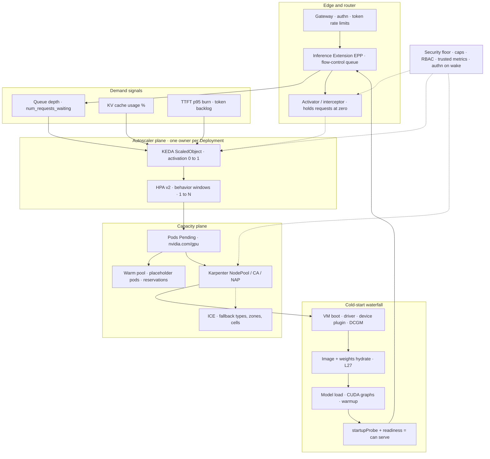

# Lesson 28 — AI/ML platform: inference autoscaling & scale-to-zero — token-metric HPA/KEDA, warm pools & GPU node provisioning latency

*2026-10-06*

## What interviewers are really probing

[Lesson 21](/lessons/21-inference-serving-slos-ttft-tpot-kvcache) said *"autoscale on queue depth and KV util, not CPU"* in one paragraph. This lesson is the long version, the one where the interviewer keeps asking "and then what happens?" [Lesson 22](/lessons/22-prefill-decode-disagg-moe-serving) split prefill from decode, so now you have two pools with two scaling signals. [Lesson 24](/lessons/24-multi-cluster-inference-routing-capacity) spilled traffic across cells when one cell ran out. [Lesson 25](/lessons/25-multi-tenant-gpu-isolation-quota) capped GPUs per tenant. [Lesson 26](/lessons/26-gpu-cost-attribution-reclaim-spot) priced idle and spot capacity. [Lesson 27](/lessons/27-gpu-supply-chain-weight-registry-hydrate) measured the cold-start waterfall. The question underneath all of it: **when traffic doubles in 90 seconds, how fast does a new token-serving replica actually show up? What did the warm capacity that made it fast cost you? And what stops a bad metric from scaling you to 512 H100s?**

What they check for (fuel: [wafer-ai/gpu-perf-engineering-resources](https://github.com/wafer-ai/gpu-perf-engineering-resources), platform framing):

- **Signal choice.** Why CPU % and GPU-util % are wrong for LLMs. What `vllm:num_requests_waiting`, `vllm:kv_cache_usage_perc`, TTFT p95 burn, and tokens-of-backlog actually measure. Leading vs lagging signals.
- **Autoscaler plumbing.** HPA v2 + prometheus-adapter vs KEDA `ScaledObject` (activation vs scaling thresholds, `cooldownPeriod`, the generated `keda-hpa-*`) vs Knative KPA (stable/panic windows, activator) vs LLM-aware routing (Gateway API Inference Extension EPP / llm-d).
- **HPA behavior math.** The replica formula, the 10% tolerance (configurable per HPA since KEP-4951), stabilization windows, scale policies, and how not-yet-Ready pods are counted.
- **The cold-start waterfall from the autoscaler's side.** Metric lag, then Pending pod, then NodeClaim, then GPU VM (or **ICE**), then driver/device plugin, then image, then weights, then CUDA graphs, then Ready.
- **Warm capacity.** Per-model floors, placeholder pods, warm nodes, cached weights, vLLM sleep mode, EC2 warm pools, and when scale-to-zero is right.
- **Scale-down safety.** Streams that run for minutes, `preStop` drains, PDB blind spots, Karpenter consolidation budgets and `do-not-disrupt`.
- **Security.** The autoscaler is a **spend API** and scale-from-zero is a **wake path**. Treat both like production auth surfaces.

**Interview sentence:** "I scale LLM serving on demand signals the GPU can't fake — queue depth, KV-cache pressure, and TTFT burn — computed at the router, not self-reported by pods. I size the HPA windows to the cold start I've measured. I buy warm capacity per SLO tier: hot floors for paying tenants, placeholder-warmed nodes for bursts, zero for the long tail. And I cap every scaler with maxReplicas, quota, and NodePool limits, because an autoscaler is just an API that spends GPU-hours."

## Core diagram: Demand signal → Autoscaler → Pending → Node provisioner → Cold-start waterfall → Ready → Router




**How to read it:** start top-down, then follow the dotted lines. Requests land at an authenticated gateway. The **EPP** (Gateway API Inference Extension endpoint picker) routes on KV-cache and queue state, and **queues requests itself** once the pool is saturated or empty. Demand signals come from the router and the engines. KEDA owns the **0 to 1** decision and generates an HPA that owns **1 to N**. New replicas go Pending. Some of them land on **warm capacity** right away (preempting placeholder pods). The rest wait on the **node provisioner**, which may hit insufficient capacity (ICE) and fall back. Each new node then runs the [L27](/lessons/27-gpu-supply-chain-weight-registry-hydrate) waterfall before it is truly Ready, and only then does the router admit it. Security dotted lines: caps on scalers, authn on the wake path, and least privilege on the freshly booted nodes.

## Idiosyncrasies / operator depth

### 1. Why CPU-util and GPU-util HPAs are wrong for LLMs

| Signal | What it actually measures on an LLM server | Failure when you scale on it |
|---|---|---|
| CPU % | Tokenizer / HTTP / detokenize threads | Barely moves with load, so you never scale; or a tokenizer hot loop scales you for no reason |
| GPU util % (`DCGM_FI_DEV_GPU_UTIL`) | "Was any kernel running in the sample period?" | Pegged near 100% with 2 streams or 200 because continuous batching keeps the GPU busy, so the signal is flat right where you need it to move ([L23](/lessons/23-gpu-observability-dcgm-nccl-roofline)) |
| RPS | Request count | An 8,192-token prompt is ~16× the prefill work of a 512-token one; same RPS can mean 0.3 or 3 replicas |
| **Queue depth** | Requests admitted but not scheduled (waiting on KV / batch slots) | Best default. A queue forms the moment demand exceeds capacity. Lags slightly when the batcher absorbs moderate load with the queue at 0 |
| **KV-cache usage** | Fraction of paged KV blocks in use | Leading indicator of preemption/recompute; near 0.9+ you're about to queue or evict |
| **TTFT p95 / SLO burn** | The objective itself | Histogram-derived, so it needs a window and lags. Great as a second trigger or for alerting |
| **Token backlog ÷ calibrated prefill throughput** | Seconds of queued prefill work | The most accurate prefill signal; needs one calibration run per model × GPU |

**Engine metric names you should be able to say out loud:**

| Engine | Queue | Running | KV pressure | Latency |
|---|---|---|---|---|
| vLLM | `vllm:num_requests_waiting` | `vllm:num_requests_running` | `vllm:kv_cache_usage_perc` (0–1) | `vllm:time_to_first_token_seconds`, `vllm:inter_token_latency_seconds`, `vllm:e2e_request_latency_seconds` |
| SGLang | `sglang:num_queue_reqs` | `sglang:num_running_reqs` | `sglang:token_usage` | `sglang:time_to_first_token_seconds` |
| TGI | `tgi_queue_size` | `tgi_batch_current_size` | `tgi_batch_current_max_tokens` | `tgi_request_queue_duration`, `tgi_request_mean_time_per_token_duration` |
| GIE EPP / llm-d | `llm_d_epp_flow_control_queue_size` | `llm_d_epp_request_running` | `llm_d_epp_flow_control_pool_saturation`, `inference_pool_average_kv_cache_utilization` | EPP estimated TTFT/TPOT (SLO-aware path) |

**Rename gotcha:** `vllm:gpu_cache_usage_perc` was deprecated in favor of `vllm:kv_cache_usage_perc`, hidden in 0.11, and **removed in 0.12**. An engine upgrade silently turns your KV trigger into "no series". KEDA's Prometheus scaler defaults `ignoreNullValues: true`, which reads that as "no demand", so the pool never scales. Pin metric names in CI against the engine version.

### 2. Four autoscaler planes — pick one owner per Deployment

| Plane | Scale range | Signals | Strengths | Idiosyncrasies |
|---|---|---|---|---|
| **HPA v2 + prometheus-adapter** | min ≥1 (0 only behind the alpha `HPAScaleToZero` gate) | `Pods` / `Object` / `External` metrics via `custom.metrics.k8s.io` / `external.metrics.k8s.io` | Native, `behavior` stanza, no extra controller in the loop | Adapter rules are regex config nobody owns; adapter outage means `FailedGetPodsMetric`, and the HPA **freezes** at the current count |
| **KEDA ScaledObject** | **0** to N | Any scaler (Prometheus, OTel add-on, HTTP add-on) | Scale-to-zero, `activationThreshold`, `fallback`, `scalingModifiers` formulas | KEDA does 0↔1 itself and creates `keda-hpa-<name>` for 1↔N; **never add a second HPA**; only one external-metrics APIService per cluster |
| **Knative KPA** (KServe "Knative" mode) | 0 to N | Concurrency or RPS per pod | Activator buffers requests at zero, panic mode for bursts | 60 s stable window, panic window 10% of it (6 s) at 200% threshold; each new revision spins up `initial-scale` pods, so **a config change doubles GPU demand during rollout** |
| **LLM-aware router** (GIE EPP / llm-d) | Signal source for KEDA | Flow-control queue, pool saturation, token backlog, predicted TTFT | Signals computed by a trusted component that sees every request; it holds requests when the pool is at zero | EPP queues live in memory, so an EPP restart drops queued requests; flow control must be enabled for those metrics to exist |

**Interview rule:** "One autoscaler owns a Deployment's replica count." Two HPAs (or KEDA plus a hand-written HPA, or KPA plus HPA) fight. You'll see the replica count oscillate between their desired values every sync.

### 3. HPA math that bites

- **Formula:** `desired = ceil(current × currentMetric ÷ target)`. Multiple metrics are computed independently and the **max** wins.
- **Tolerance:** no action while the ratio is within ±10% (`--horizontal-pod-autoscaler-tolerance`). KEP-4951 (beta, on by default in 1.35) adds per-HPA `behavior.scaleUp.tolerance` / `scaleDown.tolerance`. Use a tighter scale-up tolerance (e.g., 0.05) on expensive GPU pools where 10% equals a whole replica.
- **Sync:** the controller evaluates every 15 s. Add Prometheus scrape (15–30 s), any recording-rule interval, and KEDA's query: **45–90 s before a pod even goes Pending**. KEDA's OTel add-on pushes metrics and removes most of the scrape lag.
- **Default behavior:** scaleUp has no stabilization and allows +100% or +4 pods per 15 s (whichever is larger). scaleDown uses a **300 s** stabilization window and allows −100% per 15 s.
- **Loading pods:** for `Pods` metrics, pods that are Pending or not yet exporting metrics count as 0 on scale-up (vLLM's `/metrics` only comes up after the model loads), which damps overshoot. For **`External` metrics with `AverageValue`** (what KEDA emits), the desired count is just `ceil(total ÷ target)`, with **no readiness discount**. While a replica spends 6 minutes hydrating, demand stays high and the HPA keeps adding replicas: **overshoot**. When they all go Ready together, demand collapses and you **flap**.
- **Fix:** set `scaleUp.stabilizationWindowSeconds` to roughly your measured cold start (llm-d's guide ships 300 s for both directions). Or use a demand-aware formula (`scalingModifiers`) that subtracts pods already coming up, for example `demand - pending`.

### 4. KEDA specifics operators trip on

| Field | Default | What it really does |
|---|---|---|
| `pollingInterval` | 30 s | How often KEDA checks triggers **for activation** (0↔1). While running, the HPA's 15 s sync drives queries |
| `cooldownPeriod` | 300 s | Wait before going **1 to 0** only. It does *not* govern N to N-1; that's the HPA `behavior.scaleDown` |
| `initialCooldownPeriod` | 0 | Grace after creation before the first scale-to-zero. Set it ≥ cold start or a fresh deploy scales to 0 mid-load |
| `minReplicaCount` / `idleReplicaCount` | 0 / unset | With min ≥1, **activation is ignored** (the scaler is always active) |
| `activationThreshold` | 0 | Wake only when the metric is **strictly greater** than the threshold. Set it above noise so one probe request doesn't buy 8 GPUs |
| `fallback` | none | Replica count to hold after `failureThreshold` failed queries. Pick a safe **floor**, not max, or a Prometheus outage becomes a cost spike |
| `maxReplicaCount` | **100** | Not set? You have a 100-replica ceiling. At 8 GPUs per replica that's 800 GPUs. Admission must require it (Security) |

The HPA shows `minReplicas: 1` while the Deployment is at 0. That's normal: KEDA manages 0↔1 and the HPA disables itself (`ScalingActive=False, ScalingDisabled`) when the target is 0.

### 5. Scale-from-zero needs a signal that exists at zero

At 0 replicas there is no pod and no `/metrics`. `vllm:num_requests_waiting` **cannot wake you up**. The wake signal has to come from something that **holds the request**:

- the Knative **activator**, which buffers requests and reports concurrency to the KPA;
- KEDA **HTTP add-on** interceptor, via `HTTPScaledObject`;
- the GIE **EPP flow-control queue**. llm-d's guide uses `llm_d_epp_flow_control_queue_size` as the activation signal;
- a gateway or queue metric (requests 503'd or queued per model).

Also: **absent series ≠ zero**. Check the scrape target before you treat "no data" as "no demand".

### 6. The cold-start waterfall from the autoscaler's chair (ties L27)

| Stage | Order of magnitude | Levers |
|---|---|---|
| Metric to decision | 15–90 s | Push metrics (OTel add-on), short scrape on the trigger series, router-side signals |
| Pending to NodeClaim | ~1–10 s Karpenter batching (`BATCH_IDLE_DURATION` 1 s / `BATCH_MAX_DURATION` 10 s); CA scan 10 s | Flexible NodePools (several instance families/zones) |
| GPU VM launch + boot | 1–10 min, or **never** (ICE) | Reservations / capacity blocks for the floor (`karpenter.sh/capacity-type: reserved`), GKE ComputeClass priority fallbacks, cross-cell spill ([L24](/lessons/24-multi-cluster-inference-routing-capacity)) |
| Driver + device plugin + DCGM | 30–120 s | Accelerated AMI with driver baked in; Karpenter marks a NodeClaim *Initialized* only once `nvidia.com/gpu` is advertised and startup taints are removed ([L18](/lessons/18-gpu-node-pools-mig-timeslicing)) |
| Image + weights hydrate | seconds to tens of minutes | Pre-pulled images, preheat on promotion, P2P, `runai_streamer` ([L27](/lessons/27-gpu-supply-chain-weight-registry-hydrate)) |
| Model load + CUDA graph capture + warmup | 10 s to minutes | Persisted compile caches; `--enforce-eager` skips graph capture but costs decode throughput; warmup request before Ready |
| Ready to router admits | seconds | `startupProbe` budget ≥ worst-case load; readiness = "can generate a token", not "port open" |

**ICE is the hidden term.** Scale-out you can't get is worse than slow scale-out. Karpenter caches an unavailable offering for a few minutes and retries other types and zones. A NodePool pinned to one instance type in one zone just sits Pending. Have a plan: wider requirements, a reservation-backed floor, or route to another cell.

### 7. Warm capacity — buy down waterfall bars per SLO tier

| Tier | What it skips | Idle cost | Gotcha |
|---|---|---|---|
| **Hot floor** (`minReplicas` / `min-scale` per model) | Everything | Full GPU-hours | Spread the floor across ≥2 zones; floors come out of the tenant's guaranteed quota ([L25](/lessons/25-multi-tenant-gpu-isolation-quota)) |
| **Engine standby** (vLLM sleep mode level 1: weights to CPU RAM, KV dropped) | Load + compile; wake in seconds | GPU is still **allocated** to the pod | Frees HBM for model swapping on the same GPU, not K8s GPUs. Endpoints need `VLLM_SERVER_DEV_MODE=1` and **must not be exposed** |
| **Warm node via placeholder pods** (low-priority pause pods requesting GPUs) | VM boot + driver | Full node $ | Real pods preempt placeholders instantly; the evicted placeholder goes Pending and pulls the *next* node. With CA, priority must be ≥ `expendable-pods-priority-cutoff` (−10) or placeholders never trigger scale-up |
| **Cached node** (weights preheated on NVMe) | Hydrate | Disk only | Combine with placeholders: warm node + hot cache = load + compile only |
| **EC2 ASG warm pools** (Stopped / Hibernated) | Part of boot | EBS only while stopped | ASG feature only (self-managed node groups + CA). **Karpenter doesn't use ASGs.** Starting a stopped GPU instance can itself hit ICE |
| **Scale-to-zero** | Nothing | $0 | Minutes to first token. Fine for dev, eval, long-tail models, batch |

**Economics** (same shape as L27): `idle_cost = warm_units × GPUs × idle_h × $/GPU-h` vs `cold_cost = wakes × cold_s × GPUs × $/GPU-s + SLO_penalty`. Shrink the cold start first (cheap), then size warm tiers by **SLO penalty**, not by gut feel. Typical answer: *paying-tenant models: hot floor of 2 plus one placeholder-warmed node per zone; internal models: floor 1; long tail: zero with a "warming up" UX.*

### 8. Scale-down safety — streams are minutes long

- **HPA scale-in ignores PDBs.** PDBs only gate *evictions* (drain, consolidation). A Deployment scale-down deletes pods directly. Protect streams in the pod: `preStop` stops admission, waits for `vllm:num_requests_running` to reach 0 (or a deadline), and `terminationGracePeriodSeconds` covers the longest allowed generation.
- **Endpoint removal races SIGTERM.** Let the router/EPP drop the pod first (preStop sleep 5–15 s), then drain.
- **Scale-down policy:** window 300–600 s, at most 1 pod (or 10%) per 60 s. GPU replicas are too expensive to churn and too slow to re-acquire.
- **Karpenter consolidation is a second scale-down.** It evicts pods to repack nodes. Use `consolidateAfter` of 10–30 min on GPU NodePools, a `nodes: "0"` budget for `Underutilized` during business hours, and `karpenter.sh/do-not-disrupt: "true"` on pods that must finish (respected for voluntary disruption; NodePool `terminationGracePeriod` still bounds it).
- **Spot doesn't wait** ([L26](/lessons/26-gpu-cost-attribution-reclaim-spot)). A 2-minute notice is shorter than many streams. Primary decode stays off spot.

### 9. Multi-model, LoRA, and PD-disaggregated scaling

- **Multi-LoRA:** the scale unit is the **base-model Deployment**. Adapters are demand *inside* it. Scale on aggregate queue/KV, and watch `vllm:lora_requests_info` (running/waiting adapters) for adapter-slot starvation. Don't create per-adapter Deployments.
- **Per-model floors:** the top N models get `min ≥ 2` across zones, the long tail goes to 0, and a fleet-wide warm pool absorbs wake-ups. A per-model `maxReplicas` stops one viral model from draining the shared pool.
- **PD-disaggregation ([L22](/lessons/22-prefill-decode-disagg-moe-serving)):** prefill scales on **token backlog / TTFT**, decode on **KV usage / ITL**. Use separate ScaledObjects, keep the ratio bounded (e.g., 1:2–1:6 depending on prompt/output mix), and alert when it drifts. llm-d's token-aware path covers both topologies.
- **Multi-node replicas (TP across hosts):** scale the **group** (LeaderWorkerSet exposes a scale subresource), not individual pods. A half-scheduled group is pure waste, so pair it with gang admission ([L20](/lessons/20-training-inference-scheduling-kueue-volcano)).

## Concrete commands & config

### KEDA ScaledObject — vLLM on router + engine signals, scale-to-zero, sized windows

```yaml
apiVersion: keda.sh/v1alpha1
kind: ScaledObject
metadata:
  name: llama-70b
  namespace: serve-t1
  labels: { tenant: t1, model: llama-70b, gpu-tier: h100 }
spec:
  scaleTargetRef:
    name: llama-70b-vllm              # Deployment (or LeaderWorkerSet via apiVersion/kind)
  minReplicaCount: 0                  # long-tail model; paying tiers use 2
  maxReplicaCount: 12                 # REQUIRED by admission (8 GPUs each = 96 GPUs max)
  pollingInterval: 15                 # activation checks while at zero
  cooldownPeriod: 900                 # 1 -> 0 only after 15 min idle
  initialCooldownPeriod: 600          # don't scale a fresh deploy to 0 mid-hydrate
  fallback:
    failureThreshold: 4
    replicas: 2                       # a safe floor, NOT max
  advanced:
    horizontalPodAutoscalerConfig:
      behavior:
        scaleUp:
          stabilizationWindowSeconds: 300   # ~ measured cold start
          policies:
          - { type: Pods, value: 2, periodSeconds: 60 }
          selectPolicy: Max
        scaleDown:
          stabilizationWindowSeconds: 600
          policies:
          - { type: Pods, value: 1, periodSeconds: 120 }
  triggers:
  - type: prometheus                  # wake + queue signal from the ROUTER (exists at zero)
    name: epp-queue
    metadata:
      serverAddress: https://prometheus.monitoring.svc:9090
      query: sum(llm_d_epp_flow_control_queue_size{namespace="serve-t1",model_name="llama-70b"})
      threshold: "4"                  # queued requests per replica
      activationThreshold: "0"        # any queued request wakes it
      authModes: bearer
    authenticationRef: { name: prom-reader }
  - type: prometheus                  # KV pressure from engines (only meaningful at >= 1)
    name: kv-pressure
    metadata:
      serverAddress: https://prometheus.monitoring.svc:9090
      query: sum(vllm:kv_cache_usage_perc{namespace="serve-t1",model_name="llama-70b"})
      threshold: "0.75"               # AverageValue: replicas = ceil(sum / 0.75)
      authModes: bearer
    authenticationRef: { name: prom-reader }
---
apiVersion: keda.sh/v1alpha1
kind: TriggerAuthentication
metadata: { name: prom-reader, namespace: serve-t1 }
spec:
  secretTargetRef:
  - { parameter: bearerToken, name: prom-reader-token, key: token }
  - { parameter: ca, name: prom-reader-token, key: ca.crt }   # honored only because authModes is set
```

### Plain HPA v2 (prometheus-adapter / custom metrics) with behavior + tolerance

```yaml
apiVersion: autoscaling/v2
kind: HorizontalPodAutoscaler
metadata: { name: qwen-32b, namespace: serve-t2 }
spec:
  scaleTargetRef: { apiVersion: apps/v1, kind: Deployment, name: qwen-32b-vllm }
  minReplicas: 2
  maxReplicas: 16
  metrics:
  - type: Pods
    pods:
      metric: { name: vllm_num_requests_waiting }      # adapter-renamed series
      target: { type: AverageValue, averageValue: "6" }
  - type: Pods
    pods:
      metric: { name: vllm_kv_cache_usage_perc }
      target: { type: AverageValue, averageValue: "700m" }
  behavior:
    scaleUp:
      tolerance: 0.05                 # KEP-4951 (beta 1.35): 5% band on an expensive pool
      stabilizationWindowSeconds: 180
      policies: [ { type: Percent, value: 50, periodSeconds: 60 } ]
    scaleDown:
      stabilizationWindowSeconds: 600
      policies: [ { type: Pods, value: 1, periodSeconds: 120 } ]
```

### KServe InferenceService — Standard mode + KEDA, and Knative mode + KPA

```yaml
apiVersion: serving.kserve.io/v1beta1
kind: InferenceService
metadata:
  name: llama-8b
  annotations:
    serving.kserve.io/deploymentMode: "Standard"     # formerly RawDeployment
    serving.kserve.io/autoscalerClass: "keda"
spec:
  predictor:
    minReplicas: 1
    maxReplicas: 8
    autoScaling:
      metrics:
      - type: External
        external:
          metric:
            backend: prometheus
            serverAddress: https://prometheus.monitoring.svc:9090
            query: sum(vllm:num_requests_waiting{model_name="llama-8b"})
          target: { type: Value, value: "4" }
    model:
      modelFormat: { name: huggingface }
      storageUri: oci://registry.internal/models/llama-8b@sha256:WEIGHT_DIGEST
---
apiVersion: serving.kserve.io/v1beta1
kind: InferenceService
metadata:
  name: summarizer-longtail
  annotations:
    serving.kserve.io/deploymentMode: "Knative"            # formerly Serverless
    autoscaling.knative.dev/metric: "concurrency"
    autoscaling.knative.dev/target: "8"                    # soft target per pod
    autoscaling.knative.dev/min-scale: "0"
    autoscaling.knative.dev/max-scale: "4"
    autoscaling.knative.dev/initial-scale: "0"             # needs allow-zero-initial-scale: "true" in config-autoscaler
    autoscaling.knative.dev/activation-scale: "2"          # wake to 2, not 1 (herd)
    autoscaling.knative.dev/scale-down-delay: "15m"
    autoscaling.knative.dev/scale-to-zero-pod-retention-period: "30m"
    autoscaling.knative.dev/window: "120s"                 # stable window; panic = 10%
spec:
  predictor:
    containerConcurrency: 16                                # hard cap ~ KV-safe batch
    model:
      modelFormat: { name: huggingface }
      storageUri: oci://registry.internal/models/summarizer@sha256:WEIGHT_DIGEST
```

### Karpenter GPU NodePool — reserved floor first, guarded consolidation

```yaml
apiVersion: karpenter.sh/v1
kind: NodePool
metadata: { name: gpu-inference-h100 }
spec:
  weight: 50
  template:
    metadata:
      labels: { pool: inference, trust-domain: t1 }
    spec:
      nodeClassRef: { group: karpenter.k8s.aws, kind: EC2NodeClass, name: gpu-inference }
      requirements:
      - { key: karpenter.k8s.aws/instance-family, operator: In, values: [p5, p5e, p4d] }
      - { key: karpenter.sh/capacity-type, operator: In, values: [reserved, on-demand] }
      - { key: topology.kubernetes.io/zone, operator: In, values: [us-east-1a, us-east-1b, us-east-1d] }
      taints:
      - { key: nvidia.com/gpu, effect: NoSchedule }
      startupTaints:
      - { key: gpu.ready/not-yet, effect: NoSchedule }       # removed by GPU validator
      expireAfter: 720h
      terminationGracePeriod: 2h                              # hard bound on drains
  limits:
    nvidia.com/gpu: "256"                                    # pool-wide spend ceiling
  disruption:
    consolidationPolicy: WhenEmptyOrUnderutilized
    consolidateAfter: 30m
    budgets:
    - nodes: "10%"
    - nodes: "0"                                              # no repacking during peak (UTC cron)
      reasons: [Underutilized, Drifted]
      schedule: "0 12 * * mon-fri"
      duration: 12h
---
apiVersion: karpenter.k8s.aws/v1
kind: EC2NodeClass
metadata: { name: gpu-inference }
spec:
  role: KarpenterNode-gpu-inference           # ECR read + CNI only; NO model-bucket read
  amiSelectorTerms: [ { alias: al2023@v20260915 } ]   # pinned, accelerated variant auto-selected
  capacityReservationSelectorTerms:
  - tags: { purpose: inference-floor }
  metadataOptions:
    httpTokens: required                       # IMDSv2
    httpPutResponseHopLimit: 1                 # pods can't reach node creds
  instanceStorePolicy: RAID0                   # NVMe for weight cache (L27)
  subnetSelectorTerms: [ { tags: { tier: gpu-private } } ]
  securityGroupSelectorTerms: [ { tags: { role: gpu-node } } ]
```

### Placeholder overprovisioning — warm GPU nodes that real pods preempt

```yaml
apiVersion: scheduling.k8s.io/v1
kind: PriorityClass
metadata: { name: gpu-placeholder }
value: -1                    # below every real workload; >= CA cutoff (-10)
preemptionPolicy: Never      # placeholders never evict anyone
globalDefault: false
---
apiVersion: apps/v1
kind: Deployment
metadata: { name: gpu-warm-h100, namespace: capacity-warm-t1 }
spec:
  replicas: 2                # = warm nodes per pool (scale by schedule / proportional autoscaler)
  selector: { matchLabels: { app: gpu-warm } }
  template:
    metadata: { labels: { app: gpu-warm } }
    spec:
      priorityClassName: gpu-placeholder
      automountServiceAccountToken: false
      terminationGracePeriodSeconds: 0
      nodeSelector: { pool: inference, trust-domain: t1 }
      tolerations: [ { key: nvidia.com/gpu, operator: Exists, effect: NoSchedule } ]
      containers:
      - name: pause
        image: registry.k8s.io/pause@sha256:PAUSE_DIGEST
        resources:
          requests: { nvidia.com/gpu: 8, cpu: "1", memory: 1Gi }
          limits:   { nvidia.com/gpu: 8 }
        securityContext:
          runAsNonRoot: true
          readOnlyRootFilesystem: true
          allowPrivilegeEscalation: false
          capabilities: { drop: [ALL] }
```

### Serving pod lifecycle — Ready means "can generate", drain means "streams finished"

```yaml
      terminationGracePeriodSeconds: 900
      containers:
      - name: vllm
        startupProbe:
          httpGet: { path: /health, port: 8000 }
          periodSeconds: 10
          failureThreshold: 120        # 20 min budget for hydrate + load + graphs
        readinessProbe:
          exec: { command: ["/bin/sh", "-c", "/opt/probe/generate-one-token.sh"] }
          periodSeconds: 10
        lifecycle:
          preStop:
            exec:
              command: ["/bin/sh", "-c", "sleep 10; /opt/drain/wait-running-zero.sh --deadline 840"]
```

### Debugging the loop

```bash
# Who owns scaling, and what does it think?
kubectl get scaledobject,hpa -n serve-t1
kubectl describe hpa keda-hpa-llama-70b -n serve-t1     # AbleToScale / ScalingActive / ScalingLimited
kubectl get hpa keda-hpa-llama-70b -n serve-t1 -o jsonpath='{.status.currentMetrics}' | jq
kubectl get scaledobject llama-70b -n serve-t1 -o jsonpath='{.status.conditions}' | jq

# Is the external metric resolving? (KEDA names it sN-<scaler>)
kubectl get apiservice v1beta1.external.metrics.k8s.io      # exactly one owner: KEDA
kubectl get --raw "/apis/external.metrics.k8s.io/v1beta1/namespaces/serve-t1/s0-prometheus?labelSelector=scaledobject.keda.sh%2Fname%3Dllama-70b"
kubectl logs -n keda deploy/keda-operator | grep -i llama-70b
kubectl logs -n keda deploy/keda-operator-metrics-apiserver --tail=200

# Desired went up -- where are the pods?
kubectl get pods -n serve-t1 -l model=llama-70b -o wide
kubectl get events -n serve-t1 --field-selector reason=FailedScheduling --sort-by=.lastTimestamp
kubectl get nodeclaims -o wide                                # launched / registered / initialized
kubectl describe nodeclaim gpu-inference-h100-x7k2p | sed -n '/Conditions/,$p'
kubectl logs -n kube-system -l app.kubernetes.io/name=karpenter | grep -iE 'insufficient|unavailable offering|launch'
kubectl get nodepool gpu-inference-h100 -o jsonpath='{.status.resources}'   # vs limits

# Knative / KServe Knative mode
kubectl get podautoscalers.autoscaling.internal.knative.dev -n serve-t3
kubectl logs -n knative-serving deploy/autoscaler | grep -i summarizer
```

### PromQL — signals, the loop, and the guardrails

```promql
# Demand
sum by (model_name) (vllm:num_requests_waiting{namespace="serve-t1"})
avg by (model_name) (vllm:kv_cache_usage_perc{namespace="serve-t1"})
histogram_quantile(0.95, sum by (le, model_name) (rate(vllm:time_to_first_token_seconds_bucket[2m])))
sum by (model_name) (rate(vllm:generation_tokens_total[1m]))

# Loop health: desired vs actually available (gap = cold start or ICE)
kube_horizontalpodautoscaler_status_desired_replicas{namespace="serve-t1"}
  - on (namespace, horizontalpodautoscaler)
kube_horizontalpodautoscaler_status_current_replicas{namespace="serve-t1"}

# Pod-start latency as Karpenter sees it, and capacity errors
histogram_quantile(0.95, sum by (le) (rate(karpenter_pods_startup_duration_seconds_bucket[30m])))
sum by (error) (rate(karpenter_cloudprovider_errors_total[15m]))

# Guardrail: scaler pinned at max for 15 min (cost-DoS or real event -- page a human)
kube_horizontalpodautoscaler_status_desired_replicas
  >= on (namespace, horizontalpodautoscaler) kube_horizontalpodautoscaler_spec_max_replicas
```

## Failures & fixes

| Symptom | Likely cause | Fix / mitigation |
|---|---|---|
| Replicas oscillate 4→9→4 every few minutes | Scale-up window shorter than cold start; External AverageValue doesn't discount loading pods | `scaleUp.stabilizationWindowSeconds` ≈ cold start; `scalingModifiers` demand-minus-pending; slower scale-down policy |
| GPU util 100%, HPA idle, TTFT p95 4× SLO | Scaling on GPU util / CPU | Switch to queue + KV + TTFT burn; GPU util is a dashboard, not a trigger |
| Scales 10 s late, then overshoots | Metric lag chain (scrape + rule + poll + sync) | Push metrics (OTel add-on) or router-side signals; shorter scrape for trigger series only |
| Model at 0 never wakes | Trigger reads engine `/metrics`, which don't exist at zero | Wake on activator / interceptor / EPP queue / gateway metric |
| KV trigger stopped working after an engine upgrade | `vllm:gpu_cache_usage_perc` removed (0.12); `ignoreNullValues` read absence as 0 | Use `vllm:kv_cache_usage_perc`; CI asserts metric names; alert on `absent()` |
| First pod after wake melts, TTFT spikes for minutes | Thundering herd: whole buffered queue dumped on one replica | `activation-scale: 2+`; router per-pod concurrency cap (`containerConcurrency`, EPP flow control); queue-based scale to N on wake |
| Pods Pending 20+ min, events show `InsufficientInstanceCapacity` | GPU ICE; NodePool too narrow | Widen families/zones; reservation-backed floor; spill to another cell ([L24](/lessons/24-multi-cluster-inference-routing-capacity)); alert on `karpenter_cloudprovider_errors_total` |
| Pods Ready, but first requests time out | Readiness = port open, before weights/graphs loaded (sidecar ready early) | Readiness that generates a token; `startupProbe` budget; warmup before Ready |
| Pods killed by `startupProbe` during cold hydrate, loop forever | Probe budget smaller than worst-case load | `failureThreshold × periodSeconds` ≥ p99 cold start; fix the hydrate ([L27](/lessons/27-gpu-supply-chain-weight-registry-hydrate)) |
| Users see truncated streams at scale-in | Pod deleted with in-flight generations; PDB doesn't cover HPA scale-in | `preStop` drain to `num_requests_running == 0`; longer TGP; slower scale-down |
| Streams cut at 2 pm daily | Karpenter consolidation repacking GPU nodes | `nodes: "0"` budget for `Underutilized` in peak; `consolidateAfter: 30m`; `do-not-disrupt` on long jobs |
| HPA `FailedGetExternalMetric`, replicas frozen | KEDA metrics apiserver / prometheus-adapter / Prometheus down | HA metrics apiserver; `fallback` floor; alert on HPA `ScalingActive=False` |
| prometheus-adapter external rules vanished after installing KEDA | Only one `v1beta1.external.metrics.k8s.io` APIService | Adapter serves `custom.metrics` only; KEDA owns `external.metrics` |
| Deployment stays at 1 though `minReplicaCount: 0` | min ≥1 somewhere (KServe `minReplicas`, second HPA), or the activation metric never drops to the threshold (noisy probe traffic) | Single owner; exclude health-check traffic; check `activationThreshold` semantics (strictly greater) |
| HPA shows `minReplicas: 1` with Deployment at 0 | Normal: KEDA owns 0↔1, HPA disabled at 0 | Nothing. Don't "fix" it with a second HPA |
| Every Knative config change briefly doubles GPU demand | New revision spins `initial-scale` pods next to the old ones | `initial-scale: 0` (requires `allow-zero-initial-scale`) or 1; GPU headroom for rollouts; or Standard mode + KEDA for big models |
| Placeholder pods never trigger new nodes (CA) | Priority below `expendable-pods-priority-cutoff` | Use −1 to −10; or Karpenter (no cutoff) |
| Warm nodes exist but cold start still 8 min | Placeholders skip boot, not hydrate | Preheat weights on warm nodes (DaemonSet / `LocalModelCache`) |
| One viral model drains the shared GPU pool | No per-model `maxReplicas` / tenant quota | Per-model caps + ResourceQuota + NodePool limits ([L25](/lessons/25-multi-tenant-gpu-isolation-quota)) |
| `ScaledObject` Ready=False: `x509: unknown authority` | CA in TriggerAuthentication ignored without `authModes` | Set `authModes: bearer` (or tls) on the trigger |

## Security & hardening

**The autoscaler is a spend API and the scale-from-zero path is a wake API.** Whoever can write a `ScaledObject`, influence its metric, or send a request to a zero-scaled model can make the platform buy GPUs. At $3–10 per GPU-hour on 8-GPU replicas, that's a cost-DoS lever as real as any data-plane exploit. Scale-out also mints **new nodes and new hydrates**, and each one is a fresh chance to run an unsigned byte or leak a credential. [L11](/lessons/11-cluster-security-pss-admission-rbac), [L13](/lessons/13-ml-weights-checkpoint-hardening), [L14](/lessons/14-ml-inference-training-deploy-hardening), [L25](/lessons/25-multi-tenant-gpu-isolation-quota), and [L27](/lessons/27-gpu-supply-chain-weight-registry-hydrate) defined the controls. Here they get applied to the scaling loop.

| Control | Threat | Practice |
|---|---|---|
| **RBAC on scaling objects** | Anyone with `edit` can set `maxReplicaCount: 500` or the `autoscaling.keda.sh/paused-replicas` annotation | Tenants get `create/update` on `scaledobjects` only in their own namespace, through GitOps; platform owns `ClusterTriggerAuthentication`; audit-log every ScaledObject/HPA change |
| **`external.metrics.k8s.io` read scope** | Metric values leak other tenants' traffic; broad readers enable reconnaissance | Only the HPA controller SA (and platform SREs) read external/custom metrics; no `system:authenticated` bindings on the aggregated metrics APIs |
| **KEDA operator privilege** | By default KEDA's ClusterRole reads Secrets in **all** namespaces to resolve TriggerAuthentications | `KEDA_RESTRICT_SECRET_ACCESS=true` (Secrets only from KEDA's namespace via ClusterTriggerAuthentication); `WATCH_NAMESPACE` / label selectors for sharded operators |
| **Scaler credentials** | Static Prometheus tokens/cloud keys in Secrets; operator identity borrowed by any ScaledObject | Workload identity (`podIdentity` with the *workload's* identity where supported) scoped read-only to one metrics workspace; short-lived tokens; never `identityOwner: operator` with a broad role |
| **`serverAddress` SSRF** | A tenant points a trigger at an attacker-controlled or internal endpoint. KEDA's operator makes the request from its network position, and a fake server returns any number | Admission allowlist of metric endpoints; KEDA egress NetworkPolicy to Prometheus only |
| **Poisoned / spoofed metrics** | Self-reported pod metrics (or a rogue pod matching the ServiceMonitor selector) inflate the queue (scale to max) or deflate it (scale to zero = availability DoS) | Prefer **router/EPP-computed** signals; pin ServiceMonitor selectors + namespace; `clamp_max` in queries; alert when desired = max for 15 min |
| **Token-heavy abuse** | Legit-looking long prompts maximize backlog per request | Per-tenant **token** rate limits and `max_tokens` caps at the gateway ([L7](/lessons/07-edge-lb-ddos-armor-shield), [L21](/lessons/21-inference-serving-slos-ttft-tpot-kvcache)) |
| **Hard caps in layers** | Any one cap gets misconfigured | `maxReplicaCount` required + ≤ tier limit (admission) → namespace `ResourceQuota` on `requests.nvidia.com/gpu` → Kueue/ClusterQueue quota → NodePool `limits.nvidia.com/gpu` → cloud quota. Five independent ceilings |
| **Unauthenticated wake path** | Activator / interceptor / EPP accepts a cheap request and spins an 8-GPU replica; spraying many zero-scaled models multiplies the cost | Authn + tenant identity **before** the activator; per-tenant, per-model wake rate limits; allowlist which models may scale from zero; activator only reachable from the gateway (NetPol) |
| **Engine control endpoints** | vLLM `/sleep`, `/wake_up`, `/collective_rpc` (dev-mode) as a remote off-switch | Never set `VLLM_SERVER_DEV_MODE` in prod pods reachable by tenants; if used for standby, bind to localhost and drive from a sidecar |
| **Re-verify at every scale-out** | New node = new hydrate. Caches, mirrors, and P2P peers are new trust boundaries | Admission verifies image **and** weight signatures on every pod create (Kyverno `verifyImages` / policy-controller), digest pins only, preloader re-verifies ([L13](/lessons/13-ml-weights-checkpoint-hardening), [L27](/lessons/27-gpu-supply-chain-weight-registry-hydrate)) |
| **Fresh GPU node bootstrap** | Newly launched nodes with default IMDS / broad roles | IMDSv2 required, hop limit 1; node role = ECR read + CNI, **no model-bucket read** (weights via pod workload identity scoped to the model prefix); pinned AMI; no secrets in user data; GPU validator startup taint before scheduling |
| **Warm images and snapshots** | Pre-baked AMIs / disk snapshots / secondary boot disks used to speed cold start capture whatever was on the node: HF tokens, registry creds, KV dumps | Build warm images in a clean pipeline from digests only; scan the snapshot; secrets injected at runtime via CSI/WI, never baked |
| **Placeholder / warm pod isolation** | Placeholders hold GPUs on nodes shared with tenants; a "pause" image that isn't pause | Placeholders per **trust domain** NodePool (never cross-tenant warm nodes); digest-pinned pause; no SA token; PSS restricted; default-deny ingress+egress NetPol; dedicated namespace with quota |

### AI/ML weight, model & deployment hardening for autoscaled serving (required)

| Stage | Controls |
|---|---|
| **Scale-out admission** | Engine image **and** weights `@sha256:` pinned and signature-verified per pod; RuntimeClass `nvidia`; PSS restricted; RO weight mounts |
| **Hydrate on a new node** | Pod workload identity with `GetObject` only on `models-released/<model>/<digest>/`; KMS decrypt grant per tenant; P2P inside the trust domain only; the cached-image credential gap closed (dedicated pools / `AlwaysPullImages` / KEP-2535) |
| **Registry / bucket under scale storms** | Read replicas per cell so a storm doesn't push teams to "temporarily" open a public mirror; rate limits per identity; Object Lock on released weights |
| **Scaling objects** | VAP/Kyverno: `maxReplicaCount` required and ≤ tier cap; trigger `serverAddress` allowlisted; `authenticationRef` required; paused-replica annotation reserved to platform |
| **Wake path** | Gateway authn → per-tenant token limits → activator/EPP; wake rate limits per model; audit logs of wake events per tenant (also feeds chargeback, [L26](/lessons/26-gpu-cost-attribution-reclaim-spot)) |
| **Incident: runaway scale** | Pause via `autoscaling.keda.sh/paused-replicas`; drop NodePool `limits`; revoke the tenant's scaler identity; preserve audit + metric snapshots for forensics |

```yaml
# ValidatingAdmissionPolicy (GA 1.30): every GPU scaler is capped, authenticated, and points at our Prometheus
apiVersion: admissionregistration.k8s.io/v1
kind: ValidatingAdmissionPolicy
metadata: { name: gpu-scaler-guardrails }
spec:
  failurePolicy: Fail
  matchConstraints:
    namespaceSelector: { matchLabels: { gpu-serving: "true" } }
    resourceRules:
    - apiGroups: ["keda.sh"]
      apiVersions: ["v1alpha1"]
      operations: ["CREATE", "UPDATE"]
      resources: ["scaledobjects"]
  validations:
  - expression: "has(object.spec.maxReplicaCount) && object.spec.maxReplicaCount <= 16"
    message: "GPU ScaledObjects must set maxReplicaCount <= 16 (request a tier bump via platform)."
  - expression: >-
      object.spec.triggers.all(t, t.type != 'prometheus' ||
        (t.metadata.serverAddress.startsWith('https://prometheus.monitoring.svc') && has(t.authenticationRef)))
    message: "Prometheus triggers must use the platform Prometheus with a TriggerAuthentication."
  - expression: >-
      !has(object.metadata.annotations) ||
      !('autoscaling.keda.sh/paused-replicas' in object.metadata.annotations) ||
      request.userInfo.groups.exists(g, g == 'platform-sre')
    message: "Only platform SRE may pin paused-replicas."
---
apiVersion: admissionregistration.k8s.io/v1
kind: ValidatingAdmissionPolicyBinding
metadata: { name: gpu-scaler-guardrails }
spec:
  policyName: gpu-scaler-guardrails
  validationActions: ["Deny", "Audit"]
```

**Punchline:** a well-hardened scaling loop has **trusted signals** (computed by the router, not the workload), **layered ceilings** (scaler → quota → NodePool → cloud), an **authenticated wake path**, and **verification on every scale-out**. With those in place, aggressive autoscaling is safe to turn on.

## Interview soundbites

- **"GPU util is 100% at 2 streams and at 200. It's a dashboard, not a trigger. Scale on queue, KV, and TTFT burn."**
- **"At zero replicas there's no `/metrics`, so the wake signal has to come from whatever is holding the request: activator, interceptor, or the EPP queue."**
- **"Set the scale-up stabilization window to your measured cold start, or the HPA stacks replicas that are still loading weights and then flaps."**
- **"KEDA owns zero-to-one, the HPA it generates owns one-to-N. One owner per Deployment, and only one external-metrics APIService per cluster."**
- **"Warm capacity is bought per SLO tier: hot floors for paying tenants, placeholder-warmed nodes for bursts, zero for the long tail."**
- **"PDBs don't protect streams from HPA scale-in. The `preStop` drain does."**
- **"ICE is the hidden term in the autoscaling equation. Reservations hold the floor, and other cells absorb the burst."**
- **"An autoscaler is an API that spends GPU-hours: cap it in five places and authenticate the wake path."**
- **"Next: training job reliability at scale — checkpoint/restart, elastic training, straggler and failed-node detection."**

## How this maps to the JD

JDs that say **"operate inference at scale," "cost-efficient GPU utilization," "100+ clusters,"** or **"reliability and security of the serving platform"** are asking whether you can close the loop between **demand, capacity, and spend** without paging a human every time traffic moves. This lesson connects [L21](/lessons/21-inference-serving-slos-ttft-tpot-kvcache) (signals and SLOs), [L22](/lessons/22-prefill-decode-disagg-moe-serving) (separate prefill and decode scaling), [L24](/lessons/24-multi-cluster-inference-routing-capacity) (spill instead of waiting on ICE), [L25](/lessons/25-multi-tenant-gpu-isolation-quota) (quota as a ceiling), [L26](/lessons/26-gpu-cost-attribution-reclaim-spot) (idle vs cold economics), and [L27](/lessons/27-gpu-supply-chain-weight-registry-hydrate) (the hydrate bar in the waterfall). Fuel: [wafer-ai/gpu-perf-engineering-resources](https://github.com/wafer-ai/gpu-perf-engineering-resources). **Next up, Lesson 29:** training job reliability at scale: checkpoint/restart, elastic training, straggler and failed-node detection.

## Watch (talks & demos)

Real talks. Watch them after Failures & fixes.

### Optimizing Metrics Collection & Serving When Autoscaling LLM Workloads

Vincent Hou (Bloomberg) & Jiří Kremser (Kedify), KubeCon EU 2025. Covers why CPU/memory and request counts don't track LLM load, compares the Kubernetes custom-metrics options (HPA + adapter, KEDA, KPA, AIBrix), and shows **push-based metrics** via the KEDA OTel add-on with KServe to cut the scrape-lag part of the waterfall. Operator takeaway: the metric-lag chain in section 3, measured and fixed live, plus the node-autoscaling pitfalls (device plugin, image pulls, custom AMIs).

<iframe width="100%" height="360" src="https://www.youtube.com/embed/lefjb4Vnd8k" title="Optimizing Metrics Collection & Serving When Autoscaling LLM Workloads - Vincent Hou & Jiří Kremser" frameBorder="0" allow="accelerometer; autoplay; clipboard-write; encrypted-media; gyroscope; picture-in-picture; web-share" allowFullScreen></iframe>

[Open on YouTube](https://www.youtube.com/watch?v=lefjb4Vnd8k)

### Optimizing Load Balancing and Autoscaling for Large Language Model (LLM) Inference on Kubernetes

David Gray (Red Hat), KubeCon NA 2024. KServe + Knative + GPU Operator measured with per-token latency and tokens/s: how load balancing and concurrency-based autoscaling actually behave for LLM servers. Operator takeaway: why the KPA's concurrency target has to be tied to what the engine can batch without blowing TTFT, and how routing choices change the autoscaler's input.

<iframe width="100%" height="360" src="https://www.youtube.com/embed/TSEGAh1bs4A" title="Optimizing Load Balancing and Autoscaling for Large Language Model (LLM) Inference on Kubernetes - David Gray" frameBorder="0" allow="accelerometer; autoplay; clipboard-write; encrypted-media; gyroscope; picture-in-picture; web-share" allowFullScreen></iframe>

[Open on YouTube](https://www.youtube.com/watch?v=TSEGAh1bs4A)

### AI Training & Inference on Kubernetes: Compute Patterns and Best Practices with Karpenter

ContainerDays session on Karpenter compute patterns for AI training and inference. This is the node half of the loop. Watch for NodePool design for GPU families and capacity types, how consolidation and disruption interact with long-running GPU workloads, and how to keep GPU node provisioning off the critical path.

<iframe width="100%" height="360" src="https://www.youtube.com/embed/JJJ-kOOdEMo" title="AI Training & Inference on Kubernetes: Compute Patterns and Best Practices with Karpenter" frameBorder="0" allow="accelerometer; autoplay; clipboard-write; encrypted-media; gyroscope; picture-in-picture; web-share" allowFullScreen></iframe>

[Open on YouTube](https://www.youtube.com/watch?v=JJJ-kOOdEMo)

## References

- Kubernetes: [Horizontal Pod Autoscaling](https://kubernetes.io/docs/concepts/workloads/autoscaling/horizontal-pod-autoscale/) · [HPA walkthrough](https://kubernetes.io/docs/tasks/run-application/horizontal-pod-autoscale/) · [KEP-4951: configurable HPA tolerance](https://www.kubernetes.dev/resources/keps/4951/) · [ValidatingAdmissionPolicy](https://kubernetes.io/docs/reference/access-authn-authz/validating-admission-policy/)
- KEDA: [ScaledObject spec](https://keda.sh/docs/2.21/reference/scaledobject-spec/) · [Activation vs scaling thresholds](https://keda.sh/docs/2.21/concepts/scaling-deployments/) · [Prometheus scaler](https://keda.sh/docs/2.21/scalers/prometheus/) · [Authentication / TriggerAuthentication](https://keda.sh/docs/2.21/concepts/authentication/) · [HTTP add-on](https://github.com/kedacore/http-add-on)
- KServe & Knative: [KServe LLM autoscaling with KEDA](https://kserve.github.io/website/docs/model-serving/generative-inference/autoscaling) · [Knative autoscaling](https://knative.dev/docs/serving/autoscaling/) · [KPA stable/panic windows](https://knative.dev/docs/serving/autoscaling/kpa-specific/)
- LLM-aware routing: [Gateway API Inference Extension](https://gateway-api-inference-extension.sigs.k8s.io/) · [llm-d workload autoscaling guides (KEDA + EPP, token-aware, SLO-aware)](https://github.com/llm-d/llm-d/tree/main/guides/workload-autoscaling)
- Engines: [vLLM production metrics](https://docs.vllm.ai/en/stable/usage/metrics/) · [vLLM sleep mode](https://docs.vllm.ai/en/stable/features/sleep_mode/) · [SGLang production metrics](https://docs.sglang.io/docs/references/production_metrics) · [TGI metrics](https://huggingface.co/docs/text-generation-inference/reference/metrics)
- Nodes: [Karpenter NodePools](https://karpenter.sh/docs/concepts/nodepools/) · [Karpenter disruption & budgets](https://karpenter.sh/docs/concepts/disruption/) · [Karpenter ODCRs & capacity blocks](https://karpenter.sh/docs/tasks/odcrs/) · [Karpenter metrics](https://karpenter.sh/docs/reference/metrics/) · [Cluster Autoscaler FAQ (overprovisioning, expendable pods)](https://github.com/kubernetes/autoscaler/blob/master/cluster-autoscaler/FAQ.md) · [GKE custom compute classes](https://cloud.google.com/kubernetes-engine/docs/concepts/about-custom-compute-classes) · [EC2 Auto Scaling warm pools](https://docs.aws.amazon.com/autoscaling/ec2/userguide/ec2-auto-scaling-warm-pools.html) · [LeaderWorkerSet](https://lws.sigs.k8s.io/docs/)
- Guides: [AWS EKS: ML inference autoscaling](https://docs.aws.amazon.com/eks/latest/userguide/ml-inference-autoscaling.html)
- [wafer-ai/gpu-perf-engineering-resources](https://github.com/wafer-ai/gpu-perf-engineering-resources) — inference performance and fleet fuel
- Prior: [27 — GPU supply chain / hydrate](/lessons/27-gpu-supply-chain-weight-registry-hydrate) · [26 — GPU cost / reclaim / spot](/lessons/26-gpu-cost-attribution-reclaim-spot) · [25 — Multi-tenant GPU isolation / quota](/lessons/25-multi-tenant-gpu-isolation-quota) · [24 — Multi-cluster inference routing](/lessons/24-multi-cluster-inference-routing-capacity) · [23 — GPU observability](/lessons/23-gpu-observability-dcgm-nccl-roofline) · [22 — PD disagg / MoE](/lessons/22-prefill-decode-disagg-moe-serving) · [21 — Inference SLOs / KV cache](/lessons/21-inference-serving-slos-ttft-tpot-kvcache) · [20 — Kueue / gang scheduling](/lessons/20-training-inference-scheduling-kueue-volcano) · [18 — GPU node pools](/lessons/18-gpu-node-pools-mig-timeslicing) · [14 — ML deploy hardening](/lessons/14-ml-inference-training-deploy-hardening) · [13 — ML weights](/lessons/13-ml-weights-checkpoint-hardening)
- Next: **Lesson 29 — AI/ML platform: training job reliability at scale — checkpoint/restart, elastic training, straggler & failed-node detection**

## Quick self-check

Out loud, in under two minutes each:

1. Why are GPU util and RPS bad LLM scaling triggers? Name the vLLM metric for queue and for KV pressure, and say which one changed names and what breaks when it does.
2. A model is at zero replicas and a request arrives. Walk the wake path end to end. What signal fires, and why can't it be `vllm:num_requests_waiting`?
3. Your KEDA-driven pool overshoots to 12 replicas, then flaps back to 4. Explain the HPA math that causes it and give two fixes.
4. Walk the cold-start waterfall from the autoscaler's point of view, and say which warm-capacity tier removes which bars, at what idle cost.
5. Name three ways an attacker or a careless tenant can make your autoscaler spend GPUs, and the control that stops each one.
