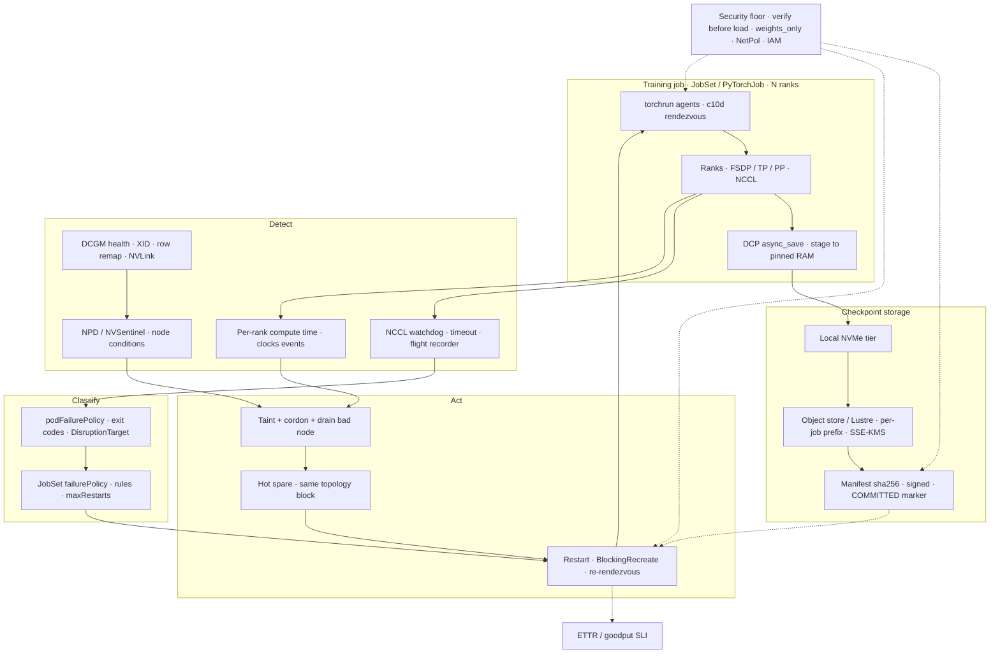

# Lesson 29 — AI/ML platform: training job reliability at scale — checkpoint/restart, elastic training, straggler & failed-node detection

*2026-10-07*

## What interviewers are really probing

Lessons 18–28 built the GPU fleet and then mostly served from it. This lesson covers the other big tenant: a **synchronous training job that spans 1,000–16,000 GPUs for weeks**. One bad GPU stalls every rank. [Lesson 19](/lessons/19-gpu-topology-nvlink-rdma-nccl) wired the NCCL fabric. [Lesson 20](/lessons/20-training-inference-scheduling-kueue-volcano) gang-admitted the job through Kueue. [Lesson 23](/lessons/23-gpu-observability-dcgm-nccl-roofline) gave you DCGM and nccl-tests. [Lesson 26](/lessons/26-gpu-cost-attribution-reclaim-spot) priced preemption. [Lesson 27](/lessons/27-gpu-supply-chain-weight-registry-hydrate) tiered and promoted checkpoints. The question underneath all of them: **at 16k GPUs something breaks every couple of hours. How much of the cluster's time actually goes into training, and which knobs move that number?**

What they check for (fuel: [wafer-ai/gpu-perf-engineering-resources](https://github.com/wafer-ai/gpu-perf-engineering-resources), platform framing, not kernels):

- **Failure math.** MTTF shrinks as 1/N. You should be able to derive a checkpoint interval (Young/Daly) from MTTF and checkpoint cost, and explain why **restart time R** dominates past ~4k GPUs.
- **Checkpoint mechanics.** Sharded, async saves (PyTorch DCP `async_save`, staging, plan caching), commit markers, storage write bursts, and how `δ` (the GPU-blocking part) differs from total save time.
- **Resume correctness.** Optimizer, LR scheduler, grad scaler, dataloader position, and RNG. Interviewers love "the loss curve jumped after resume. Why?"
- **Elasticity.** torchrun c10d rendezvous, `--nnodes=MIN:MAX`, what really happens when a node leaves, and why elastic world size breaks your batch math. Then the next step: torchft / in-process restart.
- **Hangs and stragglers.** NCCL watchdog, timeouts, flight recorder, and why the straggler in a synchronous job is the rank that **waits least**.
- **Failed-node handling.** XID taxonomy, row remapping, NPD / NVSentinel auto-cordon, pre-flight burn-in, hot spares in the same topology block.
- **Orchestration semantics.** JobSet `failurePolicy`, Job `podFailurePolicy`, Kueue `waitForPodsReady` and TAS node replacement. **Classify, then retry.**
- **The SLI.** ETTR / goodput, not "the job is Running".
- **Security.** A checkpoint is the crown jewels **and** a code-execution vector on resume.

**Interview sentence:** "I treat a big training run as a reliability budget. MTTF falls as one over N, so I size checkpoint cadence with Young/Daly, get the GPU-blocking part of a checkpoint down to about ten seconds with async sharded saves, and then attack restart time: detect in seconds, cordon the bad node before restarting, swap in a pre-burned-in spare from the same rail block, and resume from a verified, committed checkpoint. I report ETTR, and I classify every failure so code bugs fail fast and hardware faults don't burn the restart budget."

## Core diagram: Fault → Detect → Classify → Cordon/Replace → Restart → Resume (+ checkpoint pipeline, security floor)

![Training job reliability at scale: failure-budget math with MTTF and Young/Daly checkpoint intervals, the detect-classify-act pipeline (NCCL watchdog and flight recorder, DCGM XID and row-remap health, per-rank straggler detection, podFailurePolicy classification), ETTR as the SLI, the async sharded checkpoint pipeline showing which bars block GPUs, the restart ladder from in-job recovery to full re-admission, elastic and straggler gotchas, the checkpoint security floor, and failure classification rules](/training-reliability-checkpoint-elastic.png)



**How to read it:** follow the solid line from the job down to storage first. That's the steady state: ranks train and DCP stages shards to host memory, then uploads them in the background to NVMe and then to object storage. A **manifest + COMMITTED marker** makes the checkpoint real. Then follow a fault. The NCCL watchdog catches hangs. DCGM and node-problem-detector catch sick hardware. Per-rank compute timing catches slow-but-alive GPUs. Every failure is **classified** (Job `podFailurePolicy`, then JobSet `failurePolicy`) before anything restarts. Bad nodes are tainted and replaced from a spare pool *before* the restart, so you don't land on the same broken GPU. The restart re-rendezvouses and loads the **last verified committed** checkpoint. The dotted lines: resume reads only signed manifests, and every restart's lost time goes into ETTR.

## Idiosyncrasies / operator depth

### 1. The failure budget: MTTF ∝ 1/N, and the Young/Daly interval

Meta's RSC paper ([arXiv 2410.21680](https://arxiv.org/abs/2410.21680)) measured **r_f = 6.50 failures per 1,000 node-days** on RSC-1 and 2.34 on RSC-2, with month-to-month swings from ~2.5 up to ~17.5. The job-level model is `MTTF = 1 / (N_nodes × r_f)`. It projects **1.8 h MTTF at 16,384 GPUs**, and the paper *observed* 7.9 h for 1,024-GPU jobs (user and software failures make reality worse than the hardware-only model). Llama 3's 16k-H100 pretraining saw **466 interruptions in 54 days**: 47 planned, 419 unexpected, ~78% hardware-attributed, GPU issues 58.7% of unexpected ([arXiv 2407.21783](https://arxiv.org/abs/2407.21783)), and still **more than 90% effective training time**.

- **Young (1974):** `τ_opt ≈ √(2 · δ · M)`, where δ is the checkpoint cost that blocks training and M is the MTTF.
- **Daly (2006) first order:** `τ_opt ≈ √(2δM) − δ` (valid for δ much smaller than M; Daly also gives a higher-order form).
- **Waste fraction:** `≈ δ/τ + (τ/2 + R)/M`. You lose the checkpoint cost each interval, plus on average half an interval of redone work, plus the restart cost **R** (detect + tear down + reschedule + rendezvous + reload) per failure.

Worked numbers with r_f = 6.5 per 1k node-days, 8 GPUs per node:

| GPUs | MTTF (model) | δ | τ_opt (Young) | R | Waste | ETTR (rough) |
|---|---|---|---|---|---|---|
| 1,024 | 28.8 h | 5 min | 132 min | 15 min | 8.5% | ~0.92 |
| 4,096 | 7.2 h | 5 min | 66 min | 15 min | 18.7% | ~0.81 |
| 4,096 | 7.2 h | 10 s | 12 min | 3 min | 3.5% | ~0.97 |
| 16,384 | 1.8 h | 5 min | 33 min | 15 min | 44% | ~0.56 |
| 16,384 | 1.8 h | 10 s | 6 min | 15 min | 19% | ~0.81 |
| 16,384 | 1.8 h | 10 s | 6 min | 3 min | 8.3% | ~0.92 |

**The punchline interviewers want:** at 1k GPUs, synchronous five-minute checkpoints are fine. At 16k, even a 10 s δ leaves you at ~0.81 if restart takes 15 min, because **R is now the biggest term**. That's why the industry moved to in-memory/peer checkpoints, hot spares, and in-process restart (sections 6–7). Meta's paper makes the same point: hitting ETTR ≈ 0.9 at ~12k GPUs needs checkpoint overhead around 10 s or a ~6× lower failure rate.

**Gotcha:** don't hardcode the interval. r_f moves by an order of magnitude month to month (a driver bug, a bad batch of HBM). Recompute τ from the last 7–30 days of fleet r_f, per SKU, and let the trainer read it from config.

### 2. Checkpoint anatomy: δ is not "save time"

State size for mixed-precision Adam is **~16 bytes/param** (bf16 weights 2 + fp32 master 4 + Adam m and v 8 + slack). A 70B model is roughly **1.1 TB per checkpoint**, and 405B is ~6.5 TB. Writing 1.1 TB synchronously at 20 GB/s takes almost a minute. Spread across 2,048 nodes it's only ~3 GB per node, so the bottleneck is the **storage burst**, not the node.

| Phase | Blocks GPUs? | Lever |
|---|---|---|
| Planning (dedupe replicated tensors, build the save plan, a collective) | Yes | DCP save-plan caching (`DefaultSavePlanner(enable_plan_caching=True)`) pays it once |
| D2H copy to host | Yes, unless offloaded | Pinned memory; `DefaultStager` (2.9+) moves state-dict creation and D2H to a background thread |
| Serialize + write shards | No (async) | `async_save(..., async_checkpointer_type=AsyncCheckpointerType.PROCESS)` avoids GIL contention with the trainer |
| Upload to object store / Lustre | No | NVMe tier first, then trickle up; per-rank hashed prefixes |
| Metadata + commit | No | Coordinator writes `.metadata` last; your pipeline writes `COMMITTED` and flips `latest` only after that |

Idiosyncrasies:

- **One in-flight async save at a time.** Kick off save N+1 before N finishes and you double host RAM (staged copies) and can OOM-kill the trainer. Wait on the previous future first.
- **Host RAM is a capacity input.** Staging needs pinned RAM ≥ the per-node shard (×2 if you overlap). On GPU nodes that run dataloader workers with big shuffle buffers, the async stager is what triggers the cgroup OOM.
- **Object stores throttle per prefix.** S3 handles ~3,500 PUT/s per partitioned prefix. 16k ranks writing `ckpt/step-1200/rank-*.distcp` under one prefix get `503 SlowDown`, which surfaces as a slow or failed async save that nobody notices until resume. Spread keys (hash in the path) and pre-warm.
- **Lustre / FSx:** set the stripe count on the checkpoint dir (`lfs setstripe -c -1`) or one OST takes every write. Metadata servers hate millions of tiny files, so one file per rank, not per tensor.
- **"Atomic" is your job.** DCP writes many files. A crash mid-upload leaves a directory that *looks* like a checkpoint. The resume logic must pick the newest step with **`.metadata` + `COMMITTED` + a verified manifest**, never "the highest step number in the bucket".
- **Retention:** keep the last K (e.g., 3) for restart, every Nth (e.g., hourly/daily) for rollback after a loss spike, and lifecycle the rest. Rollback needs checkpoints from *before* the corruption, so "keep only latest" breaks SDC recovery ([L27](/lessons/27-gpu-supply-chain-weight-registry-hydrate) covers the tiering and promotion pipeline).

### 3. Resume correctness: what silently diverges

| State | If you forget it | Note |
|---|---|---|
| Model + optimizer (sharded) | Obvious crash or loss reset | Use `get_state_dict` / `set_state_dict` from `torch.distributed.checkpoint.state_dict` so FSDP/TP keys are canonical and **reshardable** |
| LR scheduler + step counter | Warmup reruns; LR spike makes the loss jump | Save `global_step` and tokens-seen explicitly |
| Grad scaler (fp16) | Scale resets, a burst of skipped steps | Not needed for bf16 |
| Dataloader position | Re-trains on seen data / skips data | `torchdata` `StatefulDataLoader` has `state_dict()`. With elastic world size, **per-rank state doesn't map**, so prefer a global-sample-index sampler you can re-partition |
| RNG (python, numpy, torch CPU, CUDA, per rank) | Dropout/augment streams change; non-reproducible debugging | Save per rank; on a world-size change, re-derive seeds from `(seed, global_step, rank)` |
| Data-mixture / curriculum state | Wrong mixture after resume | Lives outside the model, so checkpoint it with the model |

**Test it:** run N steps, checkpoint, kill, resume, and assert the loss at step N+k matches an uninterrupted run within tolerance. Do this in CI for the training stack, not on the 16k job.

### 4. Elastic training: what torchrun actually does

- `torchrun --nnodes=MIN:MAX --rdzv-backend=c10d --rdzv-endpoint=HOST:29400 --rdzv-id=JOB --max-restarts=K`. The c10d backend hosts a TCPStore on the endpoint (no etcd needed).
- **Any membership change restarts every worker.** A node dies, so the survivors' agents tear down their local workers and re-rendezvous. A *new* node shows up waiting, and below MAX the agents also restart to admit it. Each round counts against `--max-restarts`. It's elastic **membership**, not live resizing.
- **Rendezvous knobs** (`--rdzv-conf`): `join_timeout` (default 600 s), `last_call_timeout` (30 s; after MIN joins, wait this long for more), `close_timeout` (30 s), `heartbeat_timeout`. At thousands of nodes, the default `join_timeout` is too short when image pulls or hydrate are slow.
- **Rendezvous host is a SPOF.** If the pod hosting the c10d store dies, everyone fails. Put the endpoint on a headless Service pointing at a stable rank-0 pod, or run a separate store.
- **World size change breaks math.** Global batch = per-rank batch × DP ranks × grad-accum. Shrink from 512 to 496 nodes and either hold global batch constant with grad-accum (not always an integer) or rescale the LR. Many teams **refuse to shrink** for pretraining (MIN = MAX) and use spares instead. TP/PP groups must stay whole, so elasticity happens in **DP-replica units**.
- **Exit codes:** torchrun reports a failure of its own (`ChildFailedError`), which hides the worker's code. Decorate the entrypoint with `@record` (`torch.distributed.elastic.multiprocessing.errors`) so the root-cause traceback is written to `TORCHELASTIC_ERROR_FILE`, and have your wrapper translate classes of failure into **stable exit codes** for `podFailurePolicy`.
- **Beyond torchrun:** **torchft** keeps a per-step quorum (Lighthouse) and lets an HSDP replica group drop out and rejoin by fetching peer state, with no global restart. **NVIDIA Resiliency Extension (NVRx)** offers in-process restart, hang detection, and straggler detection for Megatron/NeMo-style stacks. JobSet has an `InPlaceRestart` restart strategy behind a feature gate. All of these attack **R**.

### 5. Hangs: NCCL watchdog, timeouts, and the flight recorder

- **There is no `NCCL_TIMEOUT` env var.** The collective timeout is `init_process_group(timeout=timedelta(...))`. The NCCL default in recent PyTorch is **10 min**, so a single hung rank idles 16k GPUs for 10 minutes plus restart. Large shops drop it to 2–5 min *after* checking that checkpoint saves and first-step compile don't exceed it, and they make sure no rank does slow I/O between collectives.
- `TORCH_NCCL_ASYNC_ERROR_HANDLING` decides what the watchdog does on error/timeout: 0 = nothing, 1 = abort the communicator and tear down the process, 2 = abort only, **3 = tear down without abort (the default)**. Tearing down is what you want. A process that hangs forever holds the GPUs and never triggers your restart policy.
- `TORCH_NCCL_ENABLE_MONITORING=1` + `TORCH_NCCL_HEARTBEAT_TIMEOUT_SEC` kills the process if the **watchdog itself** is stuck (e.g., a CUDA call hung on a dead GPU after XID 79).
- **Flight recorder:** `TORCH_NCCL_TRACE_BUFFER_SIZE=2000` + `TORCH_NCCL_DUMP_ON_TIMEOUT=1` + `TORCH_NCCL_DEBUG_INFO_TEMP_FILE=/ckpt-debug/nccl_trace_rank_`. On timeout every rank dumps its ring buffer of collectives. Then `torchfrtrace --prefix nccl_trace_rank_ DIR` names the rank that never entered the collective or entered with mismatched sizes. Without it you're reading 16k log files.
- **Desync vs hang:** a rank that skipped a collective (code path diverged, e.g., a data-dependent `if`) looks exactly like a dead GPU. The flight recorder tells you which it was. Don't cordon nodes over a software desync.
- **Transport-level:** `NCCL_IB_TIMEOUT` (exponent, default 20, about 4 s per retry) and `NCCL_IB_RETRY_CNT` (default 7) control how long IB retries before NCCL errors out. Too low and link flaps kill jobs; too high and a dead peer takes minutes to surface. NCCL 2.24+ ships a **RAS** subsystem you can query (`ncclras`) to see which peers are unreachable while a job is hung.

### 6. Stragglers: slow-but-alive is worse than dead

A dead GPU triggers a restart. A GPU running 8% slow drags **every** rank down by 8% forever, and nothing alerts.

- **The synchronous-training trap:** every rank reports the same step time because everyone waits for the slowest at each all-reduce. Find the straggler by timing **compute before the collective** per rank, or **time spent waiting in the collective**. The straggler is the rank that **waits least**. NVRx's straggler detector scores ranks by CUDA kernel timings, relative to peers and to their own history. Megatron-LM exposes `--log-straggler`.
- **Causes, with their tell:**

| Cause | Tell | Where to look |
|---|---|---|
| Thermal / power throttling | SM clock below peers; clocks-event reasons show HW slowdown / thermal / power brake | `DCGM_FI_DEV_CLOCKS_EVENT_REASONS` (older name `..._CLOCK_THROTTLE_REASONS`), `nvidia-smi -q -d PERFORMANCE` |
| PCIe link downtrained | Gen4 x8 instead of Gen5 x16; GPUDirect RDMA bandwidth halved | `nvidia-smi -q` "Link Width", `lspci -vv` `LnkSta` |
| NIC / IB port errors | Rising symbol / link-down counters; one rail slow | `ibstat`, `perfquery -x`, `ibdiagnet`; `DCGM_FI_DEV_NVLINK_CRC_FLIT_ERROR_COUNT_TOTAL` for NVLink |
| Row remap pending / ECC storm | Correctable errors climbing (XID 92) | `nvidia-smi -q -d ROW_REMAPPER` |
| Noisy host | CPU contention from dataloader workers, NUMA misplacement, page cache thrash | per-rank dataloader wait time; `numactl`/topology manager ([L18](/lessons/18-gpu-node-pools-mig-timeslicing)) |
| Fleet-wide environment | Llama 3 saw a **diurnal 1–2% throughput swing** from mid-day temperatures | correlate with facility telemetry; not a node problem |

- **Act on stragglers with hysteresis.** Flag a rank that's more than X% slower than the median for M consecutive windows, then mark the node for eviction **at the next checkpoint boundary** (don't kill a healthy job mid-interval for 5%), and swap in a spare on the restart.
- **Synchronized power swings:** 16k GPUs that idle together at a checkpoint barrier and then spike back together stress facility power. Llama 3 called this out. It's another reason to keep δ short and async.

### 7. Failed nodes: XIDs, health checks, auto-cordon, spares

**XIDs you should be able to triage from memory** (see NVIDIA's XID catalog):

| XID | Meaning | Usual action |
|---|---|---|
| 13 / 31 / 43 | Graphics engine exception / MMU fault / GPU stopped processing | Usually **application** (illegal address). Don't cordon on a single hit; cordon if it recurs on one GPU across different jobs |
| 48 | Double-bit ECC error | Reset GPU; RMA if it repeats |
| 63 / 64 | Row remapping recorded (reset needed to apply) / remap **failure** | 63: drain + GPU reset. 64: RMA |
| 74 | NVLink error | Drain; reset; persistent means reseat or RMA (also breaks NCCL rings on that node) |
| 79 | GPU fallen off the bus | Drain + reboot; often hardware (PCIe, power, thermal). Processes on that GPU hang, which is why the watchdog monitor matters |
| 92 | High single-bit ECC rate | Watch; schedule replacement |
| 94 / 95 | Contained / **uncontained** ECC error | 94: the affected process dies, GPU resets later. 95: all processes on the GPU affected; reset now |
| 119 / 120 | GSP RPC timeout / GSP error | Reset/reboot; often driver/firmware, so check fleet-wide correlation before RMA |

- **Passive checks (while running):** DCGM health watches (`dcgmi health -s a`) and dcgm-exporter fields (XID, `DCGM_FI_DEV_ROW_REMAP_PENDING`, `DCGM_FI_DEV_ROW_REMAP_FAILURE`, `DCGM_FI_DEV_ECC_DBE_VOL_TOTAL`, `DCGM_FI_DEV_PCIE_REPLAY_COUNTER`) feed **node-problem-detector** custom plugins or NVIDIA's **NVSentinel**. Either way the result is a node condition, then a taint, cordon, and drain, then remediation (GPU reset, reboot, RMA ticket).
- **Active checks (before admitting work):** `dcgmi diag -r 1` takes seconds (OK for every pod start), `-r 2` takes minutes (OK for node bring-up and after remediation), and `-r 3/4` are long (run on burn-in and RMA return). Pair with a **multi-node nccl-tests all-reduce** across the job's nodes and compare bus bandwidth to the SKU baseline ([L23](/lessons/23-gpu-observability-dcgm-nccl-roofline)). A node can pass single-node DCGM and still have one bad IB rail.
- **Don't restart onto the same bad node.** This is the #1 waste pattern: JobSet recreates pods, the scheduler happily places them back on the node with the flaky GPU (it's still Ready), and you burn `maxRestarts` in a loop. The fix is ordering. **Taint first, restart second** (`restartStrategy: BlockingRecreate` helps because new pods aren't created until old ones are gone, giving the cordon controller time to act).
- **Hot spares:** for pretraining-scale jobs, keep ~1–3% extra nodes **in the same topology block** (rail group / spine, [L19](/lessons/19-gpu-topology-nvlink-rdma-nccl)), already burned in, held by Kueue quota (or low-priority placeholder pods, as in [L28](/lessons/28-inference-autoscaling-scale-to-zero)). Kueue's **TAS failed-node replacement** (feature-gated `TASFailedNodeReplacement` and friends) can swap a failed node for one in the same topology domain instead of evicting the whole workload. Spares are pure idle cost, so price them against `R × N_GPUs × failures/day` ([L26](/lessons/26-gpu-cost-attribution-reclaim-spot)).
- **Silent data corruption (SDC):** no XID, just a loss spike or NaNs. You find it with loss/grad-norm anomaly detection, deterministic replay of the bad step on different nodes, and per-rank gradient checksums. Recovery means rolling back to a checkpoint **before** the corruption and quarantining the node. Both Llama 3 and Meta's RSC paper count SDC as a real hardware class.

### 8. Orchestration semantics: classify before you retry

- **Job `podFailurePolicy`** (needs `restartPolicy: Never`): `FailJob` on exit codes that mean "code/config bug" (retrying wastes 16k GPUs × R), `Ignore` on the `DisruptionTarget` condition (preemption, node drain, eviction; don't count it against `backoffLimit`), `Count` for everything else.
- **JobSet `failurePolicy`:** `maxRestarts` plus ordered `rules`. The first match wins, and with no match the default is `RestartJobSet` (counts). Actions: `FailJobSet`, `RestartJobSet`, `RestartJobSetAndIgnoreMaxRestarts`, `RestartJob`, `RestartJobAndIgnoreMaxRestarts`. Match on `onJobFailureReasons` (`PodFailurePolicy`, `BackoffLimitExceeded`, `DeadlineExceeded`) and `targetReplicatedJobs`. The standard pattern: **infra disruptions restart without counting; real failures count; code bugs fail the JobSet**.
- **`backoffLimit: 0` on child Jobs.** One rank failing means the whole gang is broken, so let JobSet restart everything rather than the Job controller retrying one pod into a dead rendezvous.
- **Kueue `waitForPodsReady`:** if the gang doesn't become Ready within `timeout` (e.g., 10 min, because a node is broken or the image is slow), Kueue evicts and requeues it with exponential backoff (`requeuingStrategy.backoffLimitCount`, `backoffBaseSeconds`, `backoffMaxSeconds`) so it doesn't squat on a partial allocation. `recoveryTimeout` covers the case where a running workload *loses* readiness. `blockAdmission: true` serializes admission so two half-admitted gangs don't deadlock ([L20](/lessons/20-training-inference-scheduling-kueue-volcano)).
- **Kubeflow:** Training Operator v1 `PyTorchJob` has `elasticPolicy` (`minReplicas`, `maxReplicas`, `rdzvBackend`, `maxRestarts`). Kubeflow Trainer v2 (`TrainJob`) is built on **JobSet**, so the JobSet semantics above are what you're really configuring.
- **Spot/preemptible:** preemption notices arrive as node events. Turn them into a **checkpoint-now** signal (a SIGTERM handler that triggers an emergency save if it fits in the notice window) and `Ignore` in `podFailurePolicy` ([L26](/lessons/26-gpu-cost-attribution-reclaim-spot)).

## Concrete commands & config

### torchrun launch — elastic membership, rendezvous tuning, NCCL watchdog + flight recorder

```bash
# Per-node entrypoint (pod command). MIN=MAX for pretraining (spares instead of shrinking).
# Endpoint = JobSet headless-Service DNS of the first pod (<jobset>-<rjob>-<job-idx>-<pod-idx>.<jobset>).
export TORCH_NCCL_ASYNC_ERROR_HANDLING=3          # default; tear down on watchdog error
export TORCH_NCCL_ENABLE_MONITORING=1
export TORCH_NCCL_HEARTBEAT_TIMEOUT_SEC=600       # kill if the watchdog thread itself is stuck
export TORCH_NCCL_TRACE_BUFFER_SIZE=2000          # flight recorder ring buffer
export TORCH_NCCL_DUMP_ON_TIMEOUT=1
export TORCH_NCCL_DEBUG_INFO_TEMP_FILE=/scratch/fr/nccl_trace_rank_
export NCCL_IB_TIMEOUT=22 NCCL_IB_RETRY_CNT=7     # tolerate brief link flaps
export TORCHELASTIC_ERROR_FILE=/scratch/err/error.json

torchrun \
  --nnodes=512:512 --nproc-per-node=8 \
  --rdzv-backend=c10d \
  --rdzv-endpoint=llama70b-pretrain-workers-0-0.llama70b-pretrain:29400 \
  --rdzv-id=llama70b-pretrain \
  --rdzv-conf=join_timeout=1800,last_call_timeout=60,close_timeout=60 \
  --max-restarts=3 --monitor-interval=5 \
  train.py --config /etc/train/llama70b.yaml
```

```python
# train.py: timeouts, async sharded checkpoint, commit marker, full resume state
from datetime import timedelta
import torch, torch.distributed as dist, torch.distributed.checkpoint as dcp
from torch.distributed.checkpoint.state_dict import get_state_dict, set_state_dict
from torch.distributed.checkpoint.state_dict_saver import AsyncCheckpointerType
from torch.distributed.elastic.multiprocessing.errors import record

dist.init_process_group("nccl", timeout=timedelta(minutes=5))   # NOT an env var

def app_state(model, optim, sched, loader, step):
    msd, osd = get_state_dict(model, optim)                     # canonical, reshardable keys
    return {"model": msd, "optim": osd, "sched": sched.state_dict(),
            "loader": loader.state_dict(),                       # torchdata StatefulDataLoader
            "step": step, "rng": capture_rng_per_rank()}

@record                                                           # root-cause traceback -> error file
def main():
    ...
    pending = None
    for step in range(start_step, total_steps):
        train_step()
        if step % ckpt_every == 0:                                # ckpt_every from Young/Daly config
            if pending is not None:
                pending.result()                                  # one in-flight save at a time
                mark_committed_if_complete(prev_dir)              # .metadata present -> manifest -> COMMITTED
            prev_dir = f"{CKPT_ROOT}/step-{step:08d}"
            pending = dcp.async_save(app_state(model, optim, sched, loader, step),
                                     checkpoint_id=prev_dir,
                                     async_checkpointer_type=AsyncCheckpointerType.PROCESS)
```

### JobSet — gang job with classify-then-restart failure policy and BlockingRecreate

```yaml
apiVersion: jobset.x-k8s.io/v1alpha2
kind: JobSet
metadata:
  name: llama70b-pretrain
  namespace: train-t1
  labels:
    kueue.x-k8s.io/queue-name: pretrain-lq          # admitted as one gang by Kueue (L20)
spec:
  failurePolicy:
    maxRestarts: 6                                   # budget for REAL failures only
    restartStrategy: BlockingRecreate                # old pods gone before new ones -> cordon wins the race
    rules:
    - name: infra-disruption                         # drain / preemption / node failure: free restart
      action: RestartJobSetAndIgnoreMaxRestarts
      onJobFailureReasons: [PodFailurePolicy]
      onJobFailureMessagePatterns: [".*DisruptionTarget.*"]
    - name: user-bug                                 # non-retryable exit codes classified by the Job
      action: FailJobSet
      onJobFailureReasons: [PodFailurePolicy]
    # anything else -> default RestartJobSet (counts toward maxRestarts)
  replicatedJobs:
  - name: workers
    replicas: 64                                     # 64 Jobs x 8 pods = 512 nodes
    template:
      spec:
        parallelism: 8
        completions: 8
        backoffLimit: 0                              # one pod fails -> Job fails -> JobSet decides
        podFailurePolicy:
          rules:
          - action: FailJob                          # 42 = bad config / code bug; 43 = NaN guard tripped
            onExitCodes: { containerName: trainer, operator: In, values: [42, 43] }
          - action: FailJob                          # infra: still fail the Job, but via PodFailurePolicy
            onPodConditions: [ { type: DisruptionTarget } ]
        template:
          metadata:
            annotations:
              kueue.x-k8s.io/podset-required-topology: "cloud.provider.com/topology-block"   # TAS (L19/L20)
          spec:
            restartPolicy: Never
            serviceAccountName: trainer-llama70b     # workload identity; ckpt prefix only (Security)
            automountServiceAccountToken: false
            priorityClassName: pretrain-critical
            terminationGracePeriodSeconds: 120       # room for an emergency checkpoint on SIGTERM
            tolerations: [ { key: nvidia.com/gpu, operator: Exists, effect: NoSchedule } ]
            initContainers:
            - name: preflight                        # fail fast on a sick node BEFORE rendezvous
              image: registry.internal/gpu-preflight@sha256:PREFLIGHT_DIGEST
              command: ["/bin/sh", "-c", "dcgmi diag -r 1 && /opt/check/row-remap-clean.sh && /opt/check/ib-ports-up.sh"]
              resources: { limits: { nvidia.com/gpu: 8 } }
            containers:
            - name: trainer
              image: registry.internal/train/llama@sha256:TRAINER_DIGEST
              command: ["/opt/launch.sh"]
              resources:
                limits: { nvidia.com/gpu: 8, rdma/ib: 8 }
              securityContext:
                allowPrivilegeEscalation: false
                capabilities: { drop: [ALL], add: [IPC_LOCK] }   # RDMA memlock, not privileged
              volumeMounts:
              - { name: nvme, mountPath: /scratch }
            volumes:
            - name: nvme
              hostPath: { path: /mnt/nvme/train-t1, type: DirectoryOrCreate }
```

*Note:* rule order matters. Both classes reach JobSet with reason `PodFailurePolicy`. The Job controller's failure message names the matched condition ("…has condition DisruptionTarget matching FailJob rule…"), so the infra rule must come first. `onJobFailureMessagePatterns` exists only in newer JobSet releases. On older ones, drop the `user-bug` rule and set `maxRestarts` low, or route bug exit codes through a wrapper that never restarts.

### Kueue — don't squat on a broken gang

```yaml
# kueue-manager-config (Configuration)
waitForPodsReady:
  timeout: 10m                    # gang must be Ready within 10 min of admission
  recoveryTimeout: 5m             # running workload lost readiness (a pod died) -> evict + requeue
  blockAdmission: true
  requeuingStrategy:
    timestamp: Eviction
    backoffLimitCount: 5
    backoffBaseSeconds: 60
    backoffMaxSeconds: 1800
featureGates:
  TopologyAwareScheduling: true
  TASFailedNodeReplacement: true  # swap a failed node within the same topology domain
```

### Node health: DCGM, nccl-tests, NPD auto-cordon

```bash
# Health watches + check (DCGM)
dcgmi group -c alljob -a 0,1,2,3,4,5,6,7
dcgmi health -g 1 -s a                        # watch PCIe, memory, inforom, thermal, power, NVLink
dcgmi health -g 1 -c -j                       # JSON verdict for automation
dcgmi diag -r 1                               # seconds: pod start / init container
dcgmi diag -r 2                               # minutes: node bring-up, after remediation
dcgmi diag -r 3                               # long: burn-in, RMA return

# Row remapping + ECC + clocks
nvidia-smi -q -d ROW_REMAPPER                 # "Pending: Yes" -> drain + reset; "Remapping Failure Occurred: Yes" -> RMA
nvidia-smi -q -d ECC,PERFORMANCE | grep -iE 'volatile|aggregate|slowdown|thermal|power brake'
nvidia-smi --query-gpu=index,pcie.link.gen.current,pcie.link.width.current,clocks.sm --format=csv
dmesg -T | grep -i 'NVRM: Xid'                # XID source of truth on the host

# Multi-node burn-in across the exact nodes of the gang (compare busbw to SKU baseline, L23)
mpirun -np 64 -N 8 --hostfile hosts \
  -x NCCL_DEBUG=WARN -x NCCL_IB_HCA=mlx5 \
  /opt/nccl-tests/build/all_reduce_perf -b 1G -e 8G -f 2 -g 1 -c 1

# IB fabric
ibstat | grep -E 'State|Rate'
perfquery -x | grep -E 'SymbolErrorCounter|LinkDownedCounter|PortRcvErrors'
```

```json
// node-problem-detector custom plugin monitor (excerpt): GPU health -> node condition
{
  "plugin": "custom",
  "pluginConfig": { "invoke_interval": "30s", "timeout": "20s", "max_output_length": 200, "concurrency": 1 },
  "source": "gpu-health-monitor",
  "conditions": [
    { "type": "GPUUnhealthy", "reason": "GPUHealthy", "message": "all GPUs healthy" }
  ],
  "rules": [
    { "type": "permanent", "condition": "GPUUnhealthy", "reason": "XidFatal",
      "path": "/opt/npd/check_xid.sh", "timeout": "15s" },
    { "type": "permanent", "condition": "GPUUnhealthy", "reason": "RowRemapPending",
      "path": "/opt/npd/check_row_remap.sh", "timeout": "15s" }
  ]
}
```

A remediation controller (NVSentinel, a Medik8s NodeHealthCheck, or your own) watches `GPUUnhealthy=True`. It **taints** the node (`gpu.health/unhealthy:NoSchedule` plus `NoExecute` for fatal XIDs), cordons and drains it, runs the reset/reboot, re-runs `dcgmi diag -r 2`, and only then untaints. Rate-limit it: never remediate more than ~2–5% of a pool at once, or a bad health-check rollout cordons the fleet.

### Debugging a stuck or flapping run

```bash
kubectl get jobset llama70b-pretrain -n train-t1 -o jsonpath='{.status.restarts}{"\n"}{.status.conditions}' | jq
kubectl get workloads -n train-t1 -o wide                          # Kueue admission / eviction / requeue state
kubectl describe workload -n train-t1 jobset-llama70b-pretrain-xxxxx | sed -n '/Conditions/,$p'
kubectl get pods -n train-t1 -l jobset.sigs.k8s.io/jobset-name=llama70b-pretrain \
  --field-selector=status.phase!=Running -o wide                    # which node keeps failing?
kubectl get pods -n train-t1 -o json | jq -r '.items[] | select(.status.containerStatuses[0].state.terminated)
  | [.spec.nodeName, .status.containerStatuses[0].state.terminated.exitCode, .status.conditions[]?.type] | @tsv' | sort | uniq -c
kubectl get nodes -l pool=train-h100 -o custom-columns=NAME:.metadata.name,UNHEALTHY:'.status.conditions[?(@.type=="GPUUnhealthy")].status',TAINTS:.spec.taints[*].key

# Hang: which rank never entered the collective?
torchfrtrace --prefix nccl_trace_rank_ /scratch/fr/ -o /tmp/fr_report.txt
```

### PromQL — the SLI and the detectors

```promql
# Straggler: per-rank compute time vs job median (exported by the trainer), 10-min window
max by (job, rank, node) (avg_over_time(train_step_compute_seconds[10m]))
  / on (job) group_left
quantile by (job) (0.5, avg_over_time(train_step_compute_seconds[10m])) > 1.05

# Throttled GPUs (bitmask; anything beyond the GPU_IDLE bit = 1 is worth a look)
count by (Hostname) (DCGM_FI_DEV_CLOCKS_EVENT_REASONS > 1)

# Fatal hardware signals (page + auto-cordon)
max by (Hostname, gpu) (DCGM_FI_DEV_XID_ERRORS) == 79           # field holds the LAST XID seen
  or max by (Hostname, gpu) (DCGM_FI_DEV_ROW_REMAP_PENDING) > 0

# ETTR over 24h (trainer exports productive seconds; wall-clock since job admitted)
sum(increase(train_productive_seconds_total{job="llama70b"}[24h])) / (24 * 3600)

# Lost GPU-hours to restarts in 24h (launcher-exported metrics; feeds chargeback, L26)
sum(increase(train_restart_downtime_seconds_total{job="llama70b"}[24h])) * 4096 / 3600
```

## Failures & fixes

| Symptom | Likely cause | Fix / mitigation |
|---|---|---|
| Job restarts, lands on the same node, fails again until `maxRestarts` is exhausted | Restart raced the cordon; node still Ready | Taint-on-detect before restart; `restartStrategy: BlockingRecreate`; pre-flight init container (`dcgmi diag -r 1`, row-remap clean) |
| Whole job idle for 10+ min, then `Watchdog caught collective operation timeout` | One rank hung (dead GPU, XID 79) or desync; default 10 min NCCL timeout | Lower `timeout=` to 2–5 min; `TORCH_NCCL_ENABLE_MONITORING`; flight recorder + `torchfrtrace` to name the rank |
| Process hangs forever after XID 79, pods stay Running | Watchdog thread stuck in a CUDA call on a dead GPU | `TORCH_NCCL_ENABLE_MONITORING=1` + heartbeat timeout; NPD `NoExecute` taint for fatal XIDs |
| Throughput 6% lower than last week, no errors | Straggler: throttled GPU, downtrained PCIe link, IB symbol errors | Per-rank compute-time outlier detection; evict at the next checkpoint boundary; check clocks-event reasons / `LnkSta` / `perfquery` |
| Loss jumps or LR spikes right after resume | LR scheduler / step / grad scaler not restored; warmup re-ran | Checkpoint scheduler + `global_step`; resume-equivalence test in CI |
| Model sees duplicate or skipped data after resume | Dataloader position not saved; elastic world size changed per-rank shards | `StatefulDataLoader` state; global-sample-index sampler; hold world size fixed (MIN=MAX) |
| Resume picks a broken checkpoint (missing shards, load error) | Crash during async upload; resume chose "highest step" | Commit protocol: `.metadata` + manifest + `COMMITTED`; `latest` pointer flips after verify |
| Async save silently slow, then OOM-killed trainer | Overlapping saves doubled pinned RAM | One in-flight save; wait on the future; size host RAM for staging |
| `503 SlowDown` / timeouts writing checkpoints at scale | All ranks writing under one object-store prefix | Hash-prefixed keys; NVMe tier then upload; stagger uploads; Lustre striping |
| Checkpoint interval "felt right" but ETTR is 0.6 | Synchronous 5 min δ at 16k GPUs; R ≈ 15 min | Async + plan caching (δ ~10 s); recompute τ with Young/Daly from live r_f; spares + in-job restart for R |
| torchrun: `RendezvousTimeoutError` on cold start | `join_timeout` 600 s shorter than image pull + hydrate at scale | `--rdzv-conf join_timeout=1800`; pre-pull images; pre-flight before rendezvous |
| Every node join/leave restarts all 4,096 GPUs | torchrun elastic semantics (membership change = global restart) | Don't run elastic MIN below MAX for pretraining; batch replacements at checkpoint boundaries; torchft / in-process restart for true elasticity |
| `maxRestarts` burned by preemptions and drains | Disruptions counted like real failures | `podFailurePolicy` on `DisruptionTarget` + JobSet `RestartJobSetAndIgnoreMaxRestarts` |
| Code bug retried 6 times × 16k GPUs | All failures look like exit 1 through torchrun | `@record` + wrapper maps failure classes to exit codes; `FailJob` / `FailJobSet` on bug codes |
| Gang half-admitted for an hour, holding 300 nodes | A node is broken or an image is slow; no readiness timeout | Kueue `waitForPodsReady` timeout + backoff requeue; `blockAdmission` |
| Loss spike or NaN with no XID anywhere | Silent data corruption on one GPU | Roll back to a pre-spike checkpoint; replay the step on other nodes; quarantine the node; per-rank grad checksums |
| Fleet-wide 1–2% throughput sag every afternoon | Thermal/DVFS from facility temperature | Not a node fault; correlate with facility telemetry; don't auto-evict on fleet-wide shifts |
| Health-check rollout cordoned 30% of the pool | Remediation controller without a rate limit; bad check | Max-unavailable budget for remediation; canary new checks on one rack |
| Flight recorder dumps never appear | `TORCH_NCCL_TRACE_BUFFER_SIZE` unset (0) or dump path not writable / not persisted | Set buffer size + `DUMP_ON_TIMEOUT`; write to a persisted volume and ship before the pod is deleted |

## Security & hardening

**A training checkpoint is two things at once: the most valuable artifact the company produces (weights *plus* optimizer state, enough to keep training or fine-tune a stolen copy) and an executable input to the next resume.** Anyone who can write to the checkpoint prefix can steer a multi-million-dollar run. They can poison weights or optimizer moments so a backdoor survives training, or plant a pickle that runs code on 16k GPUs the next time the job restarts, and **restarts happen every couple of hours** at this scale. The reliability machinery (auto-restart, spares, elastic rendezvous) is also an attack surface: it resumes automatically, from whatever is there, with privileged identities. [L11](/lessons/11-cluster-security-pss-admission-rbac), [L12](/lessons/12-node-container-hardening-supply-chain), [L13](/lessons/13-ml-weights-checkpoint-hardening), [L14](/lessons/14-ml-inference-training-deploy-hardening), and [L27](/lessons/27-gpu-supply-chain-weight-registry-hydrate) defined the controls. Here they get applied to the checkpoint/restart loop.

### Checkpoint & model-weight hardening (required)

| Control | Threat | Practice |
|---|---|---|
| **Bucket IAM: per-job prefix, least privilege** | One compromised trainer reads/overwrites every team's checkpoints; a fine-tune job reads the frontier run | Training SA gets `PutObject` + `GetObject` **only** on `ckpt/<team>/<job-id>/*` (it must read its own prefix to resume). No `DeleteObject` (lifecycle + Object Lock handle deletion), no `ListBucket` outside its prefix, **no access to `released/`**. Promotion runs as a **separate identity** that reads ckpt and writes released; serving reads only released ([L27](/lessons/27-gpu-supply-chain-weight-registry-hydrate)) |
| **ABAC instead of a role per job** | Thousands of hand-made roles drift | EKS Pod Identity session tags (`kubernetes-namespace`, `kubernetes-service-account`) in the resource ARN; GCS IAM conditions on `resource.name.startsWith(...)` with Workload Identity Federation |
| **No public, no wildcard** | Misconfigured ACL or a "temporary" presigned URL leaks 1 TB of weights | Block Public Access at account/org level; deny `s3:PutObjectAcl`; presigned URLs disallowed by SCP for ckpt buckets; VPC-endpoint-only access policy (`aws:SourceVpce`) |
| **Encryption** | Disk/bucket theft; cross-tenant key reuse | SSE-KMS mandatory (bucket policy denies `PutObject` without `aws:kms` and the expected key ARN); **per-tenant/per-project CMK** so key grants become the access boundary; deny non-TLS (`aws:SecureTransport=false`); encrypt the local NVMe tier (LUKS / instance-store encryption) and wipe it on node recycle |
| **Integrity: manifest + hashes** | Shard swapped or truncated between save and resume | After `.metadata` lands, write `manifest.json` = `{step, world_size, files: [{path, sha256, bytes}], git_sha, image_digest, data_snapshot}`. Resume **verifies every shard hash** before `dcp.load` (parallelized per rank; each rank checks the shards it reads) |
| **Signing + provenance** | Attacker with write access forges a checkpoint | Sign the manifest with the **trainer's workload identity** (keyless `cosign sign-blob` via OIDC, or OpenSSF `model_signing` for released weights). Verify the signer identity == this job's SA **and** the issuer before resume and before promotion. Attach a SLSA-style provenance attestation (image digest, code SHA, dataset snapshot, job ID) at promotion |
| **Immutability** | Ransomware / insider deletes the run's history; rollback impossible after SDC | S3 Object Lock (governance for working ckpts, compliance for promoted) or GCS retention locks + versioning; separate break-glass role for deletion |
| **Safe deserialization** | Pickle-RCE on resume, on 16k GPUs at once | `torch.load(..., weights_only=True)` (the default since PyTorch 2.6; and **upgrade**: CVE-2025-32434 showed `weights_only=True` itself was bypassable in ≤2.5.1). DCP's `.metadata` file is **pickled** (`pickle.load` in `FileSystemReader`), so **never `dcp.load` a directory you haven't verified against a signed manifest**. Prefer **safetensors** for anything that crosses a trust boundary (exports, promoted weights, third-party inits) |
| **Tamper / poisoning on resume** | Subtle weight or optimizer-state edits that survive training; data-mixture state flipped | Signed manifests (above); resume only from your own job's prefix; alert on loss/grad-norm discontinuity right after resume (a security signal as well as an SDC signal); keep a hash-chained checkpoint log (each manifest includes the previous manifest's digest) |
| **Debug artifacts** | Flight-recorder dumps, core dumps, `TORCHELASTIC_ERROR_FILE`, and stray `torch.save` debug files leak tensors, paths, and env | Restricted debug bucket with short retention; disable GPU core dumps by default (`CUDA_ENABLE_COREDUMP_ON_EXCEPTION` unset); scrub env from error files |

### Platform controls around the training job

| Control | Threat | Practice |
|---|---|---|
| **Container image signing & admission** | An unsigned trainer image with a modified launcher exfiltrates weights at every save | Kyverno `verifyImages` (keyless attestor = your CI workflow identity) or Gatekeeper + Ratify / Sigstore policy-controller on training namespaces; **digest pins only**; pre-flight and sidecar images covered too ([L12](/lessons/12-node-container-hardening-supply-chain)) |
| **RBAC on training namespaces** | A user edits a running JobSet (swaps image, adds a volume) and the next auto-restart runs it with the trainer SA | Users submit through GitOps / a job API; no `update`/`patch` on `jobsets` for humans in prod; **no `pods/exec`** or `pods/attach` on training pods (exec = live weights + creds); audit every JobSet/Workload change |
| **Admission on restart-relevant fields** | `failurePolicy` set to infinite restarts as a cost-DoS; `hostPath` to steal another job's NVMe tier | VAP/Kyverno: `maxRestarts` ≤ tier cap; `hostPath` only under `/mnt/nvme/<namespace>`; no `privileged`, only `IPC_LOCK`; PSS restricted (baseline + IPC_LOCK exception) ([L11](/lessons/11-cluster-security-pss-admission-rbac), [L14](/lessons/14-ml-inference-training-deploy-hardening)) |
| **Secrets** | Long-lived cloud keys in env survive every restart and land in error files | Workload identity (IRSA / EKS Pod Identity / GKE WIF) with short-lived tokens; experiment-tracker API keys via External Secrets with rotation; **no HF tokens at train time** (inputs pre-staged); IMDSv2 hop limit 1 so pods can't use the node role |
| **Network isolation** | The c10d **TCPStore (rendezvous, 29400) and `MASTER_PORT` (29500) are unauthenticated**; anyone who can reach them can join, read, or corrupt the store and crash or hijack the gang | Default-deny NetworkPolicy in training namespaces; allow ingress on all TCP ports **only from pods with the same `jobset.sigs.k8s.io/jobset-name` label** (NCCL's TCP bootstrap uses ephemeral ports, so you can't pin ports, but you can pin peers); egress only to the storage VPC endpoint, metrics, and DNS; **no internet egress** |
| **RDMA bypasses NetworkPolicy** | IB/RoCE traffic on SR-IOV secondary NICs never touches the CNI; tenant A's QPs can reach tenant B | Fabric-level isolation: **IB partition keys (PKeys)** per tenant/trust domain, or per-tenant VRF/VLAN for RoCE; dedicated node pools per trust domain ([L9](/lessons/09-networkpolicy-multi-nic-sflow), [L25](/lessons/25-multi-tenant-gpu-isolation-quota)) |
| **Health / remediation controllers** | NVSentinel / NPD remediation can cordon, drain, and reboot nodes: a fleet-wide kill switch | Least-privilege SA (nodes `patch` for taints, `pods/eviction`), rate-limited remediation budgets, signed health-check plugins, audit on every remediation |
| **Spares and placeholders** | Hot-spare nodes shared across trust domains carry the previous tenant's NVMe residue | Spares per trust domain; wipe the NVMe checkpoint tier and reset GPUs (clears HBM) on job end; re-run pre-flight before reuse |

```yaml
# Kyverno: training pods must run signed images by digest and may only resume from their own prefix
apiVersion: kyverno.io/v1
kind: ClusterPolicy
metadata: { name: training-supply-chain }
spec:
  validationFailureAction: Enforce
  webhookTimeoutSeconds: 15
  rules:
  - name: verify-trainer-images
    match:
      any: [ { resources: { kinds: [Pod], namespaceSelector: { matchLabels: { workload: training } } } } ]
    verifyImages:
    - imageReferences: ["registry.internal/*"]
      mutateDigest: false
      verifyDigest: true                    # require @sha256 pins
      required: true
      attestors:
      - entries:
        - keyless:
            issuer: https://token.actions.githubusercontent.com
            subject: "https://github.com/acme/train-images/.github/workflows/release.yml@refs/heads/main"
            rekor: { url: https://rekor.sigstore.dev }
  - name: ckpt-prefix-matches-namespace
    match:
      any: [ { resources: { kinds: [Pod], namespaceSelector: { matchLabels: { workload: training } } } } ]
    validate:
      message: "CKPT_ROOT must be under s3://ckpt/<namespace>/"
      deny:
        conditions:
          any:
          - key: "{{ request.object.spec.containers[?name=='trainer'] | [0].env[?name=='CKPT_ROOT'] | [0].value || '' }}"
            operator: NotEquals
            value: "s3://ckpt/{{ request.namespace }}/*"
```

```json
// S3 bucket policy excerpt: SSE-KMS mandatory, TLS only, VPC endpoint only, trainers confined to their namespace prefix
{
  "Statement": [
    { "Sid": "DenyNonTLS", "Effect": "Deny", "Principal": "*", "Action": "s3:*",
      "Resource": ["arn:aws:s3:::ckpt", "arn:aws:s3:::ckpt/*"],
      "Condition": { "Bool": { "aws:SecureTransport": "false" } } },
    { "Sid": "DenyWrongKMS", "Effect": "Deny", "Principal": "*", "Action": "s3:PutObject",
      "Resource": "arn:aws:s3:::ckpt/*",
      "Condition": { "StringNotEquals": { "s3:x-amz-server-side-encryption-aws-kms-key-id": "arn:aws:kms:us-east-1:111122223333:key/TRAIN-CMK" } } },
    { "Sid": "DenyOutsideVpce", "Effect": "Deny", "Principal": "*", "Action": "s3:*",
      "Resource": ["arn:aws:s3:::ckpt", "arn:aws:s3:::ckpt/*"],
      "Condition": { "StringNotEquals": { "aws:SourceVpce": "vpce-0abc123" } } },
    { "Sid": "TrainerOwnPrefixOnly", "Effect": "Allow",
      "Principal": { "AWS": "arn:aws:iam::111122223333:role/eks-trainer" },
      "Action": ["s3:PutObject", "s3:GetObject"],
      "Resource": "arn:aws:s3:::ckpt/${aws:PrincipalTag/kubernetes-namespace}/*" }
  ]
}
```

```bash
# Sign at commit, verify at resume. Keyless with the trainer's workload identity needs a Fulcio that
# trusts your cluster's OIDC issuer (private Sigstore); otherwise sign with a KMS key (--key awskms://...).
cosign sign-blob --yes --bundle manifest.json.sigstore.json manifest.json
cosign verify-blob manifest.json --bundle manifest.json.sigstore.json \
  --certificate-identity "https://kubernetes.io/namespaces/train-t1/serviceaccounts/trainer-llama70b" \
  --certificate-oidc-issuer "https://oidc.eks.us-east-1.amazonaws.com/id/CLUSTER_ID" \
  && python verify_shards.py --manifest manifest.json --root "$CKPT_DIR" \
  && echo "resume OK"
```

**Punchline:** a hardened restart loop **only resumes from checkpoints it can prove it wrote** (prefix-scoped identity, KMS, signed hash manifest), **never unpickles unverified bytes**, keeps rendezvous and NCCL reachable **only by its own gang** (NetPol for TCP, PKeys for RDMA), and treats remediation and restart policies as privileged, rate-limited APIs. That's what makes aggressive auto-restart safe.

## Interview soundbites

- **"MTTF falls as one over N. At 16k GPUs it's under two hours, so checkpoint cadence is a formula, Young/Daly root of two δ M, recomputed from the live failure rate, not a vibe."**
- **"Past a few thousand GPUs, restart time beats checkpoint time. Async saves get δ to about ten seconds, and then all the ETTR left is in detect, replace, and reload."**
- **"In synchronous training every rank reports the same step time. The straggler is the rank that waits least in the all-reduce."**
- **"Taint first, restart second. Otherwise JobSet recreates the gang right back onto the bad GPU and burns the restart budget."**
- **"Classify before you retry: disruptions restart for free, code bugs fail fast, everything else counts against maxRestarts."**
- **"There's no NCCL_TIMEOUT env var. It's the process-group timeout, ten minutes by default, and with the flight recorder on, a hang names its own culprit rank."**
- **"A checkpoint is crown jewels plus a pickle. Prefix-scoped write identity, KMS, a signed hash manifest, and verify-before-load, because at this scale you resume every couple of hours."**
- **"The SLI is ETTR, not 'Running'. Llama 3 took 466 interruptions in 54 days and still kept more than 90% effective training time."**
- **"Next: distributed training storage and data loading at scale: dataset streaming, caching tiers, and I/O stalls."**

## How this maps to the JD

JDs that say **"operate large-scale training infrastructure," "GPU fleet reliability," "maximize cluster goodput,"** or **"secure the ML platform end to end"** are asking whether you can keep a 10k-GPU synchronous job productive while hardware fails underneath it daily, and do it without letting the auto-restart path become an attack path. This lesson connects [L19](/lessons/19-gpu-topology-nvlink-rdma-nccl) (NCCL fabric, topology blocks for spares), [L20](/lessons/20-training-inference-scheduling-kueue-volcano) (gang admission, Kueue requeue), [L23](/lessons/23-gpu-observability-dcgm-nccl-roofline) (DCGM signals, nccl-tests baselines), [L26](/lessons/26-gpu-cost-attribution-reclaim-spot) (preemption economics, the cost of spares and lost GPU-hours), and [L27](/lessons/27-gpu-supply-chain-weight-registry-hydrate) (checkpoint tiering and promotion) with the security floor from [L13](/lessons/13-ml-weights-checkpoint-hardening)/[L14](/lessons/14-ml-inference-training-deploy-hardening). Fuel: [wafer-ai/gpu-perf-engineering-resources](https://github.com/wafer-ai/gpu-perf-engineering-resources). **Next up, Lesson 30:** distributed training storage & data loading at scale: dataset streaming, caching tiers, and I/O stalls.

## Watch (talks & demos)

Real talks. Watch them after Failures & fixes.

### Building Resilience for Large-Scale AI Training: GPU Management, Failure Detection, and Beyond

Ganeshkumar Ashokavardhanan (Microsoft AKS) & Ace Eldeib (Cohere), KubeCon NA 2024. This is the operator half of the lesson: the spectrum of hard and soft GPU failures, DCGM-based active and passive health checks, the GPU node-problem-detector, remedy controllers, and a demo of **JobSet restart + checkpointing**. It includes the "oops, the pod landed on the same bad node" failure that section 7 is about. Operator takeaway: layered health checks (init container, then NPD, then remediation) plus "prevent node reuse".

<iframe width="100%" height="360" src="https://www.youtube.com/embed/iam7A5peA5U" title="Building Resilience for Large-Scale AI Training: GPU Management, Failure Detection, and Beyond - G. Ashokavardhanan, A. Eldeib" frameBorder="0" allow="accelerometer; autoplay; clipboard-write; encrypted-media; gyroscope; picture-in-picture; web-share" allowFullScreen></iframe>

[Open on YouTube](https://www.youtube.com/watch?v=iam7A5peA5U)

### Distributed Checkpoint

Iris Zhang & Chien-Chin Huang (Meta), PyTorch Conference 2023. How `torch.distributed.checkpoint` saves from every rank in parallel, why load-time **resharding** (save on one world size or parallelism, load on another) is hard, canonical state-dict keys, and the `get_state_dict`/`set_state_dict` helpers. Operator takeaway: the mechanics behind sections 2–4, and why elastic resume only works if the checkpoint format is reshardable.

<iframe width="100%" height="360" src="https://www.youtube.com/embed/ldBmHNva_Fw" title="Distributed Checkpoint - Iris Zhang & Chien-Chin Huang, Meta" frameBorder="0" allow="accelerometer; autoplay; clipboard-write; encrypted-media; gyroscope; picture-in-picture; web-share" allowFullScreen></iframe>

[Open on YouTube](https://www.youtube.com/watch?v=ldBmHNva_Fw)

### PyTorch Distributed and Fault Tolerance

Tristan Rice (Meta), PyTorch Conference 2025. The current PyTorch Distributed landscape with a focus on fault tolerance and **torchft** (per-step quorum, replica groups that drop out and rejoin without a global restart). Operator takeaway: where the restart ladder is heading. Shrinking R from minutes to seconds is the only way ETTR holds past ~10k GPUs.

<iframe width="100%" height="360" src="https://www.youtube.com/embed/jVgq0EeN-tI" title="PyTorch Conference 2025 - PyTorch Distributed and Fault Tolerance - Tristan Rice (Meta)" frameBorder="0" allow="accelerometer; autoplay; clipboard-write; encrypted-media; gyroscope; picture-in-picture; web-share" allowFullScreen></iframe>

[Open on YouTube](https://www.youtube.com/watch?v=jVgq0EeN-tI)

## References

- Failure data & models: [Revisiting Reliability in Large-Scale ML Research Clusters (Meta, ETTR, r_f, MTTF projections)](https://arxiv.org/abs/2410.21680) · [The Llama 3 Herd of Models (§3.3.4 reliability: 466 interruptions / 54 days)](https://arxiv.org/abs/2407.21783)
- PyTorch: [Distributed Checkpoint recipe](https://docs.pytorch.org/tutorials/recipes/distributed_checkpoint_recipe.html) · [Async saving with DCP (DefaultStager)](https://docs.pytorch.org/tutorials/recipes/distributed_async_checkpoint_recipe.html) · [6x faster async checkpointing (process-based, plan caching)](https://pytorch.org/blog/6x-faster-async-checkpointing/) · [Reducing checkpointing times](https://pytorch.org/blog/reducing-checkpointing-times/) · [torchrun (elastic launch)](https://docs.pytorch.org/docs/stable/elastic/run.html) · [ProcessGroupNCCL environment variables](https://docs.pytorch.org/docs/stable/torch_nccl_environment_variables.html) · [Flight Recorder tutorial](https://docs.pytorch.org/tutorials/unstable/flight_recorder_tutorial.html) · [StatefulDataLoader](https://github.com/pytorch/data/tree/main/torchdata/stateful_dataloader) · [torchft](https://github.com/pytorch/torchft)
- NVIDIA: [XID errors catalog](https://docs.nvidia.com/deploy/xid-errors/index.html) · [DCGM diagnostics](https://docs.nvidia.com/datacenter/dcgm/latest/user-guide/dcgm-diagnostics.html) · [nccl-tests](https://github.com/NVIDIA/nccl-tests) · [NCCL RAS](https://docs.nvidia.com/deeplearning/nccl/user-guide/docs/troubleshooting/ras.html) · [NVSentinel](https://github.com/NVIDIA/NVSentinel) · [NVIDIA Resiliency Extension](https://github.com/NVIDIA/nvidia-resiliency-ext)
- Kubernetes: [JobSet failure policy](https://jobset.sigs.k8s.io/docs/tasks/failure_policy/) · [JobSet API](https://jobset.sigs.k8s.io/docs/reference/jobset.v1alpha2/) · [Job pod failure policy](https://kubernetes.io/docs/tasks/job/pod-failure-policy/) · [Kueue waitForPodsReady](https://kueue.sigs.k8s.io/docs/tasks/manage/setup_wait_for_pods_ready/) · [Kueue topology-aware scheduling](https://kueue.sigs.k8s.io/docs/concepts/topology_aware_scheduling/) · [node-problem-detector](https://github.com/kubernetes/node-problem-detector) · [Kubeflow Trainer](https://www.kubeflow.org/docs/components/trainer/)
- Security: [CVE-2025-32434 (torch.load weights_only RCE)](https://github.com/advisories/GHSA-53q9-r3pm-6pq6) · [OpenSSF model signing (sigstore/model-transparency)](https://github.com/sigstore/model-transparency) · [Kyverno verifyImages](https://kyverno.io/docs/policy-types/cluster-policy/verify-images/) · [EKS Pod Identity ABAC session tags](https://docs.aws.amazon.com/eks/latest/userguide/pod-id-abac.html) · [S3 performance (per-prefix request rates)](https://docs.aws.amazon.com/AmazonS3/latest/userguide/optimizing-performance.html)
- Talk slides: [KubeCon NA 2024 — Resilience for AI training (PDF)](https://static.sched.com/hosted_files/kccncna2024/36/Upload%20Kubecon%20Resilience%20for%20AI%20Training.pdf)
- [wafer-ai/gpu-perf-engineering-resources](https://github.com/wafer-ai/gpu-perf-engineering-resources) — AI/ML platform fuel
- Prior: [28 — Inference autoscaling](/lessons/28-inference-autoscaling-scale-to-zero) · [27 — GPU supply chain / checkpoint lifecycle](/lessons/27-gpu-supply-chain-weight-registry-hydrate) · [26 — GPU cost / reclaim / spot](/lessons/26-gpu-cost-attribution-reclaim-spot) · [25 — Multi-tenant GPU isolation](/lessons/25-multi-tenant-gpu-isolation-quota) · [23 — GPU observability](/lessons/23-gpu-observability-dcgm-nccl-roofline) · [20 — Kueue / gang scheduling](/lessons/20-training-inference-scheduling-kueue-volcano) · [19 — GPU topology / NCCL](/lessons/19-gpu-topology-nvlink-rdma-nccl) · [18 — GPU node pools](/lessons/18-gpu-node-pools-mig-timeslicing) · [14 — ML deploy hardening](/lessons/14-ml-inference-training-deploy-hardening) · [13 — ML weights](/lessons/13-ml-weights-checkpoint-hardening) · [12 — Supply chain](/lessons/12-node-container-hardening-supply-chain) · [9 — NetworkPolicy / multi-NIC](/lessons/09-networkpolicy-multi-nic-sflow)
- Next: **Lesson 30 — AI/ML platform: distributed training storage & data loading at scale — dataset streaming, caching tiers, I/O stalls**

## Quick self-check

Out loud, in under two minutes each:

1. A 4,096-GPU job sees r_f = 6.5 failures per 1,000 node-days. Derive MTTF, the Young interval for δ = 30 s, and say which term dominates waste when restart takes 15 minutes. What would you fix first?
2. Walk an async DCP checkpoint end to end. Which phases block the GPUs, what makes a checkpoint "committed", and what goes wrong if you start a second save before the first finishes?
3. The loss jumped right after a resume, and a week later you notice duplicated data. List every piece of state you should have checkpointed and the one that breaks when the world size changes.
4. Every rank reports 1.42 s per step, but throughput is 6% below baseline. How do you find the straggler, and what do you do about it without killing the job mid-interval?
5. Write the JobSet `failurePolicy` + `podFailurePolicy` that restarts for free on node drains, fails fast on a config bug, and never lands back on the bad node. Then name three ways an attacker with write access to the checkpoint bucket could hurt the run, and the control that stops each one.
