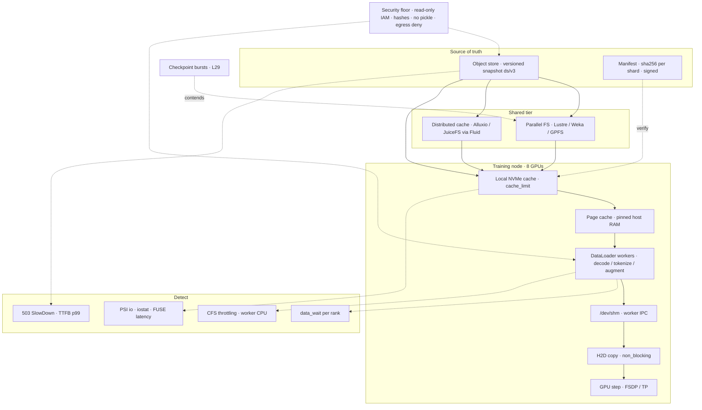

# Lesson 30 — AI/ML platform: distributed training storage & data loading at scale — dataset streaming, caching tiers & I/O stalls

*2026-10-08*

## What interviewers are really probing

[Lesson 29](/lessons/29-training-reliability-checkpoint-elastic) kept a 16k-GPU synchronous job alive through hardware failure. This lesson covers the other way the same job wastes money while every pod reports `Running`: **the GPUs are waiting for data.** In a synchronous job the slowest rank's dataloader sets the pace for every rank, so one node with a cold cache, a CPU-throttled decode worker, or a 503-ing object-store prefix idles the whole fleet. [L19](/lessons/19-gpu-topology-nvlink-rdma-nccl) gave you the RDMA backend fabric (which is **not** the network your data rides on). [L23](/lessons/23-gpu-observability-dcgm-nccl-roofline) gave you SM-active and the roofline. [L26](/lessons/26-gpu-cost-attribution-reclaim-spot) priced idle GPU-hours. [L27](/lessons/27-gpu-supply-chain-weight-registry-hydrate) tiered **weights** for cold start; this is the same tiering problem for **datasets**, except you read them every step, for weeks.

What they check for (fuel: [wafer-ai/gpu-perf-engineering-resources](https://github.com/wafer-ai/gpu-perf-engineering-resources), platform framing, not kernels):

- **Bytes-per-second math before architecture.** Can you show that pre-tokenized LLM pre-training needs megabytes per second for the whole fleet, while vision/video needs terabytes per second, and design differently for each?
- **Data format.** Why millions of small files kill a parallel filesystem's metadata server and an object store's request budget, and why everyone converges on 100 MB–1 GB sequential shards (WebDataset tar, Mosaic MDS, Arrow/Parquet, tokenized `.bin`/`.idx`).
- **Caching tiers.** Object store → parallel FS or distributed cache → node NVMe → page cache / pinned RAM. What each tier is for, how each one fails, and why LRU gets a 0% hit rate when the dataset is bigger than the cache.
- **Shuffle, sharding and determinism.** Shard-level shuffle plus a sample buffer, `IterableDataset` duplicates, `DistributedSampler.set_epoch`, and a sample order that survives a world-size change.
- **Resume correctness.** The dataloader position is checkpoint state (L29 section 3). Resuming without it silently repeats or skips data.
- **Finding I/O stalls.** Data-wait per rank, worker profiles, CFS throttling, `/dev/shm`, PSI, FUSE latency, 503 SlowDown, and the startup storm when 2,000 nodes LIST a bucket at once.
- **Contention.** Checkpoint write bursts and dataset reads on the same filesystem.
- **Security.** The dataset is part of the model's supply chain: poisoning, provenance, read-only IAM, deserialization in data formats, `pipe:` URLs, and caches that quietly copy regulated data onto thousands of disks.

**Interview sentence:** "I start with bytes per second per GPU. Pre-tokenized LLM data is a few kilobytes per second per GPU, so there the problems are startup storms, metadata, tail latency and checkpoint contention. Vision and video are genuinely bandwidth-bound, so I shard into large sequential files, stream them from object storage through an NVMe cache with deep prefetch, push decode onto enough pinned CPU or the GPU, and alert on per-rank data-wait instead of average utilization. The dataset is an immutable, hashed, read-only snapshot, and its ID lands in every checkpoint manifest."

## Core diagram: Snapshot → Tiers → Workers → GPU (+ detect, contention, security floor)




**How to read it:** top to bottom is the data path. Every tier exists to turn high-latency, request-limited reads into low-latency sequential reads close to the GPU. The dotted arrows are where you measure and where things collide. The PNG adds the numbers: bandwidth math, tier properties, what each pipeline stage hides, and the order to hunt a stall.

## Idiosyncrasies / operator depth

### 1. Do the bytes/s math first: most LLM jobs aren't bandwidth-bound

```text
need (bytes/s) = samples/s/GPU × bytes/sample × N_GPUs
```

**Pre-tokenized LLM pre-training (illustrative).** A 70B dense model at about 400 TFLOP/s achieved per H100 costs roughly 6 × 7e10 = 4.2e11 FLOPs per token, so about 950 tokens/s per GPU. With a vocabulary over 65,535 (Llama 3 is about 128k) each token ID is 4 bytes, so a GPU needs **about 4 KB/s**. 16,384 GPUs need **about 60 MB/s total**. A single object-store prefix can do that.

**Vision (illustrative).** A mid-size vision model at 2,000 images/s per GPU × ~110 KB per JPEG (roughly ImageNet's average) is about 220 MB/s per GPU, 1.8 GB/s per node, and about 0.9 TB/s across 512 nodes. Now storage, front-end network, and decode CPU are all real limits. Video and interleaved multimodal are 10–100× more bytes and usually need GPU decode.

**So the LLM pain is elsewhere:**

- **Startup storm.** 2,000 nodes each LIST a prefix and open their first shards in the same second. That's request rate, not bandwidth.
- **Tail latency.** A synchronous step waits for the slowest rank. A p99.9 object-store GET of 2 s with shallow prefetch shows up as a periodic step-time spike.
- **On-the-fly tokenization and packing.** CPU-bound, not I/O-bound. Ten workers per rank tokenizing JSONL can fall behind a small, fast model.
- **Checkpoint bursts** (L29): a 70B run writes on the order of a terabyte of model plus optimizer state every few minutes to tens of minutes, often to the same filesystem the data is read from.
- **Mixture changes and restarts.** Every restart (L29: every couple of hours at 16k GPUs) re-warms caches and re-seeks the data position.

The front-end network matters too. Data usually arrives over the node's front-end NIC (often 100–200 Gbps), not the 3.2 Tbps RDMA fabric from L19. Unless you deliberately run storage over RDMA (Lustre o2ib, Weka, GPUDirect Storage), the front-end NIC caps per-node ingest.

### 2. Format: small files are a metadata problem, not a bandwidth problem

- **Object stores** charge per request and rate-limit per prefix. S3 documents at least **3,500 PUT/COPY/POST/DELETE and 5,500 GET/HEAD requests per second per partitioned prefix**, and it scales partitions *gradually*. A cold burst gets `503 SlowDown` before the bucket adapts. LIST returns at most 1,000 keys per page, so listing a 50M-object dataset at job start costs thousands of sequential round trips per lister.
- **Parallel filesystems** (Lustre, GPFS) handle huge sequential reads across many OSTs/NSDs, but every `open`/`stat` hits the metadata server. Millions of 100 KB JPEGs in one directory saturate one MDT long before any OST is busy.
- **The fix everyone converges on:** pack samples into **100 MB–1 GB shards** read sequentially, with a precomputed index.
  - **WebDataset:** POSIX tar files; each sample is files sharing a basename (`000123.jpg`, `000123.json`). Streams from `https://`, `s3://` via `pipe:`, or local disk.
  - **Mosaic Streaming (MDS):** shards plus an `index.json`, deterministic shuffle across world sizes, mid-epoch resume, per-shard hashes, and a local cache with `cache_limit` eviction.
  - **Arrow / Parquet** (Hugging Face `datasets`, Ray Data): columnar, memory-mappable; good for tabular and text, and for filtering before training.
  - **Megatron-style tokenized `.bin` + `.idx`:** pre-tokenized uint32 arrays, memory-mapped, random access by document offset. Tiny bandwidth, and the index is everything.
- **Shard size tradeoff.** Too small and you're back to request overhead. Too big and the shard count drops below `ranks × workers`, so some workers have nothing to read (or everyone reads the same shard). Rule of thumb: **at least 10× more shards than `world_size × num_workers`**, and even so, a resharding pass is cheaper than debugging an uneven epoch.

### 3. Caching tiers and how each one fails

| Tier | What it's for | How it fails |
|---|---|---|
| **Object store** (S3, GCS, Azure Blob) | Source of truth; versioned, immutable snapshots; cheapest per byte | TTFB of tens of ms; per-prefix request limits; 503s on cold bursts; egress cost when GPUs are in another region or cloud |
| **S3 Express One Zone / zonal buckets** | Single-digit-ms object reads in the GPUs' AZ | Different bucket type (directory buckets, its own auth/session model); one AZ, so it's a cache, not a home |
| **Parallel FS** (FSx for Lustre, Weka, VAST, GPFS, Filestore/Managed Lustre) | POSIX, high aggregate throughput, shared across nodes | MDS saturation on small files; throughput is provisioned per TiB, so it's sized for checkpoints *or* data, rarely both; noisy neighbors |
| **Distributed cache** (Alluxio, JuiceFS, orchestrated by [Fluid](https://github.com/fluid-cloudnative/fluid)) | Turns the NVMe on GPU nodes into a shared cache in front of object storage | Cache workers compete with training for CPU/memory/NVMe; consistent-hash rebalancing on node churn; another FUSE layer |
| **Node-local NVMe** (instance store, RAID0) | Fastest persistent tier; per-node shard working set | **Ephemeral**: gone on node recycle (and L29 recycles bad nodes); has to be wiped between tenants |
| **Page cache / pinned host RAM** | Prefetched shards and batches in flight | Evicted by checkpoint writes; pinned memory is a non-swappable, finite pool shared with DCP staging (L29) |

**The LRU trap.** If the dataset is bigger than the cache and every epoch reads it in a fresh uniform-random order, LRU evicts each shard just before you need it again. Your hit rate approaches the fraction that fits, and with a cyclic pattern it can approach zero. Fixes: (a) **shard affinity**: each node keeps a stable subset of shards on its NVMe and shuffles within it plus a cross-node buffer (Mosaic's canonical-node partitioning works roughly this way), (b) size the cache for the whole working set, or (c) accept streaming and make prefetch deep enough that the object store's throughput, not its latency, is the limit.

**Lazy-load filesystems.** An FSx for Lustre filesystem linked to S3 (data repository association) imports **metadata** up front, but file *contents* load from S3 on first read. Epoch one runs at S3 speed and every later epoch runs at Lustre speed. Prewarm with `lfs hsm_restore` (or a Fluid `DataLoad`) before the gang is admitted, not while 16k GPUs wait.

### 4. FUSE mounts: convenient, with sharp edges

Mountpoint for Amazon S3, gcsfuse, and blobfuse2 let a training script `open()` an object as a file.

- **Semantics.** Mountpoint is optimized for large sequential reads and new-file writes; it doesn't support modifying existing files, and renames are limited (not supported on general-purpose buckets). Code that writes a temp file and renames it into place fails. For data that's fine; for checkpoints, use the SDK or DCP's storage writers.
- **Metadata caching.** Default TTLs keep a `stat` from turning into a HEAD per call. For an **immutable snapshot** set the metadata TTL to indefinite (`--metadata-ttl indefinite` on Mountpoint); for a prefix that changes under you, that same setting returns stale listings.
- **The FUSE daemon is a process with memory.** In the CSI-driver model it runs outside your container, so it isn't counted against your pod's limits the way you'd expect, and when it gets OOM-killed every open file returns `Transport endpoint is not connected`. That looks like a data bug to the trainer, and it's really a node problem.
- **Double caching.** FUSE local cache + kernel page cache + your loader's own buffer can hold three copies of a shard. Give the cache an explicit size and put it on NVMe, not the root disk.
- **Privilege.** FUSE needs `/dev/fuse` and usually `SYS_ADMIN`. Use the CSI driver so the **trainer pod stays unprivileged** (security section).

### 5. The DataLoader on a GPU node: CPU, memory and /dev/shm

- **Prefetch depth.** Each rank has up to `num_workers × prefetch_factor` batches in flight (`prefetch_factor` defaults to 2 per worker). Depth hides *latency spikes*. It doesn't help if average decode throughput is below the GPU's consumption rate: then the queue just drains.
- **`persistent_workers=True`.** Without it, workers are torn down and re-forked every epoch, and the first batches of each epoch stall while they rebuild state and reopen shards.
- **Copy-on-access "leak".** Workers are forked. A `Dataset` that holds a Python list of dicts touches each object's refcount on read, which dirties the page, which copies it into the worker. RSS grows to `num_workers × dataset index size` and looks exactly like a leak. Keep indexes in numpy arrays, Arrow tables, or memory-mapped files.
- **`/dev/shm`.** Workers hand tensors to the main process through shared memory. Docker defaults to 64 MB; Kubernetes gives you whatever the runtime gives you unless you mount an `emptyDir` with `medium: Memory`. Too small shows up as `DataLoader worker (pid N) is killed by signal: Bus error` or `No space left on device` in `torch.multiprocessing`. And `medium: Memory` counts against the pod's memory limit, so size it deliberately.
- **CPU limits throttle in bursts.** A CFS quota lets workers burn their whole period's budget in the first few milliseconds and then sit throttled, so you get periodic data stalls with average CPU under the limit. Check `cpu.stat` `nr_throttled`. For training pods: **Guaranteed QoS, integer CPUs, static CPU manager policy**, and topology manager aligning CPUs with the GPU's NUMA node.
- **NUMA.** A loader on socket 0 feeding a GPU on socket 1 crosses the inter-socket link for every H2D copy. `nvidia-smi topo -m` shows the GPU's CPU affinity; pin workers there.
- **Pinned memory and H2D.** `pin_memory=True` plus `.to(device, non_blocking=True)` lets the copy overlap compute. Pinned memory is page-locked RAM, and L29's async checkpoint staging uses the same pool, so budget both.
- **GPU decode.** When CPU decode can't keep up (video, high-res images), NVIDIA DALI or nvJPEG/NVDEC moves decode and augmentation onto the GPU. You trade some GPU time for a lot of CPU. GPUDirect Storage (cuFile) can DMA from NVMe or a supported parallel FS straight to GPU memory, skipping the bounce buffer; it pays off for large sequential reads, not small random ones.
- **Rough CPU budget.** Text tokenization is light; vision decode plus augmentation can need roughly 8–16 cores per GPU. GPU instances ship a fixed CPU:GPU ratio, so measure samples/s per core before you promise a throughput.

### 6. Sharding, shuffling and determinism

- **`IterableDataset` duplicates.** Each rank *and* each worker gets its own copy of the iterator. If you don't split by rank and by worker, every sample is seen `world_size × num_workers` times per "epoch". WebDataset's default node splitter is `single_node_only`, which **raises** in a multi-node job unless you pass `nodesplitter=wds.split_by_node`. That's a deliberate tripwire.
- **`DistributedSampler.set_epoch(epoch)`.** Forget it and every epoch replays the same order. Also, `drop_last=False` **pads** by repeating samples so every rank has the same count; at 16k ranks and a small eval set that's a measurable bias.
- **Global shuffle at petabyte scale isn't possible**, so you approximate it: shuffle the shard list, then shuffle samples inside an in-memory buffer. A buffer that's too small yields batches correlated by source shard (all one language, one crawl date, one camera). Mosaic's `py1e`/`py1br` algorithms shuffle within blocks of `shuffle_block_size` samples spread across shards; bigger blocks are better randomness for more cache.
- **Determinism across world sizes.** If the sample order is a function of `world_size`, then L29's elastic restart at 1,920 instead of 2,048 GPUs changes which samples each rank sees, and resuming "at step 50,000" means something different. Mosaic fixes the order to `num_canonical_nodes`, independent of the physical node count; you want the same property from any loader you build.
- **Data mixtures.** Pre-training mixes many sources with target weights (web, code, math, multilingual). Mixture state (per-source cursors, tokens seen) must be checkpointed, and changing weights mid-run is a change you version and log, like a hyperparameter.

### 7. Resume: the data position is checkpoint state

L29 listed the dataloader position as state that silently diverges. In practice:

- **Map-style + sampler:** checkpoint the epoch, the sampler seed and the number of samples consumed **globally**; on resume, fast-forward. Naive fast-forward by re-reading data can take minutes at scale, so skip by index.
- **`torchdata.stateful_dataloader.StatefulDataLoader`:** drop-in `DataLoader` with `state_dict()`/`load_state_dict()`, aggregated across its workers but **not across ranks**. You save one state per rank, so you need DCP or a per-rank file, and a world-size change needs a global offset you can recompute.
- **Mosaic Streaming:** `StreamingDataset.state_dict(num_samples, from_beginning)` records the global sample offset, so resume works across world sizes as long as `num_canonical_nodes` is unchanged.
- **Prefetched batches are not consumed.** If you checkpoint "batches yielded by the loader" instead of "batches the optimizer actually stepped on", you skip up to `num_workers × prefetch_factor` batches per rank on every resume. Small per restart, large over hundreds of restarts.
- **Record the dataset snapshot ID** (and mixture version) in the checkpoint manifest. Without it, nobody can say which data a model saw, which matters for evals, data-deletion requests, and incident response.

### 8. Contention, startup and cost

- **Checkpoint versus data.** A DCP save (L29) is a write burst from every rank at once. On a shared Lustre/FSx filesystem it saturates the OSTs, reads queue behind it, and every save causes a data stall exactly when you thought async checkpointing made saves free. Fixes: separate filesystems (or buckets) for checkpoints and data, stagger rank uploads, put the first checkpoint tier on local NVMe, and keep enough data prefetched to ride out a save.
- **Startup storm.** At admission, every node opens the index, lists the prefix, and requests first shards. Precompute the index (`index.json`, a shard manifest) so nobody lists; spread shards across many prefixes (hash-prefixed keys) so S3 can partition; stagger start by rank; and prewarm the shared tier before the gang starts (Kueue admission check or an init Job). [L20](/lessons/20-training-inference-scheduling-kueue-volcano) gives you the admission hook.
- **Data gravity.** A dataset in `us-east-1` feeding GPUs elsewhere pays egress on every epoch that streams it. Replicate the snapshot next to the capacity cell once ([L24](/lessons/24-multi-cluster-inference-routing-capacity), [L26](/lessons/26-gpu-cost-attribution-reclaim-spot)) and charge the copy to the job; count it in the decision to move a job to cheaper GPUs in another region.

## Concrete commands & config

### Shard the dataset once (Mosaic MDS and WebDataset)

```python
# Write MDS shards with per-shard hashes; upload straight to the versioned snapshot prefix.
from streaming import MDSWriter

columns = {"tokens": "ndarray:uint32", "source": "str"}   # explicit types, never 'pkl'
with MDSWriter(out="s3://corp-train-data/ds/v3/train",
               columns=columns,
               compression="zstd",
               hashes=["sha1", "xxh64"],
               size_limit="256mb") as w:
    for sample in packed_sequences():          # pre-tokenized, packed to seq_len
        w.write(sample)
```

```python
# WebDataset: pack small files into ~512 MB tar shards with a stable naming scheme.
import webdataset as wds
with wds.ShardWriter("shards/train-%06d.tar", maxsize=512 * 1024**2) as sink:
    for key, jpg_bytes, meta in samples():               # meta is a dict -> written as JSON
        sink.write({"__key__": key, "jpg": jpg_bytes, "json": meta})
```

```bash
# Hash every shard and write a manifest the trainer verifies (security section).
find shards -name '*.tar' -print0 | xargs -0 -P 32 sha256sum | sort -k2 > manifest.sha256
aws s3 cp --recursive shards/ s3://corp-train-data/ds/v3/wds/
aws s3 cp manifest.sha256 s3://corp-train-data/ds/v3/wds/manifest.sha256
```

### Stream it: Mosaic Streaming with a bounded NVMe cache

```python
from streaming import StreamingDataset
from torch.utils.data import DataLoader

ds = StreamingDataset(
    remote="s3://corp-train-data/ds/v3/train",
    local="/nvme/cache/ds-v3",            # node-local NVMe, not the root disk
    split=None,
    shuffle=True,
    shuffle_algo="py1e",
    shuffle_seed=17,
    shuffle_block_size=1 << 18,           # bigger = better mixing, more cache
    num_canonical_nodes=128,              # FIXED for the life of the run → order survives rescale
    batch_size=8,                         # per-rank batch; must match the DataLoader
    predownload=64,                       # samples ahead per worker
    cache_limit="1.5tb",                  # evict instead of filling the disk
    validate_hash="sha1",                 # check shards against the index hashes
    download_retry=4,
    allow_unsafe_types=False,             # refuse pickle columns
)
loader = DataLoader(ds, batch_size=8, num_workers=8, pin_memory=True,
                    prefetch_factor=4, persistent_workers=True)

# Resume (state goes into the checkpoint alongside model/optimizer, L29):
state = ds.state_dict(num_samples=global_samples_stepped, from_beginning=False)
ds.load_state_dict(state)
```

### Stream it: WebDataset done right in a multi-node job

```python
import webdataset as wds

urls = "s3-shards.txt"   # a VERIFIED list of https:// or local paths, see security
ds = (
    wds.WebDataset(urls,
                   shardshuffle=1000,                  # shuffle the shard list
                   nodesplitter=wds.split_by_node,     # default single_node_only raises
                   workersplitter=wds.split_by_worker,
                   seed=17)
    .shuffle(10_000)                                   # sample buffer, costs host RAM
    .decode(wds.imagehandler("torchrgb"))              # explicit handler; no pickle members
    .to_tuple("jpg", "json")
    .batched(64, partial=False)
)
loader = wds.WebLoader(ds, batch_size=None, num_workers=12, pin_memory=True,
                       prefetch_factor=4, persistent_workers=True)
```

### Stateful DataLoader for map-style data

```python
from torchdata.stateful_dataloader import StatefulDataLoader
from torch.utils.data.distributed import DistributedSampler

sampler = DistributedSampler(ds, num_replicas=world, rank=rank, shuffle=True, seed=17, drop_last=True)
loader = StatefulDataLoader(ds, batch_size=16, sampler=sampler, num_workers=10,
                            pin_memory=True, prefetch_factor=4, persistent_workers=True,
                            in_order=False)            # one slow sample doesn't block the queue
for epoch in range(start_epoch, epochs):
    sampler.set_epoch(epoch)                         # or every epoch replays the same order
    ...
    ckpt["dataloader"] = loader.state_dict()         # per rank; saved via DCP with the model
```

### Kubernetes: shm, NVMe cache, Guaranteed QoS, CSI mounts

```yaml
# Trainer pod template (inside the JobSet from L29)
spec:
  containers:
  - name: trainer
    resources:
      requests: {cpu: "96", memory: 1600Gi, nvidia.com/gpu: 8}
      limits:   {cpu: "96", memory: 1600Gi, nvidia.com/gpu: 8}   # Guaranteed QoS, integer CPUs
    securityContext:
      allowPrivilegeEscalation: false
      capabilities: {drop: ["ALL"]}                               # no SYS_ADMIN: FUSE lives in the CSI driver
    volumeMounts:
    - {name: dshm, mountPath: /dev/shm}
    - {name: nvme-cache, mountPath: /nvme/cache}
    - {name: ds-v3, mountPath: /data/ds-v3, readOnly: true}
  volumes:
  - name: dshm
    emptyDir: {medium: Memory, sizeLimit: 64Gi}                   # counts against the memory limit
  - name: nvme-cache
    ephemeral:                                                     # local NVMe via a local-volume CSI / LVM driver
      volumeClaimTemplate:
        spec:
          accessModes: ["ReadWriteOnce"]
          storageClassName: local-nvme-encrypted
          resources: {requests: {storage: 3Ti}}
  - name: ds-v3
    persistentVolumeClaim: {claimName: ds-v3-s3, readOnly: true}
---
# Mountpoint for S3 CSI: read-only, one snapshot prefix, indefinite metadata TTL (immutable data only)
apiVersion: v1
kind: PersistentVolume
metadata: {name: ds-v3-s3}
spec:
  capacity: {storage: 1200Gi}       # ignored by the driver, required by the API
  accessModes: [ReadOnlyMany]
  storageClassName: ""
  claimRef: {namespace: train-team-a, name: ds-v3-s3}
  mountOptions:
  - read-only
  - region us-east-1
  - prefix ds/v3/
  - metadata-ttl indefinite
  csi:
    driver: s3.csi.aws.com
    volumeHandle: ds-v3-s3
    volumeAttributes: {bucketName: corp-train-data}
---
# FSx for Lustre (shared tier) — static PV
apiVersion: v1
kind: PersistentVolume
metadata: {name: fsx-train-data}
spec:
  capacity: {storage: 120Ti}
  accessModes: [ReadOnlyMany]
  csi:
    driver: fsx.csi.aws.com
    volumeHandle: fs-0123456789abcdef0
    volumeAttributes:
      dnsname: fs-0123456789abcdef0.fsx.us-east-1.amazonaws.com
      mountname: abcdefgh
```

Kubelet side, once per GPU node pool (L18): `cpuManagerPolicy: static`, `topologyManagerPolicy: single-numa-node` (or `restricted`), and reserved CPUs for system daemons and the FUSE/CSI daemons so they don't steal decode cores.

### Prewarm the shared tier before admission

```bash
# FSx for Lustre linked to S3: metadata is imported; contents load lazily on first read.
# Hydrate file contents for this snapshot before the gang starts:
nohup find /fsx/ds/v3 -type f -print0 | xargs -0 -n 64 -P 32 sudo lfs hsm_restore &
lfs hsm_state /fsx/ds/v3/train-000123.tar         # 'released' = not yet hydrated

# Stripe large shards across all OSTs (set on the directory before files land):
lfs setstripe -c -1 -S 4M /fsx/ds/v3
lfs getstripe -d /fsx/ds/v3
lfs df -h /fsx                                    # OST balance; one full OST throttles everyone

# Straight to node NVMe from object storage (many parallel GETs, spread over prefixes):
s5cmd --numworkers 256 cp 's3://corp-train-data/ds/v3/train/*' /nvme/cache/ds-v3/
```

```yaml
# Fluid + Alluxio: NVMe-tiered distributed cache in front of the bucket, prewarmed by a DataLoad
apiVersion: data.fluid.io/v1alpha1
kind: Dataset
metadata: {name: ds-v3, namespace: train-team-a}
spec:
  mounts:
  - mountPoint: s3://corp-train-data/ds/v3/
    name: ds-v3
  accessModes: [ReadOnlyMany]
  nodeAffinity:
    required:
      nodeSelectorTerms:
      - matchExpressions:
        - {key: node.kubernetes.io/instance-type, operator: In, values: ["p5.48xlarge"]}
---
apiVersion: data.fluid.io/v1alpha1
kind: AlluxioRuntime
metadata: {name: ds-v3, namespace: train-team-a}
spec:
  replicas: 64
  tieredstore:
    levels:
    - mediumtype: SSD
      path: /mnt/nvme/alluxio
      quota: 2Ti
      high: "0.95"
      low: "0.7"
---
apiVersion: data.fluid.io/v1alpha1
kind: DataLoad
metadata: {name: ds-v3-warm, namespace: train-team-a}
spec:
  dataset: {name: ds-v3, namespace: train-team-a}
  loadMetadata: true
  target:
  - path: /train
    replicas: 1
```

### Finding the stall on a live node

```bash
# 1. Is it the loader at all? Per-rank data_wait from the trainer's own metrics (below).
# 2. What are the workers doing right now?
py-spy dump --pid "$TRAINER_PID" --subprocesses     # TRAINER_PID = the rank's main process
#    fetch (socket read / s3 client) vs decode (PIL / tokenizer) vs collate (torch.stack)
# 3. CPU throttling inside the container's cgroup:
cat /sys/fs/cgroup/cpu.stat | grep -E 'nr_periods|nr_throttled|throttled_usec'
# 4. Local disk and pressure:
iostat -xm 1 5
cat /proc/pressure/io /proc/pressure/memory
# 5. Shared FS client stats:
lctl get_param llite.*.stats | grep -E 'read_bytes|open|getattr'
lfs df -h /fsx
# 6. shm and kills:
df -h /dev/shm
dmesg -T | grep -iE 'bus error|oom|fuse|Transport endpoint'
# 7. GPU side: is SM activity sawtoothing at a data cadence?
nvidia-smi dmon -s u -d 1
nvidia-smi topo -m                                 # loader CPUs on the GPU's NUMA node?
```

### PromQL: the SLI and the detectors

```promql
# Data-wait fraction per rank (trainer exports a histogram of time blocked in next(loader))
sum by (job, rank) (rate(trainer_data_wait_seconds_sum[5m]))
  / sum by (job, rank) (rate(trainer_step_seconds_sum[5m]))

# Worst rank vs median — the straggler that sets the pace
max by (job) (rate(trainer_data_wait_seconds_sum[5m]) / rate(trainer_step_seconds_sum[5m]))
  - quantile by (job) (0.5, rate(trainer_data_wait_seconds_sum[5m]) / rate(trainer_step_seconds_sum[5m]))

# CFS throttling on trainer pods (periodic data stalls with average CPU under limit)
sum by (pod) (rate(container_cpu_cfs_throttled_periods_total{namespace=~"train-.*"}[5m]))
  / sum by (pod) (rate(container_cpu_cfs_periods_total{namespace=~"train-.*"}[5m]))

# Node I/O pressure (node_exporter pressure collector)
rate(node_pressure_io_stalled_seconds_total[5m])

# GPU idle dips that line up with data stalls (DCGM, L23)
avg by (Hostname) (DCGM_FI_PROF_SM_ACTIVE)
```

Alert on **max-rank data-wait over 2% for 15 minutes**, not on average GPU utilization; a 99% average hides the one rank costing the whole job 5%.

## Failures & fixes

| Symptom | Likely cause | Fix / mitigation |
|---|---|---|
| All ranks show the same step time, SM-active sawtooths every N steps | One rank's loader can't keep up (cold cache, slow shard, throttled CPU); synchronous step waits for it | Per-rank data-wait metric; deeper prefetch; fix that node's cache or CPU; evict at the next checkpoint (L29) if hardware |
| First epoch is 3× slower than later epochs | Lazy-load FS (FSx DRA) or cold NVMe cache filling from S3 | Prewarm with `lfs hsm_restore`/`DataLoad`/`s5cmd` before admission; gate admission on warm status |
| `503 SlowDown` storm in the first minutes; jobs crash in the loader | 2,000 nodes LIST and GET one prefix at once | Precomputed index, no LIST at startup; hash-spread prefixes; jittered start; retries with backoff (`download_retry`) |
| Step time spikes every time a checkpoint saves | DCP write burst saturates the same Lustre OSTs the data is read from | Separate FS/bucket for checkpoints; NVMe first tier; staggered uploads; more prefetch |
| `DataLoader worker (pid N) is killed by signal: Bus error` | `/dev/shm` too small (64 MB default) | `emptyDir: {medium: Memory, sizeLimit: ...}` mounted at `/dev/shm`; include it in the memory limit |
| Worker RSS grows each epoch until OOMKilled | Copy-on-access of Python objects in the Dataset; or prefetch too deep for large samples | numpy/Arrow/mmap indexes; lower `prefetch_factor`; `persistent_workers=True` |
| Average CPU 60% of limit, but loader stalls periodically | CFS quota throttling in bursts | Guaranteed QoS + static CPU manager, integer CPUs; check `nr_throttled` |
| Loss is suspiciously good, then evals don't improve | `IterableDataset` not split by rank/worker; each sample seen many times | `split_by_node` + `split_by_worker`; assert unique sample IDs across ranks in a smoke test |
| Every epoch has the identical order | `DistributedSampler.set_epoch` never called | Call it every epoch; log the first sample ID per epoch |
| After an elastic restart at a different world size, data repeats or skips | Per-rank cursors resumed onto a different rank count | Global sample offset; order fixed by canonical nodes, not physical nodes; StatefulDataLoader state is per rank only |
| After every resume a few hundred batches are silently skipped | Checkpointed batches *yielded* (incl. prefetch), not batches *stepped* | Record samples consumed by the optimizer step; resume from that |
| `Transport endpoint is not connected` from training code | FUSE daemon (Mountpoint/gcsfuse) crashed or OOM-killed | Reserve memory for the CSI/FUSE daemons; restart policy; set cache size; treat as a node fault |
| Batches are correlated (one language/source per batch), loss is noisy | Shuffle buffer too small; too few shards relative to workers | Bigger buffer or `shuffle_block_size`; reshard so shards ≥ 10× `world × workers` |
| Throughput is fine on 64 nodes, collapses at 1,024 | Lustre MDT saturated by `open`/`stat` on small files; or front-end NIC cap | Pack into large shards; stripe; check `lctl` open/getattr rates; storage over RDMA or more front-end bandwidth |
| Training cost up 20% after moving the job to another region | Streaming the dataset across regions every epoch | Replicate the snapshot once next to the GPUs; account egress in the placement decision |

## Security & hardening

**The dataset is part of the model.** Whoever can change what a run reads can change what the weights do, and they can do it without touching the code, the image, or the checkpoint bucket from L29. Data loaders also deserialize and fetch untrusted bytes on every GPU node with the training job's identity, and caches copy regulated data onto thousands of disks. [L11](/lessons/11-cluster-security-pss-admission-rbac), [L12](/lessons/12-node-container-hardening-supply-chain), [L13](/lessons/13-ml-weights-checkpoint-hardening), [L14](/lessons/14-ml-inference-training-deploy-hardening), [L27](/lessons/27-gpu-supply-chain-weight-registry-hydrate) and [L29](/lessons/29-training-reliability-checkpoint-elastic) built the controls for images, weights and checkpoints. Here they get applied to the data path, and tied back to weights so you can say which data produced which model.

### Dataset, model-weight & checkpoint lineage (required)

| Control | Threat | Practice |
|---|---|---|
| **Immutable, versioned snapshots** | Data changes under a running job; nobody can reproduce or audit a model | Train only from `ds/<name>/v<N>/` prefixes that are write-once: S3 Object Lock or GCS retention on the snapshot, versioning on, no overwrite. "Latest" is a pointer you flip in config, never a mutable prefix |
| **Hashed, signed manifests** | Shard swapped, truncated or poisoned between curation and training | Pipeline writes `manifest.json` (shard path, sha256, bytes, source, license, PII-scan result) and signs it with its **workload identity** (keyless `cosign sign-blob` via OIDC). Trainer verifies the signature and signer identity before training, and the loader verifies each shard (Mosaic `validate_hash`, or a hash check before the tar is opened) |
| **Lineage into the weights** | You can't answer "which models trained on this data?" for a deletion request, license problem, or poisoning incident | Every L29 checkpoint manifest records `dataset_snapshot`, `mixture_version` and the data manifest digest; the promotion attestation from L27 carries them into the released weights. That's a SLSA-style provenance chain from source data to the serving deployment |
| **Poisoning defenses** | Split-view poisoning (a URL's content changes after it was indexed: expired domains) and frontrunning (editing a source just before a known snapshot); see [Carlini et al.](https://arxiv.org/abs/2302.10149) | Never train from live URL lists; download once, hash, freeze into the snapshot; per-source provenance and quality/dedup filters at curation; diff the snapshot against the previous version and review sources whose share jumps; canary/eval sets that look for known backdoor triggers |
| **Read-only trainer identity** | A compromised trainer rewrites the dataset for every future run | Trainer service account gets `GetObject` (and `ListBucket` scoped by `s3:prefix`) on exactly the snapshot prefixes the job declares; **no Put/Delete** on data. The curation pipeline has a separate write identity; nobody else writes. Same per-job ABAC pattern as L29 (EKS Pod Identity session tags / GCS IAM conditions) |
| **Separate data, checkpoints and released weights** | One identity can read training data *and* write promoted weights, so one compromise covers the whole chain | Three buckets or prefixes and three identities: data (pipeline writes, trainer reads), checkpoints (trainer writes its own prefix, L29), released weights (promotion writes, serving reads, L27). Bucket policies deny cross-use |
| **Encryption and classification** | Regulated or licensed data leaks from a bucket, a cache, or a decommissioned node | SSE-KMS required by bucket policy with a **per-dataset or per-tenant key**, so key grants are the access boundary; deny non-TLS; tag snapshots with classification and allowed uses; deny training jobs whose declared purpose doesn't match the tag (admission policy) |

### Data-path and deployment controls

| Control | Threat | Practice |
|---|---|---|
| **No pickle in data formats** | A dataset shard that executes code on every GPU node when decoded | Mosaic: `allow_unsafe_types=False` (refuses `pkl` columns). WebDataset: the default decoders unpickle `.pyd`/`.pkl`/`.pickle` members, so decode with explicit handlers and reject shards containing those extensions at curation. NumPy: `np.load(..., allow_pickle=False)` (the default). `torch.load(..., weights_only=True)` for any `.pt` data file. Hugging Face `datasets`: pin the version and keep `trust_remote_code` off; prefer Parquet/Arrow |
| **`pipe:` URLs are shell commands** | WebDataset opens `pipe:` URLs with `shell=True`, so a shard list someone can edit is remote code execution | Build shard lists in code from the signed manifest; allow only `https://` URLs on your own data endpoint or paths under `/data/`; never read shard lists from the dataset bucket itself or from user input |
| **Network isolation** | Loader fetches from the internet (or exfiltrates to it) with the job's credentials | Default-deny egress NetworkPolicy on training namespaces ([L9](/lessons/09-networkpolicy-multi-nic-sflow)); object store only through VPC endpoints / Private Service Connect with an endpoint policy pinned to the data buckets; bucket policy `aws:SourceVpce` so stolen credentials don't work from outside |
| **Caches are copies** | NVMe and distributed caches keep regulated data after the job ends or the node changes tenant | Encrypted local volumes (LUKS / instance-store encryption, `local-nvme-encrypted` class); wipe on node recycle and between tenants (L25); per-tenant Fluid/Alluxio runtimes, never one shared cache across tenants; cache TTL tied to job lifetime |
| **Unprivileged trainer pods** | FUSE in the trainer needs `SYS_ADMIN` and `/dev/fuse`, which is close to node root | Mount through the CSI driver (Mountpoint S3, gcsfuse, FSx); trainer pods run under Pod Security `restricted`-style settings with all capabilities dropped; admission ([L11](/lessons/11-cluster-security-pss-admission-rbac)) denies `hostPath` except the approved NVMe path and denies privileged containers in training namespaces |
| **Signed images for loaders and curation jobs** | Malicious decode library or tokenizer in the image | Kyverno/Gatekeeper `verifyImages` with digest pins ([L12](/lessons/12-node-container-hardening-supply-chain)); tokenizer files are part of the signed data manifest, because a changed tokenizer changes every sample |
| **Secrets** | Static cloud keys in a dataset config, a Fluid `Dataset` spec, or a notebook | Workload identity for every reader; no access keys in CRs; if a runtime needs a secret, reference a Secret with RBAC scoped to that namespace and rotate it |
| **Audit** | Silent bulk read or copy of a dataset | S3 data events / GCS data-access logs on data buckets; alert on reads from identities not in the job registry and on volume anomalies |

```yaml
# Kyverno: training pods may only mount the dataset read-only, no privileged FUSE, shm sized
apiVersion: kyverno.io/v1
kind: ClusterPolicy
metadata: {name: training-data-path}
spec:
  validationFailureAction: Enforce
  rules:
  - name: no-privileged-or-sysadmin
    match: {any: [{resources: {kinds: [Pod], namespaces: ["train-*"]}}]}
    validate:
      message: "Training pods must not be privileged or add SYS_ADMIN; mount data via CSI."
      pattern:
        spec:
          containers:
          - =(securityContext):
              =(privileged): "false"
              =(capabilities):
                X(add): "null"
  - name: hostpath-only-nvme
    match: {any: [{resources: {kinds: [Pod], namespaces: ["train-*"]}}]}
    validate:
      message: "hostPath is limited to /mnt/nvme."
      deny:
        conditions:
          any:
          - key: "{{ request.object.spec.volumes[?hostPath].hostPath.path || `[]` }}"
            operator: AnyNotIn
            value: ["/mnt/nvme/*"]
```

```json
{
  "Version": "2012-10-17",
  "Statement": [
    {
      "Sid": "TrainerReadsDeclaredSnapshotOnly",
      "Effect": "Allow",
      "Action": "s3:GetObject",
      "Resource": "arn:aws:s3:::corp-train-data/ds/${aws:PrincipalTag/dataset}/${aws:PrincipalTag/dataset-version}/*"
    },
    {
      "Sid": "DenyOutsideVpce",
      "Effect": "Deny",
      "Principal": "*",
      "Action": "s3:*",
      "Resource": ["arn:aws:s3:::corp-train-data", "arn:aws:s3:::corp-train-data/*"],
      "Condition": {"StringNotEquals": {"aws:SourceVpce": "vpce-0abc123def4567890"}}
    }
  ]
}
```

The first statement belongs in the trainer role's identity policy (the principal tags come from the job's workload identity); the deny belongs in the bucket policy. Deletion on snapshot prefixes is handled by Object Lock and a break-glass role, never by the trainer or the pipeline.

## Interview soundbites

- **"Do the bytes-per-second math first. A 70B model on sixteen thousand GPUs reads about sixty megabytes a second of pre-tokenized data. That job isn't bandwidth-bound; it's startup-, metadata- and tail-bound."**
- **"Small files are a metadata problem. Pack into hundred-megabyte-to-gigabyte shards, precompute the index, and never LIST a bucket at job start."**
- **"In synchronous training the slowest rank's dataloader sets the pace for everyone, so I alert on max-rank data-wait, not average GPU utilization."**
- **"Prefetch hides latency, not throughput. If decode can't keep up on average, a deeper queue just drains slower."**
- **"LRU over a dataset bigger than the cache, read in random order, can get a near-zero hit rate. Either size the cache for the working set, use shard affinity, or stream and accept object-store throughput."**
- **"The dataloader position is checkpoint state. It has to be a global sample offset, or an elastic restart at a different world size repeats or skips data."**
- **"Checkpoint bursts and dataset reads on one filesystem means every async save is a data stall. I separate them, or put the first checkpoint tier on local NVMe."**
- **"The dataset is part of the model's supply chain: immutable snapshots, signed hash manifests, a read-only trainer identity, no pickle in data formats, and the snapshot ID recorded in every checkpoint and released model."**
- **"WebDataset `pipe:` URLs run through a shell, so a shard list is code. I build it from a signed manifest."**
- **"Next: storage and data are done; Lesson 31 is evaluation and release gating at fleet scale."**

## How this maps to the JD

JDs that say **"build the data and storage layer for large-scale training," "maximize GPU utilization,"** or **"own the ML platform from data to deployment securely"** are asking whether you can keep expensive accelerators fed without overbuilding storage, and whether you can prove what data went into a model. This lesson connects [L19](/lessons/19-gpu-topology-nvlink-rdma-nccl) (front-end versus RDMA networks), [L20](/lessons/20-training-inference-scheduling-kueue-volcano) (admission gates for prewarm), [L23](/lessons/23-gpu-observability-dcgm-nccl-roofline) (SM-active and per-rank signals), [L24](/lessons/24-multi-cluster-inference-routing-capacity)/[L26](/lessons/26-gpu-cost-attribution-reclaim-spot) (data gravity and egress in placement), [L27](/lessons/27-gpu-supply-chain-weight-registry-hydrate) (the same tiering for weights) and [L29](/lessons/29-training-reliability-checkpoint-elastic) (resume state, checkpoint contention), with the security floor from [L11](/lessons/11-cluster-security-pss-admission-rbac)–[L14](/lessons/14-ml-inference-training-deploy-hardening). Fuel: [wafer-ai/gpu-perf-engineering-resources](https://github.com/wafer-ai/gpu-perf-engineering-resources).

## Watch (talks & demos)

Real talks. Watch them after Failures & fixes.

### Optimizing Data Locality and GPU Utilization for Training Workloads in Kubernetes

Bin Fan (Alluxio), KubeCon + CloudNativeCon Japan 2025. A Kubernetes-native distributed cache built on the NVMe already sitting in GPU nodes, with consistent hashing to place data and production examples of decoupling GPU clusters from the data lake. Operator takeaway: the shared-tier row of section 3, and why "copy the dataset to every cluster" doesn't scale once GPU capacity moves between regions. Watch it skeptically: it's a vendor talk, so check its claims against your own bytes/s math.

<iframe width="100%" height="360" src="https://www.youtube.com/embed/ClSxwQZNPqc" title="Optimizing Data Locality and GPU Utilization for Training Workloads in Kubernetes - Bin Fan, Alluxio" frameBorder="0" allow="accelerometer; autoplay; clipboard-write; encrypted-media; gyroscope; picture-in-picture; web-share" allowFullScreen></iframe>

[Open on YouTube](https://www.youtube.com/watch?v=ClSxwQZNPqc)

### A Distributed Stateful Dataloader for Large-Scale Pretraining

Davis Wertheimer & Linsong Chu (IBM Research), PyTorch Conference 2024. A PyTorch-native loader that is distributed, checkpointable and **rescalable**: streaming, stateless shuffling with a custom LCG, dynamic data mixing, and mid-epoch resume, proven on a 7B Llama run over 4T tokens. Operator takeaway: sections 6–7 done properly, especially "same data order at a different GPU count".

<iframe width="100%" height="360" src="https://www.youtube.com/embed/VtT4rdph4Qs" title="A Distributed Stateful Dataloader for Large-Scale Pretraining - Davis Wertheimer & Linsong Chu" frameBorder="0" allow="accelerometer; autoplay; clipboard-write; encrypted-media; gyroscope; picture-in-picture; web-share" allowFullScreen></iframe>

[Open on YouTube](https://www.youtube.com/watch?v=VtT4rdph4Qs)

### Loading Training Data with WebDataset

Thomas Breuel (WebDataset author). Why sequential tar shards beat random file access, how sharding, shard shuffle and sample buffers fit together, and how the same pipeline reads from local disk, web servers or object stores. Operator takeaway: the format half of section 2 and the reason "small files" is a design smell at scale.

<iframe width="100%" height="360" src="https://www.youtube.com/embed/mTv_ePYeBhs" title="Loading Training Data with WebDataset" frameBorder="0" allow="accelerometer; autoplay; clipboard-write; encrypted-media; gyroscope; picture-in-picture; web-share" allowFullScreen></iframe>

[Open on YouTube](https://www.youtube.com/watch?v=mTv_ePYeBhs)

## References

- Formats & loaders: [Mosaic Streaming](https://github.com/mosaicml/streaming) · [Streaming docs (shuffling, canonical nodes)](https://docs.mosaicml.com/projects/streaming/en/stable/) · [WebDataset](https://github.com/webdataset/webdataset) · [Efficient PyTorch I/O for large datasets (WebDataset + AIStore)](https://pytorch.org/blog/efficient-pytorch-io-library-for-large-datasets-many-files-many-gpus/) · [StatefulDataLoader](https://meta-pytorch.org/data/beta/torchdata.stateful_dataloader.html) · [torch.utils.data](https://docs.pytorch.org/docs/stable/data.html) · [NVIDIA DALI](https://github.com/NVIDIA/DALI) · [GPUDirect Storage](https://docs.nvidia.com/gpudirect-storage/)
- Storage: [S3 performance guidelines (per-prefix request rates)](https://docs.aws.amazon.com/AmazonS3/latest/userguide/optimizing-performance.html) · [S3 Express One Zone](https://docs.aws.amazon.com/AmazonS3/latest/userguide/s3-express-one-zone.html) · [Mountpoint for Amazon S3](https://github.com/awslabs/mountpoint-s3) · [Mountpoint S3 CSI driver](https://github.com/awslabs/mountpoint-s3-csi-driver) · [FSx for Lustre data repositories](https://docs.aws.amazon.com/fsx/latest/LustreGuide/fsx-data-repositories.html) · [FSx for Lustre CSI driver](https://github.com/kubernetes-sigs/aws-fsx-csi-driver) · [Cloud Storage FUSE CSI (GKE)](https://cloud.google.com/kubernetes-engine/docs/how-to/persistent-volumes/cloud-storage-fuse-csi-driver) · [Fluid](https://github.com/fluid-cloudnative/fluid) · [s5cmd](https://github.com/peak/s5cmd)
- Kubernetes node tuning: [CPU management policies](https://kubernetes.io/docs/tasks/administer-cluster/cpu-management-policies/) · [Topology manager](https://kubernetes.io/docs/tasks/administer-cluster/topology-manager/) · [emptyDir (medium: Memory)](https://kubernetes.io/docs/concepts/storage/volumes/#emptydir) · [PSI (pressure stall information)](https://docs.kernel.org/accounting/psi.html)
- Security: [Poisoning Web-Scale Training Datasets is Practical (Carlini et al.)](https://arxiv.org/abs/2302.10149) · [OpenSSF model signing (sigstore/model-transparency)](https://github.com/sigstore/model-transparency) · [Sigstore cosign sign-blob](https://docs.sigstore.dev/cosign/signing/signing_with_blobs/) · [SLSA provenance](https://slsa.dev/spec/v1.0/provenance) · [Kyverno policies](https://kyverno.io/docs/) · [S3 Object Lock](https://docs.aws.amazon.com/AmazonS3/latest/userguide/object-lock.html)
- Talk slides: [PyTorch Conf 2024 — distributed stateful dataloader (PDF)](https://static.sched.com/hosted_files/pytorch2024/cb/pytorch%20conf%202024%20data%20loading.pdf)
- [wafer-ai/gpu-perf-engineering-resources](https://github.com/wafer-ai/gpu-perf-engineering-resources) — AI/ML platform fuel
- Prior: [29 — Training reliability / checkpoint / elastic](/lessons/29-training-reliability-checkpoint-elastic) · [28 — Inference autoscaling](/lessons/28-inference-autoscaling-scale-to-zero) · [27 — GPU supply chain / hydrate](/lessons/27-gpu-supply-chain-weight-registry-hydrate) · [26 — GPU cost / reclaim / spot](/lessons/26-gpu-cost-attribution-reclaim-spot) · [25 — Multi-tenant GPU isolation](/lessons/25-multi-tenant-gpu-isolation-quota) · [24 — Multi-cluster routing / capacity](/lessons/24-multi-cluster-inference-routing-capacity) · [23 — GPU observability](/lessons/23-gpu-observability-dcgm-nccl-roofline) · [20 — Kueue / gang scheduling](/lessons/20-training-inference-scheduling-kueue-volcano) · [19 — GPU topology / NCCL](/lessons/19-gpu-topology-nvlink-rdma-nccl) · [18 — GPU node pools](/lessons/18-gpu-node-pools-mig-timeslicing) · [14 — ML deploy hardening](/lessons/14-ml-inference-training-deploy-hardening) · [13 — ML weights](/lessons/13-ml-weights-checkpoint-hardening) · [12 — Supply chain](/lessons/12-node-container-hardening-supply-chain) · [11 — PSS / admission / RBAC](/lessons/11-cluster-security-pss-admission-rbac) · [9 — NetworkPolicy / multi-NIC](/lessons/09-networkpolicy-multi-nic-sflow)
- Next: **Lesson 31 — AI/ML platform: evaluation & release gating at fleet scale — eval clusters, regression gates, canary rollouts of new weights**

## Quick self-check

Out loud, in under two minutes each:

1. Estimate the dataset read bandwidth for (a) an 8B LLM on 2,048 H100s with pre-tokenized uint32 data and (b) a ViT on 512 GPUs at 2,500 images/s per GPU. Which one needs a parallel filesystem, and what actually breaks in the other one?
2. Your 1,024-node job's first epoch is 3× slower than the rest and the first ten minutes are full of `503 SlowDown`. Name the two causes and the fix for each, including where in the admission flow you'd put the fix.
3. Every rank reports 1.3 s per step, SM-active sawtooths every 40 steps, and average CPU is 55% of the limit. Walk through how you'd find the stall and the three most likely culprits.
4. An elastic restart moves you from 256 to 240 nodes. What has to be true of your data order and your checkpointed loader state so you neither repeat nor skip data? Why isn't `StatefulDataLoader` alone enough?
5. Design the IAM, bucket layout and manifest flow so a compromised trainer can't change any dataset, a poisoned shard is caught before training, and six months later you can list every released model that trained on snapshot `ds/web/v7`. Then name two ways a data loader itself can execute attacker-controlled code, and the control for each.
