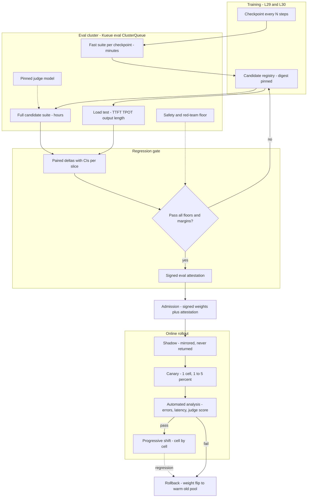

# Lesson 31 — AI/ML platform: evaluation & release gating at fleet scale — eval clusters, regression gates, canary rollouts of new weights

*2026-10-09*

## What interviewers are really probing

[Lesson 29](/lessons/29-training-reliability-checkpoint-elastic) kept the training run alive and [Lesson 30](/lessons/30-training-data-loading-storage-io) kept it fed. Both end with a pile of checkpoints. This lesson covers how one of them becomes the weights that answer production traffic in every cell, and how you stop a bad one before it does. [L27](/lessons/27-gpu-supply-chain-weight-registry-hydrate) moved signed weights to the GPUs. [L21](/lessons/21-inference-serving-slos-ttft-tpot-kvcache) and [L28](/lessons/28-inference-autoscaling-scale-to-zero) defined serving SLOs and capacity. [L24](/lessons/24-multi-cluster-inference-routing-capacity) gave you cells and weighted routing. Release gating ties those together: **a new set of weights is a deploy, and an eval result is the test suite that has to pass before the deploy is allowed.**

What they check for (fuel: [wafer-ai/gpu-perf-engineering-resources](https://github.com/wafer-ai/gpu-perf-engineering-resources), platform framing, not research):

- **Eval as infrastructure.** Can you size and schedule an eval cluster: GPU-hours per suite, queue priority against training and serving, checkpoint-cadence evals versus full candidate evals, and sandboxes for agentic tasks?
- **Reproducibility.** Do you pin the weights digest, tokenizer, chat template, serving image, sampling parameters, dataset version, harness version and judge model? Do you evaluate on the **same serving stack** (quantization, TP layout, kernels) that production will run?
- **Statistics, not vibes.** Do you know the standard error on a 1,000-question benchmark, why paired comparisons beat two independent scores, and why 200 benchmarks at p=0.05 give you about ten false alarms per release?
- **Gate design.** Hard floors (safety, security, refusal), non-inferiority margins per slice, must-improve targets, and who is allowed to change the thresholds.
- **Performance is part of quality.** A model that writes 40% longer answers is a TPOT and KV-capacity regression ([L21](/lessons/21-inference-serving-slos-ttft-tpot-kvcache)) even if every benchmark goes up.
- **Online rollout.** Shadow versus canary for weights, weighted routing between InferencePools, sticky sessions, statistical power at 1% traffic, per-cell canaries, bake time, and rollback as a routing change instead of a redeploy.
- **Security.** Eval sets are crown jewels (leak them and every future score is contaminated), the eval cluster runs untrusted candidate artifacts, shadow traffic carries real user data, and the gate decision itself has to be a signed artifact that admission enforces.

**Interview sentence:** "I treat new weights as a deploy with a test suite. Candidates run on a dedicated, Kueue-queued eval cluster with the exact production serving image and digest-pinned weights, tokenizer and judge. The gate is a signed attestation over paired, per-slice non-inferiority tests plus hard safety floors and a load test, and admission refuses any InferencePool whose weights lack it. Then I shadow, canary one cell at a time by HTTPRoute weight with automated analysis on errors, TTFT and TPOT, output length and an online judge score, and keep the old pool warm so rollback is a weight flip."

## Core diagram: Checkpoint → Eval cluster → Gate → Shadow → Canary → Fleet (+ rollback, security floor)

![Evaluation and release gating at fleet scale: training checkpoints flow into a candidate registry, a Kueue-scheduled eval cluster runs fast checkpoint suites and full candidate suites on the production serving stack, a regression gate applies paired statistics, per-slice non-inferiority margins, hard safety floors and a load test, a signed eval attestation is produced, then shadow traffic, a one-cell canary with automated analysis, progressive weight shifts across cells, and a warm rollback path, with the security floor for eval sets, candidate weights, shadow data and admission](/evaluation-release-gating-canary-weights.png)



**How to read it:** top to bottom is the life of a set of weights. Offline evals decide whether a candidate may be deployed at all; online stages decide whether it may take traffic, and how much. The attestation is the hinge: admission checks it, so skipping the eval cluster means the pods never start. The PNG adds the numbers: eval throughput math, error bars, the gate types, canary metrics and the security floor.

## Idiosyncrasies / operator depth

### 1. Eval is a release gate, not a dashboard

Most teams start with evals as a leaderboard someone looks at. At fleet scale that breaks the first time a model ships because "the numbers looked fine" and nobody checked the slice that regressed. The fix is to treat promotion like any other deploy pipeline:

| Stage | Question it answers | Typical cost | Who can stop it |
|---|---|---|---|
| **Checkpoint eval** (during training) | Is the run healthy? Loss spikes, capability curves, early safety drift | Minutes per checkpoint, small fixed suite | Training team |
| **Candidate eval** (offline, full) | Is this checkpoint at least as good as prod on everything that matters? | Hours, hundreds to thousands of GPU-hours | Gate (automated) plus release owner |
| **Performance gate** | Does it fit the serving SLO and capacity plan? | An hour of a production-shaped pool | Gate (automated) |
| **Shadow** | Does it behave on real traffic without anyone seeing it? | Duplicate inference capacity for the shadow slice | Release owner |
| **Canary** (one cell, small %) | Do real users and real metrics agree? | Surge capacity for both versions | Automated analysis, on-call |
| **Progressive rollout** | Does it hold across cells, regions, tenants? | Days of bake | Automated analysis, on-call |

The output of the offline stages is not a chart. It is a **decision record**: candidate digest, baseline digest, every input that was pinned, every test with its interval, pass/fail per rule, and who approved any override. That record gets signed and attached to the weights (security section).

### 2. Eval clusters: capacity, queues and throughput math

Evals are a GPU workload with its own shape: bursty (every candidate, every checkpoint), latency-sensitive for the humans waiting on a release, and highly parallel. Run them on a **dedicated ClusterQueue** in the same Kueue cohort as training and batch ([L20](/lessons/20-training-inference-scheduling-kueue-volcano), [L25](/lessons/25-multi-tenant-gpu-isolation-quota)):

- **Reserved floor** big enough for the fast checkpoint suite and one full candidate at a time; borrow the rest from training's idle quota.
- **Priority:** candidate evals for a pending release preempt exploratory evals; checkpoint evals never preempt the training gang that produced them.
- **Use serving SKUs, not training SKUs, when you can.** Evals are inference. An eval that ran on 8× H100 with TP=8 in bf16 while production serves FP8 with TP=4 on a different SKU is measuring a different system.

**Throughput math (illustrative).** A full candidate suite of 40,000 generative items averaging 600 output tokens is 24M output tokens. A 70B model on one 8-GPU vLLM replica at high batch might sustain on the order of 2,500–4,000 output tok/s, so call it 2–3 hours per replica. Eight replicas get it under 30 minutes. Add log-likelihood (multiple-choice) tasks, long-context tasks where prefill dominates, and agentic tasks that run tool sandboxes for minutes per item, and a full suite is commonly **hundreds of GPU-hours** for a large model, repeated per candidate and per seed. Put it in the cost model ([L26](/lessons/26-gpu-cost-attribution-reclaim-spot)) as its own line, because eval spend grows with model count and release cadence, not with traffic.

**Checkpoint cadence.** Evaluating every checkpoint with the full suite is the most common way to let eval spend outgrow training. Run a small, stable, low-variance suite on every checkpoint (or every Nth), and the full suite only on checkpoints nominated as candidates.

**Agentic and code evals need sandboxes.** Code execution, browser and tool-use tasks run model-generated code. That's a container per task, a hard timeout, no credentials and no network beyond the task's mock services (security section). Sandbox start time and capacity, not GPUs, often bound these suites.

### 3. Reproducibility: pin the whole system, then measure the noise you can't pin

A score is a function of far more than the weights. Pin all of it in the eval manifest:

| Input | Why it moves scores |
|---|---|
| Weights digest (and LoRA adapter digests) | Obviously |
| Tokenizer files and **chat template** | A template change alone can swing instruction-following benchmarks by points |
| Serving image digest, engine version, quantization, TP/PP layout, max model length | Kernels, numerics, truncation |
| Sampling parameters (temperature, top-p, max tokens, stop sequences, seed) | Greedy vs sampled are different benchmarks |
| Eval dataset version and prompt templates (few-shot exemplars, system prompt) | Prompt format is part of the test |
| Harness version | Answer extraction and normalization rules change scores |
| Judge model digest, judge prompt, judge sampling params | The judge is a dependency with its own regressions |

Even fully pinned, **LLM inference is not bitwise deterministic in practice**: with dynamic batching, the same prompt can produce different outputs depending on what else is in the batch, because many kernels aren't batch-invariant (Thinking Machines' "Defeating Nondeterminism in LLM Inference" walks through why). Don't fight that in the gate; account for it. Run sampled tasks with several seeds or samples per item, report the variance, and make the gate statistical.

**Evaluate the artifact you will ship.** The most expensive gating bug I know is "we evaluated the bf16 checkpoint in a research harness and served an FP8 quantized build with a different chat template." Build the serving artifact first (the [L27](/lessons/27-gpu-supply-chain-weight-registry-hydrate) OCI weights artifact plus serving image), then evaluate *that* through the same OpenAI-compatible endpoint the gateway will call.

### 4. Regression gates are statistics problems

**Error bars.** For a benchmark of n independent items with accuracy p, the standard error is `sqrt(p(1-p)/n)`. At n = 1,000 and p = 0.80 that's about 1.26 points, so a 95% interval is about ±2.5 points. A "1.5-point drop" on that benchmark is noise. Items are rarely independent (many questions share a passage or a template), so use **clustered standard errors** by group; they are larger. See Miller, "Adding Error Bars to Evals" (arXiv 2411.00640).

**Pair everything.** Candidate and baseline answer the *same* questions, so test the per-item difference, not two independent scores. Pairing removes the variance from question difficulty and usually shrinks the interval a lot. Use a paired bootstrap or the paired-difference SE.

**Multiple comparisons.** A gate with 200 benchmark-slice checks at α = 0.05 will flag about ten regressions on an identical model. Options: fewer, larger, curated slices; non-inferiority margins chosen up front; a false-discovery-rate correction; and a small number of hard floors that never get statistical slack.

**Three kinds of rule.**

| Rule | Example | Statistical form |
|---|---|---|
| **Hard floor** | Jailbreak success rate at most 1%, no regression on the security/abuse suite, PII leakage zero on canary prompts | Upper confidence bound below the floor |
| **Non-inferiority** | Each product slice (code, math, multilingual, long-context, tool use) may not drop more than 1 point | Lower bound of the paired delta above minus the margin |
| **Must improve** | The reason for this release: e.g., +3 points on tool-use success | Lower bound of the paired delta above zero (or the target) |

**Contamination and Goodhart.** Public benchmarks leak into web crawls and then into training data ([L30](/lessons/30-training-data-loading-storage-io) lineage is how you prove it didn't). Keep **private held-out sets** that never leave the eval enclave, embed canary strings to detect leakage, rotate items, and compare public versus private scores; a model that jumps on the public version and not the private one is memorizing. Any metric that becomes the only gate gets optimized; a balanced slate of slices plus human review of samples keeps it honest.

### 5. Judges are pinned dependencies

LLM-as-judge scales open-ended evaluation, but a judge is a model with known biases: position bias, verbosity bias, and self-preference (Zheng et al., "Judging LLM-as-a-Judge with MT-Bench and Chatbot Arena"). Operator rules:

- **Pin the judge** (weights digest or provider model version, prompt, temperature 0) in the eval manifest. Changing the judge means re-baselining, never comparing across judge versions.
- **Calibrate against humans.** Keep a human-labeled golden set and track judge–human agreement (Cohen's κ) as a release metric of the eval system itself.
- **Pairwise with swap.** For A/B judging, run both orders and count only consistent verdicts.
- **Cheaper judges where possible.** Exact match, regex, unit tests and small classifiers are cheaper and less biased than a 70B judge.
- **Never let a candidate judge itself** or a sibling from the same training run.

Lesson 32 goes deep on judge calibration and keeping offline and online evals consistent; here the point is that the judge is a versioned dependency inside the gate.

### 6. Performance and capacity are part of the gate

New weights change serving behavior even at identical architecture:

- **Output length distribution.** A model that answers in 900 tokens instead of 600 costs 50% more decode time, KV seat-time and GPU-hours per request ([L21](/lessons/21-inference-serving-slos-ttft-tpot-kvcache), [L26](/lessons/26-gpu-cost-attribution-reclaim-spot)). Gate on p50/p95 output tokens on a production-shaped prompt set.
- **Latency under load.** Run a fixed-rate load test (GuideLLM, inference-perf) on a production-shaped pool and compare TTFT/TPOT p95 and max sustainable rate to the baseline at the same SLO.
- **Memory.** Different architecture, vocab size or context length changes KV blocks per GPU and therefore cell capacity ([L23](/lessons/23-gpu-observability-dcgm-nccl-roofline), [L24](/lessons/24-multi-cluster-inference-routing-capacity)). The autoscaler's per-replica capacity numbers ([L28](/lessons/28-inference-autoscaling-scale-to-zero)) must be updated *before* the rollout, or HPA will undershoot.
- **Cold start.** Bigger weights or a new format change hydrate time ([L27](/lessons/27-gpu-supply-chain-weight-registry-hydrate)); preheat the new digest into every cell's cache on promotion, before the canary.

### 7. Shadow, canary and progressive rollout for weights

**Shadow (mirror).** Copy a sample of real requests to the candidate, never return its answer, and compare offline. It finds crashes, latency, length drift, refusal-rate shifts and judge-score deltas on real distribution with zero user exposure. Two traps: shadowing doubles inference cost for the mirrored slice, and **agentic requests must not execute side effects**. A shadow model that calls `send_email` or a payments tool is no longer a shadow. Stub tools, or shadow only the first model turn.

**Canary.** Route a small weight of live traffic to a new InferencePool holding the candidate. Mechanics on Kubernetes:

- **Gateway API Inference Extension:** two `InferencePool`s behind one `HTTPRoute`, shift `backendRefs[].weight`; the old pool stays up for rollback (GKE documents exactly this for base-model rollouts).
- **KServe:** `canaryTrafficPercent` on `InferenceService` (serverless mode), or `LLMInferenceService` group/weight; KServe recommends starting a new version at a small non-zero weight instead of weight 0 so the gateway has warmed the backend.
- **Argo Rollouts:** canary steps with the Gateway API traffic-router plugin and an `AnalysisTemplate` that aborts automatically on Prometheus queries.

**Canary specifics for LLMs:**

- **Session stickiness.** A multi-turn conversation that flips models mid-session behaves oddly and loses its prefix-cache hits. Hash on session or conversation ID, so a user stays on one version for the whole conversation.
- **Statistical power.** At 1% of 2,000 req/s you get 20 req/s, about 72k requests an hour. That's plenty for error rate and latency, but a 1-point change in a judge score sampled on 2% of those needs hours. Size bake time from the smallest effect you need to detect, not from habit.
- **Compare canary to baseline over the same window**, not to last week's numbers; traffic mix shifts by hour.
- **One cell first.** Canary in one cell ([L24](/lessons/24-multi-cluster-inference-routing-capacity)) with its own blast radius, then widen cell by cell with a bake per step. Tenants with strict contracts can be excluded from early waves by routing rule.
- **Capacity for two versions.** During rollout both pools hold GPUs. Reserve surge capacity or shrink the old pool as the new one grows; don't discover at 50% that the cell can't hold both ([L28](/lessons/28-inference-autoscaling-scale-to-zero)).

**Canary metrics:** request error rate and 5xx, TTFT/TPOT p95, output tokens p50/p95, refusal rate, stop-reason mix (length truncation spikes are a classic), tool-call parse failures, online judge score on sampled traffic, user feedback rate (thumbs down, regenerate), and business metrics where they exist.

**Rollback is a routing change.** Keep the old InferencePool warm for the bake period, so rollback is setting a weight to zero, measured in seconds. If the old pool scaled to zero, rollback becomes a cold start of a 140 GB model ([L27](/lessons/27-gpu-supply-chain-weight-registry-hydrate)) during an incident. Keep the old digest in each cell's cache until the new one has baked.

### 8. Ownership and separation of duties

- Training owns candidates. **The eval platform owns the gate code and thresholds**, and changing a threshold is a reviewed change in Git, not a flag in the release UI.
- An override ("ship despite the gate") is allowed, but it's a signed, logged exception with a named approver and an expiry, and admission sees it the same way it sees a passing attestation.
- The model registry stores state transitions (candidate, gated, canary, GA, deprecated, revoked) with the digests and attestation references. Revoking a digest has to reach every cell's admission policy.

## Concrete commands & config

### Kueue: a dedicated eval queue in the GPU cohort

```yaml
apiVersion: kueue.x-k8s.io/v1beta1
kind: ClusterQueue
metadata: {name: eval-cq}
spec:
  cohort: gpu-fleet
  namespaceSelector: {matchLabels: {platform.example.com/role: eval}}
  preemption:
    reclaimWithinCohort: Any
    withinClusterQueue: LowerPriority
  resourceGroups:
  - coveredResources: ["nvidia.com/gpu", "cpu", "memory"]
    flavors:
    - name: h100-serving-sku          # same SKU and flavor production serves on
      resources:
      - {name: nvidia.com/gpu, nominalQuota: 64, borrowingLimit: 192}
      - {name: cpu, nominalQuota: 1024}
      - {name: memory, nominalQuota: 8Ti}
---
apiVersion: kueue.x-k8s.io/v1beta1
kind: LocalQueue
metadata: {name: candidate-evals, namespace: eval-llm}
spec: {clusterQueue: eval-cq}
---
apiVersion: scheduling.k8s.io/v1
kind: PriorityClass
metadata: {name: eval-release-candidate}
value: 50000
description: "Full suite for a pending release; preempts exploratory evals, not training gangs."
```

### An eval Job: production serving image + harness client, everything pinned

```yaml
apiVersion: batch/v1
kind: Job
metadata:
  name: eval-cand-2026-10-09-r1
  namespace: eval-llm
  labels:
    kueue.x-k8s.io/queue-name: candidate-evals
    kueue.x-k8s.io/priority-class: eval-release-candidate
spec:
  parallelism: 8
  completions: 8
  completionMode: Indexed          # shard the suite across 8 replicas
  template:
    spec:
      serviceAccountName: eval-runner        # RO on candidate + baseline prefixes, RW on results only
      restartPolicy: Never
      runtimeClassName: nvidia
      initContainers:
      - name: vllm
        restartPolicy: Always                  # native sidecar
        image: registry.corp/serving/vllm@sha256:3f1c...   # SAME digest prod serves
        args: ["--model=/weights", "--served-model-name=cand",
               "--tensor-parallel-size=4", "--quantization=fp8",
               "--max-model-len=32768", "--seed=1234"]
        resources: {limits: {nvidia.com/gpu: 4}}
        readinessProbe: {httpGet: {path: /health, port: 8000}, periodSeconds: 10}
        volumeMounts: [{name: weights, mountPath: /weights, readOnly: true}]
      containers:
      - name: harness
        image: registry.corp/eval/harness@sha256:9ab0...
        command: ["/bin/sh", "-c"]
        args:
        - |
          lm_eval --model local-completions \
            --model_args model=cand,base_url=http://127.0.0.1:8000/v1/completions,num_concurrent=64,max_retries=3,tokenizer=/weights \
            --tasks "$(cat /suite/shard-${JOB_COMPLETION_INDEX}.txt)" \
            --apply_chat_template --seed 1234 \
            --log_samples --output_path /results/${JOB_COMPLETION_INDEX}
        volumeMounts:
        - {name: weights, mountPath: /weights, readOnly: true}
        - {name: suite, mountPath: /suite, readOnly: true}
        - {name: results, mountPath: /results}
      volumes:
      - name: weights
        image:                                   # ImageVolume: the L27 OCI weights artifact, by digest
          reference: registry.corp/models/llm-70b@sha256:7d2e...
          pullPolicy: Always
      - name: suite
        configMap: {name: suite-v41}             # task list per shard, versioned
      - name: results
        ephemeral:
          volumeClaimTemplate:
            spec: {accessModes: [ReadWriteOnce], resources: {requests: {storage: 50Gi}}}
```

Per-item logs (`--log_samples`) matter more than the aggregate: the paired test below needs item-level results for both candidate and baseline.

### The gate: paired deltas, margins and floors

```python
# gate.py - item-level results for baseline and candidate on identical items
import json, numpy as np

rng = np.random.default_rng(0)
POLICY = json.load(open("gate-policy.json"))    # versioned in Git, owned by the eval platform

def paired_ci(base, cand, clusters, n_boot=10_000, alpha=0.05):
    """Cluster bootstrap of mean(cand - base) over clusters (e.g., shared passage IDs)."""
    d = cand - base
    ids = np.unique(clusters)
    by = {c: d[clusters == c] for c in ids}
    stats = []
    for _ in range(n_boot):
        pick = rng.choice(ids, size=len(ids), replace=True)
        stats.append(np.concatenate([by[c] for c in pick]).mean())
    lo, hi = np.quantile(stats, [alpha / 2, 1 - alpha / 2])
    return d.mean(), lo, hi

results, failed = [], False
for s in POLICY["slices"]:                       # e.g. code, math, multilingual, long_ctx, tool_use
    base, cand, cl = load_items(s["name"])        # arrays aligned by item id
    delta, lo, hi = paired_ci(base, cand, cl)
    if s["rule"] == "non_inferior":
        ok = lo > -s["margin"]                    # e.g. margin 0.01 = 1 point
    elif s["rule"] == "must_improve":
        ok = lo > s.get("target", 0.0)
    elif s["rule"] == "floor":                    # rates where lower is better (jailbreak, PII)
        rate = 1 - cand.mean()
        ub = rate + 1.96 * np.sqrt(rate * (1 - rate) / len(cand))
        ok = ub <= s["max_rate"]
    failed |= not ok
    results.append({"slice": s["name"], "rule": s["rule"], "delta": delta,
                    "ci": [lo, hi], "pass": bool(ok)})

json.dump({"candidate": CAND_DIGEST, "baseline": BASE_DIGEST, "policy": POLICY["version"],
           "manifest": EVAL_MANIFEST_DIGEST, "results": results, "pass": not failed},
          open("eval-attestation.json", "w"), indent=2)
raise SystemExit(1 if failed else 0)
```

### Performance gate: same prompts, same rate, compare to baseline

```bash
# Production-shaped prompts (sampled, scrubbed), constant rate near the cell's planned per-replica load.
# GuideLLM CLI flags change between releases; check `guidellm run --help`.
for target in baseline candidate; do
  guidellm run \
    --backend kind=openai_http,target=http://$target.eval-llm.svc:8000 \
    --profile kind=constant,rate=12 \
    --constraint kind=max_duration,seconds=900 \
    --data kind=json_file,path=/suite/prod-shaped-prompts.jsonl \
    --output-path /results/perf-$target.json
done
# Gate: TTFT p95 and TPOT p95 within 5% of baseline at the same rate; output tokens p95 within 15%.
```

### Sign the weights and attest the gate result

```bash
# Weights: OpenSSF model signing (sigstore/model-transparency), keyless with the promotion job's identity.
model_signing sign /models/llm-70b-cand --signature /models/llm-70b-cand/model.sig

# Gate result: an in-toto attestation bound to the weights artifact digest, signed by the EVAL CLUSTER's identity.
cosign attest --yes \
  --type https://corp.example/attestations/eval-gate/v1 \
  --predicate eval-attestation.json \
  registry.corp/models/llm-70b@sha256:7d2e...

# Anyone (admission, auditors) can verify who signed it:
cosign verify-attestation \
  --type https://corp.example/attestations/eval-gate/v1 \
  --certificate-identity-regexp '^https://kubernetes.io/namespaces/eval-llm/serviceaccounts/eval-gate$' \
  --certificate-oidc-issuer https://oidc.eks.us-east-1.amazonaws.com/id/EXAMPLE \
  registry.corp/models/llm-70b@sha256:7d2e... | jq -r .payload | base64 -d | jq .predicate.pass
```

### Canary: two InferencePools, one HTTPRoute

```yaml
apiVersion: gateway.networking.k8s.io/v1
kind: HTTPRoute
metadata: {name: chat-llm, namespace: serve-llm}
spec:
  parentRefs: [{name: inference-gw, kind: Gateway}]
  rules:
  - matches: [{headers: [{name: x-canary-optout, value: "true"}]}]   # strict-contract tenants
    backendRefs:
    - {group: inference.networking.k8s.io, kind: InferencePool, name: llm-70b-v41, weight: 1}
  - backendRefs:
    - {group: inference.networking.k8s.io, kind: InferencePool, name: llm-70b-v41, weight: 99}
    - {group: inference.networking.k8s.io, kind: InferencePool, name: llm-70b-v42, weight: 1}
```

```bash
# Ramp in Git (GitOps), one cell at a time: 1 -> 5 -> 25 -> 50 -> 100, bake between steps.
# Rollback during an incident: one patch, old pool still warm.
kubectl -n serve-llm patch httproute chat-llm --type=json -p='[
  {"op":"replace","path":"/spec/rules/1/backendRefs/0/weight","value":100},
  {"op":"replace","path":"/spec/rules/1/backendRefs/1/weight","value":0}]'
kubectl -n serve-llm get inferencepool,httproute
```

### Or let Argo Rollouts drive the ramp and abort on analysis

```yaml
apiVersion: argoproj.io/v1alpha1
kind: Rollout
metadata: {name: llm-70b, namespace: serve-llm}
spec:
  replicas: 16
  strategy:
    canary:
      canaryService: llm-70b-canary
      stableService: llm-70b-stable
      trafficRouting:
        plugins:
          argoproj-labs/gatewayAPI: {httpRoute: chat-llm, namespace: serve-llm}
      analysis:
        templates: [{templateName: llm-canary-health}]
        startingStep: 1
      steps:
      - setWeight: 1
      - pause: {duration: 30m}
      - setWeight: 5
      - pause: {duration: 2h}
      - setWeight: 25
      - pause: {duration: 6h}
      - setWeight: 50
      - pause: {}                      # human promotion to 100 after cross-cell bake
  # template.spec: serving pod pinned to the new weights digest (omitted)
---
apiVersion: argoproj.io/v1alpha1
kind: AnalysisTemplate
metadata: {name: llm-canary-health, namespace: serve-llm}
spec:
  metrics:
  - name: error-rate-delta
    interval: 5m
    failureLimit: 2
    successCondition: result[0] <= 0.002
    provider:
      prometheus:
        address: http://prometheus.monitoring:9090
        query: |
          (sum(rate(llm_requests_total{version="canary",code=~"5.."}[10m])) / sum(rate(llm_requests_total{version="canary"}[10m])))
          - (sum(rate(llm_requests_total{version="stable",code=~"5.."}[10m])) / sum(rate(llm_requests_total{version="stable"}[10m])))
  - name: ttft-p95-ratio
    interval: 5m
    failureLimit: 2
    successCondition: result[0] <= 1.10
    provider:
      prometheus:
        address: http://prometheus.monitoring:9090
        query: |
          histogram_quantile(0.95, sum by (le) (rate(vllm:time_to_first_token_seconds_bucket{version="canary"}[10m])))
          / histogram_quantile(0.95, sum by (le) (rate(vllm:time_to_first_token_seconds_bucket{version="stable"}[10m])))
  - name: output-length-ratio
    interval: 10m
    failureLimit: 1
    successCondition: result[0] <= 1.15
    provider:
      prometheus:
        address: http://prometheus.monitoring:9090
        query: |
          (sum(rate(vllm:generation_tokens_total{version="canary"}[30m])) / sum(rate(vllm:request_success_total{version="canary"}[30m])))
          / (sum(rate(vllm:generation_tokens_total{version="stable"}[30m])) / sum(rate(vllm:request_success_total{version="stable"}[30m])))
  - name: online-judge-delta
    interval: 30m
    failureLimit: 1
    successCondition: result[0] >= -0.02
    provider:
      prometheus:
        address: http://prometheus.monitoring:9090
        query: |
          avg_over_time(online_judge_score{version="canary"}[2h]) - avg_over_time(online_judge_score{version="stable"}[2h])
```

```bash
kubectl argo rollouts get rollout llm-70b -n serve-llm --watch
kubectl argo rollouts abort llm-70b -n serve-llm      # weight back to stable immediately
kubectl -n serve-llm get analysisrun -l rollouts-pod-template-hash --sort-by=.metadata.creationTimestamp
```

Metric names follow vLLM's Prometheus exporter; check the names your engine version exports, and add a `version` label at the pool or gateway level so canary and stable are separable.

## Failures & fixes

| Symptom | Likely cause | Fix / mitigation |
|---|---|---|
| Offline evals green, production quality complaints a day after rollout | Evaluated a different artifact (bf16 research build vs FP8 serving build, different chat template) | Build the serving artifact first and evaluate it through the production image and endpoint; template and quantization in the manifest |
| Gate flags 6–10 "regressions" on a model identical to baseline | Multiple comparisons; independent instead of paired tests; no error bars | Paired, clustered intervals; non-inferiority margins chosen in advance; FDR correction; fewer, curated slices |
| Release blocked by a 1-point drop on a 500-item benchmark | Drop is inside the noise (SE about 1.8 points) | Report intervals; set margins larger than the noise or grow the set; never gate on a point estimate |
| Same candidate, two runs, different scores | Batch-dependent kernel numerics, sampling seeds, nondeterministic harness ordering | Multiple samples/seeds per item; fixed concurrency; report variance; don't chase bitwise determinism in the gate |
| Scores jumped after an "infra-only" change | Harness or judge version changed; answer extraction rules changed | Pin harness and judge digests; re-baseline the old model whenever the eval stack changes |
| Public benchmark up 8 points, private held-out flat | Contamination: benchmark text in training data | Private sets inside the enclave, canary strings, dedup training data against eval sets, lineage from L30 |
| Eval queue backed up for days; releases slip | Full suite on every checkpoint; evals on training quota with no reserved floor | Fast suite per checkpoint, full suite per candidate; dedicated ClusterQueue with nominal quota plus borrowing |
| Canary metrics fine, GPU-hours up 30% after GA | Longer outputs; performance not gated | Output-length and load-test gate; update autoscaler per-replica capacity before rollout |
| HPA undershoots after rollout, TTFT burns | Per-replica capacity numbers from the old model (KV blocks, max batch) | Recompute capacity from the load test; ship HPA/KEDA targets with the model version |
| Users see style flip mid-conversation; prefix-cache hit rate drops | Per-request weighted routing without session affinity | Hash on conversation ID; canary at session granularity |
| Rollback took 25 minutes during an incident | Old pool scaled to zero; old digest evicted from the cell cache | Keep old pool warm through bake; keep both digests in cache; rollback is a weight patch |
| Canary "passed" but regression only in one region/language | Canary cell's traffic mix unrepresentative; bake too short to detect small effects | Per-cell waves; per-slice online metrics; size bake from minimum detectable effect |
| Shadow model sent real emails / created tickets | Shadow traffic executed tool calls with side effects | Stub tools in shadow; shadow only the first model turn; separate credentials with no write scopes |
| Judge scores drift upward over months with no model change | Judge model silently updated by provider; judge prompt edited | Pin judge version; judge–human agreement as a tracked metric; re-baseline on judge change |
| A model reached prod without passing the gate | Gate is advisory; deploy path doesn't check it | Admission requires a signed eval attestation for the weights digest; overrides are signed, logged, expiring |

## Security & hardening

**The gate is a security control, so it has to be tamper-evident and enforced.** If anyone can ship weights without it, or fake its result, or quietly loosen it, the eval platform is theater. The eval cluster also runs the least-trusted artifacts in the company (unreviewed candidates, model-generated code, third-party judge calls) right next to the most sensitive data (private eval sets, mirrored user traffic). [L11](/lessons/11-cluster-security-pss-admission-rbac)–[L14](/lessons/14-ml-inference-training-deploy-hardening), [L27](/lessons/27-gpu-supply-chain-weight-registry-hydrate) and [L30](/lessons/30-training-data-loading-storage-io) built the primitives; here they are applied to promotion.

### Model weights, checkpoints, images & deployment provenance (required)

| Control | Threat | Practice |
|---|---|---|
| **Signed weights, digest-pinned everywhere** | A swapped or tampered artifact gets evaluated, or a different one gets served than was evaluated | Weights ship as the L27 OCI artifact signed with OpenSSF model signing / cosign; eval Jobs and serving pools reference `@sha256:` digests only, never tags; the attestation names the digest |
| **Eval attestation as a deploy precondition** | Someone deploys a candidate that never ran the gate, or ran it and failed | Gate emits an in-toto attestation (`pass`, policy version, manifest digest, results digest) signed by the **eval-gate** workload identity; admission (Kyverno `verifyImages` attestations / Sigstore policy-controller) rejects serving pods whose weights digest lacks a passing attestation from that identity |
| **Separate candidate and released prefixes** | Serving SA pulls an unreviewed candidate; candidate pipeline overwrites released weights | `models/candidates/` (training promotion writes, eval reads) vs `models/released/` (release job writes after gate, serving reads). Serving identities get `GetObject` on `released/` only; nobody but the release job can write it; Object Lock on released digests (L27) |
| **Read-only eval identities** | Compromised eval job rewrites a candidate or baseline it's supposed to judge | `eval-runner` SA: read on the specific candidate and baseline digests and the eval-set prefix; write only to its own results prefix. `eval-gate` SA (signs attestations) runs the gate code only, no GPU, no model reads |
| **Safe formats only** | A candidate checkpoint executes code when the eval cluster loads it | safetensors only; `torch.load(..., weights_only=True)` if anything else; `trust_remote_code` off unless the code is pinned, reviewed and part of the signed artifact; scan custom tokenizers and templates as code |
| **Signed, scanned images** | Malicious harness, judge client or serving build | Eval harness, sandbox and serving images go through the L12 path: SBOM, scan, cosign, `verifyImages` with digest pins in eval and serve namespaces |
| **Revocation reaches admission** | A model found unsafe after GA keeps running somewhere | Registry state `revoked` feeds a deny list (or attestation expiry) evaluated by admission in every cell; alert on running pods with a revoked digest |

### Eval enclave, data and rollout controls

| Control | Threat | Practice |
|---|---|---|
| **Eval sets are crown jewels** | Leaked private eval set ends up in a crawl or a training mix; every future score is contaminated | Separate bucket and KMS key; read-only to eval runners; **deny** to all training identities by bucket policy; canary strings embedded; access audited (S3 data events / GCS data-access logs) |
| **Network isolation of the eval cluster** | Candidate or model-generated code exfiltrates eval data or reaches internal services | Default-deny egress NetworkPolicy in eval namespaces ([L9](/lessons/09-networkpolicy-multi-nic-sflow)); allow only the weights registry, the results bucket via VPC endpoint, and the internal judge gateway; no internet |
| **Sandboxed agentic and code evals** | Model-generated code escapes, steals the pod's credentials, or attacks the node | gVisor or Kata RuntimeClass per task, no service account token (`automountServiceAccountToken: false`), no cloud identity, read-only rootfs, CPU/memory/time limits, mock tool endpoints only |
| **Judge access** | Eval prompts and outputs (possibly sensitive) sent to an external API; judge credentials stolen | Judges served internally or via a gateway with a scoped key, no data retention terms, logging; judge credentials only in the judge-client pod |
| **Shadow traffic is user data** | Mirrored requests copied into eval logs with PII; shadow responses leak or act | Mirror through the gateway with the same data classification as prod; redact before storage; short retention; shadow responses discarded at the gateway; tool calls stubbed; shadow pods have no write-scoped credentials |
| **Routing changes are deploys** | A weight patch sends 100% of traffic to an unvetted pool | HTTPRoute and Rollout changes through GitOps with review; RBAC limits direct `patch` on routes to on-call break-glass (logged); admission checks that every InferencePool backend serves an attested digest |
| **Separation of duties on thresholds** | Team under release pressure loosens the gate | Gate policy file in a repo owned by the eval platform with required reviewers; policy version in every attestation; overrides signed by a named approver with an expiry |
| **Audit trail** | No one can reconstruct why a model shipped | Registry keeps candidate → gate result → attestation → canary analysis runs → promotion, with digests; retained with the model's lifetime |

```yaml
# Kyverno: serving pods in serve-* must reference weights by digest, signed by the release job,
# with a passing eval-gate attestation signed by the eval-gate identity.
apiVersion: kyverno.io/v1
kind: ClusterPolicy
metadata: {name: require-eval-gated-weights}
spec:
  validationFailureAction: Enforce
  webhookTimeoutSeconds: 30
  rules:
  - name: weights-signed-and-gated
    match: {any: [{resources: {kinds: [Pod], namespaces: ["serve-*"]}}]}
    verifyImages:
    - imageReferences: ["registry.corp/models/*"]      # ImageVolume weights artifacts
      mutateDigest: false
      verifyDigest: true
      required: true
      attestors:
      - entries:
        - keyless:
            subject: "https://kubernetes.io/namespaces/release/serviceaccounts/model-release"
            issuer: "https://oidc.eks.us-east-1.amazonaws.com/id/EXAMPLE"
      attestations:
      - type: https://corp.example/attestations/eval-gate/v1
        attestors:
        - entries:
          - keyless:
              subject: "https://kubernetes.io/namespaces/eval-llm/serviceaccounts/eval-gate"
              issuer: "https://oidc.eks.us-east-1.amazonaws.com/id/EXAMPLE"
        conditions:
        - all:
          - key: "{{ pass }}"
            operator: Equals
            value: true
```

Check that your admission controller actually inspects image **volumes** (ImageVolume) and not just container images; if it doesn't, enforce on a `models.corp/weights-digest` annotation plus a validating policy that matches it against the pool's volume reference. Test the deny path in CI with an unsigned digest.

```yaml
# Eval namespace: default-deny egress, allow registry, results endpoint, judge gateway, DNS.
apiVersion: networking.k8s.io/v1
kind: NetworkPolicy
metadata: {name: eval-egress, namespace: eval-llm}
spec:
  podSelector: {}
  policyTypes: [Egress]
  egress:
  - to: [{namespaceSelector: {matchLabels: {kubernetes.io/metadata.name: kube-system}}, podSelector: {matchLabels: {k8s-app: kube-dns}}}]
    ports: [{protocol: UDP, port: 53}]
  - to: [{namespaceSelector: {matchLabels: {platform.example.com/role: judge}}}]
    ports: [{protocol: TCP, port: 8443}]
  - to: [{ipBlock: {cidr: 10.20.0.0/24}}]     # VPC endpoints: registry + results bucket
    ports: [{protocol: TCP, port: 443}]
```

## Interview soundbites

- **"New weights are a deploy. The eval suite is its test suite, and the gate result is a signed attestation that admission enforces, so skipping evals means the pods don't start."**
- **"Evaluate the artifact you'll ship: same serving image, quantization, TP layout, chat template and endpoint. A bf16 research score says nothing about an FP8 serving build."**
- **"On a thousand-question benchmark at 80%, the 95% interval is about plus or minus 2.5 points. I gate on paired, clustered intervals with non-inferiority margins, not on point estimates."**
- **"Two hundred checks at p equals 0.05 is ten false alarms per release. Fewer curated slices, margins set in advance, and hard floors only where there's no slack: safety and security."**
- **"Longer answers are a capacity regression. Output length and a fixed-rate TTFT/TPOT load test are part of the gate, and the autoscaler's per-replica numbers ship with the model."**
- **"Canary one cell by HTTPRoute weight between two InferencePools, sticky by conversation, analysis on errors, latency, output length and an online judge score, and keep the old pool warm so rollback is a weight flip, not a cold start."**
- **"The judge is a pinned dependency. Change it and you re-baseline; track its agreement with humans like any other SLI."**
- **"Eval sets are crown jewels: training identities are denied by bucket policy, and the eval cluster has no internet, because it runs the least-trusted artifacts next to the most sensitive data."**
- **"Next: Lesson 32 makes offline and online evals agree, and runs LLM-as-judge at fleet scale."**

## How this maps to the JD

JDs that say **"own model release and deployment safety," "build evaluation infrastructure,"** or **"ship new models to a global inference fleet reliably and securely"** are asking whether you can turn research checkpoints into production releases with a real gate, and roll them out without a quality or capacity incident. This lesson connects [L20](/lessons/20-training-inference-scheduling-kueue-volcano)/[L25](/lessons/25-multi-tenant-gpu-isolation-quota) (eval queues in the GPU cohort), [L21](/lessons/21-inference-serving-slos-ttft-tpot-kvcache)/[L28](/lessons/28-inference-autoscaling-scale-to-zero) (performance and capacity gates), [L24](/lessons/24-multi-cluster-inference-routing-capacity) (cells and weighted routing), [L26](/lessons/26-gpu-cost-attribution-reclaim-spot) (eval spend), [L27](/lessons/27-gpu-supply-chain-weight-registry-hydrate) (signed weights and preheat), [L29](/lessons/29-training-reliability-checkpoint-elastic)/[L30](/lessons/30-training-data-loading-storage-io) (checkpoints and data lineage), with the security floor from [L11](/lessons/11-cluster-security-pss-admission-rbac)–[L14](/lessons/14-ml-inference-training-deploy-hardening). Fuel: [wafer-ai/gpu-perf-engineering-resources](https://github.com/wafer-ai/gpu-perf-engineering-resources).

## Watch (talks & demos)

Real talks. Watch them after Failures & fixes.

### Open Source Canary Deployments with Application Metric Analysis

Hannah Troisi, CNCF lightning talk. How Argo Rollouts canary steps, AnalysisTemplates and automatic abort fit together, with a live demo of error-rate and latency regressions tripping the analysis. Operator takeaway: the mechanics behind section 7's `AnalysisTemplate`; swap HTTP success rate for TTFT, output length and judge-score deltas and it's an LLM weights canary.

<iframe width="100%" height="360" src="https://www.youtube.com/embed/OHU7dGcRZvg" title="Lightning Talk: Open Source Canary Deployments with Application Metric Analysis - Hannah Troisi" frameBorder="0" allow="accelerometer; autoplay; clipboard-write; encrypted-media; gyroscope; picture-in-picture; web-share" allowFullScreen></iframe>

[Open on YouTube](https://www.youtube.com/watch?v=OHU7dGcRZvg)

### Exploring ML Model Serving with KServe (with fun drawings)

Alexa Griffith (Bloomberg), KubeCon. KServe's control and data plane, storage initializer, model serving runtimes, and a live `canaryTrafficPercent` demo: 10% to the new model revision, promote, or pin back. Operator takeaway: model versions as revisions with traffic splits, the predecessor of today's InferencePool and `LLMInferenceService` weight-based rollouts.

<iframe width="100%" height="360" src="https://www.youtube.com/embed/FX6naJLaq2Y" title="Exploring ML Model Serving with KServe (with fun drawings) - Alexa Nicole Griffith, Bloomberg" frameBorder="0" allow="accelerometer; autoplay; clipboard-write; encrypted-media; gyroscope; picture-in-picture; web-share" allowFullScreen></iframe>

[Open on YouTube](https://www.youtube.com/watch?v=FX6naJLaq2Y)

### Engineering Better Evals: Scalable LLM Evaluation Pipelines That Work

Dat Ngo (Arize), AI Engineer World's Fair. Code checks versus classifiers versus LLM judges, calibrating a judge against a human golden set, conditional evals that skip downstream checks when control flow already failed, and in-path guardrails versus out-of-path evals. Operator takeaway: section 5, and why the judge is something you tune and version, not a black box. It's a vendor talk; take the concepts, not the product.

<iframe width="100%" height="360" src="https://www.youtube.com/embed/spvXj9tnWAQ" title="Engineering Better Evals: Scalable LLM Evaluation Pipelines That Work - Dat Ngo, Aman Khan, Arize" frameBorder="0" allow="accelerometer; autoplay; clipboard-write; encrypted-media; gyroscope; picture-in-picture; web-share" allowFullScreen></iframe>

[Open on YouTube](https://www.youtube.com/watch?v=spvXj9tnWAQ)

## References

- Eval harnesses & benchmarks: [EleutherAI lm-evaluation-harness](https://github.com/EleutherAI/lm-evaluation-harness) · [Stanford HELM](https://github.com/stanford-crfm/helm) · [UK AISI Inspect](https://github.com/UKGovernmentBEIS/inspect_ai) · [GuideLLM](https://github.com/vllm-project/guidellm)
- Statistics & judges: [Adding Error Bars to Evals (Miller, arXiv 2411.00640)](https://arxiv.org/abs/2411.00640) · [Judging LLM-as-a-Judge with MT-Bench and Chatbot Arena (Zheng et al.)](https://arxiv.org/abs/2306.05685) · [Defeating Nondeterminism in LLM Inference (Thinking Machines)](https://thinkingmachines.ai/blog/defeating-nondeterminism-in-llm-inference/)
- Rollout mechanics: [Gateway API Inference Extension](https://gateway-api-inference-extension.sigs.k8s.io/) · [GKE Inference Gateway rollout operations](https://cloud.google.com/kubernetes-engine/docs/how-to/gke-inference-gateway-rollout-operations) · [KServe LLMInferenceService canary rollout](https://kserve.github.io/website/docs/model-serving/generative-inference/llmisvc/canary-rollout) · [Argo Rollouts analysis](https://argoproj.github.io/argo-rollouts/features/analysis/) · [Argo Rollouts Gateway API plugin](https://github.com/argoproj-labs/rollouts-plugin-trafficrouter-gatewayapi) · [Kueue](https://kueue.sigs.k8s.io/)
- Security & provenance: [OpenSSF model signing (sigstore/model-transparency)](https://github.com/sigstore/model-transparency) · [cosign attestations](https://docs.sigstore.dev/cosign/verifying/attestation/) · [SLSA provenance](https://slsa.dev/spec/v1.0/provenance) · [Kyverno policies](https://kyverno.io/docs/)
- [wafer-ai/gpu-perf-engineering-resources](https://github.com/wafer-ai/gpu-perf-engineering-resources) — AI/ML platform fuel
- Prior: [30 — Training data loading / storage](/lessons/30-training-data-loading-storage-io) · [29 — Training reliability / checkpoint / elastic](/lessons/29-training-reliability-checkpoint-elastic) · [28 — Inference autoscaling](/lessons/28-inference-autoscaling-scale-to-zero) · [27 — GPU supply chain / hydrate](/lessons/27-gpu-supply-chain-weight-registry-hydrate) · [26 — GPU cost / reclaim / spot](/lessons/26-gpu-cost-attribution-reclaim-spot) · [25 — Multi-tenant GPU isolation](/lessons/25-multi-tenant-gpu-isolation-quota) · [24 — Multi-cluster routing / capacity](/lessons/24-multi-cluster-inference-routing-capacity) · [21 — Inference serving SLOs](/lessons/21-inference-serving-slos-ttft-tpot-kvcache) · [20 — Kueue / gang scheduling](/lessons/20-training-inference-scheduling-kueue-volcano) · [14 — ML deploy hardening](/lessons/14-ml-inference-training-deploy-hardening) · [13 — ML weights](/lessons/13-ml-weights-checkpoint-hardening) · [12 — Supply chain](/lessons/12-node-container-hardening-supply-chain) · [11 — PSS / admission / RBAC](/lessons/11-cluster-security-pss-admission-rbac) · [9 — NetworkPolicy / multi-NIC](/lessons/09-networkpolicy-multi-nic-sflow)
- Next: **Lesson 32 — AI/ML platform: offline/online eval consistency & LLM-as-judge at fleet scale**

## Quick self-check

Out loud, in under two minutes each:

1. Your candidate scores 78.9% versus the baseline's 80.1% on a 1,000-item benchmark. Is that a regression? What would you compute, and what changes if items come in groups of five sharing a passage?
2. Design the eval capacity plan for a team shipping a 70B model every two weeks with checkpoints every 2,000 steps: which suites run when, on which queue and SKU, and roughly how many GPU-hours per release?
3. List everything you'd pin in an eval manifest so a score from today can be reproduced in six months. Which of those changed the last time scores moved for "no reason"?
4. Walk through a canary of new weights in one cell: routing objects, stickiness, the metrics in the analysis, how long each step bakes and why, and the exact rollback command. What has to be true for rollback to take seconds?
5. Design the identities, buckets, attestations and admission rules so that (a) no pod can serve weights that didn't pass the gate, (b) a compromised eval job can't alter the candidate or forge a pass, and (c) a private eval set can never be read by a training job. Where does the override path live and who can use it?
