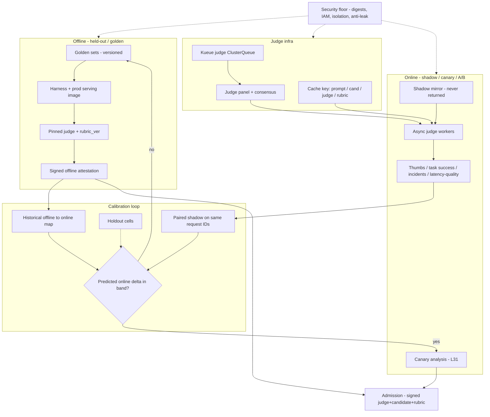

# Lesson 32 — AI/ML platform: offline/online eval consistency & LLM-as-judge at fleet scale

*2026-10-10*

## What interviewers are really probing

[Lesson 31](/lessons/31-evaluation-release-gating-canary-weights) built the gate: eval clusters, paired statistics, signed attestations, shadow and canary for new weights. That gate still fails in production when **offline scores and online metrics disagree** — the candidate "passed" every suite and then thumbs, task success, or safety incidents move the wrong way after canary. This lesson is the next operator layer: why those two worlds diverge, how to keep them calibrated at fleet scale, and how to run **LLM-as-judge as production infrastructure** (queues, digests, caches, admission) instead of a notebook someone re-runs before a release.

Cross-links you will lean on: [L27](/lessons/27-gpu-supply-chain-weight-registry-hydrate) (signed weights / hydrate), [L21](/lessons/21-inference-serving-slos-ttft-tpot-kvcache) (serving stack is part of quality), [L24](/lessons/24-multi-cluster-inference-routing-capacity) (cells and traffic mix), [L13](/lessons/13-ml-weights-checkpoint-hardening)/[L14](/lessons/14-ml-inference-training-deploy-hardening) (hardening primitives), [L16](/lessons/16-temporal-argo-workflows) (pipelines). Fuel framing: [wafer-ai/gpu-perf-engineering-resources](https://github.com/wafer-ai/gpu-perf-engineering-resources) — platform depth, not CUDA kernels.

What they check for:

- **Two eval worlds, one decision.** Held-out / golden suites versus production shadow, canary and A/B metrics (thumbs, task success, latency-coupled quality, safety incidents). Can you name what each can and cannot see?
- **Consistency failures.** Distribution shift, prompt/template drift, serving-stack mismatch (quant, TP, kernels), sampling params, judge-model drift, labeler/judge bias, online lag, cell-to-cell traffic mix. Which ones are bugs in the eval system versus real product risk?
- **Calibration loops.** Historical offline→online transfer, holdout cells, paired shadow scoring of candidate vs baseline on the **same** request IDs. How do you decide a canary is allowed to start?
- **LLM-as-judge at fleet scale.** Judge panel vs single judge, rubric versioning, position/length bias mitigations, consensus, GPU scheduling of judge traffic, caching by `(prompt_hash, candidate_digest, judge_digest, rubric_ver)`.
- **Infra, not notebooks.** Kueue/Argo/Temporal for offline suites; sidecar or async workers for online shadow judges; result store as **signed artifacts** that [L31](/lessons/31-evaluation-release-gating-canary-weights) admission reads.
- **Security.** Judge weights digests and signing, eval prompt/dataset provenance, bucket IAM for offline corpora and online shadow logs, network isolation of judge workers, admission so only signed judge+candidate pairs run, secrets for judge API keys, train/test leakage and eval-set exfiltration.

**Interview sentence:** "I treat offline and online as two instruments that have to agree within a calibrated band. Offline suites run on the exact production serving artifact with digest-pinned judge and rubric; online I pair shadow-score the same request IDs against baseline so traffic mix drops out. Historical regressions give me a transfer function from offline Δ to online Δ per slice — if the predicted online move is outside the non-inferiority band, the canary doesn't start. Judges are a Kueue-queued fleet with cache keys on prompt, candidate, judge and rubric digests, and admission refuses any judge or candidate that isn't cosign-verified."

## Core diagram: Offline suites ↔ Calibration ↔ Online shadow/canary (+ judge infra & security floor)

![Offline/online eval consistency and LLM-as-judge at fleet scale: offline held-out suites and online shadow/canary metrics feed a calibration loop that maps offline deltas to online deltas with holdout cells and paired shadow scoring; LLM-as-judge runs as production infrastructure with panel consensus, rubric versioning, bias mitigations and score caching; results are signed artifacts for admission; security floor covers judge weight digests, dataset provenance, bucket IAM, network isolation and anti-leakage](/offline-online-eval-consistency-llm-judge.png)



**How to read it:** left is the offline world that produces a signed attestation ([L31](/lessons/31-evaluation-release-gating-canary-weights)); right is production traffic scored asynchronously; the middle is the transfer function and paired design that keep them honest. Judge infra is a first-class GPU workload with its own queue and cache. The PNG packs the failure modes, Prometheus names and the security floor.

## Idiosyncrasies / operator depth

### 1. Offline and online answer different questions — force them to share a contract

| Mode | Question | What it sees | What it misses |
|---|---|---|---|
| **Offline held-out / golden** | Is this candidate at least as good as baseline on the curated suite? | Controlled items, pinned stack, paired design | Live distribution, seasonality, multi-turn user adaptation, tool side-effects |
| **Offline simulated (agents)** | Does the agent succeed under a user-LLM / persona simulator? | Controllable multi-turn | Simulator persona drift (too-nice users → inflated pass rates) |
| **Online shadow** | On real requests, does candidate look like baseline when scored the same way? | Live mix, same IDs | No user-visible outcome; tools must be stubbed |
| **Online canary / A/B** | Do real users and business metrics move? | Thumbs, task success, incidents, latency-coupled quality | Slow power at 1–5%; cell mix bias |

The contract that ties them: **same serving artifact, same judge digest + rubric_ver, same sampling params, and (for calibration) same request IDs in paired shadow.** If any of those differ, disagreement is expected and uninformative.

### 2. Consistency failures — diagnose before you "fix" the suite

| Failure | Symptom | Operator fix |
|---|---|---|
| **Distribution shift** | Offline green, online thumbs down in one locale / device / time-of-day | Re-weight golden sets from recent production strata; add holdout-cell truth; promote failing online slices into offline suites |
| **Prompt / template drift** | Scores move after an "infra" change | Pin chat template and system-prompt digests in the eval manifest; treat template changes as model releases |
| **Serving stack mismatch** | Research harness ≠ prod FP8 / TP / kernels ([L21](/lessons/21-inference-serving-slos-ttft-tpot-kvcache), [L27](/lessons/27-gpu-supply-chain-weight-registry-hydrate)) | Evaluate the artifact you ship through the production OpenAI-compatible endpoint |
| **Sampling params** | Greedy offline, sampled online (or different max tokens) | Manifest pins temperature, top-p, max tokens, stop sequences; gate on both quality **and** output-length |
| **Judge model drift** | Online judge scores creep for months with no model change | Pin judge weights / provider version; re-baseline on any judge change; track judge–human κ as an SLI |
| **Labeler / judge bias** | Prefer longer answers, first position, self-family models (Zheng et al. MT-Bench / Chatbot Arena) | Swap A/B order; length-normalize or binary pass/fail; different model family for judge; panel consensus |
| **Timing lag** | Offline said ship; online detects regression two days later | Shadow judge SLO (e.g. 95% of shadow pairs scored within 15 min); canary bake sized to minimum detectable effect |
| **Cell-to-cell mix** ([L24](/lessons/24-multi-cluster-inference-routing-capacity)) | Canary cell green; another region red | Per-cell waves; per-slice online metrics; never promote from one unrepresentative cell |

### 3. Calibration loops — offline Δ predicts online Δ, or the gate is incomplete

A release platform without a transfer function will keep shipping "offline wins" that don't move product metrics. Build the loop:

1. **Historical regressions.** For every past candidate that reached canary (pass or fail), store offline paired Δ per slice and the observed online Δ (thumbs rate, task-success, online-judge pass rate, safety incident rate, TTFT/TPOT, output length).
2. **Fit a simple transfer per slice.** Start with linear: `online_delta ≈ α · offline_delta + ε`. Re-fit after judge or rubric changes. You are not publishing a paper — you need a **band** that says "this offline win usually becomes a +0.3–0.8pp thumbs move; an offline +2pp that historically maps to online −0.5pp is a red flag."
3. **Holdout cells.** Reserve one or more cells that never get first-wave canaries. They are the truth set for transfer validation and for catching cell-mix lies.
4. **Paired shadow on the same request IDs.** Mirror traffic to baseline and candidate; score both with the same judge. Traffic mix drops out of the comparison the same way paired offline items drop question difficulty out of the gate ([L31](/lessons/31-evaluation-release-gating-canary-weights)).
5. **Gate rule.** Offline attestation pass **and** predicted online Δ within non-inferiority band → allow canary. Override is signed, logged, expiring — same pattern as L31 threshold overrides.

### 4. LLM-as-judge at fleet scale — treat it like inference capacity

A judge is a model with known failure modes. At fleet scale it is also a **GPU product**:

| Concern | Practice |
|---|---|
| **Panel vs single** | One judge is a single point of bias and silent drift. For release-critical slices, run a small panel (2–3 digests, ideally different families) and require consensus or majority; log disagreements for meta-eval |
| **Rubric versioning** | `rubric_ver` is part of the identity of a score. Changing the rubric without bumping the version poisons every time series and every cache entry |
| **Bias mitigations** | Randomize candidate/baseline presentation order; prefer categorical / binary labels over 1–10 scales (numeric judges collapse to extremes); length-normalize or judge "task success" not "eloquence"; never use the candidate's own family as sole judge |
| **Consensus** | Disagree → human queue or third judge; don't average away disagreement — it is signal about rubric ambiguity |
| **Cost & scheduling** | Dedicated Kueue ClusterQueue for judges (borrow idle from training/serving); online shadow uses sample rate + cache; offline full suites can use spot/preemptible for non-gate exploratory runs ([L20](/lessons/20-training-inference-scheduling-kueue-volcano), [L26](/lessons/26-gpu-cost-attribution-reclaim-spot)) |
| **Caching** | Key = `(prompt_hash, candidate_digest, judge_digest, rubric_ver)`. Invalidate on any digest change. Cache hits are the difference between "judge GPU budget = serving budget" and "judge GPU budget = 5–15% of serving" |
| **Meta-eval as an SLI** | Maintain a human-labeled golden set; track Cohen's κ / precision-recall of the judge; gate **judge releases** the way you gate model releases |

### 5. Infra shape: pipelines offline, async workers online, signed store in the middle

- **Offline:** Argo Workflows or Temporal ([L16](/lessons/16-temporal-argo-workflows)) orchestrates suite runs on a Kueue eval/judge queue. Manifest pins everything. Gate job emits the L31 attestation.
- **Online:** Gateway mirrors a sample (or sticky subset) to a shadow InferencePool; responses never return to the user; tool calls are stubbed. Async judge workers pull `(request_id, baseline_out, candidate_out)` from a queue, write scores to the result store.
- **Result store:** Object store / DB with **content-addressed** score artifacts, signed by the judge-worker identity. Canary analysis ([L31](/lessons/31-evaluation-release-gating-canary-weights) AnalysisTemplate) and admission read only verified artifacts.
- **Prometheus names (illustrative):** `eval_offline_online_delta`, `eval_judge_human_kappa`, `eval_judge_cache_hit_ratio`, `eval_judge_gpu_seconds_total`, `eval_shadow_pair_score`, `eval_canary_predicted_vs_observed`, `eval_serving_stack_mismatch`.

### 6. Ownership

Eval platform owns digests, rubrics, judge releases, transfer bands and the signed store. Product owns slice definitions and business metrics. On-call owns canary abort. Nobody silently edits a rubric in a ConfigMap.

## Concrete commands & config

### Pin the contract in an eval manifest

```yaml
# eval-manifest.yaml — every offline run and every online judge score references this
apiVersion: eval.corp/v1
kind: EvalManifest
metadata:
  name: cand-2026-10-10
spec:
  candidateDigest: "sha256:9f3c…"          # OCI weights (L27)
  baselineDigest: "sha256:1a2b…"
  servingImage: "registry.corp/vllm@sha256:77aa…"
  chatTemplateDigest: "sha256:c01d…"
  sampling: {temperature: 0.0, topP: 1.0, maxTokens: 2048}
  harnessDigest: "sha256:55ee…"
  judge:
    panel:
      - digest: "sha256:j1…"
        weight: 1
      - digest: "sha256:j2…"
        weight: 1
    rubricVer: "task-success/v4"
    consensus: majority
  dataset: {name: "golden-product", version: "2026.10.01", digest: "sha256:d0…" }
  transferBand:
    thumbs_pp: [-0.3, 0.8]               # predicted online Δ band for this offline Δ
    task_success_pp: [-0.2, 1.0]
```

### Kueue: judge queue next to the eval queue

```yaml
apiVersion: kueue.x-k8s.io/v1beta1
kind: ClusterQueue
metadata: {name: cq-judge}
spec:
  cohort: gpu-fleet
  resourceGroups:
  - coveredResources: ["nvidia.com/gpu"]
    flavors:
    - name: serve-h100
      resources:
      - name: "nvidia.com/gpu"
        nominalQuota: 64          # reserved floor for release judges
        borrowingLimit: 192       # borrow idle from training/serving
  queueingStrategy: BestEffortFIFO
---
apiVersion: kueue.x-k8s.io/v1beta1
kind: LocalQueue
metadata: {name: lq-judge, namespace: eval-llm}
spec: {clusterQueue: cq-judge}
```

### Offline suite Job (production stack + pinned judge)

```yaml
apiVersion: batch/v1
kind: Job
metadata:
  name: offline-suite-cand-2026-10-10
  namespace: eval-llm
  labels: {kueue.x-k8s.io/queue-name: lq-judge}
spec:
  template:
    spec:
      serviceAccountName: eval-runner
      restartPolicy: Never
      containers:
      - name: harness
        image: registry.corp/eval-harness@sha256:55ee…
        env:
        - {name: CANDIDATE_ENDPOINT, value: "http://cand-pool.eval-llm:8000/v1"}
        - {name: BASELINE_ENDPOINT, value: "http://base-pool.eval-llm:8000/v1"}
        - {name: JUDGE_ENDPOINT, value: "https://judge-gw.eval-llm:8443/v1"}
        - {name: MANIFEST_DIGEST, value: "sha256:m…"}
        - {name: RESULTS_URI, value: "s3://eval-results/offline/cand-2026-10-10/"}
        resources:
          limits: {cpu: "8", memory: 32Gi}
      # Candidate / baseline InferencePools already running the L27 OCI weights @ digest
```

### Online paired shadow + async judge worker

```yaml
# Gateway mirrors 5% sticky-by-conversation to shadow pool; responses discarded.
# Judge Deployment pulls pairs and writes signed scores.
apiVersion: apps/v1
kind: Deployment
metadata: {name: shadow-judge-worker, namespace: eval-llm}
spec:
  replicas: 8
  selector: {matchLabels: {app: shadow-judge}}
  template:
    metadata: {labels: {app: shadow-judge}}
    spec:
      serviceAccountName: judge-worker
      containers:
      - name: worker
        image: registry.corp/shadow-judge@sha256:ab12…
        env:
        - {name: PAIR_QUEUE, value: "redis://eval-bus/shadow-pairs"}
        - {name: JUDGE_PANEL, value: "sha256:j1…,sha256:j2…"}
        - {name: RUBRIC_VER, value: "task-success/v4"}
        - {name: SCORE_BUCKET, value: "s3://eval-results/online-scores/"}
        - {name: CACHE_REDIS, value: "redis://eval-bus/judge-cache"}
        resources:
          limits: {cpu: "4", memory: 16Gi}
        # GPU judges are separate InferencePools; this worker is CPU + network
```

### Cache key and Prometheus drift alert

```python
# judge_cache.py — key must include every identity that can change a score
import hashlib

def judge_cache_key(prompt: str, cand_digest: str, judge_digest: str, rubric_ver: str) -> str:
    h = hashlib.sha256(prompt.encode()).hexdigest()
    return f"judge:{h}:{cand_digest}:{judge_digest}:{rubric_ver}"
```

```promql
# Alert when offline→online transfer breaks for a slice
abs(eval_offline_online_delta{slice="code",metric="task_success"})
  > on(slice) group_left eval_transfer_band_abs{slice="code",metric="task_success"}
```

### cosign: verify judge weights + score attestation

```bash
# Judge weights must be signed by the model-release identity (same as L27/L31).
cosign verify \
  --certificate-identity "https://kubernetes.io/namespaces/release/serviceaccounts/model-release" \
  --certificate-oidc-issuer "https://oidc.eks.us-east-1.amazonaws.com/id/EXAMPLE" \
  registry.corp/models/judge-task-success@sha256:j1…

# Online/offline score artifact attested by judge-worker identity.
cosign verify-attestation \
  --type https://corp.example/attestations/judge-score/v1 \
  --certificate-identity "https://kubernetes.io/namespaces/eval-llm/serviceaccounts/judge-worker" \
  --certificate-oidc-issuer "https://oidc.eks.us-east-1.amazonaws.com/id/EXAMPLE" \
  registry.corp/eval-results/online-scores@sha256:sc0re…
```

### S3/GCS IAM sketch (offline corpora ≠ training; shadow logs short-lived)

```json
{
  "Version": "2012-10-17",
  "Statement": [
    {
      "Sid": "EvalRunnerReadGolden",
      "Effect": "Allow",
      "Principal": {"AWS": "arn:aws:iam::123:role/eval-runner"},
      "Action": ["s3:GetObject"],
      "Resource": "arn:aws:s3:::eval-corpora/golden/*"
    },
    {
      "Sid": "DenyTrainingReadGolden",
      "Effect": "Deny",
      "Principal": {"AWS": "arn:aws:iam::123:role/trainer-*"},
      "Action": ["s3:*"],
      "Resource": ["arn:aws:s3:::eval-corpora/*", "arn:aws:s3:::eval-corpora"]
    },
    {
      "Sid": "ShadowLogsWriteOnlyShortTTL",
      "Effect": "Allow",
      "Principal": {"AWS": "arn:aws:iam::123:role/judge-worker"},
      "Action": ["s3:PutObject"],
      "Resource": "arn:aws:s3:::eval-shadow-logs/redacted/*"
    }
  ]
}
```

Pair with Object Lock / retention on golden corpora, lifecycle delete on shadow logs (e.g. 7–14 days), and KMS keys per bucket so a compromised training role cannot decrypt eval data even if a policy is mis-set.

### Kyverno: only signed judge + candidate + rubric pairs

```yaml
apiVersion: kyverno.io/v1
kind: ClusterPolicy
metadata: {name: require-signed-judge-candidate-pair}
spec:
  validationFailureAction: Enforce
  rules:
  - name: judge-and-candidate-attested
    match:
      any:
      - resources:
          kinds: [Pod]
          namespaces: ["eval-llm", "serve-*"]
    verifyImages:
    - imageReferences: ["registry.corp/models/*"]
      verifyDigest: true
      required: true
      attestors:
      - entries:
        - keyless:
            subject: "https://kubernetes.io/namespaces/release/serviceaccounts/model-release"
            issuer: "https://oidc.eks.us-east-1.amazonaws.com/id/EXAMPLE"
      attestations:
      - type: https://corp.example/attestations/eval-gate/v1
        attestors:
        - entries:
          - keyless:
              subject: "https://kubernetes.io/namespaces/eval-llm/serviceaccounts/eval-gate"
              issuer: "https://oidc.eks.us-east-1.amazonaws.com/id/EXAMPLE"
```

## Failures & fixes

| Symptom | Likely cause | Fix / mitigation |
|---|---|---|
| Offline +3pp, online thumbs flat or down | Distribution shift; suite not representative | Re-sample golden from recent strata; add failing online slices to offline; check holdout cells |
| Offline green, online judge red | Different judge digest / rubric_ver online vs offline | One manifest; same panel and rubric for both; cache key includes both digests |
| Scores jumped after "prompt tweak" | Chat template / system prompt not in manifest | Template digest in manifest; treat as a model release |
| Candidate wins offline, loses paired shadow | Serving stack mismatch (quant/TP/kernels) or sampling | Evaluate production artifact; pin sampling; load-test output length ([L21](/lessons/21-inference-serving-slos-ttft-tpot-kvcache)) |
| Judge scores drift for months, no model change | Provider silent update; unpinned judge tag | Digest-only; re-baseline; κ SLI alert |
| Prefer longer / first answer | Length / position bias | Swap order; binary task-success; length-normalize |
| Canary cell green, next region red | Cell traffic mix ([L24](/lessons/24-multi-cluster-inference-routing-capacity)) | Per-cell waves; holdout cells; per-slice online metrics |
| Shadow judge backlog → late abort | Under-provisioned judge queue; no sample/cache | Kueue floor; raise sample only after cache hit ratio healthy; SLO on score lag |
| Online A/B underpowered at 1% | Bake too short / effect too small | Size from MDE; paired design; don't call "no difference" without power |
| Simulator users too nice → 95% offline pass | User-LLM not like real users | Fine-tune / constrain personas from real verbatim (Lyft-style); expect scores to drop when realism rises |
| Train job can read golden set | Bucket policy hole | Explicit Deny for trainer roles; separate KMS; audit data-access logs |
| Eval set found in a crawl / HF dump | Exfil from eval NS or leaked notebook | Default-deny egress; canary strings; no internet; results write-only |
| Admission let unsigned judge run | Policy only on serving, not eval-llm | verifyImages in eval-llm too; CI deny-path test |
| Cache returns stale score after rubric edit | rubric_ver not in key / not bumped | Key includes rubric_ver; bump on every rubric change |
| Judge API key in GPU pod env | Secrets sprawl | Sealed SA / external secrets only on judge-gw; GPU pods talk mTLS to gateway |

## Security & hardening

**Judges and eval corpora are as sensitive as production weights — sometimes more, because a leaked golden set permanently contaminates every future score.** Apply [L11](/lessons/11-cluster-security-pss-admission-rbac)–[L14](/lessons/14-ml-inference-training-deploy-hardening) and [L27](/lessons/27-gpu-supply-chain-weight-registry-hydrate) explicitly to the judge path and to offline/online data planes. The dedicated controls below are required for this lesson.

### Model / judge weights, digests & signing

| Control | Threat | Practice |
|---|---|---|
| **Judge weights digest-pinned & signed** | Tag floats to a new judge; self-preference or silent quality change | Judge models ship as L27 OCI artifacts; cosign / OpenSSF model signing; Jobs and InferencePools reference `@sha256:` only |
| **Candidate + judge pair admission** | Unsigned judge scores a candidate, or a failed candidate is scored with a friendly judge | Admission requires signed weights **and** a passing eval-gate / judge-score attestation naming both digests and `rubric_ver` |
| **Separate judge registry prefix** | Serving SA pulls an experimental judge; someone overwrites the release judge | `models/judges/released/` write-only by release job; Object Lock; serving/judge identities get `GetObject` only |
| **Safe load path** | Malicious judge checkpoint executes code | safetensors only; `trust_remote_code` off unless pinned & reviewed; scan judge chat templates as code |

### Eval prompt / dataset provenance & anti-leakage

| Control | Threat | Practice |
|---|---|---|
| **Dataset & prompt provenance** | Untracked golden edit; train/test leakage | Manifest lists dataset digest + prompt-template digest; canary strings embedded; lineage from [L30](/lessons/30-training-data-loading-storage-io) |
| **Bucket IAM split** | Training or ad-hoc notebooks read golden / shadow | Offline corpora: read-only to `eval-runner`; **Deny** all `trainer-*`; shadow logs: write-only for `judge-worker`, short TTL, redaction before write |
| **Prevent train/test leakage** | Eval items in pretraining mix | Dedup training data against eval digests; private sets never leave the enclave; alert if canary strings appear in model outputs on public benches |
| **Eval-set exfiltration** | Compromised eval/judge pod ships the suite out | Default-deny egress ([L9](/lessons/09-networkpolicy-multi-nic-sflow)); allow only registry, results VPC endpoint, internal judge gateway; no internet; `automountServiceAccountToken: false` on sandboxes |

### Network isolation, secrets, RBAC

| Control | Threat | Practice |
|---|---|---|
| **Network isolation of judge workers** | Prompt/response (user data) exfil; lateral move | NetworkPolicy: DNS + judge InferencePool + results endpoint only; mTLS to gateway |
| **Secrets for judge API keys** | Key in env on GPU nodes; CI logs | External Secrets / sealed secrets only on `judge-gw`; scoped, rotatable; GPU judge pods authenticate with workload identity, not provider API keys when self-hosted |
| **RBAC / separation of duties** | Release pressure edits rubric or transfer band | Rubric + transfer-band GitOps with eval-platform reviewers; version in every attestation; break-glass override signed + expiring |
| **Shadow logs are user data** | PII in score store | Redact at gateway; classify like prod; retention days not months; no tool side-effects in shadow ([L31](/lessons/31-evaluation-release-gating-canary-weights)) |

```yaml
# Judge / eval namespace egress — no internet
apiVersion: networking.k8s.io/v1
kind: NetworkPolicy
metadata: {name: judge-egress, namespace: eval-llm}
spec:
  podSelector: {}
  policyTypes: [Egress]
  egress:
  - to:
    - namespaceSelector: {matchLabels: {kubernetes.io/metadata.name: kube-system}}
      podSelector: {matchLabels: {k8s-app: kube-dns}}
    ports: [{protocol: UDP, port: 53}]
  - to:
    - namespaceSelector: {matchLabels: {platform.example.com/role: judge}}
    ports: [{protocol: TCP, port: 8443}]
  - to:
    - ipBlock: {cidr: 10.20.0.0/24}   # VPC endpoints: registry + results + corpora
    ports: [{protocol: TCP, port: 443}]
```

## Interview soundbites

- **"Offline and online are two instruments. I keep them on the same contract — same serving artifact, same judge digest and rubric version — and I calibrate offline Δ to online Δ with historical regressions and holdout cells."**
- **"Paired shadow on the same request IDs removes traffic-mix noise the same way paired offline items remove question-difficulty noise."**
- **"If predicted online move from the transfer band is outside non-inferiority, the canary does not start — even if every offline suite is green."**
- **"A judge is a pinned dependency and a GPU product: Kueue queue, panel consensus, cache key on prompt, candidate, judge and rubric digests."**
- **"Numeric 1–10 judges collapse to extremes; I prefer binary task-success labels, swapped A/B order, and a different model family than the candidate."**
- **"Rubric_ver is part of the score identity. Change the rubric without bumping the version and you poison every time series and every cache entry."**
- **"Judge–human Cohen's κ is an SLI of the eval system. Judge releases get gated like model releases."**
- **"Golden sets are crown jewels: trainers are Denied by bucket policy, judge workers have no internet, and admission only runs cosign-verified judge+candidate+rubric pairs."**
- **"Next: Lesson 33 — prompt/tool catalog versioning and serving config as code at fleet scale."**

## How this maps to the JD

Roles that say **"build evaluation infrastructure," "ensure offline and online metrics agree," "LLM-as-judge in production,"** or **"ship models safely to a global inference fleet"** are asking whether you can make the L31 gate *trustworthy over time* — not just pass once. This lesson connects [L31](/lessons/31-evaluation-release-gating-canary-weights) (gates/canary), [L27](/lessons/27-gpu-supply-chain-weight-registry-hydrate) (signed weights), [L21](/lessons/21-inference-serving-slos-ttft-tpot-kvcache) (stack = quality), [L24](/lessons/24-multi-cluster-inference-routing-capacity) (cells), [L20](/lessons/20-training-inference-scheduling-kueue-volcano)/[L26](/lessons/26-gpu-cost-attribution-reclaim-spot) (judge capacity/cost), [L16](/lessons/16-temporal-argo-workflows) (pipelines), and [L13](/lessons/13-ml-weights-checkpoint-hardening)/[L14](/lessons/14-ml-inference-training-deploy-hardening) (hardening). Fuel: [wafer-ai/gpu-perf-engineering-resources](https://github.com/wafer-ai/gpu-perf-engineering-resources).

## Watch (talks & demos)

Real talks. Watch them after Failures & fixes.

### Lessons from the Trenches: Building LLM Evals That Work IRL

Aparna Dhinakaran (Arize), AI Engineer World's Fair. Model evals vs task evals, component-level judges (router / tool args), why numeric scores collapse to binary extremes, and the observe→evaluate→explain→dataset loop. Operator takeaway: section 4's preference for actionable categorical labels over vague 1–10 "quality," and why explanations are first-class for debugging consistency failures. Vendor talk — take the concepts.

<iframe width="100%" height="360" src="https://www.youtube.com/embed/nbZzSC5A6hs" title="Lessons from the Trenches: Building LLM Evals That Work IRL - Aparna Dhinakaran" frameBorder="0" allow="accelerometer; autoplay; clipboard-write; encrypted-media; gyroscope; picture-in-picture; web-share" allowFullScreen></iframe>

[Open on YouTube](https://www.youtube.com/watch?v=nbZzSC5A6hs)

### Build Evals That Actually Matter

Nick Ung & Akshay Sharma (Lyft), AI Engineer World's Fair. End-to-end offline simulator + launch gate + online graders for a multi-agent support system; making user-LLMs realistic; treating judges as binary classifiers with precision/recall against human labels; statistical power on small gains. Operator takeaway: the offline↔online loop in sections 1–3, and why an eval that isn't a gate is theater.

<iframe width="100%" height="360" src="https://www.youtube.com/embed/3z2uT5aDx_Y" title="Build Evals That Actually Matter - Nick Ung and Akshay Sharma, Lyft" frameBorder="0" allow="accelerometer; autoplay; clipboard-write; encrypted-media; gyroscope; picture-in-picture; web-share" allowFullScreen></iframe>

[Open on YouTube](https://www.youtube.com/watch?v=3z2uT5aDx_Y)

### LLM-as-a-Judge 101

Elizabeth (Arize Phoenix). Building a judge: look at data → define specific/answerable/actionable metrics → prompt + model selection → **meta-evaluation** (human alignment, confusion matrices). Operator takeaway: section 4's meta-eval SLI, why not to use the same model family as sole judge, and why categorical labels beat numeric scales.

<iframe width="100%" height="360" src="https://www.youtube.com/embed/pnlT_xatpVQ" title="LLM-as-a-Judge 101 - Elizabeth, Arize" frameBorder="0" allow="accelerometer; autoplay; clipboard-write; encrypted-media; gyroscope; picture-in-picture; web-share" allowFullScreen></iframe>

[Open on YouTube](https://www.youtube.com/watch?v=pnlT_xatpVQ)

## References

- Judges & statistics: [Judging LLM-as-a-Judge with MT-Bench and Chatbot Arena (Zheng et al.)](https://arxiv.org/abs/2306.05685) · [Adding Error Bars to Evals (Miller, arXiv 2411.00640)](https://arxiv.org/abs/2411.00640) · [LLM-as-a-Judge 101 (Arize)](https://www.youtube.com/watch?v=pnlT_xatpVQ) · [LLM as a Judge 102: Meta Evaluation](https://www.youtube.com/watch?v=n-OjcXS4Smc)
- Offline / online practice: [Build Evals That Actually Matter (Lyft)](https://www.youtube.com/watch?v=3z2uT5aDx_Y) · [Lessons from the Trenches (Aparna Dhinakaran)](https://www.youtube.com/watch?v=nbZzSC5A6hs) · [Deepchecks: Online vs Offline LLM Evaluation](https://deepchecks.com/question/online-vs-offline-llm-evaluation/)
- Harnesses: [EleutherAI lm-evaluation-harness](https://github.com/EleutherAI/lm-evaluation-harness) · [UK AISI Inspect](https://github.com/UKGovernmentBEIS/inspect_ai) · [Stanford HELM](https://github.com/stanford-crfm/helm)
- Infra: [Kueue](https://kueue.sigs.k8s.io/) · [Argo Workflows](https://argoproj.github.io/argo-workflows/) · [Temporal](https://temporal.io/) · [Argo Rollouts analysis](https://argoproj.github.io/argo-rollouts/features/analysis/) · [Gateway API Inference Extension](https://gateway-api-inference-extension.sigs.k8s.io/)
- Security & provenance: [OpenSSF model signing (sigstore/model-transparency)](https://github.com/sigstore/model-transparency) · [cosign attestations](https://docs.sigstore.dev/cosign/verifying/attestation/) · [Kyverno](https://kyverno.io/docs/) · [SLSA provenance](https://slsa.dev/spec/v1.0/provenance)
- [wafer-ai/gpu-perf-engineering-resources](https://github.com/wafer-ai/gpu-perf-engineering-resources) — AI/ML platform fuel
- Prior: [31 — Evaluation / release gating / canary](/lessons/31-evaluation-release-gating-canary-weights) · [30 — Training data loading](/lessons/30-training-data-loading-storage-io) · [27 — GPU supply chain / hydrate](/lessons/27-gpu-supply-chain-weight-registry-hydrate) · [24 — Multi-cluster routing](/lessons/24-multi-cluster-inference-routing-capacity) · [21 — Inference SLOs](/lessons/21-inference-serving-slos-ttft-tpot-kvcache) · [20 — Kueue](/lessons/20-training-inference-scheduling-kueue-volcano) · [16 — Temporal / Argo](/lessons/16-temporal-argo-workflows) · [14 — ML deploy hardening](/lessons/14-ml-inference-training-deploy-hardening) · [13 — ML weights](/lessons/13-ml-weights-checkpoint-hardening) · [11 — PSS / admission / RBAC](/lessons/11-cluster-security-pss-admission-rbac) · [9 — NetworkPolicy](/lessons/09-networkpolicy-multi-nic-sflow)
- Next: **Lesson 33 — AI/ML platform: prompt/tool catalog versioning & serving config as code at fleet scale**

## Quick self-check

Out loud, in under two minutes each:

1. Offline suite +2.5pp on tool-use; paired shadow on the same request IDs shows −0.4pp task-success. Walk the diagnosis tree (shift, template, stack, sampling, judge, cell mix) and say what you check first.
2. Design the cache key and invalidation rules for judge scores so a rubric edit cannot silently reuse old scores. What else belongs in the key?
3. You have 50 canary traces and a +4pp online-judge bump. Is that real? What design (paired, MDE, bake time) would you demand before calling it a win?
4. Sketch identities, buckets, NetworkPolicies and admission so (a) trainers cannot read golden sets, (b) judge workers cannot reach the internet, (c) only cosign-verified judge+candidate+rubric pairs produce scores that canary analysis trusts.
5. How do you version and release a new judge model without invalidating six months of offline↔online calibration? What gets re-baselined?
